# CI/CD & GitHub Actions

**Author:** Saptak Banerjee
**Course:** SST DevOps & Cloud [SWE]
**Session:** 16 — CI/CD & GitHub Actions
**Source material:** [`devops-heros/session-16-github-actions`](https://github.com/Nency-Ravaliya/devops-heros/tree/main/session-16-github-actions) (project based on [`10-final-cicd-pipeline`](https://github.com/Nency-Ravaliya/devops-heros/tree/main/session-16-github-actions/session-16-github-actions/10-final-cicd-pipeline))

**Environment:** GitHub-hosted runners (`ubuntu-latest` = Ubuntu 24.04 image `20260927.320.1`, `macos-latest` = macOS 26 arm64), Python 3.12 / 3.13 / 3.14, a throwaway **kind** cluster (Kubernetes **v1.37.0**) created inside the runner, images in **GHCR**. Local checks on macOS with Docker 29.6.1 and Python 3.14.3. Every output below is a real capture from the runs linked here.

> **Which workflow file actually runs?** GitHub only executes workflows from the repository-root `.github/workflows/` directory, so the live pipeline is [`/.github/workflows/s16-cicd.yml`](../.github/workflows/s16-cicd.yml). An identical copy is kept in this folder as the deliverable: [`.github/workflows/s16-cicd.yml`](./.github/workflows/s16-cicd.yml). `defaults.run.working-directory` points every `run:` step at this folder.

**Green run (final):** https://github.com/Saptak-cyber/DevOps_Assignments/actions/runs/37547563915 (commit `79c12eb`)

---

## Table of Contents

| # | Topic |
| --- | --- |
| 0 | [Project layout & deliverables](#0-project-layout--deliverables) |
| 1 | [CI vs CD](#1-ci-vs-cd) |
| 2 | [CI/CD pipeline](#2-cicd-pipeline) |
| 3 | [GitHub Actions & the workflow](#3-github-actions--the-workflow) |
| 4 | [Jobs](#4-jobs) |
| 5 | [Steps](#5-steps) |
| 6 | [Runners](#6-runners) |
| 7 | [Secrets](#7-secrets) |
| 8 | [Artifacts](#8-artifacts) |
| 9 | [Build](#9-build) |
| 10 | [Test](#10-test) |
| 11 | [Pipeline execution — CI + CD, green and red](#11-pipeline-execution--ci--cd-green-and-red) |
| — | [Cleanup](#cleanup) |

---

## 0. Project Layout & Deliverables

```
CI-CD & GitHub Actions/
├── app/
│   ├── calculator.py        # instructor's calculator (add/subtract/multiply/divide + interactive CLI)
│   └── server.py            # added: stdlib JSON API around the same functions (needed for CD)
├── tests/
│   ├── test_calculator.py   # instructor's 5 tests
│   └── test_server.py       # added: 7 tests for the HTTP layer
├── build.sh                 # instructor's build script, extended (whole app/ package, commit/run id)
├── Dockerfile               # python:3.13-slim, non-root uid 10001, HEALTHCHECK
├── k8s/deployment.yaml      # 2 replicas, probes, limits, read-only root FS; image = __IMAGE__ placeholder
├── k8s/service.yaml         # ClusterIP :80 -> :8000
├── requirements.txt         # pytest 9.1.1, pytest-cov 7.1.0 (test-only; app is stdlib only)
├── pytest.ini / .coveragerc / .dockerignore / .gitignore
└── .github/workflows/s16-cicd.yml   # copy of the live workflow
```

| Teacher's deliverable | Where |
| --- | --- |
| Application source code | [`app/`](./app), [`tests/`](./tests) |
| Dockerfile | [`Dockerfile`](./Dockerfile) |
| GitHub Actions workflow | [`.github/workflows/s16-cicd.yml`](./.github/workflows/s16-cicd.yml) (runs from repo root) |
| CI pipeline | jobs `test` (matrix) → `test-report`, `security-check`, `build` |
| CD pipeline | jobs `docker` (build + push to GHCR) → `deploy` (kind + smoke test) |
| Screenshots of successful pipeline execution | [`screenshots/`](./screenshots/CAPTURE-LIST.md) |
| README.md | this file |

**Why `server.py` was added:** the class `calculator.py` is an interactive CLI that blocks on `input()`. That is fine for `pytest`, but a container running it would exit immediately (no stdin) and there would be nothing for Kubernetes probes or a smoke test to call. `server.py` exposes the *same* four functions over HTTP using only the standard library, so the image still has zero third-party runtime dependencies.

The instructor's CLI still works unchanged:

```
$ python3 app/calculator.py
Calculator Application
----------------------
Available operations: +, -, *, /
Type 'q' or 'quit' to exit.

Enter calculation (e.g., 10 + 5): Result: 15.0

Enter calculation (e.g., 10 + 5): Error: Cannot divide by zero

Enter calculation (e.g., 10 + 5): Invalid format. Please use: number operation number (e.g., 10 + 5 or 3+5)

Enter calculation (e.g., 10 + 5): Goodbye!
```

(input piped in was `10 + 5`, `7/0`, `2 ^ 3`, `q`.)

---

## 1. CI vs CD

| | **CI — Continuous Integration** | **CD — Continuous Delivery / Deployment** |
| --- | --- | --- |
| Question it answers | "Is this commit correct and buildable?" | "Can this exact build be released, and is it running?" |
| Trigger | every push / pull request | a CI build that passed (here: push to `main` or a manual run) |
| Output | test results, coverage, a build artifact | a versioned image in a registry, a rollout in a cluster |
| Jobs in this project | `test` ×4, `test-report`, `security-check`, `build` | `docker`, `deploy` |
| Fails when | a test fails, a sensitive file is committed, the build script errors | push to GHCR fails, rollout doesn't finish, smoke test assertion fails |

*Delivery* vs *deployment*: continuous **delivery** stops at "a releasable artefact is in the registry" (the `docker` job); continuous **deployment** goes on to roll it out automatically (the `deploy` job). This workflow does both, but the deployment target is a throwaway kind cluster inside the runner — the classroom note in session-17's `03-kubernetes-deployment` points out that a GitHub-hosted runner cannot reach a laptop's minikube, so creating the cluster *in* the runner is the only way to test a real `kubectl apply` + rollout without cloud credentials.

On pull requests the CD half deliberately degrades: the image is still **built** (proves the Dockerfile works) but `push: false`, and `deploy` is skipped (`if: github.event_name != 'pull_request'`).

---

## 2. CI/CD Pipeline

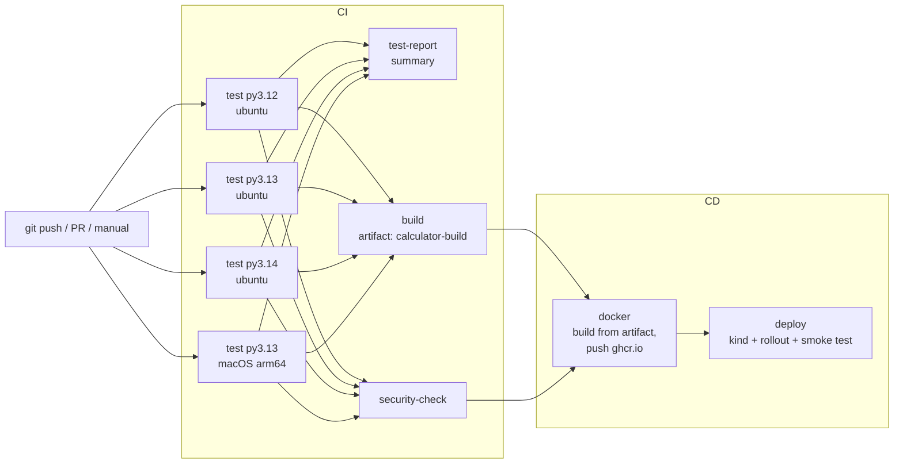

Compared with the class `10-final-cicd-pipeline` (test → build + security-check, artifact upload), this adds: a test **matrix** over Python versions and two runner OSes, test/coverage **reports as artifacts** plus a job that **downloads** and summarises them, the build artifact being **downloaded and turned into the image**, `GITHUB_TOKEN`-based **GHCR push**, and a **Kubernetes deployment with a smoke test**.

**Screenshot:** 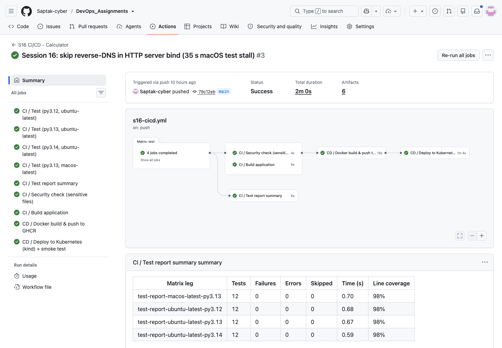

---

## 3. GitHub Actions & the Workflow

**File:** [`.github/workflows/s16-cicd.yml`](./.github/workflows/s16-cicd.yml)

```yaml
name: S16 CI/CD - Calculator

on:
  push:
    branches: [main]
    paths:
      - "CI-CD & GitHub Actions/**"
      - "!CI-CD & GitHub Actions/**/*.md"          # docs-only changes don't need a pipeline run
      - "!CI-CD & GitHub Actions/screenshots/**"
      - ".github/workflows/s16-cicd.yml"
  pull_request:
    branches: [main]
    paths: [ ...same list... ]
  workflow_dispatch:

permissions:
  contents: read            # least privilege; only the docker job adds packages: write

concurrency:
  group: s16-cicd-${{ github.ref }}
  cancel-in-progress: true

env:
  APP_DIR: "CI-CD & GitHub Actions"
  IMAGE_NAME: ghcr.io/saptak-cyber/s16-calculator   # GHCR names must be lowercase

defaults:
  run:
    shell: bash
    working-directory: "CI-CD & GitHub Actions"
```

| Setting | Why |
| --- | --- |
| `paths:` filter | the repo holds many sessions; only changes to this folder (or this workflow) run this pipeline. The `!…*.md` / `!…screenshots/**` negations mean committing this README does not trigger a rebuild + redeploy. |
| `workflow_dispatch` | lets me run the pipeline on any branch from the CLI — used for the failure demo in §11 (`gh workflow run s16-cicd.yml --ref <branch>`). |
| `permissions: contents: read` | the default `GITHUB_TOKEN` can do nothing but read code; write access to packages is granted only to the one job that needs it. |
| `concurrency` | a newer push to the same ref cancels an older in-flight run instead of racing it to `:latest`. |
| `defaults.run.working-directory` | the folder name contains spaces and `&`. As a YAML string it is passed to the runner as a cwd (not through a shell), so no quoting problems. `uses:` steps don't honour it, so their `path:`/`context:` inputs are written as `${{ env.APP_DIR }}/...`. |

---

## 4. Jobs

| Job id | Display name | `needs` | Runs on | Extra permissions |
| --- | --- | --- | --- | --- |
| `test` | CI / Test (py*, os) | — | matrix (4 legs) | — |
| `test-report` | CI / Test report summary | `test` | ubuntu-latest | — |
| `security-check` | CI / Security check (sensitive files) | `test` | ubuntu-latest | — |
| `build` | CI / Build application | `test` | ubuntu-latest | — |
| `docker` | CD / Docker build & push to GHCR | `build`, `security-check` | ubuntu-latest | `packages: write` |
| `deploy` | CD / Deploy to Kubernetes (kind) + smoke test | `docker` | ubuntu-latest | `packages: read` |

Jobs without a `needs:` relationship run **in parallel** on separate machines. The job timestamps from the green run show it — the three jobs that only need `test` all started within one second of each other once the slowest matrix leg (macOS) finished:

```
$ gh run view 37547563915 --json jobs --jq '.jobs[] | "\(.name)\t\(.conclusion)\t\(.startedAt)\t\(.completedAt)"'
CI / Test (py3.13, macos-latest)	success	2026-10-06T23:37:28Z	2026-10-06T23:37:46Z
CI / Test (py3.13, ubuntu-latest)	success	2026-10-06T23:37:22Z	2026-10-06T23:37:35Z
CI / Test (py3.12, ubuntu-latest)	success	2026-10-06T23:37:22Z	2026-10-06T23:37:34Z
CI / Test (py3.14, ubuntu-latest)	success	2026-10-06T23:37:22Z	2026-10-06T23:37:33Z
CI / Test report summary	success	2026-10-06T23:37:48Z	2026-10-06T23:37:54Z
CI / Security check (sensitive files)	success	2026-10-06T23:37:47Z	2026-10-06T23:37:51Z
CI / Build application	success	2026-10-06T23:37:47Z	2026-10-06T23:37:53Z
CD / Docker build & push to GHCR	success	2026-10-06T23:37:55Z	2026-10-06T23:38:14Z
CD / Deploy to Kubernetes (kind) + smoke test	success	2026-10-06T23:38:16Z	2026-10-06T23:39:20Z
```

`needs: test` on a matrix job means "**all** legs must pass" — one red leg blocks everything downstream (shown in §11). `docker` needs both `build` and `security-check`, so an accidentally committed `.env`/`*.pem`/`*.key` stops the release even though the tests pass. Jobs pass data to each other in two ways here: **artifacts** for files (§8) and **job outputs** for small strings (`docker` exports `image` and `digest`; `deploy` reads `needs.docker.outputs.image`).

---

## 5. Steps

A job is an ordered list of steps that share the runner's filesystem. Two kinds are used:

| Kind | Example from the workflow | What it does |
| --- | --- | --- |
| `uses:` (an action) | `actions/checkout@v7`, `actions/setup-python@v7`, `actions/upload-artifact@v7`, `actions/download-artifact@v8`, `docker/setup-buildx-action@v4`, `docker/login-action@v4`, `docker/build-push-action@v7`, `helm/kind-action@v1.15.1` | reusable code with `with:` inputs |
| `run:` (shell) | `./build.sh`, `pytest -v ...`, `kubectl rollout status ...` | a bash script in the job's working directory |

Step-level features used: `id:` + `steps.<id>.outputs` (image digest from `build-push-action`), `env:` (passing `secrets.GITHUB_TOKEN` into a script as `$TOKEN`), and conditions — `if: always()` uploads test reports even when tests fail, `if: failure()` dumps `kubectl describe`/events only when the deploy breaks, `if: github.event_name != 'pull_request'` skips the GHCR login on PRs. Each job also writes Markdown to `$GITHUB_STEP_SUMMARY`, which GitHub renders on the run page.

**Screenshot:** 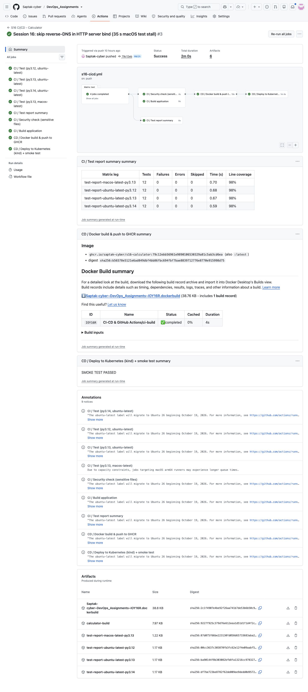

---

## 6. Runners

```yaml
  test:
    runs-on: ${{ matrix.os }}
    strategy:
      fail-fast: false
      matrix:
        os: [ubuntu-latest]
        python-version: ["3.12", "3.13", "3.14"]
        include:
          - os: macos-latest          # one extra leg on a different runner OS
            python-version: "3.13"
```

One job definition becomes **4 jobs on 4 fresh VMs**. `fail-fast: false` lets every leg finish so you see *which* combinations fail rather than having the others cancelled. The "Show runner details" step prints what each runner actually is:

```
Runner name : GitHub Actions 1000000833
Runner OS   : Linux (X64)
Image       : ubuntu24 20260927.320.1
Python 3.13.15
```

```
Runner name : GitHub Actions 1000000806
Runner OS   : macOS (ARM64)
Image       : macos26 20260907.0351.1
```

`ubuntu-latest` is an x64 Ubuntu 24.04 VM; `macos-latest` is an Apple-silicon (ARM64) macOS 26 VM. Both are GitHub-hosted, ephemeral (wiped after the job) and free for a public repository. The matrix found a real portability problem — see §10. A **self-hosted** runner (`runs-on: [self-hosted, linux]`) would be the option if the pipeline had to reach a private network such as an on-prem cluster; it wasn't needed here because the cluster is created inside the hosted runner.

GitHub also annotated every Linux job with: *"The ubuntu-latest label will migrate to Ubuntu 26 beginning October 19, 2026"* — a reminder that `-latest` labels move; pinning `ubuntu-24.04` is the reproducible choice.

**Screenshot:** 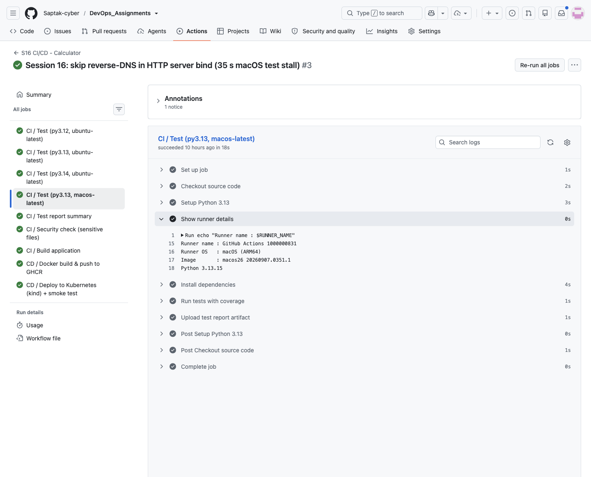

---

## 7. Secrets

No repository secret was needed: every credential in this pipeline is the automatic, per-run **`GITHUB_TOKEN`**.

| Where | Use |
| --- | --- |
| `docker` job | `docker/login-action` → `password: ${{ secrets.GITHUB_TOKEN }}` to push to `ghcr.io` (needs `packages: write`) |
| `deploy` job | `kubectl create secret docker-registry ghcr-pull --docker-password="$TOKEN"` so the kind node can pull from GHCR (needs `packages: read`) |

To prove the runner masks it, the `docker` job deliberately echoes it:

```yaml
      - name: "Secrets demo: GITHUB_TOKEN is masked in logs"
        env:
          TOKEN: ${{ secrets.GITHUB_TOKEN }}
        run: |
          echo "GITHUB_TOKEN present: $([ -n "$TOKEN" ] && echo yes || echo no), length ${#TOKEN}"
          echo "Echoing the token anyway -> $TOKEN"
```

Log of run 37547563915:

```
GITHUB_TOKEN present: yes, length 377
Echoing the token anyway -> ***
```

The value is registered with the runner as a secret, so any occurrence in the log is replaced by `***`. The `build-push-action` input dump shows the same (`github-token: ***`). Masking is a safety net, not a licence to print secrets: a transformed value (base64, reversed, split across lines) would **not** be masked.

**How a real repository secret would be added and used** (documented, not done — no secret was created for this assignment):

1. GitHub → repo **Settings → Secrets and variables → Actions → New repository secret**, name e.g. `DOCKERHUB_TOKEN` (or the CLI: `gh secret set DOCKERHUB_TOKEN`).
2. Reference it in the workflow — never inline in a script, always through `env:`:

```yaml
      - name: Log in to Docker Hub
        uses: docker/login-action@v4
        with:
          username: saptakbanerjee
          password: ${{ secrets.DOCKERHUB_TOKEN }}
```

Properties worth knowing: secrets are not passed to workflows triggered from **forks**; an unset secret evaluates to an empty string (so the step fails at login, not at parse time); **environment** secrets (`environment: production`) can additionally require a reviewer's approval before the job receives them. `GITHUB_TOKEN` is better than a personal access token wherever it suffices: it expires when the job ends and its scope is set by the `permissions:` block.

**Screenshot:** 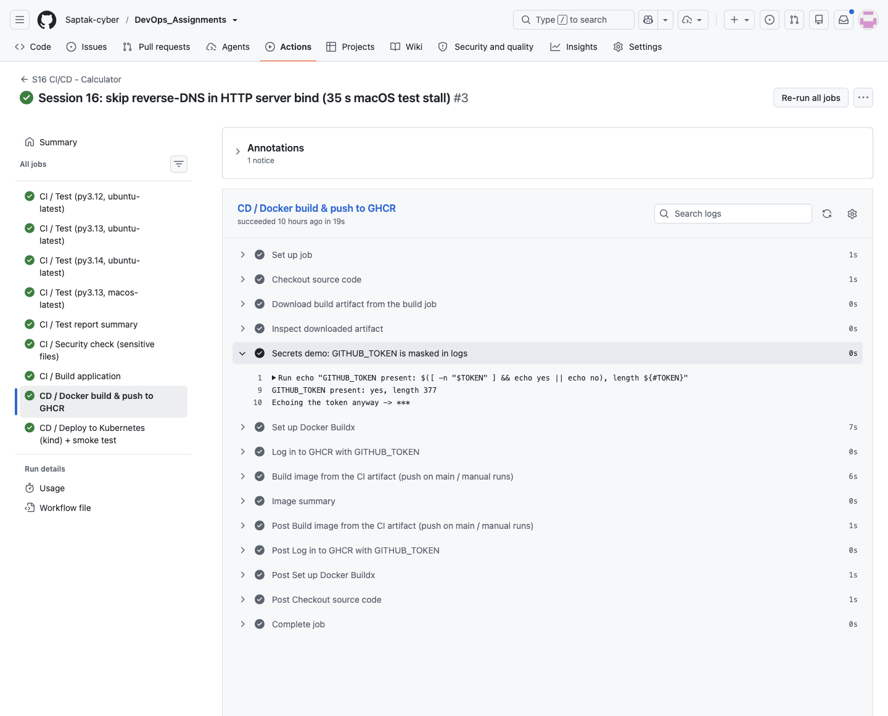

---

## 8. Artifacts

| Artifact | Uploaded by | Downloaded by | Content |
| --- | --- | --- | --- |
| `test-report-<os>-py<ver>` ×4 | each `test` leg (`if: always()`) | `test-report` (`pattern: test-report-*`) | `junit.xml`, `coverage.xml` |
| `calculator-build` | `build` | `docker` | `app/*.py` + compiled `__pycache__` + `build-info.txt` |
| `…dockerbuild` | `docker/build-push-action` (automatic) | — | BuildKit build record |

Upload (from the `build` job):

```
With the provided path, there will be 7 files uploaded
...
Artifact calculator-build has been successfully uploaded! Final size is 8161 bytes. Artifact ID is 11451685415
Artifact download URL: https://github.com/Saptak-cyber/DevOps_Assignments/actions/runs/37547563915/artifacts/11451685415
```

Download in a later job, on a different machine (from the `docker` job), with the integrity check:

```
Preparing to download the following artifacts:
- calculator-build (ID: 11451685415, Size: 8161, Expected Digest: sha256:9227f925c379d76e612eea1d51d1f1d4f2c74486bbc34a2bd1f418b03b4c58e2)
Starting download of artifact to: /home/runner/work/DevOps_Assignments/DevOps_Assignments/CI-CD & GitHub Actions/ci-build
SHA256 digest of downloaded artifact is 9227f925c379d76e612eea1d51d1f1d4f2c74486bbc34a2bd1f418b03b4c58e2
Artifact download completed successfully.
ci-build/app/__init__.py
ci-build/app/calculator.py
ci-build/app/server.py
ci-build/build-info.txt
Application: Session 16 Calculator
Build Status: SUCCESS
Build Date: 2026-10-06T23:37:49Z
Commit: 79c12ebb56961e9890106530329a81c5ab3cd6ea
Workflow Run: 37547563915 (attempt 1)
```

The image is built with `context: ${{ env.APP_DIR }}/ci-build` — i.e. **from the artifact**, not from a fresh checkout. "Build once, promote the same bytes" is the point of passing artifacts between jobs. The 4 test reports are downloaded in one step with `pattern:` and turned into a table (see §10). Run-level listing:

```
ARTIFACTS
calculator-build
test-report-ubuntu-latest-py3.12
test-report-macos-latest-py3.13
test-report-ubuntu-latest-py3.13
Saptak-cyber~DevOps_Assignments~IOY16R.dockerbuild
test-report-ubuntu-latest-py3.14
```

Artifacts use `retention-days: 14` instead of the 90-day default — they are evidence for a run, not releases (the image in GHCR is the release).

**Screenshot:** 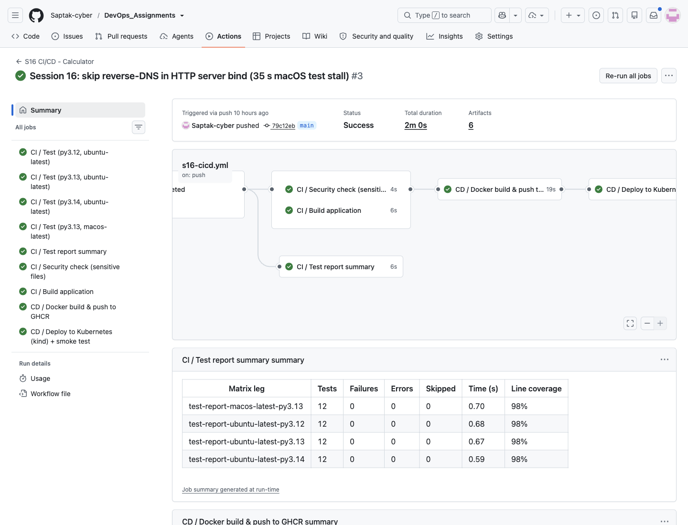

---

## 9. Build

**Script:** [`build.sh`](./build.sh) — the class script, extended to package the whole `app/` package, byte-compile it, and stamp the commit and run id (`GITHUB_SHA`, `GITHUB_RUN_ID` are set automatically on the runner, `local` otherwise).

Local:

```
$ ./build.sh
=================================
Starting Application Build
=================================

Build files:
build/app/__init__.py
build/app/calculator.py
build/app/server.py
build/build-info.txt

Application: Session 16 Calculator
Build Status: SUCCESS
Build Date: 2026-10-06T23:41:34Z
Commit: local
Workflow Run: local (attempt 0)
Python: Python 3.14.3

Build completed successfully.
```

CI (`build` job, run 37547563915):

```
Application: Session 16 Calculator
Build Status: SUCCESS
Build Date: 2026-10-06T23:37:49Z
Commit: 79c12ebb56961e9890106530329a81c5ab3cd6ea
Workflow Run: 37547563915 (attempt 1)
Python: Python 3.13.15
```

The `build` job uses Python **3.13** on purpose — the same minor version as the `python:3.13-slim` runtime image, so the `.pyc` files compiled into the artifact are the ones the container can use.

**Docker image** — [`Dockerfile`](./Dockerfile): `python:3.13-slim`, copies only `app/`, runs as uid 10001, `HEALTHCHECK` on `/health`. Local build and run:

```
$ docker build --build-arg APP_VERSION=local -t s16-calculator:local .
...
#2 [internal] load metadata for docker.io/library/python:3.13-slim
...
#4 [1/4] FROM docker.io/library/python:3.13-slim@sha256:bf44cdfcb76cd3b41e879bc058fc37ec5872002ccfde7fcb765e218cde0cd79c
#6 [2/4] WORKDIR /srv
#7 [3/4] COPY app ./app
#8 [4/4] RUN useradd --uid 10001 --no-create-home --shell /usr/sbin/nologin appuser
...
#9 naming to docker.io/library/s16-calculator:local done

$ docker run -d --name s16-local -p 18000:8000 s16-calculator:local
$ curl -s http://localhost:18000/
{"app": "session16-calculator", "version": "local", "endpoints": ["/health", "/calculate?a=&b=&op="]}
$ curl -s http://localhost:18000/health
{"status": "ok"}
$ curl -s "http://localhost:18000/calculate?a=10&b=5&op=multiply"
{"a": 10.0, "b": 5.0, "op": "multiply", "result": 50.0}
$ curl -s "http://localhost:18000/calculate?a=10&b=0&op=divide"
{"error": "Cannot divide by zero"}
$ docker ps --filter name=s16-local --format "{{.Names}}  {{.Status}}"
s16-local  Up 18 seconds (healthy)
$ docker exec s16-local id
uid=10001(appuser) gid=10001(appuser) groups=10001(appuser)
```

`(healthy)` comes from the Dockerfile `HEALTHCHECK`; the divide-by-zero `ValueError` from the class code surfaces as a clean HTTP 400.

**Screenshot:** 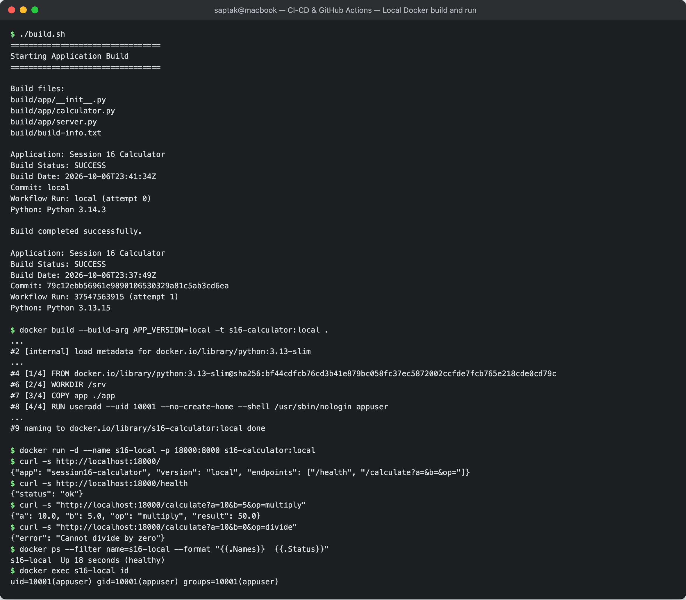

---

## 10. Test

12 tests: the instructor's 5 for `calculator.py` + 7 for `server.py` (the HTTP tests start a real server on a free port in a background thread). Local:

```
$ python3 -m pytest -v --cov=app --cov-report=term-missing
platform darwin -- Python 3.14.3, pytest-9.1.1, pluggy-1.6.0
...
tests/test_calculator.py::test_add PASSED                                [  8%]
tests/test_calculator.py::test_subtract PASSED                           [ 16%]
tests/test_calculator.py::test_multiply PASSED                           [ 25%]
tests/test_calculator.py::test_divide PASSED                             [ 33%]
tests/test_calculator.py::test_divide_by_zero PASSED                     [ 41%]
tests/test_server.py::test_calculate_function PASSED                     [ 50%]
tests/test_server.py::test_calculate_unknown_op PASSED                   [ 58%]
tests/test_server.py::test_health PASSED                                 [ 66%]
tests/test_server.py::test_calculate_endpoint PASSED                     [ 75%]
tests/test_server.py::test_divide_by_zero_endpoint PASSED                [ 83%]
tests/test_server.py::test_missing_params PASSED                         [ 91%]
tests/test_server.py::test_not_found PASSED                              [100%]

Name                Stmts   Miss  Cover   Missing
-------------------------------------------------
app/__init__.py         0      0   100%
app/calculator.py      11      0   100%
app/server.py          50      1    98%   54
-------------------------------------------------
TOTAL                  61      1    98%
============================== 12 passed in 0.59s ==============================
```

`.coveragerc` excludes the `if __name__ == "__main__":` CLI loop of `calculator.py` (it waits for keyboard input and can't run under pytest) — without that, the same code reported a misleading 30% for `calculator.py`.

CI (`CI / Test (py3.13, ubuntu-latest)`, run 37547563915):

```
platform linux -- Python 3.13.15, pytest-9.1.1, pluggy-1.6.0 -- /opt/hostedtoolcache/Python/3.13.15/x64/bin/python
rootdir: /home/runner/work/DevOps_Assignments/DevOps_Assignments/CI-CD & GitHub Actions
...
- generated xml file: /home/runner/work/DevOps_Assignments/DevOps_Assignments/CI-CD & GitHub Actions/reports/junit.xml -
TOTAL                  61      1    98%
Coverage XML written to file reports/coverage.xml
============================= slowest 3 durations ==============================
0.50s teardown tests/test_server.py::test_not_found
0.02s call     tests/test_server.py::test_health

(1 durations < 0.005s hidden.  Use -vv to show these durations.)
============================== 12 passed in 0.67s ==============================
```

`test-report` job (downloads all 4 report artifacts, writes the table to the job summary):

```
| Matrix leg | Tests | Failures | Errors | Skipped | Time (s) | Line coverage |
|---|---|---|---|---|---|---|
| test-report-macos-latest-py3.13 | 12 | 0 | 0 | 0 | 0.70 | 98% |
| test-report-ubuntu-latest-py3.12 | 12 | 0 | 0 | 0 | 0.68 | 98% |
| test-report-ubuntu-latest-py3.13 | 12 | 0 | 0 | 0 | 0.67 | 98% |
| test-report-ubuntu-latest-py3.14 | 12 | 0 | 0 | 0 | 0.59 | 98% |
```

### What the matrix caught: a 35-second stall on macOS only

In the first two runs the macOS leg was the slowest job by far. The same summary table for run 37546198854 showed:

```
| test-report-macos-latest-py3.13 | 12 | 0 | 0 | 0 | 35.72 | 98% |
| test-report-ubuntu-latest-py3.12 | 12 | 0 | 0 | 0 | 0.60 | 98% |
```

Per-test timings from the downloaded `junit.xml` artifact (run 37547083914) pinned it down:

```
$ gh run download 37547083914 -n test-report-macos-latest-py3.13 -D art-mac
$ python3 -c "
import xml.etree.ElementTree as ET
for tc in ET.parse('art-mac/junit.xml').getroot().iter('testcase'): print(tc.get('name'), tc.get('time'))"
test_add 0.001
...
test_health 35.068
test_calculate_endpoint 0.002
...
test_not_found 0.502
```

`test_health` is the first test that uses the server fixture, so its time includes starting the server. `http.server.HTTPServer.server_bind()` calls `socket.getfqdn()` — a **reverse-DNS lookup** — which on the macOS runner took ~35 s to time out. Fix in commit `79c12eb`: a `FastBindHTTPServer` subclass that binds without the lookup (the server name is never used). After the fix the macOS leg ran in **0.70 s** (table above) and the job time dropped from 50 s to 18 s. On Linux and on my Mac the lookup was instant, so this would never have shown up without a second runner OS in the matrix.

Dependency note: the class pin `pytest==8.4.2` is affected by **PYSEC-2026-1845 / CVE-2025-71176** (insecure `/tmp/pytest-of-{user}` handling, fixed in 9.0.3) — found by `pip-audit` in Session 17 — so this project uses `pytest==9.1.1` / `pytest-cov==7.1.0`.

**Screenshot:** 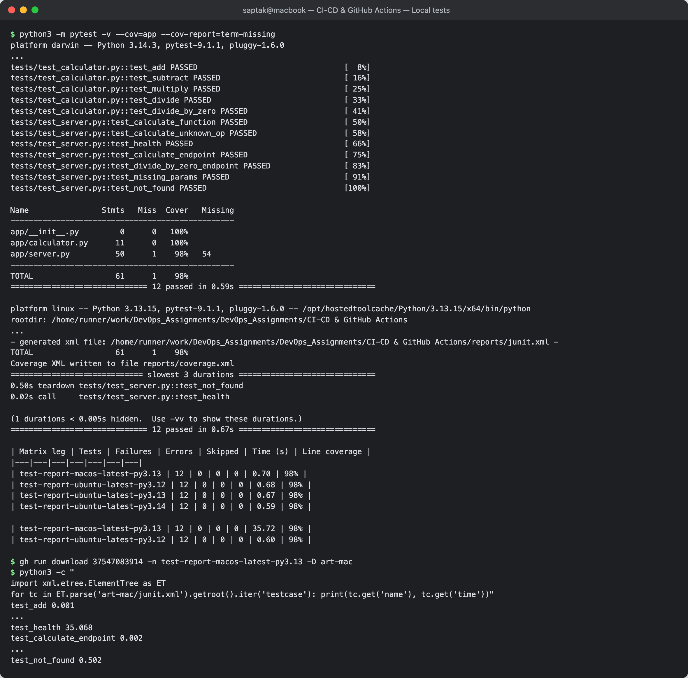

---

## 11. Pipeline Execution — CI + CD, Green and Red

### Run history

```
$ gh run list --workflow s16-cicd.yml
completed	failure	S16 CI/CD - Calculator	S16 CI/CD - Calculator	demo/s16-broken-add	workflow_dispatch	37547931810	28s	2026-10-06T23:41:25Z
completed	success	Session 16: skip reverse-DNS in HTTP server bind (35 s macOS test stall)	S16 CI/CD - Calculator	main	push	37547563915	2m0s	2026-10-06T23:37:20Z
completed	success	Session 16: bump pytest to 9.1.1, skip pipeline on docs-only changes	S16 CI/CD - Calculator	main	push	37547083914	2m38s	2026-10-06T23:32:07Z
completed	success	Session 16: add CI/CD demo project and GitHub Actions workflow	S16 CI/CD - Calculator	main	push	37546198854	2m55s	2026-10-06T23:22:30Z
```

| Run | Commit | Result | URL |
| --- | --- | --- | --- |
| first push | `709944b` | ✅ success | https://github.com/Saptak-cyber/DevOps_Assignments/actions/runs/37546198854 |
| pytest bump | `eca9956` | ✅ success | https://github.com/Saptak-cyber/DevOps_Assignments/actions/runs/37547083914 |
| **final** — macOS fix | `79c12eb` | ✅ success | https://github.com/Saptak-cyber/DevOps_Assignments/actions/runs/37547563915 |
| failure scenario | `b7e38d9` (deleted branch) | ❌ failure (intended) | https://github.com/Saptak-cyber/DevOps_Assignments/actions/runs/37547931810 |

### Green run

```
$ gh run view 37547563915
✓ main S16 CI/CD - Calculator · 37547563915
Triggered via push about 3 minutes ago

JOBS
✓ CI / Test (py3.13, macos-latest) in 18s (ID 112555105975)
✓ CI / Test (py3.13, ubuntu-latest) in 13s (ID 112555106304)
✓ CI / Test (py3.12, ubuntu-latest) in 12s (ID 112555106320)
✓ CI / Test (py3.14, ubuntu-latest) in 11s (ID 112555106391)
✓ CI / Test report summary in 6s (ID 112555229095)
✓ CI / Security check (sensitive files) in 4s (ID 112555229096)
✓ CI / Build application in 6s (ID 112555229122)
✓ CD / Docker build & push to GHCR in 19s (ID 112555267045)
✓ CD / Deploy to Kubernetes (kind) + smoke test in 1m4s (ID 112555372413)
...
View this run on GitHub: https://github.com/Saptak-cyber/DevOps_Assignments/actions/runs/37547563915
```

`security-check` log: `No common sensitive files found.`

### CD part 1 — push to GHCR

```
Login Succeeded!
...
#10 exporting manifest list sha256:b56578e5121e6ad849dbf4bb86fbc694fbf7bae8839712776e8770e915998d75 done
#10 pushing manifest for ghcr.io/saptak-cyber/s16-calculator:79c12ebb56961e9890106530329a81c5ab3cd6ea@sha256:b56578e5121e6ad849dbf4bb86fbc694fbf7bae8839712776e8770e915998d75 1.1s done
#10 pushing manifest for ghcr.io/saptak-cyber/s16-calculator:latest@sha256:b56578e5121e6ad849dbf4bb86fbc694fbf7bae8839712776e8770e915998d75 0.5s done
...
Image : ghcr.io/saptak-cyber/s16-calculator:79c12ebb56961e9890106530329a81c5ab3cd6ea
Digest: sha256:b56578e5121e6ad849dbf4bb86fbc694fbf7bae8839712776e8770e915998d75
```

Two tags, one digest: `:<commit-sha>` is immutable and traceable to the exact commit; `:latest` is a moving convenience pointer. The deployment uses the SHA tag.

**Package visibility.** My `gh` token has no `read:packages` scope, so `gh api '/users/Saptak-cyber/packages?package_type=container'` returned `HTTP 403 — You need at least read:packages scope`. I checked visibility from the outside instead, with no credentials at all:

```
$ TOKEN=$(curl -s "https://ghcr.io/token?scope=repository:saptak-cyber/s16-calculator:pull" | jq -r .token)
$ curl -s -o /dev/null -w '%{http_code}\n' -H "Authorization: Bearer $TOKEN" -H 'Accept: application/vnd.oci.image.index.v1+json,application/vnd.docker.distribution.manifest.v2+json' https://ghcr.io/v2/saptak-cyber/s16-calculator/manifests/latest
200

$ export DOCKER_CONFIG=$(mktemp -d)    # empty config = no GHCR credentials
$ docker pull --platform linux/amd64 ghcr.io/saptak-cyber/s16-calculator:latest
latest: Pulling from saptak-cyber/s16-calculator
...
Digest: sha256:3d77edcac76ccd9b6428cb7d34481aa2060788ab9de88d91aacf73a1b79c93a6
Status: Downloaded newer image for ghcr.io/saptak-cyber/s16-calculator:latest
$ docker run --rm -d --platform linux/amd64 -p 18001:8000 --name s16-ghcr ghcr.io/saptak-cyber/s16-calculator:latest
$ curl -s localhost:18001/
{"app": "session16-calculator", "version": "eca9956deccfca0af568d2222f88aac86957c993", "endpoints": ["/health", "/calculate?a=&b=&op="]}
```

Observed visibility: **public** — an anonymous token can read the manifest and pull the image. The package was created by `GITHUB_TOKEN` from a workflow in a public repository (packages published this way are linked to that repository; the image also carries an `org.opencontainers.image.source` label pointing at it), and it is publicly pullable; I did not change any visibility setting. (That pull happened while run 37547563915 was still running, so `:latest` was the previous commit `eca9956` — the `version` field makes that visible.) The image is `linux/amd64` only (built on an x64 runner), hence `--platform` on my arm64 Mac.

**Screenshot:** 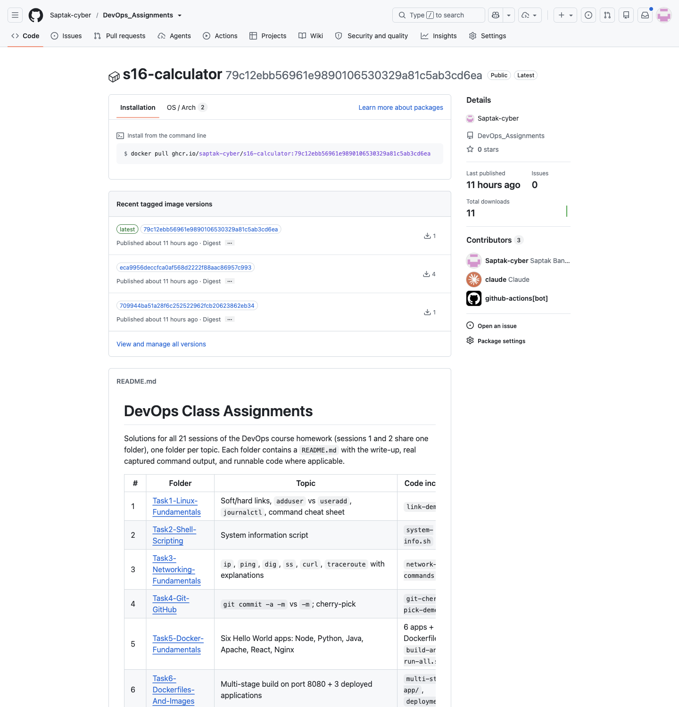

### CD part 2 — deploy to Kubernetes and smoke test

`helm/kind-action` creates a one-node cluster inside the runner VM:

```
Creating cluster "s16-ci" ...
 ✓ Ensuring node image (kindest/node:v1.37.0) 🖼️
 ✓ Preparing nodes 📦
 ✓ Writing configuration 📜
 ✓ Starting control-plane 🕹️
 ✓ Installing CNI 🔌
 ✓ Installing StorageClass 💾
 ✓ Waiting ≤ 1m0s for control-plane = Ready ⏳
Set kubectl context to "kind-s16-ci"
...
Client Version: v1.37.1
Kustomize Version: v5.8.1
Server Version: v1.37.0
NAME                   STATUS   ROLES           AGE   VERSION   INTERNAL-IP   EXTERNAL-IP   OS-IMAGE                       KERNEL-VERSION              CONTAINER-RUNTIME
s16-ci-control-plane   Ready    control-plane   21s   v1.37.0   172.18.0.2    <none>        Debian GNU/Linux 13 (trixie)   6.17.0-1022-azure (amd64)   containerd://2.3.4
```

Pull secret from `GITHUB_TOKEN`, render the manifest (`__IMAGE__` → the SHA tag from `needs.docker.outputs.image`), apply, wait:

```
secret/ghcr-pull created
27:          image: ghcr.io/saptak-cyber/s16-calculator:79c12ebb56961e9890106530329a81c5ab3cd6ea
deployment.apps/s16-calculator created
service/s16-calculator created
Waiting for deployment "s16-calculator" rollout to finish: 0 of 2 updated replicas are available...
Waiting for deployment "s16-calculator" rollout to finish: 1 of 2 updated replicas are available...
deployment "s16-calculator" successfully rolled out
```

```
NAME                             READY   UP-TO-DATE   AVAILABLE   AGE   CONTAINERS   IMAGES                                                                         SELECTOR
deployment.apps/s16-calculator   2/2     2            2           9s    calculator   ghcr.io/saptak-cyber/s16-calculator:79c12ebb56961e9890106530329a81c5ab3cd6ea   app=s16-calculator

NAME                                        DESIRED   CURRENT   READY   AGE   CONTAINERS   IMAGES                                                                         SELECTOR
replicaset.apps/s16-calculator-6ff468bf48   2         2         2       9s    calculator   ghcr.io/saptak-cyber/s16-calculator:79c12ebb56961e9890106530329a81c5ab3cd6ea   app=s16-calculator,pod-template-hash=6ff468bf48

NAME                                  READY   STATUS    RESTARTS   AGE   IP           NODE                   NOMINATED NODE   READINESS GATES
pod/s16-calculator-6ff468bf48-6q4dl   1/1     Running   0          9s    10.244.0.5   s16-ci-control-plane   <none>           <none>
pod/s16-calculator-6ff468bf48-zgrpq   1/1     Running   0          9s    10.244.0.6   s16-ci-control-plane   <none>           <none>

NAME                     TYPE        CLUSTER-IP     EXTERNAL-IP   PORT(S)   AGE   SELECTOR
service/kubernetes       ClusterIP   10.96.0.1      <none>        443/TCP   29s   <none>
service/s16-calculator   ClusterIP   10.96.247.47   <none>        80/TCP    9s    app=s16-calculator
Image digests actually running:
s16-calculator-6ff468bf48-6q4dl  ghcr.io/saptak-cyber/s16-calculator@sha256:b56578e5121e6ad849dbf4bb86fbc694fbf7bae8839712776e8770e915998d75
s16-calculator-6ff468bf48-zgrpq  ghcr.io/saptak-cyber/s16-calculator@sha256:b56578e5121e6ad849dbf4bb86fbc694fbf7bae8839712776e8770e915998d75
```

The running `imageID` digest equals the digest the `docker` job pushed (`sha256:b56578e5…`) — the cluster is running exactly the image this run built.

Smoke test through the Service (`kubectl port-forward`), with assertions:

```
+ curl -fsS http://127.0.0.1:8080/
{"app": "session16-calculator", "version": "79c12ebb56961e9890106530329a81c5ab3cd6ea", "endpoints": ["/health", "/calculate?a=&b=&op="]}
+ curl -fsS http://127.0.0.1:8080/health
{"status": "ok"}
+ curl -fsS 'http://127.0.0.1:8080/calculate?a=10&b=5&op=add'
add OK: {'a': 10.0, 'b': 5.0, 'op': 'add', 'result': 15.0}
+ curl -fsS 'http://127.0.0.1:8080/calculate?a=10&b=4&op=divide'
divide OK: {'a': 10.0, 'b': 4.0, 'op': 'divide', 'result': 2.5}
version matches commit: 79c12ebb56961e9890106530329a81c5ab3cd6ea
+ echo 'SMOKE TEST PASSED'
SMOKE TEST PASSED
```

```
[pod/s16-calculator-6ff468bf48-6q4dl/calculator] session16-calculator 79c12ebb56961e9890106530329a81c5ab3cd6ea listening on :8000
[pod/s16-calculator-6ff468bf48-6q4dl/calculator] 10.244.0.1 - "GET /health HTTP/1.1" 200 -
[pod/s16-calculator-6ff468bf48-6q4dl/calculator] 127.0.0.1 - "GET /calculate?a=10&b=5&op=add HTTP/1.1" 200 -
...
Deleting cluster "s16-ci" ...
Deleted nodes: ["s16-ci-control-plane"]
```

`10.244.0.1` requests are the kubelet's readiness/liveness probes; `127.0.0.1` ones are the port-forwarded smoke test. The `version` check ties the running pod back to `GITHUB_SHA` — the commit, the image tag, the build-arg and the pod response all match. The cluster is deleted by the action's post-step.

**Screenshot:** 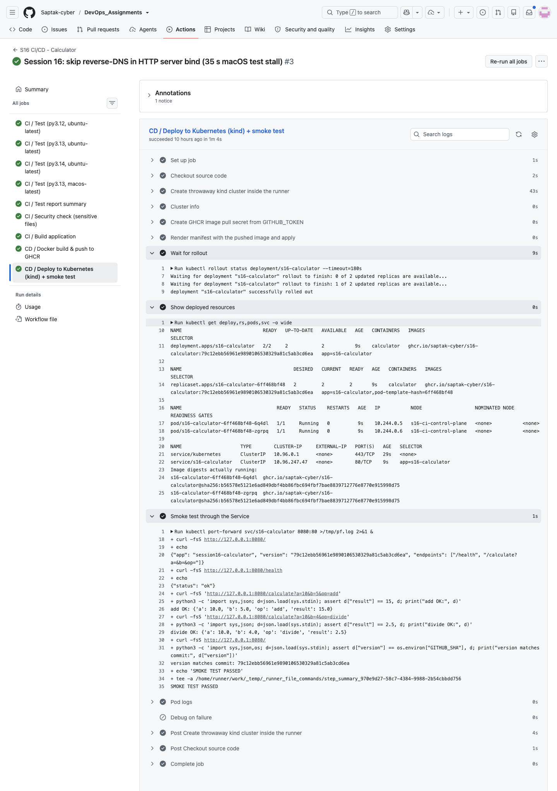

### Red run — the class failure scenario

The class README (§11 "Failure Scenario") breaks `add()` to show that `build` never runs when `test` fails. I did exactly that on a short-lived branch and triggered the workflow manually:

```diff
 def add(a, b):
-    return a + b
+    return a + b + 1
```

```
$ gh workflow run s16-cicd.yml --ref demo/s16-broken-add
https://github.com/Saptak-cyber/DevOps_Assignments/actions/runs/37547931810

$ gh run view 37547931810
X demo/s16-broken-add S16 CI/CD - Calculator · 37547931810
Triggered via workflow_dispatch less than a minute ago

JOBS
X CI / Test (py3.14, ubuntu-latest) in 19s (ID 112556336936)
  ...
  X Run tests with coverage
  ✓ Upload test report artifact
X CI / Test (py3.13, ubuntu-latest) in 15s (ID 112556337318)
X CI / Test (py3.12, ubuntu-latest) in 11s (ID 112556337354)
X CI / Test (py3.13, macos-latest) in 18s (ID 112556337432)
- CI / Test report summary in 0s (ID 112556461618)
- CI / Security check (sensitive files) in 0s (ID 112556461887)
- CI / Build application in 0s (ID 112556462161)
- CD / Docker build & push to GHCR in 0s (ID 112556462378)
- CD / Deploy to Kubernetes (kind) + smoke test in 0s (ID 112556462483)
```

```
$ gh run view 37547931810 --log-failed
___________________________________ test_add ___________________________________

    def test_add():
>       assert add(10, 5) == 15
E       assert 16 == 15
E        +  where 16 = add(10, 5)

tests/test_calculator.py:10: AssertionError
___________________________ test_calculate_endpoint ____________________________
...
>       assert body["result"] == 15
E       assert 16.0 == 15

tests/test_server.py:47: AssertionError
...
FAILED tests/test_calculator.py::test_add - assert 16 == 15
FAILED tests/test_server.py::test_calculate_endpoint - assert 16.0 == 15
========================= 2 failed, 10 passed in 0.66s =========================
```

All four legs fail (`fail-fast: false` let each one report), the test-report artifacts are still uploaded (`if: always()`), and every downstream job is **skipped** (`-`): no build artifact, no image pushed, no deployment. The HTTP-layer test caught the same bug through a different path, which is the value of testing the deployed interface and not only the functions. The branch was deleted afterwards:

```
$ git push origin --delete demo/s16-broken-add
To https://github.com/Saptak-cyber/DevOps_Assignments.git
 - [deleted]         demo/s16-broken-add
```

**Screenshot:** 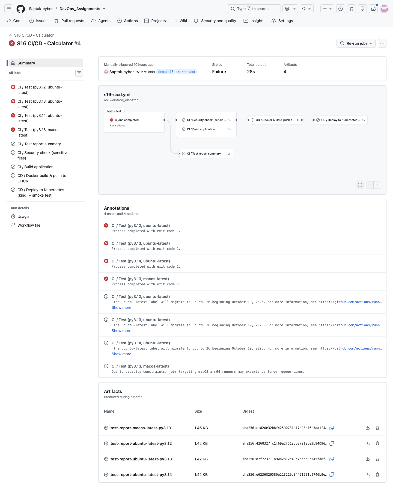

---

## Cleanup

Nothing is left running: the kind cluster lives and dies inside each `deploy` job (`Deleting cluster "s16-ci" ...` in the post-step), and GitHub-hosted runners are destroyed after every job. Locally:

```bash
docker rm -f s16-local s16-ghcr
docker rmi s16-calculator:local ghcr.io/saptak-cyber/s16-calculator:latest
git push origin --delete demo/s16-broken-add     # already done above
```

What remains on purpose: the `ghcr.io/saptak-cyber/s16-calculator` package (one tag per main-branch run + `latest`) and the run artifacts (expire after 14 days).

---

## Files added / changed relative to the class resources

| File | Why |
| --- | --- |
| [`app/server.py`](./app/server.py), [`tests/test_server.py`](./tests/test_server.py) | the CLI app can't be deployed or smoke-tested; this exposes the same functions over HTTP (stdlib only) |
| [`build.sh`](./build.sh) | packages the whole `app/` package and stamps commit/run id |
| [`Dockerfile`](./Dockerfile), [`k8s/`](./k8s) | the class pipeline stopped at "artifact"; these are the CD half |
| [`.coveragerc`](./.coveragerc) | excludes the interactive `__main__` loop from coverage |
| [`requirements.txt`](./requirements.txt) | pinned versions; pytest bumped past CVE-2025-71176 |
| [`.github/workflows/s16-cicd.yml`](./.github/workflows/s16-cicd.yml) | the class `ci.yml` plus matrix, report artifacts, GHCR push, kind deploy |

## Resources

- https://docs.github.com/en/actions/writing-workflows/workflow-syntax-for-github-actions
- https://docs.github.com/en/actions/security-for-github-actions/security-guides/automatic-token-authentication
- https://docs.github.com/en/actions/using-workflows/storing-workflow-data-as-artifacts
- https://docs.github.com/en/packages/working-with-a-github-packages-registry/working-with-the-container-registry
- https://github.com/helm/kind-action
