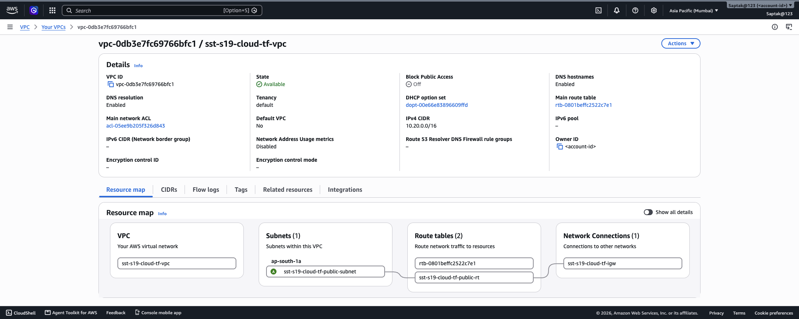
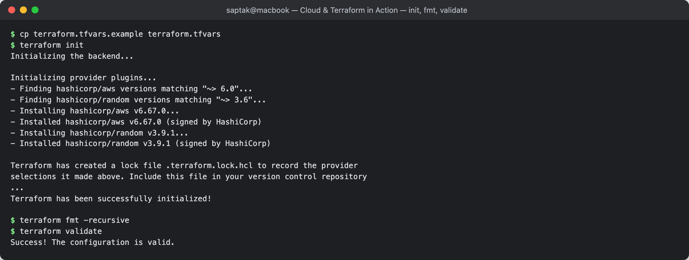
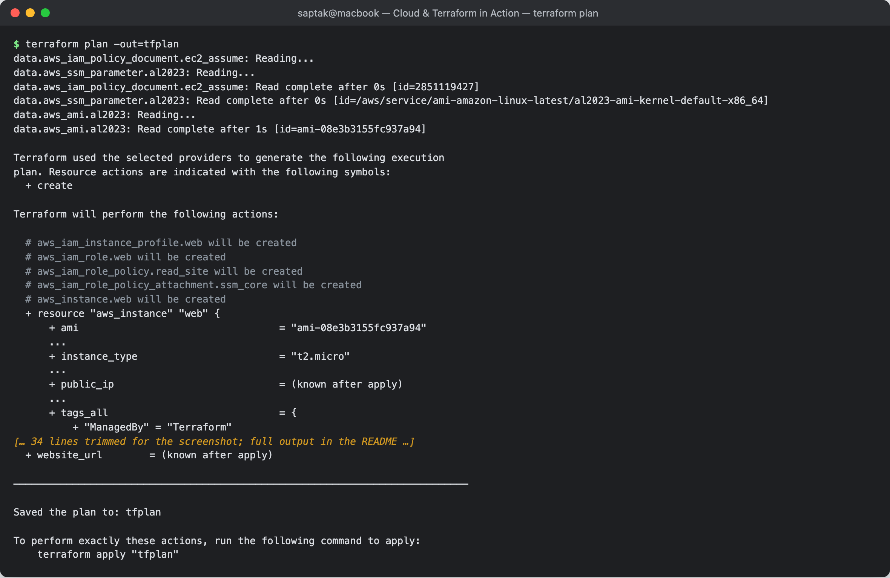
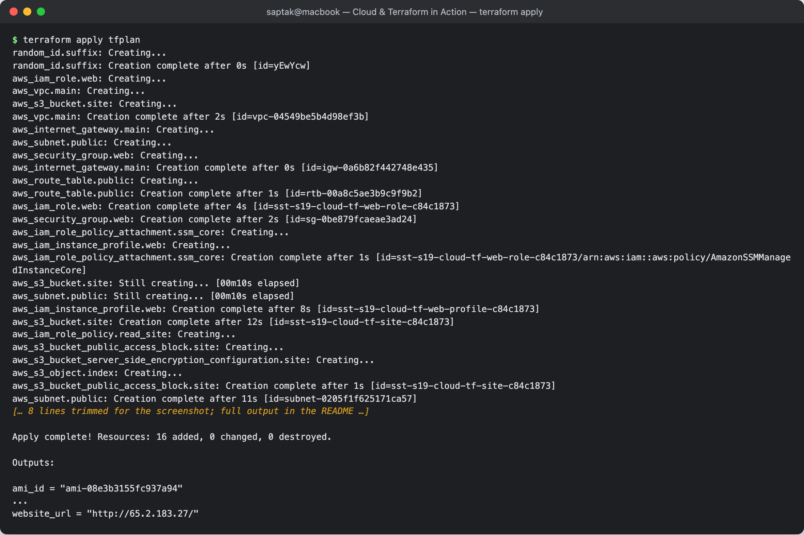
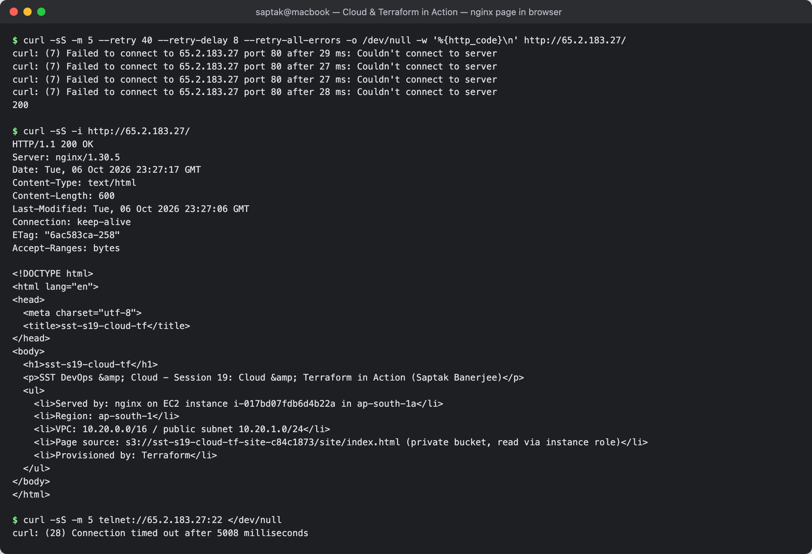
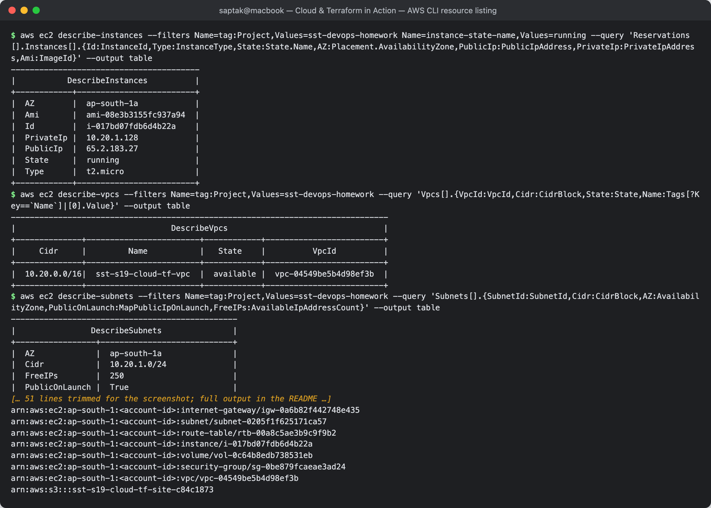
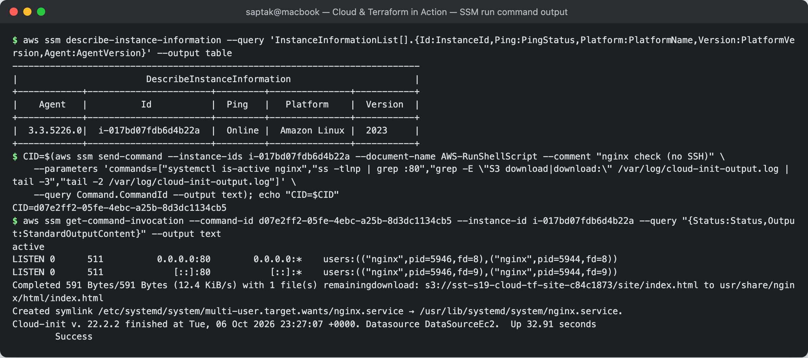
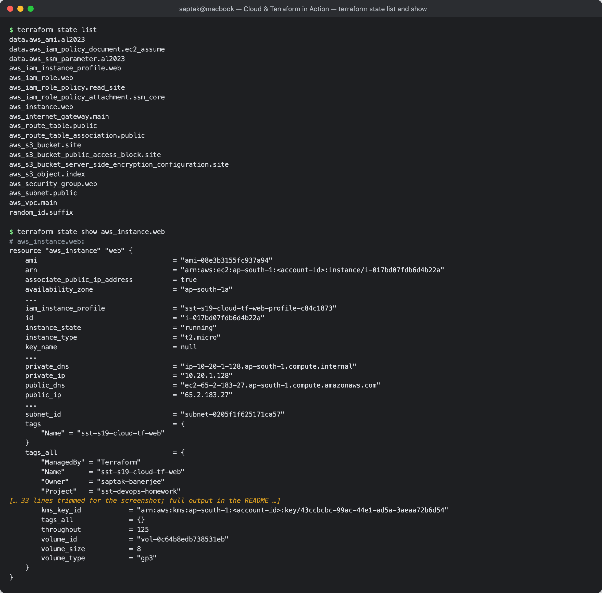
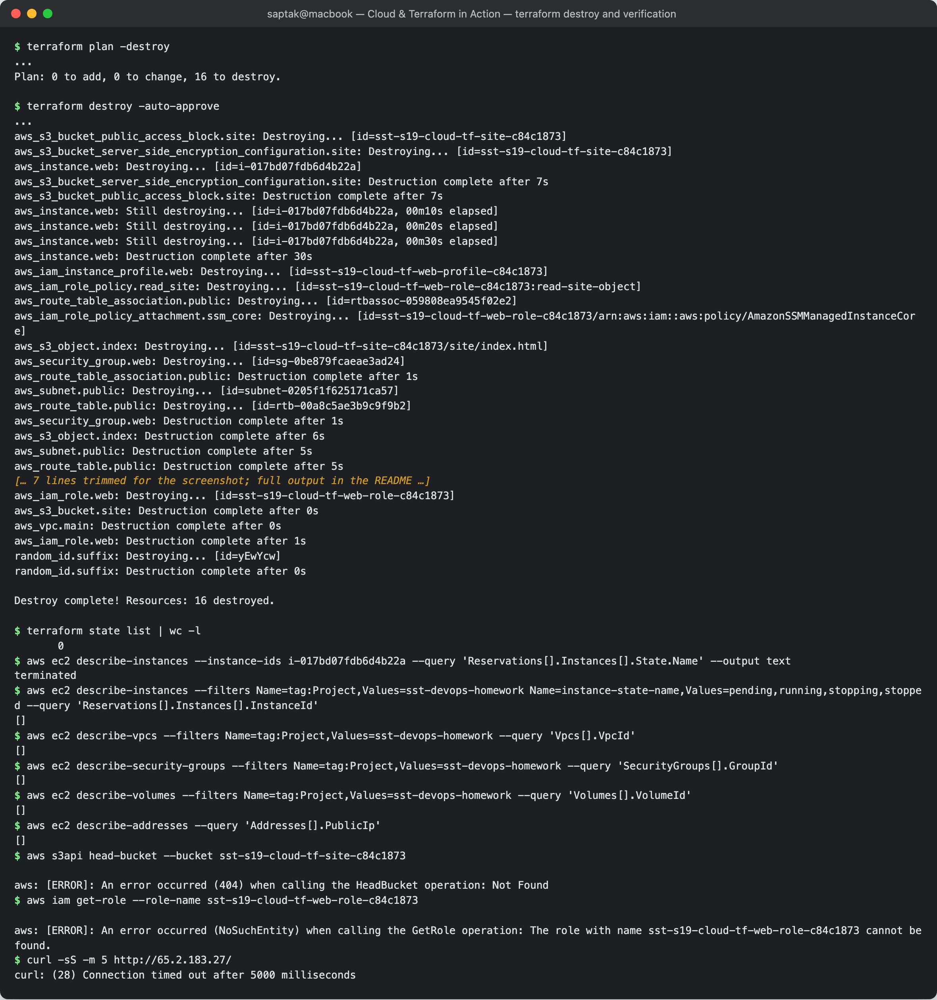

# Cloud & Terraform in Action

**Author:** Saptak Banerjee
**Course:** SST DevOps & Cloud [SWE]
**Session:** 19 — Cloud & Terraform in Action
**Source material:** [`devops-heros/session19-cloud-terraform`](https://github.com/Nency-Ravaliya/devops-heros/tree/main/session19-cloud-terraform) (network code adapted from `08-mini-project/`)

**Environment:** Terraform **v1.16.4**, providers `hashicorp/aws` **v6.67.0** + `hashicorp/random` **v3.9.1**, AWS CLI **v2.35.19**, real AWS account, region **ap-south-1**, IAM user `terraform-sandbox`. Every output is a real capture, with the account ID masked as `<account-id>`. The stack existed for about **5 minutes** (apply finished 23:26:33 UTC, destroy started 23:30:20 UTC) and was then destroyed.

---

## Table of Contents

| # | Section |
| --- | --- |
| 1 | [Architecture diagram](#1-architecture-diagram) |
| 2 | [Project structure](#2-project-structure) |
| 3 | [Terraform providers](#3-terraform-providers) |
| 4 | [Variables](#4-variables) |
| 5 | [Resources](#5-resources) |
| 6 | [Dependencies](#6-dependencies-implicit-and-explicit) |
| 7 | [Outputs](#7-outputs) |
| 8 | [init → fmt → validate](#8-terraform-init--fmt--validate) |
| 9 | [terraform plan](#9-terraform-plan) |
| 10 | [terraform apply](#10-terraform-apply) |
| 11 | [Verify the AWS infrastructure](#11-verify-the-aws-infrastructure) |
| 12 | [Terraform state](#12-terraform-state) |
| 13 | [terraform destroy](#13-terraform-destroy) |
| 14 | [Mini-project questions](#14-mini-project-questions-from-08-mini-project) |
| — | [Cleanup](#cleanup) |

---

## 1. Architecture diagram

The suggested architecture was *Terraform → VPC, Subnet, Security Group, EC2, S3*. It is built here, plus the pieces a working design needs: an IGW and route table so the subnet is actually public, and an IAM role so EC2 can read the private bucket without keys.

```text
                         ┌────────────────────────────┐
   Your laptop           │  terraform plan / apply    │  state: terraform.tfstate (local)
   (AWS creds in env) ──►│  providers: aws, random    │
                         └─────────────┬──────────────┘
                                       │ AWS APIs
                                       ▼
 ┌──────────────────────────── AWS region ap-south-1 ────────────────────────────────────┐
 │                                                                                       │
 │  data sources: SSM /aws/service/ami-amazon-linux-latest/... ──► aws_ami (AL2023)      │
 │                                                                                       │
 │  ┌──────────────── VPC sst-s19-cloud-tf-vpc  10.20.0.0/16 ─────────────────┐          │
 │  │                                                                         │          │
 │  │   Route table (public-rt)                                               │          │
 │  │     10.20.0.0/16 → local                                                │          │
 │  │     0.0.0.0/0    → IGW ───────────────────────────────────────────┐     │          │
 │  │            │ association                                          │     │          │
 │  │            ▼                                                      │     │          │
 │  │   ┌──── Public subnet 10.20.1.0/24  (ap-south-1a) ─────────┐      │     │          │
 │  │   │                                                        │      │     │          │
 │  │   │   ┌─ Security group web-sg ─────────────────────────┐  │      │     │          │
 │  │   │   │ in : tcp/80 from 0.0.0.0/0   (NO port 22)       │  │      │     │          │
 │  │   │   │ out: tcp/80, tcp/443                            │  │      │     │          │
 │  │   │   │  ┌───────────────────────────────────────────┐  │  │      │     │          │
 │  │   │   │  │ EC2 t2.micro  Amazon Linux 2023           │  │  │      │     │          │
 │  │   │   │  │ private 10.20.1.128 / public 65.2.183.27  │  │  │      │     │          │
 │  │   │   │  │ user_data: dnf install nginx,             │  │  │      │     │          │
 │  │   │   │  │   aws s3 cp site/index.html               │  │  │      │     │          │
 │  │   │   │  │ IMDSv2 only, encrypted gp3 root           │  │  │      │     │          │
 │  │   │   │  └──────┬──────────────────────┬─────────────┘  │  │      │     │          │
 │  │   │   └─────────│──────────────────────│────────────────┘  │      │     │          │
 │  │   └─────────────│──────────────────────│───────────────────┘      │     │          │
 │  └─────────────────│──────────────────────│──────────────────────────│─────┘          │
 │                    │ instance profile     │ HTTPS (via IGW)          │                │
 │                    ▼                      ▼                          │                │
 │   IAM role web-role                 S3 bucket sst-s19-cloud-tf-site-<hex>  (private,  │
 │    • inline: s3:GetObject on          SSE-S3, public access blocked)                  │
 │      <bucket>/site/*                  └── site/index.html  (aws_s3_object)            │
 │    • AmazonSSMManagedInstanceCore                                    │                │
 └──────────────────────────────────────────────────────────────────────│────────────────┘
                                                                        │
                       Internet Gateway  ◄──────────────────────────────┘
                              ▲
                              │ HTTP :80
                        Browser / curl  →  http://65.2.183.27/
```

Request path: client → IGW (1:1 NAT public → private IP) → route table → subnet → SG allows :80 → nginx on EC2. At boot, EC2 pulls the page from S3 using temporary role credentials from the instance metadata service.

**Screenshot:** 

---

## 2. Project structure

```text
Cloud & Terraform in Action/
├── versions.tf                 # terraform{} + required_providers (aws, random) + provider "aws" with default_tags
├── variables.tf                # 7 input variables, 2 with validation rules
├── data.tf                     # data sources: SSM AMI parameter → aws_ami
├── network.tf                  # VPC, public subnet, IGW, route table, association, security group  (from 08-mini-project)
├── storage.tf                  # random_id, S3 bucket, public-access block, SSE, aws_s3_object (index.html)
├── compute.tf                  # IAM role/policy/instance profile, EC2 instance (with depends_on)
├── outputs.tf                  # 11 outputs
├── templates/
│   ├── user_data.sh.tftpl      # cloud-init script (nginx + fetch page from S3)
│   └── index.html.tftpl        # the page, rendered by templatefile() and uploaded to S3
├── terraform.tfvars.example    # copy to terraform.tfvars (git-ignored)
├── .terraform.lock.hcl         # provider pins, committed
├── .gitignore
├── README.md
└── screenshots/CAPTURE-LIST.md
```

**What changed from the instructor's `08-mini-project`.** The VPC/subnet/IGW/route-table/association code is kept as-is, apart from names, CIDRs and AZ becoming variables and tags moving to `default_tags`. The security group **drops the 443 ingress rule**, because the assignment allows HTTP 80 only, and **replaces allow-all egress with 80/443 only**. I then added the *Optional Extension — EC2* that the mini-project describes, plus the S3 bucket from the suggested architecture.

### How to run

```bash
cp terraform.tfvars.example terraform.tfvars   # no secrets in it
export AWS_ACCESS_KEY_ID=... AWS_SECRET_ACCESS_KEY=...   # or AWS_PROFILE / SSO
terraform init && terraform fmt -recursive && terraform validate
terraform plan -out=tfplan
terraform apply tfplan
curl "$(terraform output -raw website_url)"
terraform destroy
```

---

## 3. Terraform providers

```hcl
terraform {
  required_version = ">= 1.6.0"
  required_providers {
    aws    = { source = "hashicorp/aws",    version = "~> 6.0" }
    random = { source = "hashicorp/random", version = "~> 3.6" }
  }
}

provider "aws" {
  region = var.aws_region
  default_tags { tags = var.common_tags }
}
```

- **aws** turns resource blocks into AWS API calls. `default_tags` stamps `Project=sst-devops-homework`, `ManagedBy=Terraform`, `Session=19` (and `Owner`) onto every taggable resource. That is how the `aws ec2 describe-* --filters Name=tag:Project,...` checks below find everything.
- **random** is a *logical* provider that talks to no API. `random_id.suffix` generates 8 hex characters once and stores them in state. S3 bucket names are global and IAM role names are account-wide, so the suffix (`c84c1873` in this run) prevents collisions on re-runs.
- No credentials in code. The provider uses the standard AWS credential chain.

---

## 4. Variables

| Variable | Type | Default | Notes |
| --- | --- | --- | --- |
| `aws_region` | string | `ap-south-1` | |
| `project_name` | string | `sst-s19-cloud-tf` | prefix of every `Name` |
| `vpc_cidr` | string | `10.20.0.0/16` | validated with `can(cidrhost(...))` |
| `public_subnet_cidr` | string | `10.20.1.0/24` | |
| `az_suffix` | string | `a` | `t2.micro` is only offered in 1a/1b ([evidence](../Terraform%20%26%20Infrastructure%20as%20Code/aws-services/02-ec2/README.md#instance-types)) |
| `instance_type` | string | `t2.micro` | **validation**: only `t2.micro` / `t3.micro` |
| `common_tags` | map(string) | Project / ManagedBy / Session | fed to `default_tags` |

The validation rule acts as a cost guard-rail. Trying to plan a larger instance fails before anything is created:

```
$ terraform plan -var instance_type=t3.large
...
Error: Invalid value for variable

  on variables.tf line 36:
  36: variable "instance_type" {
    ├────────────────
    │ var.instance_type is "t3.large"

Only t2.micro or t3.micro are allowed in this project (free tier).

This was checked by the validation rule at variables.tf:41,3-13.
```

Values come from `terraform.tfvars` (copied from `terraform.tfvars.example`). Precedence, from highest: `-var` / `-var-file` on the command line > `*.auto.tfvars` > `terraform.tfvars` > `TF_VAR_*` environment variables > defaults.

---

## 5. Resources

16 managed resources + 3 data sources:

| File | Address | What it is |
| --- | --- | --- |
| data.tf | `data.aws_ssm_parameter.al2023` | AWS-published "latest AL2023" AMI ID |
| data.tf | `data.aws_ami.al2023` | AMI details for that ID (name, date) |
| compute.tf | `data.aws_iam_policy_document.ec2_assume` | trust policy JSON: `ec2.amazonaws.com` may assume the role |
| network.tf | `aws_vpc.main` | `10.20.0.0/16`, DNS hostnames on |
| network.tf | `aws_subnet.public` | `10.20.1.0/24` in ap-south-1a, auto-assign public IP |
| network.tf | `aws_internet_gateway.main` | internet access for the VPC |
| network.tf | `aws_route_table.public` | `0.0.0.0/0 → IGW` |
| network.tf | `aws_route_table_association.public` | subnet ↔ route table (makes it *public*) |
| network.tf | `aws_security_group.web` | in: 80; out: 80, 443 |
| storage.tf | `random_id.suffix` | 4 random bytes |
| storage.tf | `aws_s3_bucket.site` | private bucket, `force_destroy = true` |
| storage.tf | `aws_s3_bucket_public_access_block.site` | all 4 blocks on |
| storage.tf | `aws_s3_bucket_server_side_encryption_configuration.site` | SSE-S3 |
| storage.tf | `aws_s3_object.index` | `site/index.html`, rendered from a template |
| compute.tf | `aws_iam_role.web` | EC2 role |
| compute.tf | `aws_iam_role_policy.read_site` | inline: `s3:GetObject` on `<bucket>/site/*` only |
| compute.tf | `aws_iam_role_policy_attachment.ssm_core` | `AmazonSSMManagedInstanceCore` (shell access without SSH) |
| compute.tf | `aws_iam_instance_profile.web` | wraps the role for EC2 |
| compute.tf | `aws_instance.web` | t2.micro, AL2023, user_data → nginx, IMDSv2 required, encrypted gp3 root |

**Why no SSH (port 22) rule?**

1. The assignment allows **HTTP 80 only**.
2. Opening `22` to `0.0.0.0/0` exposes the host to constant internet-wide brute-force scanning, and a leaked or weak key means full compromise.
3. Nothing here needs it: provisioning is done by `user_data` at boot, and if a shell is needed, **SSM Session Manager / Run Command** uses IAM auth, is logged in CloudTrail, and needs no inbound port, key pair or bastion. Section 11 uses SSM Run Command to inspect nginx with port 22 closed. That is also why the instance has **no key pair** (`"KeyName": null`).

---

## 6. Dependencies (implicit and explicit)

**Implicit dependencies** come from references. Writing `vpc_id = aws_vpc.main.id` in the subnet tells Terraform the subnet needs the VPC first. Most of the graph is built this way. `terraform graph` (filtered to the edges) shows it:

```
$ terraform graph | grep -- '->'
  "data.aws_ami.al2023" -> "data.aws_ssm_parameter.al2023";
  "aws_iam_instance_profile.web" -> "aws_iam_role.web";
  "aws_iam_role.web" -> "data.aws_iam_policy_document.ec2_assume";
  "aws_iam_role.web" -> "random_id.suffix";
  "aws_iam_role_policy.read_site" -> "aws_iam_role.web";
  "aws_iam_role_policy.read_site" -> "aws_s3_bucket.site";
  "aws_iam_role_policy_attachment.ssm_core" -> "aws_iam_role.web";
  "aws_instance.web" -> "data.aws_ami.al2023";
  "aws_instance.web" -> "aws_iam_instance_profile.web";
  "aws_instance.web" -> "aws_iam_role_policy.read_site";
  "aws_instance.web" -> "aws_iam_role_policy_attachment.ssm_core";
  "aws_instance.web" -> "aws_route_table_association.public";
  "aws_instance.web" -> "aws_s3_object.index";
  "aws_instance.web" -> "aws_security_group.web";
  "aws_internet_gateway.main" -> "aws_vpc.main";
  "aws_route_table.public" -> "aws_internet_gateway.main";
  "aws_route_table_association.public" -> "aws_route_table.public";
  "aws_route_table_association.public" -> "aws_subnet.public";
  "aws_s3_bucket.site" -> "random_id.suffix";
  "aws_s3_bucket_public_access_block.site" -> "aws_s3_bucket.site";
  "aws_s3_bucket_server_side_encryption_configuration.site" -> "aws_s3_bucket.site";
  "aws_s3_object.index" -> "aws_s3_bucket.site";
  "aws_security_group.web" -> "aws_vpc.main";
  "aws_subnet.public" -> "aws_vpc.main";
```

The graph is *transitively reduced*: `aws_instance.web -> aws_subnet.public` is not printed because it is already implied through the route-table association.

**Explicit dependencies (`depends_on`)** are needed where an ordering matters but no reference exists. `aws_instance.web` has three:

```hcl
  depends_on = [
    aws_route_table_association.public,
    aws_iam_role_policy.read_site,
    aws_iam_role_policy_attachment.ssm_core,
  ]
```

| depends_on | Without it, this could happen |
| --- | --- |
| `aws_route_table_association.public` | The instance only references the *subnet*. Terraform could launch it while the `0.0.0.0/0 → IGW` route or its association is still being created. `user_data` runs `dnf install -y nginx` within seconds of boot, would find no internet route, and would fail. With `set -e`, the page would never be served. |
| `aws_iam_role_policy.read_site` | The instance profile references only the *role*, not the inline policy on it. The instance could boot with a role that has no S3 permission yet, so `aws s3 cp` would get `AccessDenied`. (The script also retries 12× as a second line of defence against IAM propagation delay.) |
| `aws_iam_role_policy_attachment.ssm_core` | Same pattern: SSM registration would fail until the managed policy was attached. |

The apply log in section 10 shows the effect: `aws_instance.web: Creating...` starts only after `aws_route_table_association.public` and `aws_iam_role_policy.read_site` report *Creation complete*. Prefer references, and use `depends_on` only for hidden dependencies like these, because it makes Terraform more conservative (it treats the whole dependency as a black box).

---

## 7. Outputs

| Output | Value in this run |
| --- | --- |
| `vpc_id` / `vpc_cidr` | `vpc-04549be5b4d98ef3b` / `10.20.0.0/16` |
| `public_subnet_id` | `subnet-0205f1f625171ca57` |
| `security_group_id` | `sg-0be879fcaeae3ad24` |
| `ami_id` / `ami_name` | `ami-08e3b3155fc937a94` / `al2023-ami-2023.12.20260930.0-kernel-6.18-x86_64` |
| `instance_id` / `instance_public_ip` | `i-017bd07fdb6d4b22a` / `65.2.183.27` |
| `website_url` | `http://65.2.183.27/` |
| `site_bucket` / `site_object_uri` | `sst-s19-cloud-tf-site-c84c1873` / `s3://sst-s19-cloud-tf-site-c84c1873/site/index.html` |

```
$ terraform output
ami_id = "ami-08e3b3155fc937a94"
ami_name = "al2023-ami-2023.12.20260930.0-kernel-6.18-x86_64"
instance_id = "i-017bd07fdb6d4b22a"
instance_public_ip = "65.2.183.27"
public_subnet_id = "subnet-0205f1f625171ca57"
security_group_id = "sg-0be879fcaeae3ad24"
site_bucket = "sst-s19-cloud-tf-site-c84c1873"
site_object_uri = "s3://sst-s19-cloud-tf-site-c84c1873/site/index.html"
vpc_cidr = "10.20.0.0/16"
vpc_id = "vpc-04549be5b4d98ef3b"
website_url = "http://65.2.183.27/"
```

Outputs are the project's interface: scripts use `terraform output -raw website_url`, and a parent module or `terraform_remote_state` could consume `vpc_id`.

---

## 8. `terraform init` → `fmt` → `validate`

```
$ cp terraform.tfvars.example terraform.tfvars
$ terraform init
Initializing the backend...

Initializing provider plugins...
- Finding hashicorp/aws versions matching "~> 6.0"...
- Finding hashicorp/random versions matching "~> 3.6"...
- Installing hashicorp/aws v6.67.0...
- Installed hashicorp/aws v6.67.0 (signed by HashiCorp)
- Installing hashicorp/random v3.9.1...
- Installed hashicorp/random v3.9.1 (signed by HashiCorp)

Terraform has created a lock file .terraform.lock.hcl to record the provider
selections it made above. Include this file in your version control repository
...
Terraform has been successfully initialized!

$ terraform fmt -recursive
$ terraform validate
Success! The configuration is valid.
```

`fmt -recursive` also covers sub-directories. It printed nothing, so no file needed reformatting.

**Screenshot:** 

---

## 9. `terraform plan`

The plan is saved to a file so that `apply` executes exactly what was reviewed:

```
$ terraform plan -out=tfplan
data.aws_iam_policy_document.ec2_assume: Reading...
data.aws_ssm_parameter.al2023: Reading...
data.aws_iam_policy_document.ec2_assume: Read complete after 0s [id=2851119427]
data.aws_ssm_parameter.al2023: Read complete after 0s [id=/aws/service/ami-amazon-linux-latest/al2023-ami-kernel-default-x86_64]
data.aws_ami.al2023: Reading...
data.aws_ami.al2023: Read complete after 1s [id=ami-08e3b3155fc937a94]

Terraform used the selected providers to generate the following execution
plan. Resource actions are indicated with the following symbols:
  + create

Terraform will perform the following actions:

  # aws_iam_instance_profile.web will be created
  # aws_iam_role.web will be created
  # aws_iam_role_policy.read_site will be created
  # aws_iam_role_policy_attachment.ssm_core will be created
  # aws_instance.web will be created
  + resource "aws_instance" "web" {
      + ami                                  = "ami-08e3b3155fc937a94"
      ...
      + instance_type                        = "t2.micro"
      ...
      + public_ip                            = (known after apply)
      ...
      + tags_all                             = {
          + "ManagedBy" = "Terraform"
          + "Name"      = "sst-s19-cloud-tf-web"
          + "Owner"     = "saptak-banerjee"
          + "Project"   = "sst-devops-homework"
          + "Session"   = "19"
        }
      ...
      + user_data_replace_on_change          = true
      ...
    }
  # aws_internet_gateway.main will be created
  # aws_route_table.public will be created
  # aws_route_table_association.public will be created
  # aws_s3_bucket.site will be created
  # aws_s3_bucket_public_access_block.site will be created
  # aws_s3_bucket_server_side_encryption_configuration.site will be created
  # aws_s3_object.index will be created
  # aws_security_group.web will be created
  # aws_subnet.public will be created
  # aws_vpc.main will be created
  # random_id.suffix will be created

Plan: 16 to add, 0 to change, 0 to destroy.

Changes to Outputs:
  + ami_id             = "ami-08e3b3155fc937a94"
  + ami_name           = "al2023-ami-2023.12.20260930.0-kernel-6.18-x86_64"
  + instance_id        = (known after apply)
  + instance_public_ip = (known after apply)
  + public_subnet_id   = (known after apply)
  + security_group_id  = (known after apply)
  + site_bucket        = (known after apply)
  + site_object_uri    = (known after apply)
  + vpc_cidr           = "10.20.0.0/16"
  + vpc_id             = (known after apply)
  + website_url        = (known after apply)

─────────────────────────────────────────────────────────────────────────────

Saved the plan to: tfplan

To perform exactly these actions, run the following command to apply:
    terraform apply "tfplan"
```

- **Data sources are read during plan.** The AMI ID and name are already known, because they come from live lookups and not from resources still to be created.
- Anything AWS assigns (`public_ip`, IDs, the bucket name with its random suffix) is `(known after apply)`.
- `user_data_replace_on_change = true` means editing the boot script would *replace* the instance (`-/+`) rather than silently update a script that only runs on first boot.

**Screenshot:** 

---

## 10. `terraform apply`

Applying the saved plan needs no `yes` prompt: the plan file *is* the approval.

```
$ terraform apply tfplan
random_id.suffix: Creating...
random_id.suffix: Creation complete after 0s [id=yEwYcw]
aws_iam_role.web: Creating...
aws_vpc.main: Creating...
aws_s3_bucket.site: Creating...
aws_vpc.main: Creation complete after 2s [id=vpc-04549be5b4d98ef3b]
aws_internet_gateway.main: Creating...
aws_subnet.public: Creating...
aws_security_group.web: Creating...
aws_internet_gateway.main: Creation complete after 0s [id=igw-0a6b82f442748e435]
aws_route_table.public: Creating...
aws_route_table.public: Creation complete after 1s [id=rtb-00a8c5ae3b9c9f9b2]
aws_iam_role.web: Creation complete after 4s [id=sst-s19-cloud-tf-web-role-c84c1873]
aws_security_group.web: Creation complete after 2s [id=sg-0be879fcaeae3ad24]
aws_iam_role_policy_attachment.ssm_core: Creating...
aws_iam_instance_profile.web: Creating...
aws_iam_role_policy_attachment.ssm_core: Creation complete after 1s [id=sst-s19-cloud-tf-web-role-c84c1873/arn:aws:iam::aws:policy/AmazonSSMManagedInstanceCore]
aws_s3_bucket.site: Still creating... [00m10s elapsed]
aws_subnet.public: Still creating... [00m10s elapsed]
aws_iam_instance_profile.web: Creation complete after 8s [id=sst-s19-cloud-tf-web-profile-c84c1873]
aws_s3_bucket.site: Creation complete after 12s [id=sst-s19-cloud-tf-site-c84c1873]
aws_iam_role_policy.read_site: Creating...
aws_s3_bucket_public_access_block.site: Creating...
aws_s3_bucket_server_side_encryption_configuration.site: Creating...
aws_s3_object.index: Creating...
aws_s3_bucket_public_access_block.site: Creation complete after 1s [id=sst-s19-cloud-tf-site-c84c1873]
aws_subnet.public: Creation complete after 11s [id=subnet-0205f1f625171ca57]
aws_route_table_association.public: Creating...
aws_s3_object.index: Creation complete after 1s [id=sst-s19-cloud-tf-site-c84c1873/site/index.html]
aws_route_table_association.public: Creation complete after 0s [id=rtbassoc-059808ea9545f02e2]
aws_s3_bucket_server_side_encryption_configuration.site: Creation complete after 1s [id=sst-s19-cloud-tf-site-c84c1873]
aws_iam_role_policy.read_site: Creation complete after 1s [id=sst-s19-cloud-tf-web-role-c84c1873:read-site-object]
aws_instance.web: Creating...
aws_instance.web: Still creating... [00m10s elapsed]
aws_instance.web: Creation complete after 15s [id=i-017bd07fdb6d4b22a]

Apply complete! Resources: 16 added, 0 changed, 0 destroyed.

Outputs:

ami_id = "ami-08e3b3155fc937a94"
...
website_url = "http://65.2.183.27/"
```

Reading the order against the graph:

- Three independent roots start together: `aws_iam_role.web`, `aws_vpc.main`, `aws_s3_bucket.site`. The network, IAM and storage chains then run **in parallel**. Terraform runs up to 10 operations concurrently by default.
- `aws_iam_role_policy.read_site` waits for the **bucket** because its policy embeds `aws_s3_bucket.site.arn`.
- `aws_instance.web` is the **last** resource and starts only once the route-table association *and* the read-site policy are complete. That is the `depends_on` from section 6 taking effect.
- Total wall-clock time: **29 s** (23:26:04 → 23:26:33 UTC).

**Screenshot:** 

---

## 11. Verify the AWS infrastructure

### nginx over HTTP

Polling the public IP until nginx answered:

```
$ curl -sS -m 5 --retry 40 --retry-delay 8 --retry-all-errors -o /dev/null -w '%{http_code}\n' http://65.2.183.27/
curl: (7) Failed to connect to 65.2.183.27 port 80 after 29 ms: Couldn't connect to server
curl: (7) Failed to connect to 65.2.183.27 port 80 after 27 ms: Couldn't connect to server
curl: (7) Failed to connect to 65.2.183.27 port 80 after 27 ms: Couldn't connect to server
curl: (7) Failed to connect to 65.2.183.27 port 80 after 28 ms: Couldn't connect to server
200
```

nginx answered about **38 s** after `apply` finished (23:26:33 → ~23:27:11 UTC). The early failures came back in under 30 ms, which means a TCP **reset**: the packet passed the IGW, route table and SG, but nothing was listening on :80 yet while cloud-init was still installing nginx.

```
$ curl -sS -i http://65.2.183.27/
HTTP/1.1 200 OK
Server: nginx/1.30.5
Date: Tue, 06 Oct 2026 23:27:17 GMT
Content-Type: text/html
Content-Length: 600
Last-Modified: Tue, 06 Oct 2026 23:27:06 GMT
Connection: keep-alive
ETag: "6ac583ca-258"
Accept-Ranges: bytes

<!DOCTYPE html>
<html lang="en">
<head>
  <meta charset="utf-8">
  <title>sst-s19-cloud-tf</title>
</head>
<body>
  <h1>sst-s19-cloud-tf</h1>
  <p>SST DevOps &amp; Cloud - Session 19: Cloud &amp; Terraform in Action (Saptak Banerjee)</p>
  <ul>
    <li>Served by: nginx on EC2 instance i-017bd07fdb6d4b22a in ap-south-1a</li>
    <li>Region: ap-south-1</li>
    <li>VPC: 10.20.0.0/16 / public subnet 10.20.1.0/24</li>
    <li>Page source: s3://sst-s19-cloud-tf-site-c84c1873/site/index.html (private bucket, read via instance role)</li>
    <li>Provisioned by: Terraform</li>
  </ul>
</body>
</html>
```

The page proves the whole chain worked. Terraform rendered it with the bucket name and CIDRs, the instance downloaded it from the **private** bucket using its role, and the `__INSTANCE_ID__` / `__AZ__` placeholders were replaced with values from IMDSv2 on that specific instance.

SSH, by contrast:

```
$ curl -sS -m 5 telnet://65.2.183.27:22 </dev/null
curl: (28) Connection timed out after 5008 milliseconds
```

A **timeout**, not a reset: the security group silently drops port 22.

**Screenshot:** 

### Resources, via the AWS CLI

```
$ aws ec2 describe-instances --filters Name=tag:Project,Values=sst-devops-homework Name=instance-state-name,Values=running --query 'Reservations[].Instances[].{Id:InstanceId,Type:InstanceType,State:State.Name,AZ:Placement.AvailabilityZone,PublicIp:PublicIpAddress,PrivateIp:PrivateIpAddress,Ami:ImageId}' --output table
----------------------------------------
|           DescribeInstances          |
+------------+-------------------------+
|  AZ        |  ap-south-1a            |
|  Ami       |  ami-08e3b3155fc937a94  |
|  Id        |  i-017bd07fdb6d4b22a    |
|  PrivateIp |  10.20.1.128            |
|  PublicIp  |  65.2.183.27            |
|  State     |  running                |
|  Type      |  t2.micro               |
+------------+-------------------------+
$ aws ec2 describe-vpcs --filters Name=tag:Project,Values=sst-devops-homework --query 'Vpcs[].{VpcId:VpcId,Cidr:CidrBlock,State:State,Name:Tags[?Key==`Name`]|[0].Value}' --output table
--------------------------------------------------------------------------------
|                                 DescribeVpcs                                 |
+--------------+------------------------+------------+-------------------------+
|     Cidr     |         Name           |   State    |          VpcId          |
+--------------+------------------------+------------+-------------------------+
|  10.20.0.0/16|  sst-s19-cloud-tf-vpc  |  available |  vpc-04549be5b4d98ef3b  |
+--------------+------------------------+------------+-------------------------+
$ aws ec2 describe-subnets --filters Name=tag:Project,Values=sst-devops-homework --query 'Subnets[].{SubnetId:SubnetId,Cidr:CidrBlock,AZ:AvailabilityZone,PublicOnLaunch:MapPublicIpOnLaunch,FreeIPs:AvailableIpAddressCount}' --output table
------------------------------------------------
|                DescribeSubnets               |
+-----------------+----------------------------+
|  AZ             |  ap-south-1a               |
|  Cidr           |  10.20.1.0/24              |
|  FreeIPs        |  250                       |
|  PublicOnLaunch |  True                      |
|  SubnetId       |  subnet-0205f1f625171ca57  |
+-----------------+----------------------------+
$ aws ec2 describe-route-tables --filters Name=tag:Project,Values=sst-devops-homework --query 'RouteTables[].Routes[].{Dest:DestinationCidrBlock,Target:GatewayId,State:State}' --output table
-----------------------------------------------------
|                DescribeRouteTables                |
+---------------+---------+-------------------------+
|     Dest      |  State  |         Target          |
+---------------+---------+-------------------------+
|  10.20.0.0/16 |  active |  local                  |
|  0.0.0.0/0    |  active |  igw-0a6b82f442748e435  |
+---------------+---------+-------------------------+
$ aws ec2 describe-security-groups --filters Name=tag:Project,Values=sst-devops-homework --query 'SecurityGroups[].{Ingress:IpPermissions[].[IpProtocol,FromPort,ToPort,IpRanges[0].CidrIp],Egress:IpPermissionsEgress[].[IpProtocol,FromPort,ToPort,IpRanges[0].CidrIp]}' --output json
[
    {
        "Ingress": [
            [
                "tcp",
                80,
                80,
                "0.0.0.0/0"
            ]
        ],
        "Egress": [
            [
                "tcp",
                80,
                80,
                "0.0.0.0/0"
            ],
            [
                "tcp",
                443,
                443,
                "0.0.0.0/0"
            ]
        ]
    }
]
$ aws ec2 describe-instances --instance-ids i-017bd07fdb6d4b22a --query 'Reservations[].Instances[].{Profile:IamInstanceProfile.Arn,IMDS:MetadataOptions.HttpTokens,KeyName:KeyName}'
[
    {
        "Profile": "arn:aws:iam::<account-id>:instance-profile/sst-s19-cloud-tf-web-profile-c84c1873",
        "IMDS": "required",
        "KeyName": null
    }
]
$ aws s3 ls s3://sst-s19-cloud-tf-site-c84c1873/ --recursive
2026-10-07 04:56:19        591 site/index.html
$ curl -s -o /dev/null -w '%{http_code}\n' https://sst-s19-cloud-tf-site-c84c1873.s3.ap-south-1.amazonaws.com/site/index.html
403
$ aws resourcegroupstaggingapi get-resources --tag-filters Key=Project,Values=sst-devops-homework --query 'ResourceTagMappingList[].ResourceARN' --output text | tr '\t' '\n'
arn:aws:ec2:ap-south-1:<account-id>:internet-gateway/igw-0a6b82f442748e435
arn:aws:ec2:ap-south-1:<account-id>:subnet/subnet-0205f1f625171ca57
arn:aws:ec2:ap-south-1:<account-id>:route-table/rtb-00a8c5ae3b9c9f9b2
arn:aws:ec2:ap-south-1:<account-id>:instance/i-017bd07fdb6d4b22a
arn:aws:ec2:ap-south-1:<account-id>:volume/vol-0c64b8edb738531eb
arn:aws:ec2:ap-south-1:<account-id>:security-group/sg-0be879fcaeae3ad24
arn:aws:ec2:ap-south-1:<account-id>:vpc/vpc-04549be5b4d98ef3b
arn:aws:s3:::sst-s19-cloud-tf-site-c84c1873
```

Everything matches the code. The same object that the instance downloaded returns **403** to an anonymous request, so the bucket really is private. The tag query also lists the root **volume**, which got its tags through `volume_tags`. IAM resources do not appear because the Resource Groups Tagging API is regional and IAM is global.

**Screenshot:** 

### Inside the instance without SSH (SSM Run Command)

```
$ aws ssm describe-instance-information --query 'InstanceInformationList[].{Id:InstanceId,Ping:PingStatus,Platform:PlatformName,Version:PlatformVersion,Agent:AgentVersion}' --output table
----------------------------------------------------------------------------
|                        DescribeInstanceInformation                       |
+------------+-----------------------+---------+---------------+-----------+
|    Agent   |          Id           |  Ping   |   Platform    |  Version  |
+------------+-----------------------+---------+---------------+-----------+
|  3.3.5226.0|  i-017bd07fdb6d4b22a  |  Online |  Amazon Linux |  2023     |
+------------+-----------------------+---------+---------------+-----------+
$ CID=$(aws ssm send-command --instance-ids i-017bd07fdb6d4b22a --document-name AWS-RunShellScript --comment "nginx check (no SSH)" \
    --parameters 'commands=["systemctl is-active nginx","ss -tlnp | grep :80","grep -E \"S3 download|download:\" /var/log/cloud-init-output.log | tail -3","tail -2 /var/log/cloud-init-output.log"]' \
    --query Command.CommandId --output text); echo "CID=$CID"
CID=d07e2ff2-05fe-4ebc-a25b-8d3dc1134cb5
$ aws ssm get-command-invocation --command-id d07e2ff2-05fe-4ebc-a25b-8d3dc1134cb5 --instance-id i-017bd07fdb6d4b22a --query "{Status:Status,Output:StandardOutputContent}" --output text
active
LISTEN 0      511          0.0.0.0:80        0.0.0.0:*    users:(("nginx",pid=5946,fd=8),("nginx",pid=5944,fd=8))
LISTEN 0      511             [::]:80           [::]:*    users:(("nginx",pid=5946,fd=9),("nginx",pid=5944,fd=9))
Completed 591 Bytes/591 Bytes (12.4 KiB/s) with 1 file(s) remainingdownload: s3://sst-s19-cloud-tf-site-c84c1873/site/index.html to usr/share/nginx/html/index.html
Created symlink /etc/systemd/system/multi-user.target.wants/nginx.service → /usr/lib/systemd/system/nginx.service.
Cloud-init v. 22.2.2 finished at Tue, 06 Oct 2026 23:27:07 +0000. Datasource DataSourceEc2.  Up 32.91 seconds
	Success
```

- nginx is `active` and listening on :80 (IPv4 and IPv6).
- The cloud-init log shows **one** successful S3 download and **no** "attempt N failed" lines. Because of the `depends_on`, the role's permissions were in place before the instance booted, so the retry loop was never needed.
- cloud-init finished **32.9 s after boot**.
- All of this happened with port 22 closed and no key pair, through the SSM agent's outbound HTTPS connection (allowed by the 443 egress rule).

**Screenshot:** 

### Drift check

```
$ terraform plan -detailed-exitcode
...
aws_instance.web: Refreshing state... [id=i-017bd07fdb6d4b22a]

No changes. Your infrastructure matches the configuration.

Terraform has compared your real infrastructure against your configuration
and found no differences, so no changes are needed.
```

Exit code `0`. Real infrastructure matches the code, including the `default_tags` + `volume_tags` combination, which can cause perpetual diffs if misconfigured.

---

## 12. Terraform state

State is Terraform's record of **which real object each resource address maps to**, plus every attribute AWS returned. Here it is local (`terraform.tfstate`, git-ignored because it contains the account ID, IPs and the full user_data). A team would use a remote backend (S3 with locking) so everyone shares one state.

```
$ terraform state list
data.aws_ami.al2023
data.aws_iam_policy_document.ec2_assume
data.aws_ssm_parameter.al2023
aws_iam_instance_profile.web
aws_iam_role.web
aws_iam_role_policy.read_site
aws_iam_role_policy_attachment.ssm_core
aws_instance.web
aws_internet_gateway.main
aws_route_table.public
aws_route_table_association.public
aws_s3_bucket.site
aws_s3_bucket_public_access_block.site
aws_s3_bucket_server_side_encryption_configuration.site
aws_s3_object.index
aws_security_group.web
aws_subnet.public
aws_vpc.main
random_id.suffix
```

```
$ terraform state show aws_instance.web
# aws_instance.web:
resource "aws_instance" "web" {
    ami                                  = "ami-08e3b3155fc937a94"
    arn                                  = "arn:aws:ec2:ap-south-1:<account-id>:instance/i-017bd07fdb6d4b22a"
    associate_public_ip_address          = true
    availability_zone                    = "ap-south-1a"
    ...
    iam_instance_profile                 = "sst-s19-cloud-tf-web-profile-c84c1873"
    id                                   = "i-017bd07fdb6d4b22a"
    instance_state                       = "running"
    instance_type                        = "t2.micro"
    key_name                             = null
    ...
    private_dns                          = "ip-10-20-1-128.ap-south-1.compute.internal"
    private_ip                           = "10.20.1.128"
    public_dns                           = "ec2-65-2-183-27.ap-south-1.compute.amazonaws.com"
    public_ip                            = "65.2.183.27"
    ...
    subnet_id                            = "subnet-0205f1f625171ca57"
    tags                                 = {
        "Name" = "sst-s19-cloud-tf-web"
    }
    tags_all                             = {
        "ManagedBy" = "Terraform"
        "Name"      = "sst-s19-cloud-tf-web"
        "Owner"     = "saptak-banerjee"
        "Project"   = "sst-devops-homework"
        "Session"   = "19"
    }
    user_data                            = <<-EOT
        #!/bin/bash
        # Rendered by Terraform's templatefile(); runs once as root via cloud-init.
        ...
        for attempt in $(seq 1 12); do
          if aws s3 cp "s3://sst-s19-cloud-tf-site-c84c1873/site/index.html" "$PAGE" --region "ap-south-1"; then
        ...
        systemctl enable --now nginx
    EOT
    user_data_replace_on_change          = true
    vpc_security_group_ids               = [
        "sg-0be879fcaeae3ad24",
    ]
    ...
    credit_specification {
        cpu_credits = "standard"
    }
    ...
    metadata_options {
        http_endpoint               = "enabled"
        http_protocol_ipv6          = "disabled"
        http_put_response_hop_limit = 2
        http_tokens                 = "required"
        instance_metadata_tags      = "disabled"
    }
    ...
    root_block_device {
        delete_on_termination = true
        device_name           = "/dev/xvda"
        encrypted             = true
        iops                  = 3000
        kms_key_id            = "arn:aws:kms:ap-south-1:<account-id>:key/43ccbcbc-99ac-44e1-ad5a-3aeaa72b6d54"
        tags_all              = {}
        throughput            = 125
        volume_id             = "vol-0c64b8edb738531eb"
        volume_size           = 8
        volume_type           = "gp3"
    }
}
```

- `user_data` is stored **rendered**, with the real bucket name substituted, which is one reason state must be protected.
- `http_put_response_hop_limit = 2` is the AL2023 default. It lets containers on the host still reach IMDSv2.
- `encrypted = true` with no key specified gave the AWS-managed `aws/ebs` KMS key, and gp3's free baseline of `3000` IOPS / `125` MB/s.
- `cpu_credits = "standard"`: on t2, burst credits can run out, at which point the CPU is throttled to baseline (`unlimited` would bill for extra credits instead).

Other state commands, used carefully: `terraform state mv` (rename without recreate), `state rm` (forget without destroying), `terraform import` / `import` blocks (adopt existing resources), and `terraform refresh` / `plan -refresh-only` (detect drift).

**Screenshot:** 

---

## 13. `terraform destroy`

```
$ terraform plan -destroy
...
Plan: 0 to add, 0 to change, 16 to destroy.

$ terraform destroy -auto-approve
...
aws_s3_bucket_public_access_block.site: Destroying... [id=sst-s19-cloud-tf-site-c84c1873]
aws_s3_bucket_server_side_encryption_configuration.site: Destroying... [id=sst-s19-cloud-tf-site-c84c1873]
aws_instance.web: Destroying... [id=i-017bd07fdb6d4b22a]
aws_s3_bucket_server_side_encryption_configuration.site: Destruction complete after 7s
aws_s3_bucket_public_access_block.site: Destruction complete after 7s
aws_instance.web: Still destroying... [id=i-017bd07fdb6d4b22a, 00m10s elapsed]
aws_instance.web: Still destroying... [id=i-017bd07fdb6d4b22a, 00m20s elapsed]
aws_instance.web: Still destroying... [id=i-017bd07fdb6d4b22a, 00m30s elapsed]
aws_instance.web: Destruction complete after 30s
aws_iam_instance_profile.web: Destroying... [id=sst-s19-cloud-tf-web-profile-c84c1873]
aws_iam_role_policy.read_site: Destroying... [id=sst-s19-cloud-tf-web-role-c84c1873:read-site-object]
aws_route_table_association.public: Destroying... [id=rtbassoc-059808ea9545f02e2]
aws_iam_role_policy_attachment.ssm_core: Destroying... [id=sst-s19-cloud-tf-web-role-c84c1873/arn:aws:iam::aws:policy/AmazonSSMManagedInstanceCore]
aws_s3_object.index: Destroying... [id=sst-s19-cloud-tf-site-c84c1873/site/index.html]
aws_security_group.web: Destroying... [id=sg-0be879fcaeae3ad24]
aws_route_table_association.public: Destruction complete after 1s
aws_subnet.public: Destroying... [id=subnet-0205f1f625171ca57]
aws_route_table.public: Destroying... [id=rtb-00a8c5ae3b9c9f9b2]
aws_security_group.web: Destruction complete after 1s
aws_s3_object.index: Destruction complete after 6s
aws_subnet.public: Destruction complete after 5s
aws_route_table.public: Destruction complete after 5s
aws_internet_gateway.main: Destroying... [id=igw-0a6b82f442748e435]
aws_iam_role_policy.read_site: Destruction complete after 7s
aws_s3_bucket.site: Destroying... [id=sst-s19-cloud-tf-site-c84c1873]
aws_iam_role_policy_attachment.ssm_core: Destruction complete after 7s
aws_internet_gateway.main: Destruction complete after 1s
aws_vpc.main: Destroying... [id=vpc-04549be5b4d98ef3b]
aws_iam_instance_profile.web: Destruction complete after 7s
aws_iam_role.web: Destroying... [id=sst-s19-cloud-tf-web-role-c84c1873]
aws_s3_bucket.site: Destruction complete after 0s
aws_vpc.main: Destruction complete after 0s
aws_iam_role.web: Destruction complete after 1s
random_id.suffix: Destroying... [id=yEwYcw]
random_id.suffix: Destruction complete after 0s

Destroy complete! Resources: 16 destroyed.
```

Destroy is the graph **in reverse**. The instance goes first, because everything else that depends on it can only be removed after it, and termination takes 30 s. Only then are the SG, subnet, route table and IAM pieces released (an SG or subnet still attached to an ENI cannot be deleted). The VPC and `random_id` go last. Total: 60 s.

**Verification that nothing remains:**

```
$ terraform state list | wc -l
       0
$ aws ec2 describe-instances --instance-ids i-017bd07fdb6d4b22a --query 'Reservations[].Instances[].State.Name' --output text
terminated
$ aws ec2 describe-instances --filters Name=tag:Project,Values=sst-devops-homework Name=instance-state-name,Values=pending,running,stopping,stopped --query 'Reservations[].Instances[].InstanceId'
[]
$ aws ec2 describe-vpcs --filters Name=tag:Project,Values=sst-devops-homework --query 'Vpcs[].VpcId'
[]
$ aws ec2 describe-security-groups --filters Name=tag:Project,Values=sst-devops-homework --query 'SecurityGroups[].GroupId'
[]
$ aws ec2 describe-volumes --filters Name=tag:Project,Values=sst-devops-homework --query 'Volumes[].VolumeId'
[]
$ aws ec2 describe-addresses --query 'Addresses[].PublicIp'
[]
$ aws s3api head-bucket --bucket sst-s19-cloud-tf-site-c84c1873

aws: [ERROR]: An error occurred (404) when calling the HeadBucket operation: Not Found
$ aws iam get-role --role-name sst-s19-cloud-tf-web-role-c84c1873

aws: [ERROR]: An error occurred (NoSuchEntity) when calling the GetRole operation: The role with name sst-s19-cloud-tf-web-role-c84c1873 cannot be found.
$ curl -sS -m 5 http://65.2.183.27/
curl: (28) Connection timed out after 5000 milliseconds
```

**Screenshot:** 

---

## 14. Mini-project questions (from `08-mini-project`)

The instructor's *Optional Extension — EC2* asks:

| # | Question | Answer (from this build) |
| --- | --- | --- |
| 1 | Which subnet should the EC2 instance use? | The **public** subnet `10.20.1.0/24` (`subnet_id = aws_subnet.public.id`), because it has the route to the IGW and auto-assigns a public IP. In production, the instance would sit in a private subnet behind a load balancer in the public one. |
| 2 | Which security group should it use? | The **web SG** (`vpc_security_group_ids = [aws_security_group.web.id]`), created in the *same VPC*, since an SG cannot be attached across VPCs. Ingress 80 only. |
| 3 | Why does a public subnet need a route to the Internet Gateway? | Attaching an IGW to a VPC does nothing by itself. A subnet only reaches the internet if its **route table** sends `0.0.0.0/0` to the IGW. That route is what *defines* a public subnet. Without it, packets to and from the internet have nowhere to go, even with a public IP. Section 6's `depends_on` exists so the instance never boots before that route exists. |
| 4 | What else is required for an EC2 instance to be reachable from the internet? | (a) a **public IPv4** (`map_public_ip_on_launch`, or an Elastic IP), since the IGW only NATs instances that have one; (b) an **SG ingress rule** for the port; (c) a **NACL** allowing the port inbound and ephemeral ports outbound (the default NACL allows all); (d) a process **listening** on that port. Section 11 showed (d) missing for the first ~38 s: connection reset, then 200 once nginx started. |
| 5 | Why should SSH not normally be open to `0.0.0.0/0`? | Port 22 on a public IP is scanned and brute-forced continuously by bots. Any weak password, leaked key or sshd vulnerability becomes a full compromise, and it is an unnecessary attack surface. Use **SSM Session Manager** (no inbound port, IAM-controlled, audited, which is what this project does), EC2 Instance Connect, or at least restrict 22 to your own `/32` or a VPN or bastion. |

The same README's *Interview Questions*, answered briefly:

| # | Topic | Short answer |
| --- | --- | --- |
| 1 | IaaS vs PaaS vs SaaS | IaaS: you get VMs, network and disks and manage the OS upward (EC2, VPC). PaaS: you deploy code and the platform runs it (Elastic Beanstalk, App Runner; RDS is the same idea for the database layer). SaaS: you just use the finished software (Gmail, Salesforce). |
| 2 | Region vs Availability Zone | A Region is a geographic area (`ap-south-1`, Mumbai). An AZ is one or more isolated data centres inside it (`ap-south-1a/b/c`), linked by low-latency fibre. Spread across AZs for HA, and across Regions for DR or latency. |
| 3 | VPC vs Subnet | A VPC is your isolated network in a Region (`10.20.0.0/16`). A subnet is a CIDR slice of it in **one AZ** (`10.20.1.0/24`, 1a), where resources are actually placed. |
| 4 | Public vs Private Subnet | Public: its route table has `0.0.0.0/0 → IGW`. Private: no IGW route, with outbound via NAT gateway or endpoints, if at all. |
| 5 | Route Table | Rules mapping destination CIDRs to targets (`local`, IGW, NAT, peering, TGW). Each subnet has one, and the longest prefix match wins. |
| 6 | Internet Gateway | A managed, HA VPC attachment that routes internet traffic and does 1:1 NAT between private and public IPs. |
| 7 | Security Group | A stateful, allow-only firewall on an ENI. Return traffic is automatic, and sources can be CIDRs or other SGs. |
| 8 | Terraform | A declarative IaC tool: HCL config + providers + state, plus a dependency graph that computes and applies the diff between desired and real infrastructure. |
| 9 | `plan` vs `apply` | `plan` refreshes and *shows* the diff without changing anything. `apply` *executes* a plan (a new one, or a saved `tfplan`) and updates state. |
| 10 | `terraform state` | The mapping of resource addresses to real IDs and attributes. Terraform uses it to compute diffs, and it must be stored safely (remote + locked for teams). |
| 11 | `terraform destroy` | Plans and executes deletion of everything in state, in reverse dependency order. Equivalent to `apply -destroy`. |

---

## Cleanup

```bash
terraform destroy -auto-approve
rm -f tfplan terraform.tfvars
rm -rf .terraform terraform.tfstate terraform.tfstate.backup   # git-ignored local files
```

Final account-wide check in ap-south-1, run after **both** Session 18 and Session 19 were destroyed:

```
$ aws ec2 describe-instances --filters Name=tag:Project,Values=sst-devops-homework Name=instance-state-name,Values=pending,running,stopping,stopped --query 'Reservations[].Instances[].InstanceId'
[]
$ aws ec2 describe-vpcs --query 'Vpcs[].{Id:VpcId,Cidr:CidrBlock,Default:IsDefault}' --output text
172.31.0.0/16	True	vpc-076907828a455fea8
$ aws ec2 describe-addresses --query 'Addresses[].PublicIp'
[]
$ aws ec2 describe-volumes --query 'Volumes[].VolumeId'
[]
$ aws ec2 describe-nat-gateways --filter Name=state,Values=pending,available --query 'NatGateways[].NatGatewayId'
[]
$ aws s3api list-buckets --query 'Buckets[].Name'
[]
$ aws iam list-roles --query 'Roles[?starts_with(RoleName,`sst-`)].RoleName'
[]
$ aws iam list-instance-profiles --query 'InstanceProfiles[].InstanceProfileName'
[]
$ aws dynamodb list-tables
{
    "TableNames": []
}
$ aws rds describe-db-instances --query 'DBInstances[].DBInstanceIdentifier'
[]
$ aws resourcegroupstaggingapi get-resources --tag-filters Key=Project,Values=sst-devops-homework --query 'ResourceTagMappingList[].ResourceARN'
[
    "arn:aws:ec2:ap-south-1:<account-id>:instance/i-017bd07fdb6d4b22a",
    "arn:aws:ec2:ap-south-1:<account-id>:volume/vol-0c64b8edb738531eb"
]
```

Only the **default VPC** is left, and nothing is billing: no instances, EIPs, volumes, NAT gateways, buckets, tables or DB instances. The tagging API still lists the instance and volume because its index is eventually consistent and lags behind deletions. A terminated instance also stays visible in EC2 for about an hour. `describe-instances` shows that instance as `terminated`, and `describe-volumes` returns `[]`, so neither exists any more.

> **Local-environment note:** during this run, the Mac's system DNS resolver intermittently failed to resolve `ec2.ap-south-1.amazonaws.com` even though public DNS answered correctly. For some EC2 CLI calls I set `AWS_USE_DUALSTACK_ENDPOINT=true` (the same EC2 API at `ec2.ap-south-1.api.aws`), and for Terraform `GODEBUG=netdns=go` (Go's built-in resolver). Neither changes the API or the results, only how the hostname is looked up.

---

## Resources

- https://developer.hashicorp.com/terraform/language/meta-arguments/depends_on
- https://developer.hashicorp.com/terraform/language/state
- https://registry.terraform.io/providers/hashicorp/aws/latest/docs/resources/instance
- https://docs.aws.amazon.com/linux/al2023/ug/ec2.html (AL2023 AMI SSM parameters)
- https://docs.aws.amazon.com/systems-manager/latest/userguide/session-manager.html
- https://docs.aws.amazon.com/vpc/latest/userguide/VPC_Internet_Gateway.html
