# Complete CI/CD & DevSecOps

**Author:** Saptak Banerjee
**Course:** SST DevOps & Cloud [SWE]
**Session:** 17 — Complete CI/CD & DevSecOps
**Source material:** [`devops-heros/session-17-devsecops`](https://github.com/Nency-Ravaliya/devops-heros/tree/main/session-17-devsecops) (application, Dockerfile, k8s manifests and starter workflow from its `demo/` folder)

**Environment:** GitHub-hosted `ubuntu-latest` runners (Ubuntu 24.04), Python 3.12, Bandit 1.9.4, Semgrep 1.179.0, pip-audit 2.10.1, Trivy 0.75.0, gitleaks 8.30.1, images in **GHCR**, a throwaway **kind** cluster (Kubernetes **v1.37.0**) inside the runner. Every scanner was also run locally on macOS (Docker 29.6.1, same tool versions). All output below is a real capture.

> **Which workflow file actually runs?** GitHub only executes workflows from the repository-root `.github/workflows/` directory, so the live pipeline is [`/.github/workflows/s17-devsecops.yml`](../.github/workflows/s17-devsecops.yml). An identical copy is kept in this folder as the deliverable: [`.github/workflows/s17-devsecops.yml`](./.github/workflows/s17-devsecops.yml).

| Run | Result | URL |
| --- | --- | --- |
| **Final green run on `main`** (after the gate demo) | ✅ all 11 stages | https://github.com/Saptak-cyber/DevOps_Assignments/actions/runs/37547817960 |
| Security gate blocking a vulnerable dependency | ❌ stopped at stage 9, push + deploy skipped | https://github.com/Saptak-cyber/DevOps_Assignments/actions/runs/37547452296 |

---

## Table of Contents

| # | Section |
| --- | --- |
| 0 | [Project layout & deliverables](#0-project-layout--deliverables) |
| 1 | [Expected Flow → pipeline stages](#1-expected-flow--pipeline-stages) |
| 2 | [How the workflow is built](#2-how-the-workflow-is-built) |
| | **CI/CD** |
| 3 | [Application build](#3-application-build) |
| 4 | [Unit testing](#4-unit-testing) |
| 5 | [Docker image build](#5-docker-image-build) |
| 6 | [Container registry (GHCR)](#6-container-registry-ghcr) |
| 7 | [Kubernetes deployment](#7-kubernetes-deployment) |
| | **Security** |
| 8 | [SAST — Bandit + Semgrep](#8-sast--bandit--semgrep) |
| 9 | [SCA — pip-audit + Trivy fs](#9-sca--pip-audit--trivy-fs) |
| 10 | [Secret scanning — gitleaks](#10-secret-scanning--gitleaks) |
| 11 | [Container image scanning — Trivy](#11-container-image-scanning--trivy) |
| 12 | [Security gates](#12-security-gates) |
| 13 | [Successful pipeline output](#13-successful-pipeline-output) |
| — | [Cleanup](#cleanup) |

---

## 0. Project Layout & Deliverables

```
Complete CI-CD & DevSecOps/
├── app/                      # instructor's Flask "DevSecOps Dashboard" (app.py, templates, static)
├── tests/test_app.py         # instructor's 8 unit tests
├── requirements.txt          # runtime deps, fully pinned (Flask 3.1.3 + transitive, gunicorn 26.2.0)
├── requirements-dev.txt      # + pytest 9.1.1, pytest-cov 7.1.0
├── Dockerfile                # hardened: gunicorn, non-root uid 10001, healthcheck
├── k8s/deployment.yaml       # class manifest + GHCR image placeholder, probes, limits, securityContext
├── k8s/service.yaml          # class manifest (NodePort 30001 -> 5001)
├── .bandit.yml               # SAST config
├── .gitleaks.toml            # secret-scan config (default rules + 1 custom rule + allowlist)
├── .trivyignore              # accepted-CVE list (intentionally empty)
├── security/gate-policy.toml # security gate thresholds
├── security/security_gate.py # the gate: reads all scanner reports, enforces the policy
└── .github/workflows/s17-devsecops.yml
```

| Teacher's deliverable | Where |
| --- | --- |
| Application | [`app/`](./app), [`tests/`](./tests), [`requirements.txt`](./requirements.txt) |
| Dockerfile | [`Dockerfile`](./Dockerfile) |
| GitHub Actions workflow | [`.github/workflows/s17-devsecops.yml`](./.github/workflows/s17-devsecops.yml) |
| Security tools configuration | [`.bandit.yml`](./.bandit.yml), [`.gitleaks.toml`](./.gitleaks.toml), [`.trivyignore`](./.trivyignore), [`security/gate-policy.toml`](./security/gate-policy.toml), [`security/security_gate.py`](./security/security_gate.py); Semgrep rule packs + tool versions are pinned in the workflow |
| Kubernetes manifests | [`k8s/`](./k8s) |
| Successful pipeline output | §3–§13 below |
| Screenshots | [`screenshots/CAPTURE-LIST.md`](./screenshots/CAPTURE-LIST.md) |

---

## 1. Expected Flow → Pipeline Stages

The teacher's Expected Flow is implemented **one job per stage**, chained with `needs:` so each stage starts only after the previous one succeeds:

| Teacher's stage | Job | Tooling | Output |
| --- | --- | --- | --- |
| Code | `1. Code` | `actions/checkout` | commit + file list |
| Build | `2. Build` | pip, `compileall`, import check | artifact `app-build` (source tarball) |
| Unit Test | `3. Unit Test` | pytest + pytest-cov | artifact `unit-test-report` |
| SAST | `4. SAST (Bandit + Semgrep)` | Bandit, Semgrep `p/python` `p/flask` `p/dockerfile` | `bandit.json`, `semgrep.json` |
| SCA | `5. SCA (pip-audit + Trivy fs)` | pip-audit, Trivy fs | `pip-audit.json`, `trivy-fs.json` |
| Secret Scan | `6. Secret Scan (gitleaks)` | gitleaks (files + full git history) | `gitleaks.json` |
| Docker Build | `7. Docker Build` | buildx → **image tarball** | artifact `docker-image` |
| Container Image Scan | `8. Container Image Scan (Trivy)` | Trivy on that tarball | `trivy-image.json` |
| Security Gate | `9. Security Gate` | `security/security_gate.py` + `gate-policy.toml` | pass / fail |
| Push Image | `10. Push Image (GHCR)` | `docker push` of the **same tarball** | digest |
| Deploy to Kubernetes | `11. Deploy to Kubernetes (kind)` | kind, kubectl, smoke test | rollout + HTTP checks |

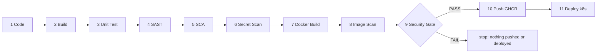

The job timestamps of the final run confirm the strict order (each job starts ~2 s after the previous one ends):

```
$ gh run view 37547817960 --json jobs --jq '.jobs[] | "\(.name)\t\(.conclusion)\t\(.startedAt)\t\(.completedAt)"'
1. Code	success	2026-10-06T23:40:15Z	2026-10-06T23:40:19Z
2. Build	success	2026-10-06T23:40:21Z	2026-10-06T23:40:29Z
3. Unit Test	success	2026-10-06T23:40:31Z	2026-10-06T23:40:40Z
4. SAST (Bandit + Semgrep)	success	2026-10-06T23:40:42Z	2026-10-06T23:41:04Z
5. SCA (pip-audit + Trivy fs)	success	2026-10-06T23:41:06Z	2026-10-06T23:41:36Z
6. Secret Scan (gitleaks)	success	2026-10-06T23:41:38Z	2026-10-06T23:41:44Z
7. Docker Build	success	2026-10-06T23:41:46Z	2026-10-06T23:42:09Z
8. Container Image Scan (Trivy)	success	2026-10-06T23:42:11Z	2026-10-06T23:42:24Z
9. Security Gate	success	2026-10-06T23:42:26Z	2026-10-06T23:42:31Z
10. Push Image (GHCR)	success	2026-10-06T23:42:33Z	2026-10-06T23:42:54Z
11. Deploy to Kubernetes (kind)	success	2026-10-06T23:42:58Z	2026-10-06T23:43:55Z
```

Total ≈ 3m45s. The scanner stages are independent of each other and *could* run in parallel (≈1 minute faster); I kept them sequential because the assignment specifies this order and it makes the run page read exactly like the Expected Flow.

**Screenshot:** 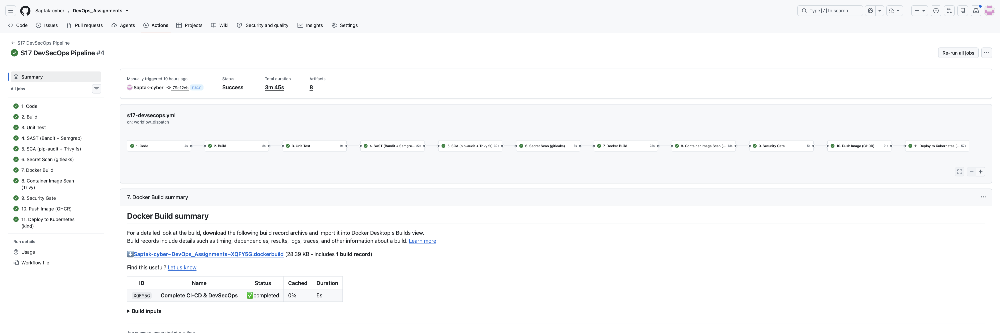

---

## 2. How the Workflow Is Built

Key decisions, and how they differ from the class `demo/.github/workflows/devsecops.yml`:

| Decision | Why |
| --- | --- |
| **Scanners report, the gate decides.** Every scanner job writes JSON and uploads it; only job 9 fails the pipeline. | One policy file instead of thresholds scattered over CLI flags; every report is still produced when one tool finds something, so the developer sees *all* problems in one run. |
| **Fail-closed gate.** A missing/unreadable report fails the gate. | A scanner that silently crashed must not count as "no findings". |
| **Build once, scan it, push it.** Job 7 exports the image as a tarball artifact; job 8 scans that file; job 10 `docker load`s and pushes that same file. | The class workflow rebuilt the image in the scan job and again in the push job — the pushed image was never the scanned one. Here the deploy job even verifies the running digest. |
| **Pinned tools, checksum-verified.** Trivy and gitleaks are downloaded as fixed release versions and checked against the release's `checksums.txt`; Bandit/Semgrep/pip-audit are pinned in `pip install`. | A security pipeline is itself supply chain. A mutable action tag (e.g. `@master`) can be repointed — that is how `tj-actions/changed-files` was compromised in March 2025. |
| **GHCR via `GITHUB_TOKEN`**, not Docker Hub + a PAT secret. | No long-lived secret to manage; `packages: write` only on job 10, `packages: read` on job 11. |
| **kind inside the runner** instead of `KUBE_CONFIG` secret. | A hosted runner can't reach a laptop cluster (the class `03-kubernetes-deployment` note). A per-run kind cluster gives a real `kubectl apply` + rollout + smoke test with no credentials. |
| **SAST: Bandit + Semgrep instead of CodeQL.** | Both run identically locally and in CI and produce JSON the gate can count; CodeQL results go to the Security tab and are harder to gate on locally. |
| Push/deploy run on `push` to `main` and `workflow_dispatch`, not on PRs. | PRs still get the full scan + gate result as a check. |
| `paths:` filter + `!**/*.md`, `!screenshots/**` | Only this folder triggers this pipeline, and README edits don't rebuild/redeploy. |

Workflow-level settings:

```yaml
permissions:
  contents: read
concurrency:
  group: s17-devsecops-${{ github.ref }}
  cancel-in-progress: true
env:
  APP_DIR: "Complete CI-CD & DevSecOps"
  IMAGE_NAME: ghcr.io/saptak-cyber/s17-devsecops-dashboard
  PYTHON_VERSION: "3.12"
  TRIVY_VERSION: "0.75.0"
  GITLEAKS_VERSION: "8.30.1"
defaults:
  run:
    shell: bash
    working-directory: "Complete CI-CD & DevSecOps"
```

---

# CI/CD

## 3. Application Build

**Jobs `1. Code` and `2. Build`.** The app is the instructor's Flask dashboard (`/`, `/health`, `/api/status`, `/api/greet/<name>`, `/api/add`, `/api/calculate`, `/api/pipeline/run`). For Python, "build" means: install the pinned runtime dependencies, byte-compile, prove the app imports and registers its routes, and package the source.

`1. Code` (run 37547817960):

```
Event : workflow_dispatch   Ref: refs/heads/main
Commit: 79c12ebb56961e9890106530329a81c5ab3cd6ea
...
Files in this project folder:
  .bandit.yml
  .dockerignore
  .github/workflows/s17-devsecops.yml
  .gitignore
  .gitleaks.toml
  .trivyignore
  Dockerfile
  app/__init__.py
  app/app.py
  app/static/css/styles.css
  app/static/js/main.js
  app/templates/index.html
  k8s/deployment.yaml
  k8s/service.yaml
  pytest.ini
  requirements-dev.txt
  requirements.txt
  security/gate-policy.toml
  security/security_gate.py
  tests/test_app.py
```

`2. Build`:

```
python -m compileall -q app
python -c "from app.app import app; print('Routes:'); ..."
Routes:
   /
   /api/add
   /api/calculate
   /api/greet/<name>
   /api/pipeline/run
   /api/status
   /health
   /static/<path:filename>
...
-rw-r--r-- 1 runner runner 12189 Oct  6 23:40 session17-app-79c12eb.tar.gz
e2a007969c427d05bd580bc00ca859c8e697fb6982773273c207ec098c1a19bd  dist/session17-app-79c12eb.tar.gz
...
Artifact app-build has been successfully uploaded! Final size is 12356 bytes. Artifact ID is 11450794140
```

`requirements.txt` pins **every** runtime package (Flask's dependencies included), not just `Flask==3.1.3`. Without that, the image would contain whatever Werkzeug/Jinja2 version was newest on build day, and the SCA scan of `requirements.txt` would not describe what actually ships.

---

## 4. Unit Testing

**Job `3. Unit Test`.** The instructor's 8 tests, with coverage and a JUnit report uploaded as an artifact.

Local:

```
$ python -m pytest -v --cov=app --cov-report=term-missing
platform darwin -- Python 3.14.3, pytest-9.1.1, pluggy-1.6.0
...
tests/test_app.py::test_home PASSED                                      [ 12%]
tests/test_app.py::test_health PASSED                                    [ 25%]
tests/test_app.py::test_greet PASSED                                     [ 37%]
tests/test_app.py::test_add_numbers PASSED                               [ 50%]
tests/test_app.py::test_add_numbers_missing_fields PASSED                [ 62%]
tests/test_app.py::test_calculator_multiply PASSED                       [ 75%]
tests/test_app.py::test_calculator_divide_by_zero PASSED                 [ 87%]
tests/test_app.py::test_status PASSED                                    [100%]
...
Name              Stmts   Miss  Cover   Missing
-----------------------------------------------
app/__init__.py       0      0   100%
app/app.py          102     32    69%   94, 104-105, 121, 128, 132-133, 145, 179-209, 225, 230, 239
-----------------------------------------------
TOTAL               102     32    69%
======================== 8 passed, 6 warnings in 0.23s =========================
```

CI (run 37547817960):

```
platform linux -- Python 3.12.14, pytest-9.1.1, pluggy-1.6.0 -- /opt/hostedtoolcache/Python/3.12.14/x64/bin/python
rootdir: /home/runner/work/DevOps_Assignments/DevOps_Assignments/Complete CI-CD & DevSecOps
collecting ... collected 8 items
...
tests/test_app.py::test_status PASSED                                    [100%]

- generated xml file: /home/runner/work/DevOps_Assignments/DevOps_Assignments/Complete CI-CD & DevSecOps/reports/junit.xml -
app/app.py          102     32    69%   94, 104-105, 121, 128, 132-133, 145, 179-209, 225, 230, 239
TOTAL               102     32    69%
Coverage XML written to file reports/coverage.xml
============================== 8 passed in 0.22s ===============================
```

The 6 local warnings are `datetime.datetime.utcnow()` deprecations in the class `app.py` (Python 3.12+); CI runs with `-W ignore::DeprecationWarning` to keep the log readable. Coverage is 69% — `/api/pipeline/run` (lines 179–209) has no test; I left the instructor's test suite as is and did not add a coverage threshold to the gate.

---

## 5. Docker Image Build

**Job `7. Docker Build`.** [`Dockerfile`](./Dockerfile) — changes vs the class Dockerfile:

| Class | This project | Why |
| --- | --- | --- |
| `CMD ["python", "app/app.py"]` (Flask dev server, `debug=True`) | `gunicorn --bind 0.0.0.0:5001 --workers 2 --no-control-socket app.app:app` | production WSGI server; debug off |
| runs as root | `useradd --uid 10001` + `USER 10001` | Semgrep `dockerfile.security.missing-user` (§8) |
| `pip install -r requirements.txt` | `--no-cache-dir`, `PIP_NO_CACHE_DIR=1` | smaller image, no cache layer |
| no healthcheck | `HEALTHCHECK` on `/health` | |
| `.dockerignore` empty | excludes tests, k8s, security configs, reports, docs | smaller build context; only `app/` + `requirements.txt` reach the image |

CI output — built once, exported as a tarball, then inspected:

```
...
#6 [1/6] FROM docker.io/library/python:3.12-slim@sha256:05cda9777409a9c3ffddd94a4c476b79f0769a0b4857f0c7ed9226b6800b0d6f
#7 [2/6] WORKDIR /app
#8 [3/6] COPY requirements.txt .
#9 [4/6] RUN pip install --no-cache-dir -r requirements.txt
#10 [5/6] COPY app ./app
#11 [6/6] RUN useradd --uid 10001 --no-create-home --shell /usr/sbin/nologin appuser
#12 exporting to docker image format
#12 exporting manifest sha256:ee0506f8a29bef9c0bafdb5c2243616802ad7f31e94818c00fa2c192de4af2a6 done
#12 sending tarball 0.2s done
...
Loaded image: ghcr.io/saptak-cyber/s17-devsecops-dashboard:79c12ebb56961e9890106530329a81c5ab3cd6ea
Loaded image: ghcr.io/saptak-cyber/s17-devsecops-dashboard:latest
REPOSITORY                                     TAG                                        IMAGE ID       CREATED         SIZE
ghcr.io/saptak-cyber/s17-devsecops-dashboard   79c12ebb56961e9890106530329a81c5ab3cd6ea   120d46a80a56   4 seconds ago   126MB
ghcr.io/saptak-cyber/s17-devsecops-dashboard   latest                                     120d46a80a56   4 seconds ago   126MB
User=10001  Cmd=["gunicorn","--bind","0.0.0.0:5001","--workers","2","--no-control-socket","--access-logfile","-","app.app:app"]  ExposedPorts={"5001/tcp":{}}
...
Artifact docker-image has been successfully uploaded! Final size is 45205253 bytes. Artifact ID is 11451267259
```

Local run with the same restrictions Kubernetes applies (read-only root FS, `/tmp` as tmpfs, all capabilities dropped):

```
$ docker run -d --name s17-local --read-only --tmpfs /tmp --cap-drop ALL -p 15001:5001 s17-devsecops:local
$ curl -s http://localhost:15001/health
{"status":"healthy","timestamp":"2026-10-06T23:28:58.173093Z","uptime_seconds":2.61}
$ curl -s http://localhost:15001/api/status
{"app":"DevSecOps Dashboard","platform":"Linux","python_version":"3.12.15","status":"running","timestamp":"2026-10-06T23:28:58.186085Z","total_requests":2,"uptime":"00h 00m 02s","version":"2.0.0"}
$ curl -s -X POST http://localhost:15001/api/calculate -H 'Content-Type: application/json' -d '{"a": 6, "b": 7, "operation": "multiply"}'
{"a":6.0,"b":7.0,"expression":"6.0 × 7.0 = 42.0","operation":"multiply","result":42.0,"symbol":"×"}
$ docker exec s17-local id
uid=10001(appuser) gid=10001(appuser) groups=10001(appuser)
$ docker logs s17-local
[2026-10-06 23:28:55 +0000] [1] [INFO] Starting gunicorn 26.2.0
[2026-10-06 23:28:55 +0000] [1] [INFO] Listening at: http://0.0.0.0:5001 (1)
[2026-10-06 23:28:55 +0000] [1] [INFO] Using worker: sync
[2026-10-06 23:28:55 +0000] [7] [INFO] Booting worker with pid: 7
[2026-10-06 23:28:55 +0000] [8] [INFO] Booting worker with pid: 8
...
```

**Problem found while doing this:** the first version of the image logged, under `--read-only`,

```
[2026-10-06 23:28:37 +0000] [1] [ERROR] Control server error: [Errno 30] Read-only file system: '/home/appuser'
```

gunicorn 26 opens a control socket at `~/.gunicorn/gunicorn.ctl` by default; with a read-only root filesystem (which the k8s manifest enforces) that fails. `gunicorn --help` lists `--no-control-socket`; adding it removed the error (second log above). Testing the image locally under the same constraints as the cluster caught this before it reached Kubernetes.

**Screenshot:** 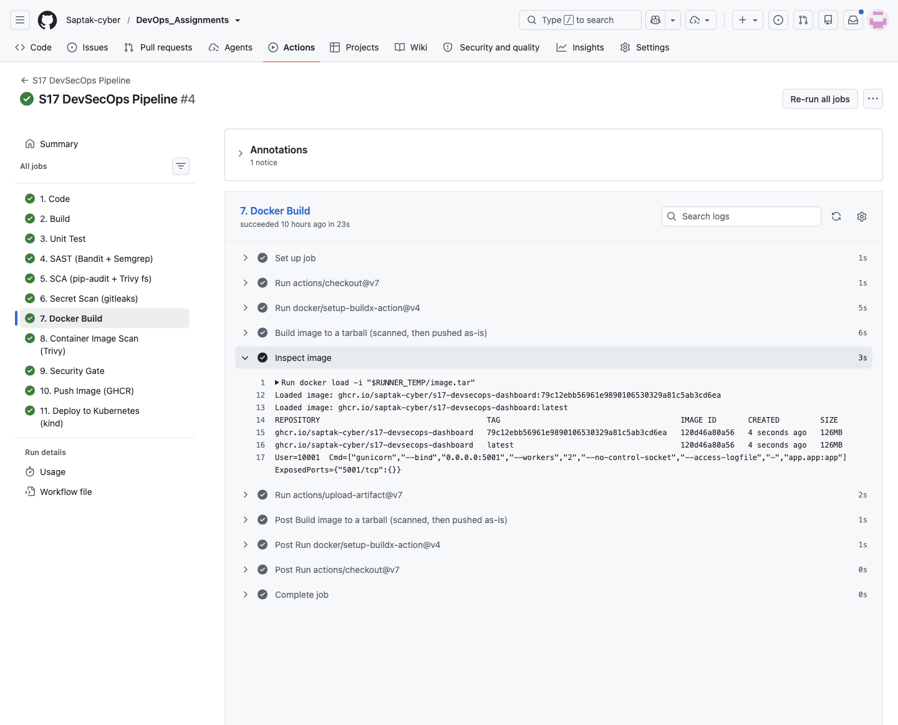

---

## 6. Container Registry (GHCR)

**Job `10. Push Image (GHCR)`** — only runs if job 9 passed. It loads the tarball that was scanned, logs in with `GITHUB_TOKEN` and pushes two tags:

```yaml
  push:
    needs: security-gate
    if: github.event_name != 'pull_request'
    permissions:
      contents: read
      packages: write
```

```
Loaded image: ghcr.io/saptak-cyber/s17-devsecops-dashboard:79c12ebb56961e9890106530329a81c5ab3cd6ea
Loaded image: ghcr.io/saptak-cyber/s17-devsecops-dashboard:latest
Logging into ghcr.io...
Login Succeeded!
The push refers to repository [ghcr.io/saptak-cyber/s17-devsecops-dashboard]
aacf9768a24d: Pushed
fe165c76f5a1: Pushed
...
15f1c8eb1ab1: Pushed
79c12ebb56961e9890106530329a81c5ab3cd6ea: digest: sha256:1b0b2b29a7fbddc572492baddd144dec9e1d4118b493f75f767d32d5d7242c5f size: 2200
The push refers to repository [ghcr.io/saptak-cyber/s17-devsecops-dashboard]
1df20e74aa15: Layer already exists
...
latest: digest: sha256:1b0b2b29a7fbddc572492baddd144dec9e1d4118b493f75f767d32d5d7242c5f size: 2200
Pushed ghcr.io/saptak-cyber/s17-devsecops-dashboard:79c12ebb56961e9890106530329a81c5ab3cd6ea@sha256:1b0b2b29a7fbddc572492baddd144dec9e1d4118b493f75f767d32d5d7242c5f
```

The second push only uploads a manifest ("Layer already exists") — both tags point at the same digest. The digest is exported as a job output for the deploy job.

**Visibility.** `gh api '/users/Saptak-cyber/packages?package_type=container'` returned `HTTP 403 — You need at least read:packages scope` (my `gh` token has `repo`/`workflow` only), so I checked from the outside with an anonymous registry token:

```
$ TOKEN=$(curl -s "https://ghcr.io/token?scope=repository:saptak-cyber/s17-devsecops-dashboard:pull" | jq -r .token)
$ curl -s -o /dev/null -w '%{http_code}\n' -H "Authorization: Bearer $TOKEN" -H 'Accept: application/vnd.oci.image.index.v1+json,application/vnd.docker.distribution.manifest.v2+json' https://ghcr.io/v2/saptak-cyber/s17-devsecops-dashboard/manifests/latest
200
```

Observed: the package is **publicly pullable** (published by `GITHUB_TOKEN` from a public repository); I did not change its visibility. The deploy job still creates an image pull secret, so the pipeline would keep working if the package were private.

**Screenshot:** 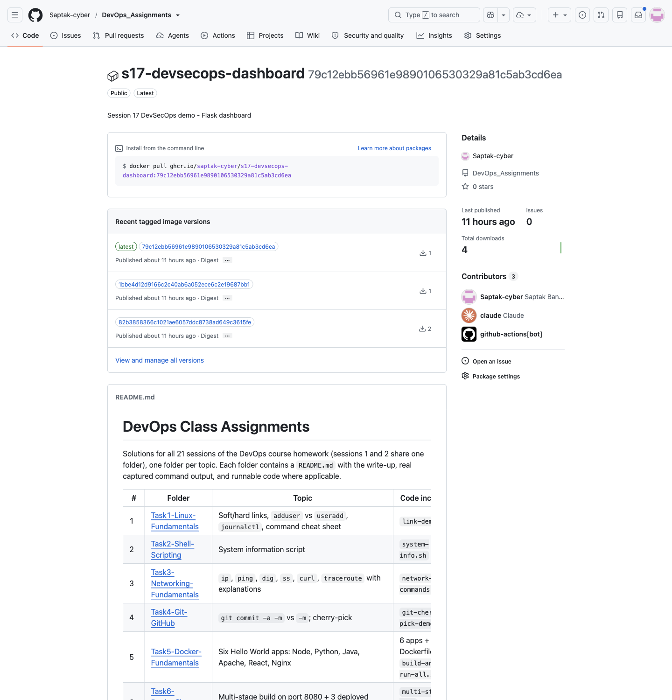

---

## 7. Kubernetes Deployment

**Manifests:** [`k8s/deployment.yaml`](./k8s/deployment.yaml), [`k8s/service.yaml`](./k8s/service.yaml) — the class `session17-python` Deployment/Service, with:

- `image: __IMAGE__` placeholder (the class file had `nensiravaliya28/hey-cicd:__IMAGE_TAG__`), replaced by the deploy job with the tag that passed the gate;
- `imagePullSecrets: ghcr-pull`, readiness + liveness probes on `/health`, CPU/memory requests and limits;
- pod `runAsNonRoot`/`runAsUser: 10001`, `seccompProfile: RuntimeDefault`; container `allowPrivilegeEscalation: false`, `readOnlyRootFilesystem: true`, `capabilities.drop: [ALL]`, and an `emptyDir` on `/tmp` for gunicorn's worker heartbeat files.

**Job `11. Deploy to Kubernetes (kind)`** (run 37547817960):

```
Creating cluster "s17-ci" ...
 ✓ Ensuring node image (kindest/node:v1.37.0) 🖼️
 ✓ Preparing nodes 📦
 ✓ Writing configuration 📜
 ✓ Starting control-plane 🕹️
 ✓ Installing CNI 🔌
 ✓ Installing StorageClass 💾
 ✓ Waiting ≤ 1m0s for control-plane = Ready ⏳
 • Ready after 17s 💚
Set kubectl context to "kind-s17-ci"

$ kubectl get nodes -o wide
NAME                   STATUS   ROLES           AGE   VERSION   INTERNAL-IP   EXTERNAL-IP   OS-IMAGE                       KERNEL-VERSION              CONTAINER-RUNTIME
s17-ci-control-plane   Ready    control-plane   21s   v1.37.0   172.18.0.2    <none>        Debian GNU/Linux 13 (trixie)   6.17.0-1022-azure (amd64)   containerd://2.3.4

kubectl create secret docker-registry ghcr-pull --docker-server=ghcr.io \
  --docker-username="Saptak-cyber" --docker-***
secret/ghcr-pull created

29:          image: ghcr.io/saptak-cyber/s17-devsecops-dashboard:79c12ebb56961e9890106530329a81c5ab3cd6ea
deployment.apps/session17-python created
service/session17-python created

$ kubectl rollout status deployment/session17-python --timeout=180s
Waiting for deployment "session17-python" rollout to finish: 0 of 2 updated replicas are available...
Waiting for deployment "session17-python" rollout to finish: 1 of 2 updated replicas are available...
deployment "session17-python" successfully rolled out
```

```
NAME                               READY   UP-TO-DATE   AVAILABLE   AGE   CONTAINERS         IMAGES                                                                                  SELECTOR
deployment.apps/session17-python   2/2     2            2           10s   session17-python   ghcr.io/saptak-cyber/s17-devsecops-dashboard:79c12ebb56961e9890106530329a81c5ab3cd6ea   app=session17-python

NAME                                          DESIRED   CURRENT   READY   AGE   CONTAINERS         IMAGES                                                                                  SELECTOR
replicaset.apps/session17-python-848c5f4d85   2         2         2       10s   session17-python   ghcr.io/saptak-cyber/s17-devsecops-dashboard:79c12ebb56961e9890106530329a81c5ab3cd6ea   app=session17-python,pod-template-hash=848c5f4d85

NAME                                    READY   STATUS    RESTARTS   AGE   IP           NODE                   NOMINATED NODE   READINESS GATES
pod/session17-python-848c5f4d85-8k5nt   1/1     Running   0          10s   10.244.0.6   s17-ci-control-plane   <none>           <none>
pod/session17-python-848c5f4d85-b446x   1/1     Running   0          10s   10.244.0.5   s17-ci-control-plane   <none>           <none>

NAME                       TYPE        CLUSTER-IP     EXTERNAL-IP   PORT(S)        AGE   SELECTOR
service/kubernetes         ClusterIP   10.96.0.1      <none>        443/TCP        30s   <none>
service/session17-python   NodePort    10.96.92.205   <none>        80:30001/TCP   10s   app=session17-python
Pushed digest : sha256:1b0b2b29a7fbddc572492baddd144dec9e1d4118b493f75f767d32d5d7242c5f
session17-python-848c5f4d85-8k5nt  ghcr.io/saptak-cyber/s17-devsecops-dashboard@sha256:1b0b2b29a7fbddc572492baddd144dec9e1d4118b493f75f767d32d5d7242c5f
session17-python-848c5f4d85-b446x  ghcr.io/saptak-cyber/s17-devsecops-dashboard@sha256:1b0b2b29a7fbddc572492baddd144dec9e1d4118b493f75f767d32d5d7242c5f
Running pods use the digest that passed the gate.
```

The chain of custody closes here: digest pushed in job 10 = `imageID` of both running pods. (In the echoed script line the runner's log masking redacted the rest of the password argument: `--docker-***`.)

Smoke test:

```
+ curl -fsS http://127.0.0.1:8080/health
{"status":"healthy","timestamp":"2026-10-06T23:43:51.044711Z","uptime_seconds":4.29}
+ curl -fsS http://127.0.0.1:8080/api/status
{"app":"DevSecOps Dashboard","platform":"Linux","python_version":"3.12.15","status":"running","timestamp":"2026-10-06T23:43:51.053438Z","total_requests":3,"uptime":"00h 00m 04s","version":"2.0.0"}
+ curl -fsS -X POST http://127.0.0.1:8080/api/calculate -H 'Content-Type: application/json' -d '{"a": 6, "b": 7, "operation": "multiply"}'
calculate OK: 6.0 × 7.0 = 42.0
+ curl -fsS http://127.0.0.1:8080/
<title>DevSecOps Dashboard | Session 17</title>
SMOKE TEST PASSED
```

```
[pod/session17-python-848c5f4d85-8k5nt/session17-python] [2026-10-06 23:43:45 +0000] [1] [INFO] Starting gunicorn 26.2.0
[pod/session17-python-848c5f4d85-8k5nt/session17-python] [2026-10-06 23:43:45 +0000] [1] [INFO] Listening at: http://0.0.0.0:5001 (1)
[pod/session17-python-848c5f4d85-8k5nt/session17-python] 10.244.0.1 - - [06/Oct/2026:23:43:49 +0000] "GET /health HTTP/1.1" 200 85 "-" "kube-probe/1.37"
[pod/session17-python-848c5f4d85-8k5nt/session17-python] 127.0.0.1 - - [06/Oct/2026:23:43:51 +0000] "POST /api/calculate HTTP/1.1" 200 110 "-" "curl/8.5.0"
[pod/session17-python-848c5f4d85-8k5nt/session17-python] 127.0.0.1 - - [06/Oct/2026:23:43:51 +0000] "GET / HTTP/1.1" 200 6589 "-" "curl/8.5.0"
...
Deleting cluster "s17-ci" ...
Deleted nodes: ["s17-ci-control-plane"]
```

No `Control server error` in the pod logs — the read-only root filesystem works with the `--no-control-socket` fix. `kube-probe/1.37` requests are the readiness/liveness probes.

**Screenshot:** 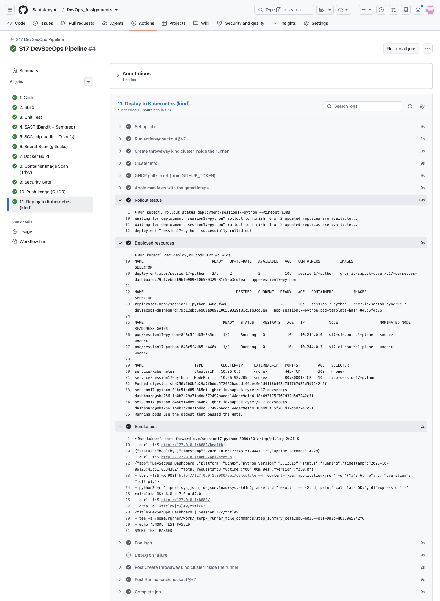

---

# Security

## 8. SAST — Bandit + Semgrep

**Job `4. SAST`.** Bandit walks the Python AST for risky calls; Semgrep runs registry rule packs `p/python`, `p/flask` and `p/dockerfile` over `app/` and the `Dockerfile`. Config: [`.bandit.yml`](./.bandit.yml) (excludes `tests/`, no globally skipped checks — suppressions must be per-line `# nosec BXXX` so they stay visible in review).

### Before: the instructor's original code

I first ran both tools on an untouched copy of the class `demo/` folder:

```
$ bandit -r app
...
>> Issue: [B201:flask_debug_true] A Flask app appears to be run with debug=True, which exposes the Werkzeug debugger and allows the execution of arbitrary code.
   Severity: High   Confidence: Medium
   CWE: CWE-94 (https://cwe.mitre.org/data/definitions/94.html)
   Location: app/app.py:234:4
233	if __name__ == "__main__":
234	    app.run(host="0.0.0.0", port=5001, debug=True)

--------------------------------------------------
>> Issue: [B104:hardcoded_bind_all_interfaces] Possible binding to all interfaces.
   Severity: Medium   Confidence: Medium
   CWE: CWE-605 (https://cwe.mitre.org/data/definitions/605.html)
   Location: app/app.py:234:17
...
	Total issues (by severity):
		Undefined: 0
		Low: 5
		Medium: 1
		High: 1
```

```
$ semgrep scan --config p/python --config p/flask --config p/dockerfile --metrics=off app Dockerfile   # instructor original
    Dockerfile
   ❯❯❱ dockerfile.security.missing-user.missing-user
          ❰❰ Blocking ❱❱
          By not specifying a USER, a program in the container may run as 'root'. This is a security hazard.
           13┆ CMD ["python", "app/app.py"]

    app/app.py
    ❯❱ python.flask.security.audit.app-run-param-config.avoid_app_run_with_bad_host
          ❰❰ Blocking ❱❱
          Running flask app with host 0.0.0.0 could expose the server publicly.
          234┆ app.run(host="0.0.0.0", port=5001, debug=True)

    ❯❱ python.flask.security.audit.debug-enabled.debug-enabled
          ❰❰ Blocking ❱❱
          Detected Flask app with debug=True. Do not deploy to production with this flag enabled as it will
          leak sensitive information. ...
          234┆ app.run(host="0.0.0.0", port=5001, debug=True)

[exit code: 0]
```

The class Dockerfile ran exactly that line (`CMD ["python", "app/app.py"]`), so the deployed container exposed the **Werkzeug interactive debugger** — remote code execution for anyone who can trigger an exception — on `0.0.0.0`, as root. Note Semgrep's exit code is **0** even with "Blocking" findings unless `--error` is passed: a scanner that runs is not the same as a scanner that gates, which is why the pipeline counts findings from JSON in the gate.

### Fix

```python
if __name__ == "__main__":
    app.run(
        host=os.environ.get("HOST", "127.0.0.1"),
        port=int(os.environ.get("PORT", "5001")),
        debug=os.environ.get("FLASK_DEBUG") == "1",
    )
```

The `__main__` block is now only a local-dev entry point (localhost, debug opt-in); the container uses gunicorn, and the Dockerfile sets `USER 10001`.

### After — local

```
$ bandit -c .bandit.yml -r app
...
>> Issue: [B311:blacklist] Standard pseudo-random generators are not suitable for security/cryptographic purposes.
   Severity: Low   Confidence: High
   Location: app/app.py:79:19
78	    return jsonify({
79	        "message": random.choice(greetings),
...
	Total issues (by severity):
		Undefined: 0
		Low: 5
		Medium: 0
		High: 0

$ semgrep scan --config p/python --config p/flask --config p/dockerfile --metrics=off --disable-version-check app Dockerfile
  Scanning 6 files tracked by git with 158 Code rules:
  Language     Rules   Files          Origin      Rules
  python         151       2          Community     158
  dockerfile       7       1
✅ Scan completed successfully.
 • Findings: 0 (0 blocking)
 • Rules run: 158
Ran 158 rules on 3 files: 0 findings.
```

The remaining 5 Bandit **LOW** findings are all B311 (`random.choice`, `random.random`, `random.uniform`, `random.randint`) in the greeting picker and the *pipeline simulator* endpoint — random numbers for a UI demo, not tokens or keys. The policy reports LOW but does not block on it (§12) rather than silencing the check with `# nosec`.

### After — CI (job `4. SAST`, run 37547817960)

```
[main]	INFO	using config: .bandit.yml
[main]	INFO	running on Python 3.12.15
...
Code scanned:
	Total lines of code: 172
	Total lines skipped (#nosec): 0
...
	Total issues (by severity):
		Undefined: 0
		Low: 5
		Medium: 0
		High: 0
...
 • Findings: 0 (0 blocking)
 • Rules run: 158
Ran 158 rules on 3 files: 0 findings.
Semgrep findings: 0
```

**Screenshot:** 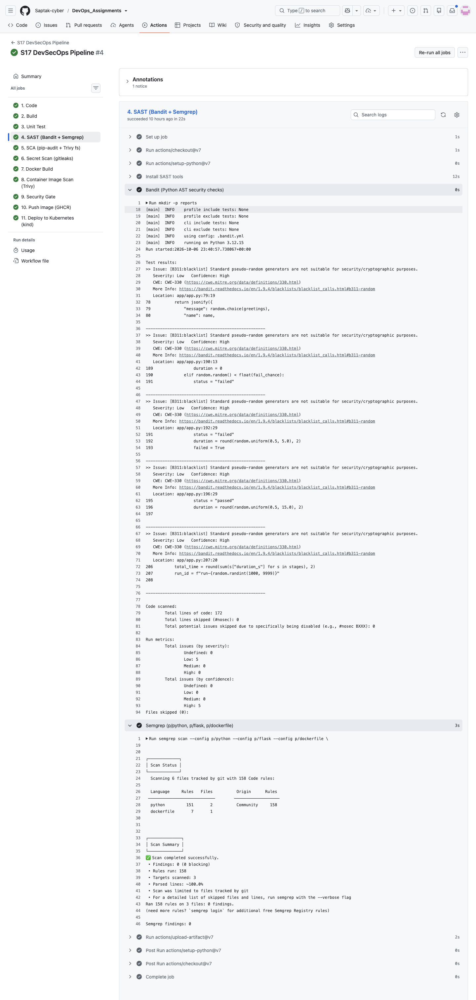

---

## 9. SCA — pip-audit + Trivy fs

**Job `5. SCA`.** Two databases, two views of the same dependencies: `pip-audit -r requirements-dev.txt` resolves the full dependency tree (runtime **and** dev/test tools) against the PyPI/OSV advisory DB; `trivy fs .` reads the pinned `requirements.txt` against NVD/GHSA and adds **severities**, which pip-audit doesn't provide.

### Finding in the class pins

```
$ pip-audit -r requirements.txt          # instructor's requirements (Flask==3.1.3)
No known vulnerabilities found
exit=0
$ pip-audit -r requirements-dev.txt      # instructor's dev requirements
Found 2 known vulnerabilities in 1 package
Name   Version ID              Fix Versions
------ ------- --------------- ------------
pytest 8.4.2   PYSEC-2026-1845 9.0.3
pytest 8.4.2   PYSEC-2026-1845 9.0.3
exit=1
```

`PYSEC-2026-1845` (aliases `GHSA-6w46-j5rx-g56g`, `CVE-2025-71176`): *"pytest through 9.0.2 on UNIX relies on directories with the `/tmp/pytest-of-{user}` name pattern, which allows local users to cause a denial of service or possibly gain privileges."* pytest never ships in the image, but it **runs on every CI runner and developer machine**, which is why dev dependencies are in scope. (pip-audit printed the same advisory twice here; the gate de-duplicates by package + ID before counting.) Remediation, following the class `05-sca` flow — identify, upgrade, re-test, re-scan:

```
# requirements-dev.txt
-pytest==8.4.2
-pytest-cov==6.0.0
+pytest==9.1.1
+pytest-cov==7.1.0
```

Tests still pass on 9.1.1 (§4). Session 16's project got the same bump.

### After — local and CI

```
$ pip-audit --progress-spinner off -r requirements-dev.txt
...
No known vulnerabilities found
[exit code: 0]

$ trivy fs --quiet --scanners vuln --severity HIGH,CRITICAL .
Report Summary
┌──────────────────┬──────┬─────────────────┐
│      Target      │ Type │ Vulnerabilities │
├──────────────────┼──────┼─────────────────┤
│ requirements.txt │ pip  │        0        │
└──────────────────┴──────┴─────────────────┘
[exit code: 0]
```

CI (job `5. SCA`):

```
trivy_0.75.0_Linux-64bit.tar.gz: OK
Version: 0.75.0
...
No known vulnerabilities found
No known vulnerabilities found
...
2026-10-06T23:41:28Z	INFO	[vulndb] Downloading artifact...	repo="mirror.gcr.io/aquasec/trivy-db:2"
2026-10-06T23:41:33Z	INFO	[pip] Detecting vulnerabilities...
│ requirements.txt │ pip  │        0        │
```

`trivy_0.75.0_Linux-64bit.tar.gz: OK` is the `sha256sum -c` check of the downloaded binary against the release checksums. Trivy fs picked up only `requirements.txt`, not `requirements-dev.txt` (see the Report Summary), which is one more reason the pip-audit run over `requirements-dev.txt` is needed.

**Screenshot:** 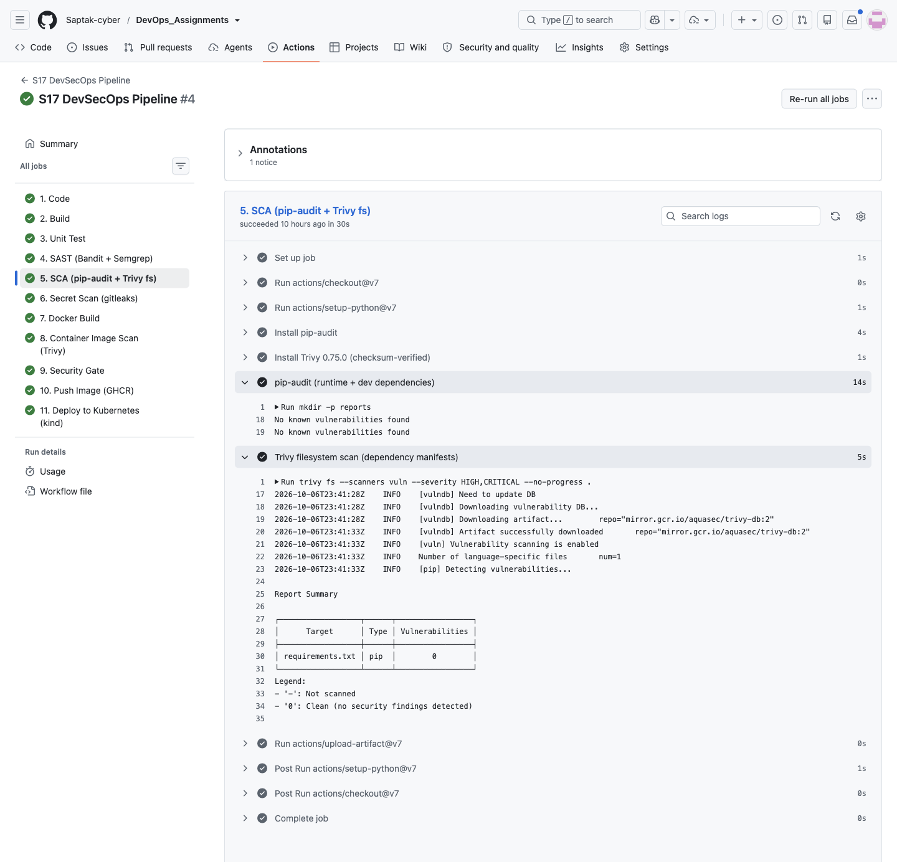

---

## 10. Secret Scanning — gitleaks

**Job `6. Secret Scan`.** Config: [`.gitleaks.toml`](./.gitleaks.toml):

- `[extend] useDefault = true` — all built-in gitleaks rules (AWS, GitHub, Slack, private keys, generic API keys, …);
- one custom rule, `course-demo-api-key`, for the class convention from `06-secret-scanning` (`DEMO_API_KEY=replace-with-test-value`): it fires when `DEMO_API_KEY` is assigned a 16+ character value, with the documented placeholder allowlisted;
- an allowlist for generated paths (`reports/`, `.pytest_cache/`, `__pycache__/`, `.coverage`).

The job runs two scans: the **current files** of the folder (`gitleaks dir`) and the **entire git history** of the folder on all refs (`gitleaks git` with `fetch-depth: 0` and `--log-opts="--all -- :(glob)Complete*DevSecOps/**"`). The history scan matters because deleting a leaked key in a later commit does not remove it from history.

### Proving the rules fire (local, fake values, outside the repo)

To show detection without ever committing anything secret-looking, I created a scratch directory **outside the repository** containing this folder's `.gitleaks.toml`, a `settings.py` with a made-up `DEMO_API_KEY` value, the placeholder `replace-with-test-value`, and a dummy Slack-webhook-shaped URL made of zeros and X's, plus a `.env.example` with the placeholder. Output (`--redact` hides the values):

```
$ gitleaks dir . --config .gitleaks.toml --no-banner --redact -v
Finding:     DEMO_API_KEY = "REDACTED"
Secret:      REDACTED
RuleID:      course-demo-api-key
Entropy:     4.349192
File:        settings.py
Line:        2
Fingerprint: settings.py:course-demo-api-key:2

Finding:     SLACK_WEBHOOK = "REDACTED
Secret:      REDACTED
RuleID:      slack-webhook-url
Entropy:     3.400964
File:        settings.py
Line:        4
Fingerprint: settings.py:slack-webhook-url:4

5:02AM INF scanned ~312 bytes (312 bytes) in 3.32ms
5:02AM WRN leaks found: 2
[exit code: 1]
```

The custom rule and a built-in rule both fire; both placeholder lines (`settings.py` line 3 and `.env.example`) are correctly **not** reported. The fake values are deliberately not reproduced in this README — it is itself scanned by the pipeline.

### Real scan of this project

Local:

```
$ gitleaks dir . --config .gitleaks.toml --no-banner --redact -v
5:17AM INF scanned ~73378 bytes (73.38 KB) in 9.96ms
5:17AM INF no leaks found
[exit code: 0]
```

CI (job `6. Secret Scan`):

```
gitleaks_8.30.1_linux_x64.tar.gz: OK
8.30.1
...
11:41PM INF scanned ~73378 bytes (73.38 KB) in 11.5ms
11:41PM INF no leaks found
...
11:41PM INF 2 commits scanned.
11:41PM INF scanned ~74448 bytes (74.45 KB) in 134ms
11:41PM INF no leaks found
Total gitleaks findings: 0
```

"2 commits scanned" = the two commits on `main` that touched this folder's code at that point. If a real credential were ever found: rotate/revoke it first, then clean history — deleting the line is not enough (class `06-secret-scanning`).

**Screenshot:** 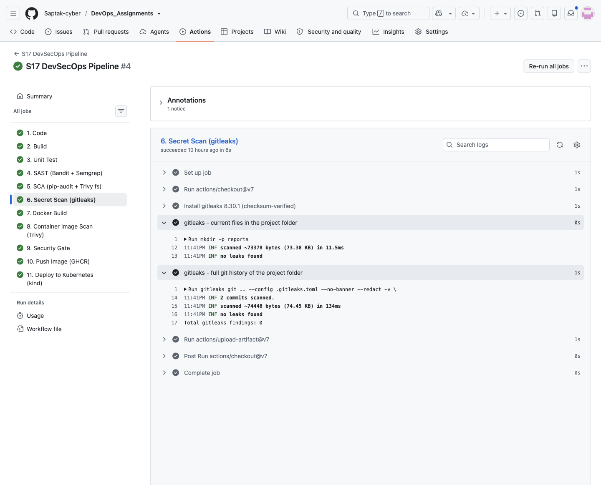

---

## 11. Container Image Scanning — Trivy

**Job `8. Container Image Scan`.** Scans the **tarball from job 7** (`trivy image --input image.tar`) — OS packages of the Debian base and every Python package in `site-packages`. Two passes: a human-readable table of *fixable* HIGH/CRITICAL, and a full JSON report for the gate.

CI (run 37547817960):

```
2026-10-06T23:42:22Z	INFO	Detected OS	family="debian" version="13.7"
2026-10-06T23:42:22Z	INFO	[debian] Detecting vulnerabilities...	os_version="13" pkg_num=87
...
│ /home/runner/work/_temp/image.tar (debian 13.7)                              │   debian   │        0        │
│ usr/local/lib/python3.12/site-packages/blinker-1.9.0.dist-info/METADATA      │ python-pkg │        0        │
│ usr/local/lib/python3.12/site-packages/click-8.5.0.dist-info/METADATA        │ python-pkg │        0        │
│ usr/local/lib/python3.12/site-packages/flask-3.1.3.dist-info/METADATA        │ python-pkg │        0        │
│ usr/local/lib/python3.12/site-packages/gunicorn-26.2.0.dist-info/METADATA    │ python-pkg │        0        │
│ usr/local/lib/python3.12/site-packages/itsdangerous-2.2.0.dist-info/METADATA │ python-pkg │        0        │
│ usr/local/lib/python3.12/site-packages/jinja2-3.1.6.dist-info/METADATA       │ python-pkg │        0        │
│ usr/local/lib/python3.12/site-packages/markupsafe-3.0.4.dist-info/METADATA   │ python-pkg │        0        │
│ usr/local/lib/python3.12/site-packages/pip-25.0.1.dist-info/METADATA         │ python-pkg │        0        │
│ usr/local/lib/python3.12/site-packages/werkzeug-3.1.9.dist-info/METADATA     │ python-pkg │        0        │
...
--- all findings by severity (incl. no-fix-available) ---
HIGH(no fix): 44
LOW: 1
LOW(no fix): 61
MEDIUM: 5
MEDIUM(no fix): 58
UNKNOWN(no fix): 2
```

Without `--ignore-unfixed` (local, same image):

```
$ trivy image --quiet --scanners vuln --severity HIGH,CRITICAL s17-devsecops:local    # without --ignore-unfixed
s17-devsecops:local (debian 13.7)
=================================
Total: 44 (HIGH: 44, CRITICAL: 0)

┌───────────────┬────────────────┬──────────┬──────────────┬───────────────────────────────────┬───────────────┬─────────────────────────────────────────────────────────────┐
│    Library    │ Vulnerability  │ Severity │    Status    │         Installed Version         │ Fixed Version │                            Title                            │
├───────────────┼────────────────┼──────────┼──────────────┼───────────────────────────────────┼───────────────┼─────────────────────────────────────────────────────────────┤
│ bsdutils      │ CVE-2026-76642 │ HIGH     │ affected     │ 1:2.41.5-0+deb13u1                │               │ util-linux: util-linux: failed external mount helper still  │
...

$ jq -r '[.Results[]?.Vulnerabilities[]? | select(.Severity=="HIGH") | .Status] | group_by(.) | map("\(.[0]): \(length)") | .[]' reports/trivy-image.json
affected: 43
fix_deferred: 1
$ jq -r '[.Results[]?.Vulnerabilities[]? | select(.Severity=="HIGH") | .PkgName] | group_by(.) | map("\(.[0]) \(length)") | join(", ")' reports/trivy-image.json
bsdutils 4, libacl1 1, libblkid1 4, liblastlog2-2 4, libmount1 4, libncursesw6 1, libsmartcols1 4, libsystemd0 1, libtinfo6 1, libudev1 1, libuuid1 4, login 4, mount 4, ncurses-base 1, ncurses-bin 1, perl-base 1, util-linux 4
```

**Reading this:** all 44 HIGH findings are in Debian 13 base-image packages (mostly util-linux, i.e. `mount`/`login` tooling) with status `affected`/`fix_deferred` — Debian has **no fixed package** yet, so no Dockerfile change could remove them short of switching base image. The **application layer is clean**: 0 findings in every Python package. A policy of "zero HIGH, fixed or not" would permanently block every Debian-based image; a policy of `--ignore-unfixed` only would hide them. The gate does neither: it **blocks** any fixable HIGH/CRITICAL and any CRITICAL at all, and **reports** unfixed HIGH counts in every run so they get picked up the day Debian ships a fix (next rebuild pulls it). Options to drive the count to zero (not done here): a distroless or Chainguard/Wolfi Python base, or `python:3.12-alpine`.

**Screenshot:** 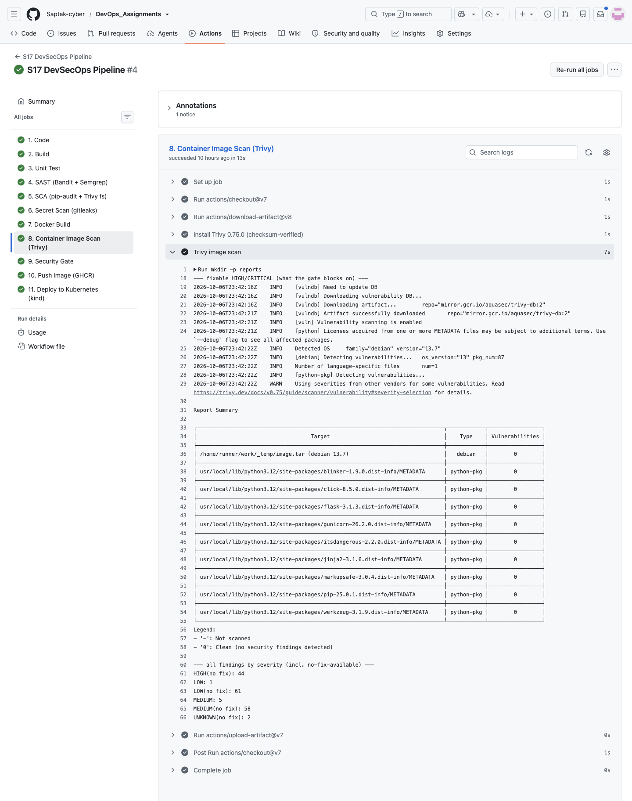

---

## 12. Security Gates

**Policy:** [`security/gate-policy.toml`](./security/gate-policy.toml) · **Enforcer:** [`security/security_gate.py`](./security/security_gate.py) · **Job:** `9. Security Gate` (downloads every `report-*` artifact, then runs the script).

```toml
[bandit]            # SAST
max_high = 0
max_medium = 0
max_low = -1        # B311 'random' in the greeting/pipeline-simulator endpoints is not security-relevant

[semgrep]
max_high = 0        # semgrep ERROR
max_medium = 0      # semgrep WARNING
max_low = -1        # semgrep INFO

[pip_audit]         # SCA
max_vulns = 0
ignore_ids = []     # add an advisory ID here only with a written justification + expiry

[trivy_fs]
max_critical = 0
max_high = 0
max_critical_unfixed = 0
max_high_unfixed = -1

[gitleaks]          # secret scan
max_findings = 0

[trivy_image]       # container image
max_critical = 0          # fixable CRITICAL -> block
max_high = 0              # fixable HIGH     -> block
max_critical_unfixed = 0  # CRITICAL with no upstream fix still blocks
max_high_unfixed = -1     # HIGH with no Debian fix yet: reported, not blocking
```

`N` = at most N findings, `-1` = report only. Push (job 10) has `needs: security-gate`, deploy (job 11) has `needs: push` — a failing gate means **nothing reaches the registry or the cluster**.

### Local: gate on the instructor's original code vs. this project

Same scanners, same policy. Instructor's untouched `demo/` (with this folder's `.bandit.yml`/`.gitleaks.toml`/`security/` copied in):

```
$ python3 security/security_gate.py --reports reports --policy security/gate-policy.toml   # instructor original app + pins
Check                   Verdict  Findings  (policy)
SAST - Bandit           FAIL     HIGH=1 MEDIUM=1 LOW=5  (HIGH<=0 MEDIUM<=0 LOW<=any)
SAST - Semgrep          FAIL     HIGH=1 MEDIUM=2 LOW=0  (HIGH<=0 MEDIUM<=0 LOW<=any)
SCA - pip-audit         FAIL     VULN=1  (VULN<=0)
SCA - Trivy fs          PASS     CRITICAL=0 HIGH=0 CRITICAL_UNFIXED=0 HIGH_UNFIXED=0  (CRITICAL<=0 HIGH<=0 CRITICAL_UNFIXED<=0 HIGH_UNFIXED<=any)
Secret scan - gitleaks  PASS     FINDING=0  (FINDING<=0)
Image scan - Trivy      PASS     CRITICAL=0 HIGH=0 CRITICAL_UNFIXED=0 HIGH_UNFIXED=44  (CRITICAL<=0 HIGH<=0 CRITICAL_UNFIXED<=0 HIGH_UNFIXED<=any)
...
  - HIGH B201 app/app.py:234 A Flask app appears to be run with debug=True, which exposes the Werkzeug debugger and allows the execution of arbitrary code.
  - MEDIUM B104 app/app.py:234 Possible binding to all interfaces.

SAST - Semgrep findings (3):
  - HIGH dockerfile.security.missing-user.missing-user Dockerfile:13
  - MEDIUM python.flask.security.audit.app-run-param-config.avoid_app_run_with_bad_host app/app.py:234
  - MEDIUM python.flask.security.audit.debug-enabled.debug-enabled app/app.py:234

SCA - pip-audit findings (1):
  - pytest==8.4.2 PYSEC-2026-1845 (fix: 9.0.3)

SECURITY GATE: FAILED - image will NOT be pushed or deployed
[exit code: 1]
```

This project after the fixes in §5, §8, §9:

```
$ python3 security/security_gate.py --reports reports --policy security/gate-policy.toml
Check                   Verdict  Findings  (policy)
SAST - Bandit           PASS     HIGH=0 MEDIUM=0 LOW=5  (HIGH<=0 MEDIUM<=0 LOW<=any)
SAST - Semgrep          PASS     HIGH=0 MEDIUM=0 LOW=0  (HIGH<=0 MEDIUM<=0 LOW<=any)
SCA - pip-audit         PASS     VULN=0  (VULN<=0)
SCA - Trivy fs          PASS     CRITICAL=0 HIGH=0 CRITICAL_UNFIXED=0 HIGH_UNFIXED=0  (CRITICAL<=0 HIGH<=0 CRITICAL_UNFIXED<=0 HIGH_UNFIXED<=any)
Secret scan - gitleaks  PASS     FINDING=0  (FINDING<=0)
Image scan - Trivy      PASS     CRITICAL=0 HIGH=0 CRITICAL_UNFIXED=0 HIGH_UNFIXED=44  (CRITICAL<=0 HIGH<=0 CRITICAL_UNFIXED<=0 HIGH_UNFIXED<=any)
...
SECURITY GATE: PASSED
[exit code: 0]
```

### In the pipeline: the gate blocking a release

On a short-lived branch I added an outdated dependency — the kind of pin that gets copied from an old tutorial — and ran the pipeline on that branch:

```diff
 blinker==1.9.0
+# GATE DEMO (short-lived branch): an outdated pin copied from an old tutorial.
+cryptography==41.0.0
```

```
$ gh workflow run s17-devsecops.yml --ref demo/s17-gate-block
https://github.com/Saptak-cyber/DevOps_Assignments/actions/runs/37547452296

$ gh run view 37547452296
X demo/s17-gate-block S17 DevSecOps Pipeline · 37547452296
Triggered via workflow_dispatch about 3 minutes ago

JOBS
✓ 1. Code in 6s (ID 112554743420)
✓ 2. Build in 13s (ID 112554800695)
✓ 3. Unit Test in 11s (ID 112554877272)
✓ 4. SAST (Bandit + Semgrep) in 23s (ID 112554934979)
✓ 5. SCA (pip-audit + Trivy fs) in 39s (ID 112555061045)
✓ 6. Secret Scan (gitleaks) in 9s (ID 112555261155)
✓ 7. Docker Build in 33s (ID 112555316525)
✓ 8. Container Image Scan (Trivy) in 18s (ID 112555498304)
X 9. Security Gate in 4s (ID 112555599623)
  ✓ Set up job
  ✓ Run actions/checkout@v7
  ✓ Collect every scanner report
  X Enforce security/gate-policy.toml
  ✓ Post Run actions/checkout@v7
  ✓ Complete job
- 10. Push Image (GHCR) (ID 112555631369)
- 11. Deploy to Kubernetes (kind) (ID 112555632736)
```

Everything up to the image scan is green — the code builds, the tests pass, and the scanners did their job (they *report*). The decision happens at the gate:

```
$ gh run view 37547452296 --log-failed
Check                   Verdict  Findings  (policy)
SAST - Bandit           PASS     HIGH=0 MEDIUM=0 LOW=5  (HIGH<=0 MEDIUM<=0 LOW<=any)
SAST - Semgrep          PASS     HIGH=0 MEDIUM=0 LOW=0  (HIGH<=0 MEDIUM<=0 LOW<=any)
SCA - pip-audit         FAIL     VULN=13  (VULN<=0)
SCA - Trivy fs          FAIL     CRITICAL=0 HIGH=5 CRITICAL_UNFIXED=0 HIGH_UNFIXED=0  (CRITICAL<=0 HIGH<=0 CRITICAL_UNFIXED<=0 HIGH_UNFIXED<=any)
Secret scan - gitleaks  PASS     FINDING=0  (FINDING<=0)
Image scan - Trivy      FAIL     CRITICAL=0 HIGH=5 CRITICAL_UNFIXED=0 HIGH_UNFIXED=44  (CRITICAL<=0 HIGH<=0 CRITICAL_UNFIXED<=0 HIGH_UNFIXED<=any)
...
SCA - pip-audit findings (13):
  - cryptography==41.0.0 PYSEC-2023-112 (fix: 41.0.2)
  - cryptography==41.0.0 PYSEC-2026-1283 (fix: 42.0.0)
  - cryptography==41.0.0 PYSEC-2023-254 (fix: 41.0.6)
  ...
  - cryptography==41.0.0 GHSA-537c-gmf6-5ccf (fix: 48.0.1)

SCA - Trivy fs findings (5):
  - HIGH CVE-2023-38325 cryptography 41.0.0 -> 41.0.2
  - HIGH CVE-2023-50782 cryptography 41.0.0 -> 42.0.0
  - HIGH CVE-2024-26130 cryptography 41.0.0 -> 42.0.4
  - HIGH CVE-2026-26007 cryptography 41.0.0 -> 46.0.5
  - HIGH GHSA-537c-gmf6-5ccf cryptography 41.0.0 -> 48.0.1

Image scan - Trivy findings (5):
  - HIGH CVE-2023-38325 cryptography 41.0.0 -> 41.0.2
  - HIGH CVE-2023-50782 cryptography 41.0.0 -> 42.0.0
  - HIGH CVE-2024-26130 cryptography 41.0.0 -> 42.0.4
  - HIGH CVE-2026-26007 cryptography 41.0.0 -> 46.0.5
  - HIGH GHSA-537c-gmf6-5ccf cryptography 41.0.0 -> 48.0.1

SECURITY GATE: FAILED - image will NOT be pushed or deployed
##[error]Process completed with exit code 1.
```

Three independent checks caught the same package: pip-audit (13 advisories after de-duplicating its 20 printed rows), Trivy fs on `requirements.txt`, and Trivy on the built image (its report lists `cryptography-41.0.0` with 5 HIGH, next to the `cffi` and `pycparser` packages it pulled in). Layered tools are redundant on purpose — the image scan would still catch a package installed by a `RUN pip install` line that never appears in `requirements.txt`.

Proof that nothing was published for that commit:

```
$ curl -s -o /dev/null -w '%{http_code}\n' -H "Authorization: Bearer $TOKEN" https://ghcr.io/v2/saptak-cyber/s17-devsecops-dashboard/manifests/4461e722b2ecad1db484e9e511a8d4033c42dd8d
404
```

The branch was then deleted, and the pipeline was run again on `main`, which does not contain the bad pin — all 11 stages green (§13):

```
$ git push origin --delete demo/s17-gate-block
To https://github.com/Saptak-cyber/DevOps_Assignments.git
 - [deleted]         demo/s17-gate-block
```

Gate in that green run (`9. Security Gate`, run 37547817960) — all six report files present, all checks pass:

```
-rw-r--r-- 1 runner runner   4822 Oct  6 23:42 bandit.json
-rw-r--r-- 1 runner runner      3 Oct  6 23:42 gitleaks-dir.json
-rw-r--r-- 1 runner runner      3 Oct  6 23:42 gitleaks-history.json
-rw-r--r-- 1 runner runner      3 Oct  6 23:42 gitleaks.json
-rw-r--r-- 1 runner runner    801 Oct  6 23:42 pip-audit.json
-rw-r--r-- 1 runner runner   1414 Oct  6 23:42 semgrep.json
-rw-r--r-- 1 runner runner   3230 Oct  6 23:42 trivy-fs.json
-rw-r--r-- 1 runner runner 865587 Oct  6 23:42 trivy-image.json
Check                   Verdict  Findings  (policy)
SAST - Bandit           PASS     HIGH=0 MEDIUM=0 LOW=5  (HIGH<=0 MEDIUM<=0 LOW<=any)
SAST - Semgrep          PASS     HIGH=0 MEDIUM=0 LOW=0  (HIGH<=0 MEDIUM<=0 LOW<=any)
SCA - pip-audit         PASS     VULN=0  (VULN<=0)
SCA - Trivy fs          PASS     CRITICAL=0 HIGH=0 CRITICAL_UNFIXED=0 HIGH_UNFIXED=0  (CRITICAL<=0 HIGH<=0 CRITICAL_UNFIXED<=0 HIGH_UNFIXED<=any)
Secret scan - gitleaks  PASS     FINDING=0  (FINDING<=0)
Image scan - Trivy      PASS     CRITICAL=0 HIGH=0 CRITICAL_UNFIXED=0 HIGH_UNFIXED=44  (CRITICAL<=0 HIGH<=0 CRITICAL_UNFIXED<=0 HIGH_UNFIXED<=any)
...
SECURITY GATE: PASSED
```

The gate also writes a ✅/❌ table to the job summary on the run page.

**Screenshots:** 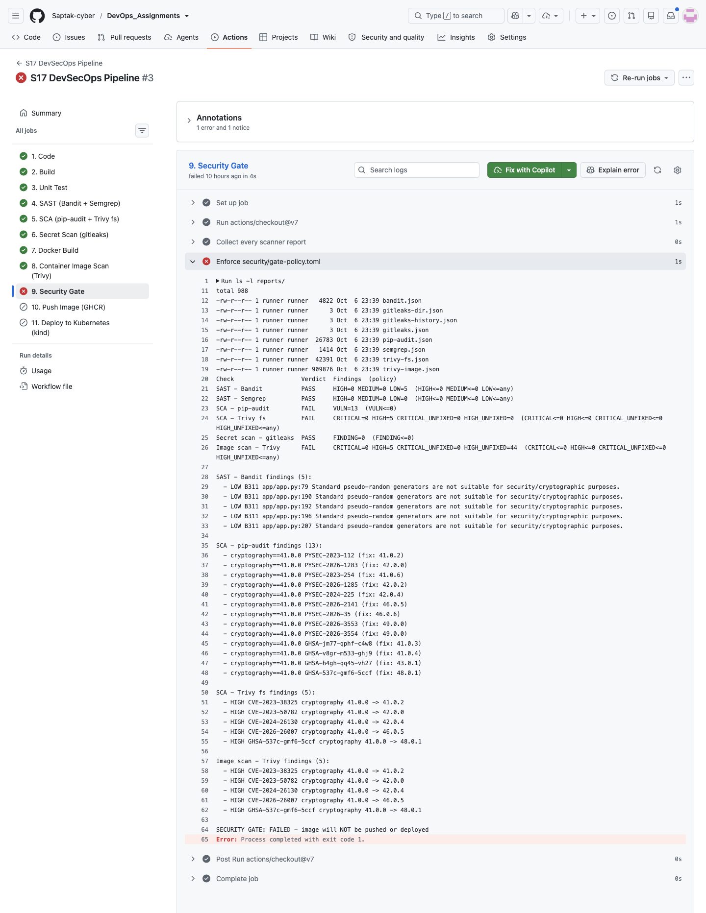 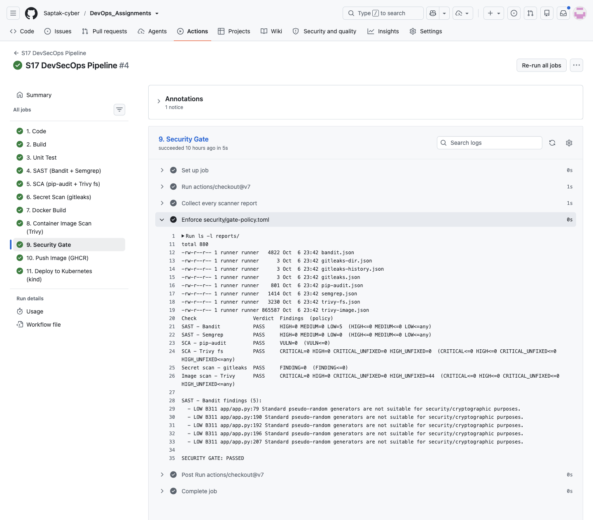

---

## 13. Successful Pipeline Output

```
$ gh run list --workflow s17-devsecops.yml
completed	success	S17 DevSecOps Pipeline	S17 DevSecOps Pipeline	main	workflow_dispatch	37547817960	3m45s	2026-10-06T23:40:11Z
completed	failure	S17 DevSecOps Pipeline	S17 DevSecOps Pipeline	demo/s17-gate-block	workflow_dispatch	37547452296	3m1s	2026-10-06T23:36:06Z
completed	success	Session 17: skip the DevSecOps pipeline on docs-only changes	S17 DevSecOps Pipeline	main	push	37547432961	4m2s	2026-10-06T23:35:53Z
completed	success	Session 17: add DevSecOps demo project and pipeline	S17 DevSecOps Pipeline	main	push	37546974977	4m3s	2026-10-06T23:30:55Z
```

| Run | Trigger | Commit | Result | URL |
| --- | --- | --- | --- | --- |
| first push | push | `82b3858` | ✅ | https://github.com/Saptak-cyber/DevOps_Assignments/actions/runs/37546974977 |
| path-filter change | push | `1bbe4d1` | ✅ | https://github.com/Saptak-cyber/DevOps_Assignments/actions/runs/37547432961 |
| gate demo | dispatch on `demo/s17-gate-block` | `4461e72` (branch deleted) | ❌ blocked at gate (intended) | https://github.com/Saptak-cyber/DevOps_Assignments/actions/runs/37547452296 |
| **final** | dispatch on `main` | `79c12eb` | ✅ | https://github.com/Saptak-cyber/DevOps_Assignments/actions/runs/37547817960 |

The pipeline was green on the very first push; the final run was dispatched on `main` after the red demo so the order is red → green. (`79c12eb` is the `main` HEAD at that moment — a Session 16 commit; this folder's content is identical to `1bbe4d1`.)

```
$ gh run view 37547817960
✓ main S17 DevSecOps Pipeline · 37547817960
Triggered via workflow_dispatch about 6 minutes ago

JOBS
✓ 1. Code in 4s (ID 112555960927)
✓ 2. Build in 8s (ID 112555994252)
✓ 3. Unit Test in 9s (ID 112556047427)
✓ 4. SAST (Bandit + Semgrep) in 22s (ID 112556102769)
✓ 5. SCA (pip-audit + Trivy fs) in 30s (ID 112556224289)
✓ 6. Secret Scan (gitleaks) in 6s (ID 112556382153)
✓ 7. Docker Build in 23s (ID 112556422294)
✓ 8. Container Image Scan (Trivy) in 13s (ID 112556538783)
✓ 9. Security Gate in 5s (ID 112556613238)
✓ 10. Push Image (GHCR) in 21s (ID 112556647026)
✓ 11. Deploy to Kubernetes (kind) in 57s (ID 112556763037)

ARTIFACTS
unit-test-report
report-sca
report-sast
docker-image
Saptak-cyber~DevOps_Assignments~XQFY5G.dockerbuild
report-image
report-secrets
app-build

View this run on GitHub: https://github.com/Saptak-cyber/DevOps_Assignments/actions/runs/37547817960
```

Every scanner report is downloadable from the run as an artifact (`report-sast`, `report-sca`, `report-secrets`, `report-image`), which is the audit trail behind each gate decision.

**Screenshot:** 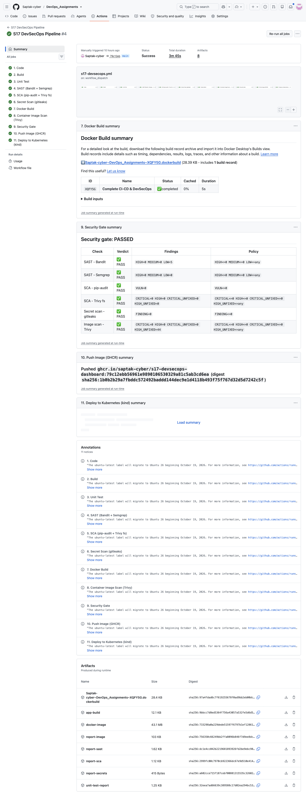

---

## Cleanup

Nothing keeps running: the kind cluster is created and deleted inside each deploy job (`Deleting cluster "s17-ci" ...`), and runners are discarded after each job. Locally:

```bash
docker rm -f s17-local
docker rmi s17-devsecops:local s17-instructor-original:local
rm -rf reports/                                   # local scanner output (git-ignored)
git push origin --delete demo/s17-gate-block      # done above
```

Kept on purpose: the `ghcr.io/saptak-cyber/s17-devsecops-dashboard` package (only gate-passing builds), and the run artifacts (14 days; the image tarball 3 days).

---

## Files added / changed relative to the class `demo/`

| File | Change |
| --- | --- |
| [`app/app.py`](./app/app.py) | only the `__main__` block: debug opt-in via `FLASK_DEBUG`, localhost default (Bandit B201/B104, Semgrep) |
| [`requirements.txt`](./requirements.txt) | full pin set + gunicorn |
| [`requirements-dev.txt`](./requirements-dev.txt) | pytest 8.4.2 → 9.1.1 (CVE-2025-71176), pytest-cov 6.0.0 → 7.1.0 |
| [`Dockerfile`](./Dockerfile), [`.dockerignore`](./.dockerignore) | gunicorn, non-root, healthcheck, no pip cache, `--no-control-socket` |
| [`k8s/deployment.yaml`](./k8s/deployment.yaml) | GHCR image placeholder, pull secret, probes, resources, securityContext, `/tmp` emptyDir |
| [`.bandit.yml`](./.bandit.yml), [`.gitleaks.toml`](./.gitleaks.toml), [`.trivyignore`](./.trivyignore) | new — scanner configuration |
| [`security/`](./security) | new — gate policy and gate script |
| [`.github/workflows/s17-devsecops.yml`](./.github/workflows/s17-devsecops.yml) | rewritten — 11 stages in the teacher's order (class version: tests/CodeQL/pip-audit → build → Trivy → Docker Hub push → kind deploy, rebuilding the image in each job) |

## Resources

- https://bandit.readthedocs.io/ · https://semgrep.dev/docs/ · https://pypi.org/project/pip-audit/
- https://trivy.dev/docs/ · https://github.com/gitleaks/gitleaks
- https://docs.github.com/en/packages/working-with-a-github-packages-registry/working-with-the-container-registry
- https://github.com/helm/kind-action
