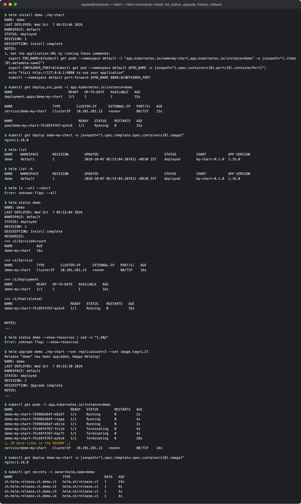
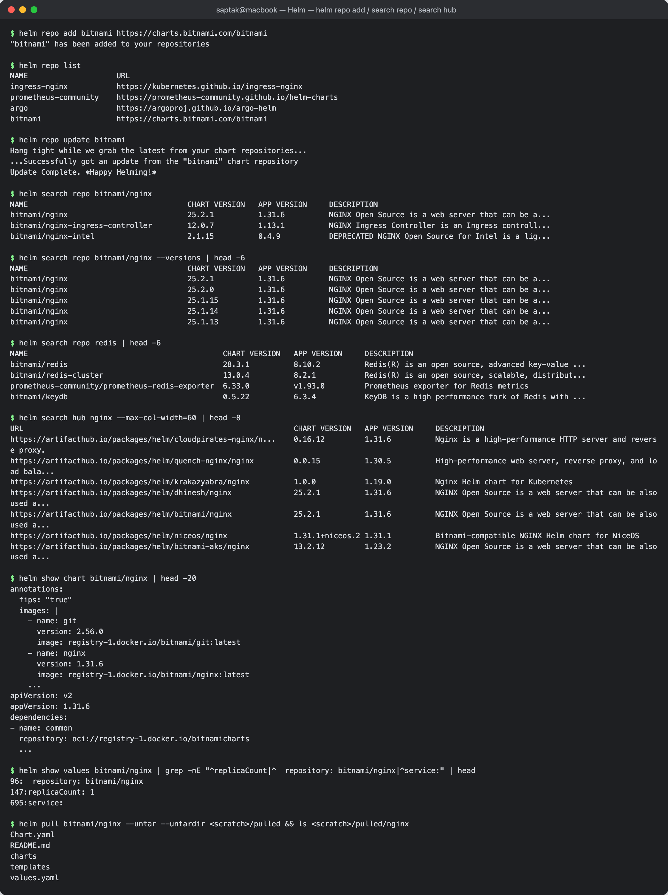
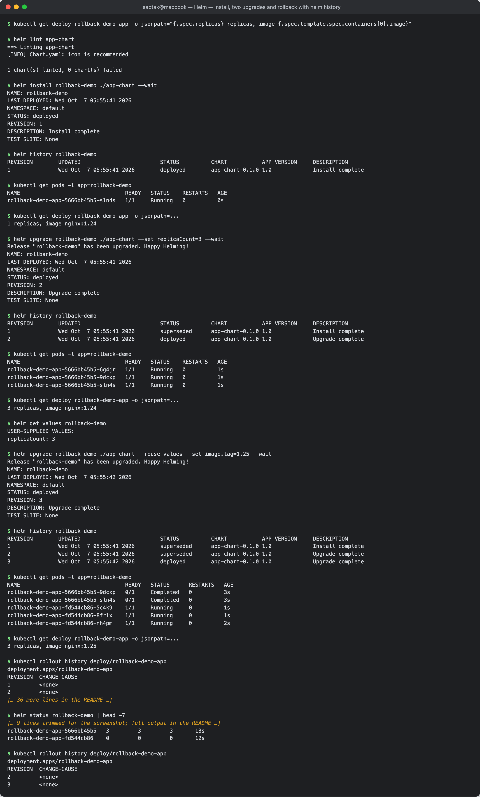
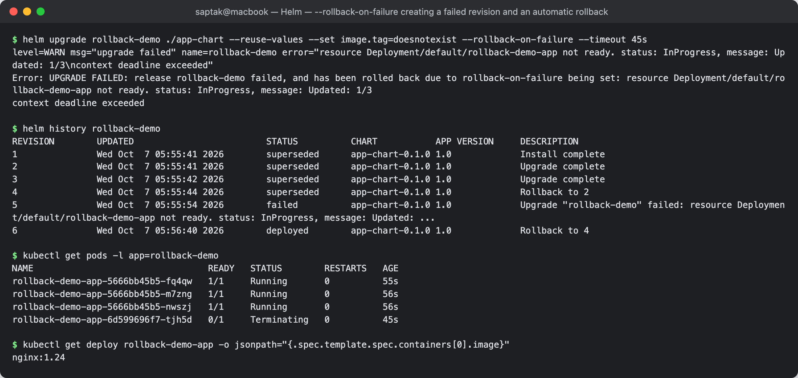
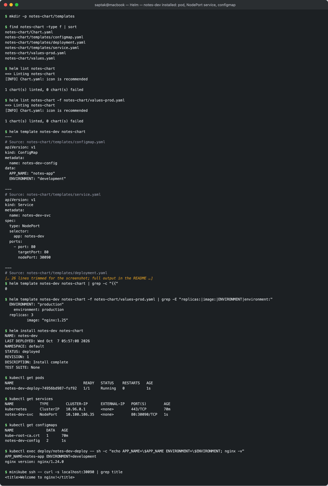
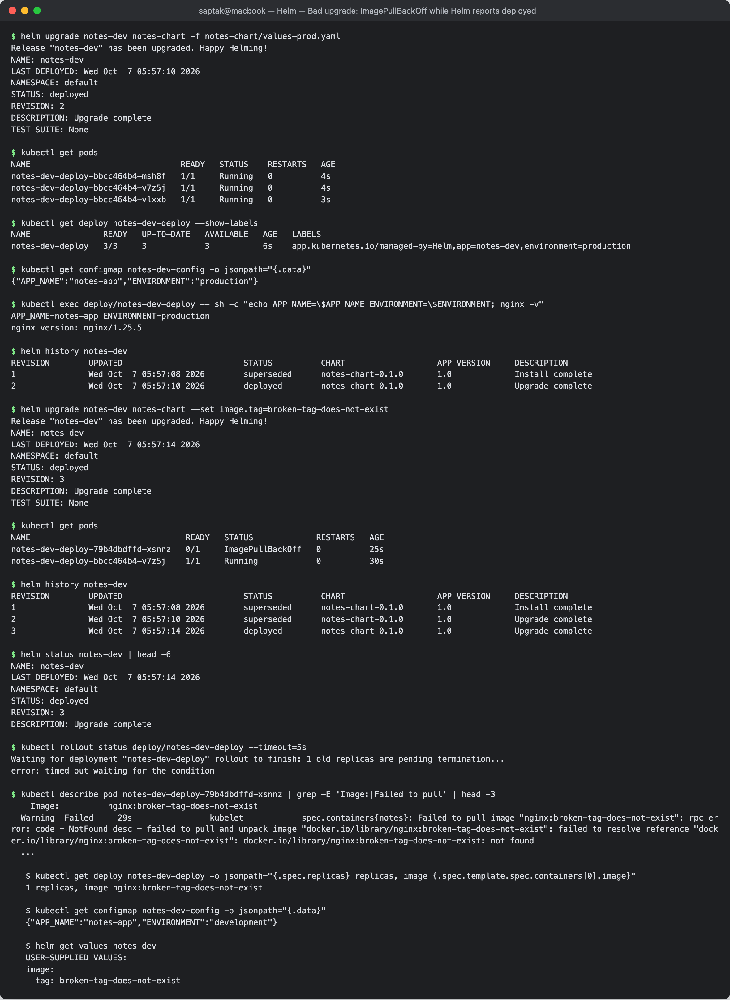
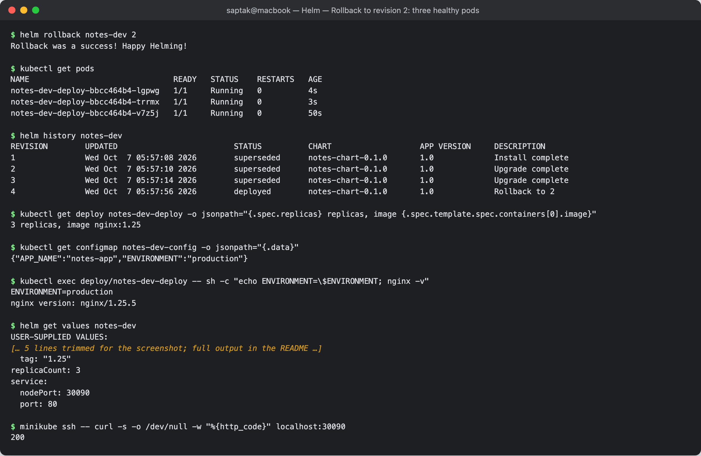

# Helm

**Author:** Saptak Banerjee
**Course:** SST DevOps & Cloud [SWE]
**Session:** 15 — Helm
**Source material:** [`devops-heros/session-15-helm`](https://github.com/Nency-Ravaliya/devops-heros/tree/main/session-15-helm)

**Environment:** Helm **v4.3.0** against single-node minikube v1.39 (Kubernetes **v1.37.0**). Every output below is a real capture.

---

## Table of Contents

| # | Task |
| --- | --- |
| 1 | [Helm Commands](#task-1-helm-commands) — create, install, list, status, get, upgrade, history, rollback, uninstall, repo, search |
| 2 | [Helm Rollback](#task-2-helm-rollback) — Install → Upgrade → Verify → Upgrade again → Verify → Rollback → Verify |
| 3 | [Mini Project — Package and Deploy the Notes App with Helm](#task-3-mini-project--package-and-deploy-the-notes-app-with-helm) |
| — | [Cleanup](#cleanup) |

### Folder layout

```text
Helm/
├── README.md
├── 01-helm-commands/my-chart/   # generated by `helm create my-chart` (Task 1)
├── 02-rollback/app-chart/       # class 07-install-upgrade chart (Task 2)
├── mini-project/notes-chart/    # Chart.yaml, values.yaml, values-prod.yaml, templates/{deployment,service,configmap}.yaml (Task 3)
└── screenshots/
```

### Core vocabulary (as used below)

| Term | Meaning | Seen as |
| --- | --- | --- |
| **Chart** | a package: `Chart.yaml` + `values.yaml` + `templates/` | `my-chart/`, `notes-chart/` |
| **Values** | the inputs; defaults in `values.yaml`, overridden by `-f file` and `--set k=v` | `helm get values` |
| **Release** | one installed instance of a chart, with a name | `demo`, `rollback-demo`, `notes-dev` |
| **Revision** | every install/upgrade/rollback of a release, numbered | `helm history`; stored as Secrets `sh.helm.release.v1.<name>.v<N>` |

---

## Task 1: Helm Commands

Each command below was executed; the one-liner says what it does, then the real output.

```
$ helm version
version.BuildInfo{Version:"v4.3.0", GitCommit:"bec5b06ed841fe5269972d864d5177944fd5970f", GitTreeState:"clean", GoVersion:"go1.27.1", KubeClientVersion:"v1.37"}
```

### `helm create` — scaffold a new chart

Generates a complete, working starter chart (nginx Deployment, Service, optional Ingress/HTTPRoute/HPA, ServiceAccount,
test hook) as a starting point.

```
$ helm create my-chart
Creating my-chart

$ find my-chart -type f | sort
my-chart/.helmignore
my-chart/Chart.yaml
my-chart/templates/NOTES.txt
my-chart/templates/_helpers.tpl
my-chart/templates/deployment.yaml
my-chart/templates/hpa.yaml
my-chart/templates/httproute.yaml
my-chart/templates/ingress.yaml
my-chart/templates/service.yaml
my-chart/templates/serviceaccount.yaml
my-chart/templates/tests/test-connection.yaml
my-chart/values.yaml

$ sed -n "1,30p" my-chart/values.yaml
# Default values for my-chart.
# This is a YAML-formatted file.
# Declare variables to be passed into your templates.

# This will set the replicaset count more information can be found here: https://kubernetes.io/docs/concepts/workloads/controllers/replicaset/
replicaCount: 1

# This sets the container image more information can be found here: https://kubernetes.io/docs/concepts/containers/images/
image:
  repository: nginx
  # This sets the pull policy for images.
  pullPolicy: IfNotPresent
  # Overrides the image tag whose default is the chart appVersion.
  tag: ""
...
```

Two related commands used before installing anything — `lint` checks the chart, `template` renders it locally
without touching the cluster:

```
$ helm lint my-chart
==> Linting my-chart
[INFO] Chart.yaml: icon is recommended

1 chart(s) linted, 0 chart(s) failed

$ helm template demo my-chart | grep -E "^(kind|  name):"
kind: ServiceAccount
  name: demo-my-chart
kind: Service
  name: demo-my-chart
kind: Deployment
  name: demo-my-chart
kind: Pod
  name: "demo-my-chart-test-connection"
```

The generated chart lives in [`01-helm-commands/my-chart/`](./01-helm-commands/my-chart/).

### `helm install` — create a release from a chart

Renders the templates with the values and applies the result to the cluster as revision 1.

```
$ helm install demo ./my-chart
NAME: demo
LAST DEPLOYED: Wed Oct  7 05:53:04 2026
NAMESPACE: default
STATUS: deployed
REVISION: 1
DESCRIPTION: Install complete
NOTES:
1. Get the application URL by running these commands:
  export POD_NAME=$(kubectl get pods --namespace default -l "app.kubernetes.io/name=my-chart,app.kubernetes.io/instance=demo" -o jsonpath="{.items[0].metadata.name}")
  export CONTAINER_PORT=$(kubectl get pod --namespace default $POD_NAME -o jsonpath="{.spec.containers[0].ports[0].containerPort}")
  echo "Visit http://127.0.0.1:8080 to use your application"
  kubectl --namespace default port-forward $POD_NAME 8080:$CONTAINER_PORT

$ kubectl get deploy,svc,pods -l app.kubernetes.io/instance=demo
NAME                            READY   UP-TO-DATE   AVAILABLE   AGE
deployment.apps/demo-my-chart   1/1     1            1           15s

NAME                    TYPE        CLUSTER-IP      EXTERNAL-IP   PORT(S)   AGE
service/demo-my-chart   ClusterIP   10.101.201.13   <none>        80/TCP    15s

NAME                                 READY   STATUS    RESTARTS   AGE
pod/demo-my-chart-75c69f4767-qzkv6   1/1     Running   0          15s

$ kubectl get deploy demo-my-chart -o jsonpath="{.spec.template.spec.containers[0].image}"
nginx:1.16.0
```

`image.tag: ""` falls back to the chart's `appVersion` (`1.16.0`) — `templates/deployment.yaml` does
`{{ .Values.image.tag | default .Chart.AppVersion }}`. The `NOTES:` block is `templates/NOTES.txt` rendered.

### `helm list` — show releases

Lists releases in the current namespace (`-A` for all) with their current revision, status and chart version.

```
$ helm list
NAME	NAMESPACE	REVISION	UPDATED                             	STATUS  	CHART         	APP VERSION
demo	default  	1       	2026-10-07 05:53:04.387611 +0530 IST	deployed	my-chart-0.1.0	1.16.0

$ helm list -A
NAME	NAMESPACE	REVISION	UPDATED                             	STATUS  	CHART         	APP VERSION
demo	default  	1       	2026-10-07 05:53:04.387611 +0530 IST	deployed	my-chart-0.1.0	1.16.0

$ helm ls --all --short
Error: unknown flag: --all
```

That error is a **Helm 4 change**: Helm 3's `--all/-a` was removed; instead the status filters are explicit
(`--deployed`, `--failed`, `--superseded`, `--uninstalled`, `--pending`). `-q`/`--short` and `-o` still exist:

```
$ helm list -q
demo

$ helm list -o yaml
- app_version: 1.16.0
  chart: my-chart-0.1.0
  name: demo
  namespace: default
  revision: "4"
  status: deployed
  updated: 2026-10-07 05:53:24.29011 +0530 IST
```

(The last one was run after the upgrades/rollback below, hence revision 4.)

### `helm status` — state of one release

Shows the release's revision, status, the live resources it owns and its notes.

```
$ helm status demo
NAME: demo
LAST DEPLOYED: Wed Oct  7 05:53:04 2026
NAMESPACE: default
STATUS: deployed
REVISION: 1
DESCRIPTION: Install complete
RESOURCES:
==> v1/ServiceAccount
NAME            AGE
demo-my-chart   16s

==> v1/Service
NAME            TYPE        CLUSTER-IP      EXTERNAL-IP   PORT(S)   AGE
demo-my-chart   ClusterIP   10.101.201.13   <none>        80/TCP    16s

==> v1/Deployment
NAME            READY   UP-TO-DATE   AVAILABLE   AGE
demo-my-chart   1/1     1            1           16s

==> v1/Pod(related)
NAME                             READY   STATUS    RESTARTS   AGE
demo-my-chart-75c69f4767-qzkv6   1/1     Running   0          16s


NOTES:
...

$ helm status demo --show-resources | sed -n "1,30p"
Error: unknown flag: --show-resources
```

Another Helm 4 difference: the `RESOURCES:` section is printed by default, so Helm 3's `--show-resources` flag is gone.

### `helm get` — what exactly was deployed

Retrieves the stored data of a release revision: `values`, `manifest`, `notes`, `hooks`, `metadata` (or `all`).

```
$ helm get values demo
USER-SUPPLIED VALUES:
null

$ helm get values demo --all | head -12
COMPUTED VALUES:
affinity: {}
autoscaling:
  enabled: false
  maxReplicas: 100
  minReplicas: 1
  targetCPUUtilizationPercentage: 80
fullnameOverride: ""
httpRoute:
  annotations: {}
  enabled: false
  hostnames:

$ helm get manifest demo | grep -E "^(# Source|kind:)"
# Source: my-chart/templates/serviceaccount.yaml
kind: ServiceAccount
# Source: my-chart/templates/service.yaml
kind: Service
# Source: my-chart/templates/deployment.yaml
kind: Deployment

$ helm get notes demo | head -3
NOTES:
1. Get the application URL by running these commands:
  export POD_NAME=$(kubectl get pods --namespace default -l "app.kubernetes.io/name=my-chart,app.kubernetes.io/instance=demo" -o jsonpath="{.items[0].metadata.name}")

$ helm get metadata demo
NAME: demo
CHART: my-chart
VERSION: 0.1.0
APP_VERSION: 1.16.0
ANNOTATIONS:
LABELS: modifiedAt=1791332584,name=demo,owner=helm,status=deployed,version=1
DEPENDENCIES:
NAMESPACE: default
REVISION: 1
STATUS: deployed
DEPLOYED_AT: 2026-10-07T05:53:04+05:30
APPLY_METHOD: server-side apply

$ helm get hooks demo | head -8
---
# Source: my-chart/templates/tests/test-connection.yaml
apiVersion: v1
kind: Pod
metadata:
  name: "demo-my-chart-test-connection"
  labels:
    helm.sh/chart: my-chart-0.1.0
```

`USER-SUPPLIED VALUES: null` vs `--all` is the key distinction: only what *you* overrode vs the full merged values.
The test Pod is a **hook** (`helm.sh/hook: test`), so it is not in the manifest and is only created by `helm test`.
`APPLY_METHOD: server-side apply` is new in Helm 4. Where does Helm keep all this? In the cluster:

```
$ kubectl get secrets -l owner=helm
NAME                         TYPE                 DATA   AGE
sh.helm.release.v1.demo.v1   helm.sh/release.v1   1      16s
```

### `helm upgrade` — change a release

Re-renders the chart with new values/chart version and applies the difference as a new revision.

```
$ helm upgrade demo ./my-chart --set replicaCount=3 --set image.tag=1.27
Release "demo" has been upgraded. Happy Helming!
NAME: demo
LAST DEPLOYED: Wed Oct  7 05:53:20 2026
NAMESPACE: default
STATUS: deployed
REVISION: 2
DESCRIPTION: Upgrade complete
NOTES:
...

$ kubectl get pods -l app.kubernetes.io/instance=demo
NAME                             READY   STATUS        RESTARTS   AGE
demo-my-chart-759985d64f-m5d2f   1/1     Running       0          2s
demo-my-chart-759985d64f-rxppp   1/1     Running       0          4s
demo-my-chart-759985d64f-x6cjm   1/1     Running       0          3s
demo-my-chart-75c69f4767-fnlzb   1/1     Terminating   0          4s
demo-my-chart-75c69f4767-hqz7t   1/1     Terminating   0          4s
demo-my-chart-75c69f4767-qzkv6   1/1     Terminating   0          20s

$ helm get values demo
USER-SUPPLIED VALUES:
image:
  tag: "1.27"
replicaCount: 3
```

`--reuse-values` keeps the previous revision's overrides and adds new ones on top:

```
$ helm upgrade demo ./my-chart --reuse-values --set service.type=NodePort
Release "demo" has been upgraded. Happy Helming!
NAME: demo
LAST DEPLOYED: Wed Oct  7 05:53:24 2026
NAMESPACE: default
STATUS: deployed
REVISION: 3
DESCRIPTION: Upgrade complete
NOTES:
1. Get the application URL by running these commands:
  export NODE_PORT=$(kubectl get --namespace default -o jsonpath="{.spec.ports[0].nodePort}" services demo-my-chart)
  export NODE_IP=$(kubectl get nodes --namespace default -o jsonpath="{.items[0].status.addresses[0].address}")
  echo http://$NODE_IP:$NODE_PORT

$ kubectl get svc demo-my-chart
NAME            TYPE       CLUSTER-IP      EXTERNAL-IP   PORT(S)        AGE
demo-my-chart   NodePort   10.101.201.13   <none>        80:31754/TCP   20s
```

The NOTES changed too — `NOTES.txt` has an `if` on `service.type`, so the instructions follow the values.

### `helm history` — every revision of a release

```
$ helm history demo
REVISION	UPDATED                 	STATUS    	CHART         	APP VERSION	DESCRIPTION
1       	Wed Oct  7 05:53:04 2026	superseded	my-chart-0.1.0	1.16.0     	Install complete
2       	Wed Oct  7 05:53:20 2026	superseded	my-chart-0.1.0	1.16.0     	Upgrade complete
3       	Wed Oct  7 05:53:24 2026	deployed  	my-chart-0.1.0	1.16.0     	Upgrade complete
```

Exactly one revision is `deployed`; older ones are `superseded`.

### `helm rollback` — return to a previous revision

Re-applies the stored manifest of an earlier revision, **as a new revision**.

```
$ helm rollback demo 1
Rollback was a success! Happy Helming!

$ helm history demo
REVISION	UPDATED                 	STATUS    	CHART         	APP VERSION	DESCRIPTION
1       	Wed Oct  7 05:53:04 2026	superseded	my-chart-0.1.0	1.16.0     	Install complete
2       	Wed Oct  7 05:53:20 2026	superseded	my-chart-0.1.0	1.16.0     	Upgrade complete
3       	Wed Oct  7 05:53:24 2026	superseded	my-chart-0.1.0	1.16.0     	Upgrade complete
4       	Wed Oct  7 05:53:24 2026	deployed  	my-chart-0.1.0	1.16.0     	Rollback to 1

$ kubectl get deploy,svc -l app.kubernetes.io/instance=demo
NAME                            READY   UP-TO-DATE   AVAILABLE   AGE
deployment.apps/demo-my-chart   1/1     1            1           24s

NAME                    TYPE        CLUSTER-IP      EXTERNAL-IP   PORT(S)   AGE
service/demo-my-chart   ClusterIP   10.101.201.13   <none>        80/TCP    24s

$ kubectl get deploy demo-my-chart -o jsonpath="{.spec.template.spec.containers[0].image}"
nginx:1.16.0

$ kubectl get secrets -l owner=helm,name=demo
NAME                         TYPE                 DATA   AGE
sh.helm.release.v1.demo.v1   helm.sh/release.v1   1      24s
sh.helm.release.v1.demo.v2   helm.sh/release.v1   1      8s
sh.helm.release.v1.demo.v3   helm.sh/release.v1   1      4s
sh.helm.release.v1.demo.v4   helm.sh/release.v1   1      4s
```

All three changes (3 replicas, image 1.27, NodePort) were undone in one command. One Secret per revision — that is
the history Helm rolls back from (capped by `--history-max`, default 10).

### `helm repo` — manage chart repositories

Adds/lists/updates/removes remote chart repositories (an HTTP server with an `index.yaml`).

```
$ helm repo add bitnami https://charts.bitnami.com/bitnami
"bitnami" has been added to your repositories

$ helm repo list
NAME                	URL
ingress-nginx       	https://kubernetes.github.io/ingress-nginx
prometheus-community	https://prometheus-community.github.io/helm-charts
argo                	https://argoproj.github.io/argo-helm
bitnami             	https://charts.bitnami.com/bitnami

$ helm repo update bitnami
Hang tight while we grab the latest from your chart repositories...
...Successfully got an update from the "bitnami" chart repository
Update Complete. ⎈Happy Helming!⎈
```

(`ingress-nginx`, `prometheus-community` and `argo` were already configured on this machine from earlier sessions.)

### `helm search` — find charts

`search repo` searches the locally cached indexes of added repos; `search hub` queries Artifact Hub.

```
$ helm search repo bitnami/nginx
NAME                            	CHART VERSION	APP VERSION	DESCRIPTION
bitnami/nginx                   	25.2.1       	1.31.6     	NGINX Open Source is a web server that can be a...
bitnami/nginx-ingress-controller	12.0.7       	1.13.1     	NGINX Ingress Controller is an Ingress controll...
bitnami/nginx-intel             	2.1.15       	0.4.9      	DEPRECATED NGINX Open Source for Intel is a lig...

$ helm search repo bitnami/nginx --versions | head -6
NAME                            	CHART VERSION	APP VERSION	DESCRIPTION
bitnami/nginx                   	25.2.1       	1.31.6     	NGINX Open Source is a web server that can be a...
bitnami/nginx                   	25.2.0       	1.31.6     	NGINX Open Source is a web server that can be a...
bitnami/nginx                   	25.1.15      	1.31.6     	NGINX Open Source is a web server that can be a...
bitnami/nginx                   	25.1.14      	1.31.6     	NGINX Open Source is a web server that can be a...
bitnami/nginx                   	25.1.13      	1.31.6     	NGINX Open Source is a web server that can be a...

$ helm search repo redis | head -6
NAME                                          	CHART VERSION	APP VERSION	DESCRIPTION
bitnami/redis                                 	28.3.1       	8.10.2     	Redis(R) is an open source, advanced key-value ...
bitnami/redis-cluster                         	13.0.4       	8.2.1      	Redis(R) is an open source, scalable, distribut...
prometheus-community/prometheus-redis-exporter	6.33.0       	v1.93.0    	Prometheus exporter for Redis metrics
bitnami/keydb                                 	0.5.22       	6.3.4      	KeyDB is a high performance fork of Redis with ...

$ helm search hub nginx --max-col-width=60 | head -8
URL                                                         	CHART VERSION  	APP VERSION	DESCRIPTION
https://artifacthub.io/packages/helm/cloudpirates-nginx/n...	0.16.12        	1.31.6     	Nginx is a high-performance HTTP server and reverse proxy.
https://artifacthub.io/packages/helm/quench-nginx/nginx     	0.0.15         	1.30.5     	High-performance web server, reverse proxy, and load bala...
https://artifacthub.io/packages/helm/krakazyabra/nginx      	1.0.0          	1.19.0     	Nginx Helm chart for Kubernetes
https://artifacthub.io/packages/helm/dhinesh/nginx          	25.2.1         	1.31.6     	NGINX Open Source is a web server that can be also used a...
https://artifacthub.io/packages/helm/bitnami/nginx          	25.2.1         	1.31.6     	NGINX Open Source is a web server that can be also used a...
https://artifacthub.io/packages/helm/niceos/nginx           	1.31.1+niceos.2	1.31.1     	Bitnami-compatible NGINX Helm chart for NiceOS
https://artifacthub.io/packages/helm/bitnami-aks/nginx      	13.2.12        	1.23.2     	NGINX Open Source is a web server that can be also used a...
```

`CHART VERSION` (the package, e.g. `25.2.1`) and `APP VERSION` (the software inside, nginx `1.31.6`) are independent.
Before installing a third-party chart, inspect it:

```
$ helm show chart bitnami/nginx | head -20
annotations:
  fips: "true"
  images: |
    - name: git
      version: 2.56.0
      image: registry-1.docker.io/bitnami/git:latest
    - name: nginx
      version: 1.31.6
      image: registry-1.docker.io/bitnami/nginx:latest
    ...
apiVersion: v2
appVersion: 1.31.6
dependencies:
- name: common
  repository: oci://registry-1.docker.io/bitnamicharts
  ...

$ helm show values bitnami/nginx | grep -nE "^replicaCount|^  repository: bitnami/nginx|^service:" | head
96:  repository: bitnami/nginx
147:replicaCount: 1
695:service:

$ helm pull bitnami/nginx --untar --untardir <scratch>/pulled && ls <scratch>/pulled/nginx
Chart.yaml
README.md
charts
templates
values.yaml
```

And install straight from the repo:

```
$ helm install web bitnami/nginx --set service.type=ClusterIP --wait --timeout 3m | sed -n "1,8p"
NAME: web
LAST DEPLOYED: Wed Oct  7 05:54:42 2026
NAMESPACE: default
STATUS: deployed
REVISION: 1
DESCRIPTION: Install complete
TEST SUITE: None
NOTES:

$ helm list
NAME	NAMESPACE	REVISION	UPDATED                             	STATUS  	CHART         	APP VERSION
demo	default  	4       	2026-10-07 05:53:24.29011 +0530 IST 	deployed	my-chart-0.1.0	1.16.0
web 	default  	1       	2026-10-07 05:54:42.815923 +0530 IST	deployed	nginx-25.2.1  	1.31.6

$ kubectl get pods -l app.kubernetes.io/instance=web
NAME                         READY   STATUS    RESTARTS   AGE
web-nginx-776656f8b9-2bn9v   1/1     Running   0          21s

$ kubectl get pod -l app.kubernetes.io/instance=web -o jsonpath="{.items[0].spec.containers[0].image}"
registry-1.docker.io/bitnami/nginx:latest

$ kubectl run curl-web --rm -i --restart=Never --image=curlimages/curl:8.6.0 -- curl -s -o /dev/null -w "HTTP %{http_code}\n" http://web-nginx
HTTP 200
pod "curl-web" deleted from default namespace
```

Note the image is `bitnami/nginx:latest` — since Bitnami's 2025 catalogue change the chart defaults to the `latest`
tag of its free images, so the deployed nginx is not pinned by this chart version. For anything real, pin the chart `--version` *and* override
`image.tag`/digest.

### `helm uninstall` — remove a release

Deletes every resource the release created, and (by default) its history Secrets.

```
$ helm uninstall web
release "web" uninstalled

$ helm uninstall demo --keep-history
release "demo" uninstalled

$ helm list
NAME	NAMESPACE	REVISION	UPDATED                            	STATUS     	CHART         	APP VERSION
demo	default  	4       	2026-10-07 05:53:24.29011 +0530 IST	uninstalled	my-chart-0.1.0	1.16.0

$ helm list --uninstalled
NAME	NAMESPACE	REVISION	UPDATED                            	STATUS     	CHART         	APP VERSION
demo	default  	4       	2026-10-07 05:53:24.29011 +0530 IST	uninstalled	my-chart-0.1.0	1.16.0

$ helm history demo
REVISION	UPDATED                 	STATUS     	CHART         	APP VERSION	DESCRIPTION
1       	Wed Oct  7 05:53:04 2026	superseded 	my-chart-0.1.0	1.16.0     	Install complete
2       	Wed Oct  7 05:53:20 2026	superseded 	my-chart-0.1.0	1.16.0     	Upgrade complete
3       	Wed Oct  7 05:53:24 2026	superseded 	my-chart-0.1.0	1.16.0     	Upgrade complete
4       	Wed Oct  7 05:53:24 2026	uninstalled	my-chart-0.1.0	1.16.0     	Uninstallation complete

$ kubectl get all -l app.kubernetes.io/instance=demo
NAME                                 READY   STATUS      RESTARTS   AGE
pod/demo-my-chart-75c69f4767-m76qp   0/1     Completed   0          110s
```

(The one `Completed` Pod is the last replica caught mid-shutdown; the Deployment and Service were already gone.)
With `--keep-history` the release is gone from the cluster but its revisions survive, so it can even be **rolled back
from uninstalled**:

```
$ helm rollback demo 3
Rollback was a success! Happy Helming!

$ helm list
NAME	NAMESPACE	REVISION	UPDATED                             	STATUS  	CHART         	APP VERSION
demo	default  	5       	2026-10-07 05:55:14.084573 +0530 IST	deployed	my-chart-0.1.0	1.16.0

$ kubectl get deploy,svc -l app.kubernetes.io/instance=demo
NAME                            READY   UP-TO-DATE   AVAILABLE   AGE
deployment.apps/demo-my-chart   0/3     3            0           0s

NAME                    TYPE       CLUSTER-IP      EXTERNAL-IP   PORT(S)        AGE
service/demo-my-chart   NodePort   10.100.101.77   <none>        80:31048/TCP   0s
```

Revision 3's exact state (3 replicas, NodePort) was recreated. A plain uninstall removes everything including history:

```
$ helm uninstall demo
release "demo" uninstalled

$ helm list --all-namespaces --uninstalled
NAME	NAMESPACE	REVISION	UPDATED	STATUS	CHART	APP VERSION

$ kubectl get secrets -l owner=helm
No resources found in default namespace.

$ helm repo remove bitnami
"bitnami" has been removed from your repositories

$ helm repo list
NAME                	URL
ingress-nginx       	https://kubernetes.github.io/ingress-nginx
prometheus-community	https://prometheus-community.github.io/helm-charts
argo                	https://argoproj.github.io/argo-helm
```

**Screenshot:** 

**Screenshot:** 

### Command summary

| Command | What it does |
| --- | --- |
| `helm create <name>` | scaffold a new chart directory |
| `helm lint <chart>` / `helm template <rel> <chart>` | validate / render locally without installing |
| `helm install <rel> <chart>` | create a release (revision 1) |
| `helm list [-A] [--uninstalled…]` | list releases and their current revision |
| `helm status <rel>` | state, resources and notes of a release |
| `helm get values\|manifest\|notes\|hooks\|metadata <rel> [--revision N]` | what was deployed in a revision |
| `helm upgrade <rel> <chart> [-f] [--set] [--reuse-values]` | apply a new chart/values as a new revision |
| `helm history <rel>` | every revision with status and description |
| `helm rollback <rel> [N]` | re-apply revision N as a new revision |
| `helm uninstall <rel> [--keep-history]` | delete the release's resources (and history) |
| `helm repo add\|list\|update\|remove` | manage chart repositories |
| `helm search repo\|hub <term>` | find charts in added repos / Artifact Hub |
| `helm show chart\|values`, `helm pull` | inspect / download a chart before using it |

---

## Task 2: Helm Rollback

**Chart:** [`02-rollback/app-chart/`](./02-rollback/app-chart/) — the class `07-install-upgrade/app-chart`
(Deployment `<release>-app`, defaults `replicaCount: 1`, `nginx:1.24`). Each step is followed by `helm history` and a
check of what is actually running. The check used throughout:

```bash
kubectl get deploy rollback-demo-app -o jsonpath="{.spec.replicas} replicas, image {.spec.template.spec.containers[0].image}"
```

```
$ helm lint app-chart
==> Linting app-chart
[INFO] Chart.yaml: icon is recommended

1 chart(s) linted, 0 chart(s) failed
```

### Step 1 — Install (revision 1)

```
$ helm install rollback-demo ./app-chart --wait
NAME: rollback-demo
LAST DEPLOYED: Wed Oct  7 05:55:41 2026
NAMESPACE: default
STATUS: deployed
REVISION: 1
DESCRIPTION: Install complete
TEST SUITE: None

$ helm history rollback-demo
REVISION	UPDATED                 	STATUS  	CHART          	APP VERSION	DESCRIPTION
1       	Wed Oct  7 05:55:41 2026	deployed	app-chart-0.1.0	1.0        	Install complete

$ kubectl get pods -l app=rollback-demo
NAME                                 READY   STATUS    RESTARTS   AGE
rollback-demo-app-5666bb45b5-sln4s   1/1     Running   0          0s

$ kubectl get deploy rollback-demo-app -o jsonpath=...
1 replicas, image nginx:1.24
```

### Step 2 — Upgrade: scale to 3 (revision 2)

```
$ helm upgrade rollback-demo ./app-chart --set replicaCount=3 --wait
Release "rollback-demo" has been upgraded. Happy Helming!
NAME: rollback-demo
LAST DEPLOYED: Wed Oct  7 05:55:41 2026
NAMESPACE: default
STATUS: deployed
REVISION: 2
DESCRIPTION: Upgrade complete
TEST SUITE: None
```

### Step 3 — Verify

```
$ helm history rollback-demo
REVISION	UPDATED                 	STATUS    	CHART          	APP VERSION	DESCRIPTION
1       	Wed Oct  7 05:55:41 2026	superseded	app-chart-0.1.0	1.0        	Install complete
2       	Wed Oct  7 05:55:41 2026	deployed  	app-chart-0.1.0	1.0        	Upgrade complete

$ kubectl get pods -l app=rollback-demo
NAME                                 READY   STATUS    RESTARTS   AGE
rollback-demo-app-5666bb45b5-6g4jr   1/1     Running   0          1s
rollback-demo-app-5666bb45b5-9dcxp   1/1     Running   0          1s
rollback-demo-app-5666bb45b5-sln4s   1/1     Running   0          1s

$ kubectl get deploy rollback-demo-app -o jsonpath=...
3 replicas, image nginx:1.24

$ helm get values rollback-demo
USER-SUPPLIED VALUES:
replicaCount: 3
```

Same ReplicaSet hash (`5666bb45b5`) — scaling changes `spec.replicas`, not the Pod template, so no Pods are replaced;
two are added.

### Step 4 — Upgrade again: new image (revision 3)

`--reuse-values` keeps `replicaCount: 3` from revision 2 (without it, Helm would reset to the chart default of 1):

```
$ helm upgrade rollback-demo ./app-chart --reuse-values --set image.tag=1.25 --wait
Release "rollback-demo" has been upgraded. Happy Helming!
NAME: rollback-demo
LAST DEPLOYED: Wed Oct  7 05:55:42 2026
NAMESPACE: default
STATUS: deployed
REVISION: 3
DESCRIPTION: Upgrade complete
TEST SUITE: None
```

### Step 5 — Verify

```
$ helm history rollback-demo
REVISION	UPDATED                 	STATUS    	CHART          	APP VERSION	DESCRIPTION
1       	Wed Oct  7 05:55:41 2026	superseded	app-chart-0.1.0	1.0        	Install complete
2       	Wed Oct  7 05:55:41 2026	superseded	app-chart-0.1.0	1.0        	Upgrade complete
3       	Wed Oct  7 05:55:42 2026	deployed  	app-chart-0.1.0	1.0        	Upgrade complete

$ kubectl get pods -l app=rollback-demo
NAME                                 READY   STATUS      RESTARTS   AGE
rollback-demo-app-5666bb45b5-9dcxp   0/1     Completed   0          3s
rollback-demo-app-5666bb45b5-sln4s   0/1     Completed   0          3s
rollback-demo-app-fd544cb86-5c4k9    1/1     Running     0          1s
rollback-demo-app-fd544cb86-8frlx    1/1     Running     0          1s
rollback-demo-app-fd544cb86-nh4pm    1/1     Running     0          2s

$ kubectl get deploy rollback-demo-app -o jsonpath=...
3 replicas, image nginx:1.25

$ kubectl rollout history deploy/rollback-demo-app
deployment.apps/rollback-demo-app
REVISION  CHANGE-CAUSE
1         <none>
2         <none>

$ helm get values rollback-demo
USER-SUPPLIED VALUES:
image:
  tag: "1.25"
replicaCount: 3
```

A new ReplicaSet (`fd544cb86`) replaced the old Pods in a rolling update. Note the two different revision counters:
Helm is at **3**, the Deployment at **2** (Helm counts every release change; Kubernetes counts only Pod-template
changes, and the scale-up in revision 2 was not one).

### Step 6 — Rollback to revision 2

```
$ helm rollback rollback-demo 2 --wait
Rollback was a success! Happy Helming!
```

### Step 7 — Verify

```
$ helm history rollback-demo
REVISION	UPDATED                 	STATUS    	CHART          	APP VERSION	DESCRIPTION
1       	Wed Oct  7 05:55:41 2026	superseded	app-chart-0.1.0	1.0        	Install complete
2       	Wed Oct  7 05:55:41 2026	superseded	app-chart-0.1.0	1.0        	Upgrade complete
3       	Wed Oct  7 05:55:42 2026	superseded	app-chart-0.1.0	1.0        	Upgrade complete
4       	Wed Oct  7 05:55:44 2026	deployed  	app-chart-0.1.0	1.0        	Rollback to 2

$ kubectl get pods -l app=rollback-demo
NAME                                 READY   STATUS      RESTARTS   AGE
rollback-demo-app-5666bb45b5-fq4qw   1/1     Running     0          0s
rollback-demo-app-5666bb45b5-m7zng   1/1     Running     0          1s
rollback-demo-app-5666bb45b5-nwszj   1/1     Running     0          1s
rollback-demo-app-fd544cb86-nh4pm    0/1     Completed   0          3s

$ kubectl get deploy rollback-demo-app -o jsonpath=...
3 replicas, image nginx:1.24

$ helm get values rollback-demo
USER-SUPPLIED VALUES:
replicaCount: 3

$ helm get values rollback-demo --revision 3
USER-SUPPLIED VALUES:
image:
  tag: "1.25"
replicaCount: 3

$ helm status rollback-demo | head -7
NAME: rollback-demo
LAST DEPLOYED: Wed Oct  7 05:55:44 2026
NAMESPACE: default
STATUS: deployed
REVISION: 4
DESCRIPTION: Rollback to 2

$ kubectl get rs -l app=rollback-demo
NAME                           DESIRED   CURRENT   READY   AGE
rollback-demo-app-5666bb45b5   3         3         3       13s
rollback-demo-app-fd544cb86    0         0         0       12s

$ kubectl rollout history deploy/rollback-demo-app
deployment.apps/rollback-demo-app
REVISION  CHANGE-CAUSE
2         <none>
3         <none>
```

Back to exactly revision 2's state: 3 replicas of `nginx:1.24`, and revision 3's values are still retrievable with
`--revision 3`. Two details worth noticing:

- **The rollback is revision 4, not a return to 2.** History is append-only, so you can always see that a rollback
  happened and roll *forward* again (`helm rollback rollback-demo 3`).
- **Kubernetes reused the old ReplicaSet.** The Pods after rollback carry hash `5666bb45b5` again — the Deployment
  scaled the old ReplicaSet back up instead of creating a new one, and its own history renumbered that template from
  revision 1 to 3.

**Screenshot:** 

### Extra — automatic rollback on a failed upgrade

The class notes (`08-rollback`) show `--atomic`. In Helm 4 that flag is called **`--rollback-on-failure`** (it implies
`--wait`):

```
$ helm upgrade rollback-demo ./app-chart --reuse-values --set image.tag=doesnotexist --rollback-on-failure --timeout 45s
level=WARN msg="upgrade failed" name=rollback-demo error="resource Deployment/default/rollback-demo-app not ready. status: InProgress, message: Updated: 1/3\ncontext deadline exceeded"
Error: UPGRADE FAILED: release rollback-demo failed, and has been rolled back due to rollback-on-failure being set: resource Deployment/default/rollback-demo-app not ready. status: InProgress, message: Updated: 1/3
context deadline exceeded

$ helm history rollback-demo
REVISION	UPDATED                 	STATUS    	CHART          	APP VERSION	DESCRIPTION
1       	Wed Oct  7 05:55:41 2026	superseded	app-chart-0.1.0	1.0        	Install complete
2       	Wed Oct  7 05:55:41 2026	superseded	app-chart-0.1.0	1.0        	Upgrade complete
3       	Wed Oct  7 05:55:42 2026	superseded	app-chart-0.1.0	1.0        	Upgrade complete
4       	Wed Oct  7 05:55:44 2026	superseded	app-chart-0.1.0	1.0        	Rollback to 2
5       	Wed Oct  7 05:55:54 2026	failed    	app-chart-0.1.0	1.0        	Upgrade "rollback-demo" failed: resource Deployment/default/rollback-demo-app not ready. status: InProgress, message: Updated: ...
6       	Wed Oct  7 05:56:40 2026	deployed  	app-chart-0.1.0	1.0        	Rollback to 4

$ kubectl get pods -l app=rollback-demo
NAME                                 READY   STATUS        RESTARTS   AGE
rollback-demo-app-5666bb45b5-fq4qw   1/1     Running       0          55s
rollback-demo-app-5666bb45b5-m7zng   1/1     Running       0          56s
rollback-demo-app-5666bb45b5-nwszj   1/1     Running       0          56s
rollback-demo-app-6d599696f7-tjh5d   0/1     Terminating   0          45s

$ kubectl get deploy rollback-demo-app -o jsonpath="{.spec.template.spec.containers[0].image}"
nginx:1.24
```

Revision 5 is recorded as `failed` and Helm itself created revision 6 (`Rollback to 4`). `Updated: 1/3` shows why there
was no outage meanwhile: the rolling update created one new (broken) Pod and never took down the three healthy ones.

**Screenshot:** 

---

## Task 3: Mini Project — Package and Deploy the Notes App with Helm

**Brief:** [`mini-project/README.md` (class)](https://github.com/Nency-Ravaliya/devops-heros/tree/main/session-15-helm/mini-project)
**Chart:** [`mini-project/notes-chart/`](./mini-project/notes-chart/)

### Steps 1–7 — Create the chart

```
$ mkdir -p notes-chart/templates

$ find notes-chart -type f | sort
notes-chart/Chart.yaml
notes-chart/templates/configmap.yaml
notes-chart/templates/deployment.yaml
notes-chart/templates/service.yaml
notes-chart/values-prod.yaml
notes-chart/values.yaml
```

The six files were written exactly as given in the brief (a `diff -r` against the class's `notes-chart` reports no
differences):

| File | Content |
| --- | --- |
| [`Chart.yaml`](./mini-project/notes-chart/Chart.yaml) | `notes-chart` 0.1.0, appVersion "1.0" |
| [`values.yaml`](./mini-project/notes-chart/values.yaml) | 1 replica, `nginx:1.24`, NodePort 30090, `environment: development` |
| [`values-prod.yaml`](./mini-project/notes-chart/values-prod.yaml) | 3 replicas, `nginx:1.25`, `environment: production` |
| [`templates/configmap.yaml`](./mini-project/notes-chart/templates/configmap.yaml) | `<release>-config` with `APP_NAME`, `ENVIRONMENT` |
| [`templates/deployment.yaml`](./mini-project/notes-chart/templates/deployment.yaml) | `<release>-deploy`, image from values, `envFrom` the ConfigMap |
| [`templates/service.yaml`](./mini-project/notes-chart/templates/service.yaml) | `<release>-svc`, NodePort |

### Step 8 — Lint

```
$ helm lint notes-chart
==> Linting notes-chart
[INFO] Chart.yaml: icon is recommended

1 chart(s) linted, 0 chart(s) failed

$ helm lint notes-chart -f notes-chart/values-prod.yaml
==> Linting notes-chart
[INFO] Chart.yaml: icon is recommended

1 chart(s) linted, 0 chart(s) failed
```

### Step 9 — Render locally

```
$ helm template notes-dev notes-chart
---
# Source: notes-chart/templates/configmap.yaml
apiVersion: v1
kind: ConfigMap
metadata:
  name: notes-dev-config
data:
  APP_NAME: "notes-app"
  ENVIRONMENT: "development"

---
# Source: notes-chart/templates/service.yaml
apiVersion: v1
kind: Service
metadata:
  name: notes-dev-svc
spec:
  type: NodePort
  selector:
    app: notes-dev
  ports:
    - port: 80
      targetPort: 80
      nodePort: 30090

---
# Source: notes-chart/templates/deployment.yaml
apiVersion: apps/v1
kind: Deployment
metadata:
  name: notes-dev-deploy
  labels:
    app: notes-dev
    environment: development
spec:
  replicas: 1
  selector:
    matchLabels:
      app: notes-dev
  template:
    metadata:
      labels:
        app: notes-dev
    spec:
      containers:
        - name: notes
          image: "nginx:1.24"
          ports:
            - containerPort: 80
          envFrom:
            - configMapRef:
                name: notes-dev-config

$ helm template notes-dev notes-chart | grep -c "{{"
0

$ helm template notes-dev notes-chart -f notes-chart/values-prod.yaml | grep -E "replicas:|image:|ENVIRONMENT|environment:"
  ENVIRONMENT: "production"
    environment: production
  replicas: 3
          image: "nginx:1.25"
```

Every `{{ }}` was replaced (0 left), `.Release.Name` became `notes-dev` in all names, and the prod file changes the
four values it should.

### Step 10 — Install (development)

```
$ helm install notes-dev notes-chart
NAME: notes-dev
LAST DEPLOYED: Wed Oct  7 05:57:08 2026
NAMESPACE: default
STATUS: deployed
REVISION: 1
DESCRIPTION: Install complete
TEST SUITE: None

$ kubectl get pods
NAME                                READY   STATUS    RESTARTS   AGE
notes-dev-deploy-74956bd987-fsf92   1/1     Running   0          1s

$ kubectl get services
NAME            TYPE        CLUSTER-IP      EXTERNAL-IP   PORT(S)        AGE
kubernetes      ClusterIP   10.96.0.1       <none>        443/TCP        70m
notes-dev-svc   NodePort    10.100.106.35   <none>        80:30090/TCP   1s

$ kubectl get configmaps
NAME               DATA   AGE
kube-root-ca.crt   1      70m
notes-dev-config   2      1s

$ kubectl exec deploy/notes-dev-deploy -- sh -c "echo APP_NAME=\$APP_NAME ENVIRONMENT=\$ENVIRONMENT; nginx -v"
APP_NAME=notes-app ENVIRONMENT=development
nginx version: nginx/1.24.0

$ minikube ssh -- curl -s localhost:30090 | grep title
<title>Welcome to nginx!</title>
```

The ConfigMap values reached the container as environment variables, and the app answers on NodePort 30090.

**Screenshot:** 

### Step 11 — Upgrade to production values

```
$ helm upgrade notes-dev notes-chart -f notes-chart/values-prod.yaml
Release "notes-dev" has been upgraded. Happy Helming!
NAME: notes-dev
LAST DEPLOYED: Wed Oct  7 05:57:10 2026
NAMESPACE: default
STATUS: deployed
REVISION: 2
DESCRIPTION: Upgrade complete
TEST SUITE: None

$ kubectl get pods
NAME                               READY   STATUS    RESTARTS   AGE
notes-dev-deploy-bbcc464b4-msh8f   1/1     Running   0          4s
notes-dev-deploy-bbcc464b4-v7z5j   1/1     Running   0          4s
notes-dev-deploy-bbcc464b4-vlxxb   1/1     Running   0          3s

$ kubectl get deploy notes-dev-deploy --show-labels
NAME               READY   UP-TO-DATE   AVAILABLE   AGE   LABELS
notes-dev-deploy   3/3     3            3           6s    app.kubernetes.io/managed-by=Helm,app=notes-dev,environment=production

$ kubectl get configmap notes-dev-config -o jsonpath="{.data}"
{"APP_NAME":"notes-app","ENVIRONMENT":"production"}

$ kubectl exec deploy/notes-dev-deploy -- sh -c "echo APP_NAME=\$APP_NAME ENVIRONMENT=\$ENVIRONMENT; nginx -v"
APP_NAME=notes-app ENVIRONMENT=production
nginx version: nginx/1.25.5
```

Three Pods, nginx 1.25, `ENVIRONMENT=production` inside the container. That last part only worked because the image
tag changed too: `envFrom` is read when a container starts, and changing only a ConfigMap does **not** restart Pods
(a common fix is a `checksum/config` annotation on the Pod template).

### Step 12 — Release history

```
$ helm history notes-dev
REVISION	UPDATED                 	STATUS    	CHART            	APP VERSION	DESCRIPTION
1       	Wed Oct  7 05:57:08 2026	superseded	notes-chart-0.1.0	1.0        	Install complete
2       	Wed Oct  7 05:57:10 2026	deployed  	notes-chart-0.1.0	1.0        	Upgrade complete
```

### Step 13 — Simulate a bad upgrade

```
$ helm upgrade notes-dev notes-chart --set image.tag=broken-tag-does-not-exist
Release "notes-dev" has been upgraded. Happy Helming!
NAME: notes-dev
LAST DEPLOYED: Wed Oct  7 05:57:14 2026
NAMESPACE: default
STATUS: deployed
REVISION: 3
DESCRIPTION: Upgrade complete
TEST SUITE: None

$ kubectl get pods
NAME                                READY   STATUS             RESTARTS   AGE
notes-dev-deploy-79b4dbdffd-xsnnz   0/1     ImagePullBackOff   0          25s
notes-dev-deploy-bbcc464b4-v7z5j    1/1     Running            0          30s

$ helm history notes-dev
REVISION	UPDATED                 	STATUS    	CHART            	APP VERSION	DESCRIPTION
1       	Wed Oct  7 05:57:08 2026	superseded	notes-chart-0.1.0	1.0        	Install complete
2       	Wed Oct  7 05:57:10 2026	superseded	notes-chart-0.1.0	1.0        	Upgrade complete
3       	Wed Oct  7 05:57:14 2026	deployed  	notes-chart-0.1.0	1.0        	Upgrade complete

$ helm status notes-dev | head -6
NAME: notes-dev
LAST DEPLOYED: Wed Oct  7 05:57:14 2026
NAMESPACE: default
STATUS: deployed
REVISION: 3
DESCRIPTION: Upgrade complete

$ kubectl rollout status deploy/notes-dev-deploy --timeout=5s
Waiting for deployment "notes-dev-deploy" rollout to finish: 1 old replicas are pending termination...
error: timed out waiting for the condition

$ kubectl describe pod notes-dev-deploy-79b4dbdffd-xsnnz | grep -E 'Image:|Failed to pull' | head -3
    Image:          nginx:broken-tag-does-not-exist
  Warning  Failed     29s                kubelet            spec.containers{notes}: Failed to pull image "nginx:broken-tag-does-not-exist": rpc error: code = NotFound desc = failed to pull and unpack image "docker.io/library/nginx:broken-tag-does-not-exist": failed to resolve reference "docker.io/library/nginx:broken-tag-does-not-exist": docker.io/library/nginx:broken-tag-does-not-exist: not found
  ...
```

The `ImagePullBackOff` matches the brief. Three things the brief's expected output does not show, all visible above:

1. **Helm says `deployed` / `Upgrade complete`.** Without `--wait` (or `--rollback-on-failure`), Helm only checks that
   the API server *accepted* the manifests, not that the Pods came up. `kubectl rollout status` is what reveals the
   failure.
2. **The bad upgrade silently undid the production config.** It was run *without* `-f values-prod.yaml`, and
   `helm upgrade` does not reuse earlier values by default — it starts again from `values.yaml` plus the new `--set`:

   ```
   $ kubectl get deploy notes-dev-deploy -o jsonpath="{.spec.replicas} replicas, image {.spec.template.spec.containers[0].image}"
   1 replicas, image nginx:broken-tag-does-not-exist

   $ kubectl get configmap notes-dev-config -o jsonpath="{.data}"
   {"APP_NAME":"notes-app","ENVIRONMENT":"development"}

   $ helm get values notes-dev
   USER-SUPPLIED VALUES:
   image:
     tag: broken-tag-does-not-exist
   ```

   Replicas dropped 3 → 1 and the environment went back to `development`, on top of the broken image.
3. **One old Pod kept serving.** With 1 desired replica, the rolling update's `maxUnavailable` (25 % of 1, rounded
   down = 0) forbids removing the last ready Pod until its replacement is ready — which never happens. So
   `bbcc464b4-v7z5j` (revision 2's ReplicaSet) stayed up and the app never went fully down.

**Screenshot:** 

### Step 14 — Rollback to revision 2

```
$ helm rollback notes-dev 2
Rollback was a success! Happy Helming!

$ kubectl get pods
NAME                               READY   STATUS    RESTARTS   AGE
notes-dev-deploy-bbcc464b4-lgpwg   1/1     Running   0          4s
notes-dev-deploy-bbcc464b4-trrmx   1/1     Running   0          3s
notes-dev-deploy-bbcc464b4-v7z5j   1/1     Running   0          50s

$ helm history notes-dev
REVISION	UPDATED                 	STATUS    	CHART            	APP VERSION	DESCRIPTION
1       	Wed Oct  7 05:57:08 2026	superseded	notes-chart-0.1.0	1.0        	Install complete
2       	Wed Oct  7 05:57:10 2026	superseded	notes-chart-0.1.0	1.0        	Upgrade complete
3       	Wed Oct  7 05:57:14 2026	superseded	notes-chart-0.1.0	1.0        	Upgrade complete
4       	Wed Oct  7 05:57:56 2026	deployed  	notes-chart-0.1.0	1.0        	Rollback to 2

$ kubectl get deploy notes-dev-deploy -o jsonpath="{.spec.replicas} replicas, image {.spec.template.spec.containers[0].image}"
3 replicas, image nginx:1.25

$ kubectl get configmap notes-dev-config -o jsonpath="{.data}"
{"APP_NAME":"notes-app","ENVIRONMENT":"production"}

$ kubectl exec deploy/notes-dev-deploy -- sh -c "echo ENVIRONMENT=\$ENVIRONMENT; nginx -v"
ENVIRONMENT=production
nginx version: nginx/1.25.5

$ helm get values notes-dev
USER-SUPPLIED VALUES:
app:
  environment: production
  name: notes-app
image:
  repository: nginx
  tag: "1.25"
replicaCount: 3
service:
  nodePort: 30090
  port: 80

$ minikube ssh -- curl -s -o /dev/null -w "%{http_code}" localhost:30090
200
```

The rollback restored **everything** revision 2 had — replicas, image *and* the ConfigMap — because a Helm revision is
the complete rendered release, not a diff. `helm get values` now shows the whole `values-prod.yaml` as the user-supplied
values of revision 4. The surviving Pod `v7z5j` (50 s old) was simply joined by two new ones from the same ReplicaSet.

**Screenshot:** 

### Step 15 — Clean up

```
$ helm uninstall notes-dev
release "notes-dev" uninstalled

$ kubectl get pods
No resources found in default namespace.

$ kubectl get services
NAME         TYPE        CLUSTER-IP   EXTERNAL-IP   PORT(S)   AGE
kubernetes   ClusterIP   10.96.0.1    <none>        443/TCP   71m

$ kubectl get configmaps
NAME               DATA   AGE
kube-root-ca.crt   1      71m

$ helm list -A
NAME	NAMESPACE	REVISION	UPDATED	STATUS	CHART	APP VERSION
```

All resources are gone.

### What was practised

| Item from the brief | Done |
| --- | --- |
| Created a Helm chart from scratch | yes — Steps 1–7 |
| Used `values.yaml` and `values-prod.yaml` | yes — Steps 10–11 |
| Deployed with `helm install` | yes — Step 10 |
| Upgraded with different values | yes — Step 11 |
| Simulated a bad upgrade (broken image tag) | yes — Step 13 |
| Rolled back to a healthy revision | yes — Step 14 |
| Cleaned up with `helm uninstall` | yes — Step 15 |

**Lessons from the run:** always pass the environment's values file (or `--reuse-values`) on every upgrade; use
`--wait`/`--rollback-on-failure` in pipelines so a broken rollout fails the command instead of reporting `deployed`;
and check `kubectl rollout status`, not just `helm status`.

---

## Cleanup

Everything was uninstalled during the tasks; for reference:

```bash
helm uninstall notes-dev rollback-demo demo web 2>/dev/null
helm repo remove bitnami
helm list -A          # empty
```

## References

- https://helm.sh/docs/helm/
- https://helm.sh/docs/chart_template_guide/
- https://helm.sh/docs/topics/charts/
- https://helm.sh/docs/chart_best_practices/
