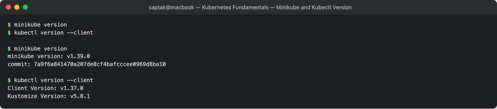
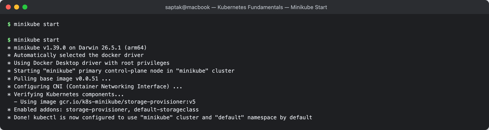
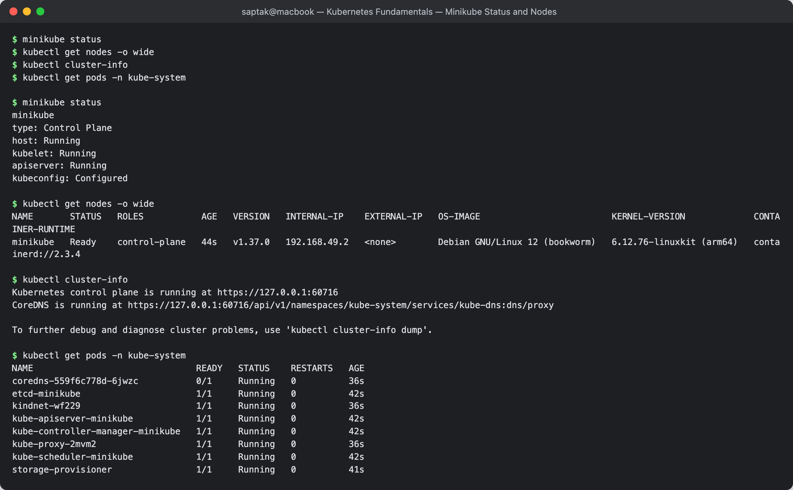
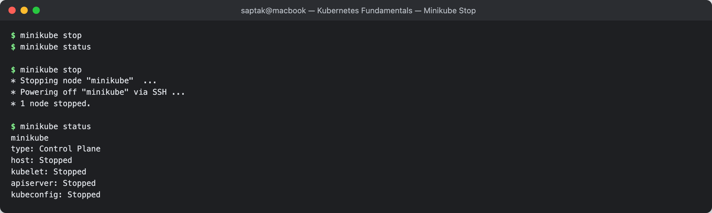
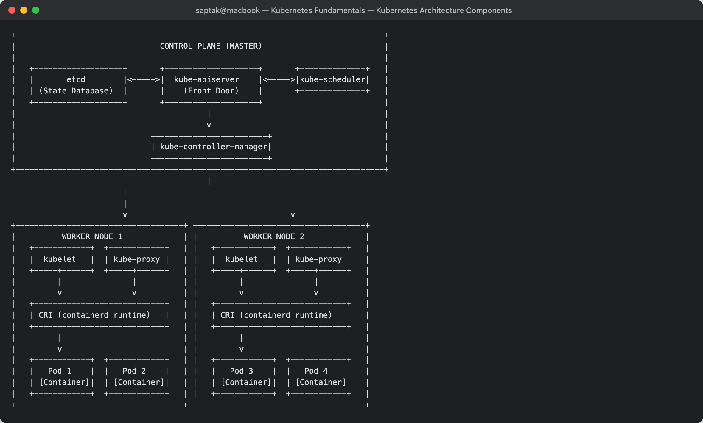
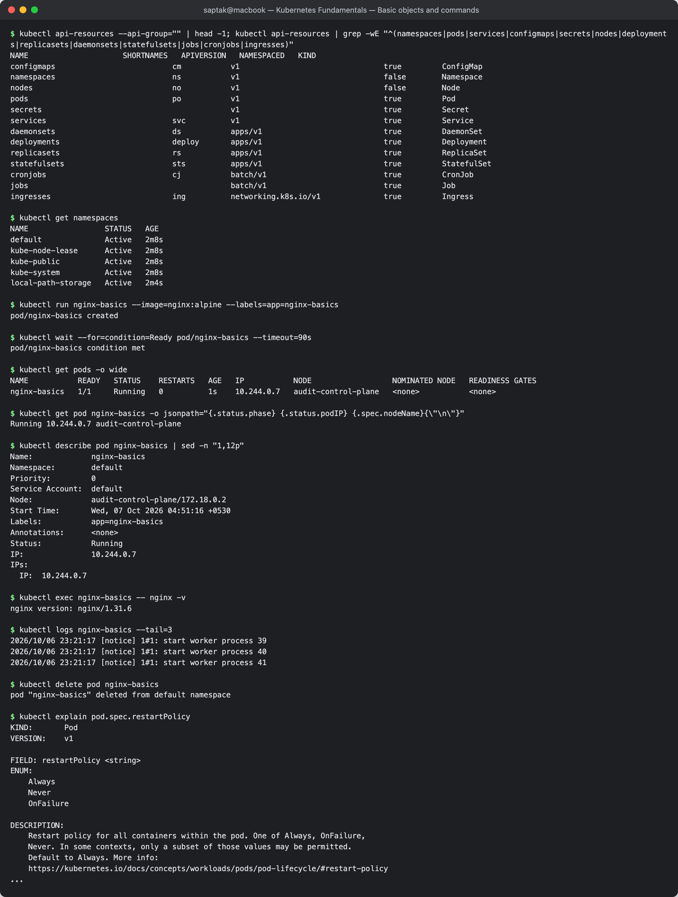
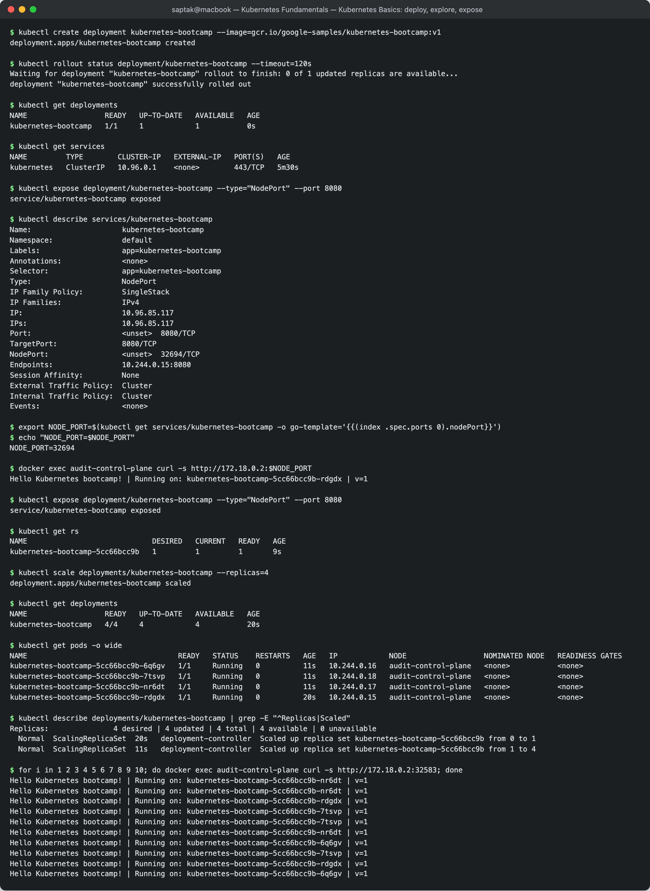
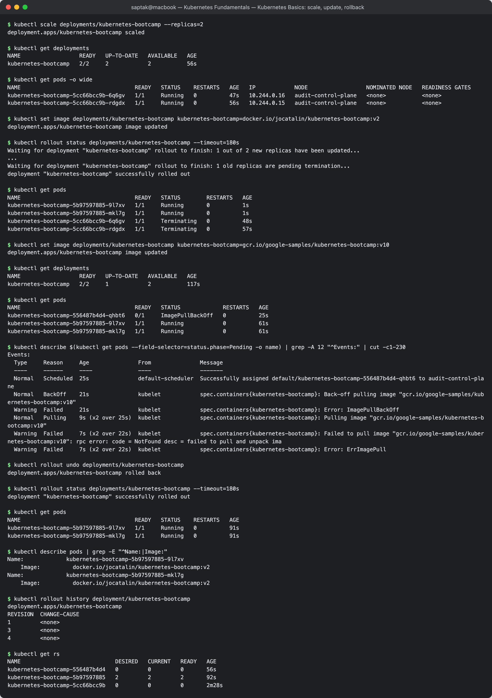

# Kubernetes Fundamentals

**Author:** Saptak Banerjee
**Course:** SST DevOps & Cloud [SWE]
**Session:** 09 — Kubernetes Fundamentals (Lecture 9)
**Source material:** [`devops-heros/session9-k8s`](../../devops-heros/session9-k8s)
**Environment:** macOS (Darwin 26.5.1, arm64) · Docker Desktop 29.6.1 · minikube docker driver

### Where each homework item is answered

| Homework item | Answered in |
| --- | --- |
| Install and configure minikube | Tasks 1–2 |
| Verify cluster status | Task 3 (and Task 4 for stop) |
| Explore Kubernetes architecture / short architecture notes | Task 5 |
| Explore basic Kubernetes objects and commands | [Task 6](#task-6-basic-kubernetes-objects--commands) |
| Perform the Kubernetes Basics tutorial hands-on | [Task 7](#task-7-kubernetes-basics-tutorial--hands-on) |

---

## Task 1: Minikube & CLI Installation Verification

Verify that `minikube` and the Kubernetes CLI (`kubectl`) are installed and resolvable on the local system.

**Commands:**

```bash
minikube version
kubectl version --client
```

**Output:**

```
$ minikube version
minikube version: v1.39.0
commit: 7a9f6a841470a207de8cf4bafcccee0969d8ba10

$ kubectl version --client
Client Version: v1.37.0
Kustomize Version: v5.8.1
```

**Screenshot:**



---

## Task 2: Starting the Minikube Kubernetes Cluster

Initialise the local single-node Kubernetes cluster. minikube auto-selects the Docker driver, pulls the `kicbase` node image, and bootstraps the control plane inside a Docker container.

**Command:**

```bash
minikube start
```

**Output:**

```
$ minikube start
* minikube v1.39.0 on Darwin 26.5.1 (arm64)
* Automatically selected the docker driver
* Using Docker Desktop driver with root privileges
* Starting "minikube" primary control-plane node in "minikube" cluster
* Pulling base image v0.0.51 ...
* Configuring CNI (Container Networking Interface) ...
* Verifying Kubernetes components...
  - Using image gcr.io/k8s-minikube/storage-provisioner:v5
* Enabled addons: storage-provisioner, default-storageclass
* Done! kubectl is now configured to use "minikube" cluster and "default" namespace by default
```

> **Note:** the `kicbase` image is ~470 MiB, so the first `minikube start` on a fresh machine is dominated by the image pull. Subsequent starts reuse the cached image and complete in seconds.

**Screenshot:**



---

## Task 3: Verifying Cluster Status & Node Health

Inspect the control plane, kubelet, and API server status, confirm the node reaches `Ready`, and locate the API server / CoreDNS service endpoints.

**Commands:**

```bash
minikube status
kubectl get nodes -o wide
kubectl cluster-info
kubectl get pods -n kube-system
```

**Output:**

```
$ minikube status
minikube
type: Control Plane
host: Running
kubelet: Running
apiserver: Running
kubeconfig: Configured

$ kubectl get nodes -o wide
NAME       STATUS   ROLES           AGE   VERSION   INTERNAL-IP    EXTERNAL-IP   OS-IMAGE                         KERNEL-VERSION             CONTAINER-RUNTIME
minikube   Ready    control-plane   44s   v1.37.0   192.168.49.2   <none>        Debian GNU/Linux 12 (bookworm)   6.12.76-linuxkit (arm64)   containerd://2.3.4

$ kubectl cluster-info
Kubernetes control plane is running at https://127.0.0.1:60716
CoreDNS is running at https://127.0.0.1:60716/api/v1/namespaces/kube-system/services/kube-dns:dns/proxy

To further debug and diagnose cluster problems, use 'kubectl cluster-info dump'.

$ kubectl get pods -n kube-system
NAME                               READY   STATUS    RESTARTS   AGE
coredns-559f6c778d-6jwzc           0/1     Running   0          36s
etcd-minikube                      1/1     Running   0          42s
kindnet-wf229                      1/1     Running   0          36s
kube-apiserver-minikube            1/1     Running   0          42s
kube-controller-manager-minikube   1/1     Running   0          42s
kube-proxy-2mvm2                   1/1     Running   0          36s
kube-scheduler-minikube            1/1     Running   0          42s
storage-provisioner                1/1     Running   0          41s
```

**Observations:**

- Immediately after `minikube start`, the node reports `NotReady` for ~10 seconds. This is expected: the kubelet registers the node before the CNI plugin (`kindnet`) has finished wiring up pod networking, and the `Ready` condition only flips once the network is usable.
- Because this is a single-node cluster, the one node carries the `control-plane` role **and** runs workload pods. In a real cluster the control plane would normally carry a `NoSchedule` taint.
- `kubectl get pods -n kube-system` is the practical proof of Task 5's theory — every control plane component from the architecture diagram below appears here as a real running pod (`etcd-minikube`, `kube-apiserver-minikube`, `kube-scheduler-minikube`, `kube-controller-manager-minikube`), alongside the per-node agents (`kube-proxy`, `kindnet`).

**Screenshot:**



---

## Task 4: Stopping the Minikube Cluster

Gracefully power down the cluster container to release CPU and memory back to the host.

**Commands:**

```bash
minikube stop
minikube status
```

**Output:**

```
$ minikube stop
* Stopping node "minikube"  ...
* Powering off "minikube" via SSH ...
* 1 node stopped.

$ minikube status
minikube
type: Control Plane
host: Stopped
kubelet: Stopped
apiserver: Stopped
kubeconfig: Stopped
```

`minikube stop` preserves cluster state on disk — a later `minikube start` resumes the same cluster with all objects intact. `minikube delete` is the destructive counterpart that discards it.

**Screenshot:**



---

## Task 5: Kubernetes Cluster Architecture & Component Analysis

A Kubernetes cluster splits into a **Control Plane** (decides what should run) and a set of **Worker Nodes** (actually run it). Every component talks to the API server; nothing else touches `etcd` directly.

```
+-------------------------------------------------------------------------------+
|                               CONTROL PLANE (MASTER)                          |
|                                                                               |
|   +-------------------+       +--------------------+       +--------------+   |
|   |       etcd        |<----->|  kube-apiserver    |<----->|kube-scheduler|   |
|   | (State Database)  |       |    (Front Door)    |       +--------------+   |
|   +-------------------+       +---------+----------+                          |
|                                         |                                     |
|                                         v                                     |
|                             +------------------------+                        |
|                             | kube-controller-manager|                        |
|                             +------------------------+                        |
+-----------------------------------------+-------------------------------------+
                                          |
                        +-----------------+-----------------+
                        |                                   |
                        v                                   v
+------------------------------------+ +------------------------------------+
|          WORKER NODE 1             | |          WORKER NODE 2             |
|   +------------+  +------------+   | |   +------------+  +------------+   |
|   |  kubelet   |  | kube-proxy |   | |   |  kubelet   |  | kube-proxy |   |
|   +-----+------+  +-----+------+   | |   +-----+------+  +-----+------+   |
|         |               |          | |         |               |          |
|         v               v          | |         v               v          |
|   +----------------------------+   | |   +----------------------------+   |
|   | CRI (containerd runtime)   |   | |   | CRI (containerd runtime)   |   |
|   +----------------------------+   | |   +----------------------------+   |
|         |                          | |         |                          |
|         v                          | |         v                          |
|   +------------+  +------------+   | |   +------------+  +------------+   |
|   |   Pod 1    |  |   Pod 2    |   | |   |   Pod 3    |  |   Pod 4    |   |
|   | [Container]|  | [Container]|   | |   | [Container]|  | [Container]|   |
|   +------------+  +------------+   | |   +------------+  +------------+   |
+------------------------------------+ +------------------------------------+
```

### 1. Control Plane Components

| Component | Role | Seen in this cluster as |
| --- | --- | --- |
| `kube-apiserver` | The single front door. Exposes the REST API, authenticates/authorises every request, and is the **only** component that reads and writes `etcd`. `kubectl`, controllers, and kubelets all go through it. | `kube-apiserver-minikube` |
| `etcd` | Distributed, consistent key-value store holding the entire declarative cluster state — every object spec, status, and Secret. Losing `etcd` means losing the cluster. | `etcd-minikube` |
| `kube-scheduler` | Watches for Pods with no `nodeName` assigned and picks the best node using resource requests, node affinity/anti-affinity, taints and tolerations. It only *decides* placement; it never starts containers. | `kube-scheduler-minikube` |
| `kube-controller-manager` | Runs the reconciliation loops that drive **current state → desired state**. Bundles the Node controller (eviction on node failure), ReplicaSet controller (maintains replica count), EndpointSlice controller (binds Services to live Pod IPs), and others. | `kube-controller-manager-minikube` |

### 2. Worker Node Components

| Component | Role | Seen in this cluster as |
| --- | --- | --- |
| `kubelet` | The per-node agent. Receives `PodSpec`s from the API server, instructs the container runtime to pull images and start containers, runs liveness/readiness probes, and reports node + pod status back. Runs as a host process, not a pod. | host process on the `minikube` node |
| `kube-proxy` | Programs `iptables`/IPVS rules on each node so that Service virtual IPs load-balance to the correct backing Pod IPs. | `kube-proxy-2mvm2` (DaemonSet) |
| **CRI runtime** | The software that actually runs containers. Modern clusters use `containerd` or `CRI-O` via the Container Runtime Interface; the old Docker shim was removed in Kubernetes 1.24. | `containerd://2.3.4` (from `kubectl get nodes -o wide`) |
| **CNI plugin** | Assigns each Pod an IP and wires up pod-to-pod routing across nodes. | `kindnet-wf229` (DaemonSet) |
| **Pod** | Smallest deployable unit. One or more tightly-coupled containers sharing a network namespace (one IP, one port space) and volumes. Most pods run one app container plus optional init/sidecar containers. | every workload pod |

### 3. How a `kubectl apply` actually flows

1. `kubectl apply -f pod.yml` → HTTP POST to **kube-apiserver**.
2. API server authenticates, validates the object, and persists it to **etcd**. The Pod now exists as an API object with `nodeName: ""`.
3. **kube-scheduler** notices the unscheduled Pod, chooses a node, and writes the binding back through the API server.
4. The **kubelet** on that node sees a Pod bound to itself, calls the **CRI runtime** to pull the image and start containers, and the **CNI plugin** assigns the Pod IP.
5. kubelet reports status back to the API server → `kubectl get pods` shows `1/1 Running`.

> This is why a Pod referencing a non-existent image still gets *created* successfully: steps 1–3 all succeed and the object is safely in `etcd`. Only step 4 fails, which surfaces as `ErrImagePull` / `ImagePullBackOff` in the Pod's **status**, not as an error from `kubectl apply`.

**Screenshot:**



---

> **Environment for Tasks 6 and 7:** these were captured later on a single-node **kind** cluster (`kind create cluster`, Kubernetes v1.37.0, node `audit-control-plane`), not the minikube cluster above. The commands are identical on minikube. Only the node name, IPs, and how a NodePort is reached from the laptop differ (see the note in Task 7, Module 4).

## Task 6: Basic Kubernetes Objects & Commands

**The object types the API server knows about**, filtered to the ones used in this course:

```
$ kubectl api-resources --api-group="" | head -1; kubectl api-resources | grep -wE "^(namespaces|pods|services|configmaps|secrets|nodes|deployments|replicasets|daemonsets|statefulsets|jobs|cronjobs|ingresses)"
NAME                     SHORTNAMES   APIVERSION   NAMESPACED   KIND
configmaps                          cm           v1                                true         ConfigMap
namespaces                          ns           v1                                false        Namespace
nodes                               no           v1                                false        Node
pods                                po           v1                                true         Pod
secrets                                          v1                                true         Secret
services                            svc          v1                                true         Service
daemonsets                          ds           apps/v1                           true         DaemonSet
deployments                         deploy       apps/v1                           true         Deployment
replicasets                         rs           apps/v1                           true         ReplicaSet
statefulsets                        sts          apps/v1                           true         StatefulSet
cronjobs                            cj           batch/v1                          true         CronJob
jobs                                             batch/v1                          true         Job
ingresses                           ing          networking.k8s.io/v1              true         Ingress
```

Two columns are worth reading. `SHORTNAMES` is why `kubectl get deploy,rs,po,svc` works. `NAMESPACED false` marks cluster-wide objects (`Node`, `Namespace`) that belong to no namespace.

| Object | What it is |
| --- | --- |
| **Namespace** | a virtual partition for names, RBAC and quotas |
| **Pod** | the smallest deployable unit: one or more containers sharing an IP and volumes |
| **ReplicaSet** | keeps N identical Pods running |
| **Deployment** | manages ReplicaSets to give rolling updates and rollback (the normal way to run an app) |
| **Service** | a stable virtual IP + DNS name in front of a set of Pods |
| **ConfigMap / Secret** | configuration / sensitive values injected into Pods |
| **DaemonSet / StatefulSet / Job** | one Pod per node / Pods with stable identity / run-to-completion |

```
$ kubectl get namespaces
NAME                 STATUS   AGE
default              Active   2m8s
kube-node-lease      Active   2m8s
kube-public          Active   2m8s
kube-system          Active   2m8s
local-path-storage   Active   2m4s
```

**The core command loop on a Pod:** create, list, inspect, look inside, delete.

```
$ kubectl run nginx-basics --image=nginx:alpine --labels=app=nginx-basics
pod/nginx-basics created

$ kubectl wait --for=condition=Ready pod/nginx-basics --timeout=90s
pod/nginx-basics condition met

$ kubectl get pods -o wide
NAME           READY   STATUS    RESTARTS   AGE   IP           NODE                  NOMINATED NODE   READINESS GATES
nginx-basics   1/1     Running   0          1s    10.244.0.7   audit-control-plane   <none>           <none>

$ kubectl get pod nginx-basics -o jsonpath="{.status.phase} {.status.podIP} {.spec.nodeName}{\"\n\"}"
Running 10.244.0.7 audit-control-plane

$ kubectl describe pod nginx-basics | sed -n "1,12p"
Name:             nginx-basics
Namespace:        default
Priority:         0
Service Account:  default
Node:             audit-control-plane/172.18.0.2
Start Time:       Wed, 07 Oct 2026 04:51:16 +0530
Labels:           app=nginx-basics
Annotations:      <none>
Status:           Running
IP:               10.244.0.7
IPs:
  IP:  10.244.0.7

$ kubectl exec nginx-basics -- nginx -v
nginx version: nginx/1.31.6

$ kubectl logs nginx-basics --tail=3
2026/10/06 23:21:17 [notice] 1#1: start worker process 39
2026/10/06 23:21:17 [notice] 1#1: start worker process 40
2026/10/06 23:21:17 [notice] 1#1: start worker process 41

$ kubectl delete pod nginx-basics
pod "nginx-basics" deleted from default namespace
```

**`kubectl explain`** is the built-in API reference, useful for any YAML field:

```
$ kubectl explain pod.spec.restartPolicy
KIND:       Pod
VERSION:    v1

FIELD: restartPolicy <string>
ENUM:
    Always
    Never
    OnFailure

DESCRIPTION:
    Restart policy for all containers within the pod. One of Always, OnFailure,
    Never. In some contexts, only a subset of those values may be permitted.
    Default to Always. More info:
    https://kubernetes.io/docs/concepts/workloads/pods/pod-lifecycle/#restart-policy
...
```

| Command | Use |
| --- | --- |
| `kubectl get <type> [-o wide\|yaml\|jsonpath=…]` | list objects; `-o yaml` shows the full stored object |
| `kubectl describe <type> <name>` | human-readable detail + **Events** (first stop when debugging) |
| `kubectl logs <pod> [-f] [--previous]` | container stdout/stderr |
| `kubectl exec <pod> -- <cmd>` | run a command inside a container |
| `kubectl apply -f <file>` / `kubectl delete -f <file>` | declarative create/update/delete |
| `kubectl explain <type>.<field>` | API documentation for a field |
| `kubectl api-resources` | every object type and its short name |

A bare Pod like `nginx-basics` is **not** recreated after `delete`, because no controller owns it. Task 7 uses a Deployment, and that is what gives self-healing, scaling and rolling updates.

**Screenshot:** 

---

## Task 7: Kubernetes Basics Tutorial — Hands-on

The six modules of the official [Kubernetes Basics](https://kubernetes.io/docs/tutorials/kubernetes-basics/) tutorial, run with the tutorial's own images (`gcr.io/google-samples/kubernetes-bootcamp:v1` and `docker.io/jocatalin/kubernetes-bootcamp:v2`).

> **arm64 note:** both bootcamp images are published for `linux/amd64` only. On this Apple-silicon Mac they still ran, because Docker Desktop emulates amd64. The first pull took ~28s.

### Module 1 — Create a cluster

```
$ kubectl version
Client Version: v1.37.0
Kustomize Version: v5.8.1
Server Version: v1.37.0

$ kubectl cluster-info
Kubernetes control plane is running at https://127.0.0.1:58616
CoreDNS is running at https://127.0.0.1:58616/api/v1/namespaces/kube-system/services/kube-dns:dns/proxy

To further debug and diagnose cluster problems, use 'kubectl cluster-info dump'.

$ kubectl get nodes
NAME                  STATUS   ROLES           AGE     VERSION
audit-control-plane   Ready    control-plane   5m28s   v1.37.0
```

### Module 2 — Deploy an app

```
$ kubectl create deployment kubernetes-bootcamp --image=gcr.io/google-samples/kubernetes-bootcamp:v1
deployment.apps/kubernetes-bootcamp created

$ kubectl rollout status deployment/kubernetes-bootcamp --timeout=120s
Waiting for deployment "kubernetes-bootcamp" rollout to finish: 0 of 1 updated replicas are available...
deployment "kubernetes-bootcamp" successfully rolled out

$ kubectl get deployments
NAME                  READY   UP-TO-DATE   AVAILABLE   AGE
kubernetes-bootcamp   1/1     1            1           0s
```

Pods are on a private network, so the tutorial reaches them through `kubectl proxy`, which forwards to the API server:

```
$ kubectl proxy --port=8001 &

$ curl -s http://localhost:8001/version | head -6
{
  "major": "1",
  "minor": "37",
  "emulationMajor": "1",
  "emulationMinor": "37",
  "minCompatibilityMajor": "1",

$ export POD_NAME=$(kubectl get pods -o go-template --template '{{range .items}}{{.metadata.name}}{{"\n"}}{{end}}')
$ echo "POD_NAME=$POD_NAME"
POD_NAME=kubernetes-bootcamp-5cc66bcc9b-rdgdx

$ curl -s http://localhost:8001/api/v1/namespaces/default/pods/$POD_NAME:8080/proxy/
Hello Kubernetes bootcamp! | Running on: kubernetes-bootcamp-5cc66bcc9b-rdgdx | v=1
```

### Module 3 — Explore the app (Pods and Nodes)

```
$ kubectl get pods
NAME                                   READY   STATUS    RESTARTS   AGE
kubernetes-bootcamp-5cc66bcc9b-rdgdx   1/1     Running   0          3s

$ kubectl describe pods | sed -n "1,40p"
Name:             kubernetes-bootcamp-5cc66bcc9b-rdgdx
Namespace:        default
Priority:         0
Service Account:  default
Node:             audit-control-plane/172.18.0.2
Start Time:       Wed, 07 Oct 2026 04:54:11 +0530
Labels:           app=kubernetes-bootcamp
                  pod-template-hash=5cc66bcc9b
Annotations:      <none>
Status:           Running
IP:               10.244.0.15
IPs:
  IP:           10.244.0.15
Controlled By:  ReplicaSet/kubernetes-bootcamp-5cc66bcc9b
Containers:
  kubernetes-bootcamp:
    Container ID:   containerd://6836baafdb5781330e8ff1b8a236462e3d2f0c867cdf754a1dce8bacbb0b3669
    Image:          gcr.io/google-samples/kubernetes-bootcamp:v1
    Image ID:       gcr.io/google-samples/kubernetes-bootcamp@sha256:0d6b8ee63bb57c5f5b6156f446b3bc3b3c143d233037f3a2f00e279c8fcc64af
    Port:           <none>
    Host Port:      <none>
    State:          Running
      Started:      Wed, 07 Oct 2026 04:54:11 +0530
    Ready:          True
    Restart Count:  0
    Environment:    <none>
    Mounts:
      /var/run/secrets/kubernetes.io/serviceaccount from kube-api-access-h4wtg (ro)
Conditions:
  Type                        Status
  PodReadyToStartContainers   True
  Initialized                 True
  Ready                       True
  ContainersReady             True
  PodScheduled                True
Volumes:
  kube-api-access-h4wtg:
    Type:                    Projected (a volume that contains injected data from multiple sources)
    TokenExpirationSeconds:  3607
    ConfigMapName:           kube-root-ca.crt

$ kubectl logs $POD_NAME
Kubernetes Bootcamp App Started At: 2026-10-06T23:24:12.109Z | Running On:  kubernetes-bootcamp-5cc66bcc9b-rdgdx

Running On: kubernetes-bootcamp-5cc66bcc9b-rdgdx | Total Requests: 1 | App Uptime: 1.932 seconds | Log Time: 2026-10-06T23:24:14.042Z

$ kubectl exec $POD_NAME -- env | grep -E 'HOSTNAME|KUBERNETES_SERVICE_HOST|NPM_CONFIG|NODE_VERSION'
HOSTNAME=kubernetes-bootcamp-5cc66bcc9b-rdgdx
NPM_CONFIG_LOGLEVEL=info
NODE_VERSION=6.3.1
KUBERNETES_SERVICE_HOST=10.96.0.1

$ kubectl exec $POD_NAME -- cat server.js
var http = require('http');
...
  response.write("Hello Kubernetes bootcamp! | Running on: ");
  response.write(host);
  response.end(" | v=1\n");
...
www.listen(8080,function () {
...

$ kubectl exec $POD_NAME -- curl -s http://localhost:8080
Hello Kubernetes bootcamp! | Running on: kubernetes-bootcamp-5cc66bcc9b-rdgdx | v=1
```

`Controlled By: ReplicaSet/...` is the Deployment → ReplicaSet → Pod chain. The single "Total Requests: 1" log line is the proxy request from Module 2.

### Module 4 — Expose the app with a Service (and labels)

```
$ kubectl get services
NAME         TYPE        CLUSTER-IP   EXTERNAL-IP   PORT(S)   AGE
kubernetes   ClusterIP   10.96.0.1    <none>        443/TCP   5m30s

$ kubectl expose deployment/kubernetes-bootcamp --type="NodePort" --port 8080
service/kubernetes-bootcamp exposed

$ kubectl describe services/kubernetes-bootcamp
Name:                     kubernetes-bootcamp
Namespace:                default
Labels:                   app=kubernetes-bootcamp
Annotations:              <none>
Selector:                 app=kubernetes-bootcamp
Type:                     NodePort
IP Family Policy:         SingleStack
IP Families:              IPv4
IP:                       10.96.85.117
IPs:                      10.96.85.117
Port:                     <unset>  8080/TCP
TargetPort:               8080/TCP
NodePort:                 <unset>  32694/TCP
Endpoints:                10.244.0.15:8080
Session Affinity:         None
External Traffic Policy:  Cluster
Internal Traffic Policy:  Cluster
Events:                   <none>

$ export NODE_PORT=$(kubectl get services/kubernetes-bootcamp -o go-template='{{(index .spec.ports 0).nodePort}}')
$ echo "NODE_PORT=$NODE_PORT"
NODE_PORT=32694

$ docker exec audit-control-plane curl -s http://172.18.0.2:$NODE_PORT
Hello Kubernetes bootcamp! | Running on: kubernetes-bootcamp-5cc66bcc9b-rdgdx | v=1
```

> The tutorial runs `curl http://$(minikube ip):$NODE_PORT` from the host. With kind (and with minikube's Docker driver on macOS, see Session 11 Task 12) the node IP is not routable from the Mac, so the request was sent from inside the node container instead (`172.18.0.2` is the node's InternalIP).

**Labels**: the Deployment put `app=kubernetes-bootcamp` on its Pods, and both queries and the Service use it:

```
$ kubectl get pods -l app=kubernetes-bootcamp
NAME                                   READY   STATUS    RESTARTS   AGE
kubernetes-bootcamp-5cc66bcc9b-rdgdx   1/1     Running   0          8s

$ kubectl label pods $POD_NAME version=v1
pod/kubernetes-bootcamp-5cc66bcc9b-rdgdx labeled

$ kubectl describe pods $POD_NAME | sed -n '/^Labels/,/^Annotations/p'
Labels:           app=kubernetes-bootcamp
                  pod-template-hash=5cc66bcc9b
                  version=v1
Annotations:      <none>

$ kubectl get pods -l version=v1
NAME                                   READY   STATUS    RESTARTS   AGE
kubernetes-bootcamp-5cc66bcc9b-rdgdx   1/1     Running   0          8s
```

**Delete the Service.** The app is now unreachable from outside, but it is still running:

```
$ kubectl delete service -l app=kubernetes-bootcamp
service "kubernetes-bootcamp" deleted from default namespace

$ docker exec audit-control-plane curl -s --max-time 5 http://172.18.0.2:$NODE_PORT; echo "curl exit code: $?"
curl exit code: 7

$ kubectl exec -ti $POD_NAME -- curl -s http://localhost:8080
Unable to use a TTY - input is not a terminal or the right kind of file
Hello Kubernetes bootcamp! | Running on: kubernetes-bootcamp-5cc66bcc9b-rdgdx | v=1
```

### Module 5 — Scale the app

```
$ kubectl expose deployment/kubernetes-bootcamp --type="NodePort" --port 8080
service/kubernetes-bootcamp exposed

$ kubectl get rs
NAME                             DESIRED   CURRENT   READY   AGE
kubernetes-bootcamp-5cc66bcc9b   1         1         1       9s

$ kubectl scale deployments/kubernetes-bootcamp --replicas=4
deployment.apps/kubernetes-bootcamp scaled

$ kubectl get deployments
NAME                  READY   UP-TO-DATE   AVAILABLE   AGE
kubernetes-bootcamp   4/4     4            4           20s

$ kubectl get pods -o wide
NAME                                   READY   STATUS    RESTARTS   AGE   IP            NODE                  NOMINATED NODE   READINESS GATES
kubernetes-bootcamp-5cc66bcc9b-6q6gv   1/1     Running   0          11s   10.244.0.16   audit-control-plane   <none>           <none>
kubernetes-bootcamp-5cc66bcc9b-7tsvp   1/1     Running   0          11s   10.244.0.18   audit-control-plane   <none>           <none>
kubernetes-bootcamp-5cc66bcc9b-nr6dt   1/1     Running   0          11s   10.244.0.17   audit-control-plane   <none>           <none>
kubernetes-bootcamp-5cc66bcc9b-rdgdx   1/1     Running   0          20s   10.244.0.15   audit-control-plane   <none>           <none>

$ kubectl describe deployments/kubernetes-bootcamp | grep -E "^Replicas|Scaled"
Replicas:               4 desired | 4 updated | 4 total | 4 available | 0 unavailable
  Normal  ScalingReplicaSet  20s   deployment-controller  Scaled up replica set kubernetes-bootcamp-5cc66bcc9b from 0 to 1
  Normal  ScalingReplicaSet  11s   deployment-controller  Scaled up replica set kubernetes-bootcamp-5cc66bcc9b from 1 to 4
```

**Load balancing**: 10 requests to the new NodePort (`32583`, re-allocated by the second `expose`):

```
$ for i in 1 2 3 4 5 6 7 8 9 10; do docker exec audit-control-plane curl -s http://172.18.0.2:32583; done
Hello Kubernetes bootcamp! | Running on: kubernetes-bootcamp-5cc66bcc9b-nr6dt | v=1
Hello Kubernetes bootcamp! | Running on: kubernetes-bootcamp-5cc66bcc9b-nr6dt | v=1
Hello Kubernetes bootcamp! | Running on: kubernetes-bootcamp-5cc66bcc9b-rdgdx | v=1
Hello Kubernetes bootcamp! | Running on: kubernetes-bootcamp-5cc66bcc9b-7tsvp | v=1
Hello Kubernetes bootcamp! | Running on: kubernetes-bootcamp-5cc66bcc9b-7tsvp | v=1
Hello Kubernetes bootcamp! | Running on: kubernetes-bootcamp-5cc66bcc9b-nr6dt | v=1
Hello Kubernetes bootcamp! | Running on: kubernetes-bootcamp-5cc66bcc9b-6q6gv | v=1
Hello Kubernetes bootcamp! | Running on: kubernetes-bootcamp-5cc66bcc9b-7tsvp | v=1
Hello Kubernetes bootcamp! | Running on: kubernetes-bootcamp-5cc66bcc9b-rdgdx | v=1
Hello Kubernetes bootcamp! | Running on: kubernetes-bootcamp-5cc66bcc9b-6q6gv | v=1
```

All four Pods answered: nr6dt 3, 7tsvp 3, rdgdx 2, 6q6gv 2. The spread is random per connection, not round-robin.

```
$ kubectl scale deployments/kubernetes-bootcamp --replicas=2
deployment.apps/kubernetes-bootcamp scaled

$ kubectl get deployments
NAME                  READY   UP-TO-DATE   AVAILABLE   AGE
kubernetes-bootcamp   2/2     2            2           56s

$ kubectl get pods -o wide
NAME                                   READY   STATUS    RESTARTS   AGE   IP            NODE                  NOMINATED NODE   READINESS GATES
kubernetes-bootcamp-5cc66bcc9b-6q6gv   1/1     Running   0          47s   10.244.0.16   audit-control-plane   <none>           <none>
kubernetes-bootcamp-5cc66bcc9b-rdgdx   1/1     Running   0          56s   10.244.0.15   audit-control-plane   <none>           <none>
```

### Module 6 — Rolling update and rollback

```
$ kubectl set image deployments/kubernetes-bootcamp kubernetes-bootcamp=docker.io/jocatalin/kubernetes-bootcamp:v2
deployment.apps/kubernetes-bootcamp image updated

$ kubectl rollout status deployments/kubernetes-bootcamp --timeout=180s
Waiting for deployment "kubernetes-bootcamp" rollout to finish: 1 out of 2 new replicas have been updated...
...
Waiting for deployment "kubernetes-bootcamp" rollout to finish: 1 old replicas are pending termination...
deployment "kubernetes-bootcamp" successfully rolled out

$ kubectl get pods
NAME                                   READY   STATUS        RESTARTS   AGE
kubernetes-bootcamp-5b97597885-9l7xv   1/1     Running       0          1s
kubernetes-bootcamp-5b97597885-mkl7g   1/1     Running       0          1s
kubernetes-bootcamp-5cc66bcc9b-6q6gv   1/1     Terminating   0          48s
kubernetes-bootcamp-5cc66bcc9b-rdgdx   1/1     Terminating   0          57s
```

The v1 Pods stayed `Terminating` for about 30s. The bootcamp app does not handle `SIGTERM`, so the kubelet waits out the full `terminationGracePeriodSeconds` (30s) and then sends `SIGKILL`. After they were gone:

```
$ kubectl describe pods | grep -E "^Name:|Image:"
Name:             kubernetes-bootcamp-5b97597885-9l7xv
    Image:          docker.io/jocatalin/kubernetes-bootcamp:v2
Name:             kubernetes-bootcamp-5b97597885-mkl7g
    Image:          docker.io/jocatalin/kubernetes-bootcamp:v2

$ docker exec audit-control-plane curl -s http://172.18.0.2:32583
Hello Kubernetes bootcamp! | Running on: kubernetes-bootcamp-5b97597885-9l7xv | v=2
```

**A bad update, then rollback.** Tag `v10` does not exist:

```
$ kubectl set image deployments/kubernetes-bootcamp kubernetes-bootcamp=gcr.io/google-samples/kubernetes-bootcamp:v10
deployment.apps/kubernetes-bootcamp image updated

$ kubectl get deployments
NAME                  READY   UP-TO-DATE   AVAILABLE   AGE
kubernetes-bootcamp   2/2     1            2           117s

$ kubectl get pods
NAME                                   READY   STATUS             RESTARTS   AGE
kubernetes-bootcamp-556487b4d4-qhbt6   0/1     ImagePullBackOff   0          25s
kubernetes-bootcamp-5b97597885-9l7xv   1/1     Running            0          61s
kubernetes-bootcamp-5b97597885-mkl7g   1/1     Running            0          61s

$ kubectl describe $(kubectl get pods --field-selector=status.phase=Pending -o name) | grep -A 12 "^Events:" | cut -c1-230
Events:
  Type     Reason     Age               From               Message
  ----     ------     ----              ----               -------
  Normal   Scheduled  25s               default-scheduler  Successfully assigned default/kubernetes-bootcamp-556487b4d4-qhbt6 to audit-control-plane
  Normal   BackOff    21s               kubelet            spec.containers{kubernetes-bootcamp}: Back-off pulling image "gcr.io/google-samples/kubernetes-bootcamp:v10"
  Warning  Failed     21s               kubelet            spec.containers{kubernetes-bootcamp}: Error: ImagePullBackOff
  Normal   Pulling    9s (x2 over 25s)  kubelet            spec.containers{kubernetes-bootcamp}: Pulling image "gcr.io/google-samples/kubernetes-bootcamp:v10"
  Warning  Failed     7s (x2 over 22s)  kubelet            spec.containers{kubernetes-bootcamp}: Failed to pull image "gcr.io/google-samples/kubernetes-bootcamp:v10": rpc error: code = NotFound desc = failed to pull and unpack ima
  Warning  Failed     7s (x2 over 22s)  kubelet            spec.containers{kubernetes-bootcamp}: Error: ErrImagePull
```

**The rollout protected the app.** `READY 2/2` with `UP-TO-DATE 1`: the rolling update created one v10 Pod, it never became Ready, so the two v2 Pods were never removed and the app kept serving.

```
$ kubectl rollout undo deployments/kubernetes-bootcamp
deployment.apps/kubernetes-bootcamp rolled back

$ kubectl rollout status deployments/kubernetes-bootcamp --timeout=180s
deployment "kubernetes-bootcamp" successfully rolled out

$ kubectl get pods
NAME                                   READY   STATUS    RESTARTS   AGE
kubernetes-bootcamp-5b97597885-9l7xv   1/1     Running   0          91s
kubernetes-bootcamp-5b97597885-mkl7g   1/1     Running   0          91s

$ kubectl describe pods | grep -E "^Name:|Image:"
Name:             kubernetes-bootcamp-5b97597885-9l7xv
    Image:          docker.io/jocatalin/kubernetes-bootcamp:v2
Name:             kubernetes-bootcamp-5b97597885-mkl7g
    Image:          docker.io/jocatalin/kubernetes-bootcamp:v2

$ kubectl rollout history deployment/kubernetes-bootcamp
deployment.apps/kubernetes-bootcamp
REVISION  CHANGE-CAUSE
1         <none>
3         <none>
4         <none>

$ kubectl get rs
NAME                             DESIRED   CURRENT   READY   AGE
kubernetes-bootcamp-556487b4d4   0         0         0       56s
kubernetes-bootcamp-5b97597885   2         2         2       92s
kubernetes-bootcamp-5cc66bcc9b   0         0         0       2m28s
```

`rollout undo` went back to the **previous** revision (v2, which the tutorial calls the last known-good state), not to v1. Revision 2 disappeared from the history and came back as revision 4, because a rollback re-applies an old template as a new revision. The three ReplicaSets are the three image versions, and only the v2 one has replicas.

**Screenshots:**



### Cleanup

```bash
kubectl delete service kubernetes-bootcamp
kubectl delete deployment kubernetes-bootcamp
```

---

## Resources

- https://kubernetes.io/docs/concepts/architecture/
- https://kubernetes.io/docs/tutorials/kubernetes-basics/
- https://minikube.sigs.k8s.io/docs/start/?arch=%2Fmacos%2Farm64%2Fstable%2Fbinary+download
- https://github.com/Nency-Ravaliya/Kubernetes
