# Kubernetes Ingress, ConfigMaps & Secrets

**Author:** Saptak Banerjee
**Course:** SST DevOps & Cloud [SWE]
**Session:** 12 — Configuration, Secrets & L7 Ingress Routing
**Source material:** [`devops-heros/session-12-ingress-configmaps-secrets`](../../devops-heros/session-12-ingress-configmaps-secrets)

**Cluster:** 2-node minikube, Kubernetes **v1.37.0**, `ingress-nginx` controller **v1.15.1** via `minikube addons enable ingress`. Every output below is a real capture.

> Companion reference: [`lab.md`](./lab.md) (full lab write-up) and [`troubleshooting/secret-base64-gotcha.md`](./troubleshooting/secret-base64-gotcha.md).

---

## Table of Contents

| # | Task |
| --- | --- |
| 1 | [ConfigMaps — creation & inspection](#task-1-configmaps--creation-and-inspection) |
| 2 | [Secrets — and why base64 is not security](#task-2-secrets--and-why-base64-is-not-security) |
| 3 | [The base64 trailing-newline gotcha](#task-3-the-base64-trailing-newline-gotcha) |
| 4 | [Consuming config: env vs volume](#task-4-consuming-config--env-vars-vs-volume-mounts) |
| 5 | [Ingress controller setup](#task-5-ingress-controller-setup) |
| 6 | [Host & path-based routing](#task-6-host--path-based-routing-full-demo) |
| 7 | [TLS termination at the Ingress](#task-7-tls-termination-at-the-ingress) |
| 8 | [Concepts & comparison tables](#task-8-concepts--comparison-tables) |
| 9 | [Ingress vs Ingress Controller](#task-9-ingress-vs-ingress-controller) |
| 10 | [Troubleshooting: the trailing-newline Secret incident](#task-10-troubleshooting--the-trailing-newline-secret-incident) |

### Where each homework task is answered

| Homework task | Answered in |
| --- | --- |
| Task 1: ConfigMap (create, store values, inject into Pod, verify inside container) | [Task 1](#task-1-configmaps--creation-and-inspection) + [Task 4](#task-4-consuming-config--env-vars-vs-volume-mounts) (env and volume injection, verified with `kubectl exec`) |
| Task 2: Secret (create, store, inject, verify, why not in Git) | [Task 2](#task-2-secrets--and-why-base64-is-not-security), [Task 3](#task-3-the-base64-trailing-newline-gotcha), [Task 4](#task-4-consuming-config--env-vars-vs-volume-mounts) |
| Task 3: Ingress (deploy app, Service, Ingress, access, verify routing) | [Task 5](#task-5-ingress-controller-setup), [Task 6](#task-6-host--path-based-routing-full-demo), [Task 7](#task-7-tls-termination-at-the-ingress) |
| Task 4: Ingress vs Ingress Controller | [Task 9](#task-9-ingress-vs-ingress-controller) |
| Task 5: Troubleshooting folder (identify, commands, root cause, fix, before/after) | [Task 10](#task-10-troubleshooting--the-trailing-newline-secret-incident) |

---

## Task 1: ConfigMaps — Creation and Inspection

**Manifest:** [`01-configmap/app-config.yaml`](./01-configmap/app-config.yaml)

```
$ kubectl apply -f 01-configmap/app-config.yaml
configmap/yatri-app-config created

$ kubectl get configmap yatri-app-config
NAME               DATA   AGE
yatri-app-config   5      0s

$ kubectl describe configmap yatri-app-config
Name:         yatri-app-config
Namespace:    default
Labels:       app=yatri-backend

Data
====
DEFAULT_CURRENCY:
----
INR
ENVIRONMENT:
----
production
LOG_LEVEL:
----
INFO
MAX_BOOKING_DAYS:
----
30
PORT:
----
5000

BinaryData
====
```

```
$ kubectl get configmap yatri-app-config -o yaml
apiVersion: v1
data:
  DEFAULT_CURRENCY: INR
  ENVIRONMENT: production
  LOG_LEVEL: INFO
  MAX_BOOKING_DAYS: "30"
  PORT: "5000"
kind: ConfigMap
metadata:
  labels:
    app: yatri-backend
  name: yatri-app-config
  namespace: default
```

> **Note the quotes on `"30"` and `"5000"`.** ConfigMap values are **always strings**. Written unquoted in YAML, `30` would be parsed as an integer and the API server would reject it with `cannot convert int64 to string`. Numeric and boolean values must be quoted.

### The imperative alternatives

```
$ kubectl create configmap demo-literal --from-literal=TZ=Asia/Kolkata --from-literal=FEATURE_FLAG=true
configmap/demo-literal created

$ kubectl create configmap demo-file --from-file=app.properties=/tmp/app.properties
configmap/demo-file created

$ kubectl get cm demo-file -o yaml | head -6
apiVersion: v1
data:
  app.properties: |
    db.host=postgres
    db.port=5432
    retries=3
```

Two distinct shapes, and the difference matters when you mount them:

| Form | `data` shape | Mounted as |
| --- | --- | --- |
| `--from-literal=K=V` | one key per setting | one **file per key** |
| `--from-file=name=path` | one key holding the whole file | a **single file** with the original content |

The second form is how you inject whole config files — `nginx.conf`, `application.yaml`, `prometheus.yml`.

**Limits:** a ConfigMap (and a Secret) is capped at **1 MiB**, because the whole object lives in etcd. Large files belong in a volume or an init-container download, not a ConfigMap.

**Screenshot:** 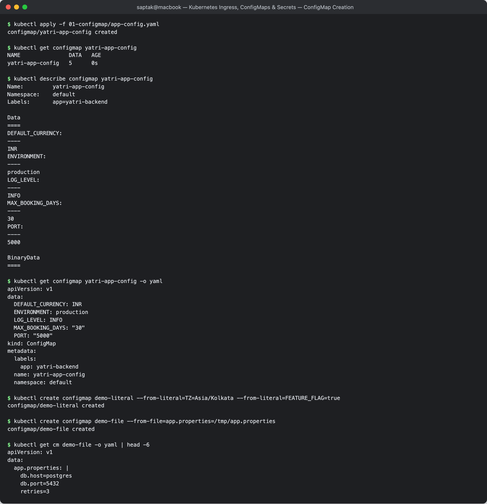

---

## Task 2: Secrets — and Why base64 Is Not Security

**Manifest:** [`02-secret/db-secret.yaml`](./02-secret/db-secret.yaml)

```
$ kubectl apply -f 02-secret/db-secret.yaml
secret/yatri-db-secret created

$ kubectl get secret yatri-db-secret
NAME              TYPE     DATA   AGE
yatri-db-secret   Opaque   3      0s
```

### `describe` hides the values — and that is the trap

```
$ kubectl describe secret yatri-db-secret
Name:         yatri-db-secret
Namespace:    default
Type:  Opaque

Data
====
POSTGRES_DB:        19 bytes
POSTGRES_PASSWORD:  14 bytes
POSTGRES_USER:      11 bytes
```

`describe` deliberately prints only byte counts, which makes Secrets *feel* protected. They are not:

```
$ kubectl get secret yatri-db-secret -o yaml
apiVersion: v1
data:
  POSTGRES_DB: eWF0cmlfcHJvZHVjdGlvbl9kYg==
  POSTGRES_PASSWORD: c2VjcmV0cGFzc3dvcmQ=
  POSTGRES_USER: eWF0cmlfYWRtaW4=
kind: Secret
type: Opaque
```

### Decoding takes one command

```
$ kubectl get secret yatri-db-secret -o jsonpath='{.data.POSTGRES_PASSWORD}' | base64 -d
secretpassword

$ kubectl get secret yatri-db-secret -o go-template='{{range $k,$v := .data}}{{$k}}={{$v | base64decode}}{{"\n"}}{{end}}'
POSTGRES_DB=yatri_production_db
POSTGRES_PASSWORD=secretpassword
POSTGRES_USER=yatri_admin
```

**base64 is an encoding, not encryption.** It exists so that arbitrary binary (certificates, keystores) can travel through JSON/YAML — it provides **zero** confidentiality. Anyone who can `get secrets` in a namespace can read every credential in it.

### What actually protects a Secret

| Control | What it does |
| --- | --- |
| **RBAC** | the real boundary — restrict `get`/`list` on `secrets` to the service accounts that need them |
| **Encryption at rest** | `EncryptionConfiguration` on the API server encrypts Secrets in etcd (off by default in many distros; minikube included) |
| **tmpfs mounts** | mounted Secrets live in RAM on the node, never on its disk (proved in Task 4) |
| **External secret stores** | Vault, AWS Secrets Manager, Sealed Secrets, External Secrets Operator — so plaintext never enters Git |
| **Never commit them** | `02-secret/db-secret.yaml` in this repo is a *teaching* file; a real one belongs in a secret store |

### Secret types

| Type | Purpose |
| --- | --- |
| `Opaque` | default; arbitrary key/value (used above) |
| `kubernetes.io/tls` | must contain exactly `tls.crt` + `tls.key` (used in Task 7) |
| `kubernetes.io/dockerconfigjson` | private registry pull credentials (`imagePullSecrets`) |
| `kubernetes.io/service-account-token` | API credentials auto-mounted into pods |

**Screenshot:** 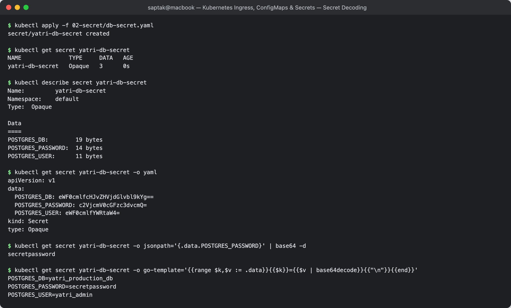

---

## Task 3: The base64 Trailing-Newline Gotcha

The single most common cause of "the password is right but authentication fails".

```
$ echo "secretpassword" | base64        # WRONG — echo appends a newline
c2VjcmV0cGFzc3dvcmQK

$ echo -n "secretpassword" | base64     # CORRECT — -n suppresses it
c2VjcmV0cGFzc3dvcmQ=
```

The two strings differ only in the last characters, which is easy to miss in a diff. Decoding shows the damage:

```
wrong   -> 15 bytes
correct -> 14 bytes
```

```
$ echo -n "c2VjcmV0cGFzc3dvcmQK" | base64 -d | xxd
00000000: 7365 6372 6574 7061 7373 776f 7264 0a    secretpassword.
                                             ^^
                                    the invisible 0x0a

$ echo -n "c2VjcmV0cGFzc3dvcmQ=" | base64 -d | xxd
00000000: 7365 6372 6574 7061 7373 776f 7264       secretpassword
```

**Why it is so painful to debug:** the app receives `"secretpassword\n"`, the database compares it to `"secretpassword"`, and it fails. Every log line *looks* correct because a trailing newline is invisible in terminal output and in most log viewers. You can stare at `kubectl describe` all day and see nothing — only the **byte count** (`15` vs `14`) or a hexdump reveals it.

### Two ways to never hit it

**1 — let `kubectl` do the encoding:**

```
$ kubectl create secret generic demo-safe --from-literal=PASSWORD=secretpassword
secret/demo-safe created

$ kubectl get secret demo-safe -o jsonpath='{.data.PASSWORD}'
c2VjcmV0cGFzc3dvcmQ=        <- identical to `echo -n`
decoded length: 14 bytes
```

**2 — use `stringData` and never touch base64:**

```yaml
apiVersion: v1
kind: Secret
metadata:
  name: demo-stringdata
type: Opaque
stringData:          # plain text in; kubectl encodes it on write
  PASSWORD: secretpassword
  API_KEY: abc123
```

```
$ kubectl apply -f demo-stringdata.yaml
secret/demo-stringdata created

$ kubectl get secret demo-stringdata -o yaml | grep -A3 '^data:'
data:
  API_KEY: YWJjMTIz
  PASSWORD: c2VjcmV0cGFzc3dvcmQ=
```

`stringData` is **write-only**: the API server converts it into `data` and it never appears in a read-back, so there is no risk of plaintext lingering in the stored object.

> **Debug recipe:** when credentials mysteriously fail, run
> `kubectl get secret <name> -o jsonpath='{.data.<KEY>}' | base64 -d | xxd | tail -1`
> and look for a trailing `0a`.

**Screenshot:** 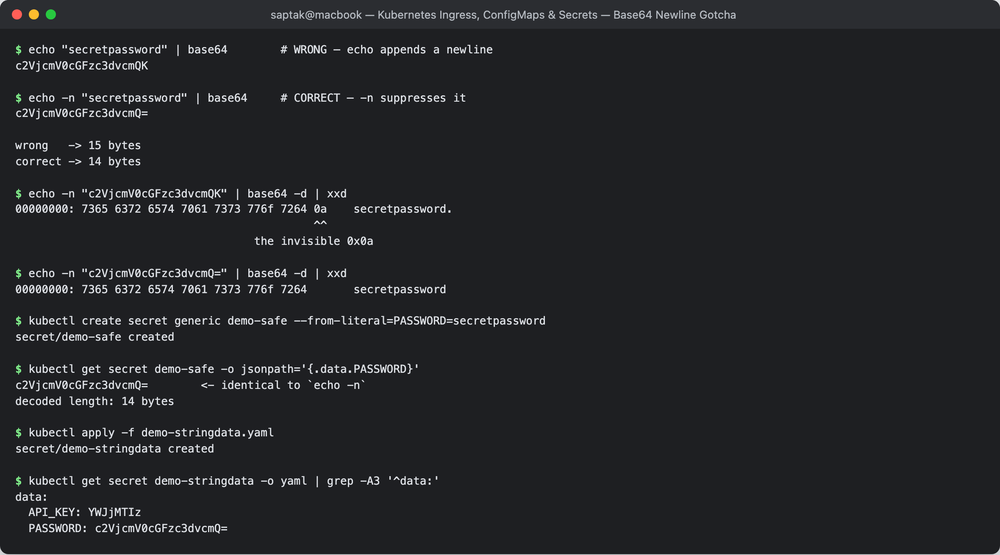

---

## Task 4: Consuming Config — env vars vs volume mounts

Three ways to get a ConfigMap/Secret into a container, and the choice has real consequences.

### 4.1 — As environment variables

[`04-full-demo/backend.yaml`](./04-full-demo/backend.yaml) uses both `envFrom` (whole ConfigMap) and `env`/`valueFrom` (individual Secret keys):

```yaml
envFrom:
  - configMapRef:
      name: yatri-app-config      # every key becomes an env var
env:
  - name: POSTGRES_PASSWORD        # one specific key
    valueFrom:
      secretKeyRef:
        name: yatri-db-secret
        key: POSTGRES_PASSWORD
```

**Verified inside the running pod:**

```
$ kubectl exec yatri-backend-6c58cb99c7-5mm74 -- env | sort | grep -E 'ENVIRONMENT|LOG_LEVEL|APP_PORT|CURRENCY|MAX_BOOKING|POSTGRES'
APP_PORT=5000
DEFAULT_CURRENCY=INR
ENVIRONMENT=production
LOG_LEVEL=INFO
MAX_BOOKING_DAYS=30
POSTGRES_DB=yatri_production_db
POSTGRES_PASSWORD=secretpassword        <-- arrives DECODED
POSTGRES_USER=yatri_admin
```

**Secret values are decoded automatically by the kubelet.** The application never sees base64 — it just reads `os.getenv('POSTGRES_PASSWORD')`. And the app confirms it:

```
$ kubectl exec <backend-pod> -- python3 -c "import urllib.request; print(urllib.request.urlopen('http://localhost:5000').read().decode())"
Yatri Backend API
=================
ENVIRONMENT     : production
LOG_LEVEL       : INFO
DEFAULT_CURRENCY: INR
POSTGRES_USER   : yatri_admin
POSTGRES_DB     : yatri_production_db
```

### 4.2 — As mounted volumes

**Manifest:** [`05-volume-mount/config-volume-pod.yaml`](./05-volume-mount/config-volume-pod.yaml) (added for this task) mounts the same ConfigMap and Secret as directories.

```
$ kubectl exec config-volume-demo -- ls -l /etc/app-config
total 0
lrwxrwxrwx 1 root root 15 Sep 20 19:36 APP_PORT -> ..data/APP_PORT
lrwxrwxrwx 1 root root 23 Sep 20 19:36 DEFAULT_CURRENCY -> ..data/DEFAULT_CURRENCY
lrwxrwxrwx 1 root root 18 Sep 20 19:36 ENVIRONMENT -> ..data/ENVIRONMENT
lrwxrwxrwx 1 root root 16 Sep 20 19:36 LOG_LEVEL -> ..data/LOG_LEVEL
lrwxrwxrwx 1 root root 23 Sep 20 19:36 MAX_BOOKING_DAYS -> ..data/MAX_BOOKING_DAYS

APP_PORT             = 5000
DEFAULT_CURRENCY     = INR
ENVIRONMENT          = production
LOG_LEVEL            = INFO
MAX_BOOKING_DAYS     = 30
```

**Each key becomes a file named after the key.** Note they are **symlinks into a hidden `..data/` directory** — that indirection is how the kubelet swaps the whole set atomically on update, so an app never reads a half-updated config.

Secrets mount identically, already decoded:

```
$ kubectl exec config-volume-demo -- ls -l /etc/app-secrets
lrwxrwxrwx 1 root root 18 Sep 20 19:36 POSTGRES_DB -> ..data/POSTGRES_DB
lrwxrwxrwx 1 root root 24 Sep 20 19:36 POSTGRES_PASSWORD -> ..data/POSTGRES_PASSWORD
lrwxrwxrwx 1 root root 20 Sep 20 19:36 POSTGRES_USER -> ..data/POSTGRES_USER

POSTGRES_DB          = yatri_production_db
POSTGRES_PASSWORD    = secretpassword
POSTGRES_USER        = yatri_admin
```

**And they are stored in RAM, never on the node's disk:**

```
$ kubectl exec config-volume-demo -- df -h /etc/app-secrets
Filesystem      Size  Used Available Use% Mounted on
tmpfs           7.8G  12.0K      7.8G   0% /etc/app-secrets
```

`tmpfs` is a memory-backed filesystem. If the node is seized or its disk imaged, mounted Secrets are not on it — one of the few places Kubernetes gives Secrets genuinely different treatment from ConfigMaps.

### 4.3 — The live-update difference (measured)

The demo pod consumes `LOG_LEVEL` **both ways at once**, so they can be compared directly.

```
--- before ---
env  LOG_LEVEL_FROM_ENV         = INFO
file /etc/app-config/LOG_LEVEL  = INFO

$ kubectl patch configmap yatri-app-config -p '{"data":{"LOG_LEVEL":"DEBUG"}}'
configmap/yatri-app-config patched

--- after ~75s, WITHOUT restarting the pod ---
env  LOG_LEVEL_FROM_ENV         = INFO      <-- UNCHANGED
file /etc/app-config/LOG_LEVEL  = DEBUG     <-- UPDATED
```

**Environment variables are a snapshot taken at container start.** The kernel copies them into the process at `exec` time; nothing can change them afterwards. Mounted files are kept in sync by the kubelet (default sync period ~60s, hence the ~75s wait).

The same applies to the real Deployment, and a restart is the only fix:

```
$ kubectl exec <backend-pod> -- printenv LOG_LEVEL
INFO                                        <-- still stale

$ kubectl rollout restart deployment/yatri-backend
deployment.apps/yatri-backend restarted

$ kubectl get pods -l app=yatri-backend
NAME                             READY   STATUS        RESTARTS   AGE
yatri-backend-6c58cb99c7-5mm74   1/1     Terminating   0          3m54s
yatri-backend-6c58cb99c7-6q9gk   1/1     Terminating   0          3m54s
yatri-backend-777ffc9df5-2grrx   1/1     Running       0          20s
yatri-backend-777ffc9df5-rt97n   1/1     Running       0          21s

yatri-backend-6c58cb99c7-5mm74 LOG_LEVEL = INFO       <-- old pods
yatri-backend-6c58cb99c7-6q9gk LOG_LEVEL = INFO
yatri-backend-777ffc9df5-2grrx LOG_LEVEL = DEBUG      <-- new pods
yatri-backend-777ffc9df5-rt97n LOG_LEVEL = DEBUG
```

### Choosing between them

| | `env` / `envFrom` | volume mount |
| --- | --- | --- |
| Live updates | **never** — restart required | yes (~60s), **if the app re-reads the file** |
| Shape | flat key → value | file per key, or one whole file |
| Whole config files (`nginx.conf`) | no | **yes** |
| Visible in `kubectl describe pod` | **yes** — secrets leak into pod spec output | no |
| Leaks into child processes / crash dumps | yes | no |
| Binary data | no | yes |
| Simplicity | highest (12-factor) | more YAML |

**Practical guidance:** use `env` for simple settings and anything read once at boot; use **volume mounts for Secrets** (better isolation, tmpfs, no leakage into `describe` or process listings) and for whole config files. Note the second caveat on live updates — the file changes, but a process that read it at startup still holds the old value unless it watches the file or you restart it. The common production pattern is to annotate the Deployment with a hash of the ConfigMap so any change automatically triggers a rolling restart.

**Screenshot:** 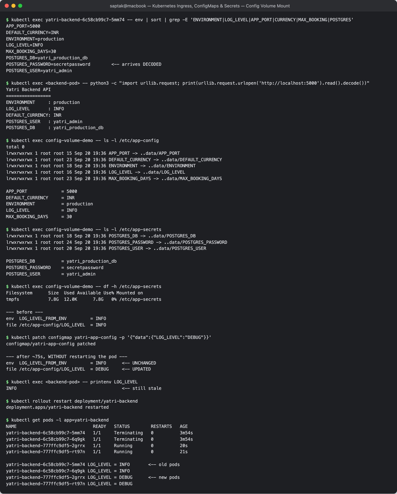

---

## Task 5: Ingress Controller Setup

An **Ingress** resource is just data in etcd. Without a **controller** watching for it, nothing happens.

```
$ minikube addons enable ingress
* ingress is an addon maintained by Kubernetes.
* After the addon is enabled, please run "minikube tunnel" and your ingress resources would be available at "127.0.0.1"
  - Using image registry.k8s.io/ingress-nginx/controller:v1.15.1
  - Using image registry.k8s.io/ingress-nginx/kube-webhook-certgen:v1.6.9
* Verifying ingress addon...
* The 'ingress' addon is enabled
```

```
$ kubectl get pods -n ingress-nginx
NAME                                       READY   STATUS      RESTARTS   AGE
ingress-nginx-admission-create-wsdnh       0/1     Completed   0          56s
ingress-nginx-admission-patch-mx89b        0/1     Completed   0          56s
ingress-nginx-controller-d7cd8c989-v2hr7   0/1     Running     0          56s

$ kubectl get svc -n ingress-nginx
NAME                                 TYPE        CLUSTER-IP      EXTERNAL-IP   PORT(S)                      AGE
ingress-nginx-controller             NodePort    10.101.86.209   <none>        80:31672/TCP,443:31736/TCP   56s
ingress-nginx-controller-admission   ClusterIP   10.99.154.13    <none>        443/TCP                      56s

$ kubectl get ingressclass
NAME              CONTROLLER             PARAMETERS   AGE
nginx (default)   k8s.io/ingress-nginx   <none>       56s
```

Three things worth reading here:

- **The controller is itself an ordinary Deployment behind a Service.** In a cloud cluster that Service would be `type: LoadBalancer` — **the one** billable load balancer that fronts every Ingress rule. That is the cost argument from Session 11 Task 11 made concrete.
- **The two `admission-*` Jobs** show `Completed`. They generate the TLS cert for the validating admission webhook that rejects malformed Ingress objects before they reach etcd.
- **`ingressclass nginx (default)`** is what `spec.ingressClassName: nginx` binds to. Omit that field with no default class and the Ingress is silently ignored by every controller — a classic silent failure.

**Screenshot:** 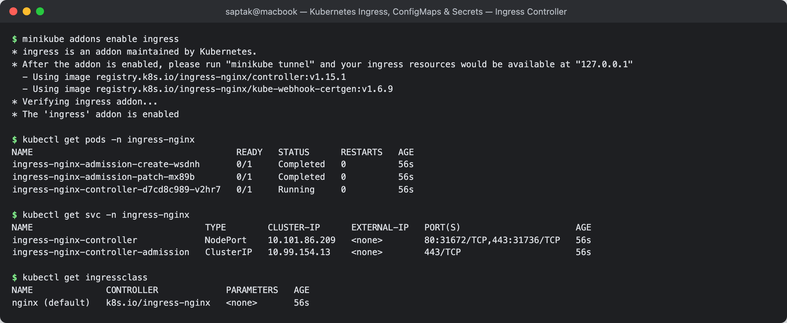

---

## Task 6: Host & Path-Based Routing (Full Demo)

**Directory:** [`04-full-demo/`](./04-full-demo/) — ConfigMap + Secret + backend (Python) + frontend (nginx) + Ingress.

```
$ kubectl apply -f 04-full-demo/configmap.yaml
$ kubectl apply -f 04-full-demo/secret.yaml
$ kubectl apply -f 04-full-demo/backend.yaml
$ kubectl apply -f 04-full-demo/frontend.yaml
$ kubectl apply -f 04-full-demo/ingress.yaml

$ kubectl get deploy,svc,ingress
NAME                             READY   UP-TO-DATE   AVAILABLE   AGE
deployment.apps/yatri-backend    2/2     2            2           1s
deployment.apps/yatri-frontend   2/2     2            2           1s

NAME                             TYPE        CLUSTER-IP      EXTERNAL-IP   PORT(S)   AGE
service/yatri-backend-service    ClusterIP   10.97.25.237    <none>        80/TCP    1s
service/yatri-frontend-service   ClusterIP   10.100.184.67   <none>        80/TCP    1s

NAME                                      CLASS   HOSTS         ADDRESS        PORTS   AGE
ingress.networking.k8s.io/yatri-ingress   nginx   yatri.local   192.168.49.2   80      1s
```

**Both backing Services are plain `ClusterIP`** — neither is exposed externally. Only the Ingress controller is.

```
$ kubectl describe ingress yatri-ingress
Name:             yatri-ingress
Ingress Class:    nginx
Rules:
  Host         Path  Backends
  ----         ----  --------
  yatri.local
               /api(/|$)(.*)   yatri-backend-service:80 (10.244.1.72:5000,10.244.0.36:5000)
               /               yatri-frontend-service:80 (10.244.0.37:80,10.244.1.73:80)
Annotations:   nginx.ingress.kubernetes.io/rewrite-target: /$2
               nginx.ingress.kubernetes.io/ssl-redirect: false
               nginx.ingress.kubernetes.io/use-regex: true
Events:
  Type    Reason  Age   From                      Message
  ----    ------  ----  ----------------------    -------
  Normal  Sync    1s    nginx-ingress-controller  Scheduled for sync
```

`describe ingress` resolving each backend to **actual pod IPs** is the proof the controller found the Services. `<error: endpoints "..." not found>` there is the #1 Ingress failure — a Service name typo, or the Service having no ready endpoints.

### Routing verified

```
$ curl -s -H 'Host: yatri.local' http://127.0.0.1:64404/api
Yatri Backend API
=================
ENVIRONMENT     : production
LOG_LEVEL       : INFO
DEFAULT_CURRENCY: INR
POSTGRES_USER   : yatri_admin
POSTGRES_DB     : yatri_production_db

$ curl -s -H 'Host: yatri.local' http://127.0.0.1:64404/ | grep -i '<title>'
<title>Welcome to nginx!</title>
```

**Same IP, same port, two different applications** — selected purely by URL path. That is L7 routing, and it is what a Service (L4) cannot do.

This response also closes the loop on Tasks 1–4: the values printed by `/api` came from the ConfigMap and the Secret, through env vars, out over HTTP, through the Ingress.

### Host matching is strict

```
$ curl -s -o /dev/null -w '%{http_code}\n' -H 'Host: wrong.local' http://127.0.0.1:64404/
404

$ curl -s -o /dev/null -w '%{http_code}\n' http://127.0.0.1:64404/        # no Host header
404
```

The rule is `host: yatri.local`. Any other `Host` header matches no rule and falls through to the controller's default backend → **404**. This is why you edit `/etc/hosts` (`192.168.49.2 yatri.local`) or pass `-H 'Host: ...'` when testing locally — hitting the IP directly will always 404.

### The rewrite annotation

```yaml
path: /api(/|$)(.*)
annotations:
  nginx.ingress.kubernetes.io/use-regex: "true"
  nginx.ingress.kubernetes.io/rewrite-target: /$2
```

The regex has two capture groups: `(/|$)` is `$1`, `(.*)` is `$2`. `rewrite-target: /$2` forwards only the part **after** `/api`. So a request for `/api/bookings` reaches the backend as `/bookings` — the backend never needs to know it is mounted under `/api`. Without the rewrite it would receive `/api/bookings` and most likely 404 on its own routes.

**Screenshot:** 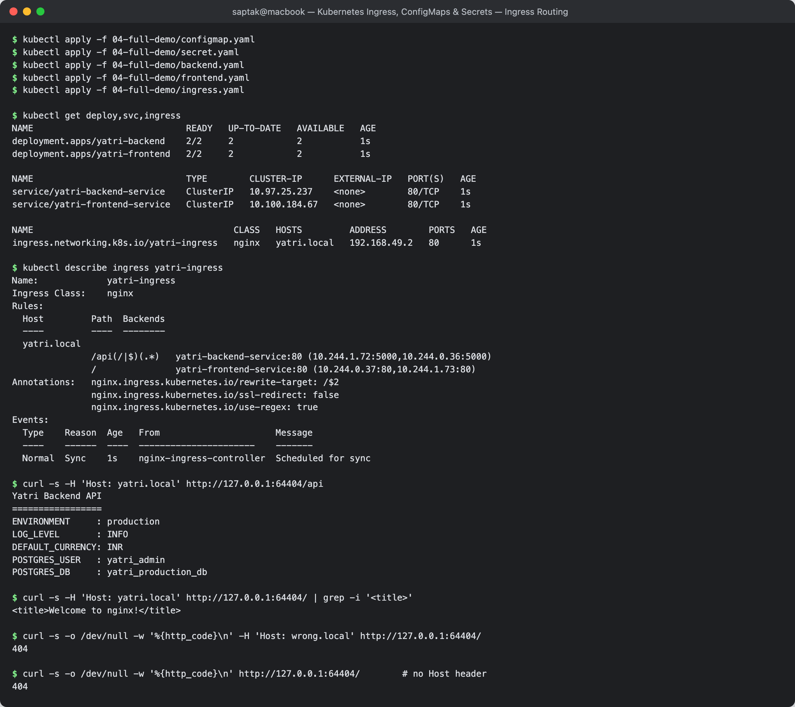

---

## Task 7: TLS Termination at the Ingress

**Manifest:** [`03-ingress/ingress-tls.yaml`](./03-ingress/ingress-tls.yaml) — two hosts, one certificate.

### Generate a self-signed certificate

```
$ openssl req -x509 -nodes -days 365 -newkey rsa:2048 \
    -keyout tls.key -out tls.crt \
    -subj "/CN=portal.campus.local/O=campus" \
    -addext "subjectAltName=DNS:portal.campus.local,DNS:api.campus.local"

$ openssl x509 -in tls.crt -noout -subject -dates -ext subjectAltName
subject=CN=portal.campus.local, O=campus
notBefore=Sep 20 19:34:53 2026 GMT
notAfter=Sep 20 19:34:53 2027 GMT
X509v3 Subject Alternative Name:
    DNS:portal.campus.local, DNS:api.campus.local
```

The **SAN** entries are what actually matter — modern browsers and curl ignore `CN` entirely and validate against `subjectAltName`. A cert with only a `CN` will be rejected even if the name matches.

### Create the TLS Secret

```
$ kubectl create secret tls campus-tls-cert --cert=tls.crt --key=tls.key
secret/campus-tls-cert created

$ kubectl get secret campus-tls-cert
NAME              TYPE                DATA   AGE
campus-tls-cert   kubernetes.io/tls   2      0s

$ kubectl describe secret campus-tls-cert
Type:  kubernetes.io/tls

Data
====
tls.crt:  1257 bytes
tls.key:  1704 bytes
```

Note `TYPE: kubernetes.io/tls`, not `Opaque`. That type is enforced: the Secret **must** contain exactly the keys `tls.crt` and `tls.key`, and the Ingress controller looks them up by those exact names.

### Apply the TLS Ingress

```
$ kubectl apply -f 03-ingress/ingress-tls.yaml
ingress.networking.k8s.io/campus-ingress-tls created

$ kubectl get ingress
NAME                 CLASS   HOSTS                                  ADDRESS        PORTS     AGE
campus-ingress-tls   nginx   portal.campus.local,api.campus.local                  80, 443   8s
yatri-ingress        nginx   yatri.local                            192.168.49.2   80        72s
```

`PORTS` now reads `80, 443` (vs `80` for the non-TLS one) — that is how you tell at a glance whether an Ingress has TLS configured.

```
$ kubectl describe ingress campus-ingress-tls
TLS:
  campus-tls-cert terminates portal.campus.local,api.campus.local
Rules:
  Host                 Path  Backends
  ----                 ----  --------
  portal.campus.local
                       /()(.*)          yatri-frontend-service:80 (10.244.0.37:80,10.244.1.73:80)
  api.campus.local
                       /api(/|$)(.*)    yatri-backend-service:80 (10.244.1.72:5000,10.244.0.36:5000)
Annotations:           nginx.ingress.kubernetes.io/rewrite-target: /$2
                       nginx.ingress.kubernetes.io/ssl-redirect: true
```

### HTTPS verified — host-based routing over TLS

```
$ curl -sk --resolve portal.campus.local:64405:127.0.0.1 https://portal.campus.local:64405/ | grep -i '<title>'
<title>Welcome to nginx!</title>

$ curl -sk --resolve api.campus.local:64405:127.0.0.1 https://api.campus.local:64405/api
Yatri Backend API
=================
ENVIRONMENT     : production
LOG_LEVEL       : INFO
DEFAULT_CURRENCY: INR
POSTGRES_USER   : yatri_admin
POSTGRES_DB     : yatri_production_db
```

**Two hostnames, one IP, one port, one certificate, two different backends.** The controller picks the backend from the **SNI** field of the TLS handshake — which is why `--resolve` is used rather than a plain `Host:` header: with HTTPS the hostname must be in the TLS handshake itself, before any HTTP header exists.

### The certificate served is the one we created

```
$ curl -skv ...
* ALPN: curl offers h2,http/1.1
* ALPN: server accepted h2
*  subject: CN=portal.campus.local; O=campus
*  issuer: CN=portal.campus.local; O=campus
*  SSL certificate verify result: self signed certificate (18), continuing anyway.
```

`subject == issuer` is the signature of a self-signed cert. And without `-k`, curl correctly refuses it:

```
$ curl -s --resolve portal.campus.local:64405:127.0.0.1 https://portal.campus.local:64405/
(curl exit code: 60)        # 60 = SSL peer certificate could not be authenticated
```

That rejection is the system working. In production you replace the self-signed cert with **cert-manager** + Let's Encrypt, which issues and auto-renews real certs into the same `kubernetes.io/tls` Secret — the Ingress YAML does not change at all.

### `ssl-redirect` in action

```
$ curl -s -o /dev/null -w '%{http_code} -> %{redirect_url}\n' -H 'Host: portal.campus.local' http://127.0.0.1:64404/
308 -> https://portal.campus.local/
```

`nginx.ingress.kubernetes.io/ssl-redirect: "true"` makes plain HTTP return **308 Permanent Redirect** to the HTTPS URL. (Compare the non-TLS `yatri-ingress`, which sets it to `"false"` and serves HTTP directly — otherwise it would redirect to an HTTPS endpoint with no certificate.) 308 rather than 301 preserves the HTTP method and body, so a redirected `POST` stays a `POST`.

**TLS termination** means the Ingress controller decrypts HTTPS and forwards **plain HTTP** to the pods over the cluster network. Pods need no certificates and no TLS code, and certificates are managed in exactly one place. If you need encryption on the internal hop too, that is a service mesh's mTLS, not Ingress.

**Screenshot:** 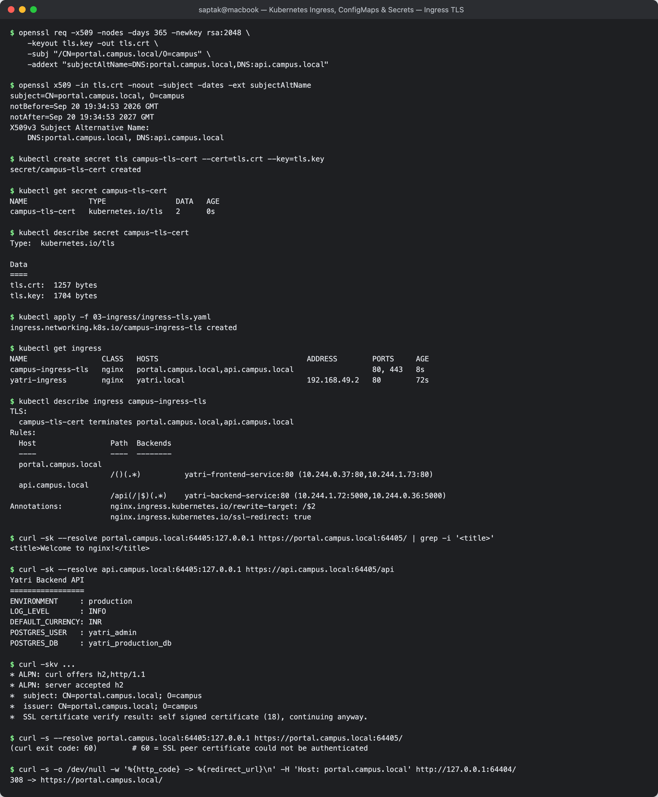

---

## Task 8: Concepts & Comparison Tables

### ConfigMap vs Secret

| | ConfigMap | Secret |
| --- | --- | --- |
| Purpose | non-sensitive config | credentials, tokens, certs, keys |
| Storage in YAML | plain text | base64 (**encoding, not encryption**) |
| `kubectl describe` | shows values | shows **byte counts only** |
| Storage in etcd | plain | plain unless encryption-at-rest is enabled |
| Volume backing on node | regular file | **tmpfs (RAM)** |
| Size limit | 1 MiB | 1 MiB |
| Types | one | `Opaque`, `kubernetes.io/tls`, `dockerconfigjson`, `service-account-token` |
| Live update via volume | yes (~60s) | yes (~60s) |
| Live update via env | **no** | **no** |

### Service vs Ingress

| | Service (`LoadBalancer` / `NodePort`) | Ingress |
| --- | --- | --- |
| OSI layer | **L4** (TCP/UDP) | **L7** (HTTP/HTTPS) |
| Routes by | port only | **host, path, header, method** |
| TLS termination | no | **yes** |
| Cost in cloud | one billable LB **per service** | one LB for **all** rules |
| Needs a controller | no (built into kube-proxy) | **yes** — the resource alone does nothing |
| Non-HTTP protocols | yes | no (use a Service, or a Gateway API `TCPRoute`) |

### How a request flows through an Ingress

```
Browser: https://portal.campus.local/
   │ 1. DNS -> the ingress controller's external IP (or /etc/hosts in this lab)
   ▼
Cloud LB / NodePort 31672,31736
   │ 2. into the ingress-nginx controller pod
   ▼
ingress-nginx controller
   │ 3. TLS handshake, read SNI -> pick cert from the kubernetes.io/tls Secret
   │ 4. decrypt; match Host + path against Ingress rules
   │ 5. apply rewrite-target
   ▼
ClusterIP Service (yatri-frontend-service:80)
   │ 6. kube-proxy DNAT to a ready pod
   ▼
Pod 10.244.0.37:80 — plain HTTP, no certificate needed
```

### Debug checklist

| Symptom | Check |
| --- | --- |
| `404` from the controller | `Host` header/DNS does not match `spec.rules[].host` |
| `503` | backend Service has **no ready endpoints** — `kubectl get endpoints <svc>` |
| `describe ingress` shows `<error: endpoints ... not found>` | Service name typo, or wrong namespace (an Ingress can only reference Services **in its own namespace**) |
| Ingress `ADDRESS` stays empty | no controller running, or `ingressClassName` does not match any `ingressclass` |
| TLS not used | `spec.tls[].hosts` must match `spec.rules[].host` **exactly**; Secret must be type `kubernetes.io/tls` in the **same namespace** |
| curl exit 60 | certificate not trusted (self-signed) or hostname not in SAN |
| Config change had no effect | env vars are a snapshot — `kubectl rollout restart deployment/<name>` |
| Password "correct" but auth fails | trailing newline — `... \| base64 -d \| xxd \| tail -1`, look for `0a` |

---

## Task 9: Ingress vs Ingress Controller

> **Environment for Tasks 9 and 10:** a single-node **kind** cluster (Kubernetes v1.37.0) with the node's ports 80/443 mapped to `localhost:18080/18443`. The controller was installed from kind's ingress-nginx manifest (controller **v1.12.1**). This is a different cluster from the minikube one used in Tasks 1–8, so IPs and versions differ.

### What is an Ingress?

An **Ingress** is a Kubernetes API object (`networking.k8s.io/v1`) that holds **HTTP routing rules**: "requests for host `yatri.local` with path `/api…` go to Service `yatri-backend-service:80`". It is only configuration stored in etcd. It does not listen on any port and has no process behind it. [`04-full-demo/ingress.yaml`](./04-full-demo/ingress.yaml) is one.

### What is an Ingress Controller?

An **Ingress Controller** is a running program, normally a Deployment plus a Service, that **watches** Ingress objects and turns them into real proxy configuration, then serves the traffic. ingress-nginx renders the rules into an `nginx.conf`. Others include Traefik, HAProxy, Contour and the AWS Load Balancer Controller (which configures an ALB instead of running a proxy in the cluster). Unlike kube-controller-manager's controllers, **no Ingress controller ships with Kubernetes**. You install one.

### Proving the difference: the same Ingress, before and after a controller exists

**Before**: the app, its Services and the Ingress are applied, but no controller is installed:

```
$ kubectl apply -f 04-full-demo/configmap.yaml -f 04-full-demo/secret.yaml -f 04-full-demo/backend.yaml -f 04-full-demo/frontend.yaml
configmap/yatri-app-config created
secret/yatri-db-secret created
deployment.apps/yatri-backend created
service/yatri-backend-service created
deployment.apps/yatri-frontend created
service/yatri-frontend-service created

$ kubectl apply -f 04-full-demo/ingress.yaml
ingress.networking.k8s.io/yatri-ingress created

$ kubectl get ingressclass
No resources found

$ kubectl get ingress yatri-ingress
NAME            CLASS   HOSTS         ADDRESS   PORTS   AGE
yatri-ingress   nginx   yatri.local             80      15s          <-- no ADDRESS: nobody has claimed it

$ kubectl describe ingress yatri-ingress | sed -n "/^Rules/,\$p"
Rules:
  Host         Path  Backends
  ----         ----  --------
  yatri.local
               /api(/|$)(.*)   yatri-backend-service:80 (10.244.0.47:5000,10.244.0.46:5000)
               /               yatri-frontend-service:80 (10.244.0.49:80,10.244.0.48:80)
Annotations:   nginx.ingress.kubernetes.io/rewrite-target: /$2
               nginx.ingress.kubernetes.io/ssl-redirect: false
               nginx.ingress.kubernetes.io/use-regex: true
Events:        <none>                                                 <-- no controller ever synced it

$ curl -s --max-time 5 -H "Host: yatri.local" http://localhost:18080/api; echo "curl exit code: $?"
curl exit code: 56                                                    <-- nothing is listening on the node's port 80
```

The API server accepted the Ingress, and the backends even resolve to pod IPs, yet **no request can be served**. The rules exist, but nothing is acting on them.

**Install the controller** (kind's ingress-nginx manifest):

```
$ curl -sL https://kind.sigs.k8s.io/examples/ingress/deploy-ingress-nginx.yaml -o deploy-ingress-nginx.yaml
$ kubectl apply -f deploy-ingress-nginx.yaml | tail -4
job.batch/ingress-nginx-admission-create created
job.batch/ingress-nginx-admission-patch created
ingressclass.networking.k8s.io/nginx created
validatingwebhookconfiguration.admissionregistration.k8s.io/ingress-nginx-admission created

$ kubectl wait --namespace ingress-nginx --for=condition=ready pod --selector=app.kubernetes.io/component=controller --timeout=240s
pod/ingress-nginx-controller-7c467b649f-qkb6f condition met

$ kubectl get pods,svc -n ingress-nginx
NAME                                            READY   STATUS      RESTARTS   AGE
pod/ingress-nginx-admission-create-z8zgx        0/1     Completed   0          54s
pod/ingress-nginx-admission-patch-rc8l2         0/1     Completed   0          54s
pod/ingress-nginx-controller-7c467b649f-qkb6f   1/1     Running     0          54s

NAME                                         TYPE           CLUSTER-IP     EXTERNAL-IP   PORT(S)                      AGE
service/ingress-nginx-controller             LoadBalancer   10.96.216.43   <pending>     80:30471/TCP,443:30414/TCP   54s
service/ingress-nginx-controller-admission   ClusterIP      10.96.4.47     <none>        443/TCP                      54s

$ kubectl get ingressclass
NAME    CONTROLLER             PARAMETERS   AGE
nginx   k8s.io/ingress-nginx   <none>       54s
```

**After**: the **unchanged** Ingress object is picked up:

```
$ kubectl get ingress yatri-ingress
NAME            CLASS   HOSTS         ADDRESS     PORTS   AGE
yatri-ingress   nginx   yatri.local   localhost   80      70s        <-- controller wrote its address into status

$ kubectl describe ingress yatri-ingress | sed -n "/^Rules/,\$p"
Rules:
  Host         Path  Backends
  ----         ----  --------
  yatri.local
               /api(/|$)(.*)   yatri-backend-service:80 (10.244.0.47:5000,10.244.0.46:5000)
               /               yatri-frontend-service:80 (10.244.0.49:80,10.244.0.48:80)
Annotations:   nginx.ingress.kubernetes.io/rewrite-target: /$2
               nginx.ingress.kubernetes.io/ssl-redirect: false
               nginx.ingress.kubernetes.io/use-regex: true
Events:
  Type    Reason  Age                From                      Message
  ----    ------  ----               ----                      -------
  Normal  Sync    30s (x2 over 30s)  nginx-ingress-controller  Scheduled for sync

$ curl -s -H "Host: yatri.local" http://localhost:18080/api
Yatri Backend API
=================
ENVIRONMENT     : production
LOG_LEVEL       : INFO
DEFAULT_CURRENCY: INR
POSTGRES_USER   : yatri_admin
POSTGRES_DB     : yatri_production_db

$ curl -s -H "Host: yatri.local" http://localhost:18080/ | grep -i "<title>"
<title>Welcome to nginx!</title>

$ curl -s -o /dev/null -w "%{http_code}\n" -H "Host: other.local" http://localhost:18080/
404
```

**What the controller did with the Ingress.** It turned the rules into nginx configuration inside its own pod and logged that it claimed the object:

```
$ kubectl exec -n ingress-nginx deploy/ingress-nginx-controller -- grep -n -E "server_name yatri.local|location ~\* \"\^/api|set \\\$proxy_upstream_name" /etc/nginx/nginx.conf | head -6
206:		set $proxy_upstream_name "-";
237:			set $proxy_upstream_name "upstream-default-backend";
335:		server_name yatri.local ;
344:		set $proxy_upstream_name "-";
348:		location ~* "^/api(/|$)(.*)" {
371:			set $proxy_upstream_name "default-yatri-backend-service-80";

$ kubectl logs -n ingress-nginx deploy/ingress-nginx-controller | grep -E "yatri-ingress" | head -3 | cut -c1-200
I1006 23:35:40.598272      11 store.go:440] "Found valid IngressClass" ingress="default/yatri-ingress" ingressclass="nginx"
I1006 23:35:40.598606      11 event.go:377] Event(v1.ObjectReference{Kind:"Ingress", Namespace:"default", Name:"yatri-ingress", UID:"95e8c8cd-a6f4-4634-acd0-f809cb9569a7", APIVersion:"networking.k8s.i
I1006 23:35:40.702849      11 status.go:304] "updating Ingress status" namespace="default" ingress="yatri-ingress" currentValue=null newValue=[{"hostname":"localhost"}]
```

Line 335 is the `host:` rule, line 348 is the `path:` regex, and line 371 is the `backend.service`. Each Ingress field became an nginx directive. Lines 206, 237 and 344 are the controller's own defaults, including the catch-all default backend that returned the `404` above.

### Difference between them

| | **Ingress** | **Ingress Controller** |
| --- | --- | --- |
| What it is | an API object: YAML stored in etcd | a running program: Deployment + Service (+ webhook) |
| Who writes it | the app team, one per app or host | installed once per cluster by the platform team |
| Contains | hosts, paths, backend Services, TLS Secret names, annotations | the actual proxy (nginx / Envoy / HAProxy) and the logic that watches Ingresses |
| Listens on a port | no | yes, 80/443 (exposed by a LoadBalancer or NodePort Service) |
| Without the other | accepted by the API, but **no ADDRESS and serves nothing** (shown above) | runs, but every request gets the default backend **404** |
| Linked by | `spec.ingressClassName: nginx` | `IngressClass nginx` → `controller: k8s.io/ingress-nginx` |
| Examples | `yatri-ingress`, `campus-ingress-tls` (Task 7) | ingress-nginx, Traefik, HAProxy, Contour, AWS Load Balancer Controller, GKE Ingress |

### Why both are required

Kubernetes separates **what** from **how**. The Ingress says *what* routing you want in a portable, vendor-neutral format. The controller decides *how* to do it, whether with nginx in a pod, an AWS ALB or a GCP load balancer. The same `ingress.yaml` worked unchanged on minikube's addon (v1.15.1, Tasks 5–6) and on kind's manifest (v1.12.1, here). That only works because the rules and the implementation are separate objects. Without an Ingress there are no rules. Without a controller nothing enforces them, as the `ADDRESS`-less Ingress and curl exit 56 above show.

**Screenshots:**
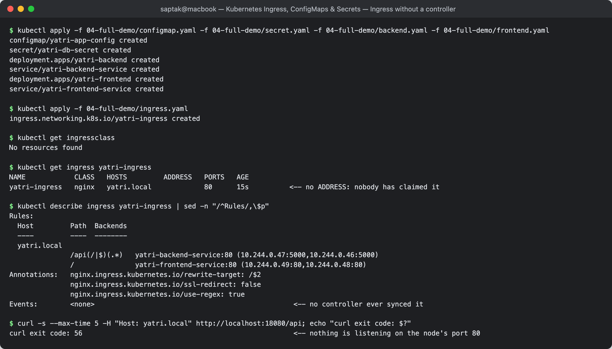
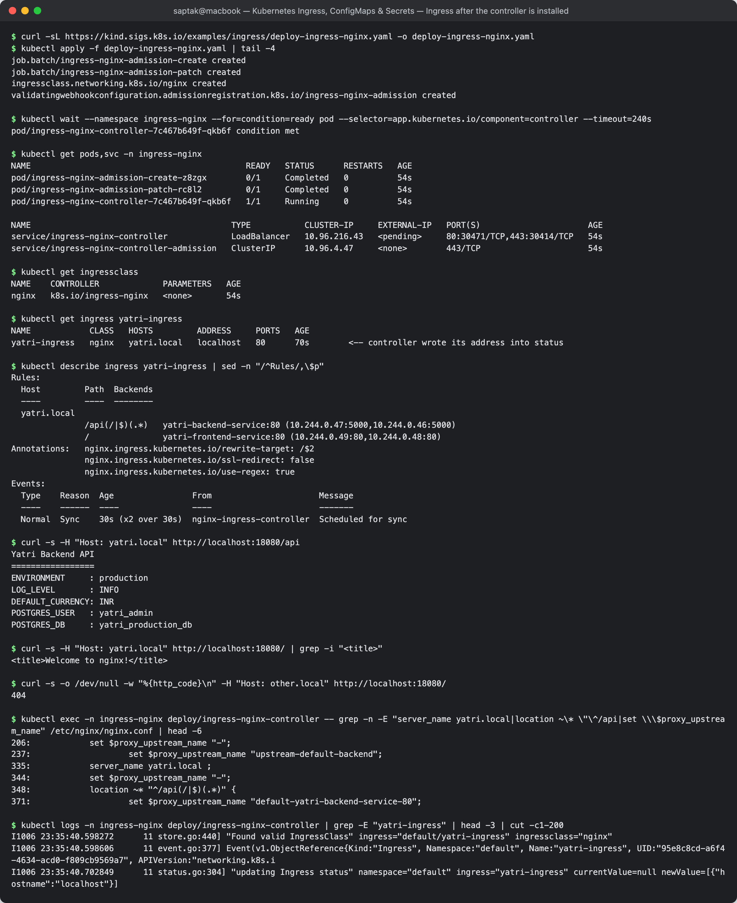

---

## Task 10: Troubleshooting — the trailing-newline Secret incident

The class [`troubleshooting/`](./troubleshooting/) folder contains one scenario, [`secret-base64-gotcha.md`](./troubleshooting/secret-base64-gotcha.md): *"PostgreSQL rejects the app with `password authentication failed for user "yatri_admin"`, although the developer says the password is correct."* Task 3 showed the encoding mistake on the command line. Here the full incident is reproduced on a cluster and fixed. The manifests were added to the same folder:

| File | Role |
| --- | --- |
| [`postgres-db.yaml`](./troubleshooting/postgres-db.yaml) | PostgreSQL 16 Pod + Service; its password comes from `postgres-admin`, created correctly with `--from-literal` |
| [`app-secret-broken.yaml`](./troubleshooting/app-secret-broken.yaml) | the app's Secret, encoded with `echo "mypassword" \| base64` → `bXlwYXNzd29yZAo=` |
| [`app-deployment.yaml`](./troubleshooting/app-deployment.yaml) | the "app": runs `psql` against the DB every 5s with `PGPASSWORD` from that Secret |
| [`app-secret-fixed.yaml`](./troubleshooting/app-secret-fixed.yaml) | the fix, encoded with `echo -n` → `bXlwYXNzd29yZA==` |

Run from inside `troubleshooting/`:

```
$ kubectl create secret generic postgres-admin --from-literal=POSTGRES_PASSWORD=mypassword
secret/postgres-admin created

$ kubectl apply -f postgres-db.yaml
pod/postgres created
service/postgres created

$ kubectl apply -f app-secret-broken.yaml -f app-deployment.yaml
secret/yatri-app-db-secret created
deployment.apps/yatri-app created
```

### 1. Identify the problem (before)

```
$ kubectl get pods
NAME                         READY   STATUS    RESTARTS   AGE
postgres                     1/1     Running   0          22s
yatri-app-7bb8ddb6c7-89nbk   1/1     Running   0          13s

$ kubectl logs deploy/yatri-app --tail=3
psql: error: connection to server at "postgres" (10.96.68.107), port 5432 failed: FATAL:  password authentication failed for user "yatri_admin"
psql: error: connection to server at "postgres" (10.96.68.107), port 5432 failed: FATAL:  password authentication failed for user "yatri_admin"
psql: error: connection to server at "postgres" (10.96.68.107), port 5432 failed: FATAL:  password authentication failed for user "yatri_admin"

$ kubectl logs postgres --tail=3
2026-10-06 23:33:44.074 UTC [66] DETAIL:  Connection matched file "/var/lib/postgresql/data/pg_hba.conf" line 128: "host all all all scram-sha-256"
2026-10-06 23:33:49.110 UTC [67] FATAL:  password authentication failed for user "yatri_admin"
2026-10-06 23:33:49.110 UTC [67] DETAIL:  Connection matched file "/var/lib/postgresql/data/pg_hba.conf" line 128: "host all all all scram-sha-256"
```

Both pods are `Running` with 0 restarts, so Kubernetes sees nothing wrong. The network is fine too: the app reached `postgres` through its Service IP and got a **password** error, not a connection error. That narrows it to the credentials.

### 2. Run troubleshooting commands

```
$ kubectl describe secret yatri-app-db-secret | tail -3
Data
====
DB_PASSWORD:  11 bytes                     <-- "mypassword" is 10 characters

$ kubectl describe secret postgres-admin | tail -3
Data
====
POSTGRES_PASSWORD:  10 bytes

$ kubectl get secret yatri-app-db-secret -o jsonpath="{.data.DB_PASSWORD}"; echo
bXlwYXNzd29yZAo=

$ kubectl get secret yatri-app-db-secret -o jsonpath="{.data.DB_PASSWORD}" | base64 -d | xxd
00000000: 6d79 7061 7373 776f 7264 0a              mypassword.

$ kubectl get secret postgres-admin -o jsonpath="{.data.POSTGRES_PASSWORD}" | base64 -d | xxd
00000000: 6d79 7061 7373 776f 7264                 mypassword

$ kubectl exec deploy/yatri-app -- sh -c "printf %s \"\$PGPASSWORD\" | od -c"
0000000   m   y   p   a   s   s   w   o   r   d  \n
0000013
```

### 3. Root cause

The app's Secret holds `mypassword` **plus a `0a` byte (`\n`)**, because its YAML value was produced with `echo "mypassword" | base64` without `-n`. The kubelet decodes Secrets faithfully, so the newline reached the container's environment (`od -c` shows `\n`), and `psql` sent an 11-byte password to a database expecting 10 bytes. The `11 bytes` in `describe` is the only clue visible without decoding. Printed in a terminal, the two passwords look identical.

### 4. Fix the issue

```
$ echo -n "mypassword" | base64
bXlwYXNzd29yZA==

$ kubectl apply -f app-secret-fixed.yaml
secret/yatri-app-db-secret configured

$ kubectl get secret yatri-app-db-secret -o jsonpath="{.data.DB_PASSWORD}" | base64 -d | xxd
00000000: 6d79 7061 7373 776f 7264                 mypassword

$ kubectl logs deploy/yatri-app --tail=1
psql: error: connection to server at "postgres" (10.96.68.107), port 5432 failed: FATAL:  password authentication failed for user "yatri_admin"
```

**Fixing the Secret alone is not enough.** The pod still fails, because `PGPASSWORD` is an environment variable, read once when the container starts (the env-var snapshot measured in Task 4.3). The pods must be recreated:

```
$ kubectl rollout restart deployment/yatri-app
deployment.apps/yatri-app restarted

$ kubectl rollout status deployment/yatri-app --timeout=120s
Waiting for deployment "yatri-app" rollout to finish: 1 old replicas are pending termination...
Waiting for deployment "yatri-app" rollout to finish: 1 old replicas are pending termination...
deployment "yatri-app" successfully rolled out
```

### 5. After

```
$ kubectl get pods
NAME                         READY   STATUS    RESTARTS   AGE
postgres                     1/1     Running   0          35s
yatri-app-85b4497cd8-wxq7q   1/1     Running   0          12s

$ kubectl exec deploy/yatri-app -- sh -c "printf %s \"\$PGPASSWORD\" | od -c"
0000000   m   y   p   a   s   s   w   o   r   d
0000012

$ kubectl logs deploy/yatri-app --tail=3
connected as yatri_admin
connected as yatri_admin
connected as yatri_admin
```

| | Before | After |
| --- | --- | --- |
| Secret value (base64) | `bXlwYXNzd29yZAo=` | `bXlwYXNzd29yZA==` |
| `describe` size | 11 bytes | 10 bytes |
| Last byte in container env | `\n` (`0a`) | `d` |
| App log | `FATAL: password authentication failed` | `connected as yatri_admin` |

**Prevention:** create Secrets with `kubectl create secret generic --from-literal` or write `stringData:` in YAML, so base64 is never done by hand (Task 3). Keep real values out of Git: the YAML files here hold a throwaway lab password only so the incident can be reproduced.

**Screenshots:**
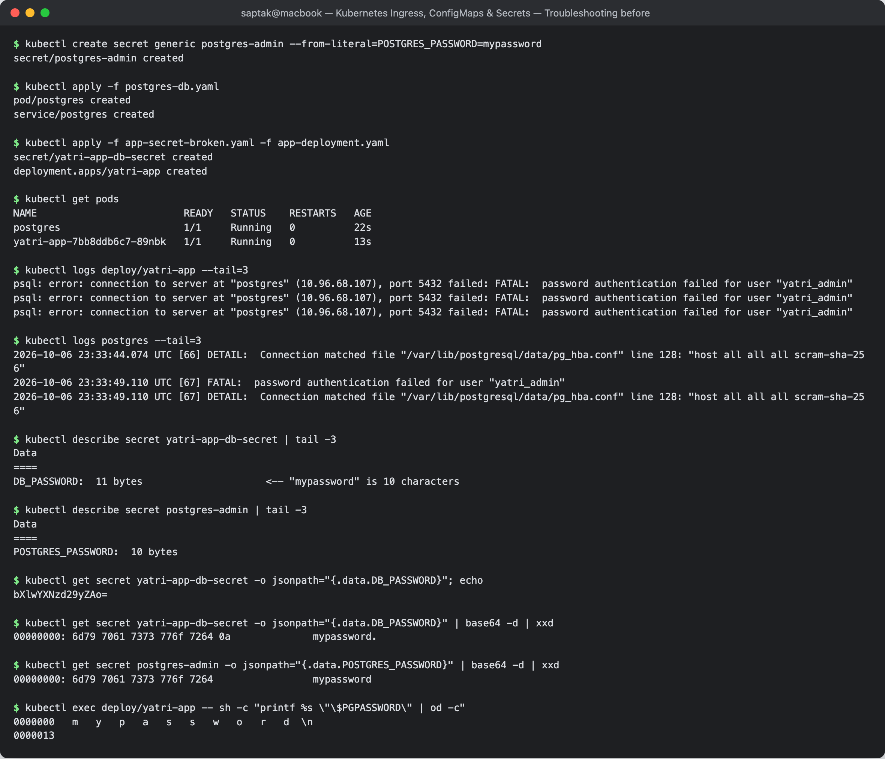
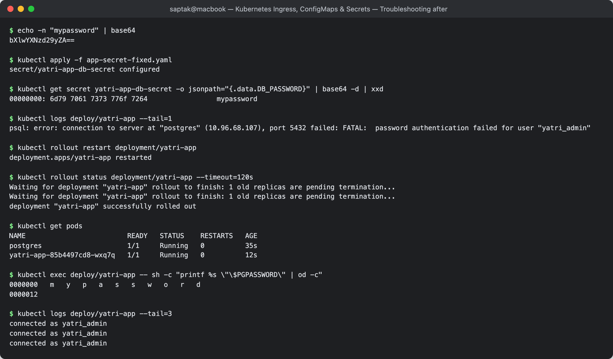

---

## Cleanup

```bash
kubectl delete -f 04-full-demo/ingress.yaml -f 04-full-demo/frontend.yaml -f 04-full-demo/backend.yaml
kubectl delete -f 03-ingress/ingress-tls.yaml
kubectl delete -f 05-volume-mount/config-volume-pod.yaml
kubectl delete -f 02-secret/db-secret.yaml -f 01-configmap/app-config.yaml
kubectl delete secret campus-tls-cert
minikube addons disable ingress

# Task 10 (run inside troubleshooting/)
kubectl delete -f app-deployment.yaml -f app-secret-fixed.yaml -f postgres-db.yaml
kubectl delete secret postgres-admin
# Tasks 9-10 used a throwaway kind cluster:
kind delete cluster --name audit
```

---

## Files added during this session

| File | Why |
| --- | --- |
| [`05-volume-mount/config-volume-pod.yaml`](./05-volume-mount/config-volume-pod.yaml) | the class resources only showed env-var injection; this mounts the same ConfigMap and Secret as volumes so the live-update and tmpfs behaviour can be demonstrated |
| [`troubleshooting/postgres-db.yaml`](./troubleshooting/postgres-db.yaml), [`app-secret-broken.yaml`](./troubleshooting/app-secret-broken.yaml), [`app-secret-fixed.yaml`](./troubleshooting/app-secret-fixed.yaml), [`app-deployment.yaml`](./troubleshooting/app-deployment.yaml) | Task 10: the class troubleshooting folder only had the written scenario; these reproduce it on a cluster |

---

## Reference notes in this folder

- [`lab.md`](./lab.md) — full lab write-up
- [`troubleshooting/secret-base64-gotcha.md`](./troubleshooting/secret-base64-gotcha.md) — the newline gotcha

## Resources

- https://kubernetes.io/docs/concepts/configuration/configmap/
- https://kubernetes.io/docs/concepts/configuration/secret/
- https://kubernetes.io/docs/concepts/services-networking/ingress/
- https://kubernetes.github.io/ingress-nginx/user-guide/nginx-configuration/annotations/
- https://cert-manager.io/docs/
