# Kubernetes Networking & Services

**Author:** Saptak Banerjee
**Course:** SST DevOps & Cloud [SWE]
**Session:** 11 — Services, CoreDNS & Cluster Networking
**Source material:** [`devops-heros/session-11-kubernetes-services`](../../devops-heros/session-11-kubernetes-services)

**Cluster:** 2-node minikube (`minikube` control-plane + `minikube-m02` worker), Kubernetes **v1.37.0**, containerd 2.3.4, macOS / Docker driver. Every output below is a real capture from this cluster.

> Companion reference notes in this folder: [`service.md`](./service.md) (the 5 service types) and [`fqdn.md`](./fqdn.md) (CoreDNS deep dive). This README is the **hands-on task log** with live outputs.

---

## Table of Contents

| # | Task |
| --- | --- |
| 1 | [Port architecture drill](#task-1-kubernetes-port-architecture--clarification-drill) |
| 2 | [ClusterIP](#task-2-type-1--clusterip-default-internal-networking) |
| 3 | [NodePort](#task-3-type-2--nodeport-host-level-external-ingress) |
| 4 | [LoadBalancer](#task-4-type-3--loadbalancer-cloud-native-ingress-simulation) |
| 5 | [ExternalName](#task-5-type-4--externalname-coredns-cname-alias) |
| 6 | [Headless service](#task-6-type-5--headless-service-clusterip-none) |
| 7 | [Services without selectors](#task-7-services-without-selectors-manual-endpoints) |
| 8 | [FQDN & CoreDNS deep dive](#task-8-fqdn--coredns-deep-dive) |
| 9 | [Pod identity: Deployment vs StatefulSet](#task-9-pod-identity--lifecycle-invariance-drill) |
| 10 | [Deployment vs StatefulSet vs DaemonSet matrix](#task-10-master-architectural-matrix) |
| 11 | [Cost optimisation & service selection tree](#task-11-production-cost-optimisation--service-selection-decision-tree) |
| 12 | [Minikube docker-driver gotcha](#task-12-minikube-docker-driver-port-binding--tunnel-gotcha) |
| 13 | [Kubernetes object comparison](#task-13-kubernetes-object-comparison) |

### Where each homework task is answered

| Homework task | Answered in |
| --- | --- |
| Task 1: all 5 Service types (YAML, deploy, verify, test, output) | Tasks 2–6 below (ClusterIP, NodePort, LoadBalancer, ExternalName, Headless), YAML in `01-clusterip/` … `05-headless/` |
| Task 2: Kubernetes object comparison | [Task 13](#task-13-kubernetes-object-comparison) (Deployment vs ReplicaSet, ReplicaSet vs Service) and [Task 10](#task-10-master-architectural-matrix) (Deployment vs DaemonSet vs StatefulSet) |
| Task 3: FQDN | [`fqdn/README.md`](./fqdn/README.md) |
| Task 4: CoreDNS | [`coredns/README.md`](./coredns/README.md) |

---

## Task 1: Kubernetes Port Architecture & Clarification Drill

**Packet path, external client → application process:**

```
Client Browser
      │  http://<NODE-IP>:30080
      ▼
 ┌─────────────────────────────────────────────────┐
 │ nodePort: 30080     opened on EVERY node        │
 │       │             (range 30000–32767)         │
 │       ▼                                          │
 │ port: 8080          the Service's own port on   │
 │       │             its ClusterIP (a virtual IP)│
 │       ▼                                          │
 │ targetPort: 80      the port ON THE POD that    │
 │       │             the Service forwards to     │
 │       ▼                                          │
 │ containerPort: 80   what the app actually binds │
 └─────────────────────────────────────────────────┘
```

**Verified against the real `01-clusterip` service, which deliberately uses `port: 8080` → `targetPort: 80` so the two cannot be confused:**

```
$ kubectl describe svc web-service-clusterip
Name:                     web-service-clusterip
Selector:                 app=web-clusterip
Type:                     ClusterIP
IP:                       10.102.247.85
Port:                     http  8080/TCP        <-- `port`        (clients dial this)
TargetPort:               80/TCP                <-- `targetPort`  (pod receives on this)
Endpoints:                10.244.0.26:80,10.244.1.61:80,10.244.1.60:80
```

And for a LoadBalancer, where all three exist at once:

```
$ kubectl get svc web-service-loadbalancer -o jsonpath='...'
type=LoadBalancer
clusterIP=10.109.138.241
nodePort=31608          <-- allocated automatically, even though the manifest never asked for one
port=80
targetPort=80
```

| Field | Defined in | Visible on | Default | Notes |
| --- | --- | --- | --- | --- |
| `containerPort` | Pod spec | inside the pod | — | **Informational only.** Omitting it does not block traffic; it exists for readability and named-port references. |
| `targetPort` | Service spec | pod | falls back to `port` | May be a number or the **name** of a containerPort (`targetPort: web`), which decouples the Service from port numbers. |
| `port` | Service spec | ClusterIP (cluster-internal) | required | What in-cluster clients dial: `http://web-service-clusterip:8080`. |
| `nodePort` | Service spec | every node's IP | auto-assigned | **30000–32767** only. Requires `type: NodePort` or `LoadBalancer`. |

```bash
kubectl explain pod.spec.containers.ports.containerPort
kubectl explain service.spec.ports
```

**Screenshot:** 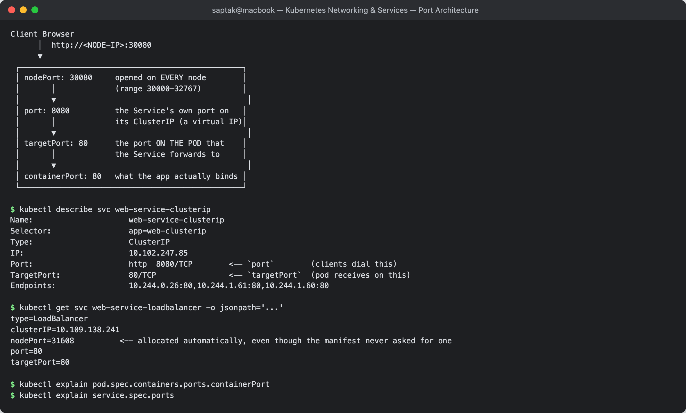

---

## Task 2: Type 1 — ClusterIP (Default Internal Networking)

**Directory:** [`01-clusterip/`](./01-clusterip/) — 3-replica nginx, Service on `8080 → 80`, plus a `curl-client` diagnostic pod.

### Deploy and inspect

```
$ kubectl apply -f 01-clusterip/app-deployment.yaml
deployment.apps/web-app-clusterip created
$ kubectl apply -f 01-clusterip/service.yaml
service/web-service-clusterip created
$ kubectl apply -f 01-clusterip/client-pod.yaml
pod/curl-client created

$ kubectl get pods -l app=web-clusterip -o wide
NAME                                 READY   STATUS    RESTARTS   AGE   IP            NODE           NOMINATED NODE   READINESS GATES
web-app-clusterip-66865d4855-5cj29   1/1     Running   0          1s    10.244.0.26   minikube       <none>           <none>
web-app-clusterip-66865d4855-h5fgm   1/1     Running   0          1s    10.244.1.60   minikube-m02   <none>           <none>
web-app-clusterip-66865d4855-l5hx5   1/1     Running   0          1s    10.244.1.61   minikube-m02   <none>           <none>

$ kubectl get svc web-service-clusterip
NAME                    TYPE        CLUSTER-IP      EXTERNAL-IP   PORT(S)    AGE
web-service-clusterip   ClusterIP   10.102.247.85   <none>        8080/TCP   1s

$ kubectl get endpoints web-service-clusterip
NAME                    ENDPOINTS                                      AGE
web-service-clusterip   10.244.0.26:80,10.244.1.60:80,10.244.1.61:80   1s

$ kubectl get endpointslices -l kubernetes.io/service-name=web-service-clusterip
NAME                          ADDRESSTYPE   PORTS   ENDPOINTS                             AGE
web-service-clusterip-4bq86   IPv4          80      10.244.0.26,10.244.1.61,10.244.1.60   1s
```

All 3 pod IPs are bound as endpoints automatically — the `endpoints-controller` watched for pods matching `app=web-clusterip` and populated the list. `EXTERNAL-IP` is `<none>`: a ClusterIP is **cluster-internal only**.

> **`Endpoints` vs `EndpointSlice`:** `kubectl get endpoints` now prints `Warning: v1 Endpoints is deprecated in v1.33+; use discovery.k8s.io/v1 EndpointSlice`. The legacy `Endpoints` object stuffs every backend into one object, which does not scale past a few thousand pods; EndpointSlices shard them (100 endpoints per slice by default). Both are shown above — they describe the same backends.

### Three ways to reach it from inside the cluster

```
--- 1. by short service name (same namespace) ---
$ kubectl exec curl-client -- curl -s http://web-service-clusterip:8080 | grep -i '<title>'
<title>Welcome to nginx!</title>

--- 2. by FQDN ---
$ kubectl exec curl-client -- curl -s http://web-service-clusterip.default.svc.cluster.local:8080
<title>Welcome to nginx!</title>

--- 3. by ClusterIP virtual IP ---
$ kubectl exec curl-client -- curl -s http://10.102.247.85:8080
<title>Welcome to nginx!</title>
```

### DNS resolution — and the search-domain walk

```
$ kubectl exec curl-client -- nslookup web-service-clusterip
Server:		10.96.0.10
Address:	10.96.0.10:53

** server can't find web-service-clusterip.cluster.local: NXDOMAIN

Name:	web-service-clusterip.default.svc.cluster.local
Address: 10.102.247.85

** server can't find web-service-clusterip.cluster.local: NXDOMAIN
** server can't find web-service-clusterip.svc.cluster.local: NXDOMAIN
** server can't find web-service-clusterip.svc.cluster.local: NXDOMAIN
```

The resolver tried `web-service-clusterip.cluster.local` and `.svc.cluster.local` (both NXDOMAIN) before landing on `.default.svc.cluster.local`. That wasted-query behaviour is quantified in Task 8.

### It is genuinely internal-only

```
$ curl --connect-timeout 5 http://10.102.247.85:8080      # from the macOS host
(curl exit code: 28)      # timed out — 10.96.0.0/12 has no route from outside the cluster
```

### Proving it load-balances

`remote_ip` is useless here — the kernel DNATs the packet, so curl always reports the VIP. Counting requests in each backend's access log is the honest check:

```
$ kubectl exec curl-client -- sh -c 'for i in $(seq 1 30); do curl -s -o /dev/null http://web-service-clusterip:8080; done'

$ for each pod: kubectl logs <pod> | grep -c 'GET /'
web-app-clusterip-66865d4855-5cj29  ->  17 requests
web-app-clusterip-66865d4855-h5fgm  ->  15 requests
web-app-clusterip-66865d4855-l5hx5  ->  21 requests
```

Roughly even across all three pods. kube-proxy in iptables mode picks a backend at **random per connection** — not round-robin — which is why the counts are close but not identical.

**Screenshots:**
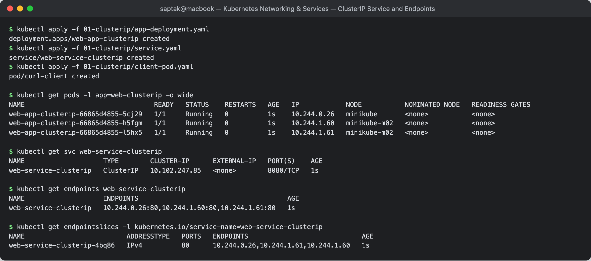
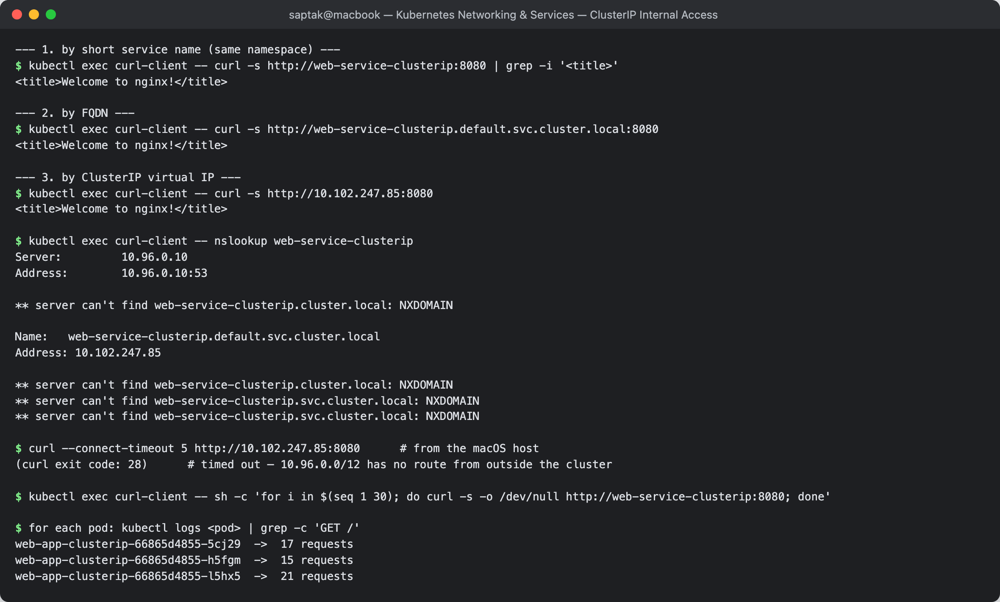

---

## Task 3: Type 2 — NodePort (Host-Level External Ingress)

**Directory:** [`02-nodeport/`](./02-nodeport/) — 2 replicas, `nodePort: 30080`.

```
$ kubectl get svc web-service-nodeport
NAME                   TYPE       CLUSTER-IP      EXTERNAL-IP   PORT(S)        AGE
web-service-nodeport   NodePort   10.106.253.88   <none>        80:30080/TCP   1s

$ kubectl get pods -l app=web-nodeport -o wide
NAME                              READY   STATUS    RESTARTS   AGE   IP            NODE           NOMINATED NODE   READINESS GATES
web-app-nodeport-6c8f48bd-fxvgb   1/1     Running   0          1s    10.244.1.63   minikube-m02   <none>           <none>
web-app-nodeport-6c8f48bd-qh5zh   1/1     Running   0          1s    10.244.0.27   minikube       <none>           <none>

$ kubectl get endpoints web-service-nodeport
NAME                   ENDPOINTS                       AGE
web-service-nodeport   10.244.0.27:80,10.244.1.63:80   1s
```

The `80:30080/TCP` notation reads as *`port`:`nodePort`*. A NodePort Service **is** a ClusterIP Service with an extra host-level door — note it still got `CLUSTER-IP 10.106.253.88`.

### The port is open on *every* node — verified from inside both nodes

```
$ minikube ssh -n minikube     -- curl -s -o /dev/null -w '%{http_code}' http://192.168.49.2:30080
200
$ minikube ssh -n minikube-m02 -- curl -s -o /dev/null -w '%{http_code}' http://192.168.49.3:30080
200

--- cross-node: hit m02's nodePort from the control-plane node ---
$ minikube ssh -n minikube -- curl -s -o /dev/null -w '%{http_code}' http://192.168.49.3:30080
200
```

This is the defining property: **every node listens on 30080 regardless of whether it runs a backing pod.** A request arriving at a node with no local pod is forwarded across the cluster network by kube-proxy. (That extra hop is what `externalTrafficPolicy: Local` avoids — at the cost of dropping traffic on nodes with no local pod, and it is also what preserves the client source IP.)

### From the macOS host — the Docker-driver gotcha

```
$ curl -I --connect-timeout 5 http://$(minikube ip):30080
curl: (28) Failed to connect to 192.168.49.2 port 30080 after 5006 ms: Timeout was reached
```

**Workaround:**

```
$ minikube service web-service-nodeport --url
http://127.0.0.1:50889
! Because you are using a Docker driver on darwin, the terminal needs to be open to run it.

$ curl -I http://127.0.0.1:50889
HTTP/1.1 200 OK
Server: nginx/1.25.5
Date: Sun, 20 Sep 2026 19:21:01 GMT
Content-Type: text/html
Content-Length: 615
Connection: keep-alive
Accept-Ranges: bytes
```

Full root-cause analysis in [Task 12](#task-12-minikube-docker-driver-port-binding--tunnel-gotcha).

**Why NodePort is rarely used directly in production:** the 30000–32767 range means ugly URLs; you need an external load balancer in front anyway to spread traffic across nodes; and one port is consumed cluster-wide per service. It is mostly a building block that `LoadBalancer` builds on.

**Screenshots:**
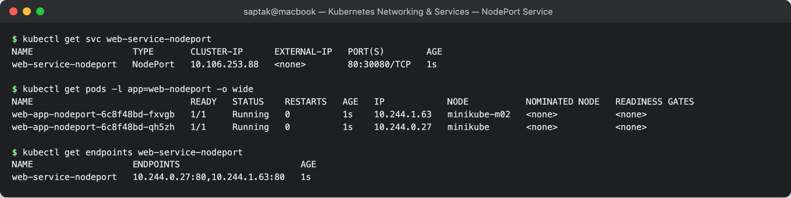
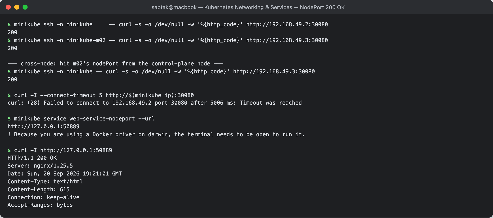

---

## Task 4: Type 3 — LoadBalancer (Cloud-Native Ingress Simulation)

**Directory:** [`03-loadbalancer/`](./03-loadbalancer/) — 3 replicas, `type: LoadBalancer`, port 80.

### Before the tunnel: `EXTERNAL-IP` is `<pending>`

```
$ kubectl get svc web-service-loadbalancer
NAME                       TYPE           CLUSTER-IP       EXTERNAL-IP   PORT(S)        AGE
web-service-loadbalancer   LoadBalancer   10.109.138.241   <pending>     80:31608/TCP   1s
```

`<pending>` is the **normal** state with no cloud controller present. On EKS/GKE/AKS the cloud-controller-manager would see this Service, call the cloud API to provision an actual ELB/NLB, and write the resulting IP or hostname back into `status.loadBalancer`. On bare metal you need MetalLB (or minikube's tunnel) to play that role — otherwise it stays `<pending>` forever.

### LoadBalancer is a superset: it *contains* a NodePort and a ClusterIP

```
$ kubectl describe svc web-service-loadbalancer
Type:                     LoadBalancer
IP:                       10.109.138.241                <-- ClusterIP layer
Port:                     http  80/TCP
TargetPort:               80/TCP
NodePort:                 http  31608/TCP               <-- NodePort layer, auto-allocated
Endpoints:                10.244.1.65:80,10.244.0.28:80,10.244.1.64:80
External Traffic Policy:  Cluster
```

```
type=LoadBalancer
clusterIP=10.109.138.241
nodePort=31608           <-- the manifest never requested a nodePort
port=80
targetPort=80
```

**The layering is the key insight:**

```
LoadBalancer  ⊃  NodePort  ⊃  ClusterIP
     │              │             │
cloud LB IP    node:31608    10.109.138.241:80
     └──────────────┴─────────────┴──► pods 10.244.x.x:80
```

The cloud load balancer's backend pool is literally *"every node, on port 31608"*. That is why `type: LoadBalancer` cannot exist without a NodePort underneath.

### With `minikube tunnel`

```
$ minikube tunnel
* Tunnel successfully started
* NOTE: Please do not close this terminal as this process must stay alive for the tunnel to be accessible ...
! The service/ingress web-service-loadbalancer requires privileged ports to be exposed: [80]
* sudo permission will be asked for it.
* Starting tunnel for service web-service-loadbalancer.
```

```
$ kubectl get svc web-service-loadbalancer        # AFTER starting the tunnel
NAME                       TYPE           CLUSTER-IP       EXTERNAL-IP   PORT(S)        AGE
web-service-loadbalancer   LoadBalancer   10.109.138.241   127.0.0.1     80:31608/TCP   49s

$ kubectl get svc web-service-loadbalancer -o jsonpath='{.status.loadBalancer.ingress[0].ip}'
127.0.0.1
```

**`<pending>` → `127.0.0.1`.** minikube's tunnel acts as the missing cloud-controller-manager and writes an external IP into the Service status.

> **Honest note on this run:** the tunnel assigned the external IP, but the actual traffic forwarder for **privileged port 80** needs `sudo`, and this session had no interactive terminal to enter a password — so `curl http://127.0.0.1:80` did not complete. The IP assignment above is real; to finish the traffic test, run `minikube tunnel` in your own terminal, enter your password when prompted, leave it running, and then `curl http://127.0.0.1`.

The same Service was verified end-to-end through its auto-allocated NodePort, which needs no privileges:

```
$ minikube service web-service-loadbalancer --url
http://127.0.0.1:53646
$ curl -s http://127.0.0.1:53646 | grep -i '<title>'
<title>Welcome to nginx!</title>
```

**Cost reality:** each `type: LoadBalancer` provisions a **billable** cloud load balancer (~$18–25/month on AWS/GCP before data charges). Ten microservices each with their own LoadBalancer is ~$200+/month for what one Ingress could do. See [Task 11](#task-11-production-cost-optimisation--service-selection-decision-tree).

**Screenshots:**
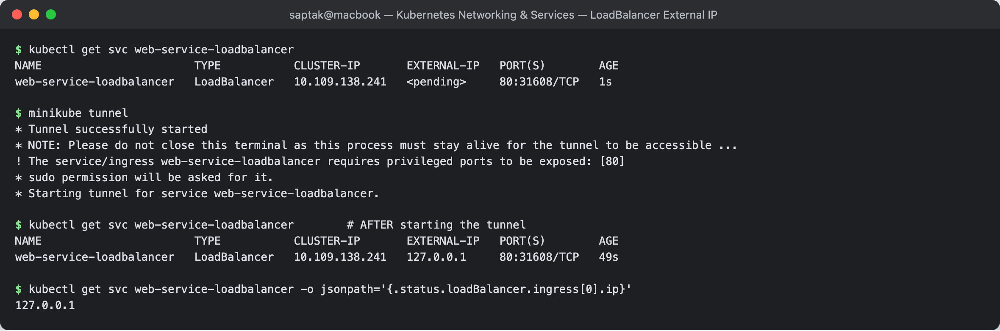
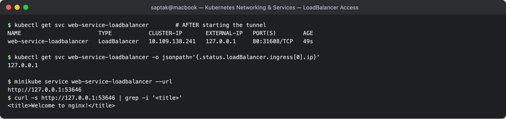

---

## Task 5: Type 4 — ExternalName (CoreDNS CNAME Alias)

**Directory:** [`04-externalname/`](./04-externalname/)

```
$ kubectl apply -f 04-externalname/service.yaml
service/external-database-service created

$ kubectl get svc external-database-service
NAME                        TYPE           CLUSTER-IP   EXTERNAL-IP        PORT(S)   AGE
external-database-service   ExternalName   <none>       nencyravaliya.me   <none>    0s

$ kubectl describe svc external-database-service
Name:              external-database-service
Selector:          <none>              <-- no selector
Type:              ExternalName
IP:                                    <-- no ClusterIP
IPs:               <none>
External Name:     nencyravaliya.me
Session Affinity:  None

$ kubectl get endpoints external-database-service
Error from server (NotFound): endpoints "external-database-service" not found      <-- no endpoints, ever
```

**No ClusterIP, no selector, no endpoints, no ports.** An ExternalName Service is *purely* a CoreDNS record — no kube-proxy rules are programmed and no packet ever passes through Kubernetes.

### Proving the CNAME

```
$ kubectl exec dns-test-client -- nslookup external-database-service
Server:		10.96.0.10
Address:	10.96.0.10:53

** server can't find external-database-service.cluster.local: NXDOMAIN
** server can't find external-database-service.svc.cluster.local: NXDOMAIN

external-database-service.default.svc.cluster.local	canonical name = nencyravaliya.me
```

CoreDNS returns a **CNAME**, exactly as specified.

### Two real gotchas found while testing

**Gotcha 1 — the alias is only as good as its target.**

```
$ kubectl exec dns-test-client -- curl -s -o /dev/null -w '%{http_code} -> %{remote_ip}\n' http://external-database-service
000 ->
command terminated with exit code 6        # 6 = couldn't resolve host
```

The CNAME resolved fine, but `nencyravaliya.me` has no A record, so the chain dead-ends. Kubernetes reports no error for this — `kubectl get svc` looks perfectly healthy. **An ExternalName Service is never "broken" from the cluster's point of view; only the client fails.**

**Gotcha 2 — TLS certificates do not follow the alias.** A second ExternalName ([`04-externalname/service-github.yaml`](./04-externalname/service-github.yaml)) pointing at a domain that *does* resolve:

```
$ kubectl get svc github-api-service
NAME                 TYPE           CLUSTER-IP   EXTERNAL-IP      PORT(S)   AGE
github-api-service   ExternalName   <none>       api.github.com   <none>    0s

$ kubectl exec dns-test-client -- nslookup github-api-service
github-api-service.default.svc.cluster.local	canonical name = api.github.com
Name:	api.github.com
Address: 20.207.73.85                       <-- full chain: alias -> CNAME -> A record

$ kubectl exec dns-test-client -- curl -s -o /dev/null -w '%{http_code} from %{remote_ip}\n' https://github-api-service
000 from 20.207.73.85
command terminated with exit code 60        # 60 = SSL certificate problem

$ kubectl exec dns-test-client -- curl -s -o /dev/null -w '%{http_code} from %{remote_ip}\n' https://api.github.com
200 from 20.207.73.85                       <-- same IP, works fine
```

Read those two results together: **the TCP connection reached the right server** (`remote_ip 20.207.73.85` in both cases), but over HTTPS the client sent SNI/`Host: github-api-service`, which is not on GitHub's certificate — so TLS verification failed. The identical request to the real hostname returns `200` from the same IP.

**The rule:** ExternalName works transparently for plain TCP and HTTP, but for **HTTPS you must either keep using the real hostname or override SNI/Host**. This trips up teams aliasing managed databases and third-party APIs.

**When to use it:** give an external dependency a stable in-cluster name so application config never changes when you migrate it. `db-service` can point to `prod-db.xyz.rds.amazonaws.com` today and to a real in-cluster StatefulSet tomorrow — the app keeps calling `db-service`.

**Screenshot:** 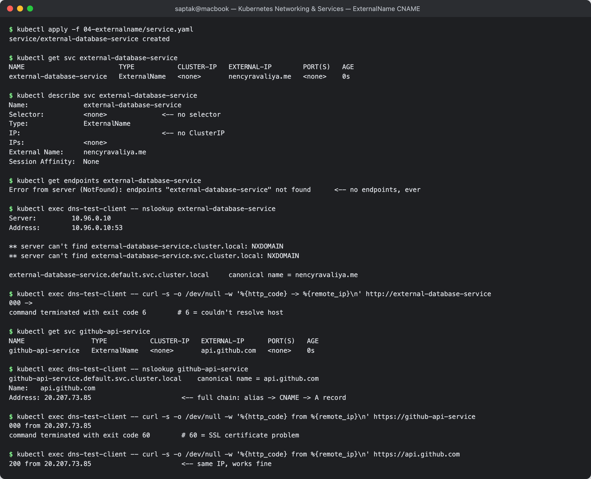

---

## Task 6: Type 5 — Headless Service (`clusterIP: None`)

**Directory:** [`05-headless/`](./05-headless/) — a 3-replica StatefulSet behind a headless Service.

```
$ kubectl apply -f 05-headless/service.yaml
service/web-service-headless created
$ kubectl apply -f 05-headless/app-statefulset.yaml
statefulset.apps/web-stateful created

$ kubectl rollout status statefulset/web-stateful
Waiting for 3 pods to be ready...
Waiting for 2 pods to be ready...
Waiting for 1 pods to be ready...
partitioned roll out complete: 3 new pods have been updated...

$ kubectl get svc web-service-headless
NAME                   TYPE        CLUSTER-IP   EXTERNAL-IP   PORT(S)   AGE
web-service-headless   ClusterIP   None         <none>        80/TCP    2s

$ kubectl get pods -l app=web-headless -o wide
NAME             READY   STATUS    RESTARTS   AGE   IP            NODE           NOMINATED NODE   READINESS GATES
web-stateful-0   1/1     Running   0          2s    10.244.1.67   minikube-m02   <none>           <none>
web-stateful-1   1/1     Running   0          1s    10.244.0.29   minikube       <none>           <none>
web-stateful-2   1/1     Running   0          1s    10.244.1.69   minikube-m02   <none>           <none>
```

`CLUSTER-IP: None` is the defining marker.

### DNS returns *all* pod IPs, not one VIP

```
$ kubectl exec headless-dns-client -- nslookup web-service-headless
Server:		10.96.0.10
Address:	10.96.0.10:53

Name:	web-service-headless.default.svc.cluster.local
Address: 10.244.1.67
Name:	web-service-headless.default.svc.cluster.local
Address: 10.244.0.29
Name:	web-service-headless.default.svc.cluster.local
Address: 10.244.1.69
```

**Three A records for one name.** Compare with the ClusterIP service in Task 2, which returned a single `10.102.247.85`. With no VIP there are no kube-proxy DNAT rules — the client receives every pod IP and decides for itself which to use.

### Per-pod stable DNS names

```
$ kubectl exec headless-dns-client -- nslookup web-stateful-0.web-service-headless.default.svc.cluster.local
Name:	web-stateful-0.web-service-headless.default.svc.cluster.local
Address: 10.244.1.67

$ kubectl exec headless-dns-client -- nslookup web-stateful-1.web-service-headless.default.svc.cluster.local
Name:	web-stateful-1.web-service-headless.default.svc.cluster.local
Address: 10.244.0.29

$ kubectl exec headless-dns-client -- nslookup web-stateful-2.web-service-headless.default.svc.cluster.local
Name:	web-stateful-2.web-service-headless.default.svc.cluster.local
Address: 10.244.1.69
```

### Addressing one specific ordinal

```
curl http://web-stateful-0.web-service-headless -> 200 from 10.244.1.67
curl http://web-stateful-1.web-service-headless -> 200 from 10.244.0.29
curl http://web-stateful-2.web-service-headless -> 200 from 10.244.1.69
```

Each name deterministically hits **one specific pod**. That is impossible with a normal ClusterIP Service, and it is exactly what a database cluster needs: "always write to `mysql-0`, read from `mysql-1` and `mysql-2`."

> **Note:** the short form `web-stateful-0.web-service-headless` returned `NXDOMAIN` under `nslookup` but worked fine over HTTP. `nslookup` on this Alpine/musl image queries the name as given, while curl's resolver walks the `search` list and finds `…default.svc.cluster.local`. When debugging DNS, **always test with the FQDN** before concluding a record does not exist.

**Why StatefulSets require this:** with a VIP you could not address an individual replica, and every pod would be interchangeable — the opposite of what stateful systems need for leader election, replication topology and sharding.

**Screenshot:** 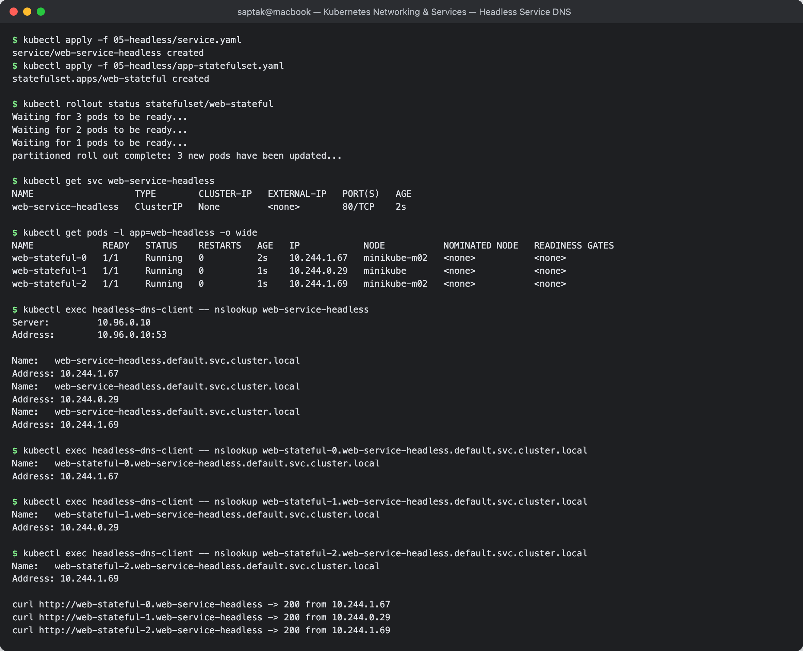

---

## Task 7: Services Without Selectors (Manual Endpoints)

**Directory:** [`06-no-selector/`](./06-no-selector/) — created for this task; the class resources did not include manifests for it.

| File | Purpose |
| --- | --- |
| [`service-no-selector.yaml`](./06-no-selector/service-no-selector.yaml) | ClusterIP Service with **no `selector:` block** |
| [`endpoints-manual.yaml`](./06-no-selector/endpoints-manual.yaml) | hand-written `v1/Endpoints` (name must match the Service exactly) |
| [`endpointslice-manual.yaml`](./06-no-selector/endpointslice-manual.yaml) | the modern `discovery.k8s.io/v1` equivalent |

### Step 1 — Service with no selector: created, but a black hole

```
$ kubectl apply -f 06-no-selector/service-no-selector.yaml
service/legacy-backend-service created

$ kubectl get svc legacy-backend-service
NAME                     TYPE        CLUSTER-IP    EXTERNAL-IP   PORT(S)    AGE
legacy-backend-service   ClusterIP   10.97.1.185   <none>        8080/TCP   0s

$ kubectl get endpoints legacy-backend-service
Error from server (NotFound): endpoints "legacy-backend-service" not found

$ kubectl exec headless-dns-client -- curl -s -o /dev/null --connect-timeout 5 http://legacy-backend-service:8080
command terminated with exit code 7        # 7 = failed to connect
```

The Service has a ClusterIP and resolves in DNS, but there is nothing behind it. **No selector means the endpoints-controller ignores this Service entirely** — populating it is your job.

### Step 2 — Supply the endpoints by hand

```
$ kubectl apply -f 06-no-selector/endpoints-manual.yaml
Warning: v1 Endpoints is deprecated in v1.33+; use discovery.k8s.io/v1 EndpointSlice
endpoints/legacy-backend-service created

$ kubectl get endpoints legacy-backend-service
NAME                     ENDPOINTS                       AGE
legacy-backend-service   10.244.1.67:80,10.244.1.69:80   4s

$ kubectl describe svc legacy-backend-service
Name:                     legacy-backend-service
Selector:                 <none>                        <-- still no selector
Type:                     ClusterIP
IP:                       10.97.1.185
Port:                     http  8080/TCP
TargetPort:               80/TCP
Endpoints:                10.244.1.67:80,10.244.1.69:80  <-- manually supplied
```

```
$ 6 requests to http://legacy-backend-service:8080
200 -> 10.97.1.185
200 -> 10.97.1.185
200 -> 10.97.1.185
200 -> 10.97.1.185
200 -> 10.97.1.185
200 -> 10.97.1.185
```

### Step 3 — Proving it routed only to the listed addresses

```
--- per-backend access-log counts ---
web-stateful-0 (10.244.1.67) -> 4 requests
web-stateful-1 (10.244.0.32) -> 0 requests    <-- NOT in the manual Endpoints list
web-stateful-2 (10.244.1.69) -> 4 requests
```

`web-stateful-1` is healthy, in the same namespace, carrying the same labels — and received **zero** traffic, because its IP was never listed. Routing follows the Endpoints object alone.

**The binding rule:** a manual `Endpoints` object is linked to its Service **only by having the identical `metadata.name`**. Misspell it and you get a silent black hole. (EndpointSlices instead use the `kubernetes.io/service-name` label.)

**Why this pattern matters:** it lets an external system — a managed RDS instance, a legacy VM, an on-prem API — appear as a normal in-cluster Service name. Application code calls `legacy-backend-service:8080` and never learns whether the backend is inside the cluster. When you eventually migrate that dependency into Kubernetes, you add a selector and delete the manual Endpoints; **no application config changes.**

**The cost:** nothing health-checks manual endpoints. If the external IP dies, Kubernetes keeps sending traffic to it forever — you own the liveness of that list.

### Troubleshooting drill — the empty-endpoints black hole

[`troubleshooting/empty-endpoints.yaml`](./troubleshooting/empty-endpoints.yaml) has a selector that matches nothing:

```
$ kubectl apply -f troubleshooting/empty-endpoints.yaml
service/broken-backend-service created

$ kubectl get svc broken-backend-service
NAME                     TYPE        CLUSTER-IP     EXTERNAL-IP   PORT(S)   AGE
broken-backend-service   ClusterIP   10.97.166.10   <none>        80/TCP    3s      <-- looks perfectly healthy!

$ kubectl get endpoints broken-backend-service
NAME                     ENDPOINTS   AGE
broken-backend-service   <none>      3s                                             <-- the actual symptom

$ kubectl describe svc broken-backend-service | grep -E "Selector|Endpoints"
Selector:                 app=wrong-backend-name
Endpoints:

$ kubectl exec headless-dns-client -- curl -s --connect-timeout 5 http://broken-backend-service
command terminated with exit code 7
```

**The fix — compare the selector against the pods' real labels:**

```
$ kubectl get pods -l app=yatri-backend --show-labels
NAME                            READY   STATUS    RESTARTS   AGE    LABELS
yatri-backend-dc5888c55-7pc97   1/1     Running   0          102s   app=yatri-backend,pod-template-hash=dc5888c55,tier=api

$ kubectl patch svc broken-backend-service -p '{"spec":{"selector":{"app":"yatri-backend"}}}'
service/broken-backend-service patched

$ kubectl get endpoints broken-backend-service
NAME                     ENDPOINTS                                            AGE
broken-backend-service   10.244.0.31:5000,10.244.1.70:5000,10.244.1.71:5000   6s

$ kubectl exec headless-dns-client -- curl -s http://broken-backend-service
Backend v1.0.0 listening on port 5000
```

> **The single most useful Service debugging command is `kubectl get endpoints <svc>`.** `kubectl get svc` shows a green-looking ClusterIP whether or not anything is behind it. Empty endpoints means one of: selector typo, pods not `Ready` (a failing readiness probe removes them), wrong namespace, or a `targetPort` mismatch.

**Screenshot:** 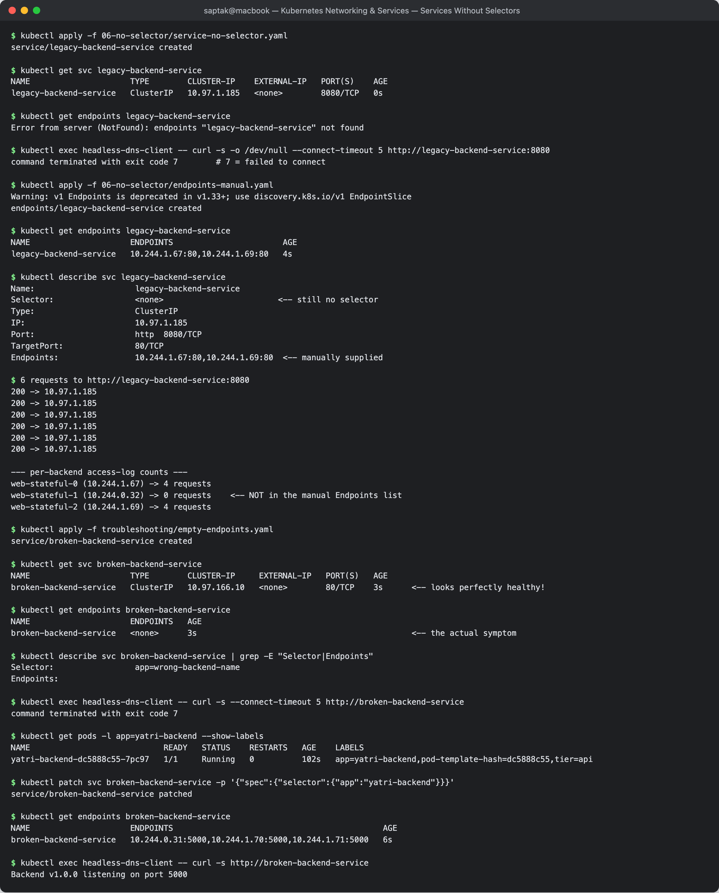

---

## Task 8: FQDN & CoreDNS Deep Dive

### 8.1 — Anatomy of a Kubernetes FQDN

```
web-service-clusterip  .  default  .  svc  .  cluster.local
        │                    │         │           │
   service name          namespace    type    cluster domain
```

| Form | Resolves from | Example |
| --- | --- | --- |
| `web-service-clusterip` | same namespace only | short name |
| `web-service-clusterip.default` | any namespace | + namespace |
| `web-service-clusterip.default.svc` | any namespace | + type |
| `web-service-clusterip.default.svc.cluster.local` | anywhere — **fully qualified** | complete |

Verified cross-namespace:

```
$ kubectl exec headless-dns-client -- nslookup kube-dns.kube-system.svc.cluster.local
Name:	kube-dns.kube-system.svc.cluster.local
Address: 10.96.0.10

$ kubectl exec headless-dns-client -- nslookup kube-dns            # from the default namespace
** server can't find kube-dns.cluster.local: NXDOMAIN
** server can't find kube-dns.default.svc.cluster.local: NXDOMAIN
```

The short name fails from another namespace — the search list only contains `default.svc.cluster.local`, not `kube-system.svc.cluster.local`.

### 8.2 — Inside the pod: `/etc/resolv.conf`

```
$ kubectl exec curl-client -- cat /etc/resolv.conf
search default.svc.cluster.local svc.cluster.local cluster.local
nameserver 10.96.0.10
options ndots:5
```

```
$ kubectl get svc kube-dns -n kube-system
NAME       TYPE        CLUSTER-IP   EXTERNAL-IP   PORT(S)                  AGE
kube-dns   ClusterIP   10.96.0.10   <none>        53/UDP,53/TCP,9153/TCP   46m

$ kubectl get pods -n kube-system -l k8s-app=kube-dns
NAME                       READY   STATUS    RESTARTS      AGE
coredns-559f6c778d-6jwzc   1/1     Running   1 (43m ago)   46m
```

| Line | Meaning |
| --- | --- |
| `nameserver 10.96.0.10` | the `kube-dns` Service ClusterIP — injected into every pod by the kubelet |
| `search …` | suffixes appended to *relative* names, tried **in order** |
| `options ndots:5` | a name with **fewer than 5 dots** is treated as relative and gets the search suffixes appended first |

### 8.3 — The `ndots:5` cost, measured

`web-service-headless` has **0 dots**, well under 5, so it is treated as relative. The search walk is visible:

```
$ kubectl exec headless-dns-client -- nslookup web-service-headless
** server can't find web-service-headless.cluster.local: NXDOMAIN        <-- wasted
** server can't find web-service-headless.svc.cluster.local: NXDOMAIN    <-- wasted
** server can't find web-service-headless.svc.cluster.local: NXDOMAIN    <-- wasted
Name:	web-service-headless.default.svc.cluster.local                    <-- finally
Address: 10.244.1.67
```

**Quantified using CoreDNS's own metrics endpoint** (`kube-dns:9153`), sampling `coredns_dns_requests_total` before and after 20 lookups each way:

```
$ 20 lookups of short 'web-service-headless'                              -> 120 queries
$ 20 lookups of 'web-service-headless.default.svc.cluster.local.'         ->  40 queries
```

**120 vs 40 — a 3× amplification.** Twenty application-level lookups became one hundred and twenty DNS queries because each one walked the search list first. The trailing dot makes the name absolute, skipping the walk entirely.

**Why this matters at scale:** a service doing 1,000 req/s with a short hostname and no client-side DNS cache generates ~6,000 DNS queries/s at CoreDNS. This is the classic cause of "our cluster got slow and CoreDNS is pegged". The standard mitigations:

1. **Use FQDNs with a trailing dot** for hot paths: `http://backend.default.svc.cluster.local./api`.
2. **Lower `ndots`** per pod:
   ```yaml
   spec:
     dnsConfig:
       options:
         - name: ndots
           value: "2"
   ```
3. **Deploy NodeLocal DNSCache** — a per-node DNS cache DaemonSet that absorbs the repeats.
4. **Cache in the application** / reuse connections so lookups are amortised.

> **An honest caveat from this lab:** the effect depends on the libc. The Alpine/musl-based `curlimages/curl` pod showed the search walk for cluster-internal names, but resolved *external* names like `api.github.com` in 2 queries rather than 8 — musl does not implement `ndots` the way glibc does. On Debian/Ubuntu (glibc) images the external-name penalty is larger. Test with an image matching your production base.

### 8.4 — How a DNS query flows

```
Pod (curl backend)
  │ 1. read /etc/resolv.conf -> nameserver 10.96.0.10
  ▼
kube-proxy iptables DNAT on the node
  │ 2. 10.96.0.10:53 -> a real CoreDNS pod IP
  ▼
CoreDNS pod
  │ 3. name ends in cluster.local?
  │      yes -> answer from the cluster's Service/Endpoint records
  │      no  -> forward upstream (the node's /etc/resolv.conf)
  ▼
Answer: A record (ClusterIP), several A records (headless), or a CNAME (ExternalName)
```

Note the recursion in step 2: CoreDNS is itself reached through a ClusterIP Service, so DNS depends on kube-proxy working. That is why `kube-dns`'s ClusterIP (`10.96.0.10`) is pinned and well-known rather than randomly allocated.

**Screenshot:** 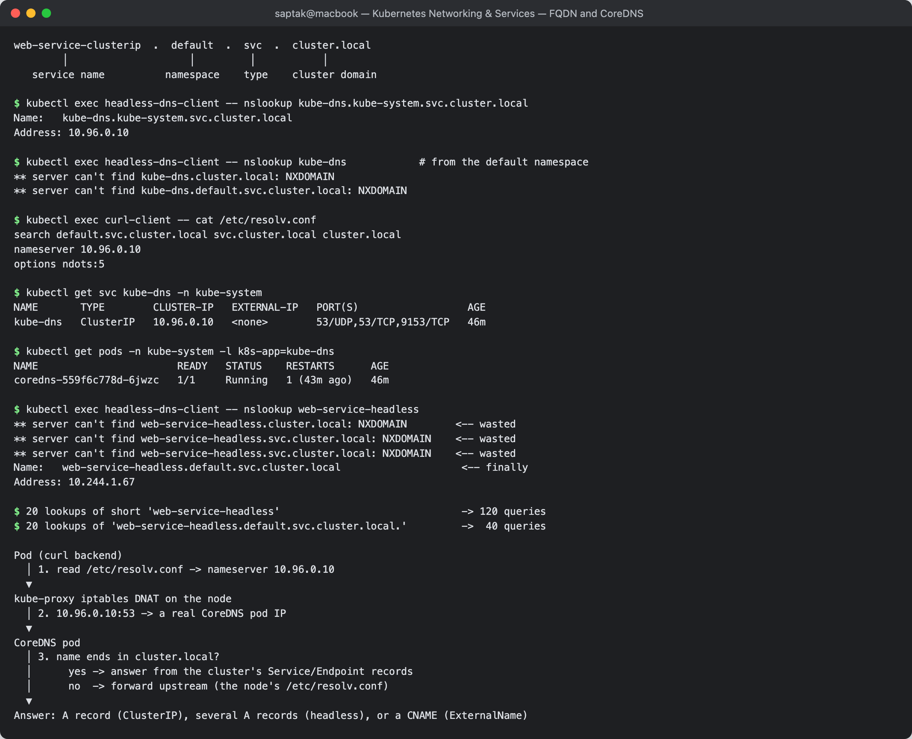

---

## Task 9: Pod Identity & Lifecycle Invariance Drill

A Deployment and a StatefulSet, side by side, with a pod killed in each.

### Before — two naming schemes

```
$ kubectl get pods -l app=yatri-backend        # Deployment: <deploy>-<template-hash>-<random>
NAME                            READY   STATUS    RESTARTS   AGE
yatri-backend-dc5888c55-2v8zg   1/1     Running   0          1s
yatri-backend-dc5888c55-7pc97   1/1     Running   0          1s
yatri-backend-dc5888c55-9fmdb   1/1     Running   0          1s

$ kubectl get pods -l app=web-headless -o wide  # StatefulSet: <sts>-<ordinal>
NAME             READY   STATUS    RESTARTS   AGE   IP            NODE           NOMINATED NODE   READINESS GATES
web-stateful-0   1/1     Running   0          64s   10.244.1.67   minikube-m02   <none>           <none>
web-stateful-1   1/1     Running   0          63s   10.244.0.29   minikube       <none>           <none>
web-stateful-2   1/1     Running   0          63s   10.244.1.69   minikube-m02   <none>           <none>
```

### Kill test A — Deployment pod gets a brand-new identity

```
$ kubectl delete pod yatri-backend-dc5888c55-2v8zg
pod "yatri-backend-dc5888c55-2v8zg" deleted from default namespace

$ kubectl get pods -l app=yatri-backend
NAME                            READY   STATUS    RESTARTS   AGE
yatri-backend-dc5888c55-7pc97   1/1     Running   0          39s
yatri-backend-dc5888c55-9fmdb   1/1     Running   0          39s
yatri-backend-dc5888c55-tgl9r   1/1     Running   0          38s     <-- NEW random suffix
```

`2v8zg` is gone forever; `tgl9r` took its place. The `dc5888c55` part is stable because it is the **template hash** (the version), not an identity. Nothing about the old pod survived.

### Kill test B — StatefulSet pod keeps its name

```
$ kubectl get pod web-stateful-1 -o wide          # before
NAME             READY   STATUS    RESTARTS   AGE    IP            NODE       NOMINATED NODE   READINESS GATES
web-stateful-1   1/1     Running   0          101s   10.244.0.29   minikube   <none>           <none>

$ kubectl delete pod web-stateful-1
pod "web-stateful-1" deleted from default namespace

$ kubectl get pod web-stateful-1 -o wide          # after
NAME             READY   STATUS    RESTARTS   AGE   IP            NODE       NOMINATED NODE   READINESS GATES
web-stateful-1   1/1     Running   0          1s    10.244.0.32   minikube   <none>           <none>
```

**Same name `web-stateful-1`. Different IP (`10.244.0.29` → `10.244.0.32`).**

And DNS followed it automatically:

```
$ kubectl exec headless-dns-client -- nslookup web-stateful-1.web-service-headless.default.svc.cluster.local
Name:	web-stateful-1.web-service-headless.default.svc.cluster.local
Address: 10.244.0.32       <-- updated to the new IP
```

**The precise lesson: the *name* is the stable identity, the IP never is.** This is why database replication configs, ZooKeeper `myid`, Kafka `broker.id` and JDBC connection strings reference `mysql-0.mysql`, never an IP. In a Deployment there is no such handle at all.

| | Deployment | StatefulSet |
| --- | --- | --- |
| Name pattern | `app-dc5888c55-2v8zg` | `web-stateful-1` |
| After deletion | **new** random name | **same** name |
| IP after recreation | new | new (DNS follows) |
| Creation order | all in parallel | strictly `0 → 1 → 2` |
| Deletion order | arbitrary | reverse: `2 → 1 → 0` |
| Storage | shared / none | one PVC per pod, re-attached |
| Needs a headless Service? | no | yes, for per-pod DNS |

**Screenshot:** 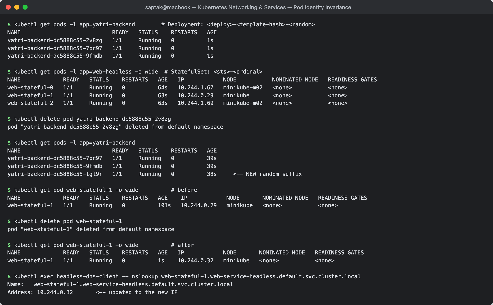

---

## Task 10: Master Architectural Matrix

### Deployment vs StatefulSet vs DaemonSet

| Dimension | **Deployment** | **StatefulSet** | **DaemonSet** |
| --- | --- | --- | --- |
| Purpose | stateless, interchangeable replicas | stateful, individually-identified replicas | one agent per node |
| Pod name | `app-<hash>-<random>` | `app-0`, `app-1`, `app-2` | `app-<random>` |
| Identity after restart | **new** | **same ordinal** | new (irrelevant — tied to a node) |
| `replicas` field | yes | yes | **no** — derived from node count |
| Startup order | parallel | sequential `0 → N` | parallel, one per node |
| Shutdown order | arbitrary | reverse `N → 0` | on node removal |
| Scaling | `kubectl scale` | `kubectl scale` (still ordered) | add/remove **nodes** |
| Storage | shared PVC or none | `volumeClaimTemplates` → one PVC each, re-attached by ordinal | usually `hostPath` |
| Typical Service | ClusterIP / LoadBalancer | **Headless** (`clusterIP: None`) | often none, or headless for scraping |
| Per-pod DNS | no | `pod-0.svc.ns.svc.cluster.local` | no |
| Update strategy | `RollingUpdate` / `Recreate` | `RollingUpdate` (reverse ordinal) / `OnDelete` | `RollingUpdate` / `OnDelete` |
| Rollback | `kubectl rollout undo` | `kubectl rollout undo` (ordered) | `kubectl rollout undo` |
| Real examples | web frontends, REST APIs, workers | MySQL, PostgreSQL, Kafka, ZooKeeper, Elasticsearch, etcd | `kube-proxy`, CNI, Fluent Bit, node-exporter, Falco, CSI node plugins |
| Evidence from these sessions | S10 T8 rolling update; S11 T9 kill test A | S10 T6 ordinal/PVC; S11 T6 headless DNS, T9 kill test B | S10 T7: `DESIRED 2` = 2 nodes, one pod each |

### Choosing a controller

```
Does every node need its own copy of this pod?
├── YES -> DaemonSet          (log shipper, metrics agent, CNI, CSI driver)
└── NO
    └── Does each replica need a stable identity and/or its own persistent disk?
        ├── YES -> StatefulSet  (database, message broker, consensus store)
        └── NO
            └── Is it a run-to-completion task?
                ├── YES -> Job / CronJob
                └── NO  -> Deployment   (the default, ~90% of workloads)
```

### Choosing a Service type

| Requirement | Service type | Why |
| --- | --- | --- |
| Internal pod-to-pod only | **ClusterIP** | the default; no external exposure |
| Quick external access in dev/on-prem | **NodePort** | opens 30000–32767 on every node |
| Single production entry point, cloud | **LoadBalancer** | provisions a real cloud LB — **billable per service** |
| Many HTTP services behind one IP | **Ingress** (+ ClusterIP backends) | L7 host/path routing; one LB for all |
| Alias an external dependency | **ExternalName** | CNAME only; no proxying |
| Address individual pods (StatefulSet) | **Headless** (`clusterIP: None`) | DNS returns all pod IPs; per-pod names |
| Point at an IP outside the cluster | ClusterIP **without selector** + manual Endpoints | you own the endpoint list |

---

## Task 11: Production Cost Optimisation & Service Selection Decision Tree

### The anti-pattern: one LoadBalancer per microservice

```
                 ┌── LB #1  ($18–25/mo) ──► auth-service      (ClusterIP work only)
                 ├── LB #2  ($18–25/mo) ──► payments-service
Internet ────────├── LB #3  ($18–25/mo) ──► orders-service
                 ├── LB #4  ($18–25/mo) ──► search-service
                 └── LB #5  ($18–25/mo) ──► notifications-service

5 services  ->  5 cloud load balancers  ->  ~$90–125 / month, before data-transfer charges
20 services ->  ~$360–500 / month
```

Each `type: LoadBalancer` triggers the cloud-controller-manager to provision a **real, billable** ELB/NLB/Cloud Load Balancer. It is one line of YAML and a recurring bill. Beyond cost: a per-service public IP is a larger attack surface, each LB needs its own TLS certificate, and cloud accounts have LB quotas.

### The production pattern: one Ingress in front of ClusterIP services

```
                            ┌──────────────────────────────┐
Internet ──► ONE cloud LB ──►│  Ingress Controller          │
             ($18–25/mo)     │  (nginx / Traefik / ALB)     │
                            └──────────┬───────────────────┘
                                       │ L7 routing by host & path
        ┌──────────────┬───────────────┼───────────────┬──────────────┐
        ▼              ▼               ▼               ▼              ▼
  /auth   ──►    /payments ──►    /orders ──►     /search ──►   /notify ──►
  ClusterIP      ClusterIP        ClusterIP       ClusterIP     ClusterIP
  (free)         (free)           (free)          (free)        (free)

20 services  ->  1 cloud load balancer  ->  ~$18–25 / month
```

| | 20 × LoadBalancer | 1 × Ingress |
| --- | --- | --- |
| Cloud LBs | 20 | **1** |
| Monthly cost | ~$360–500 | **~$18–25** |
| TLS certificates | 20 to manage | 1 (or cert-manager for all) |
| Public IPs / attack surface | 20 | **1** |
| L7 routing (host, path, header) | no (L4 only) | **yes** |
| Adding service #21 | new LB, new bill | one Ingress rule, **$0** |

**A ~95% cost reduction** at 20 services, and the marginal cost of each new service drops to zero. This is why `type: LoadBalancer` should be rare — typically one, in front of the ingress controller — and Session 12 covers Ingress itself.

**When a dedicated LoadBalancer is still correct:** non-HTTP protocols (raw TCP/UDP, gRPC streaming, MQTT, game servers) that an HTTP Ingress cannot route; workloads needing a dedicated static IP for third-party allow-listing; and strict tenant isolation requirements.

### Full decision tree

```
Does anything outside the cluster need to reach this?
│
├── NO ──────────────────────────────────► ClusterIP            (default, free)
│
└── YES
    │
    ├── Is it HTTP/HTTPS?
    │   │
    │   ├── YES ──► Ingress + ClusterIP backends                 (ONE shared cloud LB)
    │   │           └── need host/path routing, TLS termination,
    │   │               cert-manager, rate limiting -> yes, this
    │   │
    │   └── NO (raw TCP/UDP, gRPC stream, MQTT, game server)
    │           │
    │           ├── cloud cluster ──► LoadBalancer               (billable, justified here)
    │           └── on-prem/dev   ──► NodePort (+ MetalLB for a real IP)
    │
    └── Special cases
        ├── alias an external host          ──► ExternalName
        ├── address individual pods          ──► Headless (clusterIP: None)
        └── external IP as an in-cluster name ──► ClusterIP, no selector + manual Endpoints
```

---

## Task 12: Minikube Docker-Driver Port Binding & Tunnel Gotcha

### The symptom

```
$ minikube ip
192.168.49.2

$ curl -I --connect-timeout 5 http://192.168.49.2:30080
curl: (28) Failed to connect to 192.168.49.2 port 30080 after 5006 ms: Timeout was reached
```

Yet from inside the cluster the very same NodePort answers immediately:

```
$ minikube ssh -n minikube     -- curl -s -o /dev/null -w '%{http_code}' http://192.168.49.2:30080
200
$ minikube ssh -n minikube-m02 -- curl -s -o /dev/null -w '%{http_code}' http://192.168.49.3:30080
200
```

**The Service is fine.** The problem is host-to-node routing.

### Root cause

With the Docker driver every Kubernetes node is a **Docker container**, and `192.168.49.0/24` is Docker's internal bridge network.

- **On Linux**, that bridge is a real interface in the host's own network namespace, so the host can route to it — `curl $(minikube ip):30080` works.
- **On macOS and Windows**, Docker Desktop runs the entire engine inside a hidden Linux VM. The bridge exists **inside that VM**; the Mac has no route to `192.168.49.0/24` at all.

```
macOS host                                     Docker Desktop Linux VM
┌────────────────────┐                        ┌─────────────────────────────────┐
│ curl 192.168.49.2:30080                     │ bridge 192.168.49.0/24          │
│      │                                      │  ┌───────────────────────────┐  │
│      └──X  no route (timeout, exit 28) ───► │  │ minikube    192.168.49.2  │  │
│                                             │  │  :30080 LISTENING         │  │
│ curl 127.0.0.1:50889 ──► port-forward ────► │  │ minikube-m02 192.168.49.3 │  │
│                                             │  └───────────────────────────┘  │
└────────────────────┘                        └─────────────────────────────────┘
```

**Why a timeout (exit 28) and not connection-refused (exit 7):** a refusal requires a host that actively rejects the connection. Here the packet has nowhere to go at all, so it is dropped silently and curl waits out its timeout. *Timeout = unreachable network; refused = reachable host, closed port.* That distinction alone tells you which layer to debug.

### Workaround 1 — `minikube service <svc> --url`

```
$ minikube service web-service-nodeport --url
http://127.0.0.1:50889
! Because you are using a Docker driver on darwin, the terminal needs to be open to run it.

$ curl -I http://127.0.0.1:50889
HTTP/1.1 200 OK
Server: nginx/1.25.5
Content-Length: 615
```

minikube opens a port-forward from a **random** local port into the node's NodePort. Two things to internalise: the local port (`50889`) is **not** the nodePort (`30080`) and changes on every invocation, so never hard-code it; and **the process must keep running** — close the terminal and the tunnel dies.

### Workaround 2 — `minikube tunnel` (for `type: LoadBalancer`)

```
$ minikube tunnel
* Tunnel successfully started
* NOTE: Please do not close this terminal as this process must stay alive for the tunnel to be accessible ...
! The service/ingress web-service-loadbalancer requires privileged ports to be exposed: [80]
* sudo permission will be asked for it.
* Starting tunnel for service web-service-loadbalancer.

$ kubectl get svc web-service-loadbalancer
NAME                       TYPE           CLUSTER-IP       EXTERNAL-IP   PORT(S)        AGE
web-service-loadbalancer   LoadBalancer   10.109.138.241   127.0.0.1     80:31608/TCP   49s
```

`EXTERNAL-IP` moves from `<pending>` to `127.0.0.1`. Requires `sudo` for ports below 1024, and must stay running.

### Comparison

| Approach | Linux | macOS / Windows (Docker driver) | Needs sudo | Notes |
| --- | --- | --- | --- | --- |
| `curl $(minikube ip):30080` | ✅ | ❌ **timeout** | no | bridge unreachable from host |
| `minikube service <svc> --url` | ✅ | ✅ | no | random local port; terminal must stay open |
| `minikube tunnel` | ✅ | ✅ | **yes** (ports < 1024) | for `type: LoadBalancer` |
| `kubectl port-forward svc/<svc> 8080:80` | ✅ | ✅ | no | driver-independent; bypasses the Service VIP entirely |

### Debug checklist when a Service "does not work"

1. `kubectl get endpoints <svc>` — **empty means the problem is inside the cluster** (selector typo, pods not Ready, wrong namespace). Fix that first.
2. Endpoints populated? Then test from inside: `kubectl exec <pod> -- curl http://<svc>:<port>`.
3. Works internally but not from your laptop? It is host-to-node routing — use `minikube service --url` or `kubectl port-forward`.
4. `curl` exit code: **28** = unreachable network; **7** = reachable host, nothing listening; **6** = DNS failure; **60** = TLS/certificate mismatch (see Task 5).

**Screenshot:** 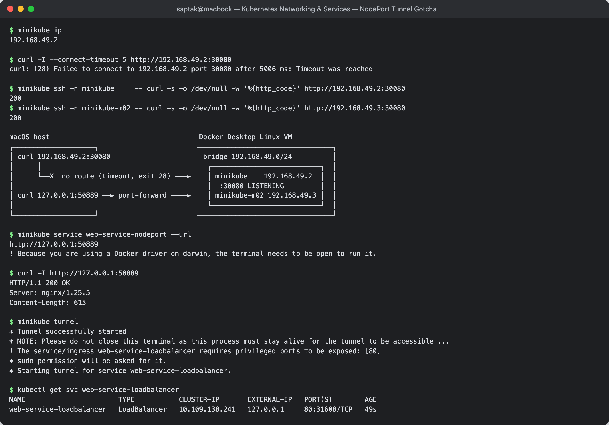

---

## Task 13: Kubernetes Object Comparison

**Directory:** [`comparison/`](./comparison/). It holds a Deployment and a bare ReplicaSet with the same nginx template, so the two can be compared directly. Commands are run from inside that folder.

> **Environment for this task:** captured on a single-node **kind** cluster (Kubernetes v1.37.0), not the minikube cluster above. Pod names and IPs therefore differ from Tasks 1–12.

### 13.1 — Deployment vs ReplicaSet

```
$ kubectl apply -f web-deploy.yaml -f web-rs.yaml
deployment.apps/web-deploy created
replicaset.apps/web-rs created

$ kubectl get deploy,rs,pods -l "app in (web-deploy,web-rs)"
NAME                                   DESIRED   CURRENT   READY   AGE
replicaset.apps/web-deploy-b68785c99   2         2         2       21s

NAME                             READY   STATUS    RESTARTS   AGE
pod/web-deploy-b68785c99-v5q28   1/1     Running   0          21s
pod/web-deploy-b68785c99-vsjq5   1/1     Running   0          21s
pod/web-rs-4qfxl                 1/1     Running   0          21s
pod/web-rs-7d8wq                 1/1     Running   0          21s
```

The label query matched the **ReplicaSet that the Deployment created** (`web-deploy-b68785c99`), because it copies the pod template's labels. It did not match the Deployment or the hand-written `web-rs` object, since neither has labels of its own. The ownership chain shows the relationship directly:

```
$ kubectl get rs -l app=web-deploy -o jsonpath="{.items[0].metadata.ownerReferences[0].kind}/{.items[0].metadata.ownerReferences[0].name}{\"\n\"}"
Deployment/web-deploy

$ kubectl get pods -l app=web-deploy -o jsonpath="{range .items[*]}{.metadata.name} -> {.metadata.ownerReferences[0].kind}/{.metadata.ownerReferences[0].name}{\"\n\"}{end}"
web-deploy-b68785c99-v5q28 -> ReplicaSet/web-deploy-b68785c99
web-deploy-b68785c99-vsjq5 -> ReplicaSet/web-deploy-b68785c99

$ kubectl get pods -l app=web-rs -o jsonpath="{range .items[*]}{.metadata.name} -> {.metadata.ownerReferences[0].kind}/{.metadata.ownerReferences[0].name}{\"\n\"}{end}"
web-rs-4qfxl -> ReplicaSet/web-rs
web-rs-7d8wq -> ReplicaSet/web-rs
```

**Deployment → ReplicaSet → Pod.** A Deployment never owns pods directly.

**Now change the image on both:**

```
$ kubectl set image deployment/web-deploy nginx=nginx:1.28-alpine
deployment.apps/web-deploy image updated
$ kubectl set image replicaset/web-rs nginx=nginx:1.28-alpine
replicaset.apps/web-rs image updated

$ kubectl rollout status deploy/web-deploy --timeout=120s
...
deployment "web-deploy" successfully rolled out

$ kubectl get rs -l "app in (web-deploy,web-rs)" -o wide
NAME                   DESIRED   CURRENT   READY   AGE   CONTAINERS   IMAGES              SELECTOR
web-deploy-8c865877b   2         2         2       14s   nginx        nginx:1.28-alpine   app=web-deploy,pod-template-hash=8c865877b
web-deploy-b68785c99   0         0         0       35s   nginx        nginx:1.27-alpine   app=web-deploy,pod-template-hash=b68785c99

$ kubectl get pods -l "app in (web-deploy,web-rs)" -o custom-columns=POD:.metadata.name,IMAGE:.spec.containers[0].image
POD                          IMAGE
web-deploy-8c865877b-dgftq   nginx:1.28-alpine
web-deploy-8c865877b-lspq6   nginx:1.28-alpine
web-rs-4qfxl                 nginx:1.27-alpine        <-- template changed, running pods did not
web-rs-7d8wq                 nginx:1.27-alpine

$ kubectl rollout status rs/web-rs
error: no status viewer has been implemented for ReplicaSet.apps
```

The Deployment created a **new** ReplicaSet (`8c865877b`), scaled it up, scaled the old one down to 0, and kept the old one for rollback. The bare ReplicaSet accepted the new template but **did not touch its running pods**. It only compares pod *count*, not pod *spec*. The new image appears only when a pod is replaced:

```
$ kubectl delete pod $(kubectl get pods -l app=web-rs -o jsonpath="{.items[0].metadata.name}")
pod "web-rs-4qfxl" deleted from default namespace

$ kubectl get pods -l app=web-rs -o custom-columns=POD:.metadata.name,IMAGE:.spec.containers[0].image
POD            IMAGE
web-rs-7d8wq   nginx:1.27-alpine
web-rs-c9cdg   nginx:1.28-alpine         <-- two versions running at once, nothing coordinating it
```

**Scaling and rollback:**

```
$ kubectl scale deployment/web-deploy --replicas=4
deployment.apps/web-deploy scaled

$ kubectl get deploy web-deploy; kubectl get rs -l app=web-deploy
NAME         READY   UP-TO-DATE   AVAILABLE   AGE
web-deploy   4/4     4            4           46s
NAME                   DESIRED   CURRENT   READY   AGE
web-deploy-8c865877b   4         4         4       25s
web-deploy-b68785c99   0         0         0       46s

$ kubectl rollout history deployment/web-deploy
deployment.apps/web-deploy
REVISION  CHANGE-CAUSE
1         <none>
2         <none>

$ kubectl rollout undo deployment/web-deploy
deployment.apps/web-deploy rolled back

$ kubectl get rs -l app=web-deploy -o wide
NAME                   DESIRED   CURRENT   READY   AGE   CONTAINERS   IMAGES              SELECTOR
web-deploy-8c865877b   0         0         0       26s   nginx        nginx:1.28-alpine   app=web-deploy,pod-template-hash=8c865877b
web-deploy-b68785c99   4         4         4       47s   nginx        nginx:1.27-alpine   app=web-deploy,pod-template-hash=b68785c99
```

Rollback just scaled the old ReplicaSet back up. Revision history **is** the list of old ReplicaSets.

| | **Deployment** | **ReplicaSet** |
| --- | --- | --- |
| Purpose | declarative updates for stateless apps | keep N identical pods running |
| Pod management | indirect, through ReplicaSets it creates and names `<deploy>-<template-hash>` | direct, owns the pods (`ownerReferences`) |
| Scaling | `kubectl scale deploy`; passes the count to the current RS | `kubectl scale rs`; creates/deletes pods to match |
| Rolling updates | **yes**: new RS up, old RS down, `maxSurge`/`maxUnavailable`, `rollout status/history/undo` | **no**: template change affects only future pods; `rollout` is not supported |
| Rollback | `kubectl rollout undo` (scales an old RS back up) | none |
| When to use | almost always | almost never directly; let a Deployment manage it |

**Relationship:** a Deployment is a controller *of ReplicaSets*. It keeps one ReplicaSet per pod-template version (the `pod-template-hash` label), and the ReplicaSet does the actual work of keeping the pod count right. Rolling updates in Session 10 Task 8 are this same mechanism.

### 13.2 — Deployment vs DaemonSet vs StatefulSet

The full matrix is in [Task 10](#task-10-master-architectural-matrix), backed by the kill tests in Task 9. Summary of the six dimensions the homework asks for:

| | Deployment | DaemonSet | StatefulSet |
| --- | --- | --- | --- |
| **Use cases** | stateless web/API servers, workers | one agent per node: log shippers, metrics exporters, CNI, kube-proxy | databases, brokers, consensus stores |
| **Pod creation** | all at once, random names (`yatri-backend-dc5888c55-2v8zg`) | exactly one per (matching) node, no `replicas` field | one at a time in order `0 → 1 → 2`, stable names (`web-stateful-0`) |
| **Scaling** | change `replicas` | add or remove nodes (or change the node selector) | change `replicas`; scale-down removes the highest ordinal first |
| **Networking** | one ClusterIP Service in front; pods are interchangeable | often no Service, or `hostNetwork`/`hostPort` to reach the node agent; scraped per node | needs a **headless** Service; each pod gets its own DNS name `web-stateful-0.web-service-headless...` (Task 6) |
| **Storage** | shared PVC or none; pods hold no identity on disk | usually `hostPath`, the node's own disk | `volumeClaimTemplates`: one PVC per pod, re-attached to the same ordinal after a restart |
| **Examples** | nginx frontend, `yatri-backend` | `kube-proxy`, `kindnet`, Fluent Bit, node-exporter | MySQL, PostgreSQL, Kafka, etcd |

### 13.3 — ReplicaSet vs Service

`web-rs` (2 pods) and a client pod (`kubectl run client --image=curlimages/curl:8.11.1 --command -- sleep 3600`):

```
$ kubectl get pods -l app=web-rs -o wide
NAME           READY   STATUS    RESTARTS   AGE   IP            NODE                  NOMINATED NODE   READINESS GATES
web-rs-7d8wq   1/1     Running   0          66s   10.244.0.25   audit-control-plane   <none>           <none>
web-rs-c9cdg   1/1     Running   0          30s   10.244.0.28   audit-control-plane   <none>           <none>

$ kubectl exec client -- curl -s --max-time 5 http://web-rs; echo "curl exit code: $?"
command terminated with exit code 6
curl exit code: 6                        <-- a ReplicaSet gives you pods, not a name or an address
```

```
$ kubectl expose replicaset web-rs --name=web-rs-svc --port=80 --target-port=80
service/web-rs-svc exposed

$ kubectl get svc web-rs-svc
NAME         TYPE        CLUSTER-IP     EXTERNAL-IP   PORT(S)   AGE
web-rs-svc   ClusterIP   10.96.68.154   <none>        80/TCP    3s

$ kubectl get endpointslices -l kubernetes.io/service-name=web-rs-svc
NAME               ADDRESSTYPE   PORTS   ENDPOINTS                 AGE
web-rs-svc-lljdf   IPv4          80      10.244.0.25,10.244.0.28   3s

$ kubectl exec client -- curl -s -o /dev/null -w "%{http_code} via %{remote_ip}\n" http://web-rs-svc
200 via 10.96.68.154
```

**Kill a pod.** The ReplicaSet replaces it with a new IP, and the Service follows without any change:

```
$ kubectl delete pod $(kubectl get pods -l app=web-rs -o jsonpath="{.items[0].metadata.name}")
pod "web-rs-7d8wq" deleted from default namespace

$ kubectl get pods -l app=web-rs -o wide
NAME           READY   STATUS    RESTARTS   AGE   IP            NODE                  NOMINATED NODE   READINESS GATES
web-rs-c9cdg   1/1     Running   0          40s   10.244.0.28   audit-control-plane   <none>           <none>
web-rs-ptbn6   1/1     Running   0          6s    10.244.0.36   audit-control-plane   <none>           <none>

$ kubectl get endpointslices -l kubernetes.io/service-name=web-rs-svc
NAME               ADDRESSTYPE   PORTS   ENDPOINTS                 AGE
web-rs-svc-lljdf   IPv4          80      10.244.0.28,10.244.0.36   9s

$ kubectl exec client -- curl -s -o /dev/null -w "%{http_code} via %{remote_ip}\n" http://web-rs-svc
200 via 10.96.68.154                     <-- same address the whole time
```

| | **ReplicaSet** | **Service** |
| --- | --- | --- |
| Responsibility | **how many** pods exist: create and replace pods to match `replicas` | **how to reach** them: a stable virtual IP + DNS name in front of matching pods |
| Layer | workload / compute | networking |
| Knows about | its own pods (owner references) | any ready pods whose labels match its selector, from any controller |
| On pod death | creates a new pod (new name, **new IP**) | drops the old IP from its EndpointSlice and adds the new one |
| Load balancing | none | yes, kube-proxy spreads connections across endpoints (Task 2 per-pod counts) |

**Why a Service is required:** pod IPs are temporary (`10.244.0.25` is gone, `10.244.0.36` replaced it), there is no name for a set of pods, and nothing spreads traffic across replicas. Without a Service every client would have to watch the API for pod IPs itself.

**How traffic reaches the pods:**

```
client pod: curl http://web-rs-svc
  │ 1. CoreDNS: web-rs-svc.default.svc.cluster.local -> 10.96.68.154 (ClusterIP)
  ▼
node kernel: kube-proxy iptables rules for 10.96.68.154:80
  │ 2. DNAT to one ready endpoint, picked at random per connection
  ▼
10.244.0.28:80 or 10.244.0.36:80        <-- from the EndpointSlice, kept current by the
                                            EndpointSlice controller as the ReplicaSet replaces pods
```

They connect only through **labels**. The ReplicaSet stamps `app=web-rs` on the pods it creates, and the Service selects `app=web-rs`. Neither object refers to the other.

**Screenshots:**
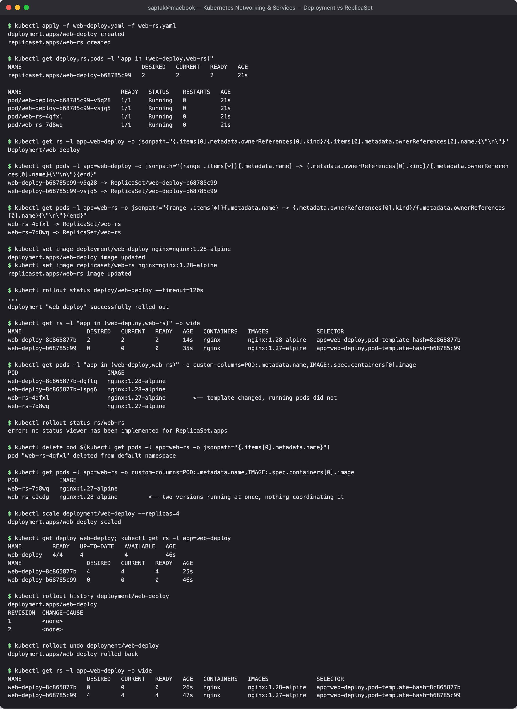
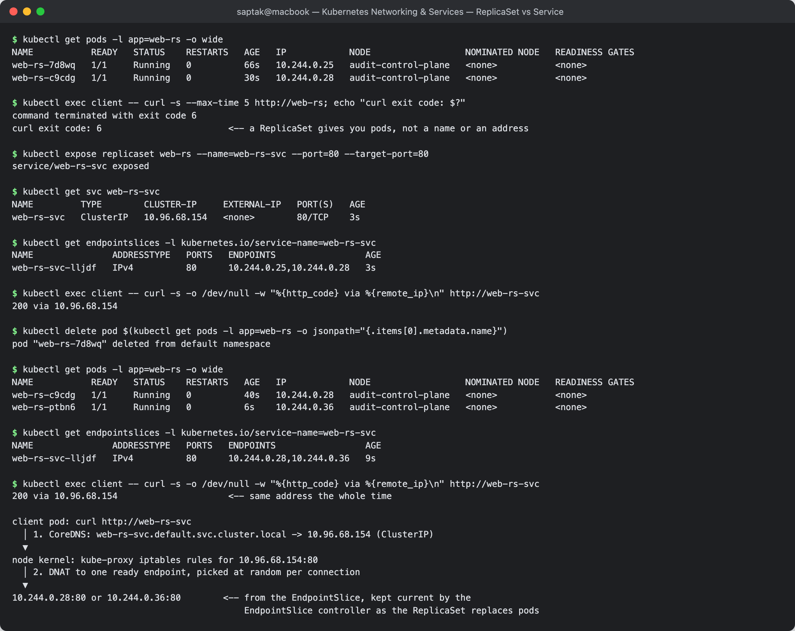

---

## Cleanup

```bash
kubectl delete -f 01-clusterip/ -f 02-nodeport/ -f 03-loadbalancer/ -f 04-externalname/ -f 05-headless/ -f 06-no-selector/
kubectl delete -f troubleshooting/empty-endpoints.yaml
kubectl delete -f deployment/backend-deployment.yaml
kubectl delete -f comparison/ && kubectl delete svc web-rs-svc && kubectl delete pod client     # Task 13
```

---

## Files added during this session

| File | Why |
| --- | --- |
| [`06-no-selector/service-no-selector.yaml`](./06-no-selector/service-no-selector.yaml) | Task 7 had no manifests in the class resources |
| [`06-no-selector/endpoints-manual.yaml`](./06-no-selector/endpoints-manual.yaml) | hand-written `v1/Endpoints` |
| [`06-no-selector/endpointslice-manual.yaml`](./06-no-selector/endpointslice-manual.yaml) | modern `EndpointSlice` equivalent |
| [`04-externalname/service-github.yaml`](./04-externalname/service-github.yaml) | the provided ExternalName targets a domain with no A record; this one resolves, so the full CNAME → A → TCP path is demonstrable |
| [`comparison/web-deploy.yaml`](./comparison/web-deploy.yaml), [`comparison/web-rs.yaml`](./comparison/web-rs.yaml) | Task 13: same template as a Deployment and as a bare ReplicaSet |
| [`fqdn/README.md`](./fqdn/README.md) | homework Task 3 deliverable |
| [`coredns/README.md`](./coredns/README.md) | homework Task 4 deliverable |

---

## Reference notes in this folder

- [`service.md`](./service.md) — the 5 service types, kube-proxy internals, interview Q&A
- [`fqdn.md`](./fqdn.md) — CoreDNS and FQDN deep dive
- [`fqdn/README.md`](./fqdn/README.md) — FQDN write-up (homework Task 3)
- [`coredns/README.md`](./coredns/README.md) — CoreDNS write-up (homework Task 4)

## Resources

- https://kubernetes.io/docs/concepts/services-networking/service/
- https://kubernetes.io/docs/concepts/services-networking/dns-pod-service/
- https://kubernetes.io/docs/concepts/services-networking/endpoint-slices/
- https://minikube.sigs.k8s.io/docs/handbook/accessing/
