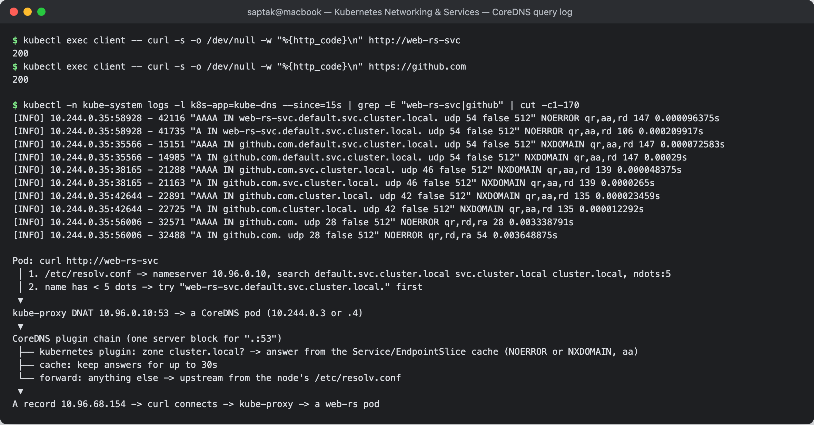
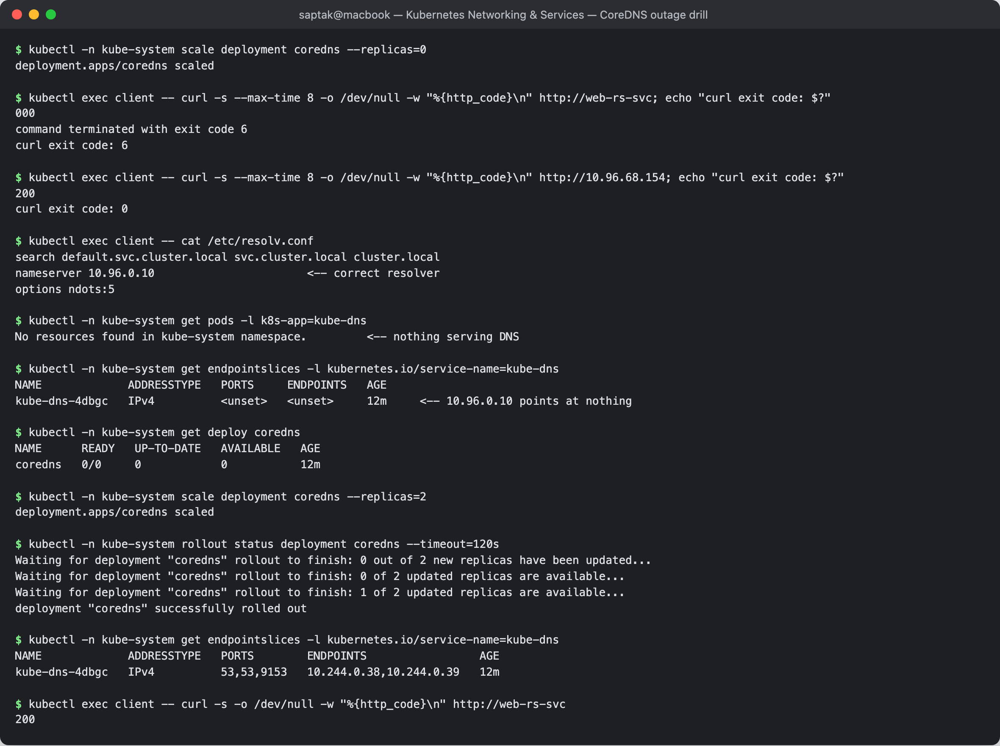

# CoreDNS in Kubernetes

**Author:** Saptak Banerjee
**Course:** SST DevOps & Cloud [SWE]
**Session:** 11 — Kubernetes Networking & Services (Task 4: CoreDNS)
**Source material:** [`devops-heros/session-11-kubernetes-services`](https://github.com/Nency-Ravaliya/devops-heros/tree/main/session-11-kubernetes-services)

**Environment:** outputs marked *(kind)* were captured for this page on a single-node kind cluster (Kubernetes v1.37.0, CoreDNS v1.14.6). Outputs marked *(S11 cluster)* are from the 2-node minikube cluster in the [main README](../README.md). Every output is a real capture. Changing the Corefile and scaling CoreDNS to zero were done only on the throwaway kind cluster.

---

## Table of Contents

1. [What is CoreDNS?](#1-what-is-coredns)
2. [Why Kubernetes uses CoreDNS](#2-why-kubernetes-uses-coredns)
3. [How Service discovery works](#3-how-service-discovery-works)
4. [How DNS queries are resolved](#4-how-dns-queries-are-resolved)
5. [CoreDNS configuration (the Corefile)](#5-coredns-configuration-the-corefile)
6. [How to troubleshoot DNS issues](#6-how-to-troubleshoot-dns-issues)

---

## 1. What is CoreDNS?

CoreDNS is a DNS server written in Go and built from **plugins**: each line of its config file enables one plugin (cache, forward, kubernetes, log, and so on). It is a CNCF graduated project and has been the default cluster DNS since Kubernetes 1.13, replacing `kube-dns`.

In a cluster it is an ordinary Deployment in `kube-system`, behind a Service that still carries the old name `kube-dns` *(kind)*:

```
$ kubectl -n kube-system get deploy coredns
NAME      READY   UP-TO-DATE   AVAILABLE   AGE
coredns   2/2     2            2           10m

$ kubectl -n kube-system get pods -l k8s-app=kube-dns -o wide
NAME                       READY   STATUS    RESTARTS   AGE   IP           NODE                  NOMINATED NODE   READINESS GATES
coredns-559f6c778d-kqv7h   1/1     Running   0          10m   10.244.0.4   audit-control-plane   <none>           <none>
coredns-559f6c778d-kxrgj   1/1     Running   0          10m   10.244.0.3   audit-control-plane   <none>           <none>

$ kubectl -n kube-system get svc kube-dns
NAME       TYPE        CLUSTER-IP   EXTERNAL-IP   PORT(S)                  AGE
kube-dns   ClusterIP   10.96.0.10   <none>        53/UDP,53/TCP,9153/TCP   10m

$ kubectl -n kube-system get endpointslices -l kubernetes.io/service-name=kube-dns
NAME             ADDRESSTYPE   PORTS        ENDPOINTS               AGE
kube-dns-4dbgc   IPv4          53,53,9153   10.244.0.3,10.244.0.4   10m

$ kubectl -n kube-system get pod -l k8s-app=kube-dns -o jsonpath="{.items[0].spec.containers[0].image}{\"\n\"}"
registry.k8s.io/coredns/coredns:v1.14.6
```

Port 53 (UDP and TCP) is DNS. Port 9153 is the Prometheus metrics endpoint, the same one used in main README Task 8.3 to count queries (120 vs 40).

---

## 2. Why Kubernetes uses CoreDNS

- **Pod and Service IPs keep changing.** Pods are recreated with new IPs, and Services come and go. Apps need a stable name to call, and that name has to update automatically.
- **It reads the API server directly.** The `kubernetes` plugin watches Services and EndpointSlices, so records appear and disappear within seconds, with no zone files to edit.
- **It is one process with a plugin chain.** The old `kube-dns` ran three containers (kubedns, dnsmasq, sidecar). CoreDNS replaced them with one binary that is easier to run and to configure.
- **It forwards everything else.** Names outside `cluster.local` are sent upstream, so the same server handles `github.com`.
- **It exposes metrics and health endpoints.** Plugins like `prometheus`, `health` and `ready` let you monitor it like any other workload.

---

## 3. How Service discovery works

1. You create a Service. The API server stores it and allocates a ClusterIP.
2. The EndpointSlice controller lists the IPs of ready pods that match the selector.
3. CoreDNS's `kubernetes` plugin is watching both. It now answers `<svc>.<ns>.svc.cluster.local`.
4. The kubelet wrote `nameserver 10.96.0.10` into every pod's `/etc/resolv.conf`, so every pod asks CoreDNS by default.

From the pod's point of view, the Service can be found by name the moment it exists *(kind; `web-rs` is the bare ReplicaSet from main README Task 13)*:

```
$ kubectl expose replicaset web-rs --name=web-rs-svc --port=80 --target-port=80
service/web-rs-svc exposed

$ kubectl exec client -- nslookup web-rs-svc.default.svc.cluster.local
Server:		10.96.0.10
Address:	10.96.0.10:53

Name:	web-rs-svc.default.svc.cluster.local
Address: 10.96.68.154
```

The kind of answer depends on the Service type: one ClusterIP, every pod IP for a headless Service, or a CNAME for ExternalName. All three are shown in the main README (Tasks 2, 6 and 5).

---

## 4. How DNS queries are resolved

To see each query as CoreDNS receives it, the `log` plugin was added to the Corefile on the kind cluster (method in §5). Two lookups were then made from a pod in `default`: one for an in-cluster Service and one for an external name *(kind)*:

```
$ kubectl exec client -- curl -s -o /dev/null -w "%{http_code}\n" http://web-rs-svc
200
$ kubectl exec client -- curl -s -o /dev/null -w "%{http_code}\n" https://github.com
200

$ kubectl -n kube-system logs -l k8s-app=kube-dns --since=15s | grep -E "web-rs-svc|github" | cut -c1-170
[INFO] 10.244.0.35:58928 - 42116 "AAAA IN web-rs-svc.default.svc.cluster.local. udp 54 false 512" NOERROR qr,aa,rd 147 0.000096375s
[INFO] 10.244.0.35:58928 - 41735 "A IN web-rs-svc.default.svc.cluster.local. udp 54 false 512" NOERROR qr,aa,rd 106 0.000209917s
[INFO] 10.244.0.35:35566 - 15151 "AAAA IN github.com.default.svc.cluster.local. udp 54 false 512" NXDOMAIN qr,aa,rd 147 0.000072583s
[INFO] 10.244.0.35:35566 - 14985 "A IN github.com.default.svc.cluster.local. udp 54 false 512" NXDOMAIN qr,aa,rd 147 0.00029s
[INFO] 10.244.0.35:38165 - 21288 "AAAA IN github.com.svc.cluster.local. udp 46 false 512" NXDOMAIN qr,aa,rd 139 0.000048375s
[INFO] 10.244.0.35:38165 - 21163 "A IN github.com.svc.cluster.local. udp 46 false 512" NXDOMAIN qr,aa,rd 139 0.0000265s
[INFO] 10.244.0.35:42644 - 22891 "AAAA IN github.com.cluster.local. udp 42 false 512" NXDOMAIN qr,aa,rd 135 0.000023459s
[INFO] 10.244.0.35:42644 - 22725 "A IN github.com.cluster.local. udp 42 false 512" NXDOMAIN qr,aa,rd 135 0.000012292s
[INFO] 10.244.0.35:56006 - 32571 "AAAA IN github.com. udp 28 false 512" NOERROR qr,rd,ra 28 0.003338791s
[INFO] 10.244.0.35:56006 - 32488 "A IN github.com. udp 28 false 512" NOERROR qr,rd,ra 54 0.003648875s
```

How to read it:

- **`web-rs-svc` took 2 queries** (A + AAAA) and was answered on the first search suffix, `default.svc.cluster.local`. The `aa` flag means *authoritative*: CoreDNS answered from its own Kubernetes data in about 0.1 ms.
- **`github.com` took 8 queries.** It has 1 dot, fewer than `ndots:5`, so the resolver tried all three search suffixes first (6 NXDOMAINs), then the bare name. The final answer has `ra` (recursion available) and no `aa`: CoreDNS forwarded it upstream, and it took about 3.5 ms, roughly 30 times slower than the in-cluster answer.

So the full path is:

```
Pod: curl http://web-rs-svc
 │ 1. /etc/resolv.conf -> nameserver 10.96.0.10, search default.svc.cluster.local svc.cluster.local cluster.local, ndots:5
 │ 2. name has < 5 dots -> try "web-rs-svc.default.svc.cluster.local." first
 ▼
kube-proxy DNAT 10.96.0.10:53 -> a CoreDNS pod (10.244.0.3 or .4)
 ▼
CoreDNS plugin chain (one server block for ".:53")
 ├── kubernetes plugin: zone cluster.local? -> answer from the Service/EndpointSlice cache (NOERROR or NXDOMAIN, aa)
 ├── cache: keep answers for up to 30s
 └── forward: anything else -> upstream from the node's /etc/resolv.conf
 ▼
A record 10.96.68.154 -> curl connects -> kube-proxy -> a web-rs pod
```

The cost of the search walk, and how to avoid it (trailing dot, lower `ndots`, NodeLocal DNSCache), is measured in main README Task 8.3.

**Screenshot:** 

---

## 5. CoreDNS configuration (the Corefile)

The configuration lives in the `coredns` ConfigMap in `kube-system`. This is the default one on the kind cluster *(kind)*:

```
$ kubectl -n kube-system get configmap coredns -o jsonpath="{.data.Corefile}"
.:53 {
    errors
    health {
       lameduck 5s
    }
    ready
    kubernetes cluster.local in-addr.arpa ip6.arpa {
       pods insecure
       fallthrough in-addr.arpa ip6.arpa
       ttl 30
    }
    prometheus :9153
    forward . /etc/resolv.conf {
       max_concurrent 1000
    }
    cache 30 {
       disable success cluster.local
       disable denial cluster.local
    }
    loop
    reload
    loadbalance
}
```

| Plugin | What it does |
| --- | --- |
| `.:53` | one server block for every zone (`.`) on port 53 |
| `errors` | logs errors to stdout |
| `health` / `ready` | `:8080/health` for the liveness probe, `:8181/ready` for the readiness probe; `lameduck 5s` keeps answering for 5s during shutdown |
| `kubernetes cluster.local in-addr.arpa ip6.arpa` | serves Service/pod records for `cluster.local` and reverse lookups; `pods insecure` enables `a-b-c-d.<ns>.pod.cluster.local` records; `ttl 30` |
| `prometheus :9153` | metrics such as `coredns_dns_requests_total` |
| `forward . /etc/resolv.conf` | sends everything else to the node's upstream resolvers |
| `cache 30` | caches answers for 30s; here caching of `cluster.local` answers is disabled, so Service changes show up straight away |
| `loop` | detects forwarding loops (for example the upstream pointing back at itself) and stops CoreDNS instead of looping forever |
| `reload` | re-reads the Corefile when the ConfigMap changes, without restarting the pod |
| `loadbalance` | shuffles the order of A records in each answer |

**Changing it.** Edit the ConfigMap and the `reload` plugin applies it. This is how the `log` plugin used in §4 was added *(kind)*:

```
$ kubectl -n kube-system create configmap coredns --from-file=Corefile=Corefile.log --dry-run=client -o yaml | kubectl apply -f -
configmap/coredns configured

$ kubectl -n kube-system logs -l k8s-app=kube-dns --tail=20 | grep -E "Reloading|SHA512" | head -3 | cut -c1-90
[INFO] plugin/reload: Running configuration SHA512 = 1b226df79860026c6a52e67daa10d7f0d57ec
[INFO] Reloading
[INFO] plugin/reload: Running configuration SHA512 = 2dd49c56b94cd5672aafc99f92d4b5ff824b6
```

(`Corefile.log` is the file above with `log` added under `errors`.) The configuration hash changed with no pod restart. The change took about 60–90 seconds to arrive, because the kubelet syncs ConfigMap volumes on an interval and then `reload` checks the file. This is the same delay measured for ConfigMap volumes in Session 12.

Other common edits: a `stubDomain` block (`corp.example:53 { forward . 10.0.0.53 }`) to send a private zone to an internal DNS server, `forward . 8.8.8.8` to replace the upstream, and `rewrite` to alias names.

---

## 6. How to troubleshoot DNS issues

### The checklist

| # | Check | Command |
| --- | --- | --- |
| 1 | Is it really DNS? Try the IP directly | `kubectl exec <pod> -- curl http://<ClusterIP>` |
| 2 | What resolver does the pod use? | `kubectl exec <pod> -- cat /etc/resolv.conf` |
| 3 | Does the FQDN resolve? | `kubectl exec <pod> -- nslookup <svc>.<ns>.svc.cluster.local` |
| 4 | Are CoreDNS pods running? | `kubectl -n kube-system get pods -l k8s-app=kube-dns` |
| 5 | Does `kube-dns` have endpoints? | `kubectl -n kube-system get endpointslices -l kubernetes.io/service-name=kube-dns` |
| 6 | What does CoreDNS say? | `kubectl -n kube-system logs -l k8s-app=kube-dns` (add `log` for per-query lines) |
| 7 | Does the target Service have endpoints? | `kubectl get endpointslices -l kubernetes.io/service-name=<svc>` (empty = selector problem, not DNS) |
| 8 | Wrong namespace / short name? | use `<svc>.<ns>` or the FQDN (see [`../fqdn/README.md`](../fqdn/README.md)) |

### Drill: a cluster-wide DNS outage *(kind)*

**Break it**: scale CoreDNS to zero, which is what a crash-looping or evicted CoreDNS looks like to clients.

```
$ kubectl -n kube-system scale deployment coredns --replicas=0
deployment.apps/coredns scaled
```

**Symptom**: calls by name fail with curl exit code 6 (could not resolve host):

```
$ kubectl exec client -- curl -s --max-time 8 -o /dev/null -w "%{http_code}\n" http://web-rs-svc; echo "curl exit code: $?"
000
command terminated with exit code 6
curl exit code: 6
```

**Check 1: is it DNS or the network?** The same Service by ClusterIP still works:

```
$ kubectl exec client -- curl -s --max-time 8 -o /dev/null -w "%{http_code}\n" http://10.96.68.154; echo "curl exit code: $?"
200
curl exit code: 0
```

So the Service, kube-proxy and the pods are fine, and only name resolution is broken.

**Checks 2, 4, 5: walk the DNS path.**

```
$ kubectl exec client -- cat /etc/resolv.conf
search default.svc.cluster.local svc.cluster.local cluster.local
nameserver 10.96.0.10                       <-- correct resolver
options ndots:5

$ kubectl -n kube-system get pods -l k8s-app=kube-dns
No resources found in kube-system namespace.         <-- nothing serving DNS

$ kubectl -n kube-system get endpointslices -l kubernetes.io/service-name=kube-dns
NAME             ADDRESSTYPE   PORTS     ENDPOINTS   AGE
kube-dns-4dbgc   IPv4          <unset>   <unset>     12m     <-- 10.96.0.10 points at nothing

$ kubectl -n kube-system get deploy coredns
NAME      READY   UP-TO-DATE   AVAILABLE   AGE
coredns   0/0     0            0           12m
```

**Root cause:** the `kube-dns` Service has no endpoints because there are no CoreDNS pods.

**Fix and verify:**

```
$ kubectl -n kube-system scale deployment coredns --replicas=2
deployment.apps/coredns scaled

$ kubectl -n kube-system rollout status deployment coredns --timeout=120s
Waiting for deployment "coredns" rollout to finish: 0 out of 2 new replicas have been updated...
Waiting for deployment "coredns" rollout to finish: 0 of 2 updated replicas are available...
Waiting for deployment "coredns" rollout to finish: 1 of 2 updated replicas are available...
deployment "coredns" successfully rolled out

$ kubectl -n kube-system get endpointslices -l kubernetes.io/service-name=kube-dns
NAME             ADDRESSTYPE   PORTS        ENDPOINTS                 AGE
kube-dns-4dbgc   IPv4          53,53,9153   10.244.0.38,10.244.0.39   12m

$ kubectl exec client -- curl -s -o /dev/null -w "%{http_code}\n" http://web-rs-svc
200
```

The new CoreDNS pods got new IPs (`.38`, `.39`), but clients did not need to change anything because they only know the fixed Service IP `10.96.0.10`.

**Screenshot:** 

### Other DNS failures seen in this session

| Symptom | Cause | Where |
| --- | --- | --- |
| Short name NXDOMAIN from another namespace | search path only covers the pod's own namespace | [`../fqdn/README.md`](../fqdn/README.md) §4, main README Task 8.1 |
| CNAME resolves but connection fails (exit 6) | ExternalName target has no A record | main README Task 5, gotcha 1 |
| Resolves, but HTTPS fails (exit 60) | ExternalName alias is not on the target's TLS certificate | main README Task 5, gotcha 2 |
| `nslookup a.b` NXDOMAIN but `curl http://a.b` works | musl `nslookup` does not walk the search list for dotted names | main README Task 6 note |
| CoreDNS pods `CrashLoopBackOff` with a `loop` error | node `/etc/resolv.conf` points at `127.0.0.53`, so `forward` loops back to itself | class notes [`../fqdn.md`](../fqdn.md) Q3; fix the kubelet `--resolv-conf` or forward to a real upstream |

---

## Cleanup

```bash
kubectl delete pod client
kubectl delete svc web-rs-svc
kubectl delete rs web-rs
# the Corefile change and the scale-to-zero were made on a throwaway kind cluster:
kind delete cluster --name audit
```

## Resources

- https://kubernetes.io/docs/tasks/administer-cluster/dns-debugging-resolution/
- https://kubernetes.io/docs/tasks/administer-cluster/dns-custom-nameservers/
- https://coredns.io/plugins/kubernetes/
