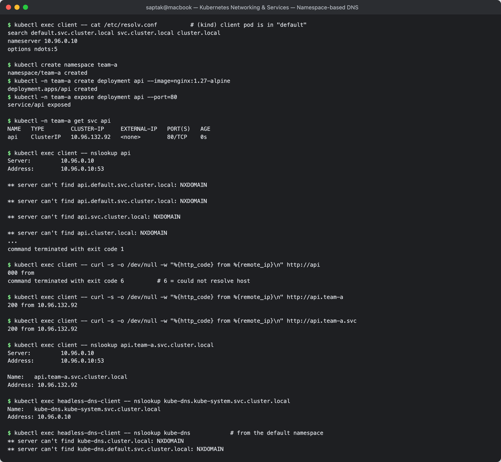

# FQDN in Kubernetes

**Author:** Saptak Banerjee
**Course:** SST DevOps & Cloud [SWE]
**Session:** 11 — Kubernetes Networking & Services (Task 3: FQDN)
**Source material:** [`devops-heros/session-11-kubernetes-services`](https://github.com/Nency-Ravaliya/devops-heros/tree/main/session-11-kubernetes-services)

**Environment:** outputs marked *(S11 cluster)* are from the 2-node minikube cluster used in the [main README](../README.md); outputs marked *(kind)* were captured on a single-node kind cluster (Kubernetes v1.37.0, CoreDNS v1.14.6) for this page. Every output is a real capture.

---

## Table of Contents

1. [What is an FQDN?](#1-what-is-an-fqdn)
2. [Kubernetes Service DNS](#2-kubernetes-service-dns)
3. [Kubernetes DNS naming convention](#3-kubernetes-dns-naming-convention)
4. [Namespace-based DNS](#4-namespace-based-dns)
5. [Pod-to-Service communication](#5-pod-to-service-communication)
6. [Examples of Kubernetes FQDNs](#6-examples-of-kubernetes-fqdns)

---

## 1. What is an FQDN?

A **Fully Qualified Domain Name** is a name that spells out every label up to the DNS root, so it means the same thing no matter where it is resolved from. `api.github.com.` is fully qualified (the trailing dot is the root). `api` is not: a resolver has to guess which domain to append.

Inside a cluster the same idea applies. `web-service-clusterip` only works from pods in the same namespace. `web-service-clusterip.default.svc.cluster.local` works from any pod in any namespace.

---

## 2. Kubernetes Service DNS

Every Service automatically gets a DNS record in the cluster DNS server (CoreDNS, see [`../coredns/README.md`](../coredns/README.md)). Nothing has to be registered by hand: CoreDNS watches the API server and creates the record when the Service is created.

What the record returns depends on the Service type. All three were observed in the S11 lab:

| Service type | DNS answer for `<svc>.<ns>.svc.cluster.local` | Seen in |
| --- | --- | --- |
| ClusterIP / NodePort / LoadBalancer | one **A record**: the Service's ClusterIP | main README Task 2 (`10.102.247.85`) |
| Headless (`clusterIP: None`) | **one A record per ready pod** | main README Task 6 (3 pod IPs) |
| ExternalName | a **CNAME** to the external host | main README Task 5 (`canonical name = nencyravaliya.me`) |

---

## 3. Kubernetes DNS naming convention

```
<service>.<namespace>.svc.<cluster-domain>
   │          │        │        └── cluster.local by default
   │          │        └── fixed: "this is a Service"
   │          └── namespace of the Service
   └── metadata.name of the Service
```

| Record | Format | Returns |
| --- | --- | --- |
| Service | `<svc>.<ns>.svc.cluster.local` | ClusterIP (or pod IPs if headless) |
| StatefulSet pod behind a headless Service | `<pod>.<headless-svc>.<ns>.svc.cluster.local` | that one pod's IP |
| Any pod, by IP | `<a-b-c-d>.<ns>.pod.cluster.local` | the pod IP |
| Named port (SRV) | `_<port-name>._<proto>.<svc>.<ns>.svc.cluster.local` | port number + target |

**Pod by IP** *(kind)*: a pod at `10.244.0.37` in namespace `team-a`:

```
$ kubectl -n team-a get pod -l app=api -o wide
NAME                   READY   STATUS    RESTARTS   AGE   IP            NODE                  NOMINATED NODE   READINESS GATES
api-776fc4695b-724bb   1/1     Running   0          3s    10.244.0.37   audit-control-plane   <none>           <none>

$ kubectl exec client -- nslookup 10-244-0-37.team-a.pod.cluster.local
Server:		10.96.0.10
Address:	10.96.0.10:53

Name:	10-244-0-37.team-a.pod.cluster.local
Address: 10.244.0.37
```

This record exists because the Corefile has `pods insecure` (see the CoreDNS page). It is rarely useful in practice since the IP is already in the name.

**StatefulSet pod via headless Service** *(S11 cluster, main README Task 6)*:

```
$ kubectl exec headless-dns-client -- nslookup web-stateful-0.web-service-headless.default.svc.cluster.local
Name:	web-stateful-0.web-service-headless.default.svc.cluster.local
Address: 10.244.1.67
```

---

## 4. Namespace-based DNS

The namespace is part of the name, and that is how namespace isolation in DNS works. Every pod's `/etc/resolv.conf` lists **its own** namespace first in the search path:

```
$ kubectl exec client -- cat /etc/resolv.conf          # (kind) client pod is in "default"
search default.svc.cluster.local svc.cluster.local cluster.local
nameserver 10.96.0.10
options ndots:5
```

**Experiment** *(kind)*: a Service `api` in namespace `team-a`, called from a pod in `default`. The client pod was started with `kubectl run client --image=curlimages/curl:8.11.1 --command -- sleep 3600`.

```
$ kubectl create namespace team-a
namespace/team-a created
$ kubectl -n team-a create deployment api --image=nginx:1.27-alpine
deployment.apps/api created
$ kubectl -n team-a expose deployment api --port=80
service/api exposed

$ kubectl -n team-a get svc api
NAME   TYPE        CLUSTER-IP     EXTERNAL-IP   PORT(S)   AGE
api    ClusterIP   10.96.132.92   <none>        80/TCP    0s
```

| From `default`, the client asks for | Result |
| --- | --- |
| `api` | **fails**: the search walk tries `api.default.svc.cluster.local`, `api.svc.cluster.local`, `api.cluster.local`, and all are NXDOMAIN |
| `api.team-a` | works over curl (the search list appends `.svc.cluster.local`) |
| `api.team-a.svc` | works |
| `api.team-a.svc.cluster.local` | works everywhere (FQDN) |

```
$ kubectl exec client -- nslookup api
Server:		10.96.0.10
Address:	10.96.0.10:53

** server can't find api.default.svc.cluster.local: NXDOMAIN

** server can't find api.default.svc.cluster.local: NXDOMAIN

** server can't find api.svc.cluster.local: NXDOMAIN

** server can't find api.cluster.local: NXDOMAIN
...
command terminated with exit code 1

$ kubectl exec client -- curl -s -o /dev/null -w "%{http_code} from %{remote_ip}\n" http://api
000 from
command terminated with exit code 6          # 6 = could not resolve host

$ kubectl exec client -- curl -s -o /dev/null -w "%{http_code} from %{remote_ip}\n" http://api.team-a
200 from 10.96.132.92

$ kubectl exec client -- curl -s -o /dev/null -w "%{http_code} from %{remote_ip}\n" http://api.team-a.svc
200 from 10.96.132.92

$ kubectl exec client -- nslookup api.team-a.svc.cluster.local
Server:		10.96.0.10
Address:	10.96.0.10:53

Name:	api.team-a.svc.cluster.local
Address: 10.96.132.92
```

> **The same `nslookup` gotcha as main README Task 6:** `nslookup api.team-a` in this Alpine/musl image returned `NXDOMAIN`, because it queried the dotted name as given. `curl http://api.team-a` worked because its resolver walked the search list. When debugging DNS, test with the full FQDN before deciding a record is missing.

The same rule was checked on the S11 cluster against a system Service *(S11 cluster, main README Task 8.1)*:

```
$ kubectl exec headless-dns-client -- nslookup kube-dns.kube-system.svc.cluster.local
Name:	kube-dns.kube-system.svc.cluster.local
Address: 10.96.0.10

$ kubectl exec headless-dns-client -- nslookup kube-dns            # from the default namespace
** server can't find kube-dns.cluster.local: NXDOMAIN
** server can't find kube-dns.default.svc.cluster.local: NXDOMAIN
```

**Takeaway:** a short name only works inside one namespace. Anything that crosses a namespace boundary must include at least `<svc>.<namespace>`. Production config should use the full FQDN.

**Screenshot:** 

---

## 5. Pod-to-Service communication

A pod never needs to know another pod's IP. It calls a **name**, and the cluster takes it from there:

```
curl http://web-service-clusterip:8080
  │
  │ 1. resolver reads /etc/resolv.conf: nameserver 10.96.0.10, search default.svc.cluster.local ...
  │ 2. CoreDNS answers web-service-clusterip.default.svc.cluster.local -> 10.102.247.85 (ClusterIP)
  ▼
10.102.247.85:8080
  │ 3. kube-proxy rules on the node DNAT the virtual IP to one ready endpoint
  ▼
pod 10.244.x.x:80
```

The three equivalent ways to reach it from the same namespace *(S11 cluster, main README Task 2)*:

```
$ kubectl exec curl-client -- curl -s http://web-service-clusterip:8080 | grep -i '<title>'
<title>Welcome to nginx!</title>
$ kubectl exec curl-client -- curl -s http://web-service-clusterip.default.svc.cluster.local:8080
<title>Welcome to nginx!</title>
$ kubectl exec curl-client -- curl -s http://10.102.247.85:8080
<title>Welcome to nginx!</title>
```

Names are the stable contract. Pod IPs change on every restart (main README Task 9 showed `web-stateful-1` move from `10.244.0.29` to `10.244.0.32`), but the Service name and the DNS record that points at it stay the same.

---

## 6. Examples of Kubernetes FQDNs

All of these were resolved during the S11 labs:

| FQDN | What it is | Answer |
| --- | --- | --- |
| `kubernetes.default.svc.cluster.local` | the API server's Service | `10.96.0.1` |
| `kube-dns.kube-system.svc.cluster.local` | CoreDNS's own Service | `10.96.0.10` |
| `web-service-clusterip.default.svc.cluster.local` | ClusterIP Service | `10.102.247.85` |
| `web-service-headless.default.svc.cluster.local` | headless Service | `10.244.1.67`, `10.244.0.29`, `10.244.1.69` |
| `web-stateful-1.web-service-headless.default.svc.cluster.local` | one StatefulSet pod | `10.244.0.32` (after the kill test) |
| `external-database-service.default.svc.cluster.local` | ExternalName Service | CNAME `nencyravaliya.me` |
| `api.team-a.svc.cluster.local` | Service in another namespace *(kind)* | `10.96.132.92` |
| `10-244-0-37.team-a.pod.cluster.local` | pod-by-IP record *(kind)* | `10.244.0.37` |

---

## Cleanup

```bash
kubectl delete namespace team-a
kubectl delete pod client
```

## Resources

- https://kubernetes.io/docs/concepts/services-networking/dns-pod-service/
- Class notes: [`../fqdn.md`](../fqdn.md)
