# Kubernetes Pods, ReplicaSets & Deployments

**Author:** Saptak Banerjee
**Course:** SST DevOps & Cloud [SWE]
**Session:** 10 — Core Objects (Pods, ReplicaSets, Deployments, StatefulSets, DaemonSets)
**Source material:** [`devops-heros/session10-k8s-core-objects`](../../devops-heros/session10-k8s-core-objects)

**Cluster used for every output below:** a **2-node** minikube cluster (`minikube start` + `minikube node add`) on macOS / Docker driver, Kubernetes **v1.37.0**, containerd **2.3.4**. A second node was added on purpose so Task 7 (DaemonSet) can actually show *one pod per node* rather than a single pod.

> **Two environment notes that affect the real outputs in this file:**
> 1. **Apple Silicon (arm64):** `mysql:5.7` publishes no `linux/arm64` image, so the provided StatefulSet fails with `ImagePullBackOff`. This is captured honestly in Task 6 along with a corrected manifest.
> 2. **NodePort on the macOS Docker driver:** `curl <minikube-ip>:<nodePort>` does **not** work. Every NodePort test below goes through `minikube service <svc> --url`. The root cause is analysed in Task 14.

> **Run `kubectl` from inside this folder.** This folder's name contains a comma, and
> `kubectl -f` treats commas as a file-list separator — so referencing a manifest from the
> parent directory splits the path and fails:
>
> ```
> $ kubectl apply -f "Kubernetes Pods, ReplicaSets & Deployments/pod.yml"
> the path "Kubernetes Pods" does not exist
> the path " ReplicaSets & Deployments/pod.yml" does not exist
> ```
>
> `cd` into this folder first and every command below works exactly as written.

---

## Table of Contents

| # | Task |
| --- | --- |
| 1 | [Cluster Health Verification](#task-1-cluster-health-verification--baseline-environment-checks) |
| 2 | [Standard Pod Deployment & Teardown](#task-2-standard-pod-deployment-extended-inspection--teardown) |
| 3 | [Error State Simulation — ErrImagePull / ImagePullBackOff](#task-3-error-state-simulation--errimagepull--imagepullbackoff) |
| 4 | [Capturing Transient Pod Lifecycle Stages](#task-4-capturing-transient-pod-lifecycle-stages) |
| 5 | [Exhaustive Pod Lifecycle & Probes Lab](#task-5-exhaustive-pod-lifecycle-states--probes-lab) |
| 6 | [ReplicaSet & StatefulSet](#task-6-core-controller-objects--replicaset--statefulset) |
| 7 | [DaemonSet Host Agents](#task-7-daemonset-architecture--host-agent-deployment) |
| 8 | [Rolling Updates & Rollbacks](#task-8-deployment-upgrades-rolling-updates--instant-rollbacks) |
| 9 | [Troubleshooting Drills](#task-9-real-world-troubleshooting-scenarios-lab) |
| 10 | [Theory: Ports, Labels, Strategies, Resources](#task-10-theoretical--architectural-conceptual-writeup) |
| 11 | [Blue-Green Deployment](#task-11-blue-green-deployment--instant-selector-cutover) |
| 12 | [Canary Deployment](#task-12-canary-deployment--pod-ratio-traffic-splitting) |
| 13 | [Recreate Deployment & Downtime](#task-13-recreate-deployment--downtime-outage-demonstration) |
| 14 | [Minikube NodePort / Tunnel Gotcha](#task-14-minikube-docker-driver-nodeport--tunnel-gotcha) |

---

## Task 1: Cluster Health Verification & Baseline Environment Checks

Confirm the control plane, CoreDNS and both nodes are healthy before deploying any workload.

**Commands:**

```bash
kubectl version --output=yaml
kubectl cluster-info
kubectl get nodes -o wide
```

**Output:**

```
$ kubectl version --output=yaml
clientVersion:
  buildDate: "2026-08-26T10:44:20Z"
  gitVersion: v1.37.0
  goVersion: go1.27.0
  major: "1"
  minor: "37"
  platform: darwin/arm64
kustomizeVersion: v5.8.1
serverVersion:
  buildDate: "2026-08-26T10:44:25Z"
  gitVersion: v1.37.0
  goVersion: go1.26.6
  major: "1"
  minor: "37"
  platform: linux/arm64

$ kubectl cluster-info
Kubernetes control plane is running at https://127.0.0.1:49804
CoreDNS is running at https://127.0.0.1:49804/api/v1/namespaces/kube-system/services/kube-dns:dns/proxy

$ kubectl get nodes -o wide
NAME           STATUS   ROLES           AGE     VERSION   INTERNAL-IP    EXTERNAL-IP   OS-IMAGE                         KERNEL-VERSION             CONTAINER-RUNTIME
minikube       Ready    control-plane   3m21s   v1.37.0   192.168.49.2   <none>        Debian GNU/Linux 12 (bookworm)   6.12.76-linuxkit (arm64)   containerd://2.3.4
minikube-m02   Ready    <none>          30s     v1.37.0   192.168.49.3   <none>        Debian GNU/Linux 12 (bookworm)   6.12.76-linuxkit (arm64)   containerd://2.3.4
```

Note `clientVersion.platform: darwin/arm64` (kubectl runs on the Mac) vs `serverVersion.platform: linux/arm64` (the API server runs inside a Linux container). Client and server are both 1.37.0 here, which is the ideal case — kubectl supports a skew of ±1 minor version from the API server.

**Screenshot:** 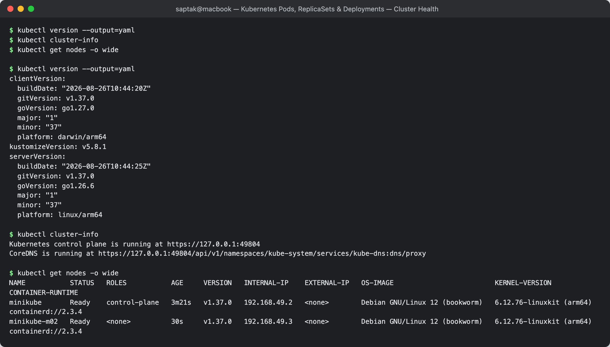

---

## Task 2: Standard Pod Deployment, Extended Inspection & Teardown

Create a bare Pod from `pod.yml`, inspect its label, IP, node placement and logs, then delete it.

**Manifest:** [`pod.yml`](./pod.yml) — demonstrates the 4 mandatory top-level fields: `apiVersion`, `kind`, `metadata`, `spec`.

**Commands:**

```bash
kubectl apply -f pod.yml
kubectl get pods
kubectl get pods -o wide
kubectl get pod nginx-pod --show-labels
kubectl logs nginx-pod
kubectl describe pod nginx-pod
kubectl delete -f pod.yml
```

**Output:**

```
$ kubectl apply -f pod.yml
pod/nginx-pod created

$ kubectl get pods
NAME        READY   STATUS              RESTARTS   AGE
nginx-pod   0/1     ContainerCreating   0          0s

$ kubectl get pods
NAME        READY   STATUS    RESTARTS   AGE
nginx-pod   1/1     Running   0          3s

$ kubectl get pods -o wide
NAME        READY   STATUS    RESTARTS   AGE   IP           NODE           NOMINATED NODE   READINESS GATES
nginx-pod   1/1     Running   0          3s    10.244.1.3   minikube-m02   <none>           <none>

$ kubectl get pod nginx-pod --show-labels
NAME        READY   STATUS    RESTARTS   AGE   LABELS
nginx-pod   1/1     Running   0          3s    app=nginx

$ kubectl logs nginx-pod
/docker-entrypoint.sh: /docker-entrypoint.d/ is not empty, will attempt to perform configuration
/docker-entrypoint.sh: Launching /docker-entrypoint.d/10-listen-on-ipv6-by-default.sh
10-listen-on-ipv6-by-default.sh: info: Enabled listen on IPv6 in /etc/nginx/conf.d/default.conf
/docker-entrypoint.sh: Configuration complete; ready for start up
2026/09/20 18:38:33 [notice] 1#1: using the "epoll" event method
2026/09/20 18:38:33 [notice] 1#1: nginx/1.31.6
2026/09/20 18:38:33 [notice] 1#1: OS: Linux 6.12.76-linuxkit
2026/09/20 18:38:33 [notice] 1#1: start worker processes
```

**Describe (trimmed):**

```
$ kubectl describe pod nginx-pod
Name:             nginx-pod
Namespace:        default
Node:             minikube-m02/192.168.49.3
Labels:           app=nginx
Status:           Running
IP:               10.244.1.3
Containers:
  nginx:
    Container ID:   containerd://61bfd99a87468e84b3266e77c89f29c70c7df91ee7292557a200ecb137be39bb
    Image:          nginx:latest
    Image ID:       docker.io/library/nginx@sha256:abe47724e466aeab9a345d8e46a221c2fa8953c7848bb4a3bd9976a7199f8cf2
    Port:           80/TCP
    State:          Running
    Ready:          True
    Restart Count:  0
    Mounts:
      /var/run/secrets/kubernetes.io/serviceaccount from kube-api-access-b85bb (ro)
```

**Teardown:**

```
$ kubectl delete -f pod.yml
pod "nginx-pod" deleted from default namespace

$ kubectl get pods
No resources found in default namespace.
```

**What to notice:**

- The Pod IP `10.244.1.3` is from the **CNI pod network**, not the node network (`192.168.49.3`). It is ephemeral — delete and recreate the Pod and you get a new IP. That is precisely why Services exist.
- The scheduler placed the Pod on `minikube-m02` (the worker), not the control-plane node.
- Every Pod automatically gets a ServiceAccount token mounted at `/var/run/secrets/kubernetes.io/serviceaccount` — this is how in-cluster code authenticates to the API server.
- A bare Pod has **no controller**. Delete it and nothing brings it back — contrast with the ReplicaSet in Task 6.

**Screenshot:** 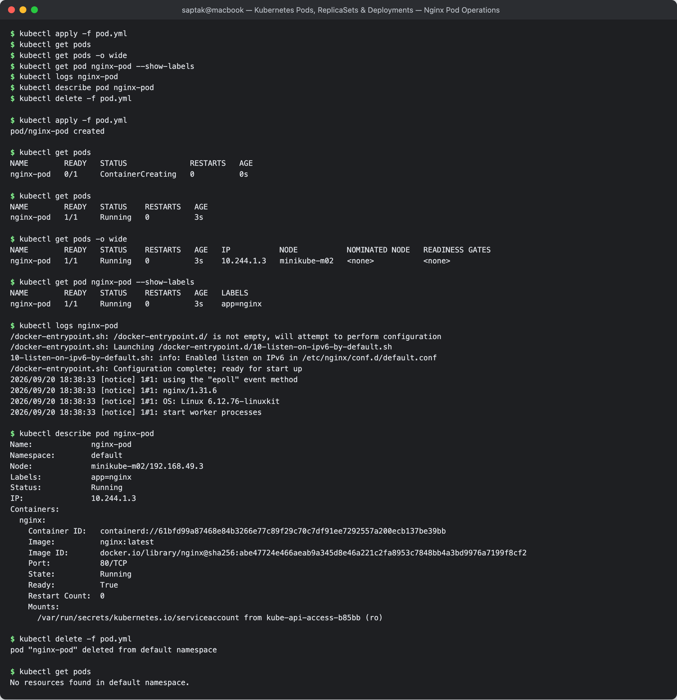

---

## Task 3: Error State Simulation — `ErrImagePull` & `ImagePullBackOff`

Reference a container image that does not exist and watch the kubelet's retry/backoff behaviour.

**Manifest:** [`pod-lifecycle/06-imagepullbackoff.yaml`](./pod-lifecycle/06-imagepullbackoff.yaml) — `image: jakwehrgkaejw:kahsdfgkhj`

**Commands & Output:**

```
$ kubectl apply -f pod-lifecycle/06-imagepullbackoff.yaml
pod/lifecycle-image-error created

$ kubectl get pods          # t = 10s -> first pull attempt has failed
NAME                    READY   STATUS         RESTARTS   AGE
lifecycle-image-error   0/1     ErrImagePull   0          10s

$ kubectl get pod lifecycle-image-error     # t = 49s -> kubelet is now backing off
NAME                    READY   STATUS             RESTARTS   AGE
lifecycle-image-error   0/1     ImagePullBackOff   0          49s

$ kubectl describe pod lifecycle-image-error | grep -A 10 Events:
Events:
  Type     Reason     Age                From               Message
  ----     ------     ----               ----               -------
  Normal   Scheduled  40s                default-scheduler  Successfully assigned default/lifecycle-image-error to minikube-m02
  Normal   Pulling    21s (x2 over 40s)  kubelet            Pulling image "jakwehrgkaejw:kahsdfgkhj"
  Warning  Failed     19s (x2 over 36s)  kubelet            Failed to pull image "jakwehrgkaejw:kahsdfgkhj": failed to resolve reference "docker.io/library/jakwehrgkaejw:kahsdfgkhj": pull access denied, repository does not exist or may require authorization: server message: insufficient_scope: authorization failed
  Warning  Failed     19s (x2 over 36s)  kubelet            Error: ErrImagePull
  Normal   BackOff    6s (x2 over 35s)   kubelet            Back-off pulling image "jakwehrgkaejw:kahsdfgkhj"
  Warning  Failed     6s (x2 over 35s)   kubelet            Error: ImagePullBackOff
```

### Why does `kubectl apply` succeed when the image is broken?

This is the key concept. `kubectl apply` only talks to the **API server**:

1. API server authenticates the request, validates the Pod **schema**, and writes the object to **etcd**. → `pod/... created`. The object now genuinely exists.
2. The **scheduler** sees an unscheduled Pod and binds it to `minikube-m02`. Scheduling only needs CPU/memory/affinity — it never checks whether the image is pullable.
3. Only now does the **kubelet** on that node try to pull the image, and only *that* fails.

So the image is a **runtime** concern, not an **admission** concern. The failure therefore surfaces in the Pod's `status`, not as an error from `kubectl apply`.

**`ErrImagePull` vs `ImagePullBackOff`:**

| State | Meaning |
| --- | --- |
| `ErrImagePull` | The most recent pull attempt just failed. |
| `ImagePullBackOff` | The kubelet has given up retrying immediately and is now waiting on an exponential backoff timer (10s, 20s, 40s … capped at 5 min) before the next attempt. |

`ImagePullBackOff` is therefore the *steady state* — which is why the status flips from the first to the second after ~40s.

**Common real causes:** typo in image/tag · image exists but only for another CPU architecture (see Task 6) · private registry with no `imagePullSecret` · registry rate limit.

**Screenshot:** 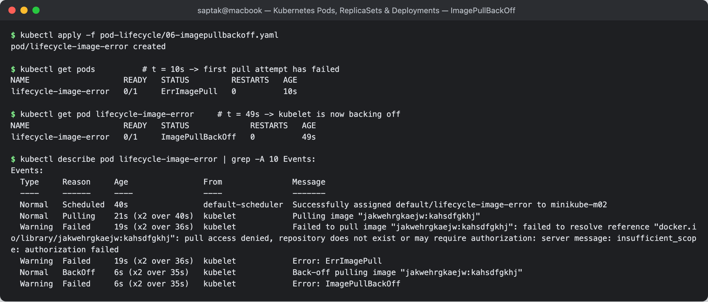

---

## Task 4: Capturing Transient Pod Lifecycle Stages

Run a short-lived batch container with `restartPolicy: Never` and catch every phase in real time.

**Manifest:** [`hello.yml`](./hello.yml) — `busybox`, `command: ["sh","-c","echo Hello Kubernetes"]`, `restartPolicy: Never`

**Commands:**

```bash
# Terminal 1
kubectl get pods -w
# Terminal 2
kubectl apply -f hello.yml
```

**Output of `kubectl get pods -w` — all four phases captured:**

```
NAME        READY   STATUS              RESTARTS   AGE
hello-pod   0/1     Pending             0          0s
hello-pod   0/1     Pending             0          0s
hello-pod   0/1     ContainerCreating   0          0s
hello-pod   0/1     ContainerCreating   0          0s
hello-pod   1/1     Running             0          11s
hello-pod   0/1     Completed           0          12s
hello-pod   0/1     Completed           0          13s
```

**Verification:**

```
$ kubectl logs hello-pod
Hello Kubernetes

$ kubectl get pod hello-pod -o jsonpath='{.status.phase}'
Succeeded

$ kubectl get pod hello-pod -o jsonpath='{.status.containerStatuses[0].state.terminated.exitCode}'
0

$ kubectl delete -f hello.yml
pod "hello-pod" deleted from default namespace
```

**Stage breakdown:**

| Stage | What is happening |
| --- | --- |
| `Pending` | Object is in etcd; scheduler has not yet bound it to a node (sub-second here). |
| `ContainerCreating` | kubelet is pulling the image, creating the network namespace, asking the CNI for an IP. This took ~11s because the image had to be pulled. |
| `Running` | Container process is executing. It printed `Hello Kubernetes` and exited within ~1s. |
| `Completed` | Container exited 0. Because `restartPolicy: Never`, the kubelet does **not** restart it. |

> **`STATUS` vs `phase`:** `kubectl get pods` shows `Completed` in the STATUS column (which is really the *container* state), while `.status.phase` — the actual API field — reads `Succeeded`. They describe the same thing at two different levels.

**Screenshot:** 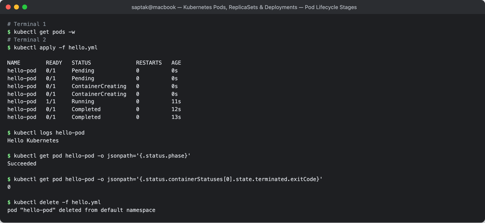

---

## Task 5: Exhaustive Pod Lifecycle States & Probes Lab

All 12 manifests in [`pod-lifecycle/`](./pod-lifecycle/) executed and documented.

### Summary table

| # | Manifest | Demonstrates | Observed result |
| --- | --- | --- | --- |
| 01 | `01-running.yaml` | Healthy steady state | `1/1 Running`, phase `Running` |
| 02 | `02-pending.yaml` | Unschedulable (9Gi request) | `0/1 Pending` + `FailedScheduling` |
| 03 | `03-succeeded.yaml` | Batch exit 0 | `Completed`, phase `Succeeded`, exit 0 |
| 04 | `04-failed.yaml` | Batch exit 1 | `Error`, phase `Failed`, exit 1 |
| 05 | `05-crashloopbackoff.yaml` | Restart loop + exponential backoff | `CrashLoopBackOff`, gaps 4s→12s→29s |
| 06 | `06-imagepullbackoff.yaml` | Bad image | covered in Task 3 |
| 07 | `07-readiness.yaml` | Running ≠ Ready | `0/1 Running` → `1/1 Running` at 5s |
| 08 | `08-liveness.yaml` | Self-healing restart | `RESTARTS 1` after probe failed twice |
| 09 | `09-startup.yaml` | Slow bootstrap protection | `0/1` for 30s, then `1/1` |
| 10 | `10-init-container.yaml` | Sequential prerequisite | `Init:0/1` → `1/1 Running` |
| 11 | `11-multi-container.yaml` | App + sidecar | `2/2 Running`, one shared IP |
| 12 | `12-termination.yaml` | Graceful SIGTERM shutdown | delete took **11.6s**, not instant |

---

### 01 — Running

```
$ kubectl apply -f 01-running.yaml
pod/lifecycle-running created

$ kubectl get pod lifecycle-running -o wide
NAME                READY   STATUS    RESTARTS   AGE   IP           NODE           NOMINATED NODE   READINESS GATES
lifecycle-running   1/1     Running   0          1s    10.244.1.6   minikube-m02   <none>           <none>

$ kubectl get pod lifecycle-running -o jsonpath='{.status.phase}'
Running
```

### 02 — Pending (unschedulable)

The container requests `memory: 9Gi`, which no node in this cluster can satisfy.

```
$ kubectl apply -f 02-pending.yaml
pod/lifecycle-pending created

$ kubectl get pod lifecycle-pending
NAME                READY   STATUS    RESTARTS   AGE
lifecycle-pending   0/1     Pending   0          12s

$ kubectl describe pod lifecycle-pending | grep -A 5 Events:
Events:
  Type     Reason            Age   From               Message
  ----     ------            ----  ----               -------
  Warning  FailedScheduling  12s   default-scheduler  0/2 nodes are available: 2 Insufficient memory. preemption: 0/2 nodes are available: 2 Preemption is not helpful for scheduling.
```

The Pod stays `Pending` **forever** — the scheduler retries indefinitely rather than failing the object. Note the message counts **both** nodes (`0/2 nodes are available`), which is only visible because this is a multi-node cluster. Scheduling is decided on **requests**, never on limits or actual usage.

### 03 — Succeeded / 04 — Failed

Same manifest shape, the only difference being `exit 0` vs `exit 1`, both with `restartPolicy: Never`.

```
$ kubectl get pod lifecycle-succeeded
NAME                  READY   STATUS      RESTARTS   AGE
lifecycle-succeeded   0/1     Completed   0          16s
$ kubectl logs lifecycle-succeeded
Task started
Task completed successfully
phase=Succeeded  exitCode=0

$ kubectl get pod lifecycle-failed
NAME               READY   STATUS   RESTARTS   AGE
lifecycle-failed   0/1     Error    0          15s
$ kubectl logs lifecycle-failed
Task started
Task failed
phase=Failed  exitCode=1  reason=Error
```

A non-zero exit code is the **only** difference between `Succeeded` and `Failed`. `restartPolicy: Never` is what stops the failed one from becoming a CrashLoopBackOff.

### 05 — CrashLoopBackOff

Identical crashing container, but with the **default** `restartPolicy: Always`.

```
$ kubectl get pod lifecycle-crashloop -w
NAME                  READY   STATUS              RESTARTS     AGE
lifecycle-crashloop   0/1     ContainerCreating   0            0s
lifecycle-crashloop   1/1     Running             0            0s
lifecycle-crashloop   0/1     Error               0            4s
lifecycle-crashloop   1/1     Running             1 (1s ago)   4s
lifecycle-crashloop   0/1     Error               1 (5s ago)   8s
lifecycle-crashloop   0/1     CrashLoopBackOff    1 (12s ago)  19s
lifecycle-crashloop   1/1     Running             2 (12s ago)  19s
lifecycle-crashloop   0/1     Error               2 (16s ago)  23s
lifecycle-crashloop   0/1     CrashLoopBackOff    2 (29s ago)  51s
lifecycle-crashloop   1/1     Running             3 (29s ago)  51s
lifecycle-crashloop   0/1     Error               3 (33s ago)  55s
```

**The exponential backoff is directly visible** in the `RESTARTS` column: the delay before each restart grows **4s → 12s → 29s**, doubling toward the 5-minute cap. This is why a crashing pod looks "stuck" after a few minutes — the kubelet is deliberately waiting longer and longer.

```
$ kubectl describe pod lifecycle-crashloop | grep -A 10 Events:
  Normal   Pulled   30s (x4 over 82s)  kubelet  Container image "busybox:1.36" already present on machine
  Normal   Created  30s (x4 over 82s)  kubelet  Container created
  Normal   Started  30s (x4 over 82s)  kubelet  Container started
  Warning  BackOff  26s (x3 over 75s)  kubelet  Back-off restarting failed container crashing-app in pod lifecycle-crashloop_default(...)
```

**Debugging a crash loop — reading the dead container's logs:**

```
$ kubectl logs lifecycle-crashloop --previous
Application started
Application crashed
```

> **Gotcha found during this lab:** after the pod had been restarting for a couple of minutes, the same command returned
> `unable to retrieve container logs for containerd://7b06102cb8c74...`
> The previous container had already been garbage-collected by containerd. `--previous` only reaches back **one** container generation, and only while that container still exists on the node — so grab the logs early, or ship them to a log aggregator.

### 07 — Readiness probe (`Running` ≠ `Ready`)

```
$ kubectl get pod lifecycle-readiness -w
NAME                  READY   STATUS              RESTARTS   AGE
lifecycle-readiness   0/1     ContainerCreating   0          0s
lifecycle-readiness   0/1     Running             0          0s      <-- process is up, NOT ready
lifecycle-readiness   1/1     Running             0          5s      <-- probe passed, now ready

$ kubectl describe pod lifecycle-readiness | grep -i readiness
    Readiness:  http-get http://:80/ delay=5s timeout=1s period=5s successThreshold=1 failureThreshold=3
```

The `0/1 Running` window is the whole point: the container process exists, but the readiness probe has not yet passed, so **kube-proxy keeps this Pod out of the Service's endpoint list**. A failing readiness probe removes a Pod from load balancing but **never restarts** it.

### 08 — Liveness probe (automated self-healing)

The container creates `/tmp/healthy`, sleeps 20s, deletes it, then sleeps 300s. The probe `test -f /tmp/healthy` therefore starts failing at ~20s.

```
$ kubectl apply -f 08-liveness.yaml
--- t=10s (healthy, probe passing) ---
lifecycle-liveness   1/1     Running   0          10s
--- t=25s (health file just removed) ---
lifecycle-liveness   1/1     Running   0          26s
--- t=45s ---
lifecycle-liveness   1/1     Running   0          46s
--- t=65s ---
lifecycle-liveness   1/1     Running   1 (5s ago)   66s      <-- RESTARTS incremented

$ kubectl describe pod lifecycle-liveness | grep -A 12 Events:
  Warning  Unhealthy  35s (x2 over 40s)  kubelet  Liveness probe failed:
  Normal   Killing    35s                kubelet  Container app failed liveness probe, will be restarted
  Normal   Pulled     5s (x2 over 65s)   kubelet  Container image "busybox:1.36" already present on machine
  Normal   Created    5s (x2 over 65s)   kubelet  Container created
  Normal   Started    5s (x2 over 65s)   kubelet  Container started
```

**Timeline worth reading carefully:** probe fails at 35s (`failureThreshold: 2` × `periodSeconds: 5`), kubelet issues `Killing` at 35s — but the container is not actually replaced until ~60s. The 25-second gap is the **default 30s `terminationGracePeriodSeconds`**: the container ignored SIGTERM (it was in `sleep 300` with no trap), so the kubelet waited out the grace period and then sent SIGKILL. Compare with manifest 12, which traps SIGTERM and exits early.

**Liveness vs readiness — the distinction that matters in interviews:**

| | Readiness | Liveness |
| --- | --- | --- |
| On failure | Pod removed from Service endpoints | Container **killed and restarted** |
| Restarts the container? | No | Yes |
| Use for | "Can this pod serve traffic right now?" (warm-up, dependency down) | "Is this process wedged and unrecoverable?" (deadlock) |
| Danger of getting it wrong | Traffic to a cold pod | **Restart loop under load** — a slow-but-alive app gets killed repeatedly |

### 09 — Startup probe (slow bootstrap)

App sleeps 30s before creating `/tmp/started`; `failureThreshold: 10 × periodSeconds: 5` gives it a 50s budget.

```
--- t=10s --- lifecycle-startup   0/1   Running   0   10s
--- t=25s --- lifecycle-startup   0/1   Running   0   25s
--- t=40s --- lifecycle-startup   1/1   Running   0   41s

$ kubectl describe pod lifecycle-startup | grep -i startup
    Startup:  exec [sh -c test -f /tmp/started] delay=0s timeout=1s period=5s successThreshold=1 failureThreshold=10
  Warning  Unhealthy  10s (x6 over 35s)  kubelet  Startup probe failed:

$ kubectl logs lifecycle-startup
Application starting...
Application started
```

Six recorded probe failures, and yet **zero restarts**. That is the entire purpose: while a startup probe is still running, liveness and readiness probes are **suspended**. Without it, you would have to set a huge `initialDelaySeconds` on the liveness probe, which then makes the app slow to self-heal for the rest of its life. Startup probe = generous budget at boot, tight checks afterwards.

### 10 — Init container

```
--- t=5s ---  lifecycle-init   0/1   Init:0/1   0   6s
--- t=17s --- lifecycle-init   1/1   Running    0   18s

$ kubectl logs lifecycle-init -c setup
Init container running
Init complete

$ kubectl describe pod lifecycle-init | grep -A 8 "Init Containers:"
Init Containers:
  setup:
    Container ID:  containerd://d582a2ef532ff73c2494715e3a6f3972ad8722f460a132699765b237285d08bd
    Image:         busybox:1.36
```

The `Init:0/1` status means "0 of 1 init containers finished". Init containers run **to completion, in order, before any app container starts**. If one fails, the Pod restarts it and the app container never starts. Real uses: wait for a database to accept connections, run a schema migration, fetch config or certificates into a shared volume.

### 11 — Multi-container Pod (app + sidecar)

```
$ kubectl get pod lifecycle-multi-container
NAME                        READY   STATUS    RESTARTS   AGE
lifecycle-multi-container   2/2     Running   0          0s

containers=app sidecar  podIP=10.244.1.17

$ kubectl logs lifecycle-multi-container -c sidecar
Sidecar is running
Sidecar is running

$ kubectl logs lifecycle-multi-container
Defaulted container "app" out of: app, sidecar
/docker-entrypoint.sh: /docker-entrypoint.d/ is not empty, will attempt to perform configuration
```

`READY 2/2` = two containers, both passing their checks. Both share the **single Pod IP `10.244.1.17`** and the same network namespace, so the sidecar can reach the app on `localhost:80` — no Service needed. Note that `kubectl logs` without `-c` prints `Defaulted container "app" out of: app, sidecar` and silently picks the first one; always pass `-c` on a multi-container Pod.

### 12 — Graceful termination (SIGTERM trap)

The container traps SIGTERM, sleeps 10s "cleaning up", then exits. `terminationGracePeriodSeconds: 20`.

```
$ kubectl apply -f 12-termination.yaml
pod/lifecycle-termination created

$ time kubectl delete -f 12-termination.yaml
pod "lifecycle-termination" deleted from default namespace
kubectl delete -f 12-termination.yaml  0.03s user 0.02s system 0% cpu 11.667 total
```

**11.6 seconds, not instant.** The shutdown sequence:

1. Pod marked `Terminating`; it is removed from all Service endpoints immediately (so no new traffic arrives).
2. kubelet sends **SIGTERM** to PID 1.
3. The trap runs the 10s cleanup and exits 0 → the pod disappears at ~10s.
4. Had it *not* exited, the kubelet would have sent **SIGKILL** at the 20s grace deadline.

This is the mechanism behind zero-downtime rollouts: a well-behaved app uses the grace period to finish in-flight requests. `terminationGracePeriodSeconds` must be **longer** than the app's real cleanup time, or SIGKILL truncates it.

**Screenshots:**

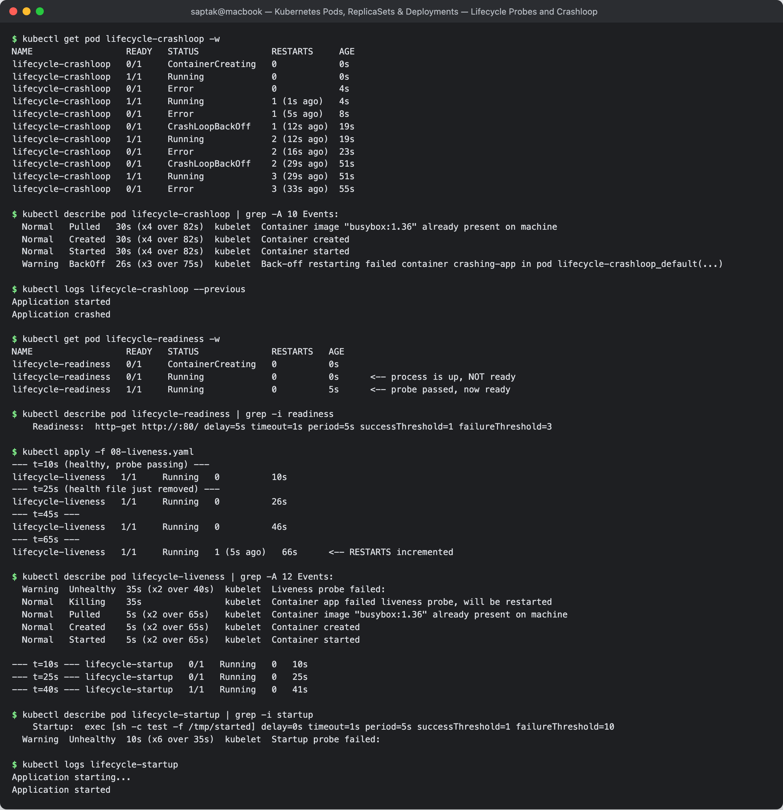
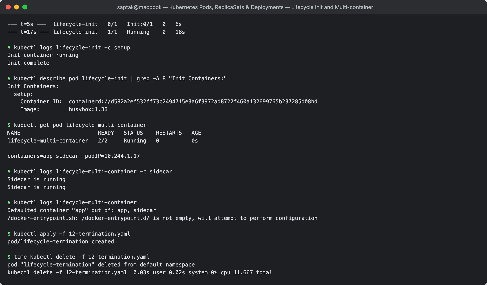

---
## Task 6: Core Controller Objects — ReplicaSet & StatefulSet

### Part A — ReplicaSet self-healing

**Manifest:** [`replicaset.yml`](./replicaset.yml) — 3 nginx replicas, `selector.matchLabels: app=nginx`

```
$ kubectl apply -f replicaset.yml
replicaset.apps/nginx-rs created

$ kubectl get rs nginx-rs
NAME       DESIRED   CURRENT   READY   AGE
nginx-rs   3         3         3       8s

$ kubectl get pods -l app=nginx -o wide
NAME             READY   STATUS    RESTARTS   AGE   IP            NODE           NOMINATED NODE   READINESS GATES
nginx-rs-gxqwt   1/1     Running   0          8s    10.244.1.20   minikube-m02   <none>           <none>
nginx-rs-hvvlq   1/1     Running   0          8s    10.244.1.19   minikube-m02   <none>           <none>
nginx-rs-pxsrx   1/1     Running   0          8s    10.244.0.3    minikube       <none>           <none>
```

**Self-healing test — delete a pod by hand:**

```
$ kubectl delete pod nginx-rs-gxqwt
pod "nginx-rs-gxqwt" deleted from default namespace

$ kubectl get pods -l app=nginx          # immediately after
NAME             READY   STATUS              RESTARTS   AGE
nginx-rs-hvvlq   1/1     Running             0          9s
nginx-rs-p84gl   0/1     ContainerCreating   0          1s     <-- replacement already created
nginx-rs-pxsrx   1/1     Running             0          9s

$ kubectl get pods -l app=nginx          # ~6s later
NAME             READY   STATUS    RESTARTS   AGE
nginx-rs-hvvlq   1/1     Running   0          15s
nginx-rs-p84gl   1/1     Running   0          7s
nginx-rs-pxsrx   1/1     Running   0          15s

$ kubectl describe rs nginx-rs | grep -A 6 Events:
Events:
  Type    Reason            Age   From                   Message
  ----    ------            ----  ----                   -------
  Normal  SuccessfulCreate  15s   replicaset-controller  Created pod: nginx-rs-hvvlq
  Normal  SuccessfulCreate  15s   replicaset-controller  Created pod: nginx-rs-pxsrx
  Normal  SuccessfulCreate  15s   replicaset-controller  Created pod: nginx-rs-gxqwt
  Normal  SuccessfulCreate  7s    replicaset-controller  Created pod: nginx-rs-p84gl     <-- the self-heal
```

The replacement appeared in **~1 second**. The `replicaset-controller` (inside `kube-controller-manager`) runs a reconciliation loop: it counts Pods matching `app=nginx`, compares to `spec.replicas: 3`, and creates or deletes to close the gap. The replacement gets a **brand-new random name and a new IP** — pod identity is disposable here.

> **Why you rarely write a ReplicaSet directly:** a ReplicaSet can only keep N pods alive; it has no concept of *versions*. A Deployment owns ReplicaSets and uses one per version, which is what makes rolling updates and rollbacks possible (Task 8).

### Part B — StatefulSet

**Manifest as provided:** [`k8s-core-objects/statefulset.yml`](./k8s-core-objects/statefulset.yml) — MySQL, 3 replicas, `volumeClaimTemplates` 5Gi.

**It fails on Apple Silicon — and the failure is instructive:**

```
$ kubectl apply -f k8s-core-objects/statefulset.yml
statefulset.apps/mysql created

$ kubectl get statefulset mysql
NAME    READY   AGE
mysql   0/3     20s

$ kubectl get pods -l app=mysql
NAME      READY   STATUS             RESTARTS   AGE
mysql-0   0/1     ImagePullBackOff   0          20s

$ kubectl get pvc
NAME                               STATUS   VOLUME                                     CAPACITY   ACCESS MODES   STORAGECLASS   AGE
mysql-persistent-storage-mysql-0   Bound    pvc-2bef7eaf-0a4b-443f-a653-29221972ca9b   5Gi        RWO            standard       20s

$ kubectl describe pod mysql-0 | grep -A 8 Events:
  Warning  FailedScheduling  20s  default-scheduler  0/2 nodes are available: pod has unbound immediate PersistentVolumeClaims.
  Normal   Scheduled         20s  default-scheduler  Successfully assigned default/mysql-0 to minikube-m02
  Warning  Failed            12s  kubelet            Failed to pull image "mysql:5.7": rpc error: code = NotFound desc = failed to pull and unpack image "docker.io/library/mysql:5.7": no match for platform in manifest: not found
  Warning  Failed            12s  kubelet            Error: ErrImagePull
  Normal   BackOff           12s  kubelet            Back-off pulling image "mysql:5.7"
```

Two separate lessons in one output:

1. **`no match for platform in manifest`** — this is *not* the "repository does not exist" error from Task 3. `mysql:5.7` exists, but Oracle never published a `linux/arm64` build of it; arm64 support starts at MySQL 8.0. On an M-series Mac the kubelet finds the repo, finds the tag, and then finds no image for its architecture. **A working manifest on a colleague's Intel laptop can still `ImagePullBackOff` on yours** — always check `docker manifest inspect <image>` when an image fails only for you.
2. **Only `mysql-0` was ever created.** A StatefulSet starts pods **strictly in order** and waits for each to become Ready before creating the next. Because `mysql-0` never became Ready, `mysql-1` and `mysql-2` were never even attempted. (A Deployment would have launched all 3 in parallel and shown 3 broken pods.)

Note also the transient `FailedScheduling: pod has unbound immediate PersistentVolumeClaims` — the scheduler refuses to place the pod until its PVC is bound, then proceeds once the provisioner binds it.

#### Corrected manifest

Written as [`k8s-core-objects/statefulset-fixed.yml`](./k8s-core-objects/statefulset-fixed.yml) — two changes: `mysql:8.0` instead of `mysql:5.7`, and the **headless Service** `mysql` that `spec.serviceName` references (the original manifest names a Service that does not exist, so the stable per-pod DNS names could never resolve).

```
$ kubectl apply -f k8s-core-objects/statefulset-fixed.yml
service/mysql created
statefulset.apps/mysql created

--- t=20s: mysql-0 starting, mysql-1 not created yet (ordered startup) ---
NAME      READY   STATUS              RESTARTS   AGE
mysql-0   0/1     ContainerCreating   0          21s

--- mysql-0 Ready; only NOW does the controller create mysql-1 ---
NAME      READY   STATUS    RESTARTS   AGE
mysql-0   1/1     Running   0          60s
mysql-1   0/1     Pending   0          0s

$ kubectl get statefulset mysql
NAME    READY   AGE
mysql   2/2     3m1s

$ kubectl get pods -l app=mysql -o wide
NAME      READY   STATUS    RESTARTS   AGE    IP            NODE           NOMINATED NODE   READINESS GATES
mysql-0   1/1     Running   0          3m1s   10.244.1.23   minikube-m02   <none>           <none>
mysql-1   1/1     Running   0          2m1s   10.244.0.4    minikube       <none>           <none>

$ kubectl get pvc
NAME                               STATUS   VOLUME                                     CAPACITY   ACCESS MODES   STORAGECLASS   AGE
mysql-persistent-storage-mysql-0   Bound    pvc-f1aaa75e-e37a-4ad2-bda9-3129d6d0a2d2   1Gi        RWO            standard       3m1s
mysql-persistent-storage-mysql-1   Bound    pvc-80277d32-c141-47d7-8128-f77d857914d7   1Gi        RWO            standard       2m1s

$ kubectl get svc mysql
NAME    TYPE        CLUSTER-IP   EXTERNAL-IP   PORT(S)    AGE
mysql   ClusterIP   None         <none>        3306/TCP   3m1s
```

Everything a StatefulSet promises is visible here: **ordinal names** (`mysql-0`, `mysql-1` — not random hashes), **sequential startup** (mysql-1 created only after mysql-0 was Ready — note the 60s age difference), **one dedicated PVC per pod** auto-created from `volumeClaimTemplates`, and `CLUSTER-IP: None` marking the headless Service.

**Stable identity test — delete `mysql-0`:**

```
$ kubectl delete pod mysql-0
pod "mysql-0" deleted from default namespace

$ kubectl get pods -l app=mysql
NAME      READY   STATUS    RESTARTS   AGE
mysql-0   1/1     Running   0          4s       <-- SAME name, not a new random one
mysql-1   1/1     Running   0          2m20s

$ kubectl get pvc
NAME                               STATUS   VOLUME                                     CAPACITY   ACCESS MODES   STORAGECLASS   AGE
mysql-persistent-storage-mysql-0   Bound    pvc-f1aaa75e-e37a-4ad2-bda9-3129d6d0a2d2   1Gi        RWO            standard       3m20s
mysql-persistent-storage-mysql-1   Bound    pvc-80277d32-c141-47d7-8128-f77d857914d7   1Gi        RWO            standard       2m20s
```

The replacement came back as **`mysql-0`**, and the PVC volume ID `pvc-f1aaa75e-…` is **unchanged** — the same disk was re-attached, so the database keeps its data. Contrast with the ReplicaSet above, where the replacement got a new name and no storage at all.

| | ReplicaSet / Deployment | StatefulSet |
| --- | --- | --- |
| Pod names | `nginx-rs-gxqwt` (random) | `mysql-0`, `mysql-1` (ordinal) |
| Name after recreation | **new** random name | **same** ordinal name |
| Startup / shutdown | all in parallel | strictly ordered (0→1→2 up, reverse down) |
| Storage | shared or none | one PVC per pod, re-attached on recreate |
| DNS | via Service VIP | per-pod: `mysql-0.mysql.default.svc.cluster.local` |
| Use for | stateless web/API tiers | databases, Kafka, ZooKeeper, anything with per-instance state |

**Screenshot:** 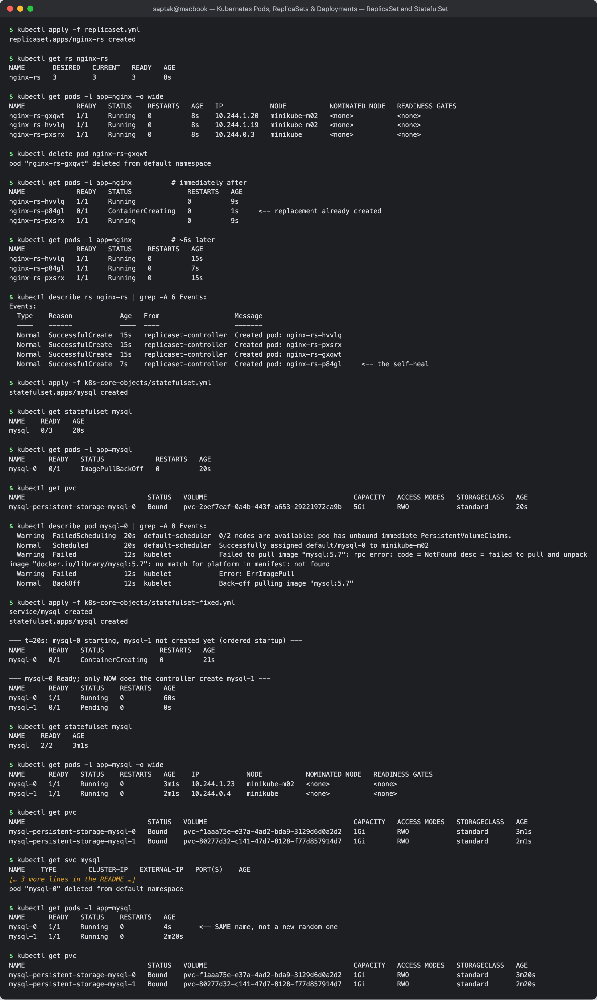

---

## Task 7: DaemonSet Architecture & Host Agent Deployment

A DaemonSet runs **exactly one pod per eligible node** and has **no `replicas` field** — the desired count is derived from the node count.

**Manifest A:** [`k8s-core-objects/deamonset.yml`](./k8s-core-objects/deamonset.yml) — `prom/node-exporter`

```
$ kubectl apply -f k8s-core-objects/deamonset.yml
daemonset.apps/node-exporter created

$ kubectl get ds node-exporter
NAME            DESIRED   CURRENT   READY   UP-TO-DATE   AVAILABLE   NODE SELECTOR   AGE
node-exporter   2         2         2       2            2           <none>          30s

$ kubectl get pods -l app=node-exporter -o wide
NAME                  READY   STATUS    RESTARTS   AGE   IP            NODE           NOMINATED NODE   READINESS GATES
node-exporter-76n5x   1/1     Running   0          30s   10.244.1.25   minikube-m02   <none>           <none>
node-exporter-7746k   1/1     Running   0          30s   10.244.0.5    minikube       <none>           <none>

$ kubectl get nodes
NAME           STATUS   ROLES           AGE   VERSION
minikube       Ready    control-plane   25m   v1.37.0
minikube-m02   Ready    <none>          22m   v1.37.0
```

**Manifest B:** [`daemonset/node-agent-ds.yaml`](./daemonset/node-agent-ds.yaml) — a busybox log-collector stand-in

```
$ kubectl get ds node-logging-agent
NAME                 DESIRED   CURRENT   READY   UP-TO-DATE   AVAILABLE   NODE SELECTOR   AGE
node-logging-agent   2         2         2       2            2           <none>          15s

$ kubectl get pods -l app=node-logging-agent -o wide
NAME                       READY   STATUS    RESTARTS   AGE   IP            NODE           NOMINATED NODE   READINESS GATES
node-logging-agent-hn2jb   1/1     Running   0          15s   10.244.0.6    minikube       <none>           <none>
node-logging-agent-xdq6d   1/1     Running   0          15s   10.244.1.26   minikube-m02   <none>           <none>

$ kubectl logs node-logging-agent-hn2jb
[Sun Sep 20 18:59:29 UTC 2026] Collecting host system metrics on node-logging-agent-hn2jb
[Sun Sep 20 18:59:39 UTC 2026] Collecting host system metrics on node-logging-agent-hn2jb
```

**Proof of the "one per node" rule:** `DESIRED = 2` exactly matches the 2 nodes, and the `-o wide` output shows one pod on `minikube` and one on `minikube-m02` — never two on the same node.

**Key properties:**

- **No `replicas` field.** `kubectl scale ds/...` is meaningless. `DESIRED` is computed by the `daemonset-controller` from the set of matching nodes.
- **Add a node → a pod appears on it automatically.** Remove a node → its pod is garbage-collected. No human action.
- On this cluster both nodes get a pod because minikube's control-plane node is **untainted**. On a production cluster the control plane carries `node-role.kubernetes.io/control-plane:NoSchedule`, so a DaemonSet needs an explicit `tolerations` block to land there — which is exactly why `kube-proxy` and CNI DaemonSets ship with broad tolerations.

**Real-world DaemonSets:** `kube-proxy` and the CNI plugin (already running as DaemonSets in `kube-system` — see Session 9 Task 3), log shippers (Fluent Bit, Promtail), metrics agents (node-exporter, Datadog), security/runtime monitors (Falco), storage drivers (CSI node plugins).

**Screenshot:** 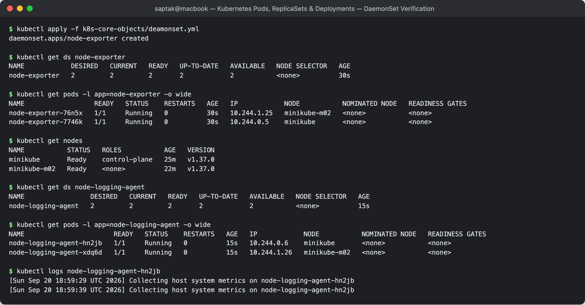

---

## Task 8: Deployment Upgrades, Rolling Updates & Instant Rollbacks

**Directory:** [`01-rolling-update/`](./01-rolling-update/) — `app-rolling`, **4 replicas**, `maxSurge: 1`, `maxUnavailable: 0`.

### Step 1 — Deploy v1

```
$ kubectl apply -f 01-rolling-update/deployment-v1.yaml
deployment.apps/app-rolling created
$ kubectl apply -f 01-rolling-update/service.yaml
service/app-rolling-service created

$ kubectl rollout status deployment/app-rolling
Waiting for deployment "app-rolling" rollout to finish: 0 of 4 updated replicas are available...
Waiting for deployment "app-rolling" rollout to finish: 1 of 4 updated replicas are available...
Waiting for deployment "app-rolling" rollout to finish: 2 of 4 updated replicas are available...
Waiting for deployment "app-rolling" rollout to finish: 3 of 4 updated replicas are available...
deployment "app-rolling" successfully rolled out

$ kubectl get pods -l app=app-rolling --show-labels
NAME                           READY   STATUS    RESTARTS   AGE   LABELS
app-rolling-86d7d44d5b-77mtk   1/1     Running   0          7s    app=app-rolling,pod-template-hash=86d7d44d5b,version=v1
app-rolling-86d7d44d5b-8kx4l   1/1     Running   0          7s    app=app-rolling,pod-template-hash=86d7d44d5b,version=v1
app-rolling-86d7d44d5b-f5bxh   1/1     Running   0          7s    app=app-rolling,pod-template-hash=86d7d44d5b,version=v1
app-rolling-86d7d44d5b-q5gn7   1/1     Running   0          7s    app=app-rolling,pod-template-hash=86d7d44d5b,version=v1
```

Note `pod-template-hash=86d7d44d5b` — added automatically by the Deployment controller, it is what ties a Pod to a specific ReplicaSet (i.e. a specific version).

### Step 2 — Roll to v2 and watch the churn

```
$ kubectl apply -f 01-rolling-update/deployment-v2.yaml
deployment.apps/app-rolling configured

$ kubectl rollout status deployment/app-rolling
Waiting for deployment "app-rolling" rollout to finish: 1 out of 4 new replicas have been updated...
Waiting for deployment "app-rolling" rollout to finish: 2 out of 4 new replicas have been updated...
Waiting for deployment "app-rolling" rollout to finish: 3 out of 4 new replicas have been updated...
Waiting for deployment "app-rolling" rollout to finish: 1 old replicas are pending termination...
deployment "app-rolling" successfully rolled out
```

**`kubectl get pods -l app=app-rolling -w` during the rollout:**

```
NAME                           READY   STATUS              RESTARTS   AGE
app-rolling-86d7d44d5b-77mtk   1/1     Running             0          32s
app-rolling-86d7d44d5b-8kx4l   1/1     Running             0          32s
app-rolling-86d7d44d5b-f5bxh   1/1     Running             0          32s
app-rolling-86d7d44d5b-q5gn7   1/1     Running             0          32s
app-rolling-56bff6d88c-pm2t5   0/1     Pending             0          0s     <-- SURGE pod (5th) created
app-rolling-56bff6d88c-pm2t5   0/1     ContainerCreating   0          0s
app-rolling-56bff6d88c-pm2t5   0/1     Running             0          0s
app-rolling-56bff6d88c-pm2t5   1/1     Running             0          5s     <-- new pod READY...
app-rolling-86d7d44d5b-q5gn7   1/1     Terminating         0          39s    <-- ...only NOW is an old one killed
app-rolling-56bff6d88c-qg29m   0/1     Pending             0          0s
app-rolling-56bff6d88c-qg29m   1/1     Running             0          6s
app-rolling-86d7d44d5b-f5bxh   1/1     Terminating         0          45s
app-rolling-56bff6d88c-692rq   0/1     Pending             0          0s
...
```

**This is `maxSurge: 1` / `maxUnavailable: 0` made visible.** The order is always *create one new → wait for Ready → terminate one old*, never the reverse. Pod count oscillates between 4 and 5, and never drops below 4 ready.

### Step 3 — Zero-downtime proof

A continuous curl loop was run against the Service through the whole rollout (120 requests, ~0.4s apart):

```
=== response sequence (run-length encoded) ===
  31 VERSION: v1
   1 VERSION: v2        <-- first v2 pod joins the endpoint list
   1 VERSION: v1
   1 VERSION: v2
   ...  (mixed v1/v2 window while both ReplicaSets have ready pods)
   8 VERSION: v2
   1 [OUTAGE] request failed
  54 VERSION: v2

=== totals ===
  45 VERSION: v1
  74 VERSION: v2
   1 [OUTAGE] request failed
```

**119 of 120 requests served — 99.2%.** Two honest observations:

- The **interleaved v1/v2 window** is inherent to RollingUpdate: while both ReplicaSets have ready pods, the Service load-balances across both, so **clients see two versions at once**. This is why RollingUpdate requires backward-compatible releases (API shapes, DB schema) — and it is exactly what Blue-Green (Task 11) eliminates.
- The single failed request is a **client-side connection reset through the `minikube service` proxy** as a pod it had an open connection to terminated — not a capacity gap. With `maxUnavailable: 0` the cluster guaranteed 4 ready pods at all times, so the Service never had zero endpoints. Compare this with Task 13, where the outage is **13 consecutive** failures — a real, structural downtime window.

### Step 4 — History and rollback

```
$ kubectl rollout history deployment/app-rolling
REVISION  CHANGE-CAUSE
1         <none>
2         <none>

$ kubectl get rs -l app=app-rolling
NAME                     DESIRED   CURRENT   READY   AGE
app-rolling-56bff6d88c   4         4         4       67s     <-- v2, active
app-rolling-86d7d44d5b   0         0         0       100s    <-- v1, kept at 0 replicas

$ kubectl rollout undo deployment/app-rolling
deployment.apps/app-rolling rolled back

$ kubectl rollout status deployment/app-rolling
deployment "app-rolling" successfully rolled out

$ kubectl get pods -l app=app-rolling --show-labels
NAME                           READY   STATUS        RESTARTS   AGE   LABELS
app-rolling-56bff6d88c-qg29m   1/1     Terminating   0          87s   app=app-rolling,pod-template-hash=56bff6d88c,version=v2
app-rolling-86d7d44d5b-clxrn   1/1     Running       0          26s   app=app-rolling,pod-template-hash=86d7d44d5b,version=v1
app-rolling-86d7d44d5b-gclsx   1/1     Running       0          6s    app=app-rolling,pod-template-hash=86d7d44d5b,version=v1
app-rolling-86d7d44d5b-jbgq6   1/1     Running       0          19s   app=app-rolling,pod-template-hash=86d7d44d5b,version=v1
app-rolling-86d7d44d5b-pqjkl   1/1     Running       0          13s   app=app-rolling,pod-template-hash=86d7d44d5b,version=v1

$ kubectl rollout history deployment/app-rolling
REVISION  CHANGE-CAUSE
2         <none>
3         <none>
```

**How rollback actually works:** the old ReplicaSet `app-rolling-86d7d44d5b` was never deleted — it was scaled to 0 and kept (`revisionHistoryLimit`, default 10). `rollout undo` simply scales the old RS back up and the current one down, reusing the **same `pod-template-hash`**. That is why the returning pods carry the original hash `86d7d44d5b` and `version=v1`.

Note that the history now reads `2, 3` — revision 1 was **renumbered to 3**, not restored in place. A rollback is recorded as a *new* revision, so `rollout undo` twice in a row toggles back and forth rather than walking further back. Use `--to-revision=N` to target a specific one.

`CHANGE-CAUSE` is `<none>` because no `kubernetes.io/change-cause` annotation was set. In production, annotate each release (`kubectl annotate deployment/app-rolling kubernetes.io/change-cause="..."`) so the history is readable.

**Screenshot:** 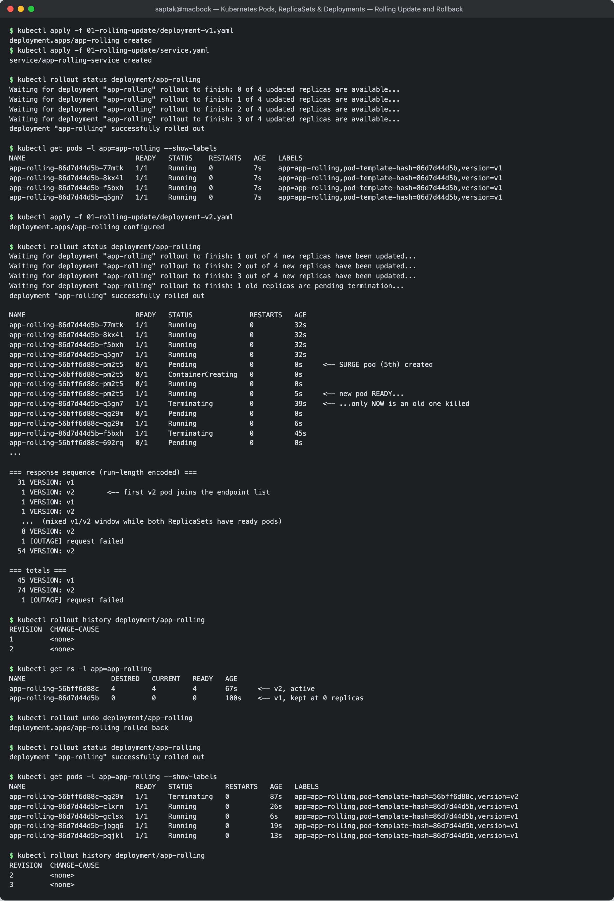

---

## Task 9: Real-World Troubleshooting Scenarios Lab

**Directory:** [`troubleshooting/`](./troubleshooting/)

### Drill 1 — Broken image halts a rollout (`broken-image.yaml`)

Baseline: `yatri-backend` healthy at 3/3 on v1 (from [`deployment/`](./deployment/)). The broken manifest keeps `maxSurge: 1` / `maxUnavailable: 0` but points at `yatri-backend:non-existent-tag-v999`.

```
$ kubectl apply -f troubleshooting/broken-image.yaml
deployment.apps/yatri-backend configured

$ kubectl rollout status deployment/yatri-backend --timeout=40s
Waiting for deployment "yatri-backend" rollout to finish: 1 out of 3 new replicas have been updated...
Waiting for deployment "yatri-backend" rollout to finish: 1 out of 3 new replicas have been updated...
error: timed out waiting for the condition
(exit code: 1)

$ kubectl get pods -l app=yatri-backend
NAME                             READY   STATUS         RESTARTS   AGE
yatri-backend-7554bd5c75-4clrs   1/1     Running        0          56s     <-- old v1 pods
yatri-backend-7554bd5c75-kchxr   1/1     Running        0          57s     <-- still serving
yatri-backend-7554bd5c75-nrqcn   1/1     Running        0          56s     <-- traffic
yatri-backend-77dbb657cd-jkv64   0/1     ErrImagePull   0          40s     <-- the stuck surge pod

$ kubectl get deployment yatri-backend
NAME            READY   UP-TO-DATE   AVAILABLE   AGE
yatri-backend   3/3     1            3           84s

$ kubectl get rs -l app=yatri-backend
NAME                       DESIRED   CURRENT   READY   AGE
yatri-backend-7554bd5c75   3         3         3       84s     <-- v1 untouched
yatri-backend-77dbb657cd   1         1         0       40s     <-- broken, stuck at 1
yatri-backend-cbc55c649    0         0         0       72s

$ kubectl describe pod yatri-backend-77dbb657cd-jkv64 | grep -A 8 Events:
  Warning  Failed   22s (x2 over 38s)  kubelet  Failed to pull image "yatri-backend:non-existent-tag-v999": ... pull access denied, repository does not exist or may require authorization
  Warning  Failed   22s (x2 over 38s)  kubelet  Error: ErrImagePull
  Normal   BackOff  11s (x2 over 38s)  kubelet  Back-off pulling image "yatri-backend:non-existent-tag-v999"
  Warning  Failed   11s (x2 over 38s)  kubelet  Error: ImagePullBackOff
```

**Diagnosis — read the three numbers on the Deployment line:**

- `READY 3/3` — three pods are serving. **The application never went down.**
- `AVAILABLE 3` — full capacity maintained.
- `UP-TO-DATE 1` — but only **one** pod matches the new template, and it is broken.

`maxUnavailable: 0` is the hero here. The controller may only kill an old pod *after* a new one becomes Ready. The new one never becomes Ready, so no old pod is ever killed, and the rollout **stalls safely** instead of taking the service down. Had this been `maxUnavailable: 1`, an old pod would have been terminated first and the service would be running at 2/3 with no replacement coming.

Also note `rollout status` **exits non-zero** on timeout — that is the hook a CI/CD pipeline uses to detect a failed deploy and trigger an automatic rollback.

**Recovery:**

```
$ kubectl rollout undo deployment/yatri-backend
deployment.apps/yatri-backend rolled back

$ kubectl rollout status deployment/yatri-backend
deployment "yatri-backend" successfully rolled out

$ kubectl get pods -l app=yatri-backend
NAME                             READY   STATUS        RESTARTS   AGE
yatri-backend-7554bd5c75-4clrs   1/1     Running       0          70s
yatri-backend-7554bd5c75-kchxr   1/1     Running       0          71s
yatri-backend-7554bd5c75-nrqcn   1/1     Running       0          70s
yatri-backend-77dbb657cd-jkv64   0/1     Terminating   0          54s     <-- broken surge pod removed
```

### Drill 2 — Immutable selector / label mismatch (`selector-mismatch.yaml`)

`spec.selector.matchLabels.app: correct-app-name` but `spec.template.metadata.labels.app: wrong-app-name`.

```
$ kubectl apply -f troubleshooting/selector-mismatch.yaml
The Deployment "selector-error-demo" is invalid: spec.template.metadata.labels: Invalid value: {"app":"wrong-app-name"}: `selector` does not match template `labels`
(exit code: 1)
```

**Why the API server rejects it outright** (unlike Drill 1, where the object was accepted and failed later): a Deployment finds its own pods *only* by label selector. If the pods it stamps out do not carry the labels it searches for, it would create pods, fail to find them, conclude it has 0 replicas, and create more — forever. This is a logically impossible object, so it is rejected at **admission time**, before anything is written to etcd. Nothing was created:

**Fix** — [`troubleshooting/selector-mismatch-fixed.yaml`](./troubleshooting/selector-mismatch-fixed.yaml) makes the template label match the selector:

```
$ kubectl apply -f troubleshooting/selector-mismatch-fixed.yaml
deployment.apps/selector-error-demo created
(exit code: 0)

$ kubectl rollout status deployment/selector-error-demo
deployment "selector-error-demo" successfully rolled out

$ kubectl get deployment selector-error-demo
NAME                  READY   UP-TO-DATE   AVAILABLE   AGE
selector-error-demo   1/1     1            1           0s
```

**Bonus — the selector is immutable after creation:**

```
$ kubectl patch deployment selector-error-demo --type=merge \
    -p '{"spec":{"selector":{"matchLabels":{"app":"changed-name"}},"template":{"metadata":{"labels":{"app":"changed-name"}}}}}'
The Deployment "selector-error-demo" is invalid: spec.selector: Invalid value: {"matchLabels":{"app":"changed-name"}}: field is immutable
(exit code: 1)
```

Even though the patch keeps selector and template **consistent with each other**, it is still refused. Changing the selector would orphan every existing pod (the Deployment would lose track of them and they would leak). The only way to change a selector is to **delete and recreate** the Deployment — which is why choosing labels carefully up front matters.

**Two distinct failure classes worth separating:**

| | Drill 1 (broken image) | Drill 2 (selector mismatch) |
| --- | --- | --- |
| Rejected by | kubelet, at runtime | API server, at admission |
| `kubectl apply` result | **succeeds** | **fails** with a validation error |
| Object created in etcd? | Yes | No |
| Where you see it | `kubectl get pods` / `describe` events | immediately in the terminal |
| Blast radius | contained by `maxUnavailable: 0` | none — nothing was created |

**Screenshot:** 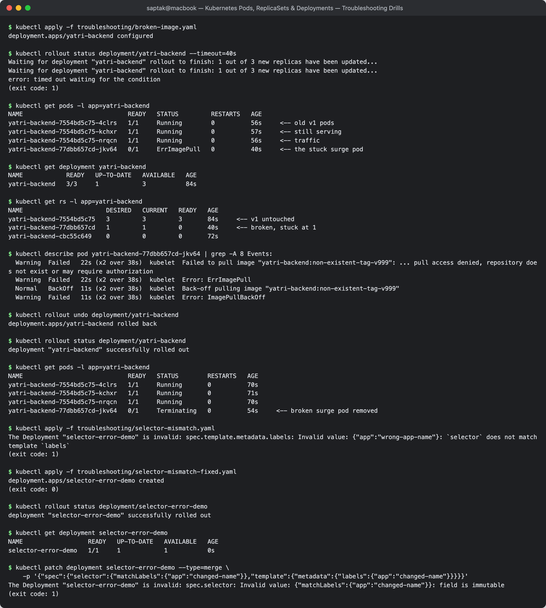

---
## Task 10: Theoretical & Architectural Conceptual Writeup

### 10.1 — The four ports, disambiguated

```
External Client
      │
      │  http://<NODE-IP>:30010
      ▼
┌─────────────────────────────────────────────┐
│ NODE  (minikube-m02, 192.168.49.3)          │
│                                             │
│   nodePort: 30010   ← opened on EVERY node  │
│        │                                    │
│        ▼                                    │
│   port: 80          ← the Service's own     │
│   (ClusterIP VIP,     port (virtual)        │
│    10.96.x.x)                               │
│        │                                    │
│        ▼                                    │
│   targetPort: 80    ← port ON THE POD the   │
│        │              Service forwards to   │
│        ▼                                    │
│   ┌──────────────────────────────┐          │
│   │ POD 10.244.1.20              │          │
│   │   containerPort: 80          │          │
│   │   (nginx listening)          │          │
│   └──────────────────────────────┘          │
└─────────────────────────────────────────────┘
```

| Field | Lives in | Scope | Meaning | Range |
| --- | --- | --- | --- | --- |
| `containerPort` | Pod spec | inside the Pod | Documentation of the port the app listens on. **Purely informational** — omitting it does not block traffic. | 1–65535 |
| `targetPort` | Service spec | Pod | The port on the **backing Pod** the Service forwards to. Can be a number or a **named** containerPort. Defaults to `port` if omitted. | 1–65535 |
| `port` | Service spec | cluster-internal | The port the **Service itself** exposes on its ClusterIP. This is what other pods connect to: `http://my-svc:8080`. | 1–65535 |
| `nodePort` | Service spec | every node's host IP | A port opened on **all nodes**, forwarding into the Service. Only for `type: NodePort` / `LoadBalancer`. | **30000–32767** |

Two points that trip people up:

- **`containerPort` is not a firewall.** If nginx listens on 80 and you declare `containerPort: 8080`, traffic to 80 still works. It exists for readability and for named-port references.
- **`port` and `targetPort` are frequently both 80**, which hides the distinction. Setting `port: 8080, targetPort: 80` makes it obvious: clients dial `my-svc:8080`, the Service delivers to the pod's `:80`.

### 10.2 — Labels vs. Selectors

**Labels** are key/value metadata attached *to* an object. **Selectors** are queries that *find* objects by their labels. Labels are the noun; selectors are the verb.

From the real Task 8 output:

```
LABELS: app=app-rolling,pod-template-hash=86d7d44d5b,version=v1
                │                    │                    │
                │                    │                    └─ arbitrary, for humans/canaries
                │                    └─ added AUTOMATICALLY by the Deployment controller
                └─ what the Service and Deployment select on
```

```yaml
# Service: "send traffic to every pod carrying app=app-rolling"
selector:
  app: app-rolling
```

The loose coupling this creates is what makes Blue-Green (Task 11) a one-line change: the Service does not know or care *which* Deployment produced the pods — only that their labels match.

Selectors come in two forms:

| Form | Example | Used by |
| --- | --- | --- |
| Equality-based | `app=nginx`, `env!=prod` | Services, `kubectl -l` |
| Set-based | `env in (prod,staging)`, `track notin (canary)`, `app` (key exists) | Deployments/ReplicaSets (`matchExpressions`), `kubectl -l` |

```bash
kubectl get pods -l app=nginx
kubectl get pods -l 'version in (v1,v2)'
kubectl get pods -l app=myapp,slot=blue     # comma = AND
```

Remember from Drill 2: a Deployment's `spec.selector` must be a subset of `spec.template.metadata.labels`, and it is **immutable** after creation.

### 10.3 — The four deployment strategies

| | RollingUpdate | Recreate | Blue-Green | Canary |
| --- | --- | --- | --- | --- |
| Downtime | none | **yes, deliberate** | none | none |
| Extra capacity | +`maxSurge` (e.g. +25%) | **none** | **200%** | +canary pool (~10%) |
| Both versions live at once? | **yes** (transiently) | never | never (atomic flip) | **yes** (by design) |
| Rollback | `rollout undo` (minutes) | `rollout undo` + downtime again | **flip selector (instant)** | scale canary to 0 |
| Native to Kubernetes? | yes (default) | yes | no — a pattern using 2 Deployments + 1 Service | no — a pattern using 2 Deployments + 1 Service |
| Best for | stateless services, default choice | breaking schema migrations, RWO volumes, single-writer apps | mission-critical, needs instant rollback and budget for 2× | validating a risky release against real traffic |

Measured in this session (all from the live runs below):

- **RollingUpdate** (Task 8): 119/120 requests served; visible mixed-version window.
- **Blue-Green** (Task 11): 10/10 BLUE → flip → 10/10 GREEN. **Zero mixed responses.**
- **Canary** (Task 12): 14% canary at a 9:1 pod ratio; 27% at 7:3.
- **Recreate** (Task 13): **13 consecutive failed requests** — a real outage window, and **zero mixed-version responses**.

### 10.4 — `maxSurge` vs `maxUnavailable`

Both are set under `spec.strategy.rollingUpdate` and accept an absolute number **or** a percentage.

- **`maxSurge`** — how many pods above `replicas` may exist during the rollout. Controls the **ceiling**.
- **`maxUnavailable`** — how many pods below `replicas` may be unavailable during the rollout. Controls the **floor**.

**The actual configuration used in Task 8** — `replicas: 4`, `maxSurge: 1`, `maxUnavailable: 0`:

```
Max pods at any moment  = replicas + maxSurge       = 4 + 1 = 5
Min available pods      = replicas - maxUnavailable = 4 - 0 = 4   (100% capacity guaranteed)
```

That "4 minimum, 5 maximum" is exactly what the `-w` output showed: one surge pod created, wait for Ready, then one old pod terminated — repeating four times.

**Percentages round in opposite directions, on purpose:**

- `maxSurge` rounds **up** (be generous with the ceiling).
- `maxUnavailable` rounds **down** (be conservative with the floor).

With `replicas: 10, maxSurge: 25%, maxUnavailable: 25%` (the Kubernetes defaults):

```
maxSurge        = ceil(10 × 0.25)  = 3   -> at most 13 pods
maxUnavailable  = floor(10 × 0.25) = 2   -> at least 8 pods available
```

**Constraint:** they cannot both be 0 — the rollout could then neither add nor remove a pod, so it would never progress. The API server rejects that combination.

| Goal | Setting | Trade-off |
| --- | --- | --- |
| Never lose capacity (Task 8, Drill 1) | `maxSurge: 1, maxUnavailable: 0` | needs headroom for one extra pod; slowest |
| Fastest rollout | `maxSurge: 100%, maxUnavailable: 0` | needs 2× capacity momentarily |
| No spare capacity available | `maxSurge: 0, maxUnavailable: 1` | runs degraded during the rollout |

### 10.5 — Resource requests vs limits, and GB vs GiB

| | `requests` | `limits` |
| --- | --- | --- |
| Used by | the **scheduler**, to pick a node | the **kubelet / Linux cgroups**, at runtime |
| Meaning | guaranteed minimum reservation | hard ceiling |
| Exceeding CPU | allowed — can burst into idle CPU | **throttled** (CFS quota); app slows, no crash |
| Exceeding memory | allowed until the node is under pressure | **OOMKilled** — no throttling is possible for RAM |

Task 5's `02-pending.yaml` proved the scheduler point: a `requests.memory: 9Gi` pod stayed `Pending` with `0/2 nodes are available: 2 Insufficient memory` — the scheduler sums the **requests** of everything already on each node, never their actual usage. A node can be 90% idle and still reject a pod because its requests are fully booked.

**Quality of Service classes** (assigned automatically, and they set eviction order):

| QoS | Condition | Evicted |
| --- | --- | --- |
| `Guaranteed` | requests **==** limits, for every container | last |
| `Burstable` | requests set, limits higher or absent | second |
| `BestEffort` | neither set | **first** |

**Units — the single most common Kubernetes billing/sizing mistake:**

| Suffix | Base | Bytes | Name |
| --- | --- | --- | --- |
| `M` | 10⁶ | 1,000,000 | megabyte (SI) |
| `G` | 10⁹ | 1,000,000,000 | gigabyte (SI) |
| `Mi` | 2²⁰ | 1,048,576 | **mebibyte** (IEC) |
| `Gi` | 2³⁰ | **1,073,741,824** | **gibibyte** (IEC) |

`1Gi` is ~7.4% larger than `1G`. Kubernetes accepts both, so `memory: 1G` and `memory: 1Gi` are different requests — always use `Mi`/`Gi` so your numbers line up with what `kubectl top` and node capacity report.

**CPU units:** `1` = one full core. `500m` ("500 millicores") = half a core. CPU is compressible (throttle), memory is not (kill) — which is why a common production rule is *always set a memory limit, be cautious with CPU limits*.

---

## Task 11: Blue-Green Deployment — Instant Selector Cutover

**Directory:** [`02-blue-green/`](./02-blue-green/) — `app-blue` (v1, 3 replicas) and `app-green` (v2, 3 replicas) run **simultaneously**; a single Service selects one of them via `slot:`.

### Step 1 — Both environments live side by side

```
$ kubectl apply -f 02-blue-green/deployment-blue.yaml
deployment.apps/app-blue created
$ kubectl apply -f 02-blue-green/deployment-green.yaml
deployment.apps/app-green created

$ kubectl get pods -l app=myapp --show-labels
NAME                        READY   STATUS    RESTARTS   AGE   LABELS
app-blue-5c69d7785c-2css5   1/1     Running   0          7s    app=myapp,pod-template-hash=5c69d7785c,slot=blue,version=v1
app-blue-5c69d7785c-57jpp   1/1     Running   0          7s    app=myapp,pod-template-hash=5c69d7785c,slot=blue,version=v1
app-blue-5c69d7785c-wxmhs   1/1     Running   0          7s    app=myapp,pod-template-hash=5c69d7785c,slot=blue,version=v1
app-green-84df7f978-7fb9z   1/1     Running   0          7s    app=myapp,pod-template-hash=84df7f978,slot=green,version=v2
app-green-84df7f978-p5g5c   1/1     Running   0          7s    app=myapp,pod-template-hash=84df7f978,slot=green,version=v2
app-green-84df7f978-zcr49   1/1     Running   0          7s    app=myapp,pod-template-hash=84df7f978,slot=green,version=v2
```

**6 pods for a 3-pod service** — this is the 200% capacity cost of Blue-Green, stated plainly.

### Step 2 — Route live traffic to Blue

```
$ kubectl apply -f 02-blue-green/service-blue.yaml
service/myapp-service created

$ kubectl describe svc myapp-service | grep Selector
Selector:                 app=myapp,slot=blue

$ kubectl get endpoints myapp-service
NAME            ENDPOINTS                                      AGE
myapp-service   10.244.0.10:80,10.244.1.35:80,10.244.1.36:80   0s
```

Only the **3 blue pod IPs** are in the endpoint list. The green pods are running and healthy but receive nothing.

```
--- Live traffic BEFORE the switch (10 requests) ---
BLUE ENVIRONMENT
BLUE ENVIRONMENT
BLUE ENVIRONMENT
BLUE ENVIRONMENT
BLUE ENVIRONMENT
BLUE ENVIRONMENT
BLUE ENVIRONMENT
BLUE ENVIRONMENT
BLUE ENVIRONMENT
BLUE ENVIRONMENT
```

### Step 3 — THE SWITCH

```
$ kubectl apply -f 02-blue-green/service-green.yaml
service/myapp-service configured

$ kubectl describe svc myapp-service | grep Selector
Selector:                 app=myapp,slot=green

$ kubectl get endpoints myapp-service
NAME            ENDPOINTS                                      AGE
myapp-service   10.244.0.11:80,10.244.1.37:80,10.244.1.38:80   46s
```

**The endpoint list flipped completely** — `.10/.35/.36` (blue) → `.11/.37/.38` (green) — while the Service's `AGE` stayed at 46s. Same Service object, same ClusterIP, same nodePort; only the selector changed.

```
--- Live traffic AFTER the switch (10 requests) ---
GREEN ENVIRONMENT
GREEN ENVIRONMENT
GREEN ENVIRONMENT
GREEN ENVIRONMENT
GREEN ENVIRONMENT
GREEN ENVIRONMENT
GREEN ENVIRONMENT
GREEN ENVIRONMENT
GREEN ENVIRONMENT
GREEN ENVIRONMENT
```

**Zero mixed responses.** Not one request saw BLUE after the switch, and none saw GREEN before it. That atomicity is the whole point — compare with Task 8's RollingUpdate, where v1 and v2 interleaved for several seconds.

### Step 4 — Instant rollback

```
$ kubectl apply -f 02-blue-green/service-blue.yaml
service/myapp-service configured
$ kubectl describe svc myapp-service | grep Selector
Selector:                 app=myapp,slot=blue

--- Live traffic AFTER rollback (5 requests) ---
BLUE ENVIRONMENT
BLUE ENVIRONMENT
BLUE ENVIRONMENT
BLUE ENVIRONMENT
BLUE ENVIRONMENT
```

Rollback is the same one-line operation, and it takes the same milliseconds — because the blue pods were **never terminated**. There is no image to pull, no container to start, no scheduling. This is the strongest argument for Blue-Green: a rollback under incident pressure is a selector edit, not a deploy.

**Mechanically, what happens on the flip:** the `endpoints-controller` re-evaluates the new selector, rewrites the EndpointSlice, and every node's `kube-proxy` reprograms its iptables/IPVS rules. Existing long-lived TCP connections to blue pods are **not** severed — only new connections go to green. For a clean cutover you still want to drain the old slot before deleting it.

**Trade-offs:** costs 2× compute for the overlap window; a shared database must be compatible with **both** versions during the cutover (the flip is atomic for traffic, never for data); and in-flight sessions pinned to the old slot need draining.

**Screenshot:** 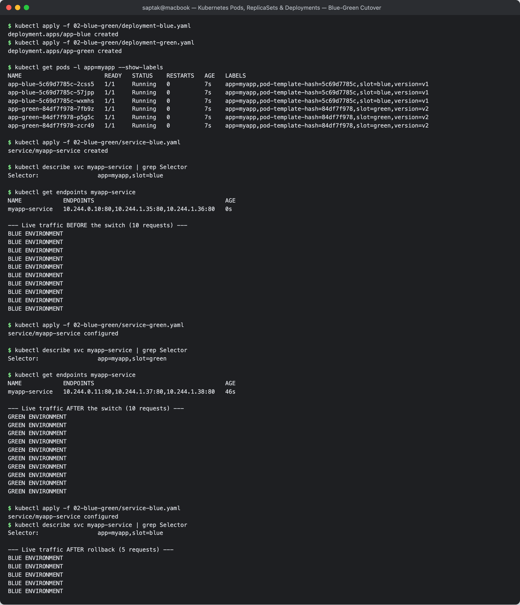

---

## Task 12: Canary Deployment — Pod-Ratio Traffic Splitting

**Directory:** [`03-canary/`](./03-canary/) — `app-stable` (v1) and `app-canary` (v2) both carry `app: myapp-canary`, and **one** Service selects on that shared label only. Traffic split therefore equals the **pod-count ratio**.

### Step 1 — 9 stable + 1 canary

```
$ kubectl apply -f 03-canary/deployment-stable.yaml
deployment.apps/app-stable created
$ kubectl apply -f 03-canary/service.yaml
service/myapp-canary-service created
$ kubectl rollout status deployment/app-stable
deployment "app-stable" successfully rolled out

$ kubectl apply -f 03-canary/deployment-canary.yaml
deployment.apps/app-canary created

$ kubectl get deployments -l app=myapp-canary
NAME         READY   UP-TO-DATE   AVAILABLE   AGE
app-canary   1/1     1            1           7s
app-stable   9/9     9            9           13s

$ kubectl get pods -l app=myapp-canary --show-labels
NAME                          READY   STATUS    RESTARTS   AGE   LABELS
app-canary-5849994497-zb84z   1/1     Running   0          7s    app=myapp-canary,pod-template-hash=5849994497,track=canary,version=v2
app-stable-6ffb777f9d-8gslw   1/1     Running   0          13s   app=myapp-canary,pod-template-hash=6ffb777f9d,track=stable,version=v1
app-stable-6ffb777f9d-fx9xx   1/1     Running   0          13s   app=myapp-canary,pod-template-hash=6ffb777f9d,track=stable,version=v1
app-stable-6ffb777f9d-hqlbc   1/1     Running   0          13s   app=myapp-canary,pod-template-hash=6ffb777f9d,track=stable,version=v1
app-stable-6ffb777f9d-hrt77   1/1     Running   0          13s   app=myapp-canary,pod-template-hash=6ffb777f9d,track=stable,version=v1
app-stable-6ffb777f9d-pvddk   1/1     Running   0          13s   app=myapp-canary,pod-template-hash=6ffb777f9d,track=stable,version=v1
app-stable-6ffb777f9d-r2jm4   1/1     Running   0          13s   app=myapp-canary,pod-template-hash=6ffb777f9d,track=stable,version=v1
app-stable-6ffb777f9d-wtbvr   1/1     Running   0          13s   app=myapp-canary,pod-template-hash=6ffb777f9d,track=stable,version=v1
app-stable-6ffb777f9d-xbkj9   1/1     Running   0          13s   app=myapp-canary,pod-template-hash=6ffb777f9d,track=stable,version=v1
app-stable-6ffb777f9d-z8pgw   1/1     Running   0          13s   app=myapp-canary,pod-template-hash=6ffb777f9d,track=stable,version=v1

$ kubectl get endpoints myapp-canary-service
NAME                   ENDPOINTS                                                  AGE
myapp-canary-service   10.244.0.12:80,10.244.0.13:80,10.244.0.14:80 + 7 more...   13s
```

All **10** pods (9 stable + 1 canary) are in one endpoint list. The `track` label differs but the Service does not select on it — that is the trick.

### Step 2 — Measure the split (100 requests)

```
$ for i in $(seq 1 100); do curl -s $URL | grep -Eo 'STABLE v1|CANARY v2'; done | sort | uniq -c
  14 CANARY v2
  86 STABLE v1
```

**14% canary against a theoretical 10%.** The gap is expected: kube-proxy in iptables mode picks a backend at random *per connection*, so with a 100-request sample the ±4% deviation is ordinary sampling noise, not a misconfiguration. (An earlier 40-request run gave 2/40 = 5% — smaller samples swing wider, which is itself the lesson: **canary metrics need volume to be trustworthy.**)

### Step 3 — Shift traffic to 30%

```
$ kubectl scale deployment app-canary --replicas=3
deployment.apps/app-canary scaled
$ kubectl scale deployment app-stable --replicas=7
deployment.apps/app-stable scaled

$ kubectl get deployments -l app=myapp-canary
NAME         READY   UP-TO-DATE   AVAILABLE   AGE
app-canary   3/3     3            3           68s
app-stable   7/7     7            7           74s

--- 100 requests at 7:3 ---
  27 CANARY v2
  73 STABLE v1
```

**27% measured against 30% expected.** Traffic share tracks the pod ratio closely, and shifting it required no config change — just `kubectl scale`. Keeping the total at 10 pods keeps capacity constant while the mix changes.

### Step 4 — Abort the canary

```
$ kubectl scale deployment app-canary --replicas=0
deployment.apps/app-canary scaled
$ kubectl scale deployment app-stable --replicas=9
deployment.apps/app-stable scaled

$ kubectl get deployments -l app=myapp-canary
NAME         READY   UP-TO-DATE   AVAILABLE   AGE
app-canary   0/0     0            0           99s
app-stable   9/9     9            9           105s

--- 30 requests after rollback ---
  30 STABLE v1
```

**100% stable, no canary leakage.** Scaling to 0 removes the canary pods from the endpoint list immediately. The Deployment object survives at `0/0`, so re-running the canary later is a single `kubectl scale` away.

### The limitation of pod-ratio canary

Traffic share is quantised by pod count. A **1% canary needs 100 pods**, which is absurd for most services. Pod-ratio canary also cannot route by user, header, cookie, or geography — every request is a coin flip. Real canary deployments therefore use a service mesh or ingress controller that splits on **weights** (Istio `VirtualService`, Argo Rollouts, NGINX Ingress `canary-weight`), giving 1% granularity and header-based targeting independent of replica counts.

**Screenshot:** 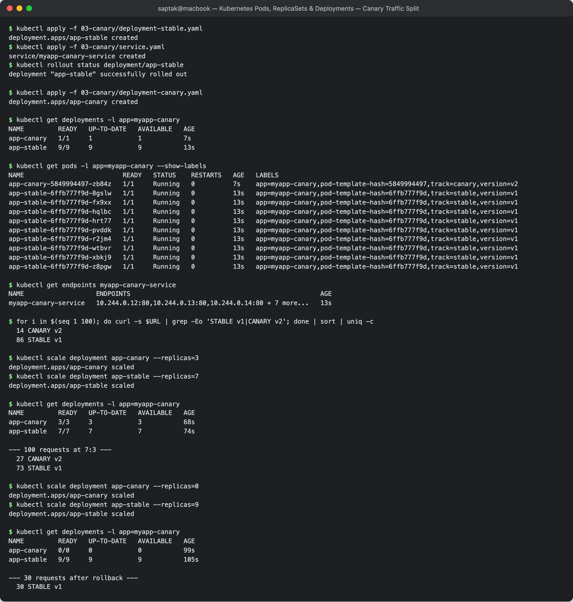

---

## Task 13: Recreate Deployment — Downtime Outage Demonstration

**Directory:** [`04-recreate/`](./04-recreate/) — `app-recreate`, 3 replicas, `strategy.type: Recreate`.

### Step 1 — Deploy v1

```
$ kubectl apply -f 04-recreate/deployment-v1.yaml
deployment.apps/app-recreate created
$ kubectl apply -f 04-recreate/service.yaml
service/app-recreate-service created

$ kubectl get deployment app-recreate -o wide
NAME           READY   UP-TO-DATE   AVAILABLE   AGE   CONTAINERS   IMAGES              SELECTOR
app-recreate   3/3     3            3           1s    web          nginx:1.24-alpine   app=app-recreate

$ kubectl get pods -l app=app-recreate
NAME                            READY   STATUS    RESTARTS   AGE
app-recreate-6c78cb55bb-h8wxk   1/1     Running   0          1s
app-recreate-6c78cb55bb-hwfss   1/1     Running   0          1s
app-recreate-6c78cb55bb-tf5qs   1/1     Running   0          1s

$ curl -s $URL | grep -Eo 'VERSION: [^<]*'
VERSION: v1
```

### Step 2 — Trigger the update and watch all pods die at once

```
$ kubectl apply -f 04-recreate/deployment-v2.yaml
deployment.apps/app-recreate configured

$ kubectl rollout status deployment/app-recreate
Waiting for deployment "app-recreate" rollout to finish: 0 out of 3 new replicas have been updated...
Waiting for deployment "app-recreate" rollout to finish: 0 out of 3 new replicas have been updated...
Waiting for deployment "app-recreate" rollout to finish: 0 out of 3 new replicas have been updated...
Waiting for deployment "app-recreate" rollout to finish: 0 of 3 updated replicas are available...
Waiting for deployment "app-recreate" rollout to finish: 1 of 3 updated replicas are available...
Waiting for deployment "app-recreate" rollout to finish: 2 of 3 updated replicas are available...
deployment "app-recreate" successfully rolled out
```

Compare those first lines with Task 8's. RollingUpdate immediately reported `1 out of 4 new replicas have been updated`. Recreate sits at **`0 out of 3`** for several polls — it cannot create *anything* until every old pod is gone.

**`kubectl get pods -l app=app-recreate -w`:**

```
NAME                            READY   STATUS        RESTARTS   AGE
app-recreate-6c78cb55bb-h8wxk   1/1     Running       0          27s
app-recreate-6c78cb55bb-hwfss   1/1     Running       0          27s
app-recreate-6c78cb55bb-tf5qs   1/1     Running       0          27s
app-recreate-6c78cb55bb-tf5qs   1/1     Terminating   0          27s   ┐
app-recreate-6c78cb55bb-hwfss   1/1     Terminating   0          27s   │ ALL THREE at once
app-recreate-6c78cb55bb-h8wxk   1/1     Terminating   0          27s   ┘
app-recreate-6c78cb55bb-tf5qs   0/1     Completed     0          27s
app-recreate-6c78cb55bb-h8wxk   0/1     Completed     0          27s
app-recreate-6c78cb55bb-hwfss   0/1     Completed     0          27s
                                                     <<< ZERO PODS ALIVE — OUTAGE WINDOW >>>
app-recreate-7bd8d89b8b-77jlj   0/1     Pending       0          0s    ┐
app-recreate-7bd8d89b8b-kcsv2   0/1     Pending       0          0s    │ only NOW are
app-recreate-7bd8d89b8b-9zmfp   0/1     Pending       0          0s    ┘ new pods created
app-recreate-7bd8d89b8b-kcsv2   0/1     ContainerCreating   0    0s
app-recreate-7bd8d89b8b-9zmfp   1/1     Running             0    1s
app-recreate-7bd8d89b8b-77jlj   1/1     Running             0    1s
app-recreate-7bd8d89b8b-kcsv2   1/1     Running             0    1s
```

### Step 3 — The outage, measured

A tight curl loop (no sleep) ran through the rollout. Because the images were already cached on both nodes, the update window was short, so the measurement was repeated across the `rollout undo` (which is also a Recreate) with tighter polling:

```
=== availability during Recreate rollback (run-length encoded) ===
  92 VERSION: v2 (UPGRADED)
  13 [OUTAGE] Connection refused / 0 pods alive      <-- 13 CONSECUTIVE failures
 295 VERSION: v1

=== totals ===
 295 VERSION: v1
  92 VERSION: v2 (UPGRADED)
  13 [OUTAGE] Connection refused / 0 pods alive
```

**13 consecutive failed requests — a contiguous, structural outage window.** Two things to read from this:

1. The failures are **consecutive**, not scattered. Every request in that window failed because the Service genuinely had **zero endpoints**. Contrast with Task 8's single isolated failure out of 120, which was a connection reset, not an absence of capacity.
2. There is **not one mixed-version response** — v2 → outage → v1, cleanly. That is the guarantee you are buying with the downtime: v1 and v2 provably never run at the same time.

### Step 4 — Rollback

```
$ kubectl rollout history deployment/app-recreate
REVISION  CHANGE-CAUSE
1         <none>
2         <none>

$ kubectl rollout undo deployment/app-recreate
deployment.apps/app-recreate rolled back

$ kubectl rollout status deployment/app-recreate
deployment "app-recreate" successfully rolled out
```

Note that the rollback **also incurs downtime** — it is another Recreate. This is the strategy's real cost: you cannot escape it quickly if v2 turns out bad.

### Why choose downtime deliberately?

| Reason | Explanation |
| --- | --- |
| **Breaking schema migration** | If v2 renames a column, v1 and v2 cannot both talk to the database. RollingUpdate would run them together and corrupt data. |
| **`ReadWriteOnce` volumes** | An AWS EBS / GCP PD disk attaches to one node at a time. A rolling update deadlocks: the new pod waits for a volume the old pod still holds. Recreate releases it first. |
| **Single-writer / licensed software** | Legacy apps, license servers, single-writer queues that break if two instances run. |
| **No spare capacity** | Dev/staging clusters with tight quotas cannot afford even one surge pod. |

The honest summary: `Recreate` is the only strategy that costs **zero** extra capacity, and the price is a visible outage — which is why it belongs in a scheduled maintenance window, not a Friday afternoon deploy.

**Screenshot:** 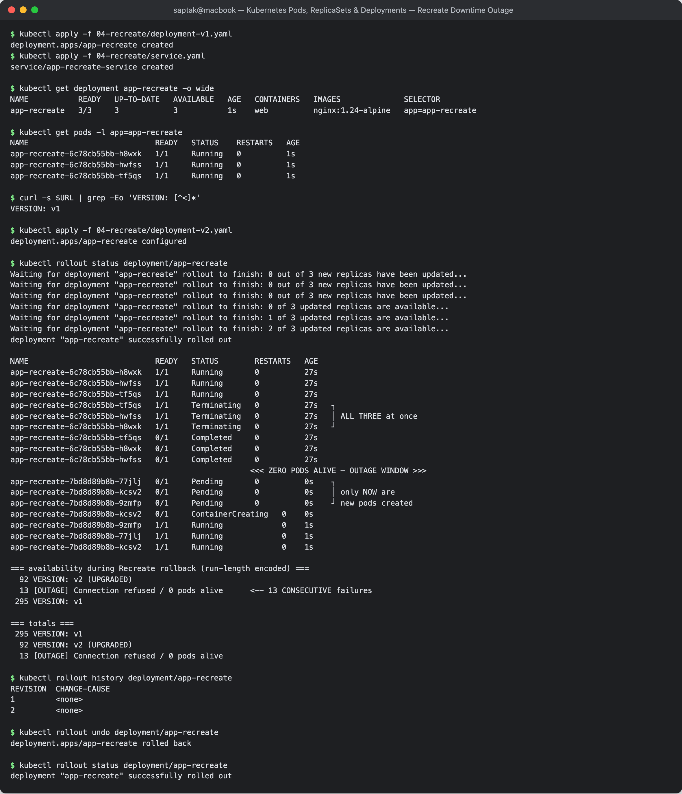

---

## Task 14: Minikube Docker-Driver NodePort & Tunnel Gotcha

Every NodePort test in this document goes through `minikube service --url` rather than `curl <minikube-ip>:<nodePort>`, because the direct route **does not work** on macOS with the Docker driver. Demonstrated:

```
$ minikube ip
192.168.49.2

$ curl -s --connect-timeout 5 http://192.168.49.2:30020
(curl exit code: 28)          # 28 = Operation timed out
```

**Root cause.** With the Docker driver, each Kubernetes node is a **Docker container**, and `192.168.49.2` is an address on Docker's internal bridge network. On Linux that bridge is a real interface in the host's network namespace, so the host can route to it. On **macOS and Windows**, Docker Desktop runs the whole engine inside a lightweight Linux VM — the bridge lives inside that VM, and the Mac has no route to `192.168.49.0/24`. The packet is not refused, it is simply unrouteable, hence a **timeout** (exit 28) rather than a connection-refused (exit 7).

```
macOS host                                        Docker Desktop VM
┌──────────────────┐                              ┌────────────────────────────┐
│  curl 192.168.49.2:30020                        │  docker bridge 192.168.49.0/24
│        │                                        │   ┌──────────────────────┐ │
│        └──── X  no route ────────────────────►  │   │ minikube container   │ │
│                                                 │   │  :30020 open here    │ │
│  curl 127.0.0.1:62278  ──── port-forward ─────► │   └──────────────────────┘ │
└──────────────────┘                              └────────────────────────────┘
```

**Workaround 1 — `minikube service <svc> --url`** (used throughout this document):

```
$ minikube service myapp-service --url
http://127.0.0.1:62278
! Because you are using a Docker driver on darwin, the terminal needs to be open to run it.

$ curl -s http://127.0.0.1:62278
BLUE ENVIRONMENT
```

minikube opens a local port-forward from a random `127.0.0.1` port into the node's NodePort. The warning is the important part: **the process must stay running** — close the terminal and the tunnel dies. Note the forwarded port (`62278`) is *not* the nodePort (`30020`); the mapping is chosen at random each time, so never hard-code it.

**Workaround 2 — `minikube tunnel`** for `type: LoadBalancer`. It runs a privileged process that creates a route and assigns a real `EXTERNAL-IP` to LoadBalancer Services, so they become reachable on their normal port (80/443) with no high port number. It requires `sudo` and must also stay running.

| Approach | Works on Linux | Works on macOS/Windows Docker driver | Notes |
| --- | --- | --- | --- |
| `curl $(minikube ip):30080` | yes | **no** (timeout) | bridge is unreachable from the host |
| `minikube service <svc> --url` | yes | **yes** | random local port; terminal must stay open |
| `minikube tunnel` | yes | **yes** | for `type: LoadBalancer`; needs sudo |
| `kubectl port-forward svc/<svc> 8080:80` | yes | **yes** | driver-independent; bypasses NodePort entirely |

> **Takeaway:** a NodePort Service that "does not work" on a Mac is almost never a broken manifest. Check `kubectl get endpoints <svc>` first — if the endpoints are populated, the Service is fine and the problem is host-to-node routing.

**Screenshot:** 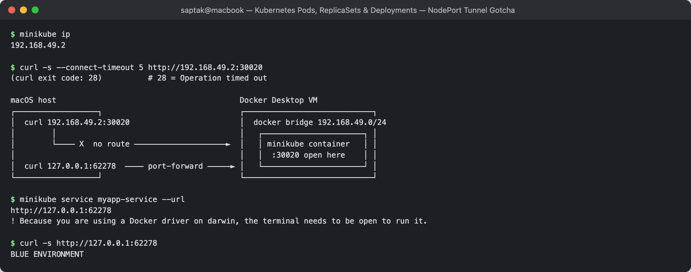

---

## Cleanup

```bash
kubectl delete -f 04-recreate/service.yaml -f 04-recreate/deployment-v1.yaml
kubectl delete -f 03-canary/service.yaml -f 03-canary/deployment-canary.yaml -f 03-canary/deployment-stable.yaml
kubectl delete -f 02-blue-green/service-blue.yaml -f 02-blue-green/deployment-blue.yaml -f 02-blue-green/deployment-green.yaml
kubectl delete -f 01-rolling-update/service.yaml -f 01-rolling-update/deployment-v1.yaml
kubectl delete -f k8s-core-objects/statefulset-fixed.yml
kubectl delete pvc --all
```

---

## Files added during this session

| File | Why |
| --- | --- |
| [`k8s-core-objects/statefulset-fixed.yml`](./k8s-core-objects/statefulset-fixed.yml) | arm64-compatible MySQL (`8.0`) + the headless Service that `spec.serviceName` requires |
| [`troubleshooting/selector-mismatch-fixed.yaml`](./troubleshooting/selector-mismatch-fixed.yaml) | the corrected manifest for Drill 2 (the broken original is kept intentionally) |

---

## Resources

- k8s core objects: https://github.com/Nency-Ravaliya/Kubernetes/blob/main/core-objects.md
- https://github.com/Nency-Ravaliya/Kubernetes
- https://kubernetes.io/docs/concepts/workloads/controllers/deployment/
- https://kubernetes.io/docs/concepts/workloads/pods/pod-lifecycle/
- https://kubernetes.io/docs/tasks/configure-pod-container/configure-liveness-readiness-startup-probes/
