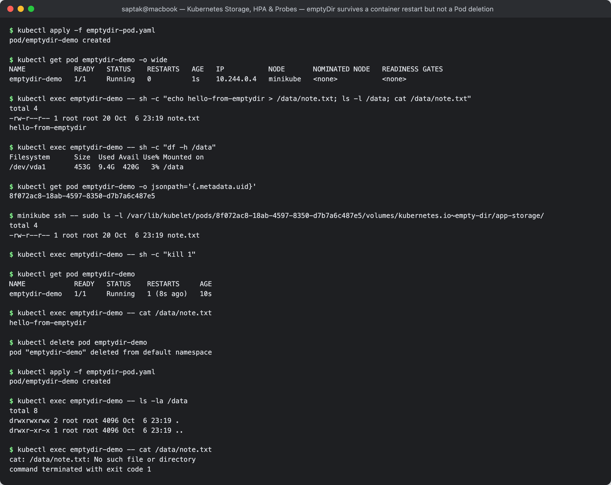
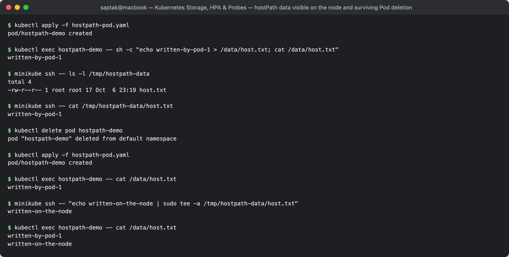
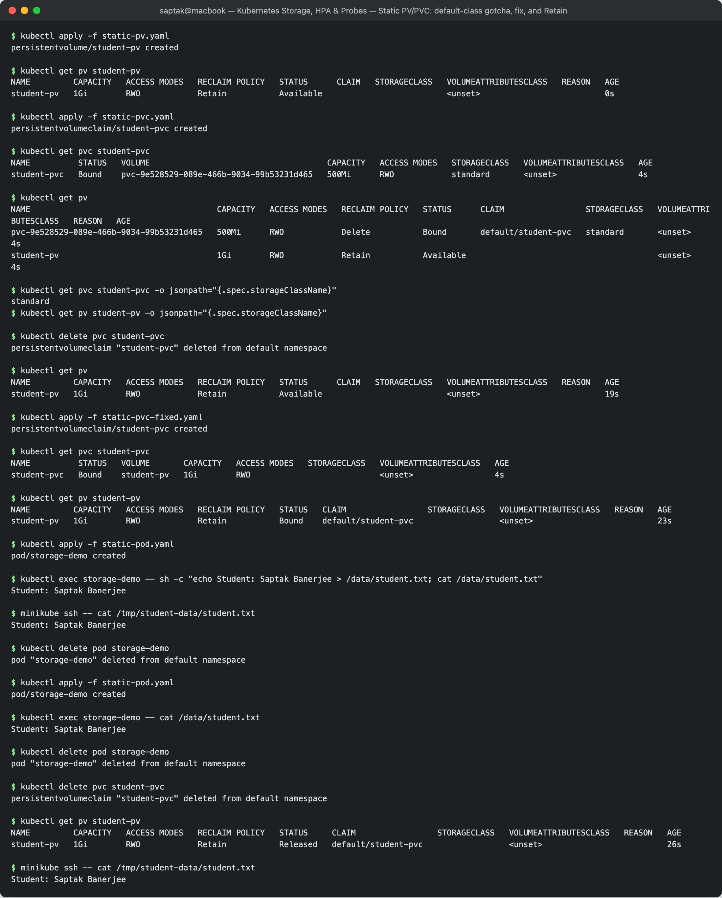
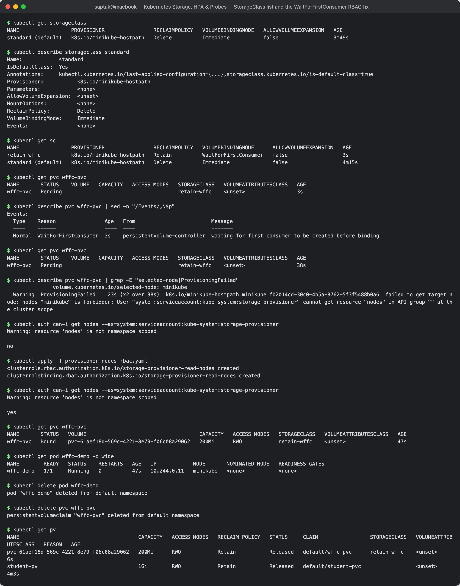
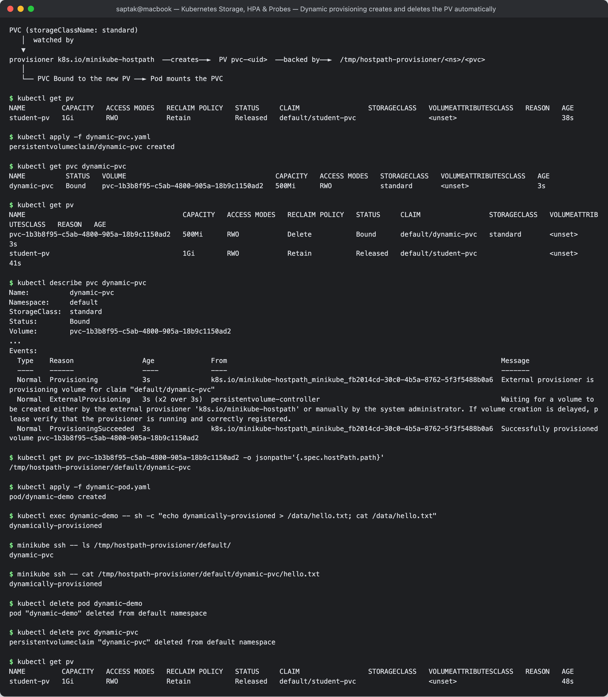

# Kubernetes Volumes

**Author:** Saptak Banerjee
**Course:** SST DevOps & Cloud [SWE]
**Session:** 13 — Kubernetes Storage, HPA & Probes (Task 1)
**Source material:** [`devops-heros/session-13-storage-hpa-probes`](https://github.com/Nency-Ravaliya/devops-heros/tree/main/session-13-storage-hpa-probes) (`01-volumes`, `02-persistent-storage`, `03-storageclass`)

**Cluster:** single-node minikube v1.39 (docker driver), Kubernetes **v1.37.0**, containerd 2.3.4, default StorageClass `standard` (`k8s.io/minikube-hostpath`). Every output below is a real capture.

---

## Table of Contents

| # | Topic |
| --- | --- |
| 0 | [The problem volumes solve](#0-the-problem-volumes-solve) |
| 1 | [emptyDir](#1-emptydir) |
| 2 | [hostPath](#2-hostpath) |
| 3 | [PersistentVolume and PersistentVolumeClaim (static provisioning)](#3-persistentvolume-and-persistentvolumeclaim-static-provisioning) |
| 4 | [StorageClass](#4-storageclass) |
| 5 | [Dynamic provisioning](#5-dynamic-provisioning) |
| 6 | [Comparison table](#6-comparison-table) |

Files in this folder:

| File | From | Used in |
| --- | --- | --- |
| [`emptydir-pod.yaml`](./emptydir-pod.yaml) | class `01-volumes/` | §1 |
| [`hostpath-pod.yaml`](./hostpath-pod.yaml) | class `01-volumes/` | §2 |
| [`static-pv.yaml`](./static-pv.yaml), [`static-pvc.yaml`](./static-pvc.yaml), [`static-pod.yaml`](./static-pod.yaml) | class `02-persistent-storage/` (renamed) | §3 |
| [`static-pvc-fixed.yaml`](./static-pvc-fixed.yaml) | added | §3 — the claim that actually binds to the static PV on minikube |
| [`dynamic-pvc.yaml`](./dynamic-pvc.yaml) | class `03-storageclass/pvc.yaml` | §5 |
| [`dynamic-pod.yaml`](./dynamic-pod.yaml) | added | §5 — a Pod that mounts the dynamic claim |
| [`custom-storageclass.yaml`](./custom-storageclass.yaml) | added | §4 — `Retain` + `WaitForFirstConsumer` class |
| [`provisioner-nodes-rbac.yaml`](./provisioner-nodes-rbac.yaml) | added | §4 — fix for a minikube provisioner RBAC gap found during the lab |

---

## 0. The problem volumes solve

A container's root filesystem is a writable layer on top of its image. That layer is destroyed when the container is
replaced, so anything an app writes to it disappears on a restart. Kubernetes volumes let you mount storage at a path
inside the container; the volume type decides how long that storage lives:

```text
container lifetime  <  Pod lifetime  <  node lifetime  <  cluster/storage lifetime
  (container fs)       (emptyDir)       (hostPath)         (PV / PVC)
```

The sections below prove each of those lifetimes on a real cluster.

---

## 1. emptyDir

An `emptyDir` is created empty when the Pod is scheduled on a node, is shared by every container in the Pod, survives
container restarts, and is **deleted when the Pod is deleted**. Typical uses: scratch space, caches, sharing files
between a main container and a sidecar. (`emptyDir: { medium: Memory }` makes it a RAM-backed tmpfs.)

```yaml
  volumes:
    - name: app-storage
      emptyDir: {}
```

### Write a file

```
$ kubectl apply -f emptydir-pod.yaml
pod/emptydir-demo created

$ kubectl get pod emptydir-demo -o wide
NAME            READY   STATUS    RESTARTS   AGE   IP           NODE       NOMINATED NODE   READINESS GATES
emptydir-demo   1/1     Running   0          1s    10.244.0.4   minikube   <none>           <none>

$ kubectl exec emptydir-demo -- sh -c "echo hello-from-emptydir > /data/note.txt; ls -l /data; cat /data/note.txt"
total 4
-rw-r--r-- 1 root root 20 Oct  6 23:19 note.txt
hello-from-emptydir

$ kubectl exec emptydir-demo -- sh -c "df -h /data"
Filesystem      Size  Used Avail Use% Mounted on
/dev/vda1       453G  9.4G  420G   3% /data
```

### Where it really lives on the node

The volume is just a directory under the kubelet's per-Pod folder, keyed by the Pod's UID:

```
$ kubectl get pod emptydir-demo -o jsonpath='{.metadata.uid}'
8f072ac8-18ab-4597-8350-d7b7a6c487e5

$ minikube ssh -- sudo ls -l /var/lib/kubelet/pods/8f072ac8-18ab-4597-8350-d7b7a6c487e5/volumes/kubernetes.io~empty-dir/app-storage/
total 4
-rw-r--r-- 1 root root 20 Oct  6 23:19 note.txt
```

### Container restart: data survives

Killing PID 1 (the nginx master) makes the kubelet restart the **container**; the Pod (and its UID, and so its
emptyDir) stays:

```
$ kubectl exec emptydir-demo -- sh -c "kill 1"

$ kubectl get pod emptydir-demo
NAME            READY   STATUS    RESTARTS     AGE
emptydir-demo   1/1     Running   1 (8s ago)   10s

$ kubectl exec emptydir-demo -- cat /data/note.txt
hello-from-emptydir
```

### Pod deletion: data is gone

```
$ kubectl delete pod emptydir-demo
pod "emptydir-demo" deleted from default namespace

$ kubectl apply -f emptydir-pod.yaml
pod/emptydir-demo created

$ kubectl exec emptydir-demo -- ls -la /data
total 8
drwxrwxrwx 2 root root 4096 Oct  6 23:19 .
drwxr-xr-x 1 root root 4096 Oct  6 23:19 ..

$ kubectl exec emptydir-demo -- cat /data/note.txt
cat: /data/note.txt: No such file or directory
command terminated with exit code 1
```

**Learned:** emptyDir lifetime = Pod lifetime. `RESTARTS 1` with the file intact versus a brand-new Pod with an empty
directory is exactly that boundary.

**Screenshot:** 

---

## 2. hostPath

A `hostPath` volume mounts a directory **from the node's own filesystem** into the Pod. Data outlives the Pod, but it
is tied to that one node: a Pod rescheduled to a different node sees a different (probably empty) directory. It also
gives the Pod direct access to the host, which is a security risk, so it is used mainly by system DaemonSets
(log collectors, CNI plugins) and in single-node labs.

```yaml
  volumes:
    - name: host-storage
      hostPath:
        path: /tmp/hostpath-data
        type: DirectoryOrCreate   # create the directory on the node if it is missing
```

```
$ kubectl apply -f hostpath-pod.yaml
pod/hostpath-demo created

$ kubectl exec hostpath-demo -- sh -c "echo written-by-pod-1 > /data/host.txt; cat /data/host.txt"
written-by-pod-1

$ minikube ssh -- ls -l /tmp/hostpath-data
total 4
-rw-r--r-- 1 root root 17 Oct  6 23:19 host.txt

$ minikube ssh -- cat /tmp/hostpath-data/host.txt
written-by-pod-1
```

The file is visible directly on the node. Now delete the Pod and create a new one:

```
$ kubectl delete pod hostpath-demo
pod "hostpath-demo" deleted from default namespace

$ kubectl apply -f hostpath-pod.yaml
pod/hostpath-demo created

$ kubectl exec hostpath-demo -- cat /data/host.txt
written-by-pod-1
```

And it is a two-way window onto the host — a write made on the node appears inside the container immediately:

```
$ minikube ssh -- "echo written-on-the-node | sudo tee -a /tmp/hostpath-data/host.txt"
written-on-the-node

$ kubectl exec hostpath-demo -- cat /data/host.txt
written-by-pod-1
written-on-the-node
```

**Learned:** hostPath lifetime = node lifetime. It persisted across Pods only because this cluster has one node.

**Screenshot:** 

---

## 3. PersistentVolume and PersistentVolumeClaim (static provisioning)

Kubernetes separates **providing** storage from **using** it:

| Object | Scope | Who creates it | Analogy |
| --- | --- | --- | --- |
| **PersistentVolume (PV)** | cluster-wide | admin (static) or a provisioner (dynamic) | a disk sitting in the storage room |
| **PersistentVolumeClaim (PVC)** | namespaced | the app team | a request form: "I need 500Mi, RWO" |
| Pod | namespaced | the app team | mounts the claim by name, never the PV directly |

The control plane binds a PVC to a PV that satisfies its size, access mode and **StorageClass**. Binding is 1:1.

Access modes: `ReadWriteOnce` (RWO, one node read-write), `ReadOnlyMany` (ROX), `ReadWriteMany` (RWX),
`ReadWriteOncePod` (RWOP, exactly one Pod). Reclaim policy: `Retain` (keep the PV and data after the PVC is deleted)
or `Delete` (delete the PV and backing storage).

### 3.1 Apply the class files as-is — and hit a real gotcha

```
$ kubectl apply -f static-pv.yaml
persistentvolume/student-pv created

$ kubectl get pv student-pv
NAME         CAPACITY   ACCESS MODES   RECLAIM POLICY   STATUS      CLAIM   STORAGECLASS   VOLUMEATTRIBUTESCLASS   REASON   AGE
student-pv   1Gi        RWO            Retain           Available                          <unset>                          0s

$ kubectl apply -f static-pvc.yaml
persistentvolumeclaim/student-pvc created

$ kubectl get pvc student-pvc
NAME          STATUS   VOLUME                                     CAPACITY   ACCESS MODES   STORAGECLASS   VOLUMEATTRIBUTESCLASS   AGE
student-pvc   Bound    pvc-9e528529-089e-466b-9034-99b53231d465   500Mi      RWO            standard       <unset>                 4s

$ kubectl get pv
NAME                                       CAPACITY   ACCESS MODES   RECLAIM POLICY   STATUS      CLAIM                 STORAGECLASS   VOLUMEATTRIBUTESCLASS   REASON   AGE
pvc-9e528529-089e-466b-9034-99b53231d465   500Mi      RWO            Delete           Bound       default/student-pvc   standard       <unset>                          4s
student-pv                                 1Gi        RWO            Retain           Available                                        <unset>                          4s
```

The claim is `Bound`, but **not to `student-pv`** — a new `pvc-9e52…` volume appeared and `student-pv` is still
`Available`. Root cause:

```
$ kubectl get pvc student-pvc -o jsonpath="{.spec.storageClassName}"
standard
$ kubectl get pv student-pv -o jsonpath="{.spec.storageClassName}"
```

(The second command prints nothing — the PV has no class.)

`static-pvc.yaml` does not set `storageClassName`, so the **DefaultStorageClass admission plugin** stamped
`standard` onto it at creation time. A PVC of class `standard` can only bind to a PV of class `standard`; `student-pv`
has no class, so the `standard` provisioner dynamically created a fresh volume instead. The class's `readme1.md` shows
`student-pvc Bound student-pv`, which is only true on a cluster with **no** default StorageClass.

### 3.2 The fix: `storageClassName: ""`

[`static-pvc-fixed.yaml`](./static-pvc-fixed.yaml) is identical except for `storageClassName: ""`, which explicitly
means "no class — only bind to a pre-created PV with no class":

```
$ kubectl delete pvc student-pvc
persistentvolumeclaim "student-pvc" deleted from default namespace

$ kubectl get pv
NAME         CAPACITY   ACCESS MODES   RECLAIM POLICY   STATUS      CLAIM   STORAGECLASS   VOLUMEATTRIBUTESCLASS   REASON   AGE
student-pv   1Gi        RWO            Retain           Available                          <unset>                          19s

$ kubectl apply -f static-pvc-fixed.yaml
persistentvolumeclaim/student-pvc created

$ kubectl get pvc student-pvc
NAME          STATUS   VOLUME       CAPACITY   ACCESS MODES   STORAGECLASS   VOLUMEATTRIBUTESCLASS   AGE
student-pvc   Bound    student-pv   1Gi        RWO                           <unset>                 4s

$ kubectl get pv student-pv
NAME         CAPACITY   ACCESS MODES   RECLAIM POLICY   STATUS   CLAIM                 STORAGECLASS   VOLUMEATTRIBUTESCLASS   REASON   AGE
student-pv   1Gi        RWO            Retain           Bound    default/student-pvc                  <unset>                          23s
```

Two things to notice: (1) deleting the first claim also deleted the auto-created `pvc-9e52…` PV (its policy was
`Delete`); (2) the claim asked for 500Mi but shows **1Gi** — a claim binds to a whole PV, so it gets the PV's full
capacity.

### 3.3 Data survives the Pod

```
$ kubectl apply -f static-pod.yaml
pod/storage-demo created

$ kubectl exec storage-demo -- sh -c "echo Student: Saptak Banerjee > /data/student.txt; cat /data/student.txt"
Student: Saptak Banerjee

$ minikube ssh -- cat /tmp/student-data/student.txt
Student: Saptak Banerjee

$ kubectl delete pod storage-demo
pod "storage-demo" deleted from default namespace

$ kubectl apply -f static-pod.yaml
pod/storage-demo created

$ kubectl exec storage-demo -- cat /data/student.txt
Student: Saptak Banerjee
```

### 3.4 `Retain`: data survives even the claim

```
$ kubectl delete pod storage-demo
pod "storage-demo" deleted from default namespace

$ kubectl delete pvc student-pvc
persistentvolumeclaim "student-pvc" deleted from default namespace

$ kubectl get pv student-pv
NAME         CAPACITY   ACCESS MODES   RECLAIM POLICY   STATUS     CLAIM                 STORAGECLASS   VOLUMEATTRIBUTESCLASS   REASON   AGE
student-pv   1Gi        RWO            Retain           Released   default/student-pvc                  <unset>                          26s

$ minikube ssh -- cat /tmp/student-data/student.txt
Student: Saptak Banerjee
```

`Released` means "the claim is gone but the data is kept". A Released PV is **not** reusable by a new claim until an
admin cleans it (delete and recreate the PV, or remove `spec.claimRef`) — a deliberate safety net so one team's data
is never handed to another claim.

**Screenshot:** 

---

## 4. StorageClass

A StorageClass describes **a kind of storage** and **who creates it**: the `provisioner` (driver), its `parameters`
(disk type, IOPS, filesystem…), the `reclaimPolicy` for volumes it creates, and the `volumeBindingMode`. One class can
be marked default. On a cloud cluster you might have `gp3` (AWS EBS), `standard-rwo` (GKE PD) or `azurefile`; on
minikube there is one:

```
$ kubectl get storageclass
NAME                 PROVISIONER                RECLAIMPOLICY   VOLUMEBINDINGMODE   ALLOWVOLUMEEXPANSION   AGE
standard (default)   k8s.io/minikube-hostpath   Delete          Immediate           false                  3m49s

$ kubectl describe storageclass standard
Name:            standard
IsDefaultClass:  Yes
Annotations:     kubectl.kubernetes.io/last-applied-configuration={...},storageclass.kubernetes.io/is-default-class=true
Provisioner:           k8s.io/minikube-hostpath
Parameters:            <none>
AllowVolumeExpansion:  <unset>
MountOptions:          <none>
ReclaimPolicy:         Delete
VolumeBindingMode:     Immediate
Events:                <none>
```

### A custom class: `Retain` + `WaitForFirstConsumer`

`Immediate` binding provisions the moment a PVC is created. In a multi-zone cluster that can create a disk in zone A
while the Pod is later scheduled in zone B. `WaitForFirstConsumer` delays provisioning until a Pod using the claim is
scheduled, so the volume is created where the Pod runs. [`custom-storageclass.yaml`](./custom-storageclass.yaml)
defines such a class plus a claim and a Pod.

PVC alone (no Pod yet):

```
$ kubectl get sc
NAME                 PROVISIONER                RECLAIMPOLICY   VOLUMEBINDINGMODE      ALLOWVOLUMEEXPANSION   AGE
retain-wffc          k8s.io/minikube-hostpath   Retain          WaitForFirstConsumer   false                  3s
standard (default)   k8s.io/minikube-hostpath   Delete          Immediate              false                  4m15s

$ kubectl get pvc wffc-pvc
NAME       STATUS    VOLUME   CAPACITY   ACCESS MODES   STORAGECLASS   VOLUMEATTRIBUTESCLASS   AGE
wffc-pvc   Pending                                      retain-wffc    <unset>                 3s

$ kubectl describe pvc wffc-pvc | sed -n "/Events/,\$p"
Events:
  Type    Reason                Age   From                         Message
  ----    ------                ----  ----                         -------
  Normal  WaitForFirstConsumer  3s    persistentvolume-controller  waiting for first consumer to be created before binding
```

`Pending` here is expected. But after adding the Pod, the claim **stayed Pending for two minutes**. Investigation:

```
$ kubectl get pvc wffc-pvc
NAME       STATUS    VOLUME   CAPACITY   ACCESS MODES   STORAGECLASS   VOLUMEATTRIBUTESCLASS   AGE
wffc-pvc   Pending                                      retain-wffc    <unset>                 38s

$ kubectl describe pvc wffc-pvc | grep -E "selected-node|ProvisioningFailed"
               volume.kubernetes.io/selected-node: minikube
  Warning  ProvisioningFailed    23s (x2 over 38s)  k8s.io/minikube-hostpath_minikube_fb2014cd-30c0-4b5a-8762-5f3f5488b0a6  failed to get target node: nodes "minikube" is forbidden: User "system:serviceaccount:kube-system:storage-provisioner" cannot get resource "nodes" in API group "" at the cluster scope

$ kubectl auth can-i get nodes --as=system:serviceaccount:kube-system:storage-provisioner
Warning: resource 'nodes' is not namespace scoped

no
```

The scheduler did its part (it annotated the claim with `selected-node: minikube`), but minikube's bundled
provisioner then needs to **read that Node object**, and its service account is not allowed to. Granting read access
to nodes ([`provisioner-nodes-rbac.yaml`](./provisioner-nodes-rbac.yaml)) fixes it on the provisioner's next retry:

```
$ kubectl apply -f provisioner-nodes-rbac.yaml
clusterrole.rbac.authorization.k8s.io/storage-provisioner-read-nodes created
clusterrolebinding.rbac.authorization.k8s.io/storage-provisioner-read-nodes created

$ kubectl auth can-i get nodes --as=system:serviceaccount:kube-system:storage-provisioner
Warning: resource 'nodes' is not namespace scoped

yes

$ kubectl get pvc wffc-pvc
NAME       STATUS   VOLUME                                     CAPACITY   ACCESS MODES   STORAGECLASS   VOLUMEATTRIBUTESCLASS   AGE
wffc-pvc   Bound    pvc-61aef18d-569c-4221-8e79-f06c08a29062   200Mi      RWO            retain-wffc    <unset>                 47s

$ kubectl get pod wffc-demo -o wide
NAME        READY   STATUS    RESTARTS   AGE   IP            NODE       NOMINATED NODE   READINESS GATES
wffc-demo   1/1     Running   0          47s   10.244.0.11   minikube   <none>           <none>
```

And because this class says `Retain`, deleting the claim leaves the dynamically created PV behind as `Released`
(compare with `standard`'s `Delete` behaviour in §5):

```
$ kubectl delete pod wffc-demo
pod "wffc-demo" deleted from default namespace

$ kubectl delete pvc wffc-pvc
persistentvolumeclaim "wffc-pvc" deleted from default namespace

$ kubectl get pv
NAME                                       CAPACITY   ACCESS MODES   RECLAIM POLICY   STATUS     CLAIM                 STORAGECLASS   VOLUMEATTRIBUTESCLASS   REASON   AGE
pvc-61aef18d-569c-4221-8e79-f06c08a29062   200Mi      RWO            Retain           Released   default/wffc-pvc      retain-wffc    <unset>                          6s
student-pv                                 1Gi        RWO            Retain           Released   default/student-pvc                  <unset>                          4m3s
```

**Screenshot:** 

---

## 5. Dynamic provisioning

With static provisioning an admin must pre-create every PV. With **dynamic provisioning** the PVC names a StorageClass
and that class's provisioner creates a matching PV on demand. This is how almost all real clusters work (EBS, Persistent
Disk, Azure Disk, Ceph, Longhorn…).

```text
PVC (storageClassName: standard)
   │  watched by
   ▼
provisioner k8s.io/minikube-hostpath  ──creates──►  PV pvc-<uid>  ──backed by──►  /tmp/hostpath-provisioner/<ns>/<pvc>
   │
   └── PVC Bound to the new PV ──► Pod mounts the PVC
```

```
$ kubectl get pv
NAME         CAPACITY   ACCESS MODES   RECLAIM POLICY   STATUS     CLAIM                 STORAGECLASS   VOLUMEATTRIBUTESCLASS   REASON   AGE
student-pv   1Gi        RWO            Retain           Released   default/student-pvc                  <unset>                          38s

$ kubectl apply -f dynamic-pvc.yaml
persistentvolumeclaim/dynamic-pvc created

$ kubectl get pvc dynamic-pvc
NAME          STATUS   VOLUME                                     CAPACITY   ACCESS MODES   STORAGECLASS   VOLUMEATTRIBUTESCLASS   AGE
dynamic-pvc   Bound    pvc-1b3b8f95-c5ab-4800-905a-18b9c1150ad2   500Mi      RWO            standard       <unset>                 3s

$ kubectl get pv
NAME                                       CAPACITY   ACCESS MODES   RECLAIM POLICY   STATUS     CLAIM                 STORAGECLASS   VOLUMEATTRIBUTESCLASS   REASON   AGE
pvc-1b3b8f95-c5ab-4800-905a-18b9c1150ad2   500Mi      RWO            Delete           Bound      default/dynamic-pvc   standard       <unset>                          3s
student-pv                                 1Gi        RWO            Retain           Released   default/student-pvc                  <unset>                          41s
```

Nobody wrote a PV, yet one now exists — sized exactly 500Mi and inheriting the class's `Delete` policy. The events show
the hand-off between the controller and the external provisioner:

```
$ kubectl describe pvc dynamic-pvc
Name:          dynamic-pvc
Namespace:     default
StorageClass:  standard
Status:        Bound
Volume:        pvc-1b3b8f95-c5ab-4800-905a-18b9c1150ad2
...
Events:
  Type    Reason                 Age              From                                                                    Message
  ----    ------                 ----             ----                                                                    -------
  Normal  Provisioning           3s               k8s.io/minikube-hostpath_minikube_fb2014cd-30c0-4b5a-8762-5f3f5488b0a6  External provisioner is provisioning volume for claim "default/dynamic-pvc"
  Normal  ExternalProvisioning   3s (x2 over 3s)  persistentvolume-controller                                             Waiting for a volume to be created either by the external provisioner 'k8s.io/minikube-hostpath' or manually by the system administrator. If volume creation is delayed, please verify that the provisioner is running and correctly registered.
  Normal  ProvisioningSucceeded  3s               k8s.io/minikube-hostpath_minikube_fb2014cd-30c0-4b5a-8762-5f3f5488b0a6  Successfully provisioned volume pvc-1b3b8f95-c5ab-4800-905a-18b9c1150ad2

$ kubectl get pv pvc-1b3b8f95-c5ab-4800-905a-18b9c1150ad2 -o jsonpath='{.spec.hostPath.path}'
/tmp/hostpath-provisioner/default/dynamic-pvc
```

Use it from a Pod ([`dynamic-pod.yaml`](./dynamic-pod.yaml)) and find the bytes on the node:

```
$ kubectl apply -f dynamic-pod.yaml
pod/dynamic-demo created

$ kubectl exec dynamic-demo -- sh -c "echo dynamically-provisioned > /data/hello.txt; cat /data/hello.txt"
dynamically-provisioned

$ minikube ssh -- ls /tmp/hostpath-provisioner/default/
dynamic-pvc

$ minikube ssh -- cat /tmp/hostpath-provisioner/default/dynamic-pvc/hello.txt
dynamically-provisioned
```

`reclaimPolicy: Delete` — deleting the claim deletes the PV too (only the hand-made `student-pv` is left):

```
$ kubectl delete pod dynamic-demo
pod "dynamic-demo" deleted from default namespace

$ kubectl delete pvc dynamic-pvc
persistentvolumeclaim "dynamic-pvc" deleted from default namespace

$ kubectl get pv
NAME         CAPACITY   ACCESS MODES   RECLAIM POLICY   STATUS     CLAIM                 STORAGECLASS   VOLUMEATTRIBUTESCLASS   REASON   AGE
student-pv   1Gi        RWO            Retain           Released   default/student-pvc                  <unset>                          48s
```

**Screenshot:** 

---

## 6. Comparison table

| | emptyDir | hostPath | Static PV + PVC | Dynamic (StorageClass) |
| --- | --- | --- | --- | --- |
| Lifetime | Pod | node | until the PV is deleted | per `reclaimPolicy` |
| Survives container restart | yes | yes | yes | yes |
| Survives Pod deletion | **no** | yes (same node only) | yes | yes |
| Follows the Pod to another node | n/a | **no** | yes (network/cloud storage) | yes |
| Who creates the storage | kubelet | node admin | cluster admin writes the PV | provisioner, on demand |
| Typical use | cache, scratch, sidecar sharing | node agents, single-node labs | pre-existing NFS/disk | databases, any stateful app |
| Gotcha seen in this lab | — | security: full host access | default StorageClass hijacks the claim unless `storageClassName: ""` | minikube provisioner needs `get nodes` for `WaitForFirstConsumer` |

## Cleanup

```bash
kubectl delete pv student-pv pvc-61aef18d-569c-4221-8e79-f06c08a29062
kubectl delete -f custom-storageclass.yaml --ignore-not-found
kubectl delete -f provisioner-nodes-rbac.yaml
minikube ssh -- sudo rm -rf /tmp/student-data /tmp/hostpath-data
```

## References

- https://kubernetes.io/docs/concepts/storage/volumes/
- https://kubernetes.io/docs/concepts/storage/persistent-volumes/
- https://kubernetes.io/docs/concepts/storage/storage-classes/
- https://kubernetes.io/docs/concepts/storage/dynamic-provisioning/
