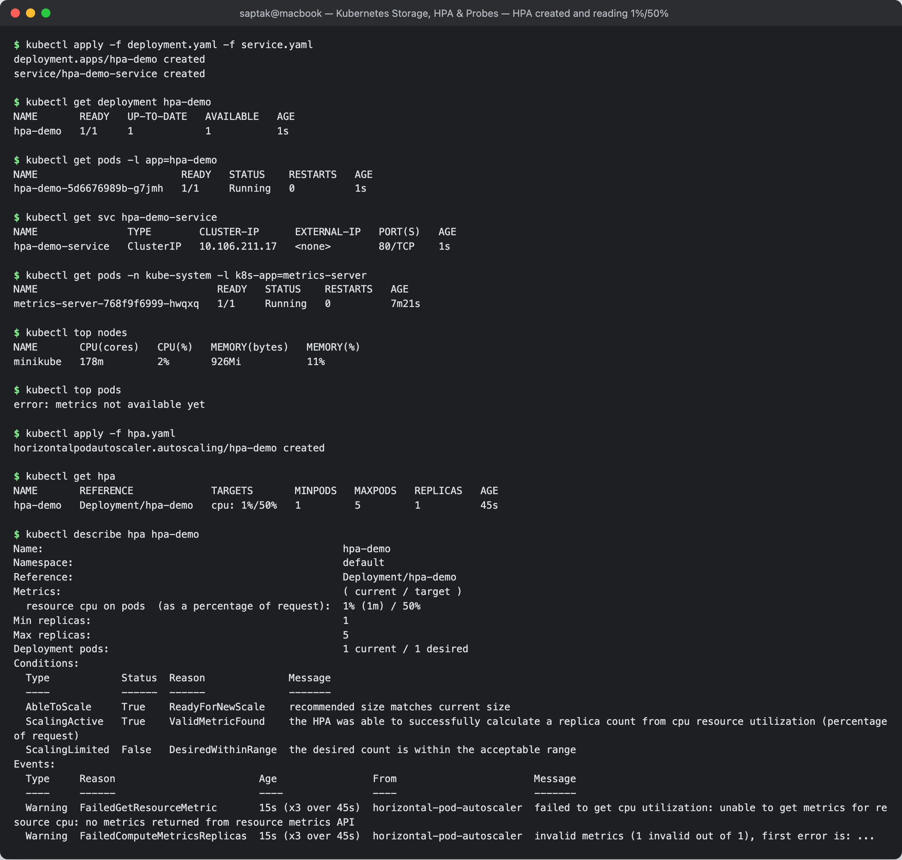
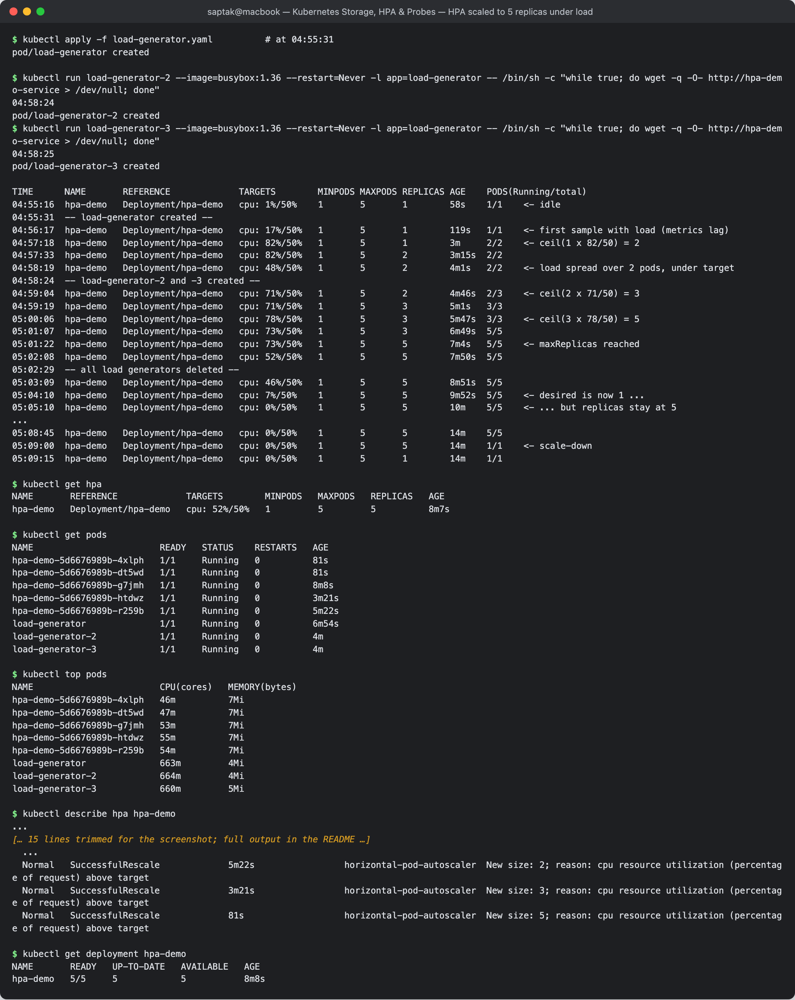
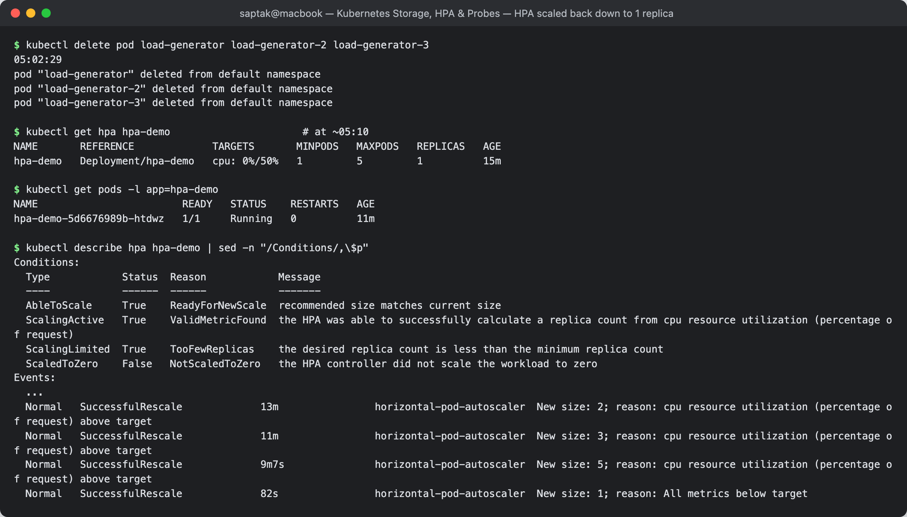
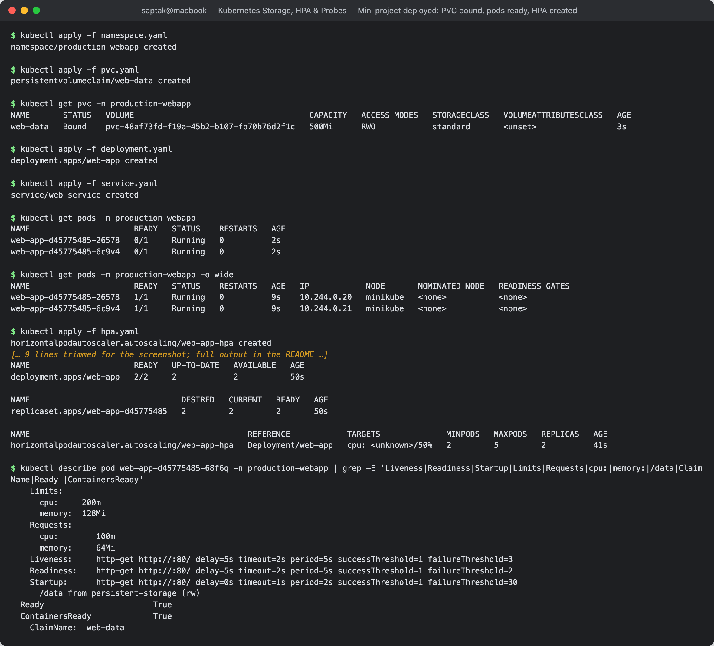
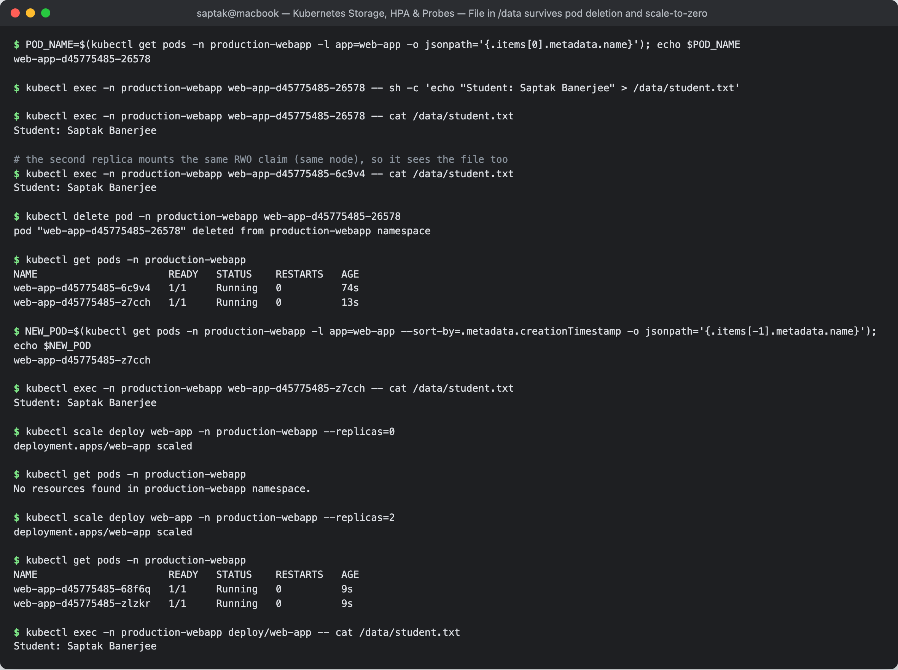
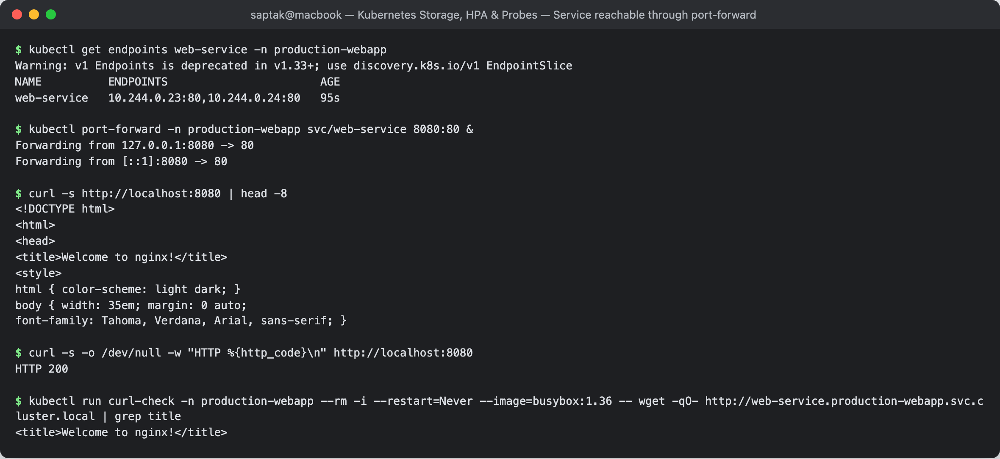
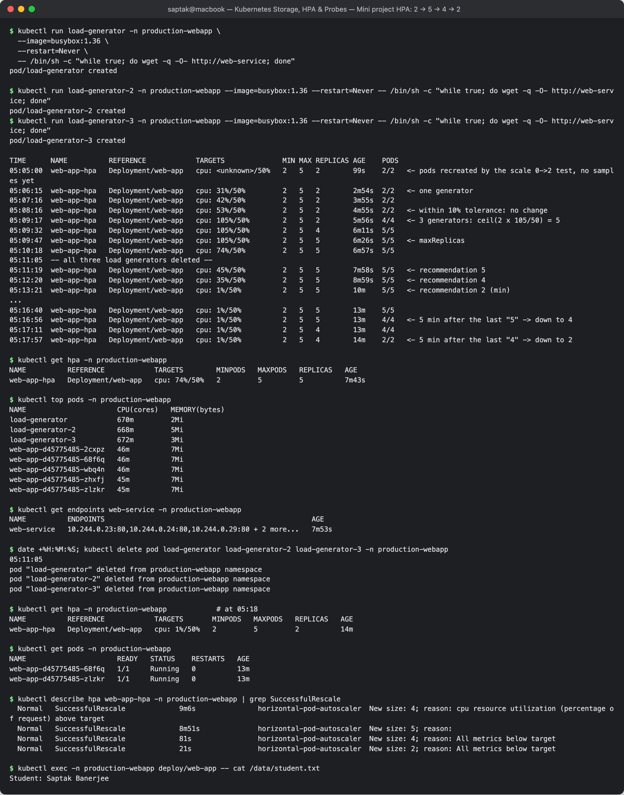
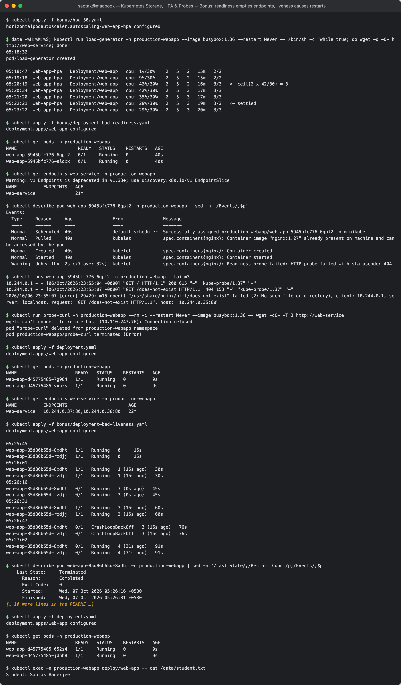

# Kubernetes Storage, HPA & Probes

**Author:** Saptak Banerjee
**Course:** SST DevOps & Cloud [SWE]
**Session:** 13 — Kubernetes Storage, HPA & Probes
**Source material:** [`devops-heros/session-13-storage-hpa-probes`](https://github.com/Nency-Ravaliya/devops-heros/tree/main/session-13-storage-hpa-probes)

**Cluster:** single-node minikube v1.39 (docker driver, 4 CPU / 5 GB), Kubernetes **v1.37.0**, `metrics-server` v0.9.0 addon, default StorageClass `standard`. Every output below is a real capture (times are IST).

---

## Table of Contents

| # | Task |
| --- | --- |
| 1 | [Kubernetes Volumes](#task-1-kubernetes-volumes) — full write-up in [`01-kubernetes-volumes/README.md`](./01-kubernetes-volumes/README.md) |
| 2 | [HPA Hands-on](#task-2-hpa-hands-on) |
| 3 | [Mini Project — Production-Ready Kubernetes Web App](#task-3-mini-project--production-ready-kubernetes-web-app) |
| — | [Cleanup](#cleanup) |

### Folder layout

```text
Kubernetes Storage, HPA & Probes/
├── README.md                       # this file
├── 01-kubernetes-volumes/          # Task 1 (README + every manifest that was run)
├── 02-hpa/
│   ├── deployment.yaml             # class 04-hpa: nginx, requests.cpu 100m, limits.cpu 200m
│   ├── service.yaml                # class 04-hpa: hpa-demo-service
│   ├── hpa.yaml                    # class 04-hpa: the teacher's "hpa.yml" (1-5 replicas, 50% CPU)
│   ├── load-generator.yaml         # busybox wget loop against hpa-demo-service
│   └── hpa-watch-output.txt        # raw 15-second HPA samples from the whole run
├── mini-project/                   # Task 3 (class manifests, unchanged)
└── screenshots/CAPTURE-LIST.md
```

---

## Task 1: Kubernetes Volumes

The teacher asked for this as its own document: **[`01-kubernetes-volumes/README.md`](./01-kubernetes-volumes/README.md)**.
It covers emptyDir, hostPath, PersistentVolume, PersistentVolumeClaim, StorageClass and dynamic provisioning, each with
manifests that were applied on this cluster and the captured output. Summary of what the experiments proved:

| Volume | Proven on this cluster |
| --- | --- |
| `emptyDir` | file survived `kill 1` (container `RESTARTS 1`) but was gone after the Pod was deleted and recreated |
| `hostPath` | file written in the Pod was readable with `minikube ssh` on the node and survived Pod deletion |
| PV + PVC (static) | the class `student-pvc` did **not** bind to `student-pv` — minikube's default StorageClass hijacked it; `storageClassName: ""` fixed it; data survived Pod deletion; `Retain` left the PV `Released` with data intact |
| StorageClass | inspected `standard`; created a `Retain` + `WaitForFirstConsumer` class and found/fixed a minikube provisioner RBAC gap (`cannot get resource "nodes"`) |
| Dynamic provisioning | `dynamic-pvc` produced a `pvc-<uid>` PV automatically, backed by `/tmp/hostpath-provisioner/default/dynamic-pvc`; deleting the claim deleted the PV (`Delete` policy) |

---

## Task 2: HPA Hands-on

**Manifests:** [`02-hpa/`](./02-hpa/) — `deployment.yaml`, `service.yaml` and `hpa.yaml` are the class files from
`04-hpa/`; [`load-generator.yaml`](./02-hpa/load-generator.yaml) is the class's `kubectl run load-generator …` loop as a
manifest.

```yaml
# 02-hpa/hpa.yaml
apiVersion: autoscaling/v2
kind: HorizontalPodAutoscaler
metadata:
  name: hpa-demo
spec:
  scaleTargetRef: { apiVersion: apps/v1, kind: Deployment, name: hpa-demo }
  minReplicas: 1
  maxReplicas: 5
  metrics:
    - type: Resource
      resource:
        name: cpu
        target: { type: Utilization, averageUtilization: 50 }
```

How the numbers are computed: utilization = pod CPU usage ÷ pod CPU **request** (`100m`). The controller (every 15 s)
computes `desired = ceil(current_replicas × current% ÷ 50%)`, clamped to `[1, 5]`.

### Step 1 — Deploy the application

```
$ kubectl apply -f deployment.yaml -f service.yaml
deployment.apps/hpa-demo created
service/hpa-demo-service created

$ kubectl get deployment hpa-demo
NAME       READY   UP-TO-DATE   AVAILABLE   AGE
hpa-demo   1/1     1            1           1s

$ kubectl get pods -l app=hpa-demo
NAME                        READY   STATUS    RESTARTS   AGE
hpa-demo-5d6676989b-g7jmh   1/1     Running   0          1s

$ kubectl get svc hpa-demo-service
NAME               TYPE        CLUSTER-IP      EXTERNAL-IP   PORT(S)   AGE
hpa-demo-service   ClusterIP   10.106.211.17   <none>        80/TCP    1s
```

Metrics Server is the HPA's data source, so check it first:

```
$ kubectl get pods -n kube-system -l k8s-app=metrics-server
NAME                              READY   STATUS    RESTARTS   AGE
metrics-server-768f9f6999-hwqxq   1/1     Running   0          7m21s

$ kubectl top nodes
NAME       CPU(cores)   CPU(%)   MEMORY(bytes)   MEMORY(%)
minikube   178m         2%       926Mi           11%

$ kubectl top pods
error: metrics not available yet
```

`metrics not available yet` is normal for a Pod that is one second old — metrics-server scrapes the kubelet on an
interval and needs at least one sample.

### Steps 2–3 — Configure and verify the HPA

```
$ kubectl apply -f hpa.yaml
horizontalpodautoscaler.autoscaling/hpa-demo created

$ kubectl get hpa
NAME       REFERENCE             TARGETS       MINPODS   MAXPODS   REPLICAS   AGE
hpa-demo   Deployment/hpa-demo   cpu: 1%/50%   1         5         1          45s

$ kubectl describe hpa hpa-demo
Name:                                                  hpa-demo
Namespace:                                             default
Reference:                                             Deployment/hpa-demo
Metrics:                                               ( current / target )
  resource cpu on pods  (as a percentage of request):  1% (1m) / 50%
Min replicas:                                          1
Max replicas:                                          5
Deployment pods:                                       1 current / 1 desired
Conditions:
  Type            Status  Reason              Message
  ----            ------  ------              -------
  AbleToScale     True    ReadyForNewScale    recommended size matches current size
  ScalingActive   True    ValidMetricFound    the HPA was able to successfully calculate a replica count from cpu resource utilization (percentage of request)
  ScalingLimited  False   DesiredWithinRange  the desired count is within the acceptable range
Events:
  Type     Reason                        Age                From                       Message
  ----     ------                        ----               ----                       -------
  Warning  FailedGetResourceMetric       15s (x3 over 45s)  horizontal-pod-autoscaler  failed to get cpu utilization: unable to get metrics for resource cpu: no metrics returned from resource metrics API
  Warning  FailedComputeMetricsReplicas  15s (x3 over 45s)  horizontal-pod-autoscaler  invalid metrics (1 invalid out of 1), first error is: ...
```

The HPA is healthy: `ScalingActive=True / ValidMetricFound` and `1% (1m)` = 1 millicore of a 100m request. The two
warnings are from its first 30 seconds, before metrics-server had a sample — exactly the `<unknown>/50%` window
people often mistake for a broken HPA.

**Screenshot:** 

### Steps 4–5 — Deploy the load generator, then increase the load

A sampler printed `kubectl get hpa` plus the running/total Pod count every 15 s for the whole run
(full log: [`02-hpa/hpa-watch-output.txt`](./02-hpa/hpa-watch-output.txt)). Load was applied in two waves:

```
$ kubectl apply -f load-generator.yaml          # at 04:55:31
pod/load-generator created
```

One wget loop pushed CPU to 82% and the HPA went 1 → 2, but at 2 replicas the load settled at **48%** — just under
target, so it would have stayed at 2 forever. To *increase* the load (step 5) two more generators were added:

```
$ kubectl run load-generator-2 --image=busybox:1.36 --restart=Never -l app=load-generator -- /bin/sh -c "while true; do wget -q -O- http://hpa-demo-service > /dev/null; done"
04:58:24
pod/load-generator-2 created
$ kubectl run load-generator-3 --image=busybox:1.36 --restart=Never -l app=load-generator -- /bin/sh -c "while true; do wget -q -O- http://hpa-demo-service > /dev/null; done"
04:58:25
pod/load-generator-3 created
```

### Steps 6–7 — Observe CPU utilization and Pod scaling

`kubectl get hpa` every 15 s (identical consecutive rows trimmed, arrows and event markers added):

```text
TIME      NAME       REFERENCE             TARGETS        MINPODS MAXPODS REPLICAS AGE    PODS(Running/total)
04:55:16  hpa-demo   Deployment/hpa-demo   cpu: 1%/50%    1       5       1        58s    1/1    <- idle
04:55:31  -- load-generator created --
04:56:17  hpa-demo   Deployment/hpa-demo   cpu: 17%/50%   1       5       1        119s   1/1    <- first sample with load (metrics lag)
04:57:18  hpa-demo   Deployment/hpa-demo   cpu: 82%/50%   1       5       1        3m     2/2    <- ceil(1 x 82/50) = 2
04:57:33  hpa-demo   Deployment/hpa-demo   cpu: 82%/50%   1       5       2        3m15s  2/2
04:58:19  hpa-demo   Deployment/hpa-demo   cpu: 48%/50%   1       5       2        4m1s   2/2    <- load spread over 2 pods, under target
04:58:24  -- load-generator-2 and -3 created --
04:59:04  hpa-demo   Deployment/hpa-demo   cpu: 71%/50%   1       5       2        4m46s  2/3    <- ceil(2 x 71/50) = 3
04:59:19  hpa-demo   Deployment/hpa-demo   cpu: 71%/50%   1       5       3        5m1s   3/3
05:00:06  hpa-demo   Deployment/hpa-demo   cpu: 78%/50%   1       5       3        5m47s  3/3    <- ceil(3 x 78/50) = 5
05:01:07  hpa-demo   Deployment/hpa-demo   cpu: 73%/50%   1       5       3        6m49s  5/5
05:01:22  hpa-demo   Deployment/hpa-demo   cpu: 73%/50%   1       5       5        7m4s   5/5    <- maxReplicas reached
05:02:08  hpa-demo   Deployment/hpa-demo   cpu: 52%/50%   1       5       5        7m50s  5/5
05:02:29  -- all load generators deleted --
05:03:09  hpa-demo   Deployment/hpa-demo   cpu: 46%/50%   1       5       5        8m51s  5/5
05:04:10  hpa-demo   Deployment/hpa-demo   cpu: 7%/50%    1       5       5        9m52s  5/5    <- desired is now 1 ...
05:05:10  hpa-demo   Deployment/hpa-demo   cpu: 0%/50%    1       5       5        10m    5/5    <- ... but replicas stay at 5
...
05:08:45  hpa-demo   Deployment/hpa-demo   cpu: 0%/50%    1       5       5        14m    5/5
05:09:00  hpa-demo   Deployment/hpa-demo   cpu: 0%/50%    1       5       5        14m    1/1    <- scale-down
05:09:15  hpa-demo   Deployment/hpa-demo   cpu: 0%/50%    1       5       1        14m    1/1
```

At peak, every replica was doing roughly half its request, which is exactly what the HPA aims for:

```
$ kubectl get hpa
NAME       REFERENCE             TARGETS        MINPODS   MAXPODS   REPLICAS   AGE
hpa-demo   Deployment/hpa-demo   cpu: 52%/50%   1         5         5          8m7s

$ kubectl get pods
NAME                        READY   STATUS    RESTARTS   AGE
hpa-demo-5d6676989b-4xlph   1/1     Running   0          81s
hpa-demo-5d6676989b-dt5wd   1/1     Running   0          81s
hpa-demo-5d6676989b-g7jmh   1/1     Running   0          8m8s
hpa-demo-5d6676989b-htdwz   1/1     Running   0          3m21s
hpa-demo-5d6676989b-r259b   1/1     Running   0          5m22s
load-generator              1/1     Running   0          6m54s
load-generator-2            1/1     Running   0          4m
load-generator-3            1/1     Running   0          4m

$ kubectl top pods
NAME                        CPU(cores)   MEMORY(bytes)
hpa-demo-5d6676989b-4xlph   46m          7Mi
hpa-demo-5d6676989b-dt5wd   47m          7Mi
hpa-demo-5d6676989b-g7jmh   53m          7Mi
hpa-demo-5d6676989b-htdwz   55m          7Mi
hpa-demo-5d6676989b-r259b   54m          7Mi
load-generator              663m         4Mi
load-generator-2            664m         4Mi
load-generator-3            660m         5Mi

$ kubectl describe hpa hpa-demo
...
Metrics:                                               ( current / target )
  resource cpu on pods  (as a percentage of request):  52% (52m) / 50%
Min replicas:                                          1
Max replicas:                                          5
Deployment pods:                                       5 current / 5 desired
Conditions:
  Type            Status  Reason              Message
  ----            ------  ------              -------
  AbleToScale     True    ReadyForNewScale    recommended size matches current size
  ScalingActive   True    ValidMetricFound    the HPA was able to successfully calculate a replica count from cpu resource utilization (percentage of request)
  ScalingLimited  False   DesiredWithinRange  the desired count is within the acceptable range
  ScaledToZero    False   NotScaledToZero     the HPA controller did not scale the workload to zero
Events:
  Type     Reason                        Age                   From                       Message
  ----     ------                        ----                  ----                       -------
  ...
  Normal   SuccessfulRescale             5m22s                 horizontal-pod-autoscaler  New size: 2; reason: cpu resource utilization (percentage of request) above target
  Normal   SuccessfulRescale             3m21s                 horizontal-pod-autoscaler  New size: 3; reason: cpu resource utilization (percentage of request) above target
  Normal   SuccessfulRescale             81s                   horizontal-pod-autoscaler  New size: 5; reason: cpu resource utilization (percentage of request) above target

$ kubectl get deployment hpa-demo
NAME       READY   UP-TO-DATE   AVAILABLE   AGE
hpa-demo   5/5     5            5           8m8s
```

**Screenshot:** 

### Scale-down after the load is removed

```
$ kubectl delete pod load-generator load-generator-2 load-generator-3
05:02:29
pod "load-generator" deleted from default namespace
pod "load-generator-2" deleted from default namespace
pod "load-generator-3" deleted from default namespace

$ kubectl get hpa hpa-demo                      # at ~05:10
NAME       REFERENCE             TARGETS       MINPODS   MAXPODS   REPLICAS   AGE
hpa-demo   Deployment/hpa-demo   cpu: 0%/50%   1         5         1          15m

$ kubectl get pods -l app=hpa-demo
NAME                        READY   STATUS    RESTARTS   AGE
hpa-demo-5d6676989b-htdwz   1/1     Running   0          11m

$ kubectl describe hpa hpa-demo | sed -n "/Conditions/,\$p"
Conditions:
  Type            Status  Reason            Message
  ----            ------  ------            -------
  AbleToScale     True    ReadyForNewScale  recommended size matches current size
  ScalingActive   True    ValidMetricFound  the HPA was able to successfully calculate a replica count from cpu resource utilization (percentage of request)
  ScalingLimited  True    TooFewReplicas    the desired replica count is less than the minimum replica count
  ScaledToZero    False   NotScaledToZero   the HPA controller did not scale the workload to zero
Events:
  ...
  Normal   SuccessfulRescale             13m                horizontal-pod-autoscaler  New size: 2; reason: cpu resource utilization (percentage of request) above target
  Normal   SuccessfulRescale             11m                horizontal-pod-autoscaler  New size: 3; reason: cpu resource utilization (percentage of request) above target
  Normal   SuccessfulRescale             9m7s               horizontal-pod-autoscaler  New size: 5; reason: cpu resource utilization (percentage of request) above target
  Normal   SuccessfulRescale             82s                horizontal-pod-autoscaler  New size: 1; reason: All metrics below target
```

**Screenshot:** 

### What the run shows

- **Scale-out is fast, scale-down is deliberately slow.** Up-scaling happened within one or two 15-second sync periods
  of each new reading. Down-scaling waited for the default **300 s stabilization window**: the last reading that still
  justified 5 replicas was 46 % at 05:03:54 (`ceil(5 × 46/50) = 5`), and the drop to 1 happened at 05:09:00 —
  five minutes later — even though CPU had been 0 % since 05:05:10. This stops flapping when traffic is bursty.
- **Scale-down goes straight to the floor**, 5 → 1 in one step: the default scale-down policy allows removing 100 % of
  pods per 15 s once the window has passed. `ScalingLimited True TooFewReplicas` means "I would go lower, but
  `minReplicas` is 1".
- **Metrics lag ≈ 60 s.** The first loaded sample (17 %) appeared ~45 s after the generator started, and each value
  stays flat for about four samples — metrics-server's scrape interval. Reaction time = scrape interval + HPA sync.
- **The load generator, not nginx, was the bottleneck.** Each busybox loop burned ~660–800m CPU forking `wget`, while
  nginx needed only ~50m per replica to serve it. One generator could only produce enough load to justify 2 pods,
  which is why step 5 had to add more generators.
- **Requests are mandatory.** HPA utilization is relative to `resources.requests.cpu`; without it the target reads
  `<unknown>` and the HPA never scales (see the mini-project troubleshooting guide).

---

## Task 3: Mini Project — Production-Ready Kubernetes Web App

**Brief:** [`mini-project/README.md` (class)](https://github.com/Nency-Ravaliya/devops-heros/tree/main/session-13-storage-hpa-probes/mini-project)
**Manifests:** [`mini-project/`](./mini-project/) — the five class manifests, applied unchanged
(`namespace.yaml`, `pvc.yaml`, `deployment.yaml`, `service.yaml`, `hpa.yaml`), plus [`mini-project/bonus/`](./mini-project/bonus/)
for the bonus challenges.

What the deployment combines, in one Pod template:

| Pillar | Config in `deployment.yaml` |
| --- | --- |
| State persistence | `volumeMounts: /data` ← PVC `web-data` (500Mi, RWO, class `standard`) |
| Elastic scaling | `requests.cpu: 100m` (HPA's denominator) + `web-app-hpa` 2–5 replicas at 50 % |
| Health | `startupProbe` (`/`, every 2 s, up to 30 fails = 60 s budget), `readinessProbe` (`/`, 5 s, 2 fails), `livenessProbe` (`/`, 5 s, 3 fails) |
| Safe rollout with an RWO volume | `strategy: Recreate` — old Pods are stopped before new ones mount the claim |

### 5.1–5.4 Deploy (namespace → PVC → app + Service → HPA)

```
$ kubectl apply -f namespace.yaml
namespace/production-webapp created

$ kubectl apply -f pvc.yaml
persistentvolumeclaim/web-data created

$ kubectl get pvc -n production-webapp
NAME       STATUS   VOLUME                                     CAPACITY   ACCESS MODES   STORAGECLASS   VOLUMEATTRIBUTESCLASS   AGE
web-data   Bound    pvc-48af73fd-f19a-45b2-b107-fb70b76d2f1c   500Mi      RWO            standard       <unset>                 3s

$ kubectl apply -f deployment.yaml
deployment.apps/web-app created

$ kubectl apply -f service.yaml
service/web-service created

$ kubectl get pods -n production-webapp
NAME                      READY   STATUS    RESTARTS   AGE
web-app-d45775485-26578   0/1     Running   0          2s
web-app-d45775485-6c9v4   0/1     Running   0          2s

$ kubectl get pods -n production-webapp -o wide
NAME                      READY   STATUS    RESTARTS   AGE   IP            NODE       NOMINATED NODE   READINESS GATES
web-app-d45775485-26578   1/1     Running   0          9s    10.244.0.20   minikube   <none>           <none>
web-app-d45775485-6c9v4   1/1     Running   0          9s    10.244.0.21   minikube   <none>           <none>

$ kubectl apply -f hpa.yaml
horizontalpodautoscaler.autoscaling/web-app-hpa created

$ kubectl get all -n production-webapp
NAME                          READY   STATUS    RESTARTS   AGE
pod/web-app-d45775485-26578   1/1     Running   0          50s
pod/web-app-d45775485-6c9v4   1/1     Running   0          50s

NAME                  TYPE        CLUSTER-IP      EXTERNAL-IP   PORT(S)   AGE
service/web-service   ClusterIP   10.110.247.76   <none>        80/TCP    50s

NAME                      READY   UP-TO-DATE   AVAILABLE   AGE
deployment.apps/web-app   2/2     2            2           50s

NAME                                DESIRED   CURRENT   READY   AGE
replicaset.apps/web-app-d45775485   2         2         2       50s

NAME                                              REFERENCE            TARGETS              MINPODS   MAXPODS   REPLICAS   AGE
horizontalpodautoscaler.autoscaling/web-app-hpa   Deployment/web-app   cpu: <unknown>/50%   2         5         2          41s
```

`0/1 Running` at 2 s is the probes at work: the container is up, but the Pod is not added to the Service until the
startup probe and then the readiness probe pass. The probes as Kubernetes sees them:

```
$ kubectl describe pod web-app-d45775485-68f6q -n production-webapp | grep -E 'Liveness|Readiness|Startup|Limits|Requests|cpu:|memory:|/data|ClaimName|Ready |ContainersReady'
    Limits:
      cpu:     200m
      memory:  128Mi
    Requests:
      cpu:        100m
      memory:     64Mi
    Liveness:     http-get http://:80/ delay=5s timeout=2s period=5s successThreshold=1 failureThreshold=3
    Readiness:    http-get http://:80/ delay=5s timeout=2s period=5s successThreshold=1 failureThreshold=2
    Startup:      http-get http://:80/ delay=0s timeout=1s period=2s successThreshold=1 failureThreshold=30
      /data from persistent-storage (rw)
  Ready                       True
  ContainersReady             True
    ClaimName:  web-data
```

**Screenshot:** 

### Verification Task 1 — Storage persistence

```
$ POD_NAME=$(kubectl get pods -n production-webapp -l app=web-app -o jsonpath='{.items[0].metadata.name}'); echo $POD_NAME
web-app-d45775485-26578

$ kubectl exec -n production-webapp web-app-d45775485-26578 -- sh -c 'echo "Student: Saptak Banerjee" > /data/student.txt'

$ kubectl exec -n production-webapp web-app-d45775485-26578 -- cat /data/student.txt
Student: Saptak Banerjee

# the second replica mounts the same RWO claim (same node), so it sees the file too
$ kubectl exec -n production-webapp web-app-d45775485-6c9v4 -- cat /data/student.txt
Student: Saptak Banerjee

$ kubectl delete pod -n production-webapp web-app-d45775485-26578
pod "web-app-d45775485-26578" deleted from production-webapp namespace

$ kubectl get pods -n production-webapp
NAME                      READY   STATUS    RESTARTS   AGE
web-app-d45775485-6c9v4   1/1     Running   0          74s
web-app-d45775485-z7cch   1/1     Running   0          13s

$ NEW_POD=$(kubectl get pods -n production-webapp -l app=web-app --sort-by=.metadata.creationTimestamp -o jsonpath='{.items[-1].metadata.name}'); echo $NEW_POD
web-app-d45775485-z7cch

$ kubectl exec -n production-webapp web-app-d45775485-z7cch -- cat /data/student.txt
Student: Saptak Banerjee
```

The brief's `items[0]` for the "new" Pod would have picked the surviving old replica, which proves nothing — so the
newest Pod is selected by creation time. A stronger test removes **every** Pod, leaving only the PVC:

```
$ kubectl scale deploy web-app -n production-webapp --replicas=0
deployment.apps/web-app scaled

$ kubectl get pods -n production-webapp
No resources found in production-webapp namespace.

$ kubectl scale deploy web-app -n production-webapp --replicas=2
deployment.apps/web-app scaled

$ kubectl get pods -n production-webapp
NAME                      READY   STATUS    RESTARTS   AGE
web-app-d45775485-68f6q   1/1     Running   0          9s
web-app-d45775485-zlzkr   1/1     Running   0          9s

$ kubectl exec -n production-webapp deploy/web-app -- cat /data/student.txt
Student: Saptak Banerjee
```

**Result:** zero Pods existed for a moment, yet the file came back — the data lives in the PersistentVolume, not in any
Pod.

> **RWO on one node.** `ReadWriteOnce` means one *node*, not one Pod. All replicas (later all five) mounted `web-data`
> because this cluster has a single node. On a multi-node cluster, replicas scheduled to other nodes would be stuck in
> `ContainerCreating` with a `Multi-Attach error`; a scaled, stateful web tier needs `ReadWriteMany` storage (NFS, EFS,
> CephFS) or a StatefulSet with one claim per Pod.

**Screenshot:** 

### Verification Task 2 — Service

```
$ kubectl get endpoints web-service -n production-webapp
Warning: v1 Endpoints is deprecated in v1.33+; use discovery.k8s.io/v1 EndpointSlice
NAME          ENDPOINTS                       AGE
web-service   10.244.0.23:80,10.244.0.24:80   95s

$ kubectl port-forward -n production-webapp svc/web-service 8080:80 &
Forwarding from 127.0.0.1:8080 -> 80
Forwarding from [::1]:8080 -> 80

$ curl -s http://localhost:8080 | head -8
<!DOCTYPE html>
<html>
<head>
<title>Welcome to nginx!</title>
<style>
html { color-scheme: light dark; }
body { width: 35em; margin: 0 auto;
font-family: Tahoma, Verdana, Arial, sans-serif; }

$ curl -s -o /dev/null -w "HTTP %{http_code}\n" http://localhost:8080
HTTP 200
```

And from inside the cluster, through the Service's DNS name:

```
$ kubectl run curl-check -n production-webapp --rm -i --restart=Never --image=busybox:1.36 -- wget -qO- http://web-service.production-webapp.svc.cluster.local | grep title
<title>Welcome to nginx!</title>
```

**Screenshot:** 

### Verification Task 3 — HPA elastic scaling

The class's single load generator was started at 05:05:02; it produced 31–53 % across two replicas — at or just under
the 10 % tolerance band around 50 % — so two more generators were added at 05:07:35 (the same pattern as Task 2).

```
$ kubectl run load-generator -n production-webapp \
  --image=busybox:1.36 \
  --restart=Never \
  -- /bin/sh -c "while true; do wget -q -O- http://web-service; done"
pod/load-generator created

$ kubectl run load-generator-2 -n production-webapp --image=busybox:1.36 --restart=Never -- /bin/sh -c "while true; do wget -q -O- http://web-service; done"
pod/load-generator-2 created
$ kubectl run load-generator-3 -n production-webapp --image=busybox:1.36 --restart=Never -- /bin/sh -c "while true; do wget -q -O- http://web-service; done"
pod/load-generator-3 created
```

`kubectl get hpa -n production-webapp` every 15 s (full log: [`mini-project/hpa-watch-output.txt`](./mini-project/hpa-watch-output.txt);
identical consecutive rows trimmed, arrows added):

```text
TIME      NAME          REFERENCE            TARGETS              MIN MAX REPLICAS AGE    PODS
05:05:00  web-app-hpa   Deployment/web-app   cpu: <unknown>/50%   2   5   2        99s    2/2   <- pods recreated by the scale 0->2 test, no samples yet
05:06:15  web-app-hpa   Deployment/web-app   cpu: 31%/50%         2   5   2        2m54s  2/2   <- one generator
05:07:16  web-app-hpa   Deployment/web-app   cpu: 42%/50%         2   5   2        3m55s  2/2
05:08:16  web-app-hpa   Deployment/web-app   cpu: 53%/50%         2   5   2        4m55s  2/2   <- within 10% tolerance: no change
05:09:17  web-app-hpa   Deployment/web-app   cpu: 105%/50%        2   5   2        5m56s  4/4   <- 3 generators: ceil(2 x 105/50) = 5
05:09:32  web-app-hpa   Deployment/web-app   cpu: 105%/50%        2   5   4        6m11s  5/5
05:09:47  web-app-hpa   Deployment/web-app   cpu: 105%/50%        2   5   5        6m26s  5/5   <- maxReplicas
05:10:18  web-app-hpa   Deployment/web-app   cpu: 74%/50%         2   5   5        6m57s  5/5
05:11:05  -- all three load generators deleted --
05:11:19  web-app-hpa   Deployment/web-app   cpu: 45%/50%         2   5   5        7m58s  5/5   <- recommendation 5
05:12:20  web-app-hpa   Deployment/web-app   cpu: 35%/50%         2   5   5        8m59s  5/5   <- recommendation 4
05:13:21  web-app-hpa   Deployment/web-app   cpu: 1%/50%          2   5   5        10m    5/5   <- recommendation 2 (min)
...
05:16:40  web-app-hpa   Deployment/web-app   cpu: 1%/50%          2   5   5        13m    5/5
05:16:56  web-app-hpa   Deployment/web-app   cpu: 1%/50%          2   5   5        13m    4/4   <- 5 min after the last "5" -> down to 4
05:17:11  web-app-hpa   Deployment/web-app   cpu: 1%/50%          2   5   4        13m    4/4
05:17:57  web-app-hpa   Deployment/web-app   cpu: 1%/50%          2   5   4        14m    2/2   <- 5 min after the last "4" -> down to 2
```

At peak:

```
$ kubectl get hpa -n production-webapp
NAME          REFERENCE            TARGETS        MINPODS   MAXPODS   REPLICAS   AGE
web-app-hpa   Deployment/web-app   cpu: 74%/50%   2         5         5          7m43s

$ kubectl top pods -n production-webapp
NAME                      CPU(cores)   MEMORY(bytes)
load-generator            670m         2Mi
load-generator-2          668m         5Mi
load-generator-3          672m         3Mi
web-app-d45775485-2cxpz   46m          7Mi
web-app-d45775485-68f6q   46m          7Mi
web-app-d45775485-wbq4n   46m          7Mi
web-app-d45775485-zhxfj   45m          7Mi
web-app-d45775485-zlzkr   45m          7Mi

$ kubectl get endpoints web-service -n production-webapp
NAME          ENDPOINTS                                                  AGE
web-service   10.244.0.23:80,10.244.0.24:80,10.244.0.29:80 + 2 more...   7m53s
```

The Service picked up the three new Pods automatically (5 endpoints) as soon as their readiness probes passed.

Stop the load and watch the scale-down:

```
$ date +%H:%M:%S; kubectl delete pod load-generator load-generator-2 load-generator-3 -n production-webapp
05:11:05
pod "load-generator" deleted from production-webapp namespace
pod "load-generator-2" deleted from production-webapp namespace
pod "load-generator-3" deleted from production-webapp namespace

$ kubectl get hpa -n production-webapp            # at 05:18
NAME          REFERENCE            TARGETS       MINPODS   MAXPODS   REPLICAS   AGE
web-app-hpa   Deployment/web-app   cpu: 1%/50%   2         5         2          14m

$ kubectl get pods -n production-webapp
NAME                      READY   STATUS    RESTARTS   AGE
web-app-d45775485-68f6q   1/1     Running   0          13m
web-app-d45775485-zlzkr   1/1     Running   0          13m

$ kubectl describe hpa web-app-hpa -n production-webapp | grep SuccessfulRescale
  Normal   SuccessfulRescale             9m6s               horizontal-pod-autoscaler  New size: 4; reason: cpu resource utilization (percentage of request) above target
  Normal   SuccessfulRescale             8m51s              horizontal-pod-autoscaler  New size: 5; reason:
  Normal   SuccessfulRescale             81s                horizontal-pod-autoscaler  New size: 4; reason: All metrics below target
  Normal   SuccessfulRescale             21s                horizontal-pod-autoscaler  New size: 2; reason: All metrics below target

$ kubectl exec -n production-webapp deploy/web-app -- cat /data/student.txt
Student: Saptak Banerjee
```

**Observations**

- Scale-down came back to `minReplicas: 2`, never below — and the two survivors were the original Pods (13 m old).
- This time the scale-down was **two steps (5 → 4 → 2)**, unlike Task 2's single step. The stabilization window
  uses the **highest recommendation from the last 5 minutes**: CPU fell gradually after the load stopped
  (45 % → 35 % → 1 %), giving recommendations 5, then 4, then 2. Each step down happened exactly when the higher
  recommendation aged out of the 300 s window (last "5" ≈ 05:12:05 → step to 4 at 05:16:56; last "4" ≈ 05:13:06 →
  step to 2 at 05:17:57).
- The persisted file was still there after the whole scale-out/scale-in cycle.

**Screenshot:** 

### Bonus challenges

#### Challenge 1 — Target tuning (50 % → 30 %)

[`bonus/hpa-30.yaml`](./mini-project/bonus/hpa-30.yaml) changes only `averageUtilization`. Same single generator as
before (raw log: [`bonus/hpa-30-watch-output.txt`](./mini-project/bonus/hpa-30-watch-output.txt)):

```
$ kubectl apply -f bonus/hpa-30.yaml
horizontalpodautoscaler.autoscaling/web-app-hpa configured

$ date +%H:%M:%S; kubectl run load-generator -n production-webapp --image=busybox:1.36 --restart=Never -- /bin/sh -c "while true; do wget -q -O- http://web-service; done"
05:18:32
pod/load-generator created
```

```text
05:18:47  web-app-hpa   Deployment/web-app   cpu: 1%/30%    2   5   2   15m   2/2
05:19:18  web-app-hpa   Deployment/web-app   cpu: 9%/30%    2   5   2   15m   2/2
05:20:19  web-app-hpa   Deployment/web-app   cpu: 42%/30%   2   5   2   16m   3/3   <- ceil(2 x 42/30) = 3
05:20:34  web-app-hpa   Deployment/web-app   cpu: 42%/30%   2   5   3   17m   3/3
05:21:20  web-app-hpa   Deployment/web-app   cpu: 35%/30%   2   5   3   17m   3/3
05:22:21  web-app-hpa   Deployment/web-app   cpu: 28%/30%   2   5   3   19m   3/3   <- settled
05:23:22  web-app-hpa   Deployment/web-app   cpu: 29%/30%   2   5   3   20m   3/3
```

With the 50 % target, one generator's ~42 % load left the app at **2** replicas; with 30 % the same load produced
**3** replicas within ~2 minutes of the load starting, then settled at 28–29 %. A lower target scales earlier and keeps
more headroom per Pod, at the cost of running more Pods. (Restored afterwards with `kubectl apply -f hpa.yaml`.)

#### Challenge 2 — Readiness gating (`/does-not-exist`)

[`bonus/deployment-bad-readiness.yaml`](./mini-project/bonus/deployment-bad-readiness.yaml):

```
$ kubectl apply -f bonus/deployment-bad-readiness.yaml
deployment.apps/web-app configured

$ kubectl get pods -n production-webapp
NAME                       READY   STATUS    RESTARTS   AGE
web-app-5945bfc776-6gpl2   0/1     Running   0          40s
web-app-5945bfc776-sldxx   0/1     Running   0          40s

$ kubectl get endpoints web-service -n production-webapp
Warning: v1 Endpoints is deprecated in v1.33+; use discovery.k8s.io/v1 EndpointSlice
NAME          ENDPOINTS   AGE
web-service               21m

$ kubectl describe pod web-app-5945bfc776-6gpl2 -n production-webapp | sed -n '/Events/,$p'
Events:
  Type     Reason     Age               From               Message
  ----     ------     ----              ----               -------
  Normal   Scheduled  40s               default-scheduler  Successfully assigned production-webapp/web-app-5945bfc776-6gpl2 to minikube
  Normal   Pulled     40s               kubelet            spec.containers{nginx}: Container image "nginx:1.27" already present on machine and can be accessed by the pod
  Normal   Created    40s               kubelet            spec.containers{nginx}: Container created
  Normal   Started    40s               kubelet            spec.containers{nginx}: Container started
  Warning  Unhealthy  2s (x7 over 32s)  kubelet            spec.containers{nginx}: Readiness probe failed: HTTP probe failed with statuscode: 404

$ kubectl logs web-app-5945bfc776-6gpl2 -n production-webapp --tail=3
10.244.0.1 - - [06/Oct/2026:23:55:04 +0000] "GET / HTTP/1.1" 200 615 "-" "kube-probe/1.37" "-"
10.244.0.1 - - [06/Oct/2026:23:55:07 +0000] "GET /does-not-exist HTTP/1.1" 404 153 "-" "kube-probe/1.37" "-"
2026/10/06 23:55:07 [error] 29#29: *15 open() "/usr/share/nginx/html/does-not-exist" failed (2: No such file or directory), client: 10.244.0.1, server: localhost, request: "GET /does-not-exist HTTP/1.1", host: "10.244.0.35:80"

$ kubectl run probe-curl -n production-webapp --rm -i --restart=Never --image=busybox:1.36 -- wget -qO- -T 3 http://web-service
wget: can't connect to remote host (10.110.247.76): Connection refused
pod "probe-curl" deleted from production-webapp namespace
pod production-webapp/probe-curl terminated (Error)
```

Exactly as the brief predicts: `Running` but `0/1`, no restarts, and an **empty endpoints list** — the Service has
nowhere to send traffic, so in-cluster clients get `Connection refused`. The nginx access log shows both probes hitting
the container: the liveness probe's `GET /` gets 200 (so the kubelet never restarts it), the readiness probe's
`GET /does-not-exist` gets 404. Fixed by re-applying the original manifest:

```
$ kubectl apply -f deployment.yaml
deployment.apps/web-app configured

$ kubectl get pods -n production-webapp
NAME                      READY   STATUS    RESTARTS   AGE
web-app-d45775485-7g984   1/1     Running   0          9s
web-app-d45775485-vxnzs   1/1     Running   0          9s

$ kubectl get endpoints web-service -n production-webapp
NAME          ENDPOINTS                       AGE
web-service   10.244.0.37:80,10.244.0.38:80   22m
```

#### Challenge 3 — Liveness restart loop (`/crash`)

[`bonus/deployment-bad-liveness.yaml`](./mini-project/bonus/deployment-bad-liveness.yaml), Pods sampled every 15 s:

```
$ kubectl apply -f bonus/deployment-bad-liveness.yaml
deployment.apps/web-app configured

05:25:45
web-app-85d86b65d-8xdht   1/1   Running   0     15s
web-app-85d86b65d-rzdjj   1/1   Running   0     15s
05:26:01
web-app-85d86b65d-8xdht   1/1   Running   1 (15s ago)   30s
web-app-85d86b65d-rzdjj   1/1   Running   1 (15s ago)   30s
05:26:16
web-app-85d86b65d-8xdht   0/1   Running   3 (0s ago)   45s
web-app-85d86b65d-rzdjj   0/1   Running   3 (0s ago)   45s
05:26:31
web-app-85d86b65d-8xdht   1/1   Running   3 (15s ago)   60s
web-app-85d86b65d-rzdjj   1/1   Running   3 (15s ago)   60s
05:26:47
web-app-85d86b65d-8xdht   0/1   CrashLoopBackOff   3 (16s ago)   76s
web-app-85d86b65d-rzdjj   0/1   CrashLoopBackOff   3 (16s ago)   76s
05:27:02
web-app-85d86b65d-8xdht   0/1   Running   4 (31s ago)   91s
web-app-85d86b65d-rzdjj   0/1   Running   4 (31s ago)   91s

$ kubectl describe pod web-app-85d86b65d-8xdht -n production-webapp | sed -n '/Last State/,/Restart Count/p;/Events/,$p'
    Last State:     Terminated
      Reason:       Completed
      Exit Code:    0
      Started:      Wed, 07 Oct 2026 05:26:16 +0530
      Finished:     Wed, 07 Oct 2026 05:26:31 +0530
    Ready:          False
    Restart Count:  4
Events:
  Type     Reason     Age                 From               Message
  ----     ------     ----                ----               -------
  Normal   Scheduled  91s                 default-scheduler  Successfully assigned production-webapp/web-app-85d86b65d-8xdht to minikube
  Warning  Unhealthy  31s (x12 over 86s)  kubelet            spec.containers{nginx}: Liveness probe failed: HTTP probe failed with statuscode: 404
  Normal   Killing    31s (x4 over 76s)   kubelet            spec.containers{nginx}: Container nginx failed liveness probe, will be restarted
  Warning  BackOff    28s (x3 over 31s)   kubelet            spec.containers{nginx}: Back-off restarting failed container nginx in pod web-app-85d86b65d-8xdht_production-webapp(b361a5fd-d56d-454f-a790-a9eade473df4)
  ...
```

The container lives ~15 s per attempt (`Started 05:26:16 → Finished 05:26:31`): liveness `periodSeconds: 5` ×
`failureThreshold: 3`. That is the "restart every 15 seconds" the brief describes — until the kubelet's exponential
back-off kicks in and the status flips to **`CrashLoopBackOff`**. Note `Exit Code: 0 / Completed`: nothing inside
nginx crashed; the kubelet *killed* a healthy process because the probe was wrong. A bad liveness probe can take down a
perfectly good app, which is why liveness checks should be cheap and conservative. Fixed by re-applying
`deployment.yaml`, after which `/data/student.txt` was still intact:

```
$ kubectl apply -f deployment.yaml
deployment.apps/web-app configured

$ kubectl get pods -n production-webapp
NAME                      READY   STATUS    RESTARTS   AGE
web-app-d45775485-652s4   1/1     Running   0          9s
web-app-d45775485-jdnb8   1/1     Running   0          9s

$ kubectl exec -n production-webapp deploy/web-app -- cat /data/student.txt
Student: Saptak Banerjee
```

**Screenshot:** 

### Probe diagnostics — what was observed

| Probe | Question | On failure | Seen in this run |
| --- | --- | --- | --- |
| Startup | Has the app finished starting? | container restarted; liveness/readiness are paused until it passes | `0/1` for the first seconds after every rollout |
| Readiness | Can this Pod take traffic now? | removed from Service endpoints, **not** restarted | Challenge 2: `0/1 Running`, `RESTARTS 0`, endpoints empty, `Connection refused` |
| Liveness | Is the process still healthy? | container killed and restarted | Challenge 3: restart every ~15 s → `CrashLoopBackOff`, `Exit Code 0` |

---

## Cleanup

```bash
kubectl delete namespace production-webapp          # Pods, Service, HPA, PVC (and its dynamic PV)
kubectl delete -f 02-hpa/                            # hpa-demo Deployment/Service/HPA
kubectl delete -f 01-kubernetes-volumes/custom-storageclass.yaml --ignore-not-found
kubectl delete -f 01-kubernetes-volumes/provisioner-nodes-rbac.yaml
minikube delete
```

## Files added beyond the class material

| File | Why |
| --- | --- |
| `01-kubernetes-volumes/static-pvc-fixed.yaml` | the class PVC binds to a dynamic volume on minikube; `storageClassName: ""` makes it use `student-pv` |
| `01-kubernetes-volumes/dynamic-pod.yaml` | a consumer for `dynamic-pvc` so the provisioned volume could be written and inspected |
| `01-kubernetes-volumes/custom-storageclass.yaml`, `provisioner-nodes-rbac.yaml` | custom StorageClass demo and the RBAC fix it needed |
| `02-hpa/load-generator.yaml` | the class's load-generator command as a manifest (a deliverable) |
| `02-hpa/hpa-watch-output.txt`, `mini-project/hpa-watch-output.txt` | raw HPA output (a deliverable) |
| `mini-project/bonus/*` | bonus challenges 1–3 |

## References

- https://kubernetes.io/docs/concepts/workloads/autoscaling/horizontal-pod-autoscale/
- https://kubernetes.io/docs/tasks/run-application/horizontal-pod-autoscale-walkthrough/
- https://kubernetes.io/docs/tasks/configure-pod-container/configure-liveness-readiness-startup-probes/
- https://kubernetes.io/docs/concepts/storage/persistent-volumes/
