# Kubernetes Troubleshooting

**Author:** Saptak Banerjee
**Course:** SST DevOps & Cloud [SWE]
**Session:** 14 — Kubernetes Troubleshooting
**Source material:** [`devops-heros/session-14-kubernetes-troubleshooting`](https://github.com/Nency-Ravaliya/devops-heros/tree/main/session-14-kubernetes-troubleshooting)

**Cluster:** single-node minikube v1.39 (docker driver), Kubernetes **v1.37.0**, containerd 2.3.4, kindnet CNI (enforces NetworkPolicy), CoreDNS, metrics-server. Every output below is a real capture.

---

## Table of Contents

| # | Task |
| --- | --- |
| 1 | [Kubernetes Commands](#task-1-kubernetes-commands) — get, describe, logs, exec, events, explain, top, get -o wide |
| 2 | [Troubleshoot Common Issues](#task-2-troubleshoot-common-issues) |
| 2.1 | [CrashLoopBackOff](#21-crashloopbackoff) |
| 2.2 | [ImagePullBackOff](#22-imagepullbackoff) |
| 2.3 | [ErrImagePull](#23-errimagepull) |
| 2.4 | [Pending](#24-pending) |
| 2.5 | [ContainerCreating](#25-containercreating) |
| 2.6 | [Service connectivity issues](#26-service-connectivity-issues) |
| 2.7 | [DNS issues](#27-dns-issues) |
| 2.8 | [Pod networking issues](#28-pod-networking-issues) |
| 2.9 | [Configuration issues](#29-configuration-issues) |
| 3 | [Mini Project — Kubernetes Troubleshooting Challenge](#task-3-mini-project--kubernetes-troubleshooting-challenge) |
| — | [Cleanup](#cleanup) |

### Folder layout

```text
Kubernetes Troubleshooting/
├── README.md
├── 01-commands/            # class pods from 01-kubectl-get … 05-events
├── 02-issues/
│   ├── 01-crashloopbackoff/       broken-pod.yaml, fixed-pod.yaml                (class 06)
│   ├── 02-imagepullbackoff/       broken-pod.yaml, fixed-pod.yaml                (class 07)
│   ├── 03-errimagepull/           broken-pod.yaml (class scenario-2), fixed-pod.yaml
│   ├── 04-pending/                broken-pod.yaml, fixed-pod.yaml (class 08), broken-resources-pod.yaml (scenario-3), fixed-resources-pod.yaml
│   ├── 05-containercreating/      broken-pod.yaml, fix-missing-objects.yaml      (written for this task)
│   ├── 06-service-connectivity/   class 09 files + service-fixed.yaml, service-wrong-targetport.yaml, client-pod.yaml, dns-test-pod-fixed.yaml
│   ├── 07-dns/                    broken-pod.yaml (scenario-4), fixed-pod.yaml, stand-in-db.yaml, dns-test pods
│   ├── 08-pod-networking/         deny-all-ingress.yaml, allow-client-to-web.yaml (written for this task)
│   └── 09-configuration/          broken-missing-env.yaml (scenario-1), broken-wrong-key.yaml, app-config.yaml, fixed-*.yaml
├── mini-project/           # class deployment.yaml, service.yaml, broken-pod.yaml + service-broken-selector.yaml
└── screenshots/
```

---

## Task 1: Kubernetes Commands

**Manifests:** [`01-commands/`](./01-commands/) — the five class demo pods (`get-demo`, `describe-demo`, `logs-demo`,
`exec-demo`, `events-demo`).

```
$ kubectl apply -f get-pod.yaml -f describe-pod.yaml -f logs-pod.yaml -f exec-pod.yaml -f events-pod.yaml
pod/get-demo created
pod/describe-demo created
pod/logs-demo created
pod/exec-demo created
pod/events-demo created
```

### `kubectl get` — what exists and what state is it in?

One line per object: the fastest way to spot *which* thing is unhealthy.

```
$ kubectl get pods
NAME            READY   STATUS    RESTARTS   AGE
describe-demo   1/1     Running   0          1s
events-demo     1/1     Running   0          1s
exec-demo       1/1     Running   0          1s
get-demo        1/1     Running   0          2s
logs-demo       1/1     Running   0          1s

$ kubectl get pods --show-labels
NAME            READY   STATUS    RESTARTS   AGE   LABELS
describe-demo   1/1     Running   0          1s    app=describe-demo
events-demo     1/1     Running   0          1s    <none>
exec-demo       1/1     Running   0          1s    <none>
get-demo        1/1     Running   0          2s    app=get-demo
logs-demo       1/1     Running   0          1s    <none>

$ kubectl get pods -l app=get-demo
NAME       READY   STATUS    RESTARTS   AGE
get-demo   1/1     Running   0          2s

$ kubectl get pod get-demo -o jsonpath="{.status.podIP} {.spec.nodeName} {.status.phase}"
10.244.0.44 minikube Running

$ kubectl get pod get-demo -o yaml | sed -n "/^status:/,\$p" | head -30
status:
  conditions:
  - lastProbeTime: null
    lastTransitionTime: "2026-10-07T00:01:03Z"
    observedGeneration: 1
    status: "True"
    type: PodReadyToStartContainers
  ...
  containerStatuses:
  - containerID: containerd://498a4354c05f3239fae5175e25daad7b7276fedd4903f437a314524d285e8b0c
    image: docker.io/library/nginx:1.27

$ kubectl get all
NAME                READY   STATUS    RESTARTS   AGE
pod/describe-demo   1/1     Running   0          1s
pod/events-demo     1/1     Running   0          1s
pod/exec-demo       1/1     Running   0          1s
pod/get-demo        1/1     Running   0          2s
pod/logs-demo       1/1     Running   0          1s

NAME                 TYPE        CLUSTER-IP   EXTERNAL-IP   PORT(S)   AGE
service/kubernetes   ClusterIP   10.96.0.1    <none>        443/TCP   44m

$ kubectl get nodes
NAME       STATUS   ROLES           AGE   VERSION
minikube   Ready    control-plane   44m   v1.37.0

$ kubectl get pods -A --field-selector=status.phase!=Running
No resources found
```

The last one is a useful cluster-wide "is anything not running?" check. `-o yaml` / `-o jsonpath` turn `get` into a
precise query over the full object.

### `kubectl get -o wide` — where is it running?

Adds IP, node and readiness-gate columns — needed for anything network- or node-related.

```
$ kubectl get pods -o wide
NAME            READY   STATUS    RESTARTS   AGE   IP            NODE       NOMINATED NODE   READINESS GATES
describe-demo   1/1     Running   0          1s    10.244.0.43   minikube   <none>           <none>
events-demo     1/1     Running   0          1s    10.244.0.47   minikube   <none>           <none>
exec-demo       1/1     Running   0          1s    10.244.0.46   minikube   <none>           <none>
get-demo        1/1     Running   0          2s    10.244.0.44   minikube   <none>           <none>
logs-demo       1/1     Running   0          1s    10.244.0.45   minikube   <none>           <none>

$ kubectl get nodes -o wide
NAME       STATUS   ROLES           AGE   VERSION   INTERNAL-IP    EXTERNAL-IP   OS-IMAGE                         KERNEL-VERSION             CONTAINER-RUNTIME
minikube   Ready    control-plane   44m   v1.37.0   192.168.49.2   <none>        Debian GNU/Linux 12 (bookworm)   6.12.76-linuxkit (arm64)   containerd://2.3.4
```

### `kubectl describe` — why is it in that state?

Human-readable dump of spec + status + the **Events** for that object. The first command to run on anything that
`get` shows as unhealthy.

```
$ kubectl describe pod describe-demo
Name:             describe-demo
Namespace:        default
Priority:         0
Service Account:  default
Node:             minikube/192.168.49.2
Start Time:       Wed, 07 Oct 2026 05:31:03 +0530
Labels:           app=describe-demo
Annotations:      <none>
Status:           Running
IP:               10.244.0.43
IPs:
  IP:  10.244.0.43
Containers:
  nginx:
    Container ID:   containerd://d1a2cf4878c9edefd20b11a51aa7ef1e35d26085eac1c046264d79c5c9fff5af
    Image:          nginx:1.27
    Image ID:       docker.io/library/nginx@sha256:6784fb0834aa7dbbe12e3d7471e69c290df3e6ba810dc38b34ae33d3c1c05f7d
    Port:           80/TCP
    Host Port:      0/TCP
    State:          Running
      Started:      Wed, 07 Oct 2026 05:31:03 +0530
    Ready:          True
    Restart Count:  0
    Environment:    <none>
    Mounts:
      /var/run/secrets/kubernetes.io/serviceaccount from kube-api-access-wzzp7 (ro)
Conditions:
  Type                        Status
  PodReadyToStartContainers   True
  Initialized                 True
  Ready                       True
  ContainersReady             True
  PodScheduled                True
...
QoS Class:                   BestEffort
Node-Selectors:              <none>
Tolerations:                 node.kubernetes.io/not-ready:NoExecute op=Exists for 300s
                             node.kubernetes.io/unreachable:NoExecute op=Exists for 300s
Events:
  Type    Reason     Age   From               Message
  ----    ------     ----  ----               -------
  Normal  Scheduled  1s    default-scheduler  Successfully assigned default/describe-demo to minikube
  Normal  Pulled     1s    kubelet            spec.containers{nginx}: Container image "nginx:1.27" already present on machine and can be accessed by the pod
  Normal  Created    1s    kubelet            spec.containers{nginx}: Container created
  Normal  Started    1s    kubelet            spec.containers{nginx}: Container started

$ kubectl describe node minikube | sed -n "/Conditions:/,/Addresses:/p;/Allocated resources:/,/Events:/p"
Conditions:
  Type             Status  LastHeartbeatTime                 LastTransitionTime                Reason                       Message
  ----             ------  -----------------                 ------------------                ------                       -------
  MemoryPressure   False   Wed, 07 Oct 2026 05:30:02 +0530   Wed, 07 Oct 2026 04:46:48 +0530   KubeletHasSufficientMemory   kubelet has sufficient memory available
  DiskPressure     False   Wed, 07 Oct 2026 05:30:02 +0530   Wed, 07 Oct 2026 04:46:48 +0530   KubeletHasNoDiskPressure     kubelet has no disk pressure
  PIDPressure      False   Wed, 07 Oct 2026 05:30:02 +0530   Wed, 07 Oct 2026 04:46:48 +0530   KubeletHasSufficientPID      kubelet has sufficient PID available
  Ready            True    Wed, 07 Oct 2026 05:30:02 +0530   Wed, 07 Oct 2026 04:47:26 +0530   KubeletReady                 kubelet is posting ready status
Addresses:
Allocated resources:
  (Total limits may be over 100 percent, i.e., overcommitted.)
  Resource           Requests    Limits
  --------           --------    ------
  cpu                950m (11%)  100m (1%)
  memory             420Mi (5%)  220Mi (2%)
...
```

`describe node` is where `Pending` investigations end up: pressure conditions and how much of the node is already
requested.

### `kubectl logs` — what is the application saying?

Prints the container's stdout/stderr (as captured by the runtime).

```
$ kubectl logs logs-demo
Application started
Connecting to database...
Database connection successful
Application is running
Application is healthy
Application is healthy
...

$ kubectl logs logs-demo --tail=2
Application is healthy
Application is healthy

$ kubectl logs logs-demo --since=6s --timestamps
2026-10-07T00:01:23.695447333Z Application is healthy
2026-10-07T00:01:28.697241085Z Application is healthy

$ kubectl logs -f logs-demo --tail=1        # stream; Ctrl+C after ~11s
Application is healthy
Application is healthy
Application is healthy
Application is healthy

$ kubectl logs exec-demo | head -5
/docker-entrypoint.sh: /docker-entrypoint.d/ is not empty, will attempt to perform configuration
/docker-entrypoint.sh: Looking for shell scripts in /docker-entrypoint.d/
/docker-entrypoint.sh: Launching /docker-entrypoint.d/10-listen-on-ipv6-by-default.sh
10-listen-on-ipv6-by-default.sh: info: Getting the checksum of /etc/nginx/conf.d/default.conf
10-listen-on-ipv6-by-default.sh: info: Enabled listen on IPv6 in /etc/nginx/conf.d/default.conf

$ kubectl logs logs-demo -c app --previous
Error from server (BadRequest): previous terminated container "app" in pod "logs-demo" not found
```

`--previous` reads the *last crashed* container instance — it errors here because `logs-demo` never restarted.
`-c <container>` picks a container in multi-container Pods.

### `kubectl exec` — what does it look like from inside?

Runs a command inside a running container: check files, env, DNS config, and test the app from its own network
namespace.

```
$ kubectl exec exec-demo -- hostname
exec-demo

$ kubectl exec exec-demo -- ls /usr/share/nginx/html
50x.html
index.html

$ kubectl exec exec-demo -- curl -s -o /dev/null -w "%{http_code}\n" localhost
200

$ kubectl exec exec-demo -- cat /etc/resolv.conf
search default.svc.cluster.local svc.cluster.local cluster.local
nameserver 10.96.0.10
options ndots:5

$ kubectl exec exec-demo -- env | grep -E "KUBERNETES_SERVICE|HOSTNAME"
HOSTNAME=exec-demo
KUBERNETES_SERVICE_HOST=10.96.0.1
KUBERNETES_SERVICE_PORT=443
KUBERNETES_SERVICE_PORT_HTTPS=443

$ printf "whoami\nnginx -v\nexit\n" | kubectl exec -i exec-demo -- sh      # same as an interactive `kubectl exec -it exec-demo -- sh`
root
nginx version: nginx/1.27.5
```

`curl localhost` returning 200 from inside proves the app works; if a Service still fails, the problem is between the
Service and the Pod (selector, port, policy), not the app.

### `kubectl events` — what did Kubernetes try, and what happened?

Events are short-lived (1 h by default) records written by the scheduler, kubelet and controllers.

```
$ kubectl events --for pod/events-demo
LAST SEEN   TYPE     REASON      OBJECT            MESSAGE
27s         Normal   Scheduled   Pod/events-demo   Successfully assigned default/events-demo to minikube
27s         Normal   Pulled      Pod/events-demo   Container image "nginx:1.27" already present on machine and can be accessed by the pod
27s         Normal   Created     Pod/events-demo   Container created
27s         Normal   Started     Pod/events-demo   Container started

$ kubectl get events --sort-by=.lastTimestamp | tail -8
27s         Normal    Started                        pod/events-demo                     Container started
27s         Normal    Created                        pod/events-demo                     Container created
27s         Normal    Pulled                         pod/events-demo                     Container image "nginx:1.27" already present on machine and can be accessed by the pod
27s         Normal    Scheduled                      pod/events-demo                     Successfully assigned default/events-demo to minikube
...

$ kubectl events --types=Warning -A
NAMESPACE     LAST SEEN           TYPE      REASON                         OBJECT                                MESSAGE
kube-system   44m                 Warning   FailedScheduling               Pod/coredns-559f6c778d-c4qvr          0/1 nodes are available: 1 node(s) had untolerated taint(s). preemption: 0/1 nodes are available: 1 Preemption is not helpful for scheduling.
kube-system   43m                 Warning   Failed                         Pod/metrics-server-768f9f6999-hwqxq   Failed to pull image "registry.k8s.io/metrics-server/metrics-server:v0.9.0@sha256:d9862115e7c7881280d3d75ca26bda8ffc0fc213315979575bf23ce9826205c0": rpc error: code = NotFound desc = ... not found
kube-system   43m                 Warning   Failed                         Pod/metrics-server-768f9f6999-hwqxq   Error: ErrImagePull
kube-system   43m                 Warning   Failed                         Pod/metrics-server-768f9f6999-hwqxq   Error: ImagePullBackOff
kube-system   42m (x6 over 43m)   Warning   Unhealthy                      Pod/metrics-server-768f9f6999-hwqxq   Readiness probe failed: HTTP probe failed with statuscode: 500
default       38m (x5 over 40m)   Warning   ProvisioningFailed             PersistentVolumeClaim/wffc-pvc        failed to get target node: nodes "minikube" is forbidden: ...
...
```

`--types=Warning -A` is a cluster health summary in one command. It surfaced history nobody was watching: CoreDNS was
briefly unschedulable while the node still had its `not-ready` taint, and the metrics-server addon hit
`ErrImagePull` on its first pull attempt during `minikube start` before succeeding on retry.

### `kubectl explain` — what does this field mean?

Schema documentation straight from the API server, so it always matches the cluster's version.

```
$ kubectl explain pod.spec.containers.livenessProbe | head -20
KIND:       Pod
VERSION:    v1

FIELD: livenessProbe <Probe>


DESCRIPTION:
    Periodic probe of container liveness. Container will be restarted if the
    probe fails. Cannot be updated. More info:
    https://kubernetes.io/docs/concepts/workloads/pods/pod-lifecycle#container-probes
    ...
FIELDS:
  exec	<ExecAction>
    Exec specifies a command to execute in the container.

  failureThreshold	<integer>
    Minimum consecutive failures for the probe to be considered failed after
    having succeeded. Defaults to 3. Minimum value is 1.

$ kubectl explain deployment.spec.strategy
GROUP:      apps
KIND:       Deployment
VERSION:    v1

FIELD: strategy <DeploymentStrategy>
...
  type	<string>
  enum: Recreate, RollingUpdate
    Type of deployment. Can be "Recreate" or "RollingUpdate". Default is
    RollingUpdate.

$ kubectl explain service.spec.ports.targetPort
...
FIELD: targetPort <IntOrString>

DESCRIPTION:
    Number or name of the port to access on the pods targeted by the service.
    Number must be in the range 1 to 65535. Name must be an IANA_SVC_NAME. If
    this is a string, it will be looked up as a named port in the target Pod's
    container ports. If this is not specified, the value of the 'port' field is
    used (an identity map). ...

$ kubectl explain pod.spec --recursive | grep -E "^  (nodeSelector|restartPolicy|tolerations|volumes)"
  nodeSelector	<map[string]string>
  restartPolicy	<string>
  tolerations	<[]Toleration>
  volumes	<[]Volume>
```

Useful while fixing manifests in Task 2 (e.g. `targetPort` semantics in §2.6, `restartPolicy` in §2.9).

### `kubectl top` — how much CPU/memory is it using right now?

Live usage from metrics-server (not requests/limits).

```
$ kubectl top nodes
NAME       CPU(cores)   CPU(%)   MEMORY(bytes)   MEMORY(%)
minikube   312m         3%       1047Mi          13%

$ kubectl top pods
NAME            CPU(cores)   MEMORY(bytes)
describe-demo   4m           6Mi
events-demo     4m           6Mi
exec-demo       3m           6Mi
get-demo        3m           6Mi
logs-demo       2m           0Mi

$ kubectl top pods -A --sort-by=memory | head -6
NAMESPACE     NAME                               CPU(cores)   MEMORY(bytes)
kube-system   kube-apiserver-minikube            75m          265Mi
kube-system   kube-controller-manager-minikube   24m          77Mi
kube-system   etcd-minikube                      38m          53Mi
kube-system   kube-scheduler-minikube            11m          28Mi
kube-system   metrics-server-768f9f6999-hwqxq    8m           26Mi

$ kubectl top pod exec-demo --containers
POD         NAME    CPU(cores)   MEMORY(bytes)
exec-demo   nginx   3m           6Mi
```

`top` answers "is it OOM-bound / CPU-throttled / the noisy neighbour?". It needs metrics-server; without it you get
`error: Metrics API not available`.

**Screenshot:** 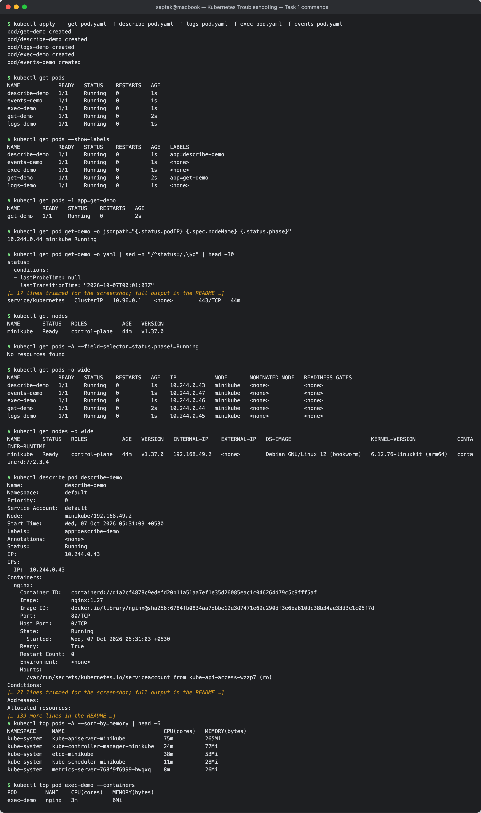

### Command cheat-sheet

| Command | Question it answers | Reach for it when |
| --- | --- | --- |
| `kubectl get` | what exists, what state? | always first |
| `kubectl get -o wide` | which node / which IP? | networking, node problems |
| `kubectl describe` | why that state? (+ events) | anything not `Running`/`Ready` |
| `kubectl logs [--previous]` | what did the app print? | app started then failed (CrashLoopBackOff) |
| `kubectl exec` | what does the container see? | app runs but behaves wrongly; DNS/connectivity tests |
| `kubectl events` | what did the control plane try? | scheduling, pulls, mounts, probes, scaling |
| `kubectl explain` | what does this field mean? | writing or fixing YAML |
| `kubectl top` | how much is it using? | OOMKilled, throttling, HPA |

---

## Task 2: Troubleshoot Common Issues

Each issue follows the same six steps the teacher listed: **identify → investigate → root cause → fix → verify →
document**. Where the class had a broken/fixed pair it is used as-is; the rest were written for this task.
(kubectl 1.37 prints `Warning: v1 Endpoints is deprecated in v1.33+; use discovery.k8s.io/v1 EndpointSlice` above every
`kubectl get endpoints`; that line is omitted from the captures below.)

---

### 2.1 CrashLoopBackOff

**Manifests:** [`02-issues/01-crashloopbackoff/`](./02-issues/01-crashloopbackoff/) (class `06-crashloopbackoff`)

**1 — Identify**

```
$ kubectl apply -f broken-pod.yaml
pod/crash-demo created

$ kubectl get pod crash-demo -w      # watched for 75s
NAME         READY   STATUS              RESTARTS   AGE
crash-demo   0/1     ContainerCreating   0          0s
crash-demo   0/1     ContainerCreating   0          0s
crash-demo   1/1     Running             0          0s
crash-demo   0/1     Error               0          0s
crash-demo   1/1     Running             1 (0s ago)   0s
crash-demo   0/1     Error               1 (1s ago)   1s
crash-demo   0/1     CrashLoopBackOff    1 (15s ago)   15s
crash-demo   1/1     Running             2 (15s ago)   15s
crash-demo   0/1     Error               2 (16s ago)   16s
crash-demo   0/1     CrashLoopBackOff    2 (28s ago)   43s
crash-demo   1/1     Running             3 (28s ago)   43s
crash-demo   0/1     Error               3 (29s ago)   44s
```

The cycle *Running → Error → CrashLoopBackOff (waiting) → Running …* with a growing `RESTARTS` count. A one-off
`kubectl get` can land on any phase of it — at 45 s it happened to print `Error`:

```
$ kubectl get pod crash-demo
NAME         READY   STATUS   RESTARTS      AGE
crash-demo   0/1     Error    3 (33s ago)   45s
```

**2 — Investigate**

```
$ kubectl describe pod crash-demo | sed -n "/State:/,/Restart Count/p;/Events:/,\$p"
    State:          Terminated
      Reason:       Error
      Exit Code:    1
      Started:      Wed, 07 Oct 2026 05:32:33 +0530
      Finished:     Wed, 07 Oct 2026 05:32:33 +0530
    Last State:     Terminated
      Reason:       Error
      Exit Code:    1
      Started:      Wed, 07 Oct 2026 05:32:12 +0530
      Finished:     Wed, 07 Oct 2026 05:32:12 +0530
    Ready:          False
    Restart Count:  3
Events:
  Type     Reason     Age                From               Message
  ----     ------     ----               ----               -------
  Normal   Scheduled  45s                default-scheduler  Successfully assigned default/crash-demo to minikube
  Normal   Pulled     12s (x4 over 44s)  kubelet            spec.containers{app}: Container image "busybox:1.36" already present on machine and can be accessed by the pod
  Normal   Created    12s (x4 over 44s)  kubelet            spec.containers{app}: Container created
  Normal   Started    12s (x4 over 44s)  kubelet            spec.containers{app}: Container started
  Warning  BackOff    12s (x3 over 43s)  kubelet            spec.containers{app}: Back-off restarting failed container app in pod crash-demo_default(0aa92ac2-99c8-48b8-90d7-0b3db9228c29)

$ kubectl logs crash-demo
Application starting...
Something went wrong!

$ kubectl get pod crash-demo -o jsonpath="{.status.containerStatuses[0].lastState.terminated.exitCode}"
1

$ kubectl logs crash-demo --previous
unable to retrieve container logs for containerd://905339e34228800609f11863c192255f08caa8a09675cfa9d5a13ead591724f8
```

The image pulled and the container *started* every time (so it is not an image or scheduling problem); it exits with
**code 1** within the same second. `kubectl logs` shows the app's own last words. (`--previous` failed here because
this container exits so fast that the runtime had already garbage-collected the earlier instance; plain `logs` on a
terminated container still shows its output.)

**3 — Root cause:** the container's command ends in `exit 1` — the main process terminates with an error, the kubelet
restarts it (`restartPolicy: Always`), it fails again, and the kubelet backs off exponentially (10 s, 20 s, 40 s … up to
5 min). CrashLoopBackOff is a *symptom*: "the process keeps dying"; logs and the exit code say why.

**4 — Fix:** [`fixed-pod.yaml`](./02-issues/01-crashloopbackoff/fixed-pod.yaml) runs a long-lived process instead.

```
$ diff broken-pod.yaml fixed-pod.yaml
16,17c16,17
<           echo "Something went wrong!"
<           exit 1
---
>           echo "Application is healthy"
>           sleep 3600

$ kubectl apply -f fixed-pod.yaml
The Pod "crash-demo" is invalid: spec: Forbidden: pod updates may not change fields other than `spec.containers[*].image`,`spec.initContainers[*].image`,`spec.activeDeadlineSeconds`,`spec.tolerations` (only additions to existing tolerations),`spec.terminationGracePeriodSeconds` (allow it to be set to 1 if it was previously negative)
...

$ kubectl delete pod crash-demo
pod "crash-demo" deleted from default namespace

$ kubectl apply -f fixed-pod.yaml
pod/crash-demo created
```

A bare Pod's `command` is immutable, so it must be deleted and recreated (with a Deployment you would just apply and
let it roll).

**5 — Verify**

```
$ kubectl get pod crash-demo
NAME         READY   STATUS    RESTARTS   AGE
crash-demo   1/1     Running   0          21s

$ kubectl logs crash-demo
Application starting...
Application is healthy
```

**Screenshot:** 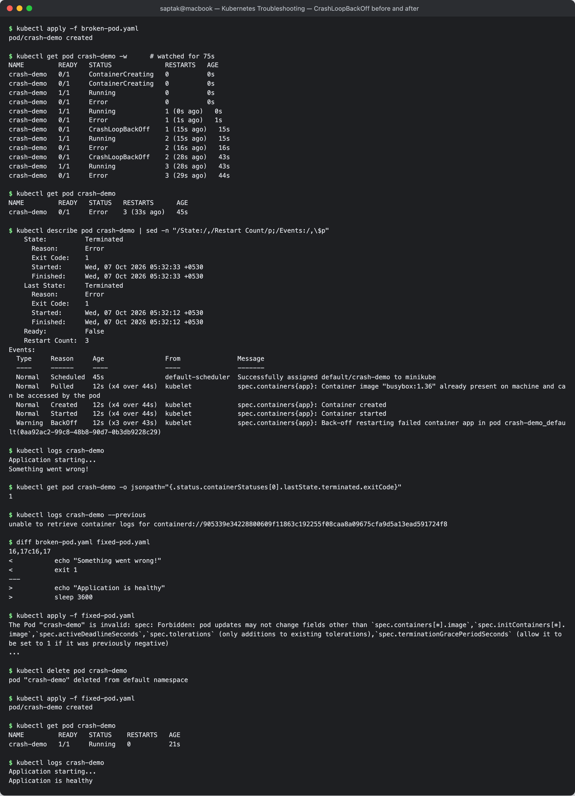

---

### 2.2 ImagePullBackOff

**Manifests:** [`02-issues/02-imagepullbackoff/`](./02-issues/02-imagepullbackoff/) (class `07-imagepullbackoff`)

**1 — Identify**

```
$ kubectl apply -f broken-pod.yaml
pod/image-demo created

$ kubectl get pod image-demo -w      # watched for 60s
NAME         READY   STATUS              RESTARTS   AGE
image-demo   0/1     ContainerCreating   0          0s
image-demo   0/1     ContainerCreating   0          0s
image-demo   0/1     ErrImagePull        0          2s
image-demo   0/1     ImagePullBackOff    0          13s
image-demo   0/1     ErrImagePull        0          29s
image-demo   0/1     ImagePullBackOff    0          42s
image-demo   0/1     ErrImagePull        0          58s
```

`RESTARTS` stays 0 — the container never existed, so nothing could restart.

**2 — Investigate**

```
$ kubectl describe pod image-demo | sed -n "/Containers:/,/Ready:/p;/Events:/,\$p"
Containers:
  app:
    Container ID:
    Image:          nginx:this-image-does-not-exist
    Image ID:
    Port:           <none>
    Host Port:      <none>
    State:          Waiting
      Reason:       ErrImagePull
    Ready:          False
Events:
  Type     Reason     Age                From               Message
  ----     ------     ----               ----               -------
  Normal   Scheduled  60s                default-scheduler  Successfully assigned default/image-demo to minikube
  Normal   Pulling    18s (x3 over 60s)  kubelet            spec.containers{app}: Pulling image "nginx:this-image-does-not-exist"
  Warning  Failed     17s (x3 over 58s)  kubelet            spec.containers{app}: Failed to pull image "nginx:this-image-does-not-exist": rpc error: code = NotFound desc = failed to pull and unpack image "docker.io/library/nginx:this-image-does-not-exist": failed to resolve reference "docker.io/library/nginx:this-image-does-not-exist": docker.io/library/nginx:this-image-does-not-exist: not found
  Warning  Failed     17s (x3 over 58s)  kubelet            spec.containers{app}: Error: ErrImagePull
  Normal   BackOff    2s (x3 over 58s)   kubelet            spec.containers{app}: Back-off pulling image "nginx:this-image-does-not-exist"
  Warning  Failed     2s (x3 over 58s)   kubelet            spec.containers{app}: Error: ImagePullBackOff

$ kubectl logs image-demo
Error from server (BadRequest): container "app" in pod "image-demo" is waiting to start: image can't be pulled
```

`logs` is useless here (no container) — the answer is in the events.

**3 — Root cause:** `code = NotFound … nginx:this-image-does-not-exist: not found` — the repository `nginx` exists on
Docker Hub but that **tag** does not. The kubelet keeps retrying with a growing back-off, and `ImagePullBackOff` is the
"waiting before the next retry" state.

**4 — Fix:** the image is one of the few mutable fields of a running Pod, so the corrected manifest can be applied in
place:

```
$ diff broken-pod.yaml fixed-pod.yaml
10c10
<       image: nginx:this-image-does-not-exist
---
>       image: nginx:1.27

$ kubectl apply -f fixed-pod.yaml
pod/image-demo configured
```

**5 — Verify**

```
$ kubectl get pod image-demo
NAME         READY   STATUS    RESTARTS   AGE
image-demo   1/1     Running   0          61s

$ kubectl events --for pod/image-demo | tail -4
3s (x3 over 59s)    Warning   Failed      Pod/image-demo   Error: ImagePullBackOff
1s                  Normal    Pulled      Pod/image-demo   Container image "nginx:1.27" already present on machine and can be accessed by the pod
1s                  Normal    Created     Pod/image-demo   Container created
0s                  Normal    Started     Pod/image-demo   Container started
```

**Screenshot:** 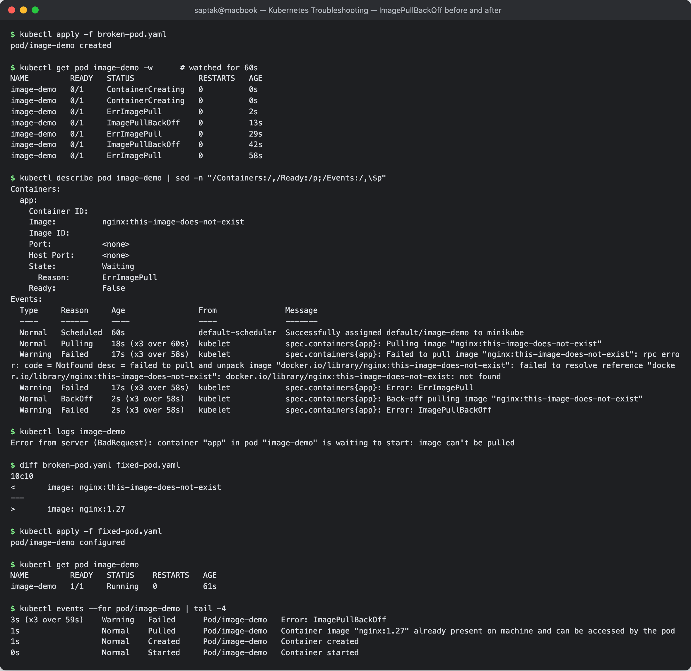

---

### 2.3 ErrImagePull

**Manifests:** [`02-issues/03-errimagepull/`](./02-issues/03-errimagepull/) — `broken-pod.yaml` is the class's
`scenarios/scenario-2-imagepull`; `fixed-pod.yaml` written here.

`ErrImagePull` and `ImagePullBackOff` are two phases of the same failure (the watch in §2.2 alternates between them):
**ErrImagePull = this pull attempt just failed**, **ImagePullBackOff = waiting before trying again**. What differs from
case to case is *why* the pull failed, and that is what this section isolates.

**1 — Identify**

```
$ kubectl apply -f broken-pod.yaml
pod/fail-2-imagepull-pod created

$ kubectl get pod fail-2-imagepull-pod
NAME                   READY   STATUS         RESTARTS   AGE
fail-2-imagepull-pod   0/1     ErrImagePull   0          6s
```

**2 — Investigate**

```
$ kubectl describe pod fail-2-imagepull-pod | sed -n "/Events:/,\$p"
Events:
  Type     Reason     Age   From               Message
  ----     ------     ----  ----               -------
  Normal   Scheduled  6s    default-scheduler  Successfully assigned default/fail-2-imagepull-pod to minikube
  Normal   Pulling    5s    kubelet            spec.containers{web-app}: Pulling image "yatri-api-service:v999-invalid-tag-does-not-exist"
  Warning  Failed     4s    kubelet            spec.containers{web-app}: Failed to pull image "yatri-api-service:v999-invalid-tag-does-not-exist": failed to pull and unpack image "docker.io/library/yatri-api-service:v999-invalid-tag-does-not-exist": failed to resolve reference "docker.io/library/yatri-api-service:v999-invalid-tag-does-not-exist": pull access denied, repository does not exist or may require authorization: server message: insufficient_scope: authorization failed
  Warning  Failed     4s    kubelet            spec.containers{web-app}: Error: ErrImagePull
  Normal   BackOff    4s    kubelet            spec.containers{web-app}: Back-off pulling image "yatri-api-service:v999-invalid-tag-does-not-exist"
  Warning  Failed     4s    kubelet            spec.containers{web-app}: Error: ImagePullBackOff
```

A different message from §2.2: `pull access denied, repository does not exist or may require authorization`. Is it the
tag or the repository? Pull directly on the node with the container runtime's CLI to separate the two:

```
$ minikube ssh -- sudo crictl pull docker.io/library/yatri-api-service:latest
... pulling image: failed to pull and unpack image "docker.io/library/yatri-api-service:latest": failed to resolve reference "docker.io/library/yatri-api-service:latest": pull access denied, repository does not exist or may require authorization: server message: insufficient_scope: authorization failed
ssh: Process exited with status 1

$ minikube ssh -- sudo crictl pull docker.io/library/nginx:this-image-does-not-exist
... pulling image: rpc error: code = NotFound desc = failed to pull and unpack image "docker.io/library/nginx:this-image-does-not-exist": failed to resolve reference "docker.io/library/nginx:this-image-does-not-exist": docker.io/library/nginx:this-image-does-not-exist: not found
ssh: Process exited with status 1
```

Even `:latest` fails for `yatri-api-service`, so it is the **repository** that is wrong, not just the tag.

**3 — Root cause:** an image reference with no registry and no `/` is expanded to `docker.io/library/<name>` (official
images). `yatri-api-service` is not an official Docker Hub image, so the registry answers "denied / does not exist".
Reading the two error texts:

| Message | Meaning |
| --- | --- |
| `NotFound … <image>:<tag>: not found` | repository exists, **tag** does not (§2.2) |
| `pull access denied, repository does not exist or may require authorization` | **repository** does not exist, *or* it is private and the Pod has no `imagePullSecrets` |
| `toomanyrequests` | Docker Hub rate limit |
| `dial tcp … i/o timeout` / `no such host` | node cannot reach the registry (network/DNS/proxy) |

**4 — Fix:** use a fully-qualified, existing image. A typo'd image can be corrected in place:

```
$ kubectl set image pod/fail-2-imagepull-pod web-app=docker.io/library/nginx:1.27
pod/fail-2-imagepull-pod image updated
```

and the manifest itself is fixed in [`fixed-pod.yaml`](./02-issues/03-errimagepull/fixed-pod.yaml) (`nginx:1.27` stands
in for the real API image, which in practice would live in a private registry and need an `imagePullSecret`).

**5 — Verify**

```
$ kubectl get pod fail-2-imagepull-pod -o wide
NAME                   READY   STATUS    RESTARTS   AGE   IP            NODE       NOMINATED NODE   READINESS GATES
fail-2-imagepull-pod   1/1     Running   0          10s   10.244.0.52   minikube   <none>           <none>

$ kubectl delete pod fail-2-imagepull-pod
pod "fail-2-imagepull-pod" deleted from default namespace

$ kubectl apply -f fixed-pod.yaml
pod/fail-2-imagepull-pod created

$ kubectl get pod fail-2-imagepull-pod
NAME                   READY   STATUS    RESTARTS   AGE
fail-2-imagepull-pod   1/1     Running   0          1s
```

**Screenshot:** 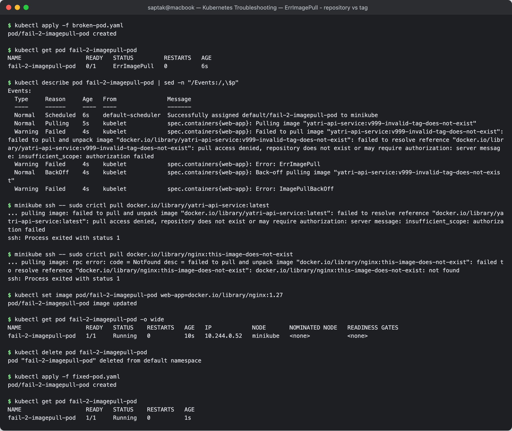

---

### 2.4 Pending

**Manifests:** [`02-issues/04-pending/`](./02-issues/04-pending/) — class `08-pending-pods` (nodeSelector) and
`scenarios/scenario-3-pending` (resources), plus `fixed-resources-pod.yaml`.

`Pending` means the Pod has been accepted but **not scheduled to a node** (or, later, its images are not yet pulled).
Two different causes:

#### A. nodeSelector matches no node

**Identify / investigate**

```
$ kubectl apply -f broken-pod.yaml
pod/pending-demo created

$ kubectl get pod pending-demo -o wide
NAME           READY   STATUS    RESTARTS   AGE   IP       NODE     NOMINATED NODE   READINESS GATES
pending-demo   0/1     Pending   0          5s    <none>   <none>   <none>           <none>

$ kubectl describe pod pending-demo | sed -n "/Node-Selectors:/p;/Events:/,\$p"
Node-Selectors:              kubernetes.io/hostname=node-that-does-not-exist
Events:
  Type     Reason            Age   From               Message
  ----     ------            ----  ----               -------
  Warning  FailedScheduling  6s    default-scheduler  0/1 nodes are available: 1 node(s) didn't match Pod's node affinity/selector. preemption: 0/1 nodes are available: 1 Preemption is not helpful for scheduling.

$ kubectl get nodes --show-labels | tr "," "\n" | grep hostname
kubernetes.io/hostname=minikube

$ kubectl logs pending-demo
```

`NODE <none>` and `IP <none>` in `-o wide` are the tell. `logs` prints nothing at all — no container has ever run.

**Root cause:** `nodeSelector: kubernetes.io/hostname=node-that-does-not-exist`; the only node is labelled
`kubernetes.io/hostname=minikube`. The scheduler message lists, per node, why it was filtered out.

**Fix / verify** — [`fixed-pod.yaml`](./02-issues/04-pending/fixed-pod.yaml) drops the selector (`nodeSelector` is
immutable, so delete + recreate):

```
$ kubectl delete pod pending-demo
pod "pending-demo" deleted from default namespace

$ kubectl apply -f fixed-pod.yaml
pod/pending-demo created

$ kubectl get pod pending-demo -o wide
NAME           READY   STATUS    RESTARTS   AGE   IP            NODE       NOMINATED NODE   READINESS GATES
pending-demo   1/1     Running   0          1s    10.244.0.54   minikube   <none>           <none>
```

#### B. Requests larger than any node

```
$ kubectl apply -f broken-resources-pod.yaml
pod/fail-3-pending-pod created

$ kubectl get pod fail-3-pending-pod
NAME                 READY   STATUS    RESTARTS   AGE
fail-3-pending-pod   0/1     Pending   0          5s

$ kubectl describe pod fail-3-pending-pod | sed -n "/Requests:/,/memory/p;/Events:/,\$p"
    Requests:
      cpu:        500
      memory:     1000Gi
Events:
  Type     Reason            Age              From               Message
  ----     ------            ----             ----               -------
  Warning  FailedScheduling  5s (x2 over 5s)  default-scheduler  0/1 nodes are available: 1 Insufficient cpu, 1 Insufficient memory. preemption: 0/1 nodes are available: 1 Preemption is not helpful for scheduling.

$ kubectl describe node minikube | sed -n "/Allocatable:/,/pods:/p"
Allocatable:
  cpu:                8
  ephemeral-storage:  485473984512
  hugepages-1Gi:      0
  hugepages-2Mi:      0
  hugepages-32Mi:     0
  hugepages-64Ki:     0
  memory:             8126756Ki
  pods:               110
```

**Root cause:** the Pod *requests* 500 CPUs and 1000 GiB; the node can allocate 8 CPUs and ~7.75 GiB. Scheduling is
based on **requests vs. allocatable** — actual usage is irrelevant. (Side observation: with the docker driver the node
reports the Docker VM's 8 CPUs even though minikube was started with `--cpus=4`.)

**Fix / verify** — [`fixed-resources-pod.yaml`](./02-issues/04-pending/fixed-resources-pod.yaml) requests what the app
needs (100m / 64Mi) and caps it with limits:

```
$ kubectl delete pod fail-3-pending-pod
pod "fail-3-pending-pod" deleted from default namespace

$ kubectl apply -f fixed-resources-pod.yaml
pod/fail-3-pending-pod created

$ kubectl get pod fail-3-pending-pod -o wide
NAME                 READY   STATUS    RESTARTS   AGE   IP            NODE       NOMINATED NODE   READINESS GATES
fail-3-pending-pod   1/1     Running   0          0s    10.244.0.55   minikube   <none>           <none>

$ kubectl describe pod fail-3-pending-pod | grep "QoS Class"
QoS Class:                   Burstable
```

Other common `Pending` causes, all diagnosed the same way (`describe` → `FailedScheduling` message): untolerated
taints, an unbound PVC, pod anti-affinity, `ResourceQuota`, or the cluster autoscaler still adding a node.

**Screenshot:** 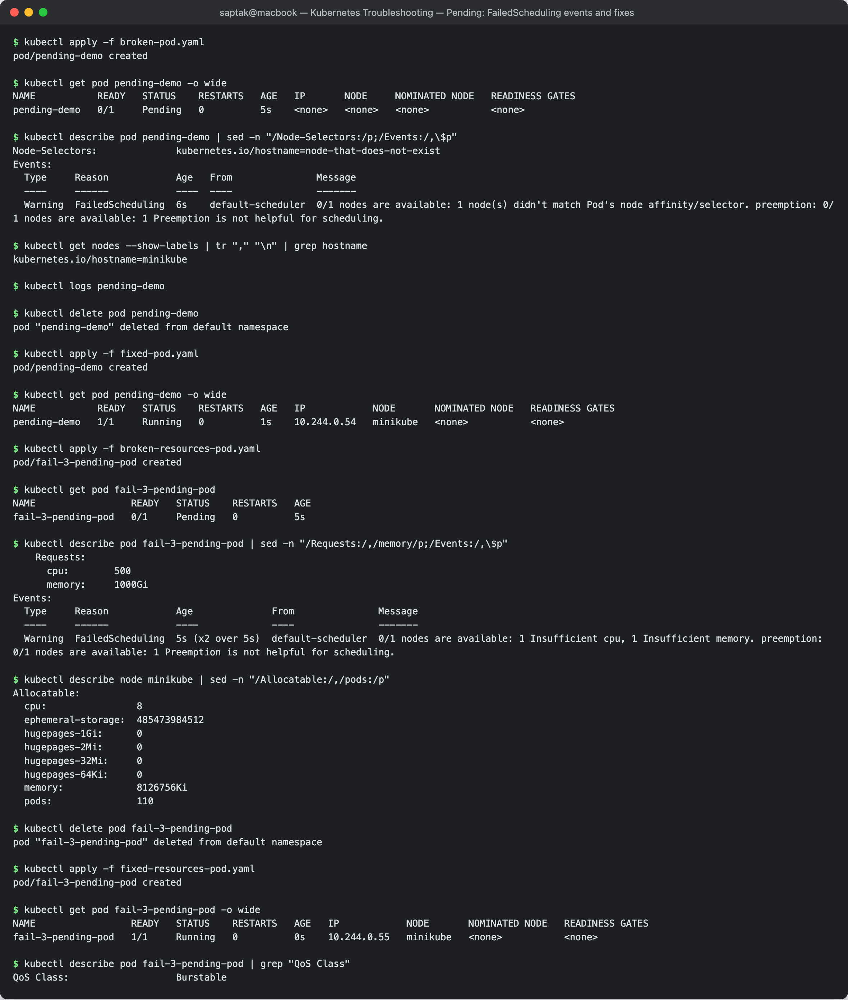

---

### 2.5 ContainerCreating

**Manifests:** [`02-issues/05-containercreating/`](./02-issues/05-containercreating/) — written for this task (no class
example). [`broken-pod.yaml`](./02-issues/05-containercreating/broken-pod.yaml) mounts a ConfigMap and a Secret that do
not exist.

**1 — Identify**

```
$ kubectl apply -f broken-pod.yaml
pod/volume-demo created

$ kubectl get pod volume-demo -o wide
NAME          READY   STATUS              RESTARTS   AGE   IP       NODE       NOMINATED NODE   READINESS GATES
volume-demo   0/1     ContainerCreating   0          31s   <none>   minikube   <none>           <none>
```

Unlike `Pending`, `NODE` is filled in: the Pod **was scheduled**, and the kubelet on that node is stuck preparing it.
`ContainerCreating` for a few seconds is normal (image pull, sandbox); stuck for 30 s+ is a problem.

**2 — Investigate**

```
$ kubectl describe pod volume-demo | sed -n "/State:/,/Ready:/p;/Events:/,\$p"
    State:          Waiting
      Reason:       ContainerCreating
    Ready:          False
Events:
  Type     Reason       Age                From               Message
  ----     ------       ----               ----               -------
  Normal   Scheduled    31s                default-scheduler  Successfully assigned default/volume-demo to minikube
  Warning  FailedMount  15s (x6 over 30s)  kubelet            MountVolume.SetUp failed for volume "site-config" : configmap "site-config" not found
  Warning  FailedMount  15s (x6 over 30s)  kubelet            MountVolume.SetUp failed for volume "tls" : secret "site-tls" not found

$ kubectl logs volume-demo
Error from server (BadRequest): container "app" in pod "volume-demo" is waiting to start: ContainerCreating

$ kubectl get configmap site-config
Error from server (NotFound): configmaps "site-config" not found

$ kubectl get secret site-tls
Error from server (NotFound): secrets "site-tls" not found
```

**3 — Root cause:** `FailedMount` — the kubelet cannot build the Pod's volumes because the referenced ConfigMap
`site-config` and Secret `site-tls` do not exist in the namespace. Volumes are not a scheduling constraint, so the Pod
is placed on a node and then waits there forever. (Same symptom for: a PVC that is not bound, a CSI driver that fails to
attach, a CNI that cannot assign an IP — events name which.)

**4 — Fix:** create the missing objects ([`fix-missing-objects.yaml`](./02-issues/05-containercreating/fix-missing-objects.yaml)).
**The Pod is not touched** — the kubelet retries the mount on its own.

```
$ kubectl apply -f fix-missing-objects.yaml
configmap/site-config created
secret/site-tls created
```

**5 — Verify**

```
$ kubectl get pod volume-demo -o wide
NAME          READY   STATUS    RESTARTS   AGE   IP            NODE       NOMINATED NODE   READINESS GATES
volume-demo   1/1     Running   0          33s   10.244.0.56   minikube   <none>           <none>

$ kubectl events --for pod/volume-demo | tail -5
17s (x6 over 32s)   Warning   FailedMount   Pod/volume-demo   MountVolume.SetUp failed for volume "site-config" : configmap "site-config" not found
17s (x6 over 32s)   Warning   FailedMount   Pod/volume-demo   MountVolume.SetUp failed for volume "tls" : secret "site-tls" not found
0s                  Normal    Pulled        Pod/volume-demo   Container image "nginx:1.27" already present on machine and can be accessed by the pod
0s                  Normal    Created       Pod/volume-demo   Container created
0s                  Normal    Started       Pod/volume-demo   Container started

$ kubectl exec volume-demo -- curl -s localhost
config mounted from ConfigMap

$ kubectl exec volume-demo -- ls /etc/tls
note.txt
```

The nginx response comes from the `default.conf` in the ConfigMap, proving the volume content is what the container
is serving.

**Screenshot:** 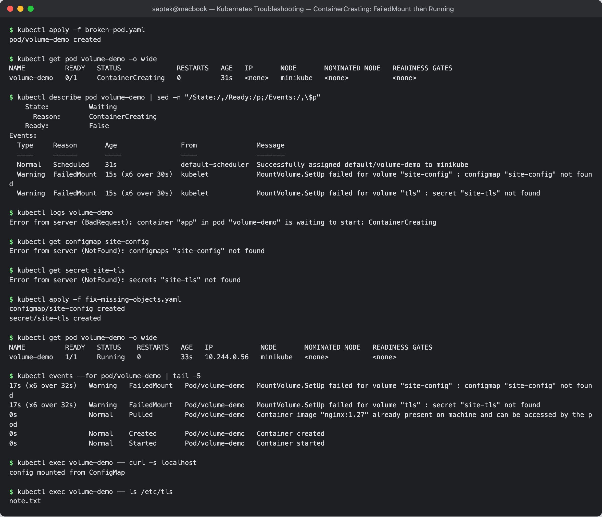

---

### 2.6 Service connectivity issues

**Manifests:** [`02-issues/06-service-connectivity/`](./02-issues/06-service-connectivity/) — class `09-service-dns-troubleshooting`
(`deployment.yaml`, `service.yaml`, `broken-service.yaml`) plus `service-fixed.yaml`, `service-wrong-targetport.yaml`
and a `client-pod.yaml` (curl).

> **A bug in the class tooling, found on the way.** The class `dns-test-pod.yaml` uses
> `registry.k8s.io/e2e-test-images/dnsutils:1.3`, which went straight to `ImagePullBackOff`:
>
> ```
> $ kubectl describe pod dns-test | sed -n '/Events:/,$p'
>   Warning  Failed     40s (x4 over 2m7s)   kubelet            spec.containers{dns-test}: Failed to pull image "registry.k8s.io/e2e-test-images/dnsutils:1.3": rpc error: code = NotFound desc = failed to pull and unpack image "registry.k8s.io/e2e-test-images/dnsutils:1.3": failed to resolve reference "registry.k8s.io/e2e-test-images/dnsutils:1.3": registry.k8s.io/e2e-test-images/dnsutils:1.3: not found
>
> $ curl -s https://registry.k8s.io/v2/e2e-test-images/dnsutils/tags/list -L
> {"child":[],"manifest":{},"name":"k8s-artifacts-prod/images/e2e-test-images/dnsutils","tags":[]}
> ```
>
> The repository has **no tags at all** any more. [`dns-test-pod-fixed.yaml`](./02-issues/06-service-connectivity/dns-test-pod-fixed.yaml)
> uses `registry.k8s.io/e2e-test-images/jessie-dnsutils:1.7` (pulled fine, ships `nslookup`/`dig`/`host`). It has no
> curl, so HTTP tests use the separate `client` pod.

The Deployment `web` (2 nginx Pods, label `app: web`) and the class Service `web-service` are applied.

**1 — Identify**

```
$ kubectl exec client -- sh -c "curl -sS -m 3 http://web-service; echo exit=\$?"
curl: (7) Failed to connect to web-service port 80 after 1 ms: Couldn't connect to server
exit=7
```

Name resolution worked (curl got as far as connecting) but the connection was refused immediately.

**2 — Investigate** (Pods → Service → Endpoints → labels)

```
$ kubectl get pods -l app=web -o wide
NAME                   READY   STATUS    RESTARTS   AGE     IP            NODE       NOMINATED NODE   READINESS GATES
web-557577df75-jlnn2   1/1     Running   0          3m20s   10.244.0.59   minikube   <none>           <none>
web-557577df75-t2gxf   1/1     Running   0          3m20s   10.244.0.58   minikube   <none>           <none>

$ kubectl get svc web-service
NAME          TYPE        CLUSTER-IP    EXTERNAL-IP   PORT(S)   AGE
web-service   ClusterIP   10.99.9.241   <none>        80/TCP    3m20s

$ kubectl get endpoints web-service
NAME          ENDPOINTS   AGE
web-service   <none>      3m20s

$ kubectl describe svc web-service
Name:                     web-service
Namespace:                default
Labels:                   <none>
Annotations:              <none>
Selector:                 app=web-ahsgdf
Type:                     ClusterIP
IP Family Policy:         SingleStack
IP Families:              IPv4
IP:                       10.99.9.241
IPs:                      10.99.9.241
Port:                     <unset>  80/TCP
TargetPort:               80/TCP
Endpoints:
Session Affinity:         None
Internal Traffic Policy:  Cluster
Events:                   <none>

$ kubectl get pods --show-labels -l app
NAME                   READY   STATUS    RESTARTS   AGE     LABELS
web-557577df75-jlnn2   1/1     Running   0          3m20s   app=web,pod-template-hash=557577df75
web-557577df75-t2gxf   1/1     Running   0          3m20s   app=web,pod-template-hash=557577df75

$ kubectl get pods -l app=web-ahsgdf
No resources found in default namespace.
```

**3 — Root cause:** Service selector `app=web-ahsgdf` vs Pod label `app=web`. No Pod matches, so the Service has **no
endpoints**, and kube-proxy rejects connections to its ClusterIP. Healthy Pods + a Service with `<none>` endpoints
always means selector/label mismatch (or no Pod is Ready).

**4 — Fix** ([`service-fixed.yaml`](./02-issues/06-service-connectivity/service-fixed.yaml): `selector: app: web`)

```
$ kubectl apply -f service-fixed.yaml
service/web-service configured
```

**5 — Verify**

```
$ kubectl get endpoints web-service
NAME          ENDPOINTS                       AGE
web-service   10.244.0.58:80,10.244.0.59:80   3m22s

$ kubectl exec client -- curl -s -m 3 -o /dev/null -w "HTTP %{http_code}\n" http://web-service
HTTP 200
```

#### Variant: endpoints exist but the port is wrong

[`service-wrong-targetport.yaml`](./02-issues/06-service-connectivity/service-wrong-targetport.yaml) keeps the right
selector but sets `targetPort: 8080`:

```
$ kubectl apply -f service-wrong-targetport.yaml
service/web-service configured

$ kubectl get endpoints web-service
NAME          ENDPOINTS                           AGE
web-service   10.244.0.58:8080,10.244.0.59:8080   3m25s

$ kubectl exec client -- sh -c "curl -sS -m 3 http://web-service; echo exit=\$?"
curl: (7) Failed to connect to web-service port 80 after 0 ms: Couldn't connect to server
exit=7

$ kubectl exec client -- curl -s -m 3 -o /dev/null -w 'HTTP %{http_code}\n' http://10.244.0.59:80
HTTP 200

$ kubectl exec client -- sh -c 'curl -sS -m 3 http://10.244.0.59:8080; echo exit=$?'
curl: (7) Failed to connect to 10.244.0.59 port 8080 after 0 ms: Couldn't connect to server
exit=7

$ kubectl get pod -l app=web -o jsonpath="{.items[0].spec.containers[0].ports}"
[{"containerPort":80,"protocol":"TCP"}]
```

This one hides from the "check endpoints" step — endpoints are populated, but every one is `:8080`. Hitting the Pod IP
directly on 80 works and on 8080 fails, which isolates the bug to the Service's `targetPort`. Re-applying
`service-fixed.yaml`:

```
$ kubectl apply -f service-fixed.yaml
service/web-service configured

$ kubectl get endpoints web-service
NAME          ENDPOINTS                       AGE
web-service   10.244.0.58:80,10.244.0.59:80   3m27s

$ kubectl exec client -- curl -s -m 3 http://web-service | grep title
<title>Welcome to nginx!</title>
```

The class's `broken-service.yaml` shows the same selector failure in its simplest form:

```
$ kubectl describe svc broken-service | grep -E "Selector|Endpoints"
Selector:                 app=does-not-exist
Endpoints:
```

**Screenshot:** 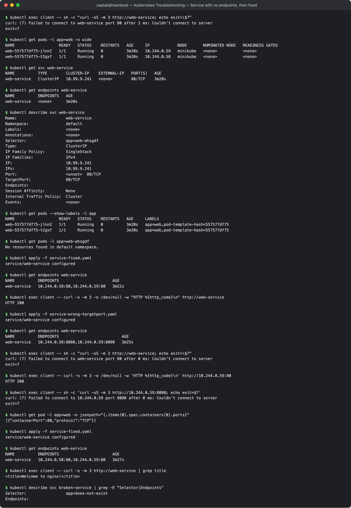

---

### 2.7 DNS issues

**Manifests:** [`02-issues/07-dns/`](./02-issues/07-dns/) — `broken-pod.yaml` is the class's
`scenarios/scenario-4-dns-failure`; `stand-in-db.yaml` creates the Service the pod is meant to reach
(`postgres-db` in namespace `production`, port 5432, nginx backend so curl can test it); `fixed-pod.yaml` is the
corrected client.

**1 — Identify**

```
$ kubectl apply -f broken-pod.yaml
pod/fail-4-dns-failure-pod created

$ kubectl get pod fail-4-dns-failure-pod
NAME                     READY   STATUS    RESTARTS   AGE
fail-4-dns-failure-pod   1/1     Running   0          6s

$ kubectl logs fail-4-dns-failure-pod
Attempting connection to internal database...
Process sleeping...
```

`Running 1/1` and a log with no error — the scenario's `curl -s … || true` swallows the failure. Re-run the same call
without `-s`, from inside the Pod:

```
$ kubectl exec fail-4-dns-failure-pod -- sh -c "curl -sS --connect-timeout 3 http://postgres-db-wrong-name.production.svc.cluster.local:5432; echo exit=\$?"
curl: (6) Could not resolve host: postgres-db-wrong-name.production.svc.cluster.local
exit=6
```

curl exit code 6 = DNS resolution failed (compare exit 7 = connection refused in §2.6, exit 28 = timeout in §2.8).

**2 — Investigate** (is DNS broken, or is the name wrong?)

```
$ kubectl exec dns-test -- nslookup postgres-db-wrong-name.production.svc.cluster.local
Server:		10.96.0.10
Address:	10.96.0.10#53

** server can't find postgres-db-wrong-name.production.svc.cluster.local: NXDOMAIN

command terminated with exit code 1

$ kubectl exec dns-test -- nslookup kubernetes.default
Server:		10.96.0.10
Address:	10.96.0.10#53

Name:	kubernetes.default.svc.cluster.local
Address: 10.96.0.1

$ kubectl get pods -n kube-system -l k8s-app=kube-dns -o wide
NAME                       READY   STATUS    RESTARTS   AGE   IP           NODE       NOMINATED NODE   READINESS GATES
coredns-559f6c778d-c4qvr   1/1     Running   0          55m   10.244.0.3   minikube   <none>           <none>

$ kubectl get svc -n kube-system kube-dns
NAME       TYPE        CLUSTER-IP   EXTERNAL-IP   PORT(S)                  AGE
kube-dns   ClusterIP   10.96.0.10   <none>        53/UDP,53/TCP,9153/TCP   55m

$ kubectl exec fail-4-dns-failure-pod -- cat /etc/resolv.conf
search default.svc.cluster.local svc.cluster.local cluster.local
nameserver 10.96.0.10
options ndots:5
```

DNS itself is healthy: CoreDNS is running, the Pod points at it (`10.96.0.10`), and a known name resolves. The server
answered **NXDOMAIN** — "that name does not exist", not "I can't reach a DNS server". So find the real name:

```
$ kubectl get svc -A | grep -i postgres
production    postgres-db      ClusterIP   10.96.254.180   <none>        5432/TCP                 6s

$ kubectl exec dns-test -- nslookup postgres-db.production.svc.cluster.local
Server:		10.96.0.10
Address:	10.96.0.10#53

Name:	postgres-db.production.svc.cluster.local
Address: 10.96.254.180

$ kubectl exec dns-test -- nslookup postgres-db
Server:		10.96.0.10
Address:	10.96.0.10#53

** server can't find postgres-db: NXDOMAIN

command terminated with exit code 1

$ kubectl exec dns-test -- nslookup postgres-db.production
Server:		10.96.0.10
Address:	10.96.0.10#53

Name:	postgres-db.production.svc.cluster.local
Address: 10.96.254.180
```

The bare name fails from the `default` namespace because the search list only appends `default.svc.cluster.local`
first; `<svc>.<namespace>` or the full FQDN is needed across namespaces.

**3 — Root cause:** the client uses `postgres-db-wrong-name`; the Service is `postgres-db`. Cluster DNS creates records
only for Services that exist, as `<service>.<namespace>.svc.cluster.local`.

**4 — Fix:** [`fixed-pod.yaml`](./02-issues/07-dns/fixed-pod.yaml) uses
`postgres-db.production.svc.cluster.local` (and drops `-s`/`|| true` so a failure would be visible in the logs).

```
$ kubectl delete pod fail-4-dns-failure-pod
pod "fail-4-dns-failure-pod" deleted from default namespace

$ kubectl apply -f fixed-pod.yaml
pod/fail-4-dns-failure-pod created
```

**5 — Verify**

```
$ kubectl logs fail-4-dns-failure-pod
Attempting connection to internal database...
connected, HTTP 200
Process sleeping...

$ kubectl exec dns-test -- dig +short postgres-db.production.svc.cluster.local
10.96.254.180
```

#### Variant: DNS itself is down

To see what a *real* DNS outage looks like (as opposed to a wrong name), CoreDNS was scaled to zero:

```
$ kubectl -n kube-system scale deployment coredns --replicas=0
deployment.apps/coredns scaled

$ kubectl exec dns-test -- nslookup -timeout=3 postgres-db.production.svc.cluster.local
;; connection timed out; no servers could be reached

command terminated with exit code 1

$ kubectl exec dns-test -- nslookup -timeout=3 kubernetes.default
;; connection timed out; no servers could be reached

command terminated with exit code 1

$ kubectl get pods -n kube-system -l k8s-app=kube-dns
No resources found in kube-system namespace.

$ kubectl get endpoints kube-dns -n kube-system
NAME       ENDPOINTS   AGE
kube-dns   <none>      56m

$ kubectl exec client -- curl -s -m 3 -o /dev/null -w "HTTP %{http_code}\n" http://10.96.254.180:5432
HTTP 200
```

The signature is different: **timeout / "no servers could be reached"** for *every* name, `kube-dns` has no endpoints,
yet the same Service by **IP** still answers — so networking is fine and only name resolution is gone. Restored:

```
$ kubectl -n kube-system scale deployment coredns --replicas=1
deployment.apps/coredns scaled

$ kubectl get endpoints kube-dns -n kube-system
NAME       ENDPOINTS                                        AGE
kube-dns   10.244.0.65:9153,10.244.0.65:53,10.244.0.65:53   56m

$ kubectl exec dns-test -- nslookup postgres-db.production.svc.cluster.local
Server:		10.96.0.10
Address:	10.96.0.10#53

Name:	postgres-db.production.svc.cluster.local
Address: 10.96.254.180
```

| `nslookup` result | Meaning | Look at |
| --- | --- | --- |
| `NXDOMAIN` | DNS works; the name does not exist | spelling, namespace, `kubectl get svc -A` |
| `connection timed out; no servers could be reached` | cannot reach CoreDNS | `kube-dns` endpoints, CoreDNS pods/logs, NetworkPolicy on UDP/TCP 53 |
| resolves, but app still fails | not a DNS problem | Service endpoints / ports (§2.6), policy (§2.8) |

**Screenshot:** 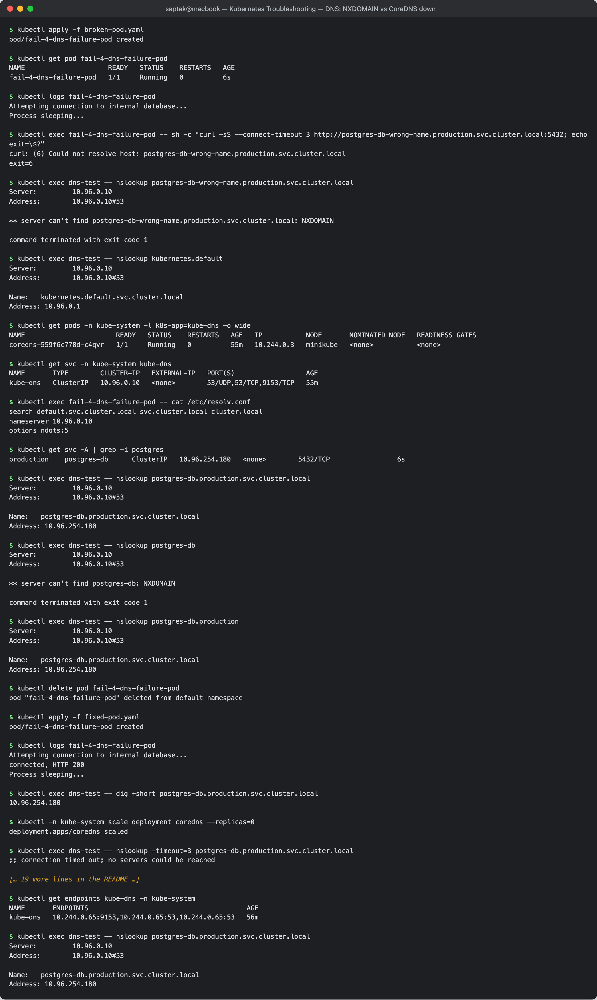

---

### 2.8 Pod networking issues

**Manifests:** [`02-issues/08-pod-networking/`](./02-issues/08-pod-networking/) — written for this task.
minikube's CNI here is kindnet, which enforces NetworkPolicy (checked before writing the scenario).

The setup is the working `web` Deployment + `web-service` from §2.6 and the `client` pod (label `role=client`).

```
$ kubectl exec client -- curl -s -m 4 -o /dev/null -w "HTTP %{http_code}\n" http://web-service
HTTP 200

$ kubectl apply -f deny-all-ingress.yaml          # the "breaking change"
networkpolicy.networking.k8s.io/web-deny-all-ingress created
```

**1 — Identify**

```
$ kubectl exec client -- sh -c "curl -sS -m 4 http://web-service; echo exit=\$?"
curl: (28) Connection timed out after 4003 milliseconds
exit=28
```

A **timeout** (exit 28), not a refusal (exit 7, §2.6) and not a name failure (exit 6, §2.7): packets are being silently
dropped.

**2 — Investigate, layer by layer**

```
$ kubectl get pods -l app=web -o wide
NAME                   READY   STATUS    RESTARTS   AGE    IP            NODE       NOMINATED NODE   READINESS GATES
web-557577df75-jlnn2   1/1     Running   0          6m7s   10.244.0.59   minikube   <none>           <none>
web-557577df75-t2gxf   1/1     Running   0          6m7s   10.244.0.58   minikube   <none>           <none>

$ kubectl get endpoints web-service
NAME          ENDPOINTS                       AGE
web-service   10.244.0.58:80,10.244.0.59:80   6m7s

$ kubectl exec dns-test -- nslookup web-service | tail -3
Name:	web-service.default.svc.cluster.local
Address: 10.99.9.241

$ kubectl exec client -- sh -c 'curl -sS -m 4 http://10.244.0.59:80; echo exit=$?'
curl: (28) Connection timed out after 4005 milliseconds
exit=28

$ kubectl exec web-557577df75-jlnn2 -- curl -s -m 3 -o /dev/null -w 'HTTP %{http_code}\n' http://localhost:80
HTTP 200
```

| Layer | Result |
| --- | --- |
| Pods running & ready | yes |
| Service endpoints | populated, correct port |
| DNS | resolves |
| App inside the Pod (`localhost`) | 200 |
| Pod IP → Pod IP (bypassing the Service) | **timeout** |

The app works and the Service is correct; Pod-to-Pod traffic itself is being dropped. That points at the network
layer — and the first thing to check there is policy:

```
$ kubectl get networkpolicy
NAME                   POD-SELECTOR   AGE
web-deny-all-ingress   app=web        12s

$ kubectl describe networkpolicy web-deny-all-ingress
Name:         web-deny-all-ingress
Namespace:    default
Created on:   2026-10-07 05:44:00 +0530 IST
Labels:       <none>
Annotations:  <none>
Spec:
  PodSelector:     app=web
  Allowing ingress traffic:
    <none> (Selected pods are isolated for ingress connectivity)
  Not affecting egress traffic
  Policy Types: Ingress
```

**3 — Root cause:** a NetworkPolicy selects `app=web` with `policyTypes: [Ingress]` and no `ingress` rules, so those
Pods are **isolated for ingress** — the CNI drops every inbound packet. Policies fail closed and silently.

**4 — Fix:** keep the default-deny, add an explicit allow for the intended client
([`allow-client-to-web.yaml`](./02-issues/08-pod-networking/allow-client-to-web.yaml): from `role=client`, TCP 80).
Policies are additive allow-lists.

```
$ kubectl apply -f allow-client-to-web.yaml
networkpolicy.networking.k8s.io/web-allow-from-client created

$ kubectl get networkpolicy
NAME                    POD-SELECTOR   AGE
web-allow-from-client   app=web        4s
web-deny-all-ingress    app=web        16s
```

**5 — Verify** — the labelled client gets through, an unlabelled Pod is still blocked (the policy is doing its job):

```
$ kubectl exec client -- curl -s -m 4 -o /dev/null -w "HTTP %{http_code}\n" http://web-service
HTTP 200

$ kubectl run netcheck --rm -i --restart=Never --image=curlimages/curl:8.6.0 -- sh -c "curl -sS -m 4 http://web-service; echo exit=\$?"
curl: (28) Connection timed out after 4002 milliseconds
exit=28
pod "netcheck" deleted from default namespace

$ kubectl run netcheck --rm -i --restart=Never --labels=role=client --image=curlimages/curl:8.6.0 -- curl -s -m 4 -o /dev/null -w "HTTP %{http_code}\n" http://web-service
HTTP 200
pod "netcheck" deleted from default namespace
```

(`kubectl run -i` attach banners omitted.) Other Pod-networking causes with the same "timeout" signature: CNI pods
crash-looping on a node, exhausted Pod CIDR (Pods stuck `ContainerCreating` with a CNI error), or a container listening
on `127.0.0.1` instead of `0.0.0.0`.

**Screenshot:** 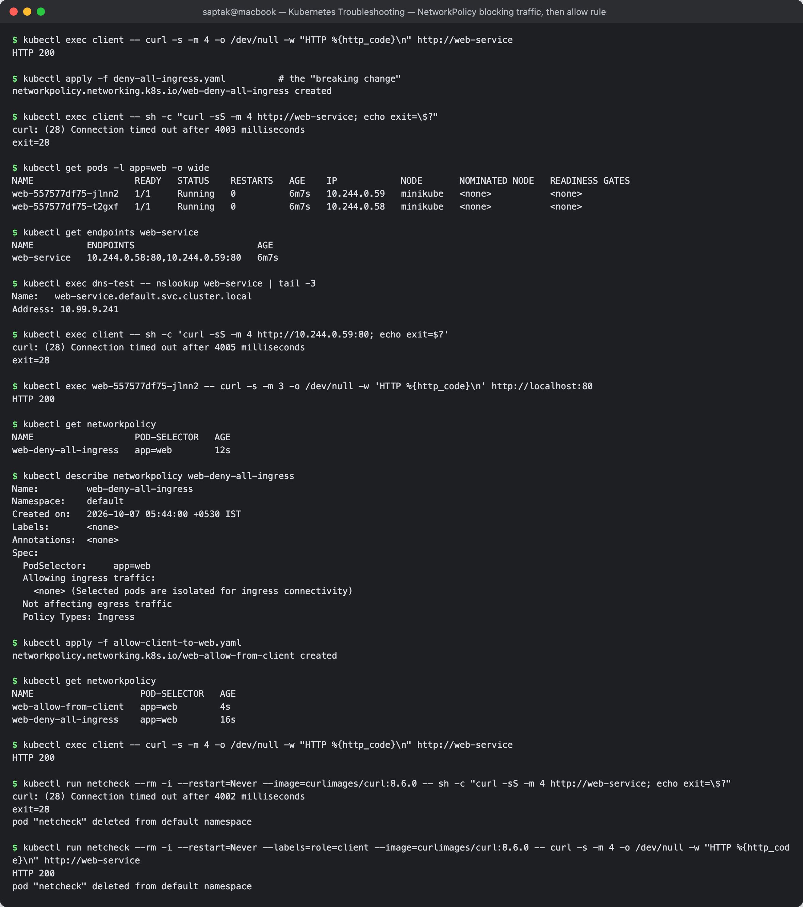

---

### 2.9 Configuration issues

**Manifests:** [`02-issues/09-configuration/`](./02-issues/09-configuration/) — `broken-missing-env.yaml` is the class's
`scenarios/scenario-1-crashloop`; the rest were written for this task.

#### A. Required environment variable missing

**1 — Identify**

```
$ kubectl apply -f broken-missing-env.yaml
pod/fail-1-crashloop-pod created

$ kubectl get pod fail-1-crashloop-pod
NAME                   READY   STATUS   RESTARTS      AGE
fail-1-crashloop-pod   0/1     Error    2 (29s ago)   30s
```

Looks like §2.1 — a crash loop. The difference is *why*.

**2 — Investigate**

```
$ kubectl logs fail-1-crashloop-pod
[FATAL ERROR]: DATABASE_URL environment variable is MISSING!

$ kubectl describe pod fail-1-crashloop-pod | sed -n "/Last State:/,/Restart Count/p;/Environment:/,/Mounts:/p"
    Last State:     Terminated
      Reason:       Error
      Exit Code:    1
      Started:      Wed, 07 Oct 2026 05:45:00 +0530
      Finished:     Wed, 07 Oct 2026 05:45:00 +0530
    Ready:          False
    Restart Count:  2
    Environment:    <none>
    Mounts:

$ kubectl get configmap
NAME               DATA   AGE
kube-root-ca.crt   1      58m
```

**3 — Root cause:** the app validates its config at start-up and exits 1 because `DATABASE_URL` is not set —
`Environment: <none>`, and no ConfigMap holds it. The code is fine; the *deployment configuration* is incomplete.

**4 — Fix:** put the configuration in a ConfigMap ([`app-config.yaml`](./02-issues/09-configuration/app-config.yaml)) and
inject it ([`fixed-missing-env.yaml`](./02-issues/09-configuration/fixed-missing-env.yaml)):

```
$ kubectl apply -f app-config.yaml
configmap/app-config created

$ kubectl delete pod fail-1-crashloop-pod
pod "fail-1-crashloop-pod" deleted from default namespace
```

A first attempt that only added the env var (keeping the default `restartPolicy: Always`) exposed a second
configuration mistake:

```
$ sed "s/restartPolicy: OnFailure/restartPolicy: Always/" fixed-missing-env.yaml | kubectl apply -f -
pod/fail-1-crashloop-pod created

$ kubectl get pod fail-1-crashloop-pod
NAME                   READY   STATUS      RESTARTS      AGE
fail-1-crashloop-pod   0/1     Completed   2 (29s ago)   30s

$ kubectl logs fail-1-crashloop-pod
Application started successfully!

$ kubectl get pod fail-1-crashloop-pod -o jsonpath="{.status.containerStatuses[0].lastState.terminated.reason} exit={.status.containerStatuses[0].lastState.terminated.exitCode}"
Completed exit=0
```

The app now succeeds — and is restarted anyway (2 restarts in 30 s), because with `Always` the kubelet restarts a
container that exits **0** too; it would end up in CrashLoopBackOff despite never failing. This script is a one-shot
check, so the correct manifest uses `restartPolicy: OnFailure` (a long-running server would instead need to keep its
process in the foreground).

```
$ kubectl delete pod fail-1-crashloop-pod
pod "fail-1-crashloop-pod" deleted from default namespace

$ kubectl apply -f fixed-missing-env.yaml
pod/fail-1-crashloop-pod created
```

**5 — Verify**

```
$ kubectl get pod fail-1-crashloop-pod
NAME                   READY   STATUS      RESTARTS   AGE
fail-1-crashloop-pod   0/1     Completed   0          11s

$ kubectl logs fail-1-crashloop-pod
Application started successfully!

$ kubectl get pod fail-1-crashloop-pod -o jsonpath="{.spec.containers[0].env}"
[{"name":"DATABASE_URL","valueFrom":{"configMapKeyRef":{"key":"DATABASE_URL","name":"app-config"}}}]
```

`Completed`, `RESTARTS 0`.

#### B. ConfigMap key that does not exist

[`broken-wrong-key.yaml`](./02-issues/09-configuration/broken-wrong-key.yaml) references `key: DB_URL` in `app-config`.

```
$ kubectl apply -f broken-wrong-key.yaml
pod/config-key-demo created

$ kubectl get pod config-key-demo
NAME              READY   STATUS                       RESTARTS   AGE
config-key-demo   0/1     CreateContainerConfigError   0          8s

$ kubectl describe pod config-key-demo | sed -n "/State:/,/Reason/p;/Events:/,\$p"
    State:          Waiting
      Reason:       CreateContainerConfigError
Events:
  Type     Reason     Age              From               Message
  ----     ------     ----             ----               -------
  Normal   Scheduled  8s               default-scheduler  Successfully assigned default/config-key-demo to minikube
  Normal   Pulled     8s (x2 over 8s)  kubelet            spec.containers{app}: Container image "busybox:1.36" already present on machine and can be accessed by the pod
  Warning  Failed     8s (x2 over 8s)  kubelet            spec.containers{app}: Error: couldn't find key DB_URL in ConfigMap default/app-config

$ kubectl logs config-key-demo
Error from server (BadRequest): container "app" in pod "config-key-demo" is waiting to start: CreateContainerConfigError

$ kubectl get configmap app-config -o jsonpath="{.data}"
{"DATABASE_URL":"postgres://postgres-db.production.svc.cluster.local:5432/notes","LOG_LEVEL":"info"}
```

**Root cause:** the kubelet resolves `env.valueFrom` *before* creating the container; key `DB_URL` is not in the
ConfigMap (it has `DATABASE_URL`), so the container is never created — `CreateContainerConfigError`, no restarts, no
logs. (A missing ConfigMap/Secret referenced from `env` gives the same status; referenced from a *volume* it gives
`ContainerCreating` as in §2.5.)

**Fix / verify** — [`fixed-wrong-key.yaml`](./02-issues/09-configuration/fixed-wrong-key.yaml) uses the right key:

```
$ kubectl delete pod config-key-demo
pod "config-key-demo" deleted from default namespace

$ kubectl apply -f fixed-wrong-key.yaml
pod/config-key-demo created

$ kubectl get pod config-key-demo
NAME              READY   STATUS    RESTARTS   AGE
config-key-demo   1/1     Running   0          1s

$ kubectl logs config-key-demo
DATABASE_URL=postgres://postgres-db.production.svc.cluster.local:5432/notes
```

**Screenshot:** 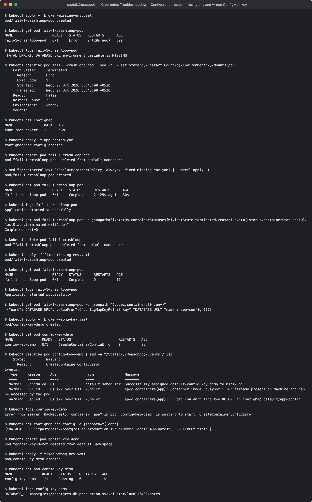

### Task 2 summary

| Issue | Status / signal | Where the answer was | Root cause here | Fix |
| --- | --- | --- | --- | --- |
| CrashLoopBackOff | `Error`↔`CrashLoopBackOff`, RESTARTS climbing, exit 1 | `logs`, `describe` Last State | command ends `exit 1` | long-running command |
| ImagePullBackOff | `ImagePullBackOff`, RESTARTS 0 | events: `not found` | tag does not exist | `nginx:1.27` |
| ErrImagePull | `ErrImagePull` | events + `crictl pull` on node | repository does not exist (`pull access denied`) | correct fully-qualified image |
| Pending | `Pending`, NODE `<none>` | events: `FailedScheduling` | nodeSelector mismatch; requests > allocatable | remove selector; right-size requests |
| ContainerCreating | stuck, NODE set | events: `FailedMount` | ConfigMap/Secret volume source missing | create the objects |
| Service connectivity | curl exit 7 (refused) | `get endpoints` = `<none>`; ports | selector mismatch; wrong `targetPort` | fix selector / targetPort |
| DNS | curl exit 6; `NXDOMAIN` vs timeout | `nslookup` from a Pod; `kube-dns` endpoints | wrong hostname; CoreDNS at 0 replicas | correct FQDN; scale CoreDNS |
| Pod networking | curl exit 28 (timeout), even Pod IP→Pod IP | `get networkpolicy` | default-deny ingress policy | explicit allow policy |
| Configuration | crash loop with config error in log; `CreateContainerConfigError` | `logs`, `describe` Environment/events | missing env var; wrong ConfigMap key; wrong `restartPolicy` | ConfigMap + `configMapKeyRef`; right key; `OnFailure` |

---

## Task 3: Mini Project — Kubernetes Troubleshooting Challenge

**Brief:** [`mini-project/README.md` (class)](https://github.com/Nency-Ravaliya/devops-heros/tree/main/session-14-kubernetes-troubleshooting/mini-project)
**Manifests:** [`mini-project/`](./mini-project/) — class `deployment.yaml`, `service.yaml`, `broken-pod.yaml`, plus
[`service-broken-selector.yaml`](./mini-project/service-broken-selector.yaml) for section 8.

### 1. Deploy the application

```
$ kubectl apply -f deployment.yaml
deployment.apps/troubleshooting-app created

$ kubectl apply -f service.yaml
service/troubleshooting-service created

$ kubectl get pods
NAME                                   READY   STATUS    RESTARTS   AGE
troubleshooting-app-59d4957864-4vjrz   1/1     Running   0          1s
troubleshooting-app-59d4957864-89c9m   1/1     Running   0          1s

$ kubectl get service
NAME                      TYPE        CLUSTER-IP       EXTERNAL-IP   PORT(S)   AGE
kubernetes                ClusterIP   10.96.0.1        <none>        443/TCP   60m
troubleshooting-service   ClusterIP   10.103.111.157   <none>        80/TCP    1s
```

### 2. Check the application

```
$ kubectl get pods -o wide
NAME                                   READY   STATUS    RESTARTS   AGE   IP            NODE       NOMINATED NODE   READINESS GATES
troubleshooting-app-59d4957864-4vjrz   1/1     Running   0          1s    10.244.0.74   minikube   <none>           <none>
troubleshooting-app-59d4957864-89c9m   1/1     Running   0          1s    10.244.0.73   minikube   <none>           <none>

$ kubectl describe pod troubleshooting-app-59d4957864-4vjrz
Name:             troubleshooting-app-59d4957864-4vjrz
Namespace:        default
...
Labels:           app=troubleshooting-app
                  pod-template-hash=59d4957864
Status:           Running
IP:               10.244.0.74
Containers:
  app:
    Image:          nginx:1.27
    Port:           80/TCP
    State:          Running
      Started:      Wed, 07 Oct 2026 05:47:10 +0530
    Ready:          True
...
Events:
  Type    Reason     Age   From               Message
  ----    ------     ----  ----               -------
  Normal  Scheduled  1s    default-scheduler  Successfully assigned default/troubleshooting-app-59d4957864-4vjrz to minikube
  Normal  Pulled     0s    kubelet            spec.containers{app}: Container image "nginx:1.27" already present on machine and can be accessed by the pod
  Normal  Created    0s    kubelet            spec.containers{app}: Container created
  Normal  Started    0s    kubelet            spec.containers{app}: Container started

$ kubectl logs troubleshooting-app-59d4957864-4vjrz | tail -4
2026/10/07 00:17:10 [notice] 1#1: start worker process 33
2026/10/07 00:17:10 [notice] 1#1: start worker process 34
2026/10/07 00:17:10 [notice] 1#1: start worker process 35
2026/10/07 00:17:10 [notice] 1#1: start worker process 36

$ printf 'curl -s localhost | head -4\nexit\n' | kubectl exec -i troubleshooting-app-59d4957864-4vjrz -- bash
<!DOCTYPE html>
<html>
<head>
<title>Welcome to nginx!</title>
```

(This is the brief's `kubectl exec -it <pod> -- bash` + `curl localhost`, with the two commands piped into the shell so
the session could be captured.)

### 3–4. Check the Service and Endpoints

```
$ kubectl describe service troubleshooting-service
Name:                     troubleshooting-service
Namespace:                default
Labels:                   <none>
Annotations:              <none>
Selector:                 app=troubleshooting-app
Type:                     ClusterIP
IP Family Policy:         SingleStack
IP Families:              IPv4
IP:                       10.103.111.157
IPs:                      10.103.111.157
Port:                     <unset>  80/TCP
TargetPort:               80/TCP
Endpoints:                10.244.0.74:80,10.244.0.73:80
Session Affinity:         None
Internal Traffic Policy:  Cluster
Events:                   <none>

$ kubectl get endpoints troubleshooting-service
NAME                      ENDPOINTS                       AGE
troubleshooting-service   10.244.0.73:80,10.244.0.74:80   0s
```

Selector `app=troubleshooting-app`, TargetPort `80`, and the endpoints are exactly the two Pod IPs from `-o wide`.

### 5–6. Create the broken Pod and troubleshoot it (no YAML changes first)

```
$ kubectl apply -f broken-pod.yaml
pod/project-broken-pod created

$ kubectl get pod project-broken-pod
NAME                 READY   STATUS             RESTARTS   AGE
project-broken-pod   0/1     ImagePullBackOff   0          20s

$ kubectl describe pod project-broken-pod
Name:             project-broken-pod
Namespace:        default
...
Status:           Pending
IP:               10.244.0.75
Containers:
  app:
    Container ID:
    Image:          nginx:this-tag-does-not-exist
    Image ID:
    Port:           <none>
    Host Port:      <none>
    State:          Waiting
      Reason:       ImagePullBackOff
    Ready:          False
    Restart Count:  0
...
Events:
  Type     Reason     Age               From               Message
  ----     ------     ----              ----               -------
  Normal   Scheduled  20s               default-scheduler  Successfully assigned default/project-broken-pod to minikube
  Warning  Failed     16s               kubelet            spec.containers{app}: Failed to pull image "nginx:this-tag-does-not-exist": rpc error: code = NotFound desc = failed to pull and unpack image "docker.io/library/nginx:this-tag-does-not-exist": failed to resolve reference "docker.io/library/nginx:this-tag-does-not-exist": docker.io/library/nginx:this-tag-does-not-exist: not found
  Warning  Failed     16s               kubelet            spec.containers{app}: Error: ErrImagePull
  Normal   BackOff    15s               kubelet            spec.containers{app}: Back-off pulling image "nginx:this-tag-does-not-exist"
  Warning  Failed     15s               kubelet            spec.containers{app}: Error: ImagePullBackOff
  Normal   Pulling    1s (x2 over 20s)  kubelet            spec.containers{app}: Pulling image "nginx:this-tag-does-not-exist"

$ kubectl get events --field-selector involvedObject.name=project-broken-pod
LAST SEEN   TYPE      REASON      OBJECT                   MESSAGE
20s         Normal    Scheduled   pod/project-broken-pod   Successfully assigned default/project-broken-pod to minikube
1s          Normal    Pulling     pod/project-broken-pod   Pulling image "nginx:this-tag-does-not-exist"
16s         Warning   Failed      pod/project-broken-pod   Failed to pull image "nginx:this-tag-does-not-exist": rpc error: code = NotFound desc = ... docker.io/library/nginx:this-tag-does-not-exist: not found
16s         Warning   Failed      pod/project-broken-pod   Error: ErrImagePull
15s         Normal    BackOff     pod/project-broken-pod   Back-off pulling image "nginx:this-tag-does-not-exist"
15s         Warning   Failed      pod/project-broken-pod   Error: ImagePullBackOff
```

Only after diagnosing was the image changed:

```
$ kubectl set image pod/project-broken-pod app=nginx:1.27
pod/project-broken-pod image updated

$ kubectl get pod project-broken-pod
NAME                 READY   STATUS    RESTARTS   AGE
project-broken-pod   1/1     Running   0          21s
```

**Screenshot:** 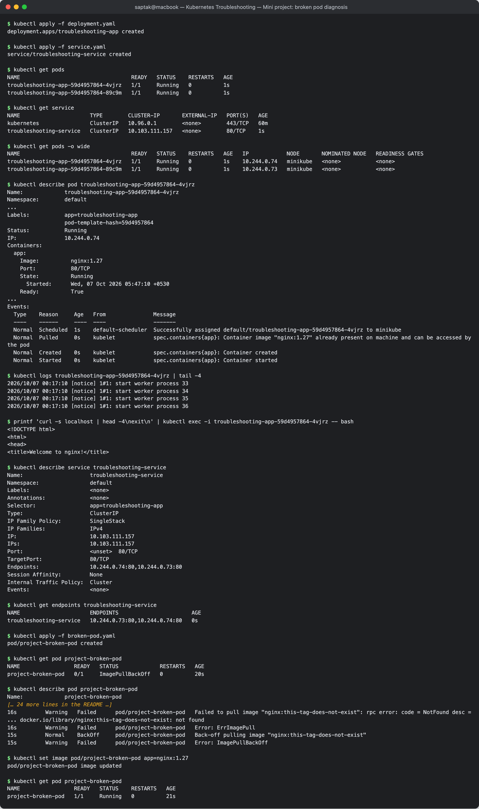

### 7. Your Task — answers

**Question 1: What is the Pod status?**
*Answer:* `ImagePullBackOff` (`READY 0/1`, `RESTARTS 0`; the Pod phase in `describe` is `Pending`). Watched over time it
alternates with `ErrImagePull`.

**Question 2: What is the actual error?**
*Answer:* `Failed to pull image "nginx:this-tag-does-not-exist": rpc error: code = NotFound desc = … docker.io/library/nginx:this-tag-does-not-exist: not found`, followed by `Error: ErrImagePull` and `Back-off pulling image`.

**Question 3: Which command helped you find the reason?**
*Answer:* `kubectl describe pod project-broken-pod` — the **Events** section at the bottom (the same lines are in
`kubectl get events --field-selector involvedObject.name=project-broken-pod`). `kubectl get` only showed the symptom
and `kubectl logs` has nothing to show because no container was ever created.

**Question 4: What is wrong with the image?**
*Answer:* The repository is fine (`nginx`, resolved to `docker.io/library/nginx`), but the **tag** `this-tag-does-not-exist`
does not exist on Docker Hub, so the registry returns `NotFound`.

**Question 5: How would you fix it?**
*Answer:* Point the Pod at an existing tag, e.g. `nginx:1.27`. For this bare Pod, `kubectl set image pod/project-broken-pod app=nginx:1.27`
works in place (image is a mutable Pod field) — done above, Pod became `1/1 Running`. The permanent fix is to correct
`image:` in `broken-pod.yaml` (or better, run it from a Deployment) and pin tags that are known to exist; verify a tag
with `docker pull`/`crictl pull` before deploying.

### 8. Service troubleshooting challenge

[`service-broken-selector.yaml`](./mini-project/service-broken-selector.yaml) = class `service.yaml` with
`app: wrong-app`:

```
$ kubectl apply -f service-broken-selector.yaml
service/troubleshooting-service configured

$ kubectl get service
NAME                      TYPE        CLUSTER-IP       EXTERNAL-IP   PORT(S)   AGE
kubernetes                ClusterIP   10.96.0.1        <none>        443/TCP   60m
troubleshooting-service   ClusterIP   10.103.111.157   <none>        80/TCP    35s

$ kubectl get endpoints troubleshooting-service
NAME                      ENDPOINTS   AGE
troubleshooting-service   <none>      34s

$ kubectl run svc-check --rm -i --restart=Never --image=curlimages/curl:8.6.0 -- sh -c "curl -sS -m 3 http://troubleshooting-service; echo exit=\$?"
curl: (7) Failed to connect to troubleshooting-service port 80 after 1 ms: Couldn't connect to server
exit=7
pod "svc-check" deleted from default namespace
```

`kubectl get service` looks perfectly normal — the problem is only visible in the endpoints: `<none>`.

### 9. Find the root cause

```
$ kubectl get pods --show-labels
NAME                                   READY   STATUS    RESTARTS   AGE   LABELS
project-broken-pod                     1/1     Running   0          23s   <none>
troubleshooting-app-59d4957864-4vjrz   1/1     Running   0          37s   app=troubleshooting-app,pod-template-hash=59d4957864
troubleshooting-app-59d4957864-89c9m   1/1     Running   0          37s   app=troubleshooting-app,pod-template-hash=59d4957864

$ kubectl describe service troubleshooting-service | grep -E "Selector|Endpoints"
Selector:                 app=wrong-app
Endpoints:

$ kubectl get pods -l app=wrong-app
No resources found in default namespace.
```

**Mismatch:** Pod label `app=troubleshooting-app` vs Service selector `app=wrong-app`. Fixed by re-applying the original
`service.yaml`:

```
$ kubectl apply -f service.yaml
service/troubleshooting-service configured

$ kubectl get endpoints troubleshooting-service
NAME                      ENDPOINTS                       AGE
troubleshooting-service   10.244.0.73:80,10.244.0.74:80   36s

$ kubectl run svc-check --rm -i --restart=Never --image=curlimages/curl:8.6.0 -- sh -c "curl -s -m 3 http://troubleshooting-service | grep title"
<title>Welcome to nginx!</title>
pod "svc-check" deleted from default namespace

$ kubectl run dns-check --rm -i --restart=Never --image=busybox:1.36 -- nslookup troubleshooting-service.default.svc.cluster.local
Server:		10.96.0.10
Address:	10.96.0.10:53


Name:	troubleshooting-service.default.svc.cluster.local
Address: 10.103.111.157

pod "dns-check" deleted from default namespace
```

(`kubectl run -i` attach banners and a duplicated log-stream fallback omitted.)

**Screenshot:** 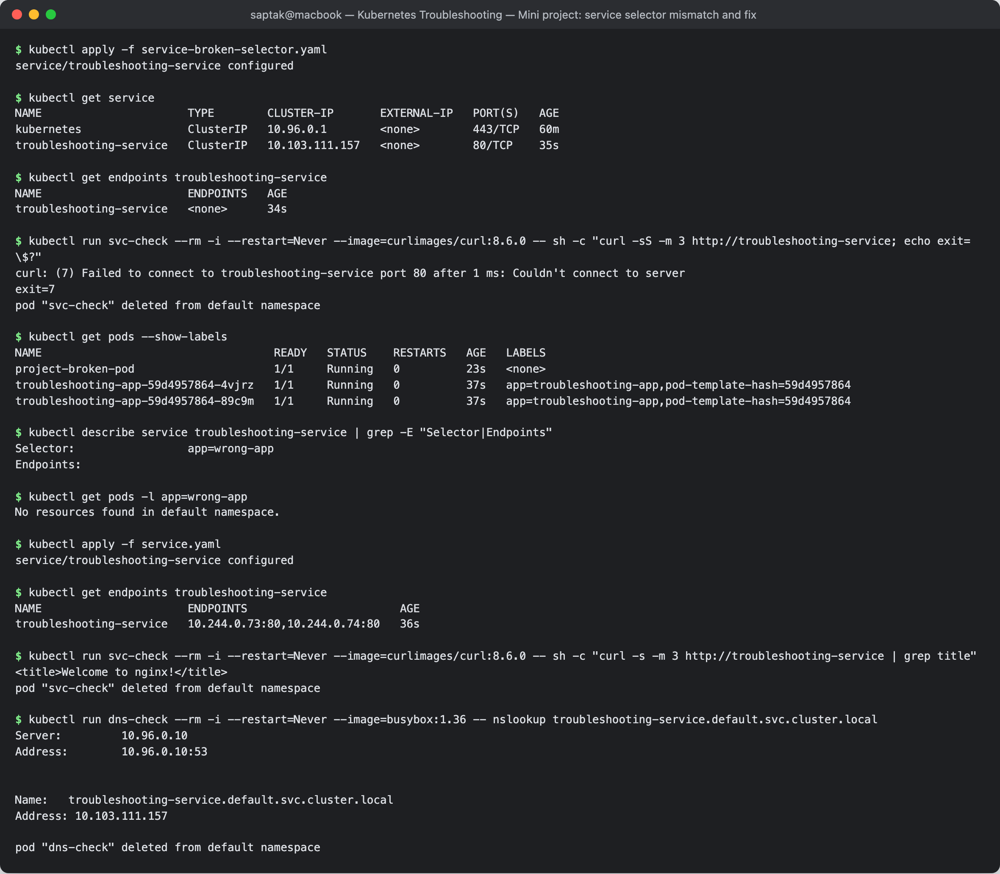

### 11. Troubleshooting table

| Problem | What I Saw | Command I Used | Root Cause | Fix |
| :--- | :--- | :--- | :--- | :--- |
| **Broken Pod** | `project-broken-pod 0/1 ImagePullBackOff`, `RESTARTS 0`, phase `Pending` | `kubectl get pod project-broken-pod`, `kubectl describe pod project-broken-pod` (Events) | the container could never be created because its image could not be pulled | `kubectl set image pod/project-broken-pod app=nginx:1.27` → `1/1 Running` |
| **Service Problem** | Service looked normal in `get service`, but `ENDPOINTS <none>` and curl `Couldn't connect to server` (exit 7) | `kubectl get endpoints troubleshooting-service`, `kubectl get pods --show-labels`, `kubectl describe service troubleshooting-service` | selector `app=wrong-app` matched no Pod (Pods are `app=troubleshooting-app`) | re-applied `service.yaml` with `app: troubleshooting-app` → 2 endpoints, HTTP 200 |
| **Image Problem** | `Failed to pull image "nginx:this-tag-does-not-exist" … not found`, `ErrImagePull` → `Back-off pulling image` | `kubectl describe pod` / `kubectl get events --field-selector involvedObject.name=project-broken-pod` | the tag `this-tag-does-not-exist` does not exist in `docker.io/library/nginx` | use an existing pinned tag (`nginx:1.27`) |

### 12. README questions

1. **What does `kubectl get` tell us?** A one-line-per-object summary of what exists and its current state — for Pods:
   READY containers, STATUS, RESTARTS, AGE (plus IP/node with `-o wide`). It is the first look: *which* object is
   unhealthy, not *why*.
2. **What is the difference between `get` and `describe`?** `get` is a terse table (or raw YAML/JSON with `-o`) of the
   object. `describe` is a human-readable report that adds related information — container states with exit codes,
   conditions, volumes, mounts, node info — and, crucially, the **Events** for that object, which is where the reason
   for most failures is written (`FailedScheduling`, `Failed to pull image`, `FailedMount`, `BackOff`).
3. **Why do we use `kubectl logs`?** To read the application's own stdout/stderr — the only place app-level errors
   appear (e.g. `[FATAL ERROR]: DATABASE_URL environment variable is MISSING!` in §2.9). `--previous` shows the last
   crashed instance, `-f` streams, `-c` picks a container. It only works once a container has actually started.
4. **When would you use `kubectl exec`?** When the container is running but behaving wrongly and you need to look from
   inside it: check config files and env vars, test the app on `localhost`, test DNS (`nslookup`) and connectivity to
   other Services/Pods from the Pod's own network namespace — e.g. `curl localhost` returning 200 in §2.8 proved the app
   was fine and the problem was the network.
5. **What does `CrashLoopBackOff` mean?** The container starts, its main process exits, the kubelet restarts it, and
   after repeated failures it waits with an exponentially growing back-off (10 s, 20 s, 40 s … max 5 min) before the next
   restart. It means "this keeps dying"; the cause is in `kubectl logs` and the exit code in `describe` (§2.1: exit 1).
6. **What does `ImagePullBackOff` mean?** The kubelet could not pull the container image (`ErrImagePull`) and is now
   waiting with back-off before retrying. Causes: tag or repository does not exist, private registry without
   `imagePullSecrets`, rate limiting, or the node cannot reach the registry. No container exists, so `RESTARTS` stays 0
   and `logs` is empty.
7. **Why can a Pod remain `Pending`?** The scheduler cannot find a node that satisfies it: requests larger than any
   node's allocatable CPU/memory, a `nodeSelector`/affinity that matches no node, taints without tolerations, an unbound
   PVC, quotas — or no nodes at all. `describe` shows a `FailedScheduling` event listing why each node was rejected
   (§2.4).
8. **Why can a Service have no endpoints?** Its selector matches no Pods (label typo, wrong namespace), or the matching
   Pods are not Ready (failing readiness probe, still starting), or it has no selector at all (then endpoints must be
   managed manually). Result: connections to the ClusterIP are refused (§2.6, mini-project §8).
9. **What is the relationship between a Service selector and Pod labels?** The selector is a label query; the endpoints
   controller continuously finds every **Ready** Pod in the same namespace whose labels contain all the selector's
   key/value pairs and publishes their IP:targetPort as the Service's endpoints. Labels are the only link — change
   either side and traffic routing changes immediately.
10. **What is Kubernetes DNS?** A cluster add-on (CoreDNS, reachable at the `kube-dns` Service, `10.96.0.10` here) that
    gives every Service a name `<service>.<namespace>.svc.cluster.local` resolving to its ClusterIP. Each Pod's
    `/etc/resolv.conf` points at it with search domains, so `web-service` works within a namespace and
    `postgres-db.production` across namespaces (§2.7).

---

## Cleanup

```bash
kubectl delete -f mini-project/deployment.yaml -f mini-project/service.yaml -f mini-project/broken-pod.yaml
kubectl delete -f 02-issues/08-pod-networking/
kubectl delete -f 02-issues/06-service-connectivity/deployment.yaml -f 02-issues/06-service-connectivity/service-fixed.yaml \
               -f 02-issues/06-service-connectivity/client-pod.yaml -f 02-issues/06-service-connectivity/dns-test-pod-fixed.yaml
kubectl delete -f 02-issues/07-dns/stand-in-db.yaml -f 02-issues/07-dns/fixed-pod.yaml
kubectl delete -f 02-issues/09-configuration/fixed-missing-env.yaml -f 02-issues/09-configuration/fixed-wrong-key.yaml \
               -f 02-issues/09-configuration/app-config.yaml
kubectl delete -f 01-commands/
```

## References

- https://kubernetes.io/docs/tasks/debug/debug-application/debug-pods/
- https://kubernetes.io/docs/tasks/debug/debug-application/debug-service/
- https://kubernetes.io/docs/tasks/administer-cluster/dns-debugging-resolution/
- https://kubernetes.io/docs/concepts/services-networking/network-policies/
- https://kubernetes.io/docs/reference/kubectl/
