# Monitoring, Observability & GitOps

**Author:** Saptak Banerjee
**Course:** SST DevOps & Cloud [SWE]
**Session:** 20 — Monitoring, Observability & GitOps
**Source material:** [`devops-heros/session20-monitoring-observability-gitops`](https://github.com/Nency-Ravaliya/devops-heros/tree/main/session20-monitoring-observability-gitops)

**Environment:** macOS + Docker Desktop (8 CPU / 7.75 GiB), single-node **kind v0.33.0** cluster `session20` (Kubernetes **v1.37.0**),
Helm **v4.3.0**, kube-prometheus-stack **92.0.0** (Grafana **13.2.3**), Argo CD **v3.5.4**, Jaeger **2.22.0**. Every output below is a real capture
(times are UTC unless the tool printed IST, +05:30).

---

## Table of Contents

| # | Task |
| --- | --- |
| 1 | [Monitoring](#task-1-monitoring) — metrics, logs, alerts, CPU utilization, memory utilization, application health (Prometheus, Alertmanager, Grafana) |
| 2 | [Observability](#task-2-observability) — the three pillars, why observability is required, common tools, Kubernetes observability, a real trace in Jaeger |
| 3 | [GitOps](#task-3-gitops) — what GitOps is, Git as source of truth, declarative configuration, continuous reconciliation, workflow, Kubernetes + GitOps |
| — | [Mini Project — GitOps with Argo CD](#mini-project--gitops-with-argo-cd) — Steps 1–9 and the 12 Final Viva Questions |
| — | [Cleanup](#cleanup) |

### Folder layout

```text
Monitoring, Observability & GitOps/
├── README.md
├── monitoring/
│   ├── kube-prometheus-stack-values.yaml   # trimmed Helm values for kind (Task 1)
│   ├── k8s-demo/{deployment,service}.yaml  # class 02-metrics-logs-traces demo, unchanged
│   ├── metrics-app.yaml                    # app exposing /metrics + probes + ServiceMonitor
│   ├── traffic.yaml                        # in-cluster load generator for the metrics app
│   ├── alert-rules.yaml                    # PrometheusRule: AppDown, PodRestarting, HighPodCPU, HighPodMemory
│   └── trigger-{cpu-burner,crashloop,memory-hog}.yaml   # pods that make the alerts fire
├── tracing/
│   ├── docker-compose.yml                  # Jaeger v2 + HotROD (OpenTelemetry) (Task 2)
│   └── trace-summary.jq                    # flattens a Jaeger trace into a span timeline
├── gitops/
│   ├── argocd-application.yaml             # the Argo CD Application — OUTSIDE the watched path
│   └── app/                                # the path Argo CD watches (Mini Project)
│       ├── namespace.yaml
│       ├── deployment.yaml                 # replicas: 3 (was 2 — changed through Git, Step 7)
│       └── service.yaml
└── screenshots/CAPTURE-LIST.md
```

---

## Task 1: Monitoring

Monitoring answers *"is the system healthy?"* with signals we decided to watch in advance. The demo stack is
**kube-prometheus-stack** — Prometheus (metrics + alert rules), Alertmanager (alert routing), Grafana (dashboards),
node-exporter (node metrics), kube-state-metrics (Kubernetes object state) and the Prometheus Operator — on a kind cluster.

### 1.1 Create the cluster and install kube-prometheus-stack

The cluster uses its own kubeconfig file so the default kube context is untouched.

```
$ kind create cluster --name session20 --kubeconfig $S/s20/kubeconfig
Creating cluster "session20" ...
 ✓ Ensuring node image (kindest/node:v1.37.0) 🖼️
 ✓ Preparing nodes 📦
 ✓ Writing configuration 📜
 ✓ Starting control-plane 🕹️
 ✓ Installing CNI 🔌
 ✓ Installing StorageClass 💾
Set kubectl context to "kind-session20"
...
$ export KUBECONFIG=$S/s20/kubeconfig
```

The chart's defaults are sized for a real cluster, so [`monitoring/kube-prometheus-stack-values.yaml`](./monitoring/kube-prometheus-stack-values.yaml)
trims it for a laptop:

| Setting | Why |
| --- | --- |
| `kubeEtcd/kubeScheduler/kubeControllerManager/kubeProxy.enabled: false` (+ their default rule groups) | kind binds these to `127.0.0.1`, so Prometheus can't scrape them and would raise permanent `TargetDown` alerts |
| `scrapeInterval: 15s`, `evaluationInterval: 15s`, `retention: 6h`, `retentionSize: 1GB` | fast feedback for the alert demo, small disk |
| `serviceMonitorSelectorNilUsesHelmValues / podMonitor... / ruleSelectorNilUsesHelmValues: false` | Prometheus picks up *my* ServiceMonitor and PrometheusRule without needing the `release: kps` label |
| `prometheus-node-exporter.hostRootFsMount.enabled: false` | Docker Desktop's root mount is not `rshared`, which breaks node-exporter's `/` mount on kind-on-macOS |
| small `resources` on every component | fits next to Argo CD on 7.75 GiB |

```
$ helm install kps prometheus-community/kube-prometheus-stack --version 92.0.0 -n monitoring --create-namespace -f kube-prometheus-stack-values.yaml
NAME: kps
LAST DEPLOYED: Wed Oct  7 06:04:18 2026
NAMESPACE: monitoring
STATUS: deployed
REVISION: 1
DESCRIPTION: Install complete
NOTES:
kube-prometheus-stack has been installed. Check its status by running:
  kubectl --namespace monitoring get pods -l "release=kps"
...

$ helm list -n monitoring
NAME	NAMESPACE 	REVISION	UPDATED                             	STATUS  	CHART                       	APP VERSION
kps 	monitoring	1       	2026-10-07 06:04:18.115954 +0530 IST	deployed	kube-prometheus-stack-92.0.0	v0.94.1    

$ kubectl get pods -n monitoring
NAME                                                    READY   STATUS    RESTARTS   AGE
alertmanager-kps-kube-prometheus-stack-alertmanager-0   2/2     Running   0          3m6s
kps-grafana-6b5674744d-2vwv7                            3/3     Running   0          3m35s
kps-kube-prometheus-stack-operator-6f997cb99f-zdg2z     1/1     Running   0          3m35s
kps-kube-state-metrics-5fff95b88d-fjnbs                 1/1     Running   0          3m35s
kps-prometheus-node-exporter-lk5l9                      1/1     Running   0          3m35s
prometheus-kps-kube-prometheus-stack-prometheus-0       2/2     Running   0          3m6s

$ kubectl get svc -n monitoring
NAME                                     TYPE        CLUSTER-IP      EXTERNAL-IP   PORT(S)                      AGE
alertmanager-operated                    ClusterIP   None            <none>        9093/TCP,9094/TCP,9094/UDP   3m6s
kps-grafana                              ClusterIP   10.96.68.65     <none>        80/TCP                       3m35s
kps-kube-prometheus-stack-alertmanager   ClusterIP   10.96.68.21     <none>        9093/TCP,8080/TCP            3m35s
kps-kube-prometheus-stack-operator       ClusterIP   10.96.107.225   <none>        443/TCP                      3m35s
kps-kube-prometheus-stack-prometheus     ClusterIP   10.96.110.211   <none>        9090/TCP,8080/TCP            3m35s
kps-kube-state-metrics                   ClusterIP   10.96.28.147    <none>        8080/TCP                     3m35s
kps-prometheus-node-exporter             ClusterIP   10.96.9.103     <none>        9100/TCP                     3m35s
prometheus-operated                      ClusterIP   None            <none>        9090/TCP                     3m6s
```

Everything is `ClusterIP`; the UIs/APIs are reached with port-forwards (host ports shifted to 19090/19093/13000 because
other port-forwards were already using 9090/3000 on this machine):

```
$ kubectl -n monitoring port-forward svc/kps-kube-prometheus-stack-prometheus 19090:9090 &
$ kubectl -n monitoring port-forward svc/kps-kube-prometheus-stack-alertmanager 19093:9093 &
$ kubectl -n monitoring port-forward svc/kps-grafana 13000:80 &
Forwarding from 127.0.0.1:19093 -> 9093
Forwarding from 127.0.0.1:13000 -> 3000
Forwarding from 127.0.0.1:19090 -> 9090

$ curl -s localhost:19090/-/ready; curl -s localhost:19093/-/ready
Prometheus Server is Ready.
OK
```

**Screenshot:** 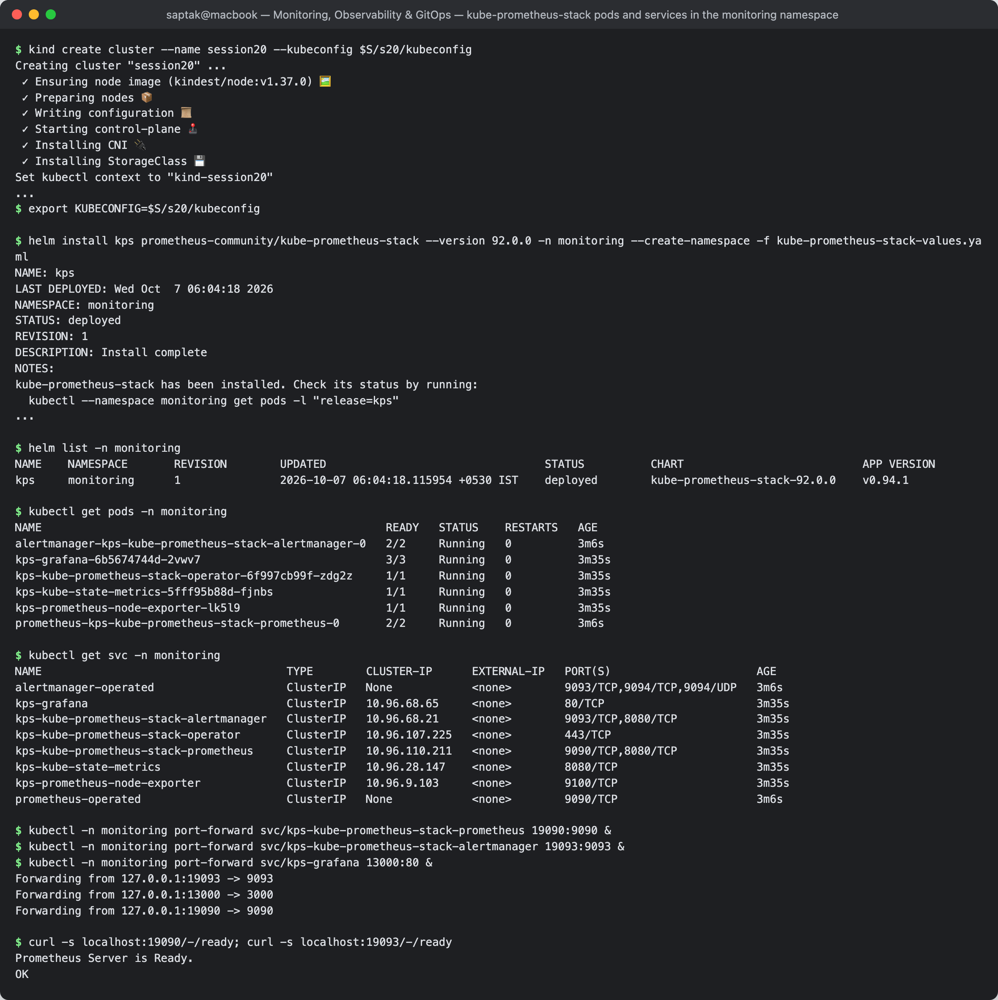

### 1.2 Deploy the demo workloads

Two workloads in `default`:

- the class demo [`k8s-demo/`](./monitoring/k8s-demo/) from `02-metrics-logs-traces` (a busybox loop that only writes **logs**), unchanged;
- [`metrics-app.yaml`](./monitoring/metrics-app.yaml): 2 replicas of `quay.io/brancz/prometheus-example-app:v0.5.0`, a tiny HTTP server that
  exposes **metrics** on `/metrics`, with readiness/liveness probes and CPU/memory limits, plus a `ServiceMonitor` that tells
  Prometheus to scrape it every 15 s. [`traffic.yaml`](./monitoring/traffic.yaml) sends it ~2 req/s (every 10th to `/err` → 404).

Plus [`alert-rules.yaml`](./monitoring/alert-rules.yaml), the `PrometheusRule` used in 1.5.

```
$ kubectl apply -f k8s-demo/
deployment.apps/session20-demo created
service/session20-demo created
$ kubectl apply -f metrics-app.yaml
deployment.apps/session20-metrics-app created
service/session20-metrics-app created
servicemonitor.monitoring.coreos.com/session20-metrics-app created
$ kubectl apply -f alert-rules.yaml
prometheusrule.monitoring.coreos.com/session20-alerts created
$ kubectl apply -f traffic.yaml
pod/traffic created

$ kubectl get deploy,pods,svc -o wide
NAME                                    READY   UP-TO-DATE   AVAILABLE   AGE    CONTAINERS   IMAGES                                         SELECTOR
deployment.apps/session20-demo          1/1     1            1           100s   app          busybox:1.36                                   app=session20-demo
deployment.apps/session20-metrics-app   2/2     2            2           100s   app          quay.io/brancz/prometheus-example-app:v0.5.0   app=session20-metrics-app

NAME                                         READY   STATUS    RESTARTS   AGE    IP            NODE                      NOMINATED NODE   READINESS GATES
pod/session20-demo-6698db549f-4wjqb          1/1     Running   0          100s   10.244.0.19   session20-control-plane   <none>           <none>
pod/session20-metrics-app-5b4864c85d-dcz9n   1/1     Running   0          100s   10.244.0.21   session20-control-plane   <none>           <none>
pod/session20-metrics-app-5b4864c85d-z7hlr   1/1     Running   0          100s   10.244.0.20   session20-control-plane   <none>           <none>
pod/traffic                                  1/1     Running   0          50s    10.244.0.22   session20-control-plane   <none>           <none>

NAME                            TYPE        CLUSTER-IP     EXTERNAL-IP   PORT(S)    AGE     SELECTOR
service/kubernetes              ClusterIP   10.96.0.1      <none>        443/TCP    6m14s   <none>
service/session20-demo          ClusterIP   10.96.2.112    <none>        8080/TCP   100s    app=session20-demo
service/session20-metrics-app   ClusterIP   10.96.221.68   <none>        8080/TCP   100s    app=session20-metrics-app

$ kubectl get servicemonitor,prometheusrule
NAME                                                         AGE
servicemonitor.monitoring.coreos.com/session20-metrics-app   100s

NAME                                                    AGE
prometheusrule.monitoring.coreos.com/session20-alerts   100s
```

What Prometheus actually pulls from the app — the raw exposition format (one sample per label combination):

```
$ kubectl port-forward svc/session20-metrics-app 18081:8080 >/dev/null 2>&1 & sleep 2; curl -s localhost:18081/metrics | grep -E '^(# (HELP|TYPE) )?(http_requests_total|version)'
# HELP http_requests_total Count of all HTTP requests
# TYPE http_requests_total counter
http_requests_total{code="200",method="get"} 72
http_requests_total{code="404",method="get"} 3
# HELP version Version information about this binary
# TYPE version gauge
version{version="v0.5.0"} 1
```

The class `session20-demo` Service points at port 8080, but the busybox container listens on nothing — it is a
logs-only demo, so Prometheus has nothing to scrape there. That is why a second, metrics-exposing app was added.

### 1.3 Metrics — `up`, CPU utilization, memory utilization

Prometheus' HTTP API (`/api/v1/query`) is what the UI and Grafana call. To keep the outputs readable, a small shell
helper prints one line per series:

```bash
q() {
  curl -s http://localhost:19090/api/v1/query --data-urlencode "query=$1" |
    jq -r '.data.result[] | "\(.metric | del(.__name__) | with_entries(select(.key | IN("job","instance","namespace","pod","container","code","alertname","condition","deployment","probe_type","result","severity","alertstate"))) | to_entries | map("\(.key)=\(.value)") | join(" "))  =>  \(.value[1] | tonumber * 1000 | round / 1000)"'
}
```

**`up` — is every scrape target reachable?** (`1` = last scrape succeeded):

```
$ curl -s http://localhost:19090/api/v1/query --data-urlencode 'query=up' | jq -r '.data.result[] | "\(.value[1])  \(.metric.job)  \(.metric.instance)"' | sort -k2
1  apiserver  172.18.0.2:6443
1  coredns  10.244.0.3:9153
1  coredns  10.244.0.4:9153
1  kps-grafana  10.244.0.8:3000
1  kps-kube-prometheus-stack-alertmanager  10.244.0.17:8080
1  kps-kube-prometheus-stack-alertmanager  10.244.0.17:9093
1  kps-kube-prometheus-stack-operator  10.244.0.6:10250
1  kps-kube-prometheus-stack-prometheus  10.244.0.18:8080
1  kps-kube-prometheus-stack-prometheus  10.244.0.18:9090
1  kube-state-metrics  10.244.0.7:8080
1  kubelet  172.18.0.2:10250
1  kubelet  172.18.0.2:10250
1  kubelet  172.18.0.2:10250
1  node-exporter  172.18.0.2:9100
1  session20-metrics-app  10.244.0.20:8080
1  session20-metrics-app  10.244.0.21:8080

$ curl -s http://localhost:19090/api/v1/query --data-urlencode 'query=sum by (job) (up)' | jq -r '.data.result[] | "\(.metric.job) => \(.value[1]) target(s) up"'
apiserver => 1 target(s) up
kps-kube-prometheus-stack-prometheus => 2 target(s) up
kps-kube-prometheus-stack-operator => 1 target(s) up
kubelet => 3 target(s) up
kube-state-metrics => 1 target(s) up
kps-grafana => 1 target(s) up
node-exporter => 1 target(s) up
coredns => 2 target(s) up
kps-kube-prometheus-stack-alertmanager => 2 target(s) up
session20-metrics-app => 2 target(s) up
```

The ServiceMonitor worked: both app Pods are targets. The three `kubelet` targets are `/metrics`, `/metrics/cadvisor`
(per-container CPU/memory) and `/metrics/probes` (probe results, used in 1.6).

**CPU and memory utilization — node level** (node-exporter):

```
$ q '100 * (1 - avg by (instance) (rate(node_cpu_seconds_total{mode="idle"}[2m])))'
instance=172.18.0.2:9100  =>  6.075

$ q 'count by (instance) (node_cpu_seconds_total{mode="idle"})'
instance=172.18.0.2:9100  =>  8

$ q '100 * (1 - node_memory_MemAvailable_bytes / node_memory_MemTotal_bytes)'
container=node-exporter instance=172.18.0.2:9100 job=node-exporter namespace=monitoring pod=kps-prometheus-node-exporter-lk5l9  =>  39.415

$ q 'node_memory_MemTotal_bytes / 1024^3'
container=node-exporter instance=172.18.0.2:9100 job=node-exporter namespace=monitoring pod=kps-prometheus-node-exporter-lk5l9  =>  7.75
```

CPU utilization is derived, not stored: `node_cpu_seconds_total` is a counter of seconds each core spent in each mode;
`rate(...{mode="idle"}[2m])` is the idle fraction per core, so `1 − avg(idle)` = **6.1 % busy across 8 cores**. Memory
is **39.4 % of 7.75 GiB** in use — the "node" is the Docker Desktop VM, so these are its numbers.

**CPU and memory — per Pod** (cAdvisor via kubelet):

```
$ q 'topk(5, sum by (namespace, pod) (rate(container_cpu_usage_seconds_total{container!=""}[2m])))'
namespace=kube-system pod=kube-apiserver-session20-control-plane  =>  0.074
namespace=monitoring pod=prometheus-kps-kube-prometheus-stack-prometheus-0  =>  0.036
namespace=kube-system pod=etcd-session20-control-plane  =>  0.03
namespace=monitoring pod=kps-grafana-6b5674744d-2vwv7  =>  0.026
namespace=kube-system pod=kube-controller-manager-session20-control-plane  =>  0.021

$ q 'topk(5, sum by (namespace, pod) (container_memory_working_set_bytes{container!=""}) / 1024^2)'
namespace=kube-system pod=kube-apiserver-session20-control-plane  =>  735.172
namespace=monitoring pod=kps-grafana-6b5674744d-2vwv7  =>  398.668
namespace=monitoring pod=prometheus-kps-kube-prometheus-stack-prometheus-0  =>  254.426
namespace=argocd pod=argocd-dex-server-66c78cf887-jzc5m  =>  104.969
namespace=kube-system pod=etcd-session20-control-plane  =>  94.266

$ q 'sum by (pod) (rate(container_cpu_usage_seconds_total{namespace="default", container!=""}[2m]))'
pod=session20-demo-6698db549f-4wjqb  =>  0
pod=session20-metrics-app-5b4864c85d-dcz9n  =>  0.003
pod=session20-metrics-app-5b4864c85d-z7hlr  =>  0.002
pod=traffic  =>  0.005

$ q 'sum by (pod) (container_memory_working_set_bytes{namespace="default", container!=""}) / 1024^2'
pod=session20-demo-6698db549f-4wjqb  =>  0.309
pod=session20-metrics-app-5b4864c85d-dcz9n  =>  12.664
pod=session20-metrics-app-5b4864c85d-z7hlr  =>  7.082
pod=traffic  =>  0.344
```

CPU is in **cores** (0.074 = 74 millicores), memory in **MiB** of *working set* (the number the kubelet uses for
OOM/eviction decisions). Note Grafana at ~399 MiB — this becomes important in 1.7.

**Application metric — request rate by status code:**

```
$ q 'sum by (code) (rate(http_requests_total{job="session20-metrics-app"}[2m]))'
code=200  =>  1.323
code=404  =>  0.104
```

≈1.3 req/s succeed and ≈0.1 req/s hit `/err` — the 1-in-10 ratio `traffic.yaml` generates, recovered from a counter.

**Screenshot:** 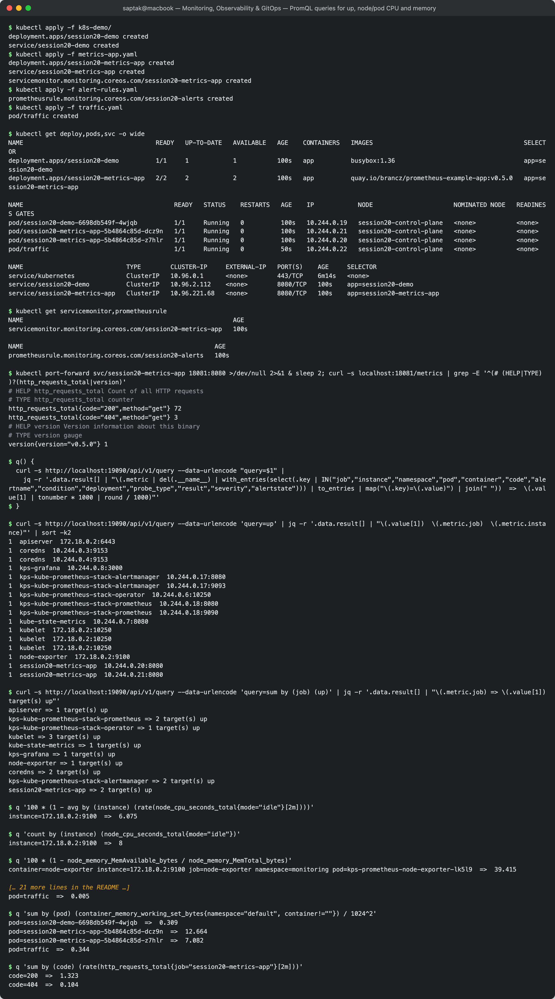

### 1.4 Logs

```
$ kubectl logs deployment/session20-demo --timestamps | head -3
2026-10-07T00:38:24.695635833Z Session 20 observability demo started
2026-10-07T00:38:24.695651083Z Request received
2026-10-07T00:38:24.695652166Z Health check OK

$ kubectl logs deployment/session20-demo --timestamps --tail=4
2026-10-07T00:40:24.713669708Z Request received
2026-10-07T00:40:24.713729625Z Health check OK
2026-10-07T00:40:34.714278379Z Request received
2026-10-07T00:40:34.714356296Z Health check OK

$ kubectl logs deployment/session20-demo --since=1m | sort | uniq -c
   6 Health check OK
   6 Request received

$ kubectl describe deployment session20-demo | sed -n "1,40p"
Name:                   session20-demo
Namespace:              default
CreationTimestamp:      Wed, 07 Oct 2026 06:08:11 +0530
...
Replicas:               1 desired | 1 updated | 1 total | 1 available | 0 unavailable
StrategyType:           RollingUpdate
...
Conditions:
  Type           Status  Reason
  ----           ------  ------
  Available      True    MinimumReplicasAvailable
  Progressing    True    NewReplicaSetAvailable
OldReplicaSets:  <none>
NewReplicaSet:   session20-demo-6698db549f (1/1 replicas created)
```

These are exactly the lines the class README expects. `--since=1m | uniq -c` turns logs into a crude metric
(6 events/min = one loop every 10 s) — which is what log-based metrics in Loki/Elasticsearch do at scale. The logs of a
*crashing* container (`--previous`) appear in the alert demo below.

Loki was not installed: `kubectl logs` reads the kubelet's per-container log files, which is enough on a single node,
but those logs disappear with the Pod. A log backend (Loki + Promtail/Alloy, or EFK) is what keeps them after Pods die.

### 1.5 Alerts

[`alert-rules.yaml`](./monitoring/alert-rules.yaml) is a `PrometheusRule`; the Operator turns it into a Prometheus rule file.

| Alert | Expression (abridged) | `for` | Severity |
| --- | --- | --- | --- |
| `Session20AppDown` | `up{job="session20-metrics-app"} == 0` | 30s | critical |
| `Session20PodRestarting` | `increase(kube_pod_container_status_restarts_total{namespace="default"}[5m]) > 0` | 15s | warning |
| `Session20HighPodCPU` | `sum by (namespace,pod) (rate(container_cpu_usage_seconds_total{…}[1m])) > 0.2` | 1m | warning |
| `Session20HighPodMemory` | working set ÷ `kube_pod_container_resource_limits{resource="memory"}` `> 0.8` | 1m | warning |

Loaded and healthy, nothing firing yet:

```
$ curl -s http://localhost:19090/api/v1/rules | jq -r '.data.groups[] | select(.name=="session20.rules") | .rules[] | "\(.name)  state=\(.state)  health=\(.health)"'
Session20AppDown  state=inactive  health=ok
Session20PodRestarting  state=inactive  health=ok
Session20HighPodCPU  state=inactive  health=ok
Session20HighPodMemory  state=inactive  health=ok

$ curl -s http://localhost:19090/api/v1/alerts | jq -r '.data.alerts[] | "\(.labels.alertname)  \(.state)  \(.labels.severity)"'
Watchdog  firing  none
PrometheusMissingRuleEvaluations  pending  warning
PrometheusMissingRuleEvaluations  pending  warning
PrometheusMissingRuleEvaluations  pending  warning
NodeClockNotSynchronising  pending  warning
```

`Watchdog` is *meant* to always fire (a dead-man's switch: if it stops arriving downstream, the alerting pipeline is broken).
The other two are chart defaults reacting to the freshly started stack.

**Trigger all four.** Three trigger Pods plus one realistic misconfiguration — pointing the app's Service at a port
nobody listens on, so the endpoints still exist but every scrape fails:

- [`trigger-cpu-burner.yaml`](./monitoring/trigger-cpu-burner.yaml) — `while true; do :; done` capped at 0.5 CPU
- [`trigger-crashloop.yaml`](./monitoring/trigger-crashloop.yaml) — logs a fatal DB error and `exit 1` after 5 s
- [`trigger-memory-hog.yaml`](./monitoring/trigger-memory-hog.yaml) — `dd` holds a 54 MiB buffer under a 64 Mi limit

```
$ date -u +%H:%M:%SZ
00:41:04Z

$ kubectl apply -f trigger-cpu-burner.yaml -f trigger-crashloop.yaml -f trigger-memory-hog.yaml
pod/cpu-burner created
deployment.apps/crashy created
pod/memory-hog created

$ kubectl patch svc session20-metrics-app --type=json -p '[{"op":"replace","path":"/spec/ports/0/targetPort","value":9999}]'
service/session20-metrics-app patched

$ kubectl get endpointslices -l kubernetes.io/service-name=session20-metrics-app
NAME                          ADDRESSTYPE   PORTS   ENDPOINTS                 AGE
session20-metrics-app-962kp   IPv4          9999    10.244.0.20,10.244.0.21   2m53s
```

23 seconds later the alerts are **pending** (condition true, waiting out `for`):

```
$ date -u +%H:%M:%SZ
00:41:27Z

$ curl -s http://localhost:19090/api/v1/alerts | jq -r '.data.alerts[] | select(.labels.alertname | startswith("Session20")) | "\(.labels.alertname)  \(.state)  since=\(.activeAt)  \(.annotations.summary)"'
Session20AppDown  pending  since=2026-10-07T00:41:19.47650051Z  session20-metrics-app target 10.244.0.21:9999 is down
Session20AppDown  pending  since=2026-10-07T00:41:19.47650051Z  session20-metrics-app target 10.244.0.20:9999 is down
Session20HighPodMemory  pending  since=2026-10-07T00:41:19.47650051Z  Container memory-hog/hog is near its memory limit
```

…and after the `for` windows, all four are **firing** in Prometheus and **active** in Alertmanager:

```
$ date -u +%H:%M:%SZ
00:42:48Z

$ kubectl get pods
NAME                                     READY   STATUS    RESTARTS      AGE
cpu-burner                               1/1     Running   0             104s
crashy-74b8c678f6-wb4c9                  0/1     Error     3 (75s ago)   104s
memory-hog                               1/1     Running   0             104s
session20-demo-6698db549f-4wjqb          1/1     Running   0             4m37s
session20-metrics-app-5b4864c85d-dcz9n   1/1     Running   0             4m37s
session20-metrics-app-5b4864c85d-z7hlr   1/1     Running   0             4m37s
traffic                                  1/1     Running   0             3m47s

$ curl -s http://localhost:19090/api/v1/alerts | jq -r '.data.alerts[] | select(.labels.alertname | startswith("Session20")) | "\(.labels.alertname)  \(.state)  since=\(.activeAt)  value=\(.value)\n    \(.annotations.description)"'
Session20AppDown  firing  since=2026-10-07T00:41:19.47650051Z  value=0e+00
    Prometheus could not scrape 10.244.0.21:9999 for 30s.
Session20AppDown  firing  since=2026-10-07T00:41:19.47650051Z  value=0e+00
    Prometheus could not scrape 10.244.0.20:9999 for 30s.
Session20PodRestarting  firing  since=2026-10-07T00:41:34.47650051Z  value=3.56158502439935e+00
    Container app restarted 4 time(s) in the last 5 minutes.
Session20HighPodCPU  firing  since=2026-10-07T00:41:34.47650051Z  value=3.945769139883326e-01
    cpu-burner has used 0.39 CPU cores for over 1 minute (threshold 0.2).
Session20HighPodMemory  firing  since=2026-10-07T00:41:19.47650051Z  value=8.560791015625e-01
    Working set is 85.61% of the memory limit.

$ curl -s http://localhost:19093/api/v2/alerts | jq -r '.[] | select(.labels.alertname | startswith("Session20")) | "\(.labels.alertname)  severity=\(.labels.severity)  state=\(.status.state)  startsAt=\(.startsAt)  pod=\(.labels.pod // .labels.instance)"'
Session20AppDown  severity=critical  state=active  startsAt=2026-10-07T00:41:49.476Z  pod=session20-metrics-app-5b4864c85d-dcz9n
Session20HighPodMemory  severity=warning  state=active  startsAt=2026-10-07T00:42:19.476Z  pod=memory-hog
Session20AppDown  severity=critical  state=active  startsAt=2026-10-07T00:41:49.476Z  pod=session20-metrics-app-5b4864c85d-z7hlr
Session20PodRestarting  severity=warning  state=active  startsAt=2026-10-07T00:41:49.476Z  pod=crashy-74b8c678f6-wb4c9
Session20HighPodCPU  severity=warning  state=active  startsAt=2026-10-07T00:42:34.476Z  pod=cpu-burner

$ curl -s 'http://localhost:19093/api/v2/alerts/groups' | jq -r '.[] | select(.alerts | any(.labels.alertname | startswith("Session20"))) | "receiver=\(.receiver.name)  group=\(.labels)  alerts=\(.alerts | length)"'
receiver=null  group={"namespace":"default"}  alerts=5
```

Reading the timestamps: Prometheus' `activeAt` is when the expression first became true; Alertmanager's `startsAt`
is `activeAt + for` (AppDown: 00:41:19 + 30 s = 00:41:49; CPU: 00:41:34 + 1 m = 00:42:34) — the `for` clause is what stops
a single bad scrape from paging someone. Alertmanager grouped all five by `namespace` into one notification, and routed it to
the chart's default `null` receiver — there is no Slack/e-mail/PagerDuty configured in this lab, which is the next thing a real setup adds.

The same signals as **utilization of the container's own limits** (what actually decides throttling and OOM kills):

```
$ q 'up{job="session20-metrics-app"}'
instance=10.244.0.21:9999 job=session20-metrics-app namespace=default pod=session20-metrics-app-5b4864c85d-dcz9n  =>  0
instance=10.244.0.20:9999 job=session20-metrics-app namespace=default pod=session20-metrics-app-5b4864c85d-z7hlr  =>  0

$ q 'sum by (pod) (rate(container_cpu_usage_seconds_total{namespace="default", container!=""}[1m])) / sum by (pod) (kube_pod_container_resource_limits{namespace="default", resource="cpu"})'
pod=session20-metrics-app-5b4864c85d-dcz9n  =>  0.001
pod=session20-metrics-app-5b4864c85d-z7hlr  =>  0.002
pod=traffic  =>  0.052
pod=cpu-burner  =>  1
pod=memory-hog  =>  0

$ q 'max by (pod) (container_memory_working_set_bytes{namespace="default", container!=""}) / max by (pod) (kube_pod_container_resource_limits{namespace="default", resource="memory"})'
pod=session20-metrics-app-5b4864c85d-dcz9n  =>  0.224
pod=session20-metrics-app-5b4864c85d-z7hlr  =>  0.175
pod=traffic  =>  0.02
pod=cpu-burner  =>  0.01
pod=memory-hog  =>  0.856

$ q 'increase(kube_pod_container_status_restarts_total{namespace="default"}[5m])'
...
container=app instance=10.244.0.7:8080 job=kube-state-metrics namespace=default pod=crashy-74b8c678f6-wb4c9  =>  3.436
...
```

`cpu-burner` sits at exactly **1.0 = 100 % of its 0.5-core limit** (the CFS quota throttles it there), and `memory-hog`
at **85.6 % of 64 Mi**. Restarts come from kube-state-metrics (`increase()` extrapolates over the window, hence 3.436 not an integer).

What the crashing container said before dying — `--previous` reads the *last terminated* container:

```
$ kubectl get pod -l app=crashy
NAME                      READY   STATUS    RESTARTS      AGE
crashy-74b8c678f6-wb4c9   1/1     Running   4 (54s ago)   115s

$ kubectl logs deploy/crashy --timestamps
2026-10-07T00:42:55.117023583Z crashy starting

$ kubectl logs deploy/crashy --previous --timestamps
2026-10-07T00:42:00.037264294Z crashy starting
2026-10-07T00:42:05.040102130Z FATAL: cannot connect to database at db:5432

$ kubectl get pod -l app=crashy -o jsonpath="{.items[0].status.containerStatuses[0].lastState.terminated}" | jq -c "{exitCode, reason, startedAt, finishedAt}"
{"exitCode":1,"reason":"Error","startedAt":"2026-10-07T00:41:28Z","finishedAt":"2026-10-07T00:41:33Z"}
```

The alert tells you *that* the Pod restarts; the previous container's log tells you *why* (cannot reach the database) —
metrics and logs answering different questions about the same incident.

**Screenshot:** 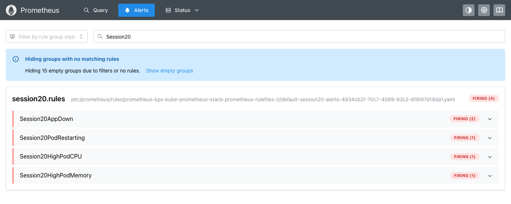

**Screenshot:** 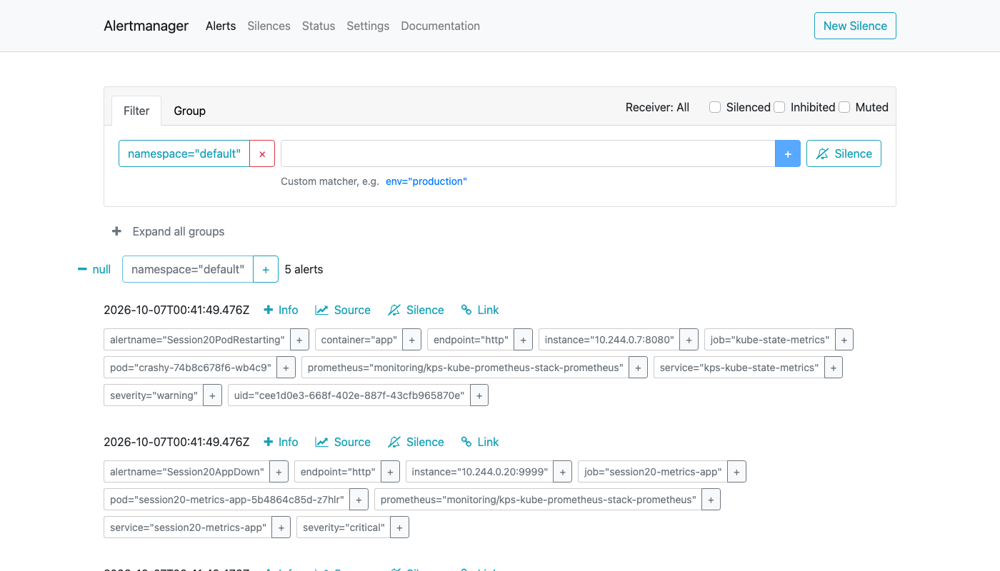

**Resolve:** restore the Service from its manifest and remove the triggers.

```
$ date -u +%H:%M:%SZ
00:48:09Z

$ kubectl apply -f metrics-app.yaml
deployment.apps/session20-metrics-app unchanged
service/session20-metrics-app configured
servicemonitor.monitoring.coreos.com/session20-metrics-app unchanged

$ kubectl delete -f trigger-cpu-burner.yaml -f trigger-crashloop.yaml -f trigger-memory-hog.yaml --wait=false
pod "cpu-burner" deleted from default namespace
deployment.apps "crashy" deleted from default namespace
pod "memory-hog" deleted from default namespace

$ date -u +%H:%M:%SZ
00:52:37Z

$ curl -s http://localhost:19090/api/v1/alerts | jq '[.data.alerts[] | select(.labels.alertname | startswith("Session20"))] | length'
0

$ curl -s http://localhost:19090/api/v1/rules | jq -r '.data.groups[] | select(.name=="session20.rules") | .rules[] | "\(.name)  state=\(.state)"'
Session20AppDown  state=inactive
Session20PodRestarting  state=inactive
Session20HighPodCPU  state=inactive
Session20HighPodMemory  state=inactive

$ curl -s http://localhost:19093/api/v2/alerts | jq '[.[] | select(.labels.alertname | startswith("Session20"))] | length'
0

$ q 'up{job="session20-metrics-app"}'
container=app instance=10.244.0.21:8080 job=session20-metrics-app namespace=default pod=session20-metrics-app-5b4864c85d-dcz9n  =>  1
container=app instance=10.244.0.20:8080 job=session20-metrics-app namespace=default pod=session20-metrics-app-5b4864c85d-z7hlr  =>  1
```

It took **4 min 28 s** until no `Session20*` alert was left. The cause was fixed at once, so the lag comes from the
rule itself: `PodRestarting` uses `increase(...[5m])`, which stays above 0 until the last restart ages out of the 5-minute
window. The window in an expression decides how long an alert lingers after the cause is gone.

### 1.6 Application health

Health is visible at three levels: the kubelet's **probes**, Prometheus' **`up`**, and **kube-state-metrics**' view of readiness/availability.

```
$ kubectl describe pod -l app=session20-metrics-app | grep -E "^Name:|Liveness:|Readiness:|^  Ready|ContainersReady"
Name:             session20-metrics-app-5b4864c85d-dcz9n
    Liveness:     http-get http://:http/ delay=5s timeout=1s period=10s successThreshold=1 failureThreshold=3
    Readiness:    http-get http://:http/ delay=0s timeout=1s period=5s successThreshold=1 failureThreshold=3
  Ready                       True 
  ContainersReady             True 
Name:             session20-metrics-app-5b4864c85d-z7hlr
    Liveness:     http-get http://:http/ delay=5s timeout=1s period=10s successThreshold=1 failureThreshold=3
    Readiness:    http-get http://:http/ delay=0s timeout=1s period=5s successThreshold=1 failureThreshold=3
  Ready                       True 
  ContainersReady             True 

$ q 'up{job="session20-metrics-app"}'
container=app instance=10.244.0.21:8080 job=session20-metrics-app namespace=default pod=session20-metrics-app-5b4864c85d-dcz9n  =>  1
container=app instance=10.244.0.20:8080 job=session20-metrics-app namespace=default pod=session20-metrics-app-5b4864c85d-z7hlr  =>  1

$ q 'sum by (pod) (kube_pod_status_ready{namespace="default", condition="true"})'
pod=session20-demo-6698db549f-4wjqb  =>  1
pod=session20-metrics-app-5b4864c85d-dcz9n  =>  1
pod=session20-metrics-app-5b4864c85d-z7hlr  =>  1
pod=traffic  =>  1

$ q 'sum by (deployment) (kube_deployment_status_replicas_available{namespace="default"}) / sum by (deployment) (kube_deployment_spec_replicas{namespace="default"})'
deployment=session20-demo  =>  1
deployment=session20-metrics-app  =>  1

$ q 'sum by (pod, probe_type, result) (prober_probe_total{namespace="default"})'
pod=session20-metrics-app-5b4864c85d-dcz9n probe_type=Readiness result=failed  =>  1
pod=session20-metrics-app-5b4864c85d-dcz9n probe_type=Readiness result=successful  =>  28
pod=session20-metrics-app-5b4864c85d-z7hlr probe_type=Readiness result=failed  =>  1
pod=session20-metrics-app-5b4864c85d-z7hlr probe_type=Readiness result=successful  =>  28
pod=session20-metrics-app-5b4864c85d-dcz9n probe_type=Liveness result=successful  =>  13
pod=session20-metrics-app-5b4864c85d-z7hlr probe_type=Liveness result=successful  =>  13
```

Readiness ran every 5 s and liveness every 10 s (28 vs 13 successes, matching the periods). Each Pod has **exactly one
failed readiness probe**: with `delay=0s` the first probe fired before the HTTP server was listening — harmless, and the
reason `initialDelaySeconds` exists. The three views also disagree in a useful way: during the AppDown test above, `up`
was `0` while both Pods stayed `Ready` (the app was fine; the *scrape path* was broken). Probes measure the container,
`up` measures whether monitoring can reach it.

**Screenshot:** 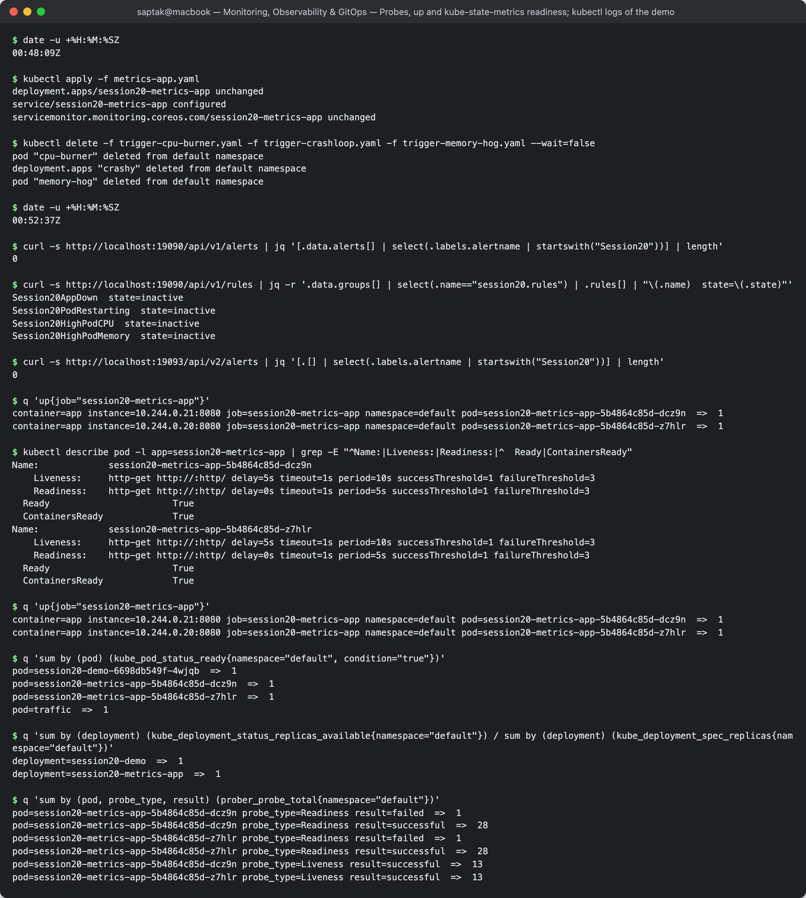

### 1.7 Grafana — datasource health and dashboard queries

The chart provisions Grafana with Prometheus and Alertmanager datasources and ~25 dashboards. Everything below goes
through Grafana's HTTP API; the admin password is read from the chart-generated Secret into a variable and never printed.

```
$ GPW=$(kubectl -n monitoring get secret kps-grafana -o jsonpath="{.data.admin-password}" | base64 -d)   # kept in a variable, never printed

$ curl -s http://localhost:13000/api/health | jq -c .
{"database":"ok","version":"13.2.3","commit":"90ffed056f0884267356c12a0eeb72a022af53f1"}

$ curl -s -u "admin:$GPW" http://localhost:13000/api/datasources | jq -r ".[] | \"\(.name)  type=\(.type)  uid=\(.uid)  url=\(.url)  default=\(.isDefault)\""
Alertmanager  type=alertmanager  uid=alertmanager  url=http://kps-kube-prometheus-stack-alertmanager.monitoring:9093/  default=false
Prometheus  type=prometheus  uid=prometheus  url=http://kps-kube-prometheus-stack-prometheus.monitoring:9090/  default=true

$ curl -s -u "admin:$GPW" http://localhost:13000/api/datasources/uid/prometheus/health | jq -c .
{"details":{"application":"Prometheus","features":{"rulerApiEnabled":false}},"message":"Successfully queried the Prometheus API.","status":"OK"}

$ curl -s -u "admin:$GPW" "http://localhost:13000/api/search?type=dash-db" | jq -r ".[].title" | wc -l
      25

$ curl -s -u "admin:$GPW" "http://localhost:13000/api/search?query=Compute%20Resources" | jq -r ".[] | \"\(.uid)  \(.title)\""
b59e6c9f2fcbe2e16d77fc492374cc4f  Kubernetes / Compute Resources /  Multi-Cluster
efa86fd1d0c121a26444b636a3f509a8  Kubernetes / Compute Resources / Cluster
85a562078cdf77779eaa1add43ccec1e  Kubernetes / Compute Resources / Namespace (Pods)
a87fb0d919ec0ea5f6543124e16c42a5  Kubernetes / Compute Resources / Namespace (Workloads)
200ac8fdbfbb74b39aff88118e4d1c2c  Kubernetes / Compute Resources / Node (Pods)
058020e04168bfdea0c52269cb699df2  Kubernetes / Compute Resources / Nodes Overview
6581e46e4e5c7ba40a07646395ef7b23  Kubernetes / Compute Resources / Pod
a164a7f0339f99e89cea5cb47e9be617  Kubernetes / Compute Resources / Workload
```

The Prometheus datasource health check returns the same *"Successfully queried the Prometheus API."* the class README
expects from **Save & test**. Next, the actual PromQL of two panels of *Kubernetes / Compute Resources / Namespace (Pods)*,
read from the dashboard JSON (`/api/dashboards/uid/85a5…`) and executed through Grafana's `/api/ds/query` — exactly what the
panel does, with `$namespace=default` substituted. Taken while the alert triggers were running:

```bash
gq() {   # run PromQL through Grafana's Prometheus datasource, print the last value of each series
  jq -n --arg e "$1" '{from:"now-5m", to:"now", queries:[{refId:"A", datasource:{type:"prometheus", uid:"prometheus"}, expr:$e, instant:true, range:false}]}' |
  curl -s -u "admin:$GPW" -H 'Content-Type: application/json' -X POST http://localhost:13000/api/ds/query -d @- |
  jq -r '.results.A.frames[] | "\(.schema.fields[1].labels // {} | to_entries | map("\(.key)=\(.value)") | join(" "))  =>  \(.data.values[1][-1] | . * 1000 | round / 1000)"'
}
```

```
$ gq 'sum(max by (cluster, namespace, pod, container)(node_namespace_pod_container:container_cpu_usage_seconds_total:sum_rate5m{cluster="", namespace="default"})) by (pod)'   # panel 5 "CPU Usage"
pod=session20-demo-6698db549f-4wjqb  =>  0
pod=session20-metrics-app-5b4864c85d-dcz9n  =>  0.002
pod=session20-metrics-app-5b4864c85d-z7hlr  =>  0.001
pod=traffic  =>  0.004
pod=memory-hog  =>  0
pod=crashy-74b8c678f6-wb4c9  =>  0
pod=cpu-burner  =>  0.226

$ gq 'sum(max by (cluster, namespace, pod, container)(container_memory_working_set_bytes{job="kubelet", metrics_path="/metrics/cadvisor", cluster="", namespace="default", container!="", image!=""})) by (pod)'   # panel 7 "Memory Usage (w/o cache)"
pod=session20-demo-6698db549f-4wjqb  =>  323584
pod=session20-metrics-app-5b4864c85d-dcz9n  =>  12697600
pod=session20-metrics-app-5b4864c85d-z7hlr  =>  8704000
pod=traffic  =>  344064
pod=cpu-burner  =>  331776
pod=memory-hog  =>  57450496
```

The dashboard reads a **recording rule** (`…:sum_rate5m`) that the chart precomputes every evaluation — so the
burner shows 0.226, a 5-minute average that was still ramping up (it had run ~2.5 min), while my 1-minute query above said 0.39.
Same data, different window; always check the range before comparing two graphs. `memory-hog` = 57 450 496 B = 54.8 MiB.

**Screenshot:** 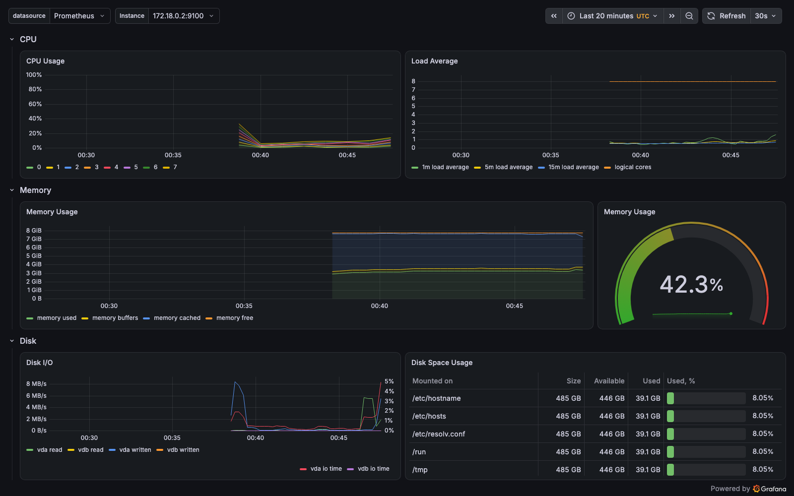

**Screenshot:** 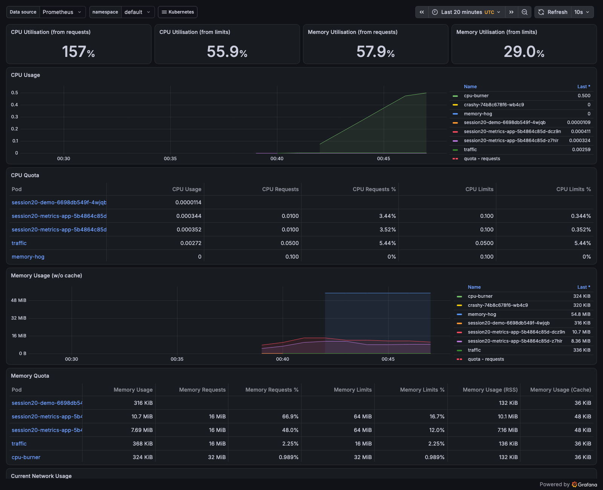

**A real finding — Grafana was OOMKilled.** While those dashboards were rendering, the Grafana port-forward dropped. The
monitoring stack had a problem of its own:

```
$ kubectl -n monitoring get pod -l app.kubernetes.io/name=grafana -o json | jq -c ".items[0].status.containerStatuses[] | select(.name==\"grafana\") | {name, restartCount, lastState: .lastState.terminated | {reason, exitCode, finishedAt}}"
{"name":"grafana","restartCount":1,"lastState":{"reason":"OOMKilled","exitCode":137,"finishedAt":"2026-10-07T00:46:18Z"}}

$ q 'max_over_time(container_memory_working_set_bytes{namespace="monitoring", container="grafana"}[15m]) / 1024^2'
container=grafana instance=172.18.0.2:10250 job=kubelet namespace=monitoring pod=kps-grafana-6b5674744d-2vwv7  =>  278.152
container=grafana instance=172.18.0.2:10250 job=kubelet namespace=monitoring pod=kps-grafana-6b5674744d-2vwv7  =>  240.816

$ q 'kube_pod_container_resource_limits{namespace="monitoring", container="grafana", resource="memory"} / 1024^2'
container=grafana instance=10.244.0.7:8080 job=kube-state-metrics namespace=monitoring pod=kps-grafana-6b5674744d-2vwv7  =>  384
```

The 384 Mi limit I had set was too small for Grafana 13 rendering several dashboards at once. The metrics never showed it near
384 MiB: the spike happened **between two 15-second scrapes**, so the sampled peak (278 MiB) misses it. That is a sampling
limit of metrics; the kubelet's `OOMKilled` / exit 137 record is what proves it. Fix: raise the limit and upgrade the release.

```
$ helm upgrade kps prometheus-community/kube-prometheus-stack --version 92.0.0 -n monitoring -f kube-prometheus-stack-values.yaml | head -6
Release "kps" has been upgraded. Happy Helming!
NAME: kps
LAST DEPLOYED: Wed Oct  7 06:17:03 2026
NAMESPACE: monitoring
STATUS: deployed
REVISION: 2

$ kubectl -n monitoring rollout status deploy/kps-grafana --timeout=180s
Waiting for deployment "kps-grafana" rollout to finish: 1 old replicas are pending termination...
Waiting for deployment "kps-grafana" rollout to finish: 1 old replicas are pending termination...
deployment "kps-grafana" successfully rolled out

$ kubectl -n monitoring get deploy kps-grafana -o jsonpath="{.spec.template.spec.containers[?(@.name==\"grafana\")].resources}"; echo
{"limits":{"memory":"768Mi"},"requests":{"cpu":"50m","memory":"128Mi"}}

$ helm history kps -n monitoring
REVISION	UPDATED                 	STATUS    	CHART                       	APP VERSION	DESCRIPTION     
1       	Wed Oct  7 06:04:18 2026	superseded	kube-prometheus-stack-92.0.0	v0.94.1    	Install complete
2       	Wed Oct  7 06:17:03 2026	deployed  	kube-prometheus-stack-92.0.0	v0.94.1    	Upgrade complete
```

Both dashboard screenshots were taken after this upgrade.

### 1.8 Class demos: `03-prometheus` and `04-grafana` with Docker Compose

The class compose file from `04-grafana` (a superset of `03-prometheus`: Prometheus scraping itself + Grafana) was run
unchanged except for the **host** ports. On the first attempt `localhost:9090` answered with a *different* Prometheus:
another `kubectl port-forward` was bound to `127.0.0.1:9090` while Docker bound `0.0.0.0:9090`, and `localhost` resolves to
`127.0.0.1`, so the more specific bind won. That output was discarded and the ports remapped to `19091:9090` and `13001:3000`.
Worth remembering: two listeners on one port can coexist on different addresses, and `curl localhost` hits the more specific one.

```
$ docker compose up -d 2>&1 | tail -4
 Container session20-prometheus Starting 
 Container session20-prometheus Started 
 Container session20-grafana Starting 
 Container session20-grafana Started 

$ docker compose ps --format "table {{.Name}}\t{{.Image}}\t{{.Status}}\t{{.Ports}}"
NAME                   IMAGE                    STATUS                  PORTS
session20-grafana      grafana/grafana:12.1.1   Up Less than a second   0.0.0.0:13001->3000/tcp, [::]:13001->3000/tcp
session20-prometheus   prom/prometheus:v3.5.0   Up Less than a second   0.0.0.0:19091->9090/tcp, [::]:19091->9090/tcp

$ curl -s localhost:19091/api/v1/query --data-urlencode 'query=up' | jq -c '.data.result[] | {metric, value: .value[1]}'
{"metric":{"__name__":"up","instance":"prometheus:9090","job":"prometheus"},"value":"1"}

$ curl -s localhost:19091/api/v1/query --data-urlencode 'query=sum(up)' | jq -c '.data.result[0].value'
[1791334477.243,"1"]

$ curl -s localhost:19091/api/v1/query --data-urlencode 'query=prometheus_http_requests_total' | jq -r '.data.result[] | "\(.metric.handler) code=\(.metric.code) => \(.value[1])"' | head -5
/ code=200 => 0
/-/healthy code=200 => 0
/-/quit code=200 => 0
/-/ready code=200 => 1
/-/reload code=200 => 0

$ curl -s localhost:19091/api/v1/query --data-urlencode 'query=process_cpu_seconds_total' | jq -c '.data.result[] | {job: .metric.job, value: .value[1]}'
{"job":"prometheus","value":"0.11"}
```

Exactly the class's expected `up{instance="prometheus:9090",job="prometheus"} 1`. Then the *"Add data source → Save & test"*
step, done through the API — the URL is the **compose service name** `prometheus:9090`, because Grafana resolves it inside
the compose network:

```
$ curl -s -u admin:admin -H 'Content-Type: application/json' -X POST localhost:13001/api/datasources -d '{"name":"Prometheus","type":"prometheus","uid":"prom","url":"http://prometheus:9090","access":"proxy","isDefault":true}' | jq -c '{message, name, id}'   # gitleaks:allow (class default creds, local container)
{"message":"Datasource added","name":"Prometheus","id":1}

$ curl -s -u admin:admin localhost:13001/api/datasources/uid/prom/health | jq -c .   # gitleaks:allow (class default creds, local container)
{"details":{"application":"Prometheus","features":{"rulerApiEnabled":false}},"message":"Successfully queried the Prometheus API.","status":"OK"}

$ curl -s -u admin:admin -H 'Content-Type: application/json' -X POST localhost:13001/api/ds/query -d '{"from":"now-5m","to":"now","queries":[{"refId":"A","datasource":{"uid":"prom"},"expr":"up","instant":true}]}' | jq -c '.results.A.frames[] | {labels: .schema.fields[1].labels, value: .data.values[1][-1]}'   # gitleaks:allow (class default creds, local container)
{"labels":{"__name__":"up","instance":"prometheus:9090","job":"prometheus"},"value":1}

$ docker compose down 2>&1 | tail -3
 Container session20-prometheus Removed 
 Network compose04_default Removing 
 Network compose04_default Removed 
```

(`admin/admin` is the class's throwaway default for this local container only.)

### What was demonstrated (Task 1)

| Item from the brief | Where |
| --- | --- |
| Metrics | 1.2 raw `/metrics`, 1.3 PromQL via the HTTP API, 1.8 compose demo |
| Logs | 1.4 `kubectl logs`, 1.5 `--previous` of a crash-looping container |
| Alerts | 1.5 four custom rules: pending → firing in Prometheus → active in Alertmanager → resolved |
| CPU utilization | 1.3 node (6.1 %) and per-pod; 1.5 100 % of a CPU limit; 1.7 Grafana panel |
| Memory utilization | 1.3 node (39.4 %) and per-pod; 1.5 85.6 % of a memory limit; 1.7 the Grafana OOMKill |
| Application health | 1.6 probes + `up` + kube-state-metrics readiness/availability |

---

## Task 2: Observability

### Monitoring vs observability

| | Monitoring | Observability |
| --- | --- | --- |
| Question | *Is something wrong?* | *Why is it behaving this way?* |
| Works for | known failure modes you wrote rules for | new, unexpected problems you didn't predict |
| Output | dashboards, thresholds, alerts | metrics + logs + traces you can slice and correlate |
| In this run | `Session20PodRestarting` fired | `--previous` log: *"cannot connect to database at db:5432"* |

They aren't competitors: monitoring tells you *when* to look, observability gives you enough data to explain *what happened*.

### The three pillars

| Pillar | What it is | Answers | Example captured in this README |
| --- | --- | --- | --- |
| **Metrics** | numeric samples over time, with labels; cheap to store, easy to aggregate and alert on | *How much? How often? Is it getting worse?* | `rate(http_requests_total[2m])` = 1.32 req/s 200, 0.10 req/s 404; node CPU 6.1 % |
| **Logs** | timestamped records of discrete events, often with free-form detail | *What exactly happened, and in what order?* | `FATAL: cannot connect to database at db:5432` |
| **Traces** | the path of **one request** across services, as a tree of timed *spans* sharing a trace ID | *Where did this request spend its time, and which hop failed?* | HotROD `/dispatch`: 789 ms total, of which MySQL 335 ms (below) |

Metrics are aggregated, so they lose the individual request; logs keep the detail but are hard to aggregate; traces
connect cause and effect across process boundaries. The trace ID is what joins them: below, the same ID appears in a
response header, in the trace, and in every log line of that request.

### Traces — a real OpenTelemetry → Jaeger trace

The class material describes traces only, so this demo was added: [`tracing/docker-compose.yml`](./tracing/docker-compose.yml)
runs **Jaeger v2** (all-in-one, in-memory) and **HotROD**, Jaeger's demo ride-booking app — 4 services (`frontend`, `customer`,
`driver`, `route`) that call a simulated MySQL and Redis and export spans over **OTLP/HTTP** with the OpenTelemetry Go SDK.

```
$ docker compose up -d 2>&1 | tail -4
 Container session20-jaeger Starting 
 Container session20-jaeger Started 
 Container session20-hotrod Starting 
 Container session20-hotrod Started 

$ docker compose ps --format "table {{.Name}}\t{{.Image}}\t{{.Status}}\t{{.Ports}}"
NAME               IMAGE                                 STATUS                  PORTS
session20-hotrod   jaegertracing/example-hotrod:2.22.0   Up Less than a second   0.0.0.0:18080->8080/tcp, [::]:18080->8080/tcp
session20-jaeger   jaegertracing/jaeger:2.22.0           Up Less than a second   0.0.0.0:4318->4318/tcp, [::]:4318->4318/tcp, 0.0.0.0:26686->16686/tcp, [::]:26686->16686/tcp
```

One request — "dispatch a car to customer 123". The W3C `Traceresponse` header carries the trace ID
(`00-<trace-id>-<span-id>-01`):

```
$ curl -s -i "http://localhost:18080/dispatch?customer=123" | sed -n "1p;/^Traceresponse/Ip;\$p"
HTTP/1.1 200 OK
Traceresponse: 00-0414ca842d74f431d759197a27205501-9b9c3ce6faeb6bdf-01
{"Driver":"T727969C","ETA":120000000000}
```

Jaeger v2 serves its query API under `/api/v3/` (the v1 `/api/services` path returned 404 in this version). The trace,
flattened into a timeline by [`trace-summary.jq`](./tracing/trace-summary.jq):

```
$ curl -s http://localhost:26686/api/v3/services | jq -c .
{"services":["route","mysql","redis-manual","customer","frontend","driver","jaeger"]}

$ TRACE=0414ca842d74f431d759197a27205501   # from the Traceresponse header above

$ curl -s http://localhost:26686/api/v3/traces/$TRACE | jq "[.result.resourceSpans[].scopeSpans[].spans[]] | length"
40

$ curl -s http://localhost:26686/api/v3/traces/$TRACE | jq -r -f trace-summary.jq
offset_ms  duration_ms  service       span
---------  -----------  ------------  ----
        0          789  frontend      GET /dispatch
        2          342  frontend      HTTP GET
        6          337  customer      GET /customer
        6          335  mysql         SQL SELECT
      346          242  frontend      driver.DriverService/FindNearest
      349          238  driver        driver.DriverService/FindNearest
      349           21  redis-manual  FindDriverIDs
      371           27  redis-manual  GetDriver
      398           11  redis-manual  GetDriver
...
      557           16  redis-manual  GetDriver
      573           13  redis-manual  GetDriver
      589           56  frontend      HTTP GET
      589           70  frontend      HTTP GET
      589           56  frontend      HTTP GET
      595           49  route         GET /route
      599           46  route         GET /route
      599           60  route         GET /route
...
      734           53  frontend      HTTP GET
      734           53  route         GET /route
```

What only the trace shows:

- **Where the time went:** the one MySQL query took **335 of 789 ms (42 %)**. A latency metric would say "789 ms", not which hop.
- **Sequential vs parallel work:** the 13 Redis `GetDriver` calls run strictly one after another (each starts as the previous
  ends, 371 → 573 ms), whereas the 10 `/route` calls run **three at a time** (three start at 589 ms) — HotROD's worker pool of 3.
  Both are visible in the offsets alone, and both are the obvious optimisation targets.
- **Hidden errors:** the request returned **200 OK**, yet 3 spans failed:

```
$ curl -s http://localhost:26686/api/v3/traces/$TRACE | jq -c '.result.resourceSpans[].scopeSpans[].spans[] | select(.status.code == "STATUS_CODE_ERROR" or .status.code == 2) | {name, status: .status, event: .events[0].name}'
{"name":"GetDriver","status":{"message":"An error occurred","code":2},"event":"exception"}
{"name":"GetDriver","status":{"message":"An error occurred","code":2},"event":"exception"}
{"name":"GetDriver","status":{"message":"An error occurred","code":2},"event":"exception"}
```

…and the **logs**, filtered by the same trace ID, say what those errors were:

```
$ docker logs session20-hotrod 2>&1 | grep -c $TRACE
49

$ docker logs session20-hotrod 2>&1 | grep $TRACE | grep ERROR | cut -c1-210
2026-10-07T00:55:54.691Z	ERROR	driver/redis.go:79	redis timeout	{"service": "driver", "trace_id": "0414ca842d74f431d759197a27205501", "span_id": "f6398be99d2f4556", "driver_id": "T720701C", "error": "redis time
2026-10-07T00:55:54.691Z	ERROR	driver/server.go:78	Retrying GetDriver after error	{"service": "driver", "trace_id": "0414ca842d74f431d759197a27205501", "span_id": "9f02254880c77cbe", "retry_no": 1, "error": "re
2026-10-07T00:55:54.767Z	ERROR	driver/redis.go:79	redis timeout	{"service": "driver", "trace_id": "0414ca842d74f431d759197a27205501", "span_id": "f1368fba088f1f59", "driver_id": "T746087C", "error": "redis time
2026-10-07T00:55:54.768Z	ERROR	driver/server.go:78	Retrying GetDriver after error	{"service": "driver", "trace_id": "0414ca842d74f431d759197a27205501", "span_id": "9f02254880c77cbe", "retry_no": 1, "error": "re
2026-10-07T00:55:54.850Z	ERROR	driver/redis.go:79	redis timeout	{"service": "driver", "trace_id": "0414ca842d74f431d759197a27205501", "span_id": "15e9e05c76b4dbe6", "driver_id": "T779681C", "error": "redis time
2026-10-07T00:55:54.850Z	ERROR	driver/server.go:78	Retrying GetDriver after error	{"service": "driver", "trace_id": "0414ca842d74f431d759197a27205501", "span_id": "9f02254880c77cbe", "retry_no": 1, "error": "re
```

This is the class's *"Website feels slow"* example, for real: monitoring would show a successful request with ~0.8 s latency;
the trace shows the slow hop (MySQL) and three Redis timeouts hidden by retries, and the trace-ID-tagged logs give the error
text. Each pillar alone is incomplete; joined by the trace ID they explain the request.

```
$ docker compose down 2>&1 | tail -3
 Container session20-jaeger Removed 
 Network tracing_default Removing 
 Network tracing_default Removed 
```

**Screenshot:** 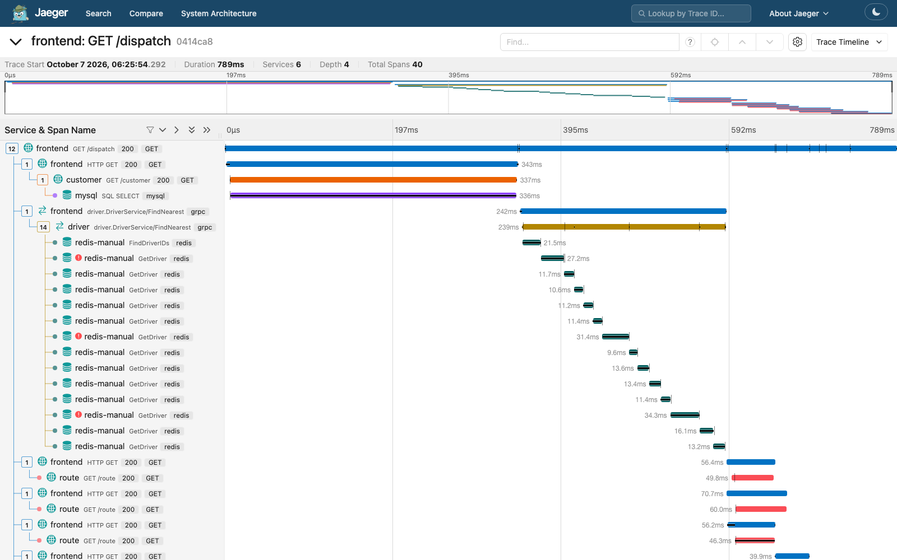

### Why observability is required

- **Distributed systems fail in new ways.** One user click in HotROD touched 6 services and 40 spans. You can't write an alert
  for every possible combination in advance; you need data rich enough to ask new questions afterwards.
- **"Green" dashboards can hide problems.** The dispatch returned 200 while 3 Redis calls timed out; `up` was 0 while Pods
  were Ready (1.6); Grafana was OOMKilled while sampled memory peaked at 278 of 384 MiB (1.7). Each was only explained by
  combining signals.
- **Faster recovery (MTTR).** Going from *"pod restarting"* to *"cannot connect to database"* took one `kubectl logs --previous`.
  Without logs it's guesswork.
- **Performance work needs evidence.** The trace shows MySQL is 42 % of the request and Redis calls are serial, so you know
  what to fix first.
- **Kubernetes makes things ephemeral.** Pods and IPs change, and logs vanish with the Pod, so telemetry must be collected
  centrally and labelled (namespace/pod/container) to stay useful.

### Common tools

| Area | Open source | Used here |
| --- | --- | --- |
| Metrics collection & storage | **Prometheus**, node-exporter, kube-state-metrics, cAdvisor; long-term: Thanos, Mimir, VictoriaMetrics | yes |
| Alert routing | **Alertmanager** (→ Slack, e-mail, PagerDuty, Opsgenie) | yes |
| Dashboards | **Grafana** | yes |
| Logs | **Loki** + Promtail/Grafana Alloy; **EFK/ELK** (Elasticsearch/OpenSearch + Fluentd/Fluent Bit + Kibana) | `kubectl logs` only |
| Traces | **OpenTelemetry** (SDKs + Collector, vendor-neutral), **Jaeger**, Grafana **Tempo**, Zipkin | yes (OTel SDK → Jaeger) |
| Managed / SaaS | Datadog, New Relic, Dynatrace, Grafana Cloud, AWS CloudWatch + X-Ray, Google Cloud Operations, Azure Monitor | — |

### Kubernetes observability

Kubernetes adds layers, each with its own signal source. This mapping is what the kube-prometheus-stack wired up in Task 1:

| Layer | Source | Example metric / data | Seen in |
| --- | --- | --- | --- |
| Node | node-exporter (DaemonSet) | `node_cpu_seconds_total`, `node_memory_MemAvailable_bytes` | 1.3, Grafana *Node Exporter / Nodes* |
| Container | kubelet / **cAdvisor** | `container_cpu_usage_seconds_total`, `container_memory_working_set_bytes` | 1.3, 1.5, 1.7 |
| Object state | **kube-state-metrics** (reads the API) | `kube_pod_status_ready`, `kube_deployment_status_replicas_available`, `kube_pod_container_status_restarts_total`, resource limits | 1.5, 1.6, Mini Project Step 9 |
| Probes | kubelet `/metrics/probes` | `prober_probe_total{probe_type,result}` | 1.6 |
| Control plane | API server `/metrics`, CoreDNS | request rates/latencies, DNS queries | `up` list in 1.3 |
| Application | the app's own `/metrics`, discovered by a **ServiceMonitor**/PodMonitor | `http_requests_total` | 1.2, 1.3 |
| Events | `kubectl get events` (kept ~1 h) | `BackOff`, `ScalingReplicaSet`, Argo CD sync events | 1.5, Mini Project |
| Logs | container stdout/stderr → kubelet log files → `kubectl logs` / Loki / Fluent Bit | crash reason | 1.4, 1.5 |
| Traces | OpenTelemetry SDK in the app → OTel Collector → Jaeger/Tempo | spans | Task 2 demo |

The Kubernetes-native touch is **label-based discovery**: Prometheus never had the Pod IPs in its config; the
ServiceMonitor selected the Service by label, the Operator generated the scrape config, and new Pods (new IPs) were picked
up automatically. In Kubernetes, monitoring config has to follow labels, not addresses.

---

## Task 3: GitOps

Concepts in short, each pointing to the step of the mini project that demonstrates it with real output.

| Concept | Meaning | Demonstrated in |
| --- | --- | --- |
| **What is GitOps?** | Operating a system by declaring its desired state in Git and letting an in-cluster agent (Argo CD) continuously make the cluster match it. Deploy = commit. | whole mini project |
| **Git as the source of truth** | The manifests in Git are the definition of what *should* run; the cluster is a copy of them. Git provides history, review (PRs), diffs, audit trail (who/when/why) and rollback (`git revert`). | Steps 3–4, 7; `git log -- gitops/app` |
| **Declarative configuration** | You describe the *end state* (`replicas: 3`), not the commands to reach it (`kubectl scale`). The controller computes the difference. | the manifests in [`gitops/app/`](./gitops/app/), `argocd app diff` in the Extra step |
| **Continuous reconciliation** | A control loop: observe actual state → compare with desired → act on the difference → repeat. Argo CD polls Git (default every 120 s + jitter, or instantly via webhook) **and** watches cluster resources live. | Step 7 (Git → cluster, ~3m47s), Step 8 (cluster drift → reverted in ~1 s) |
| **GitOps workflow** | edit YAML → commit → (PR + review) → merge/push → Argo CD detects the new commit → syncs → reports Synced/Healthy; drift is reverted. No `kubectl apply` by humans, no cluster credentials in CI. | Step 7 timeline |
| **Kubernetes + GitOps** | Kubernetes is already declarative and controller-based; Argo CD extends that idea from "API server → cluster" to "Git → API server", using the same reconcile pattern as a Deployment controller. | Steps 5–8 |

**Push vs pull:** a CI/CD pipeline that runs `kubectl apply` *pushes* changes and needs cluster credentials outside the cluster.
GitOps *pulls*: Argo CD runs inside the cluster and only needs read access to Git, and because it keeps comparing, it also detects
and fixes drift, which a one-shot push never notices.

Argo CD itself is installed in Step 2 of the mini project below.

---

## Mini Project — GitOps with Argo CD

Brief ([`08-mini-project`](https://github.com/Nency-Ravaliya/devops-heros/tree/main/session20-monitoring-observability-gitops/08-mini-project)):
a Namespace, a Deployment (`replicas: 2`) and a Service in a Git repo, an Argo CD Application with automated sync +
self-heal, then scale through Git and prove self-healing.

```text
              Developer
                  |
                  v
               Git Repo  (github.com/Saptak-cyber/DevOps_Assignments, branch main,
                  |       path "Monitoring, Observability & GitOps/gitops/app")
             desired state
                  |
                  v
              Argo CD  (namespace argocd, Application session20-mini)
                  |
             reconciliation
                  |
                  v
            Kubernetes  (kind cluster session20, namespace session20)
                  |
          +-------+-------+
          |               |
      Deployment        Service
          |
        Pods
```

### Step 1 — Create cluster

The same kind cluster as Task 1 (`kind create cluster --name session20`, see 1.1); Argo CD ran next to the monitoring stack.

```
$ kubectl get nodes
NAME                      STATUS   ROLES           AGE     VERSION
session20-control-plane   Ready    control-plane   4m30s   v1.37.0
```

### Step 2 — Install Argo CD

Installed with the server-side apply variant from the class `07-argocd` README (the CRDs are too big for client-side apply's annotation).

```
$ kubectl create namespace argocd
namespace/argocd created

$ kubectl apply -n argocd --server-side --force-conflicts -f https://raw.githubusercontent.com/argoproj/argo-cd/stable/manifests/install.yaml
customresourcedefinition.apiextensions.k8s.io/applications.argoproj.io serverside-applied
customresourcedefinition.apiextensions.k8s.io/applicationsets.argoproj.io serverside-applied
customresourcedefinition.apiextensions.k8s.io/appprojects.argoproj.io serverside-applied
serviceaccount/argocd-application-controller serverside-applied
...
deployment.apps/argocd-server serverside-applied
statefulset.apps/argocd-application-controller serverside-applied
...
networkpolicy.networking.k8s.io/argocd-server-network-policy serverside-applied

$ kubectl get pods -n argocd
NAME                                                READY   STATUS    RESTARTS   AGE
argocd-application-controller-0                     1/1     Running   0          22m
argocd-applicationset-controller-76fd8cdd4f-vbdzn   1/1     Running   0          22m
argocd-dex-server-66c78cf887-jzc5m                  1/1     Running   0          22m
argocd-notifications-controller-7fb9868fd6-t69xr    1/1     Running   0          22m
argocd-redis-bdbdffcb4-c55w2                        1/1     Running   0          22m
argocd-repo-server-d89c7967d-pf6wp                  1/1     Running   0          22m
argocd-server-776b7cdd4d-jwxdx                      1/1     Running   0          22m

$ kubectl get crd | grep argoproj
applications.argoproj.io                    Namespaced   v1alpha1(storage)   2026-10-07T00:34:42Z
applicationsets.argoproj.io                 Namespaced   v1alpha1(storage)   2026-10-07T00:34:43Z
appprojects.argoproj.io                     Namespaced   v1alpha1(storage)   2026-10-07T00:34:43Z

$ kubectl -n argocd get deploy argocd-server -o jsonpath="{.spec.template.spec.containers[0].image}"; echo
quay.io/argoproj/argocd:v3.5.4
```

Who does what: **repo-server** clones Git and renders manifests, **application-controller** compares and syncs (the
reconciler), **server** is the API/UI, **redis** caches, **dex** is SSO, **applicationset-controller** generates Applications
from templates, **notifications-controller** sends sync/health notifications.

UI/CLI access through a port-forward; the initial admin password goes straight from the Secret into a variable. The `argocd`
CLI used a private `--config` file (not shown in the commands below) so the machine's default Argo CD context was left alone.

```
$ kubectl port-forward svc/argocd-server -n argocd 18443:443 &

$ ARGOPW=$(kubectl -n argocd get secret argocd-initial-admin-secret -o jsonpath="{.data.password}" | base64 -d)   # never echoed

$ argocd login localhost:18443 --username admin --password "$ARGOPW" --insecure
'admin:login' logged in successfully
Context 'localhost:18443' updated

$ argocd version | grep -E "^argocd(-server)?:"
argocd: v3.5.3+c9c369e.dirty
argocd-server: v3.5.4

$ argocd cluster list
SERVER                          NAME        VERSION  STATUS   MESSAGE                                                  PROJECT
https://kubernetes.default.svc  in-cluster  1.37.0   Unknown  Cluster has no applications and is not being monitored.
```

### Step 3 — Create a Git repository

The GitOps repo is this public submission repo, **https://github.com/Saptak-cyber/DevOps_Assignments**, branch `main`.
The class manifests (`namespace.yaml`, `deployment.yaml` with `replicas: 2`, `service.yaml`) were copied unchanged into
[`gitops/app/`](./gitops/app/). As the brief requires, the Application manifest lives **outside** that path, in
[`gitops/argocd-application.yaml`](./gitops/argocd-application.yaml): if it sat inside `app/`, Argo CD would render the
Application as one of its own resources.

```
$ find gitops -type f | sort
gitops/app/deployment.yaml
gitops/app/namespace.yaml
gitops/app/service.yaml
gitops/argocd-application.yaml
```

Committed and pushed as **`7a58acc`** — *Session 20: GitOps source manifests for the Argo CD mini project*.

### Step 4 — Change Repository URL

```yaml
  source:
    repoURL: https://github.com/Saptak-cyber/DevOps_Assignments.git
    targetRevision: main
    path: "Monitoring, Observability & GitOps/gitops/app"
  destination:
    server: https://kubernetes.default.svc
    namespace: session20
  syncPolicy:
    automated:
      prune: true
      selfHeal: true
    syncOptions:
      - CreateNamespace=true
```

The path contains spaces, a comma and `&`. It only needs YAML quoting: Argo CD's repo-server treats `path` as a directory
inside its clone, never as a shell word or URL, and Step 5 shows it resolving fine (`Path: Monitoring, Observability & GitOps/gitops/app`, Synced).
No special-character workaround was needed.

### Step 5 — Create Application

This `kubectl apply` is the one manual step; from here on, Git drives the cluster.

```
$ date -u +%H:%M:%SZ
00:57:24Z

$ kubectl get ns session20
Error from server (NotFound): namespaces "session20" not found

$ kubectl apply -f argocd-application.yaml
application.argoproj.io/session20-mini created

$ kubectl get applications -n argocd
NAME             SYNC STATUS   HEALTH STATUS
session20-mini                 
```

12 seconds later:

```
$ date -u +%H:%M:%SZ
00:57:42Z

$ kubectl get applications -n argocd
NAME             SYNC STATUS   HEALTH STATUS
session20-mini   Synced        Healthy

$ argocd app get session20-mini
Name:               argocd/session20-mini
Project:            default
Server:             https://kubernetes.default.svc
Namespace:          session20
URL:                https://localhost:18443/applications/session20-mini
Source:
- Repo:             https://github.com/Saptak-cyber/DevOps_Assignments.git
  Target:           main
  Path:             Monitoring, Observability & GitOps/gitops/app
SyncWindow:         Sync Allowed
Sync Policy:        Automated (Prune)
Sync Status:        Synced to main (2f649de)
Health Status:      Healthy

GROUP  KIND        NAMESPACE  NAME            STATUS   HEALTH   HOOK  MESSAGE
       Namespace   session20  session20       Running  Synced         namespace/session20 created
       Service     session20  session20-mini  Synced   Healthy        service/session20-mini created
apps   Deployment  session20  session20-mini  Synced   Healthy        deployment.apps/session20-mini created
       Namespace              session20       Synced                  
```

`Synced to main (2f649de)` and not `7a58acc`: Argo CD tracks the **branch**, and by then another commit (a CI bot commit
for a different folder) had landed on `main`. Argo CD resolved `main` to its latest SHA and rendered only my path from it.
`Sync Policy` prints `Automated (Prune)`; self-heal is on too, as the live spec shows:

```
$ kubectl get application session20-mini -n argocd -o jsonpath="{.spec.syncPolicy}" | jq -c .
{"automated":{"prune":true,"selfHeal":true},"syncOptions":["CreateNamespace=true"]}
```

**Screenshot:** 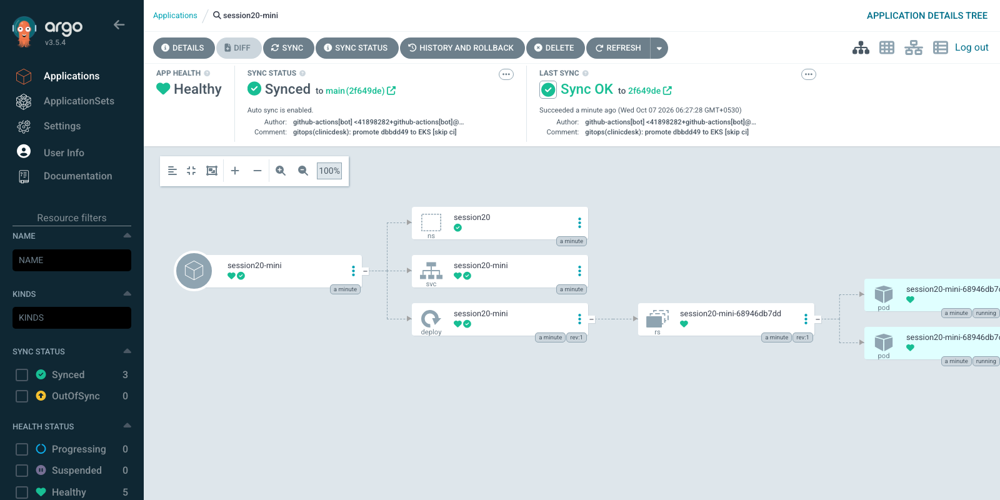

### Step 6 — Check Kubernetes

```
$ kubectl get all -n session20
NAME                                  READY   STATUS    RESTARTS   AGE
pod/session20-mini-68946db7dd-99tn4   1/1     Running   0          15s
pod/session20-mini-68946db7dd-zc9wf   1/1     Running   0          15s

NAME                     TYPE        CLUSTER-IP    EXTERNAL-IP   PORT(S)   AGE
service/session20-mini   ClusterIP   10.96.53.20   <none>        80/TCP    15s

NAME                             READY   UP-TO-DATE   AVAILABLE   AGE
deployment.apps/session20-mini   2/2     2            2           15s

NAME                                        DESIRED   CURRENT   READY   AGE
replicaset.apps/session20-mini-68946db7dd   2         2         2       15s
```

Exactly the brief's expected shape: `deployment.apps/session20-mini`, `service/session20-mini`, two Pods. Nobody ran
`kubectl apply` on these files; Argo CD created the namespace (`CreateNamespace=true` plus `namespace.yaml`) and the workload from Git.

**Declarative state, before any change** — no diff between Git and the cluster, one sync in history, and the status
block that records what was compared:

```
$ argocd app diff session20-mini; echo "exit code: $?"
exit code: 0

$ argocd app history session20-mini
SOURCE  https://github.com/Saptak-cyber/DevOps_Assignments.git
ID      DATE                           REVISION
0       2026-10-07 06:27:28 +0530 IST  main (2f649de)

$ kubectl get application session20-mini -n argocd -o json | jq "{sync: .status.sync, health: .status.health, reconciledAt: .status.reconciledAt, lastOperation: (.status.operationState | {phase, message, startedAt, finishedAt, initiatedBy: .operation.initiatedBy})}"
{
  "sync": {
    "comparedTo": {
      "destination": {
        "namespace": "session20",
        "server": "https://kubernetes.default.svc"
      },
      "source": {
        "path": "Monitoring, Observability & GitOps/gitops/app",
        "repoURL": "https://github.com/Saptak-cyber/DevOps_Assignments.git",
        "targetRevision": "main"
      }
    },
    "revision": "2f649de09d66ef904200e5860cd3f3b755d3264d",
    "status": "Synced"
  },
  "health": {
    "lastTransitionTime": "2026-10-07T00:57:40Z",
    "status": "Healthy"
  },
  "reconciledAt": "2026-10-07T00:57:28Z",
  "lastOperation": {
    "phase": "Succeeded",
    "message": "successfully synced (all tasks run)",
    "startedAt": "2026-10-07T00:57:27Z",
    "finishedAt": "2026-10-07T00:57:28Z",
    "initiatedBy": {
      "automated": true
    }
  }
}
```

`initiatedBy.automated: true`: the first deployment was done by the controller, not by a person.

### Step 7 — Make a Git change (replicas 2 → 3)

A background loop logged the Deployment's `spec/ready` replicas and the Application's state every 2 s while the change went through Git:

```
$ git diff -- "gitops/app/deployment.yaml"
diff --git a/Monitoring, Observability & GitOps/gitops/app/deployment.yaml b/Monitoring, Observability & GitOps/gitops/app/deployment.yaml
index 77c7158..62166a2 100644
--- a/Monitoring, Observability & GitOps/gitops/app/deployment.yaml	
+++ b/Monitoring, Observability & GitOps/gitops/app/deployment.yaml	
@@ -6,7 +6,7 @@ metadata:
   labels:
     app: session20-mini
 spec:
-  replicas: 2
+  replicas: 3
   selector:
     matchLabels:
       app: session20-mini

$ git commit -m "Scale application to three replicas" && git pull --rebase --autostash origin main && git push origin main
25ac5d3 Session 20 mini project: scale application to three replicas
To https://github.com/Saptak-cyber/DevOps_Assignments.git
   2f649de..25ac5d3  main -> main
pushed at 00:58:48Z
```

```
# watch log: time  deploy=<spec>/<ready>  app=<sync>/<health> rev=<revision>
00:58:39Z  deploy=2/2  app=Synced/Healthy rev=2f649de09d66ef904200e
...
01:02:34Z  deploy=2/2  app=Synced/Healthy rev=2f649de09d66ef904200e
01:02:36Z  deploy=3/3  app=Synced/Healthy rev=25ac5d33bd22521c9c965
01:02:38Z  deploy=3/3  app=Synced/Healthy rev=25ac5d33bd22521c9c965
```

```
$ kubectl get deployment -n session20
NAME             READY   UP-TO-DATE   AVAILABLE   AGE
session20-mini   3/3     3            3           5m20s

$ kubectl get pods -n session20 -o wide
NAME                              READY   STATUS    RESTARTS   AGE     IP            NODE                      NOMINATED NODE   READINESS GATES
session20-mini-68946db7dd-99tn4   1/1     Running   0          5m20s   10.244.0.29   session20-control-plane   <none>           <none>
session20-mini-68946db7dd-c5mk8   1/1     Running   0          13s     10.244.0.31   session20-control-plane   <none>           <none>
session20-mini-68946db7dd-zc9wf   1/1     Running   0          5m20s   10.244.0.30   session20-control-plane   <none>           <none>

$ argocd app history session20-mini
SOURCE  https://github.com/Saptak-cyber/DevOps_Assignments.git
ID      DATE                           REVISION
0       2026-10-07 06:27:28 +0530 IST  main (2f649de)
1       2026-10-07 06:32:35 +0530 IST  main (25ac5d3)

$ kubectl get events -n argocd --field-selector involvedObject.name=session20-mini --sort-by=.lastTimestamp -o custom-columns=TIME:.lastTimestamp,REASON:.reason,MESSAGE:.message
TIME                   REASON               MESSAGE
2026-10-07T00:57:27Z   OperationStarted     Initiated automated sync to '2f649de09d66ef904200e5860cd3f3b755d3264d'
2026-10-07T00:57:27Z   ResourceUpdated      Updated sync status:  -> OutOfSync
2026-10-07T00:57:27Z   ResourceUpdated      Updated health status:  -> Missing
2026-10-07T00:57:28Z   ResourceUpdated      Updated health status: Missing -> Healthy
2026-10-07T00:57:28Z   OperationCompleted   Sync operation to 2f649de09d66ef904200e5860cd3f3b755d3264d succeeded
2026-10-07T00:57:28Z   ResourceUpdated      Updated sync status: OutOfSync -> Synced
2026-10-07T00:57:28Z   ResourceUpdated      Updated health status: Healthy -> Progressing
2026-10-07T00:57:40Z   ResourceUpdated      Updated health status: Progressing -> Healthy
2026-10-07T01:02:35Z   OperationStarted     Initiated automated sync to '25ac5d33bd22521c9c965a4006ae421f7661c228'
2026-10-07T01:02:35Z   ResourceUpdated      Updated sync status: Synced -> OutOfSync
2026-10-07T01:02:35Z   OperationCompleted   Sync operation to 25ac5d33bd22521c9c965a4006ae421f7661c228 succeeded
2026-10-07T01:02:35Z   ResourceUpdated      Updated sync status: OutOfSync -> Synced
2026-10-07T01:02:35Z   ResourceUpdated      Updated health status: Healthy -> Progressing
2026-10-07T01:02:36Z   ResourceUpdated      Updated health status: Progressing -> Healthy

$ kubectl get events -n session20 --sort-by=.lastTimestamp | grep -E "ScalingReplicaSet|Scheduled" | tail -4
5m21s       Normal   Scheduled           pod/session20-mini-68946db7dd-99tn4    Successfully assigned session20/session20-mini-68946db7dd-99tn4 to session20-control-plane
5m21s       Normal   Scheduled           pod/session20-mini-68946db7dd-zc9wf    Successfully assigned session20/session20-mini-68946db7dd-zc9wf to session20-control-plane
14s         Normal   Scheduled           pod/session20-mini-68946db7dd-c5mk8    Successfully assigned session20/session20-mini-68946db7dd-c5mk8 to session20-control-plane
14s         Normal   ScalingReplicaSet   deployment/session20-mini              Scaled up replica set session20-mini-68946db7dd from 2 to 3

$ kubectl -n argocd get cm argocd-cm -o jsonpath="{.data.timeout\.reconciliation}"; echo "(empty = default 120s + up to 60s jitter)"
(empty = default 120s + up to 60s jitter)
```

**Timeline of the change** (all UTC):

| Time | Event | Source |
| --- | --- | --- |
| 00:58:48 | `git push` of `25ac5d3` accepted by GitHub | git |
| 01:02:35 | Argo CD notices `main` moved, goes OutOfSync, starts an **automated** sync to `25ac5d3` | Argo CD events |
| 01:02:35 | sync succeeds → Deployment `spec.replicas` patched 2 → 3 | Argo CD events |
| 01:02:35–36 | ReplicaSet scaled 2 → 3, new Pod `c5mk8` scheduled, Progressing → Healthy | k8s events |
| 01:02:36 | watch log: `deploy=3/3`, Synced/Healthy at `25ac5d3` | watch loop |

Push to running was **3 min 48 s**, almost all of it waiting for the next Git poll: there is no webhook from GitHub to a
laptop cluster, so Argo CD found the commit on a periodic refresh (`timeout.reconciliation` default 120 s + jitter, plus
caching of the branch → SHA lookup). The sync itself took under a second. In production a GitHub webhook to `argocd-server`
makes this near-instant. The kept Pods (`99tn4`, `zc9wf`) were untouched: changing only `replicas` doesn't change the
Pod template, so it's a scale, not a rollout. The old revision is still in Git and in `argocd app history`; rolling back
would be `git revert 25ac5d3`.

The brief's *"Git → Argo CD → Kubernetes"* path, in commits and events:

```
$ git log --format="%h %ad %an  %s" --date=iso-strict -- gitops/app
25ac5d3 2026-10-07T06:28:46+05:30 Saptak  Session 20 mini project: scale application to three replicas
7a58acc 2026-10-07T06:11:19+05:30 Saptak  Session 20: GitOps source manifests for the Argo CD mini project
```

**Screenshot:** 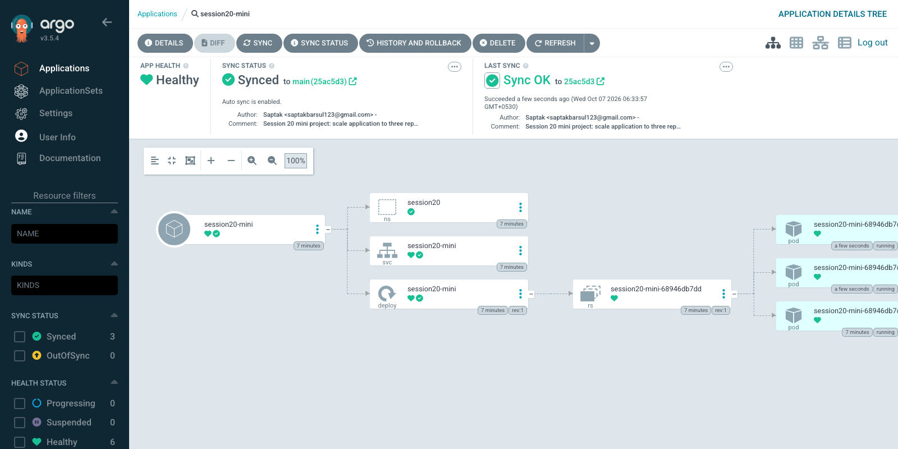

**Screenshot:** 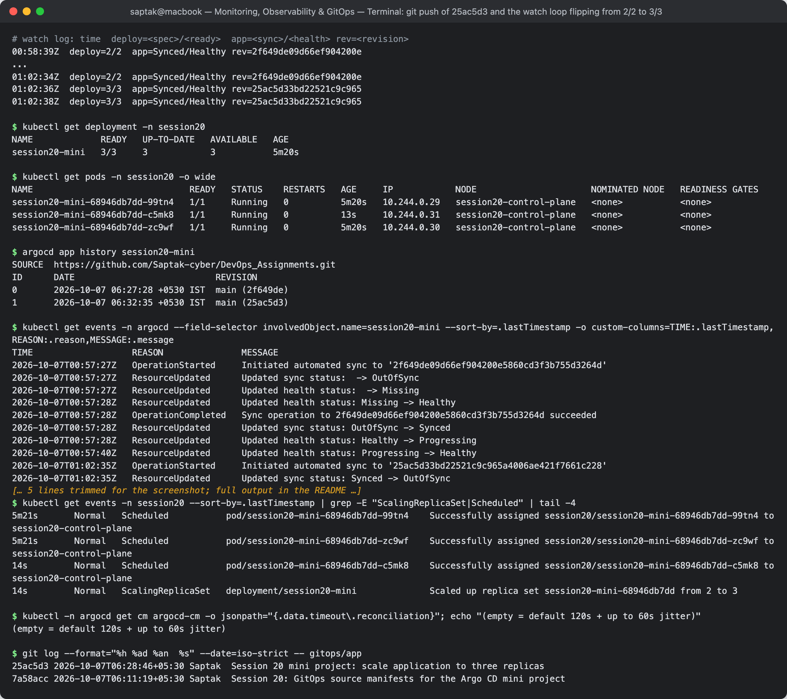

### Step 8 — Demonstrate self-healing

A manual, out-of-Git change: scale to 1.

```
$ kubectl scale deployment session20-mini -n session20 --replicas=1
deployment.apps/session20-mini scaled

$ kubectl get deployment -n session20
NAME             READY   UP-TO-DATE   AVAILABLE   AGE
session20-mini   3/1     3            3           5m31s

$ date -u +%H:%M:%SZ; kubectl get deployment session20-mini -n session20 --no-headers
01:02:59Z
session20-mini   1/1   1     1     5m31s
$ date -u +%H:%M:%SZ; kubectl get deployment session20-mini -n session20 --no-headers
01:03:00Z
session20-mini   3/3   3     3     5m32s
$ date -u +%H:%M:%SZ; kubectl get deployment session20-mini -n session20 --no-headers
01:03:01Z
session20-mini   3/3   3     3     5m33s
...
```

```
$ kubectl get pods -n session20
NAME                              READY   STATUS    RESTARTS   AGE
session20-mini-68946db7dd-99tn4   1/1     Running   0          5m48s
session20-mini-68946db7dd-m6bmk   1/1     Running   0          17s
session20-mini-68946db7dd-vdm88   1/1     Running   0          17s

$ kubectl get events -n session20 --sort-by=.lastTimestamp | grep ScalingReplicaSet
5m48s       Normal   ScalingReplicaSet   deployment/session20-mini              Scaled up replica set session20-mini-68946db7dd from 0 to 2
41s         Normal   ScalingReplicaSet   deployment/session20-mini              Scaled up replica set session20-mini-68946db7dd from 2 to 3
17s         Normal   ScalingReplicaSet   deployment/session20-mini              Scaled up replica set session20-mini-68946db7dd from 1 to 3
17s         Normal   ScalingReplicaSet   deployment/session20-mini              Scaled down replica set session20-mini-68946db7dd from 3 to 1

$ kubectl get events -n argocd --field-selector involvedObject.name=session20-mini --sort-by=.lastTimestamp -o custom-columns=TIME:.lastTimestamp,REASON:.reason,MESSAGE:.message | tail -5
2026-10-07T01:02:59Z   ResourceUpdated      Updated sync status: Synced -> OutOfSync
2026-10-07T01:02:59Z   OperationCompleted   Partial sync operation to 25ac5d33bd22521c9c965a4006ae421f7661c228 succeeded
2026-10-07T01:02:59Z   ResourceUpdated      Updated sync status: OutOfSync -> Synced
2026-10-07T01:02:59Z   ResourceUpdated      Updated health status: Healthy -> Progressing
2026-10-07T01:03:00Z   ResourceUpdated      Updated health status: Progressing -> Healthy

$ argocd app history session20-mini
SOURCE  https://github.com/Saptak-cyber/DevOps_Assignments.git
ID      DATE                           REVISION
0       2026-10-07 06:27:28 +0530 IST  main (2f649de)
1       2026-10-07 06:32:35 +0530 IST  main (25ac5d3)
```

The drift lasted **about one second**: scaled to 1 at 01:02:59, back to 3/3 at 01:03:00. Two Pods were killed and two new
ones (`m6bmk`, `vdm88`, 17 s old) created. Compare with Step 7's 3m48s: Git is *polled*, but the cluster is *watched*. The
application-controller keeps informers on every resource it manages, so drift is seen immediately, and with `selfHeal: true`
it ran a **partial sync** of just the drifted Deployment back to the Git revision `25ac5d3`. History has no new entry because
the desired revision didn't change; the cluster was put back to the existing one.

**Screenshot:** 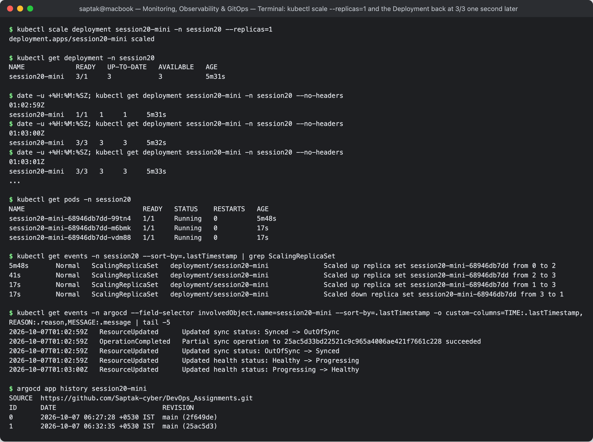

### Extra — drift with self-heal off: declarative diff, then reconcile

To *see* the drift that self-heal normally hides, self-heal was switched off on the live object, the cluster drifted, and
`argocd app diff` compared Git with the cluster:

```
$ kubectl patch application session20-mini -n argocd --type merge -p '{"spec":{"syncPolicy":{"automated":{"selfHeal":false}}}}'
application.argoproj.io/session20-mini patched

$ kubectl scale deployment session20-mini -n session20 --replicas=1
deployment.apps/session20-mini scaled

$ date -u +%H:%M:%SZ
01:03:41Z

$ kubectl get application session20-mini -n argocd
NAME             SYNC STATUS   HEALTH STATUS
session20-mini   OutOfSync     Healthy

$ kubectl get deployment -n session20
NAME             READY   UP-TO-DATE   AVAILABLE   AGE
session20-mini   1/1     1            1           6m13s

$ argocd app diff session20-mini; echo "exit code: $?"

===== apps/Deployment session20/session20-mini ======
112c112
<   replicas: 1
---
>   replicas: 3
exit code: 1

$ argocd app get session20-mini | tail -4
GROUP  KIND        NAMESPACE  NAME            STATUS     HEALTH   HOOK  MESSAGE
apps   Deployment  session20  session20-mini  OutOfSync  Healthy        deployment.apps/session20-mini configured
       Namespace              session20       Synced                    
       Service     session20  session20-mini  Synced     Healthy        
```

Argo CD still *detects* drift with self-heal off: the app goes `OutOfSync` and the diff shows live `replicas: 1` against desired
`replicas: 3`, field by field, only on the Deployment. It just doesn't *act*. The patch I used to turn self-heal off was itself
drift on the Application object, so I fixed it the declarative way, by re-applying the file:

```
$ date -u +%H:%M:%SZ
01:03:56Z

$ kubectl apply -f argocd-application.yaml   # restore the declared spec (selfHeal: true) from the file
application.argoproj.io/session20-mini configured

$ date -u +%H:%M:%SZ
01:03:58Z

$ kubectl get application session20-mini -n argocd
NAME             SYNC STATUS   HEALTH STATUS
session20-mini   Synced        Healthy

$ kubectl get deployment -n session20
NAME             READY   UP-TO-DATE   AVAILABLE   AGE
session20-mini   3/3     3            3           6m30s

$ kubectl get application session20-mini -n argocd -o jsonpath="{.spec.syncPolicy.automated}"; echo
{"prune":true,"selfHeal":true}
```

Within 2 s of self-heal coming back, the controller reconciled the Deployment to 3. Monitoring saw the same story,
which ties Task 1 to Task 3. kube-state-metrics' `spec.replicas` over the last 10 minutes:

```
$ curl -s localhost:19090/api/v1/query_range --data-urlencode 'query=kube_deployment_spec_replicas{namespace="session20"}' --data-urlencode start=$(date -u -v-10M +%s) --data-urlencode end=$(date -u +%s) --data-urlencode step=5 | jq -r '.data.result[0].values[] | "\(.[0] | todate)  replicas=\(.[1])"' | uniq -f1
2026-10-07T00:57:40Z  replicas=2
2026-10-07T01:02:55Z  replicas=3
2026-10-07T01:03:55Z  replicas=1
2026-10-07T01:04:10Z  replicas=3
```

The ~18 s self-heal-off drift is visible (1 at 01:03:55, back to 3 at 01:04:10; timestamps lag by up to one scrape). The
**one-second** drift from Step 8 is not there at all: it started and ended between two 15 s scrapes. Same lesson as the
Grafana OOMKill: metrics are samples, while events (here Argo CD's and the ReplicaSet's) record every transition.

**Screenshot:** 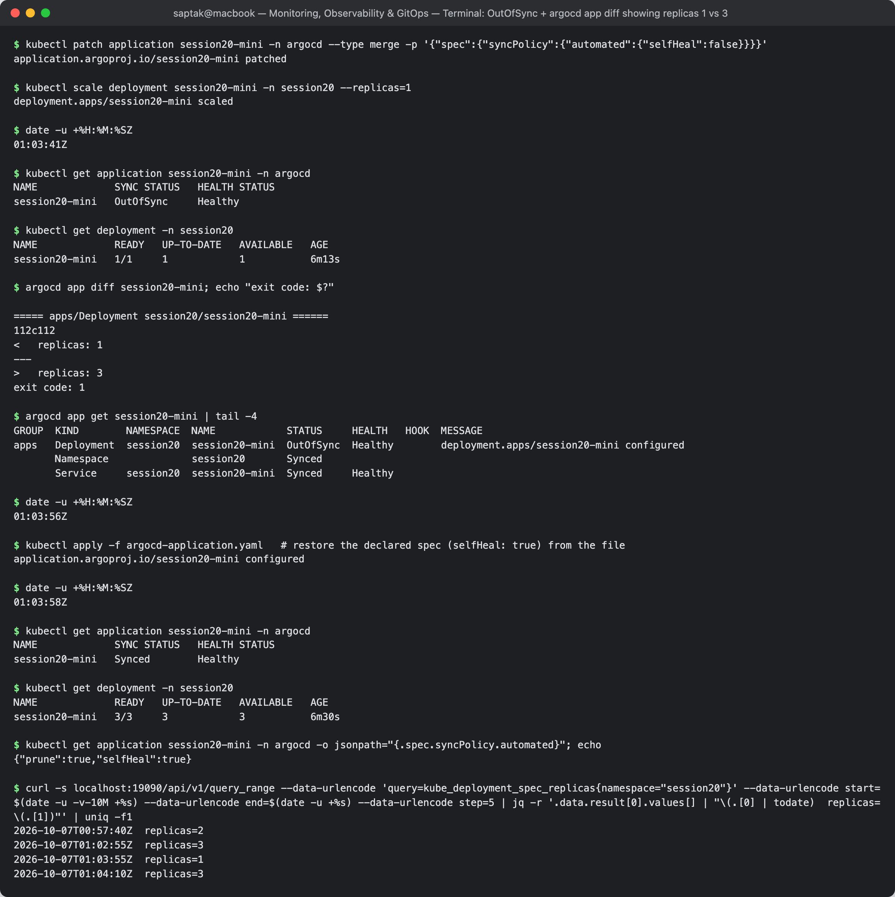

### Step 9 — Observe the system

```
$ kubectl port-forward svc/session20-mini -n session20 19095:80 &

$ for i in 1 2 3 4 5; do curl -s -o /dev/null -w "%{http_code} " http://localhost:19095/; done; echo
200 200 200 200 200 

$ curl -s http://localhost:19095/ | grep -o "<title>.*</title>"
<title>Welcome to nginx!</title>

$ kubectl logs deployment/session20-mini -n session20 --tail=8
Found 3 pods, using pod/session20-mini-68946db7dd-99tn4
2026/10/07 00:57:40 [notice] 1#1: start worker process 40
2026/10/07 00:57:40 [notice] 1#1: start worker process 41
127.0.0.1 - - [07/Oct/2026:01:03:29 +0000] "GET / HTTP/1.1" 200 615 "-" "curl/8.7.1" "-"
127.0.0.1 - - [07/Oct/2026:01:03:29 +0000] "GET / HTTP/1.1" 200 615 "-" "curl/8.7.1" "-"
127.0.0.1 - - [07/Oct/2026:01:03:29 +0000] "GET / HTTP/1.1" 200 615 "-" "curl/8.7.1" "-"
127.0.0.1 - - [07/Oct/2026:01:03:29 +0000] "GET / HTTP/1.1" 200 615 "-" "curl/8.7.1" "-"
127.0.0.1 - - [07/Oct/2026:01:03:29 +0000] "GET / HTTP/1.1" 200 615 "-" "curl/8.7.1" "-"
127.0.0.1 - - [07/Oct/2026:01:03:29 +0000] "GET / HTTP/1.1" 200 615 "-" "curl/8.7.1" "-"

$ kubectl get pods -n session20
NAME                              READY   STATUS    RESTARTS   AGE
session20-mini-68946db7dd-99tn4   1/1     Running   0          6m1s
session20-mini-68946db7dd-m6bmk   1/1     Running   0          30s
session20-mini-68946db7dd-vdm88   1/1     Running   0          30s

$ kubectl get application session20-mini -n argocd
NAME             SYNC STATUS   HEALTH STATUS
session20-mini   Synced        Healthy

$ argocd app get session20-mini
Name:               argocd/session20-mini
Project:            default
Server:             https://kubernetes.default.svc
Namespace:          session20
URL:                https://localhost:18443/applications/session20-mini
Source:
- Repo:             https://github.com/Saptak-cyber/DevOps_Assignments.git
  Target:           main
  Path:             Monitoring, Observability & GitOps/gitops/app
SyncWindow:         Sync Allowed
Sync Policy:        Automated (Prune)
Sync Status:        Synced to main (25ac5d3)
Health Status:      Healthy

GROUP  KIND        NAMESPACE  NAME            STATUS  HEALTH   HOOK  MESSAGE
apps   Deployment  session20  session20-mini  Synced  Healthy        deployment.apps/session20-mini configured
       Namespace              session20       Synced                 
       Service     session20  session20-mini  Synced  Healthy        
```

All 6 requests (5 + the title check) are in the log of **one** Pod (`99tn4`): `kubectl port-forward svc/...` picks a single
backing Pod and tunnels to it, so it does *not* load-balance across the Service. `kubectl logs deployment/...` likewise shows
only one Pod (`Found 3 pods, using ...`), so per-Pod or label-selector logs (`-l app=session20-mini --prefix`) or a log backend
are needed to see the whole Deployment. The client IP is `127.0.0.1` because the tunnel enters the Pod's network namespace locally.

### What was practised

| Item from the brief | Done |
| --- | --- |
| Namespace, Deployment (`replicas: 2`), Service, Argo CD Application | yes — Steps 3–6 |
| Create cluster, install Argo CD | yes — Steps 1–2 |
| Git repo with `app/` path; Application kept outside it; repo URL filled in | yes — Steps 3–4 (path with spaces/`&` works) |
| Application `Synced` / `Healthy` | yes — Step 5 |
| Git change 2 → 3 rolled out by Argo CD | yes — Step 7 (push 00:58:48 → synced 01:02:35) |
| Self-healing (manual scale to 1 reverted to 3) | yes — Step 8 (~1 s) + Extra (diff with self-heal off) |
| Observe logs, pods, Application status | yes — Step 9 |

### Final Viva Questions

**1. Monitoring vs Observability.** Monitoring watches signals I chose in advance and alerts when they cross a threshold:
*is something wrong?* (`Session20PodRestarting` fired.) Observability is having enough telemetry to answer questions I
didn't plan for: *why is it wrong?* (the previous container's log said the DB was unreachable; the HotROD trace showed a
"successful" request hiding three Redis timeouts). Monitoring is a subset of what an observable system lets you do; production needs both.

**2. Metrics vs Logs vs Traces.** Metrics are numbers over time (`http_requests_total`, CPU seconds): cheap, aggregatable,
ideal for dashboards and alerts, but they lose individual events. Logs are individual timestamped events with detail
(`FATAL: cannot connect to database`): they say *what* happened. Traces follow one request across services as timed spans:
they say *where* the time went (MySQL 335 of 789 ms). The trace ID links them.

**3. What is Prometheus?** An open-source metrics monitoring system and time-series database. It **pulls** (scrapes) `/metrics`
endpoints on an interval, stores samples with labels, evaluates **alerting/recording rules**, and is queried with **PromQL**.
In Kubernetes the Prometheus Operator lets you configure it with CRDs (ServiceMonitor, PrometheusRule), as done in Task 1. It
is a metrics system, not log storage.

**4. What is Grafana?** A visualisation and dashboarding tool. It stores no metrics itself; it queries datasources
(Prometheus, Loki, Tempo/Jaeger, CloudWatch…) and renders panels and alerts. In Task 1 its Prometheus datasource health check
passed and the *Namespace (Pods)* dashboard panels were just PromQL sent through `/api/ds/query`.

**5. What is GitOps?** Running deployments and operations by declaring the desired state of the system in Git and having an
agent in the cluster continuously make reality match it. Changes happen by commit/PR instead of `kubectl` or click-ops;
the agent pulls from Git, applies, and keeps correcting drift.

**6. Why is Git called the source of truth?** Because the cluster is derived from what Git says, not the other way round.
If they disagree, Git wins (Step 8: the manual scale to 1 was undone). Git also gives every change an author, time, message
and diff (`git log -- gitops/app`), a review gate (PRs) and a rollback point (`git revert`), so Git answers "what should be
running and why".

**7. What does Argo CD do?** It is a Kubernetes GitOps controller. The repo-server fetches the repo and renders manifests
(plain YAML, Helm, Kustomize); the application-controller compares them with the live objects, reports **sync status**
(Synced/OutOfSync) and **health** (Healthy/Progressing/Degraded), and syncs when automated sync is on. With `selfHeal` it reverts
drift, with `prune` it deletes resources removed from Git, and it keeps a history of deployed revisions. UI/CLI/API on top.

**8. What does "desired state" mean?** The state declared in Git: here `replicas: 3`, image `nginx:1.27-alpine`, a ClusterIP
Service on port 80 in namespace `session20`. It says *what* should exist, not *how* to create it.

**9. What does "actual state" mean?** What is really running in the cluster right now, as reported by the Kubernetes API, e.g.
`READY 1/1` right after `kubectl scale --replicas=1`. It can drift from the desired state through manual changes, failures or
other controllers.

**10. What is reconciliation?** The control loop that compares desired and actual state and acts on the difference until they
match, then keeps checking. Argo CD does it at two speeds: Git is re-read on a timer (120 s + jitter; Step 7 took 3m47s) and live
objects are watched continuously (Step 8 healed in ~1 s). Kubernetes' own controllers do the same thing one level down (the
Deployment controller turned `replicas: 3` into a third Pod).

**11. What does self-healing mean in Argo CD?** With `syncPolicy.automated.selfHeal: true`, when a live resource drifts from Git
for any reason other than a Git change, Argo CD automatically syncs it back. In Step 8 the manual `kubectl scale --replicas=1` was
reverted to 3 within about a second by a partial sync of just the Deployment. With self-heal off (Extra) the app only showed
`OutOfSync` and a diff until reconciled.

**12. What happens when replicas change from 2 to 3 in Git?** The commit is pushed (`25ac5d3`). On its next refresh Argo CD
resolves `main` to the new SHA, renders the path and sees desired `replicas: 3` vs live `2`, so the app goes **OutOfSync**.
Automated sync patches the Deployment's `spec.replicas` to 3, the Deployment controller scales the existing ReplicaSet 2 → 3,
the scheduler places one new Pod, and once it's ready the app returns to **Synced/Healthy** at the new revision, recorded in
history. The two existing Pods are not restarted (the Pod template didn't change). Observed: push 00:58:48 → sync 01:02:35 → 3/3 at 01:02:36.

---

## Cleanup

Mini project cleanup as in the brief, then everything else:

```
$ kubectl delete -f argocd-application.yaml
application.argoproj.io "session20-mini" deleted from argocd namespace

$ kubectl get applications -n argocd
No resources found in argocd namespace.

$ kubectl get deploy,svc -n session20
NAME                             READY   UP-TO-DATE   AVAILABLE   AGE
deployment.apps/session20-mini   3/3     3            3           7m33s

NAME                     TYPE        CLUSTER-IP    EXTERNAL-IP   PORT(S)   AGE
service/session20-mini   ClusterIP   10.96.53.20   <none>        80/TCP    7m33s

$ kubectl delete namespace session20
namespace "session20" deleted
```

Deleting the Application did **not** delete the app. The class `07-argocd` README says it would, but that only happens when
the Application carries the `resources-finalizer.argocd.argoproj.io` finalizer, which neither the class manifest nor mine has.
Without it Argo CD simply stops managing the resources and leaves them running. Add the finalizer if deleting the
Application should cascade.

```
$ kubectl delete -f traffic.yaml -f metrics-app.yaml -f alert-rules.yaml -f k8s-demo/
pod "traffic" deleted from default namespace
deployment.apps "session20-metrics-app" deleted from default namespace
service "session20-metrics-app" deleted from default namespace
servicemonitor.monitoring.coreos.com "session20-metrics-app" deleted from default namespace
prometheusrule.monitoring.coreos.com "session20-alerts" deleted from default namespace
deployment.apps "session20-demo" deleted from default namespace
service "session20-demo" deleted from default namespace

$ helm uninstall kps -n monitoring
release "kps" uninstalled

$ kind delete cluster --name session20
Deleting cluster "session20" ...
Deleted nodes: ["session20-control-plane"]

$ kind get clusters
No kind clusters found.

$ docker ps -a --filter name=session20 --format "{{.Names}}"
```

The compose demos (Prometheus/Grafana and Jaeger/HotROD) were stopped with `docker compose down` in their sections. Nothing is left running.

## References

- https://prometheus.io/docs/prometheus/latest/querying/basics/ and https://prometheus.io/docs/prometheus/latest/querying/api/
- https://prometheus.io/docs/alerting/latest/alertmanager/
- https://github.com/prometheus-community/helm-charts/tree/main/charts/kube-prometheus-stack
- https://grafana.com/docs/grafana/latest/developers/http_api/
- https://opentelemetry.io/docs/concepts/signals/ and https://www.jaegertracing.io/docs/
- https://argo-cd.readthedocs.io/en/stable/ — Automated sync & self-heal, App deletion (finalizers), Reconciliation timeout
- https://opengitops.dev/ — OpenGitOps principles (declarative, versioned, pulled automatically, continuously reconciled)
