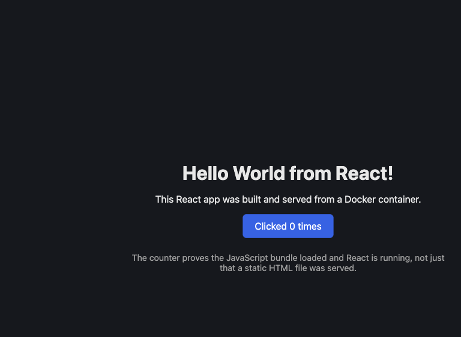

# Task 5 — Docker Fundamentals: Six Hello World Applications

Six containerised "Hello World" web applications, each in its own folder with its own
Dockerfile. Every image below was actually built and every container actually ran and
answered HTTP 200 — the outputs in this file are real terminal output.

## Folder structure

```
Task5-Docker-Fundamentals/
├── README.md
├── build-and-run-all.sh          # builds, runs and verifies all six in one go
├── screenshots/
│   └── react-hello-world.png
├── nodejs-app/
│   ├── Dockerfile
│   ├── package.json
│   ├── server.js
│   └── .dockerignore
├── python-app/
│   ├── Dockerfile
│   ├── requirements.txt
│   ├── app.py
│   └── .dockerignore
├── java-app/
│   ├── Dockerfile
│   └── HelloWorld.java
├── apache-app/
│   ├── Dockerfile
│   └── index.html
├── react-app/
│   ├── Dockerfile                # multi-stage: node build -> nginx serve
│   ├── nginx.conf
│   ├── package.json
│   ├── vite.config.js
│   ├── index.html
│   ├── .dockerignore
│   └── src/
│       ├── main.jsx
│       ├── App.jsx
│       └── index.css
└── nginx-app/
    ├── Dockerfile
    ├── index.html
    └── default.conf
```

## Port map

| Application | Folder | Image | Container | Host port | Container port |
|---|---|---|---|---|---|
| Node.js | `nodejs-app` | `nodejs-hello` | `node-hello` | **3000** | 3000 |
| Python (Flask) | `python-app` | `python-hello` | `python-hello-c` | **5001** | 5000 |
| Java | `java-app` | `java-hello` | `java-hello-c` | **8081** | 8080 |
| Apache httpd | `apache-app` | `apache-hello` | `apache-hello-c` | **8082** | 80 |
| Nginx | `nginx-app` | `nginx-hello` | `nginx-hello-c` | **8083** | 80 |
| React | `react-app` | `react-hello` | `react-hello-c` | **8084** | 80 |

> Python is mapped to host port **5001**, not 5000. On macOS the AirPlay Receiver holds
> 5000, which produces exactly this error:
> `ports are not available: ... bind: address already in use`.
> Remapping the host side (`-p 5001:5000`) is the fix — the container still listens on
> 5000 internally.

## Run everything

```bash
chmod +x build-and-run-all.sh
./build-and-run-all.sh          # build + run + verify all six
./build-and-run-all.sh clean    # stop and remove all six containers
```

---

## 1. Node.js application

**`nodejs-app/server.js`** — Node's built-in `http` module, no dependencies, so the
build is fast and there is no dependency tree to audit.

**`nodejs-app/Dockerfile`**

```dockerfile
FROM node:20-alpine

WORKDIR /app

# Copy package.json FIRST and install separately from the source code.
# Docker caches each layer; as long as package.json is unchanged, the slow
# npm install layer is reused even when server.js changes.
COPY package.json ./
RUN npm install --omit=dev

COPY server.js ./

EXPOSE 3000

USER node

CMD ["node", "server.js"]
```

### Build and run

```bash
docker build -t nodejs-hello ./nodejs-app
docker run -d --name node-hello -p 3000:3000 nodejs-hello
curl http://localhost:3000
```

### Output

```console
$ curl http://localhost:3000
<!doctype html>
<html>
  <head><title>Node.js Hello World</title></head>
  <body style="font-family: system-ui, sans-serif; text-align: center; padding: 60px;">
    <h1>Hello World from Node.js!</h1>
    <p>Running inside a Docker container.</p>
    <p>Node version: v20.20.2</p>
  </body>
</html>
```

**HTTP 200, 297 bytes, 0.0018 s.**

---

## 2. Python application

**`python-app/app.py`** — Flask.

**`python-app/Dockerfile`**

```dockerfile
FROM python:3.12-slim

WORKDIR /app

ENV PYTHONUNBUFFERED=1 \
    PYTHONDONTWRITEBYTECODE=1

COPY requirements.txt ./
RUN pip install --no-cache-dir -r requirements.txt

COPY app.py ./

EXPOSE 5000

CMD ["python", "app.py"]
```

### Build and run

```bash
docker build -t python-hello ./python-app
docker run -d --name python-hello-c -p 5001:5000 python-hello
curl http://localhost:5001
```

### Output

```console
$ curl http://localhost:5001
<!doctype html>
<html>
  <head><title>Python Hello World</title></head>
  <body style="font-family: system-ui, sans-serif; text-align: center; padding: 60px;">
    <h1>Hello World from Python (Flask)!</h1>
    <p>Running inside a Docker container.</p>
    <p>Python version: 3.12.14</p>
  </body>
</html>
```

**HTTP 200, 304 bytes, 0.0016 s.**

The single most important line in the Python app is `app.run(host="0.0.0.0", ...)`.
Flask's default is `127.0.0.1`, which inside a container means "only reachable from
within the container". With the default, `docker run -p 5001:5000` starts fine and then
`curl` returns `Empty reply from server` — the classic first Docker bug.

---

## 3. Java application

**`java-app/HelloWorld.java`** — the JDK's built-in `com.sun.net.httpserver`, so there is
no Maven/Gradle/Spring to set up: one file, one `javac`.

**`java-app/Dockerfile`**

```dockerfile
FROM eclipse-temurin:21-jdk-alpine

WORKDIR /app

COPY HelloWorld.java ./

RUN javac HelloWorld.java

EXPOSE 8080

CMD ["java", "HelloWorld"]
```

### Build and run

```bash
docker build -t java-hello ./java-app
docker run -d --name java-hello-c -p 8081:8080 java-hello
curl http://localhost:8081
```

### Output

```console
$ curl http://localhost:8081
<!doctype html>
<html>
  <head><title>Java Hello World</title></head>
  <body style="font-family: system-ui, sans-serif; text-align: center; padding: 60px;">
    <h1>Hello World from Java!</h1>
    <p>Running inside a Docker container.</p>
    <p>Java version: 21.0.12</p>
  </body>
</html>
```

**HTTP 200, 290 bytes, 0.0014 s.**

Note the image size: **555 MB**, by far the largest here, because the whole JDK (compiler
included) ships in the final image. Task 6 fixes exactly this with a multi-stage build.

---

## 4. Apache application

**`apache-app/Dockerfile`**

```dockerfile
FROM httpd:2.4-alpine

COPY index.html /usr/local/apache2/htdocs/index.html

EXPOSE 80

# The base image already has:  CMD ["httpd-foreground"]
```

Apache's DocumentRoot in this image is `/usr/local/apache2/htdocs/`. Dropping a file
there replaces the default "It works!" page — no config change needed.

### Build and run

```bash
docker build -t apache-hello ./apache-app
docker run -d --name apache-hello-c -p 8082:80 apache-hello
curl http://localhost:8082
```

### Output

```console
$ curl http://localhost:8082
<!doctype html>
<html>
  <head>
    <title>Apache Hello World</title>
    <meta charset="utf-8">
  </head>
  <body style="font-family: system-ui, sans-serif; text-align: center; padding: 60px;">
    <h1>Hello World from Apache HTTP Server!</h1>
    <p>This page is served by httpd inside a Docker container.</p>
  </body>
</html>
```

**HTTP 200, 330 bytes.**

---

## 5. Nginx application

**`nginx-app/Dockerfile`**

```dockerfile
FROM nginx:alpine

COPY index.html /usr/share/nginx/html/index.html
COPY default.conf /etc/nginx/conf.d/default.conf

EXPOSE 80

# The base image's CMD is ["nginx", "-g", "daemon off;"]
```

`default.conf` adds a `/health` endpoint alongside the static page.

### Build and run

```bash
docker build -t nginx-hello ./nginx-app
docker run -d --name nginx-hello-c -p 8083:80 nginx-hello
curl http://localhost:8083
curl http://localhost:8083/health
```

### Output

```console
$ curl http://localhost:8083
<!doctype html>
<html>
  <head>
    <title>Nginx Hello World</title>
    <meta charset="utf-8">
  </head>
  <body style="font-family: system-ui, sans-serif; text-align: center; padding: 60px;">
    <h1>Hello World from Nginx!</h1>
    <p>This page is served by nginx inside a Docker container.</p>
  </body>
</html>

$ curl http://localhost:8083/health
ok
```

**HTTP 200, 316 bytes.**

**Apache vs Nginx paths — the two you must not mix up:**

| | DocumentRoot | Config drop-in |
|---|---|---|
| `httpd:alpine` | `/usr/local/apache2/htdocs/` | `/usr/local/apache2/conf/` |
| `nginx:alpine` | `/usr/share/nginx/html/` | `/etc/nginx/conf.d/` |

---

## 6. React application

A real Vite + React 18 app (`src/App.jsx` has a `useState` counter), built with a
**multi-stage** Dockerfile.

**`react-app/Dockerfile`**

```dockerfile
# ----- Stage 1: build -----
FROM node:20-alpine AS build

WORKDIR /app

COPY package*.json ./
RUN npm install

COPY . .

RUN npm run build          # produces /app/dist

# ----- Stage 2: serve -----
FROM nginx:alpine

COPY --from=build /app/dist /usr/share/nginx/html
COPY nginx.conf /etc/nginx/conf.d/default.conf

EXPOSE 80

CMD ["nginx", "-g", "daemon off;"]
```

### Build and run

```bash
docker build -t react-hello ./react-app
docker run -d --name react-hello-c -p 8084:80 react-hello
curl http://localhost:8084
```

### Build output (Vite)

```console
rendering chunks...
computing gzip size...
dist/index.html                   0.40 kB │ gzip:  0.27 kB
dist/assets/index-BVuxa3LO.css    0.58 kB │ gzip:  0.37 kB
dist/assets/index-C_Yc7Flp.js   143.07 kB │ gzip: 46.02 kB
✓ built in 373ms
```

### Served output

```console
$ curl http://localhost:8084
<!doctype html>
<html lang="en">
  <head>
    <meta charset="UTF-8" />
    <meta name="viewport" content="width=device-width, initial-scale=1.0" />
    <title>React Hello World</title>
    <script type="module" crossorigin src="/assets/index-C_Yc7Flp.js"></script>
    <link rel="stylesheet" crossorigin href="/assets/index-BVuxa3LO.css">
  </head>
  <body>
    <div id="root"></div>
  </body>
</html>

$ curl -s -o /dev/null -w "%{http_code}\n" http://localhost:8084/assets/index-C_Yc7Flp.js
200
```

The HTML is only a shell with `<div id="root"></div>` — React fills it in the browser.
The screenshot below is the rendered page, which is the actual proof the app works:



The "Clicked 0 times" button is interactive, which proves the JavaScript bundle loaded
and React mounted — not just that a static file was served.

**Why `nginx.conf` matters here:** the `try_files $uri $uri/ /index.html;` fallback means
that refreshing on a client-side route like `/about` still serves `index.html` instead of
returning 404. Without it, an SPA works until the user hits reload.

---

## 7. Verification — all six at once

### `docker ps`

```console
$ docker ps --format "table {{.Names}}\t{{.Image}}\t{{.Status}}\t{{.Ports}}"
NAMES            IMAGE          STATUS          PORTS
python-hello-c   python-hello   Up 23 seconds   0.0.0.0:5001->5000/tcp, [::]:5001->5000/tcp
react-hello-c    react-hello    Up 35 seconds   0.0.0.0:8084->80/tcp,   [::]:8084->80/tcp
nginx-hello-c    nginx-hello    Up 35 seconds   0.0.0.0:8083->80/tcp,   [::]:8083->80/tcp
apache-hello-c   apache-hello   Up 35 seconds   0.0.0.0:8082->80/tcp,   [::]:8082->80/tcp
java-hello-c     java-hello     Up 35 seconds   0.0.0.0:8081->8080/tcp, [::]:8081->8080/tcp
node-hello       nodejs-hello   Up 36 seconds   0.0.0.0:3000->3000/tcp, [::]:3000->3000/tcp
```

### HTTP verification

```console
=========== VERIFYING HELLO WORLD ON EACH PORT ===========
--- Node.js : http://localhost:3000 ---
<h1>Hello World from Node.js!</h1>
  HTTP 200  size=297B  time=0.001830s
--- Python (Flask) : http://localhost:5001 ---
<h1>Hello World from Python (Flask)!</h1>
  HTTP 200  size=304B  time=0.001581s
--- Java : http://localhost:8081 ---
<h1>Hello World from Java!</h1>
  HTTP 200  size=290B  time=0.001378s
--- Apache httpd : http://localhost:8082 ---
<h1>Hello World from Apache HTTP Server!</h1>
  HTTP 200  size=330B  time=0.001278s
--- Nginx : http://localhost:8083 ---
<h1>Hello World from Nginx!</h1>
  HTTP 200  size=316B  time=0.005383s
--- React : http://localhost:8084 ---
  HTTP 200  size=402B  time=0.001048s
```

React shows no `<h1>` in `curl` output because the heading is rendered by JavaScript in
the browser — see the screenshot in §6.

### Image sizes

```console
$ docker images --format "table {{.Repository}}\t{{.Tag}}\t{{.Size}}" | grep hello
REPOSITORY     TAG       SIZE
react-hello    latest    93MB
apache-hello   latest    105MB
nginx-hello    latest    92.8MB
java-hello     latest    555MB
python-hello   latest    221MB
nodejs-hello   latest    194MB
```

**What the sizes teach:**

* `java-hello` at **555 MB** carries a full JDK just to run one class file.
* `react-hello` at **93 MB** is the *smallest of the app images* despite having the
  biggest build toolchain — because the multi-stage build threw away `node_modules` and
  Node itself, keeping only nginx plus 144 KB of bundled JS.
* `nginx-hello` (92.8 MB) and `react-hello` (93 MB) are nearly identical: the React app
  adds almost nothing on top of the nginx base layer, which is shared.
* Base image choice dominates everything: `-alpine` and `-slim` tags exist for this
  reason.

---

## 8. Docker commands used

```bash
# --- Build ---
docker build -t <image> ./<folder>       # -t tags the image; the last arg is the CONTEXT
docker build --no-cache -t <image> .     # force a full rebuild, ignore cached layers
docker build -f custom.Dockerfile .      # non-default Dockerfile name

# --- Run ---
docker run -d --name <name> -p <host>:<container> <image>
#          -d  detached (background)
#          -p  publish: bind a host port to a container port
docker run -it --rm <image> sh           # interactive throwaway shell

# --- Inspect ---
docker ps                                # running containers
docker ps -a                             # including stopped ones
docker images                            # local images
docker logs <container>                  # stdout/stderr of the container
docker logs -f <container>               # follow live
docker exec -it <container> sh           # shell inside a RUNNING container
docker inspect <container>               # full JSON: mounts, networks, env, IP
docker stats                             # live CPU/memory per container
docker port <container>                  # the actual port mapping
docker history <image>                   # layer-by-layer size breakdown

# --- Lifecycle ---
docker stop <container>                  # SIGTERM, then SIGKILL after 10 s
docker start <container>
docker restart <container>
docker rm -f <container>                 # force-remove even if running
docker rmi <image>
docker system prune -a                   # reclaim everything unused (careful)
```

---

## 9. Dockerfile instructions used, and why

| Instruction | Purpose | Gotcha |
|---|---|---|
| `FROM` | Base image; starts a build stage | Always pin a tag (`node:20-alpine`), never `latest` |
| `WORKDIR` | Sets the cwd for later instructions; creates it | Use it instead of `RUN cd`, which does not persist |
| `COPY` | Copies from build context into the image | Source must be **inside** the build context |
| `RUN` | Executes at **build** time, creating a layer | Chain with `&&` to avoid extra layers |
| `ENV` | Environment variables at build **and** run time | Never put secrets here — they persist in the image |
| `EXPOSE` | **Documentation only** | Does *not* publish a port; `docker run -p` does |
| `USER` | Switch to a non-root user | Put it after the `RUN`s that need root |
| `CMD` | Default command, overridable by `docker run <image> <cmd>` | Prefer exec form `["a","b"]` over shell form |
| `ENTRYPOINT` | Fixed command; `CMD` becomes its arguments | `docker run` args append rather than replace |
| `COPY --from=stage` | Pull artifacts out of an earlier stage | The heart of multi-stage builds |

### Layer caching — the rule that makes builds fast

Docker caches each instruction. When one instruction's inputs change, **that layer and
every layer after it** is rebuilt. So order from least-likely-to-change to most:

```dockerfile
COPY package.json ./     # changes rarely
RUN npm install          # slow — cached until package.json changes
COPY server.js ./        # changes on every edit
```

Reversing these two would re-run `npm install` on every single source edit.

### `CMD` exec form vs shell form

```dockerfile
CMD ["node", "server.js"]      # exec form  — node is PID 1, gets SIGTERM directly
CMD node server.js             # shell form — runs `/bin/sh -c "node server.js"`,
                               #   sh is PID 1 and does not forward signals, so
                               #   `docker stop` waits 10 s then SIGKILLs
```

---

## 10. Problems hit and how they were fixed

| Problem | Cause | Fix |
|---|---|---|
| `bind: address already in use` on port 5000 | macOS AirPlay Receiver owns 5000 | Map a different **host** port: `-p 5001:5000` |
| `Conflict. The container name is already in use` | A stopped container still holds the name | `docker rm -f <name>` first, or use `--rm` |
| Container starts then exits immediately | The process daemonised, so PID 1 exited | Run in the foreground (`nginx -g "daemon off;"`, `httpd-foreground`) |
| `curl: Empty reply from server` | App bound to `127.0.0.1` inside the container | Bind to `0.0.0.0` |
| `docker build` cannot find a file | It is outside the build context or excluded by `.dockerignore` | Move it into the context directory |
| Rebuild is slow every time | `COPY . .` placed before the dependency install | Copy manifests first, install, then copy source |

---

## Submission

```bash
git add Task5-Docker-Fundamentals/
git commit -m "Add six Dockerized Hello World applications with Dockerfiles and outputs"
git push origin main
```

Keep the folder structure exactly as listed at the top of this file.
