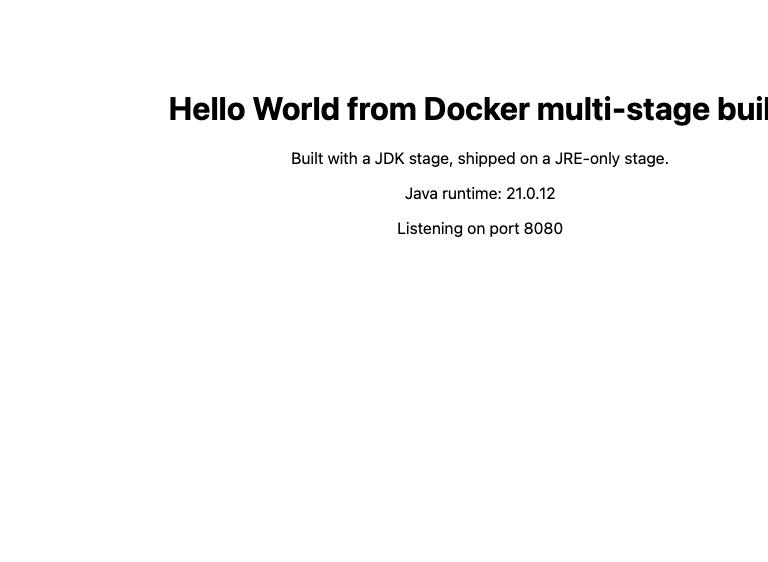

# Task 6 — Dockerfiles & Images: Multi-Stage Builds

**Name:** Saptak Banerjee
**Enrollment Number:** 24BCS10148
**Date:** 2026-09-03

---

## Folder structure

```
Task6-Dockerfiles-And-Images/
├── README.md
├── screenshots/
│   └── multistage-app-8080.png
├── multi-stage-app/                  # Task 1 & 2
│   ├── Dockerfile                    # the multi-stage build
│   ├── Dockerfile.single-stage       # same app, single stage, for comparison
│   └── src/Main.java
└── deployments/                      # Task 3 — three applications
    ├── docker-compose.yml
    ├── nodejs/   (Express Task API,  multi-stage,  port 3001 -> 3000)
    ├── python/   (Flask + Gunicorn,  multi-stage,  port 5002 -> 5000)
    └── java/     (JDK HttpServer,    multi-stage,  port 8085 -> 8080)
```

---

# Task 1 — Run the multi-stage Dockerfile

## 1.1 The Dockerfile

`multi-stage-app/Dockerfile`:

```dockerfile
# ---------- Stage 1: BUILD ----------
FROM eclipse-temurin:21-jdk-alpine AS builder

WORKDIR /build

COPY src/ ./src/

RUN mkdir -p classes && javac -d classes src/Main.java

RUN jar --create --file app.jar --main-class Main -C classes .

# ---------- Stage 2: RUNTIME ----------
FROM eclipse-temurin:21-jre-alpine

WORKDIR /app

COPY --from=builder /build/app.jar ./app.jar

RUN addgroup -S app && adduser -S app -G app
USER app

EXPOSE 8080

CMD ["java", "-jar", "app.jar"]
```

**How it works**

* `FROM ... AS builder` names the first stage. It has the **full JDK** — `javac`, `jar`,
  and everything the compiler needs.
* The second `FROM` starts a completely new image from scratch. Everything from stage 1
  is discarded **except** what an explicit `COPY --from=builder` pulls across.
* `eclipse-temurin:21-jre-alpine` is a **JRE**: it can run Java but cannot compile it.
* The result is a final image containing exactly one artifact — `app.jar` — plus the
  runtime needed to execute it.

## 1.2 Build the image

```console
$ docker build -t multistage-app:latest .
...
#12 [stage-1 2/4] WORKDIR /app
#12 DONE 0.3s

#13 [stage-1 3/4] COPY --from=builder /build/app.jar ./app.jar
#13 DONE 0.0s

#14 [stage-1 4/4] RUN addgroup -S app && adduser -S app -G app
#14 DONE 0.1s

#15 exporting to image
#15 exporting layers 0.0s done
#15 exporting manifest sha256:c3356b9a0fb2544bdf544601acdb0b3721f41f50353a84e886a6fded837b08c2 done
#15 exporting config sha256:1a28b214429234669f7490cda270ff9c88ce48c96a15bace830b2b03b77a5343 done
#15 naming to docker.io/library/multistage-app:latest done
#15 DONE 0.1s
```

Note that stage 1's `javac`/`jar` steps ran, but the layers exported into the final image
are only `WORKDIR`, `COPY --from=builder`, and the `adduser` step.

## 1.3 Run a container from the image

```console
$ docker run -d --name multistage-container -p 8080:8080 multistage-app:latest
de1242e106b40ef2eee920f889938c381540a6514bf4a2b612f19a42b3a3db2f
```

## 1.4 Verify the running container with `docker ps`

```console
$ docker ps
CONTAINER ID   IMAGE                   COMMAND                  CREATED         STATUS         PORTS                                         NAMES
de1242e106b4   multistage-app:latest   "/__cacert_entrypoin…"   1 second ago    Up 1 second    0.0.0.0:8080->8080/tcp, [::]:8080->8080/tcp   multistage-container
```

**Confirmed: the application is running on port 8080.** The `PORTS` column reads
`0.0.0.0:8080->8080/tcp` — host port 8080 is forwarded to container port 8080.

## 1.5 Access the application and verify the message

```console
$ curl http://localhost:8080
<!doctype html>
<html>
  <head><title>Docker Multi-Stage Build</title></head>
  <body style="font-family: system-ui, sans-serif; text-align: center; padding: 60px;">
    <h1>Hello World from Docker multi-stage build</h1>
    <p>Built with a JDK stage, shipped on a JRE-only stage.</p>
    <p>Java runtime: 21.0.12</p>
    <p>Listening on port 8080</p>
  </body>
</html>
```

**Verified: the application displays "Hello World from Docker multi-stage build".**

Container logs:

```console
$ docker logs multistage-container
Hello World from Docker multi-stage build
Server started on http://0.0.0.0:8080
```

### Screenshot — the application in a browser at `localhost:8080`



---

# Task 2 — Documentation

| Item | Value |
|---|---|
| **Name** | Saptak Banerjee |
| **Enrollment Number** | 24BCS10148 |
| **Image** | `multistage-app:latest` |
| **Container** | `multistage-container` |
| **Port** | 8080 (host) → 8080 (container) |
| **Message displayed** | `Hello World from Docker multi-stage build` |
| **Base image (build stage)** | `eclipse-temurin:21-jdk-alpine` |
| **Base image (runtime stage)** | `eclipse-temurin:21-jre-alpine` |
| **Final image size** | 286 MB |
| **Equivalent single-stage size** | 555 MB |
| **Reduction** | **269 MB smaller — 48 %** |

### Evidence 1 — `docker ps` showing the container on port 8080

```console
$ docker ps --filter name=multistage-container
CONTAINER ID   IMAGE                   COMMAND                  STATUS        PORTS                                         NAMES
de1242e106b4   multistage-app:latest   "/__cacert_entrypoin…"   Up 1 second   0.0.0.0:8080->8080/tcp, [::]:8080->8080/tcp   multistage-container
```

### Evidence 2 — the application responding with the required message

```console
$ curl -s http://localhost:8080 | grep h1
    <h1>Hello World from Docker multi-stage build</h1>
```

### Evidence 3 — screenshot

See `screenshots/multistage-app-8080.png`, embedded in §1.5 above.

---

## 2.1 Proof that multi-stage actually worked

The point of a multi-stage build is that the compiler and the source code **do not reach
the final image**. Both images were inspected to prove it:

```console
$ docker run --rm --entrypoint sh multistage-app:latest -c 'ls -la /app; which javac; which java'
total 12
drwxr-xr-x 1 root root 4096 Sep  2 21:46 .
drwxr-xr-x 1 root root 4096 Sep  2 21:46 ..
-rw-r--r-- 1 root root 2481 Sep  2 21:46 app.jar

javac: NOT FOUND (good)
/opt/java/openjdk/bin/java
```

Compare with the single-stage build of the identical application:

```console
$ docker run --rm --entrypoint sh singlestage-app:latest -c 'ls -la /app; ls -la /app/src; which javac'
total 20
drwxr-xr-x 1 root root 4096 Sep  2 21:46 .
drwxr-xr-x 1 root root 4096 Sep  2 21:46 ..
-rw-r--r-- 1 root root 2481 Sep  2 21:46 app.jar
drwxr-xr-x 2 root root 4096 Sep  2 21:46 classes
drwxr-xr-x 2 root root 4096 Sep  2 21:46 src

-rw-r--r-- 1 root root 2358 Sep  2 21:46 Main.java

/opt/java/openjdk/bin/javac
```

The single-stage image ships `Main.java`, the intermediate `classes/` directory **and**
the Java compiler into production. The multi-stage image ships a 2 481-byte JAR.

### Size comparison

```console
$ docker images --format "table {{.Repository}}\t{{.Tag}}\t{{.Size}}" | grep stage-app
REPOSITORY        TAG       SIZE
singlestage-app   latest    555MB
multistage-app    latest    286MB
```

| | Single-stage | Multi-stage |
|---|---|---|
| Size | 555 MB | **286 MB** |
| Contains `javac` | Yes | **No** |
| Contains `Main.java` | Yes | **No** |
| Contains intermediate `.class` files | Yes | **No** |
| Runs as root | Yes | **No** (`USER app`) |

## 2.2 Why multi-stage builds matter

1. **Size.** 269 MB less to push, pull, store and cache. Multiplied across every node in
   a cluster and every deploy, this is the difference between a 10-second and a
   90-second rollout.
2. **Security.** A compiler in a production image is a tool an attacker can use. Fewer
   packages also means fewer CVEs to patch — most container scanner findings come from
   build tooling that was never needed at run time.
3. **Intellectual property.** Source code is not shipped. Anyone with the image cannot
   `docker cp` the `.java` files out of it.
4. **No stale artifacts.** Intermediate objects, caches and temp files stay in the
   discarded stage instead of bloating a layer.
5. **One Dockerfile.** Before multi-stage (Docker 17.05), teams maintained a "builder"
   Dockerfile plus a shell script that copied artifacts into a second build. Now it is
   one file with one `docker build`.

## 2.3 Multi-stage syntax reference

```dockerfile
FROM golang:1.22 AS builder        # name a stage with AS
COPY --from=builder /out/app .     # copy from a named stage
COPY --from=0 /out/app .           # or by index (0-based); names are clearer
COPY --from=nginx:alpine /etc/nginx/nginx.conf .   # even from an external image
```

```bash
docker build --target builder -t myapp:debug .   # stop at a specific stage —
                                                 # invaluable for debugging a
                                                 # build that fails after compiling
```

Stages that nothing copies from are skipped entirely, so you can keep a `test` stage in
the same Dockerfile and only run it in CI with `--target test`.

---

# Task 3 — Docker Application Deployment (3 applications)

Three different application types, each deployed with its own multi-stage Dockerfile.

| App | Stack | Folder | Image | Host port | Container port |
|---|---|---|---|---|---|
| Task API | Node.js 20 + Express | `deployments/nodejs` | `deploy-nodejs` | **3001** | 3000 |
| Notes API | Python 3.12 + Flask + Gunicorn | `deployments/python` | `deploy-python` | **5002** | 5000 |
| Java Service | Java 21 + `com.sun.net.httpserver` | `deployments/java` | `deploy-java` | **8085** | 8080 |

These are real applications with multiple endpoints, not static pages — each exposes a
small JSON API plus a `/health` check.

## 3.1 Deploy all three with Docker Compose

```bash
cd deployments
docker compose up -d --build
docker compose ps
```

`docker-compose.yml`:

```yaml
services:
  nodejs:
    build: ./nodejs
    image: deploy-nodejs:latest
    container_name: deploy-nodejs
    ports: ["3001:3000"]
    environment: [NODE_ENV=production]
    restart: unless-stopped

  python:
    build: ./python
    image: deploy-python:latest
    container_name: deploy-python
    ports: ["5002:5000"]
    restart: unless-stopped

  java:
    build: ./java
    image: deploy-java:latest
    container_name: deploy-java
    ports: ["8085:8080"]
    mem_limit: 512m
    restart: unless-stopped
```

## 3.2 Or deploy them individually

```bash
# Node.js
docker build -t deploy-nodejs ./deployments/nodejs
docker run -d --name deploy-nodejs -p 3001:3000 deploy-nodejs

# Python
docker build -t deploy-python ./deployments/python
docker run -d --name deploy-python -p 5002:5000 deploy-python

# Java
docker build -t deploy-java ./deployments/java
docker run -d --name deploy-java -p 8085:8080 --memory=512m deploy-java
```

## 3.3 Verify each deployment

```bash
# Node.js Task API
curl http://localhost:3001/tasks
curl -X POST http://localhost:3001/tasks -H 'Content-Type: application/json' -d '{"title":"Ship it"}'
curl http://localhost:3001/health

# Python Notes API
curl http://localhost:5002/notes
curl -X POST http://localhost:5002/notes -H 'Content-Type: application/json' -d '{"text":"Gunicorn, not app.run()"}'
curl http://localhost:5002/health

# Java service
curl http://localhost:8085/
curl http://localhost:8085/info
curl http://localhost:8085/health

# All three at once
docker compose ps
docker compose logs --tail=20
```

### Verified output

```console
$ docker ps --filter name=deploy- --format "table {{.Names}}\t{{.Image}}\t{{.Status}}\t{{.Ports}}"
NAMES           IMAGE                  STATUS                          PORTS
deploy-java     deploy-java:latest     Up 4 seconds                    0.0.0.0:8085->8080/tcp, [::]:8085->8080/tcp
deploy-python   deploy-python:latest   Up 4 seconds                    0.0.0.0:5002->5000/tcp, [::]:5002->5000/tcp
deploy-nodejs   deploy-nodejs:latest   Up 4 seconds (health: starting) 0.0.0.0:3001->3000/tcp, [::]:3001->3000/tcp
```

`deploy-nodejs` shows a health status because its Dockerfile declares a `HEALTHCHECK`;
the other two do not. After the 5-second `--start-period` it flips to `(healthy)`.

**Node.js Task API — host port 3001**

```console
$ curl http://localhost:3001/tasks
[{"id":1,"title":"Learn Docker","done":true},
 {"id":2,"title":"Write a multi-stage Dockerfile","done":true},
 {"id":3,"title":"Deploy three applications","done":false}]

$ curl -X POST http://localhost:3001/tasks -H 'Content-Type: application/json' -d '{"title":"Ship it"}'
{"id":4,"title":"Ship it","done":false}

$ curl http://localhost:3001/health
{"status":"ok","uptime":0.602589208}
```

**Python Notes API — host port 5002**

```console
$ curl http://localhost:5002/notes
[{"id":1,"text":"Multi-stage builds keep the compiler out of production"},
 {"id":2,"text":"Bind to 0.0.0.0 inside a container, never 127.0.0.1"}]

$ curl -X POST http://localhost:5002/notes -H 'Content-Type: application/json' -d '{"text":"Gunicorn, not app.run()"}'
{"id":3,"text":"Gunicorn, not app.run()"}

$ curl http://localhost:5002/health
{"status":"ok","time":"2026-09-02T21:53:27.232056+00:00"}
```

**Java Service — host port 8085, container memory capped at 512 MB**

```console
$ curl http://localhost:8085/info
{"javaVersion":"21.0.12","processors":8,"maxMemoryMB":371,"usedMemoryMB":2,
 "startedAt":"2026-09-02T21:53:26.895933927Z","requests":1}

$ curl http://localhost:8085/health
{"status":"ok"}
```

**`maxMemoryMB: 371` is the proof that `-XX:MaxRAMPercentage=75.0` works.** The container
limit is 512 MB; 75 % of that is 384 MB, and the JVM sized its max heap to 371 MB —
derived from the *container's* cgroup limit, not from the host's 16 GB. Without the flag
the JVM would have sized its heap from the host and been liable to an OOM kill.

### Deployment image sizes

```console
$ docker images --format "{{.Repository}}:{{.Tag}}  {{.Size}}" | grep deploy-
deploy-java:latest    286MB
deploy-python:latest  224MB
deploy-nodejs:latest  199MB
```

## 3.4 What each deployment Dockerfile demonstrates

### Node.js — dependency stage separated from runtime

```dockerfile
FROM node:20-alpine AS deps
WORKDIR /app
COPY package*.json ./
RUN npm install --omit=dev --ignore-scripts

FROM node:20-alpine
WORKDIR /app
COPY --from=deps /app/node_modules ./node_modules
COPY package.json server.js ./
ENV NODE_ENV=production PORT=3000
EXPOSE 3000
USER node
HEALTHCHECK --interval=30s --timeout=3s --start-period=5s --retries=3 \
  CMD node -e "require('http').get('http://127.0.0.1:3000/health',r=>process.exit(r.statusCode===200?0:1)).on('error',()=>process.exit(1))"
CMD ["node", "server.js"]
```

* `--omit=dev` keeps test frameworks and linters out of production.
* `--ignore-scripts` blocks package `postinstall` hooks — a supply-chain safety measure.
* `HEALTHCHECK` makes `docker ps` report `(healthy)`/`(unhealthy)`, which orchestrators
  and `restart` policies act on. The check runs *inside* the container, so it targets
  `127.0.0.1`, not the host.
* `USER node` — the official Node image ships this unprivileged user for exactly this.

### Python — a separate `pip --prefix` install stage

```dockerfile
FROM python:3.12-slim AS builder
WORKDIR /build
COPY requirements.txt ./
RUN pip install --prefix=/install --no-cache-dir -r requirements.txt

FROM python:3.12-slim
WORKDIR /app
COPY --from=builder /install /usr/local
COPY app.py ./
RUN useradd --create-home --shell /bin/bash appuser
USER appuser
EXPOSE 5000
CMD ["gunicorn", "-w", "2", "-b", "0.0.0.0:5000", "--access-logfile", "-", "app:app"]
```

* `pip install --prefix=/install` puts the whole dependency tree in one directory that a
  single `COPY --from` can lift into the runtime stage. If any package needed `gcc` to
  build a C extension, the compiler would be installed in the builder and never shipped.
* **Gunicorn, not `app.run()`.** Flask's development server is single-threaded, has no
  graceful reload, and prints a warning telling you not to deploy it. `-w 2` runs two
  worker processes; `--access-logfile -` sends access logs to stdout so `docker logs`
  picks them up.

### Java — JDK builds, JRE runs, JVM sized from the container limit

```dockerfile
FROM eclipse-temurin:21-jdk-alpine AS builder
WORKDIR /build
COPY src/ ./src/
RUN mkdir -p classes \
 && javac -d classes src/App.java \
 && jar --create --file app.jar --main-class App -C classes .

FROM eclipse-temurin:21-jre-alpine
WORKDIR /app
COPY --from=builder /build/app.jar ./app.jar
RUN addgroup -S app && adduser -S app -G app
USER app
EXPOSE 8080
CMD ["java", "-XX:MaxRAMPercentage=75.0", "-jar", "app.jar"]
```

* `-XX:MaxRAMPercentage=75.0` tells the JVM to size its heap from the **container's**
  memory limit rather than the host's. Without it a JVM in a 512 MB container on a 32 GB
  host may size its heap for the host and get OOM-killed by the kernel — one of the most
  common "it works locally, dies in Kubernetes" bugs.
* The three `RUN` steps are chained with `&&` so they produce **one** layer instead of
  three.

---

## Image-size lessons across every image built in Tasks 5 and 6

| Image | Strategy | Size |
|---|---|---|
| `singlestage-app` | JDK, source and compiler shipped | 555 MB |
| `java-hello` (Task 5) | JDK, compiled in place | 555 MB |
| `multistage-app` | JDK builds → JRE runs | **286 MB** |
| `python-hello` (Task 5) | `python:3.12-slim` | 221 MB |
| `nodejs-hello` (Task 5) | `node:20-alpine` | 194 MB |
| `apache-hello` (Task 5) | `httpd:2.4-alpine` | 105 MB |
| `react-hello` (Task 5) | Node builds → nginx serves | **93 MB** |
| `nginx-hello` (Task 5) | `nginx:alpine` | 92.8 MB |

The React app has the heaviest build toolchain of anything here and produces the second
**smallest** image — which is the whole argument for multi-stage builds in one line.

### Rules of thumb

1. Use a multi-stage build whenever the app is **compiled or bundled** (Java, Go, Rust,
   C++, TypeScript, React/Vue/Angular).
2. Prefer `-alpine` or `-slim` base tags; use `-jre` rather than `-jdk` at run time.
3. Order instructions from least- to most-frequently-changing so the cache survives.
4. Add a `.dockerignore` — it keeps `node_modules`, `.git` and build output out of the
   build context, which speeds up every build.
5. Chain `RUN` commands with `&&` and clean package caches in the *same* layer
   (`apt-get clean && rm -rf /var/lib/apt/lists/*`) — cleaning in a later layer frees
   nothing, because the earlier layer still contains the files.
6. Always `USER` a non-root account in the final stage.
7. Pin base image tags; never use `latest` in a Dockerfile.

---

## Cleanup

```bash
docker rm -f multistage-container
docker rmi multistage-app:latest singlestage-app:latest
cd deployments && docker compose down --rmi local
```

---

## Submission

```bash
git add Task6-Dockerfiles-And-Images/
git commit -m "Add multi-stage build task with verified output and three deployments"
git push origin main
```

Upload this `README.md` with the screenshot in `screenshots/` to the GitHub repository.
