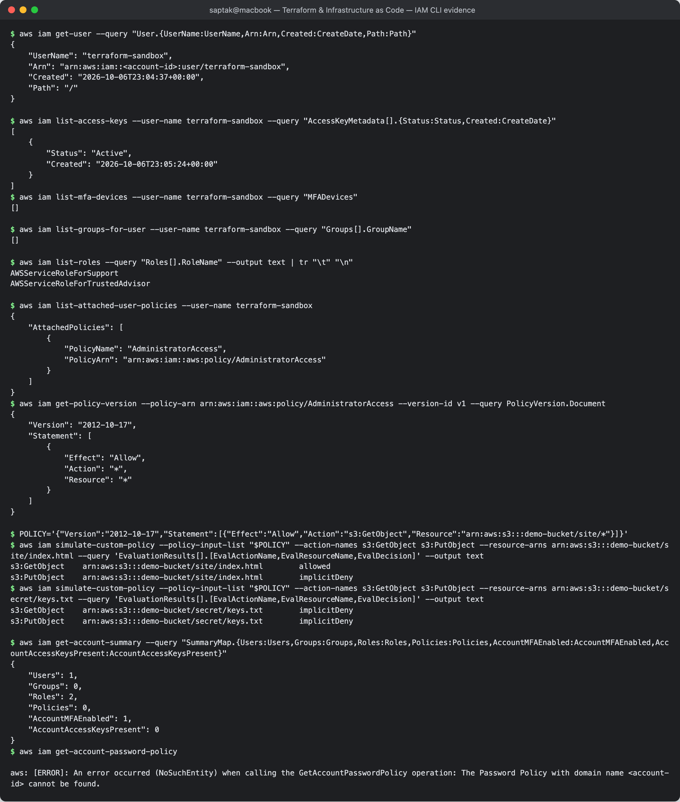

# 01. IAM — Governance

**Author:** Saptak Banerjee · **Session:** 18 — Terraform & Infrastructure as Code (Task 2)
**Evidence:** read-only AWS CLI v2.35.19 calls against the real account used for the Terraform labs (region ap-south-1; IAM itself is global). Account ID masked as `<account-id>`.

---

## Table of Contents

1. [What is IAM?](#what-is-iam)
2. [Users](#users)
3. [Groups](#groups)
4. [Roles](#roles)
5. [Policies](#policies)
6. [Permissions](#permissions-how-a-request-is-evaluated)
7. [Least privilege](#least-privilege)
8. [IAM best practices](#iam-best-practices)
9. [Common use cases](#common-use-cases)

---

## What is IAM?

**AWS Identity and Access Management** decides **who** (a *principal*) can do **what** (an *action* such as `s3:GetObject`) on **which resource** (an ARN), under **which conditions**. Every AWS API call, whether from the console, the CLI or Terraform, is signed with a principal's credentials and checked by IAM before it runs.

- IAM is **global**. Users, roles and policies are not tied to a region.
- IAM itself has no charge.
- It handles **authentication** (proving you are `terraform-sandbox`) and **authorization** (is `terraform-sandbox` allowed to call `ec2:RunInstances`?).

The identity Terraform used for every lab in this session:

```
$ aws iam get-user --query "User.{UserName:UserName,Arn:Arn,Created:CreateDate,Path:Path}"
{
    "UserName": "terraform-sandbox",
    "Arn": "arn:aws:iam::<account-id>:user/terraform-sandbox",
    "Created": "2026-10-06T23:04:37+00:00",
    "Path": "/"
}
```

---

## Users

An **IAM user** is a long-lived identity for a person or an application, with its own credentials:

- **console password**, for humans signing in to the web console;
- **access keys** (`AKIA...` ID + secret), for the CLI, SDKs and Terraform. A user can have at most 2 keys, so they can be rotated.

```
$ aws iam list-access-keys --user-name terraform-sandbox --query "AccessKeyMetadata[].{Status:Status,Created:CreateDate}"
[
    {
        "Status": "Active",
        "Created": "2026-10-06T23:05:24+00:00"
    }
]
$ aws iam list-mfa-devices --user-name terraform-sandbox --query "MFADevices"
[]
```

The **root user** (the account's sign-up email) is not an IAM user. It can do everything, including closing the account, and cannot be restricted by IAM policies. Use it only for the few tasks that require it.

---

## Groups

A **group** is a collection of users that share attached policies (e.g. `Developers`, `ReadOnlyAuditors`). Adding a user to a group grants the group's permissions, and removing them takes those permissions away. Groups contain only users, not other groups or roles, and a group cannot be a principal in a policy.

```
$ aws iam list-groups-for-user --user-name terraform-sandbox --query "Groups[].GroupName"
[]
```

The sandbox user is in no group. Its permission is attached directly (see below), which is acceptable for a single throw-away automation user. For humans, attaching through groups is the norm.

---

## Roles

A **role** is an identity with permissions but **no long-term credentials**. A trusted principal *assumes* it via AWS STS and receives **temporary credentials** (access key + secret + session token, valid 15 min to 12 h). A role has two policies:

| Policy | Answers |
| --- | --- |
| **Trust policy** | *Who* may assume this role (e.g. `ec2.amazonaws.com`, another account, a GitHub OIDC identity) |
| **Permissions policy** | *What* the role may do once assumed |

Roles are how AWS services act on your behalf, for example an EC2 instance reading S3, or a Lambda writing logs. **Service-linked roles** are created and owned by AWS services:

```
$ aws iam list-roles --query "Roles[].RoleName" --output text | tr "\t" "\n"
AWSServiceRoleForSupport
AWSServiceRoleForTrustedAdvisor
```

**Used for real in Session 19:** the Terraform project creates `aws_iam_role.web` with a trust policy for `ec2.amazonaws.com`, wraps it in an **instance profile**, and attaches it to the EC2 instance. At boot, `aws s3 cp` on the instance picks up the role's temporary credentials from the instance metadata service. No access key is ever placed on the server. See [`Cloud & Terraform in Action`](../../../Cloud%20%26%20Terraform%20in%20Action/README.md).

---

## Policies

A **policy** is a JSON document of statements. Each statement has `Effect` (Allow or Deny), `Action`, `Resource`, and optionally `Condition` and `Principal`.

| Type | Attached to | Example |
| --- | --- | --- |
| **AWS-managed** | users / groups / roles | `AdministratorAccess`, `AmazonSSMManagedInstanceCore` |
| **Customer-managed** | users / groups / roles | your own reusable policy, versioned |
| **Inline** | exactly one identity | Session 19's `read-site-object` on the EC2 role |
| **Resource-based** | a resource (S3 bucket policy, KMS key policy, SQS queue policy) | has a `Principal` element |
| **Permissions boundary** | user / role | a ceiling: effective permissions = identity policy ∩ boundary |
| **SCP** (AWS Organizations) | account / OU | a ceiling for a whole account |

The policy attached to the sandbox user, and its content:

```
$ aws iam list-attached-user-policies --user-name terraform-sandbox
{
    "AttachedPolicies": [
        {
            "PolicyName": "AdministratorAccess",
            "PolicyArn": "arn:aws:iam::aws:policy/AdministratorAccess"
        }
    ]
}
$ aws iam get-policy-version --policy-arn arn:aws:iam::aws:policy/AdministratorAccess --version-id v1 --query PolicyVersion.Document
{
    "Version": "2012-10-17",
    "Statement": [
        {
            "Effect": "Allow",
            "Action": "*",
            "Resource": "*"
        }
    ]
}
```

`"Action": "*", "Resource": "*"` is the opposite of least privilege. It was accepted only because this is a short-lived lab user whose key is deleted after the course. A real Terraform pipeline would use a role scoped to the services it manages.

---

## Permissions: how a request is evaluated

1. **Default deny.** Anything not explicitly allowed is denied (an *implicit deny*).
2. An **explicit `Deny`** in any applicable policy always wins.
3. Otherwise, an **`Allow`** in an identity or resource policy grants access, provided no SCP or permissions boundary blocks it.

---

## Least privilege

Grant only the actions on only the resources a job needs, and nothing else. The Session 19 EC2 role needs exactly one thing: to read the web page from its bucket. IAM's policy simulator shows how a narrowly scoped policy behaves, without creating anything:

```
$ POLICY='{"Version":"2012-10-17","Statement":[{"Effect":"Allow","Action":"s3:GetObject","Resource":"arn:aws:s3:::demo-bucket/site/*"}]}'
$ aws iam simulate-custom-policy --policy-input-list "$POLICY" --action-names s3:GetObject s3:PutObject --resource-arns arn:aws:s3:::demo-bucket/site/index.html --query 'EvaluationResults[].[EvalActionName,EvalResourceName,EvalDecision]' --output text
s3:GetObject	arn:aws:s3:::demo-bucket/site/index.html	allowed
s3:PutObject	arn:aws:s3:::demo-bucket/site/index.html	implicitDeny
$ aws iam simulate-custom-policy --policy-input-list "$POLICY" --action-names s3:GetObject s3:PutObject --resource-arns arn:aws:s3:::demo-bucket/secret/keys.txt --query 'EvaluationResults[].[EvalActionName,EvalResourceName,EvalDecision]' --output text
s3:GetObject	arn:aws:s3:::demo-bucket/secret/keys.txt	implicitDeny
s3:PutObject	arn:aws:s3:::demo-bucket/secret/keys.txt	implicitDeny
```

Read under `site/` is allowed. Writing there, and reading anything outside `site/`, fall to **implicit deny**. If the instance were compromised, the attacker would gain the ability to read one public web page and nothing else.

Practical ways to get to least privilege: start from AWS-managed job-function policies, then tighten them using **IAM Access Analyzer** (which can generate a policy from CloudTrail activity) and **last-accessed data**, which shows services a principal never uses.

---

## IAM best practices

Checked against this account where the CLI can show it:

```
$ aws iam get-account-summary --query "SummaryMap.{Users:Users,Groups:Groups,Roles:Roles,Policies:Policies,AccountMFAEnabled:AccountMFAEnabled,AccountAccessKeysPresent:AccountAccessKeysPresent}"
{
    "Users": 1,
    "Groups": 0,
    "Roles": 2,
    "Policies": 0,
    "AccountMFAEnabled": 1,
    "AccountAccessKeysPresent": 0
}
$ aws iam get-account-password-policy

aws: [ERROR]: An error occurred (NoSuchEntity) when calling the GetAccountPasswordPolicy operation: The Password Policy with domain name <account-id> cannot be found.
```

| Practice | Status here |
| --- | --- |
| Lock away the root user: MFA on, **no root access keys** | `AccountMFAEnabled: 1`, `AccountAccessKeysPresent: 0` |
| Prefer **temporary credentials** (roles, IAM Identity Center/SSO, OIDC for CI) over long-lived access keys | Session 19's EC2 uses a role. The Terraform user still uses a static key, which is the main gap. |
| MFA for every human user | `terraform-sandbox` has no MFA. It is a programmatic-only user with no console password, but MFA would still be needed for a human account. |
| Least privilege | sandbox has `AdministratorAccess` (lab only, see above). The Session 19 role is scoped. |
| Rotate and remove unused keys; review with credential reports and last-accessed data | one key, created for this lab, to be deleted after it |
| Strong password policy | none set (`NoSuchEntity`), so AWS defaults apply. Set one if console users exist. |
| Use groups (or Identity Center permission sets) for humans, not per-user policies | n/a, no human IAM users |
| Use conditions (`aws:SourceIp`, `aws:MultiFactorAuthPresent`, tags) and permissions boundaries for delegated admins | — |
| Never put keys in code, `.tfvars`, AMIs or user-data | keys live in a file outside the git repo. `.gitignore` excludes `*.tfstate*`. |

---

## Common use cases

- **Human access**: engineers sign in through IAM Identity Center and get role-based, time-limited sessions per account.
- **Workloads on AWS**: EC2 instance profiles, ECS task roles, Lambda execution roles, EKS IRSA / Pod Identity. Code gets temporary credentials automatically.
- **CI/CD**: GitHub Actions assumes a deploy role via **OIDC federation**, so no AWS secret is stored in GitHub.
- **Cross-account access**: a role in account B trusts account A, for example a central security or tooling account.
- **Service-to-service authorization**: bucket policies and KMS key policies restrict which roles may read data.
- **Infrastructure as Code**: Terraform creates and audits roles and policies like any other resource (Session 19 creates a role, an inline policy, a managed-policy attachment and an instance profile).

**Screenshot:** 
