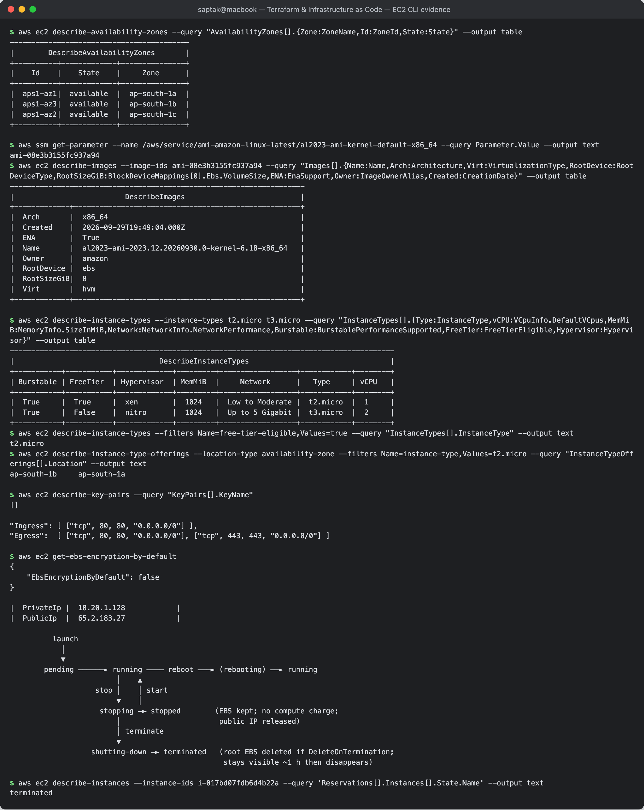

# 02. EC2 — Compute

**Author:** Saptak Banerjee · **Session:** 18 — Terraform & Infrastructure as Code (Task 2)
**Evidence:** read-only AWS CLI v2.35.19 calls in **ap-south-1**. The real instance launched, verified and terminated in [Session 19](../../../Cloud%20%26%20Terraform%20in%20Action/README.md) is quoted where relevant.

---

## Table of Contents

1. [What is EC2?](#what-is-ec2)
2. [AMI](#ami)
3. [Instance types](#instance-types)
4. [Key pairs](#key-pairs)
5. [Security Groups](#security-groups)
6. [EBS](#ebs)
7. [Public vs private IP](#public-vs-private-ip)
8. [Instance lifecycle](#instance-lifecycle)
9. [Common use cases](#common-use-cases)

---

## What is EC2?

**Elastic Compute Cloud** rents virtual machines (*instances*) by the second. You choose an OS image (AMI), a hardware size (instance type), a network location (VPC subnet + AZ), a firewall (security groups) and disks (EBS). AWS runs the hypervisor and the physical hosts. EC2 is **IaaS**: you are responsible for the OS, patches and everything above it.

Instances live in one **Availability Zone**:

```
$ aws ec2 describe-availability-zones --query "AvailabilityZones[].{Zone:ZoneName,Id:ZoneId,State:State}" --output table
------------------------------------------
|        DescribeAvailabilityZones       |
+----------+-------------+---------------+
|    Id    |    State    |     Zone      |
+----------+-------------+---------------+
|  aps1-az1|  available  |  ap-south-1a  |
|  aps1-az3|  available  |  ap-south-1b  |
|  aps1-az2|  available  |  ap-south-1c  |
+----------+-------------+---------------+
```

The zone *name* (`ap-south-1b`) is mapped per account. The zone *ID* (`aps1-az3`) is the physical location, and it is the one to compare across accounts.

---

## AMI

An **Amazon Machine Image** is the template for the root disk: an EBS snapshot of the OS, plus metadata such as architecture, virtualization type and boot mode. AMIs are **regional**, so the same Amazon Linux release has a different AMI ID in every region and every few weeks. Hard-coding an ID therefore goes stale. AWS publishes the current ID as a public SSM parameter:

```
$ aws ssm get-parameter --name /aws/service/ami-amazon-linux-latest/al2023-ami-kernel-default-x86_64 --query Parameter.Value --output text
ami-08e3b3155fc937a94
$ aws ec2 describe-images --image-ids ami-08e3b3155fc937a94 --query "Images[].{Name:Name,Arch:Architecture,Virt:VirtualizationType,RootDevice:RootDeviceType,RootSizeGiB:BlockDeviceMappings[0].Ebs.VolumeSize,ENA:EnaSupport,Owner:ImageOwnerAlias,Created:CreationDate}" --output table
---------------------------------------------------------------------
|                          DescribeImages                           |
+-------------+-----------------------------------------------------+
|  Arch       |  x86_64                                             |
|  Created    |  2026-09-29T19:49:04.000Z                           |
|  ENA        |  True                                               |
|  Name       |  al2023-ami-2023.12.20260930.0-kernel-6.18-x86_64   |
|  Owner      |  amazon                                             |
|  RootDevice |  ebs                                                |
|  RootSizeGiB|  8                                                  |
|  Virt       |  hvm                                                |
+-------------+-----------------------------------------------------+
```

Session 19's Terraform reads that same parameter with `data "aws_ssm_parameter"` and then `data "aws_ami"`, so `terraform plan` always picks the current Amazon Linux 2023 build. The 8 GiB snapshot size is also the minimum root volume the instance can have.

AMI sources: AWS (Amazon Linux, Windows), vendors (Ubuntu by Canonical, RHEL), AWS Marketplace, and your own images (*golden AMIs* baked with Packer).

---

## Instance types

The name encodes the hardware: `t3.micro` = **family** `t` (burstable) + **generation** `3` + **size** `micro`. Suffix letters add attributes: `g` = Graviton/ARM, `a` = AMD, `n` = enhanced networking, `d` = local NVMe.

| Family | Optimised for | Examples |
| --- | --- | --- |
| T | burstable general purpose, earns CPU credits while idle | t2, t3, t4g |
| M | balanced general purpose | m7i, m7g |
| C | compute (CPU-bound) | c7i, c7g |
| R / X | memory | r7i, x2idn |
| I / D | storage I/O | i4i |
| P / G / Inf / Trn | accelerators (GPU / ML) | g6, p5, inf2 |

```
$ aws ec2 describe-instance-types --instance-types t2.micro t3.micro --query "InstanceTypes[].{Type:InstanceType,vCPU:VCpuInfo.DefaultVCpus,MemMiB:MemoryInfo.SizeInMiB,Network:NetworkInfo.NetworkPerformance,Burstable:BurstablePerformanceSupported,FreeTier:FreeTierEligible,Hypervisor:Hypervisor}" --output table
------------------------------------------------------------------------------------------
|                                  DescribeInstanceTypes                                 |
+-----------+-----------+-------------+---------+------------------+------------+--------+
| Burstable | FreeTier  | Hypervisor  | MemMiB  |     Network      |   Type     | vCPU   |
+-----------+-----------+-------------+---------+------------------+------------+--------+
|  True     |  True     |  xen        |  1024   |  Low to Moderate |  t2.micro  |  1     |
|  True     |  False    |  nitro      |  1024   |  Up to 5 Gigabit |  t3.micro  |  2     |
+-----------+-----------+-------------+---------+------------------+------------+--------+
$ aws ec2 describe-instance-types --filters Name=free-tier-eligible,Values=true --query "InstanceTypes[].InstanceType" --output text
t2.micro
$ aws ec2 describe-instance-type-offerings --location-type availability-zone --filters Name=instance-type,Values=t2.micro --query "InstanceTypeOfferings[].Location" --output text
ap-south-1b	ap-south-1a
```

`t3.micro` is the newer Nitro-based type with more network bandwidth, but **for this account in ap-south-1 only `t2.micro` is flagged free-tier eligible**. `t2.micro` is also not offered in `ap-south-1c`. Both facts shaped Session 19's Terraform: `instance_type` defaults to `t2.micro`, a `validation` block only allows `t2.micro`/`t3.micro`, and the subnet is pinned to AZ `a`.

---

## Key pairs

An EC2 **key pair** is an SSH public key that AWS injects into the instance at first boot (`~ec2-user/.ssh/authorized_keys`). You keep the private key, and AWS never stores it. For Windows, the key decrypts the generated Administrator password. Losing the private key means losing SSH access to that instance.

```
$ aws ec2 describe-key-pairs --query "KeyPairs[].KeyName"
[]
```

This account has **no key pairs**, and the Session 19 instance was launched without one (`"KeyName": null`). Shell access, if needed, goes through **SSM Session Manager**, which uses IAM authentication, CloudTrail auditing and no open port 22. **EC2 Instance Connect** is another option: it pushes a short-lived key for a single session.

---

## Security Groups

A **security group** is a **stateful** virtual firewall attached to an instance's network interface:

- **allow rules only**, no deny rules. Anything not allowed is dropped;
- *stateful*: return traffic for an allowed connection is allowed automatically;
- the source can be a CIDR **or another security group** (e.g. "DB SG allows 5432 from the app SG");
- default for a new SG: **no inbound, all outbound**.

The Session 19 web SG, condensed from the `aws ec2 describe-security-groups` JSON captured in that session:

```
"Ingress": [ ["tcp", 80, 80, "0.0.0.0/0"] ],
"Egress":  [ ["tcp", 80, 80, "0.0.0.0/0"], ["tcp", 443, 443, "0.0.0.0/0"] ]
```

Probing the instance showed SG behaviour directly. Port 80, before nginx had started, gave `Couldn't connect ... after 29 ms`: the SG allowed the packet and the OS answered with a TCP reset. Port 22 gave `Connection timed out after 5008 milliseconds`: the SG silently dropped it. *Fast refusal = reached the host; timeout = filtered.*

---

## EBS

**Elastic Block Store** volumes are network-attached block disks. Each one lives in **one AZ** and attaches to an instance in that AZ.

| Type | Use |
| --- | --- |
| **gp3** (SSD) | default general purpose. 3,000 IOPS / 125 MB/s baseline, scalable independently of size |
| io2 Block Express | high-IOPS databases |
| st1 / sc1 (HDD) | throughput / cold sequential data |

Key points: **snapshots** are incremental and stored in S3 (that is how AMIs are built). Volumes can be resized and retyped online. `DeleteOnTermination` (true by default for the root volume) controls whether the disk survives the instance. **Instance store** is different: it is local NVMe, fast, and *lost on stop*.

```
$ aws ec2 get-ebs-encryption-by-default
{
    "EbsEncryptionByDefault": false
}
```

Account-level default encryption is **off** in this region, so Session 19 sets `encrypted = true` on the root volume explicitly. `terraform state show aws_instance.web` recorded `encrypted = true, volume_type = "gp3", iops = 3000, throughput = 125, volume_size = 8`. Turning on `enable-ebs-encryption-by-default` is a common account hardening step.

---

## Public vs private IP

| | Private IPv4 | Public IPv4 (auto-assigned) | Elastic IP |
| --- | --- | --- | --- |
| From | the subnet CIDR | AWS's pool | allocated to your account |
| Reachable from | inside the VPC (and peered / VPN networks) | the internet, **if** the subnet routes to an IGW and the SG allows it | same as public |
| Lifetime | the life of the ENI | **released on stop** and changes on next start | until you release it |
| Cost | free | charged per hour (all public IPv4 since Feb 2024) | charged per hour |

The OS only ever sees the private address. The IGW performs 1:1 NAT to the public address. Session 19's instance had both:

```
|  PrivateIp |  10.20.1.128            |
|  PublicIp  |  65.2.183.27            |
```

After destroy, `curl http://65.2.183.27/` timed out: the address went back to AWS's pool.

---

## Instance lifecycle

```text
          launch
            │
            ▼
        pending ──────► running ──── reboot ───► (rebooting) ──► running
                         │    ▲
                    stop │    │ start
                         ▼    │
                     stopping ─► stopped        (EBS kept; no compute charge;
                         │                       public IP released)
                         │ terminate
                         ▼
                   shutting-down ─► terminated   (root EBS deleted if DeleteOnTermination;
                                                  stays visible ~1 h then disappears)
```

Also: **hibernate**, which saves RAM to EBS; **Spot interruption**, where AWS reclaims the capacity at 2 minutes' notice; **termination protection** (`disable_api_termination`); and **user data**, which runs once by cloud-init on first boot. Session 19's user data installs nginx.

The real Session 19 instance went `pending → running` in **15 s** (`aws_instance.web: Creation complete after 15s`). cloud-init finished at **32.9 s** of uptime. After `terraform destroy` it reported:

```
$ aws ec2 describe-instances --instance-ids i-017bd07fdb6d4b22a --query 'Reservations[].Instances[].State.Name' --output text
terminated
```

---

## Common use cases

- Web and application servers, usually behind a load balancer in an **Auto Scaling group** across AZs.
- Self-managed databases or software that needs OS-level control or licensed hardware.
- Batch, HPC and ML training (C/P/G families, Spot for cost).
- CI build runners, bastion and jump hosts (though SSM is replacing bastions).
- Kubernetes worker nodes (EKS managed node groups are EC2 instances).
- Dev/test boxes that are stopped outside working hours.

**Screenshot:** 
