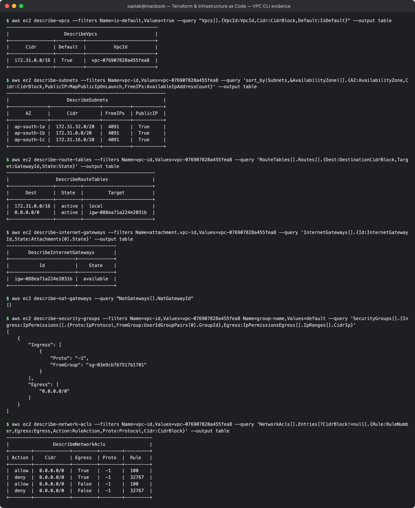

# 04. VPC — Networking

**Author:** Saptak Banerjee · **Session:** 18 — Terraform & Infrastructure as Code (Task 2)
**Evidence:** read-only AWS CLI calls against the account's **default VPC** in ap-south-1. The custom VPC built with Terraform in [Session 19](../../../Cloud%20%26%20Terraform%20in%20Action/README.md) is quoted for comparison. No NAT gateway was created, because it is billed hourly.

---

## Table of Contents

1. [What is VPC?](#what-is-vpc)
2. [CIDR](#cidr)
3. [Subnets](#subnets)
4. [Route tables](#route-tables)
5. [Internet Gateway](#internet-gateway)
6. [NAT Gateway](#nat-gateway)
7. [Security Groups](#security-groups)
8. [Network ACLs](#network-acls)
9. [Public vs private subnet](#public-vs-private-subnet)

---

## What is VPC?

A **Virtual Private Cloud** is your own logically isolated network inside an AWS region. You choose its IP range, split it into subnets (one AZ each), decide how traffic is routed, and control what may enter or leave. A VPC spans **all AZs of one region**. Every account gets a **default VPC** per region so instances can launch without any setup:

```
$ aws ec2 describe-vpcs --filters Name=is-default,Values=true --query "Vpcs[].{VpcId:VpcId,Cidr:CidrBlock,Default:IsDefault}" --output table
-------------------------------------------------------
|                    DescribeVpcs                     |
+----------------+----------+-------------------------+
|      Cidr      | Default  |          VpcId          |
+----------------+----------+-------------------------+
|  172.31.0.0/16 |  True    |  vpc-076907828a455fea8  |
+----------------+----------+-------------------------+
```

---

## CIDR

**Classless Inter-Domain Routing** notation `a.b.c.d/n`: the first *n* bits are the network part, and the remaining `32 − n` bits number the hosts.

| CIDR | Addresses | Usable in an AWS subnet |
| --- | --- | --- |
| `/16` | 65,536 | (VPC maximum size) |
| `/20` | 4,096 | 4,091 |
| `/24` | 256 | 251 |
| `/28` | 16 | 11 (VPC/subnet minimum size) |

AWS **reserves 5 addresses in every subnet**: network address, `.1` VPC router, `.2` DNS, `.3` reserved for future use, and broadcast. The default VPC's `/20` subnets show exactly 4,096 − 5:

```
$ aws ec2 describe-subnets --filters Name=vpc-id,Values=vpc-076907828a455fea8 --query 'sort_by(Subnets,&AvailabilityZone)[].{AZ:AvailabilityZone,Cidr:CidrBlock,PublicIP:MapPublicIpOnLaunch,FreeIPs:AvailableIpAddressCount}' --output table
----------------------------------------------------------
|                     DescribeSubnets                    |
+--------------+------------------+----------+-----------+
|      AZ      |      Cidr        | FreeIPs  | PublicIP  |
+--------------+------------------+----------+-----------+
|  ap-south-1a |  172.31.32.0/20  |  4091    |  True     |
|  ap-south-1b |  172.31.0.0/20   |  4091    |  True     |
|  ap-south-1c |  172.31.16.0/20  |  4091    |  True     |
+--------------+------------------+----------+-----------+
```

Session 19's `10.20.1.0/24` subnet reported **250** free IPs while the instance was running: 256 − 5 reserved − 1 used by the EC2 network interface.

Use RFC 1918 private ranges (`10.0.0.0/8`, `172.16.0.0/12`, `192.168.0.0/16`), and plan them so VPCs you may later peer or connect via Transit Gateway **do not overlap**.

---

## Subnets

A **subnet** is a slice of the VPC CIDR that lives in **exactly one AZ**. Resources are launched into subnets, and to be resilient you place subnets in several AZs. Whether a subnet is "public" or "private" is not a setting. It follows from its **route table** (see below). The `MapPublicIpOnLaunch` flag, `True` above and `map_public_ip_on_launch = true` in Session 19, only controls whether instances get a public IPv4 automatically.

---

## Route tables

A **route table** is the set of rules deciding where traffic leaving a subnet goes. The most specific match (longest prefix) wins. Each subnet is associated with exactly one table, falling back to the VPC's *main* table if none is set. Every table has an unremovable `local` route for the VPC CIDR.

Default VPC:

```
$ aws ec2 describe-route-tables --filters Name=vpc-id,Values=vpc-076907828a455fea8 --query 'RouteTables[].Routes[].{Dest:DestinationCidrBlock,Target:GatewayId,State:State}' --output table
------------------------------------------------------
|                 DescribeRouteTables                |
+----------------+---------+-------------------------+
|      Dest      |  State  |         Target          |
+----------------+---------+-------------------------+
|  172.31.0.0/16 |  active |  local                  |
|  0.0.0.0/0     |  active |  igw-088ea71a224e2031b  |
+----------------+---------+-------------------------+
```

Session 19's Terraform-built table had the same shape: `10.20.0.0/16 → local`, `0.0.0.0/0 → igw-0a6b82f442748e435`.

---

## Internet Gateway

An **IGW** is a horizontally scaled, highly available VPC component that (1) is the target for internet-bound routes and (2) performs **1:1 NAT** between an instance's private IP and its public or Elastic IP. One IGW per VPC, no bandwidth limit, no hourly charge.

```
$ aws ec2 describe-internet-gateways --filters Name=attachment.vpc-id,Values=vpc-076907828a455fea8 --query 'InternetGateways[].{Id:InternetGatewayId,State:Attachments[0].State}' --output table
----------------------------------------
|       DescribeInternetGateways       |
+------------------------+-------------+
|           Id           |    State    |
+------------------------+-------------+
|  igw-088ea71a224e2031b |  available  |
+------------------------+-------------+
```

An instance is reachable from the internet only if **all four** hold: a public IP, a subnet route to the IGW, an SG rule allowing the port, and an NACL allowing it both ways.

---

## NAT Gateway

A **NAT gateway** lets instances in **private** subnets start **outbound** connections (OS updates, external APIs) while staying unreachable from the internet. It is many-to-one source NAT.

- It sits in a **public** subnet with an Elastic IP. The private subnet's route table sends `0.0.0.0/0 → nat-xxxx`.
- It is zonal: for HA, use one per AZ.
- It is billed **per hour plus per GB processed**. That is why none was created here:

```
$ aws ec2 describe-nat-gateways --query "NatGateways[].NatGatewayId"
[]
```

Cheaper alternatives for specific traffic: **VPC gateway endpoints** for S3 and DynamoDB (free), **interface endpoints** (PrivateLink) for other AWS APIs, and an *egress-only IGW* for IPv6.

---

## Security Groups

Instance or ENI-level, **stateful**, **allow-only** firewalls (details in [02-ec2](../02-ec2/README.md#security-groups)). Every VPC has a `default` SG, which allows all traffic **from members of the same SG** and all outbound:

```
$ aws ec2 describe-security-groups --filters Name=vpc-id,Values=vpc-076907828a455fea8 Name=group-name,Values=default --query 'SecurityGroups[].{Ingress:IpPermissions[].{Proto:IpProtocol,FromGroup:UserIdGroupPairs[0].GroupId},Egress:IpPermissionsEgress[].IpRanges[].CidrIp}'
[
    {
        "Ingress": [
            {
                "Proto": "-1",
                "FromGroup": "sg-03e9cb7b7517b1701"
            }
        ],
        "Egress": [
            "0.0.0.0/0"
        ]
    }
]
```

`FromGroup` is the SG's own ID: a self-reference. Session 19 created a dedicated SG instead (in on 80 only; out on 80 and 443 only).

---

## Network ACLs

A **network ACL** is a **stateless**, subnet-level filter with **numbered allow *and* deny rules**, evaluated lowest number first. Because it is stateless, return traffic needs its own rule, usually ephemeral ports 1024–65535. The default NACL allows everything:

```
$ aws ec2 describe-network-acls --filters Name=vpc-id,Values=vpc-076907828a455fea8 --query 'NetworkAcls[].Entries[?CidrBlock!=null].{Rule:RuleNumber,Egress:Egress,Action:RuleAction,Proto:Protocol,Cidr:CidrBlock}' --output table
-----------------------------------------------------
|                DescribeNetworkAcls                |
+--------+-------------+---------+--------+---------+
| Action |    Cidr     | Egress  | Proto  |  Rule   |
+--------+-------------+---------+--------+---------+
|  allow |  0.0.0.0/0  |  True   |  -1    |  100    |
|  deny  |  0.0.0.0/0  |  True   |  -1    |  32767  |
|  allow |  0.0.0.0/0  |  False  |  -1    |  100    |
|  deny  |  0.0.0.0/0  |  False  |  -1    |  32767  |
+--------+-------------+---------+--------+---------+
```

Rule `100` allows all, and rule `32767` (shown as `*` in the console) is the catch-all deny reached only if nothing earlier matched.

| | Security Group | Network ACL |
| --- | --- | --- |
| Applies to | ENI / instance | whole subnet |
| State | **stateful** | **stateless** |
| Rules | allow only | allow + deny, ordered |
| Typical use | primary access control | coarse guard-rail, e.g. block a malicious CIDR |

---

## Public vs private subnet

| | Public subnet | Private subnet |
| --- | --- | --- |
| Route table has `0.0.0.0/0 →` | **Internet Gateway** | NAT gateway (or nothing, for an isolated subnet) |
| Instances reachable from the internet | yes, with a public IP + SG allowing it | **no** |
| Outbound internet | directly via IGW | via NAT gateway or VPC endpoints |
| Typical tenants | load balancers, NAT gateways, bastions | app servers, databases, caches |

Session 19 built a single public subnet, because the goal was a reachable nginx demo at zero NAT cost. A production layout would put an ALB in public subnets in two AZs, with the instances and database in private subnets behind it.

**Screenshot:** 
