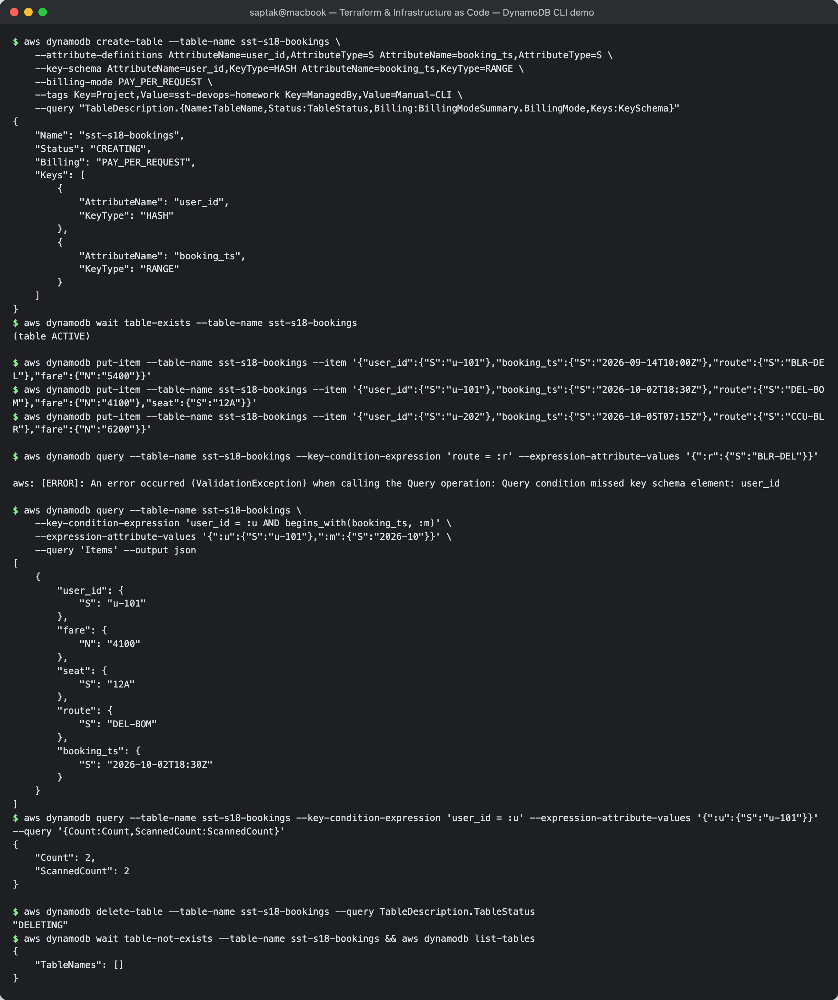
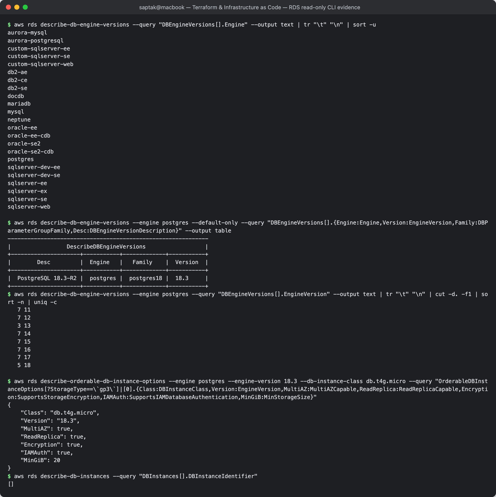

# 05. DynamoDB & RDS — Database Services

**Author:** Saptak Banerjee · **Session:** 18 — Terraform & Infrastructure as Code (Task 2)
**Evidence:** DynamoDB: a tiny **on-demand** table was created, written to, queried and deleted with the AWS CLI in ap-south-1. That costs a fraction of a cent, and the table existed for about a minute. RDS: **read-only** API calls only. No DB instance was created, because even the smallest one is billed hourly and needs a subnet group and VPC.

---

## Table of Contents

**DynamoDB:** [NoSQL](#nosql) · [Tables](#tables) · [Items](#items) · [Attributes](#attributes) · [Partition key](#partition-key) · [Sort key](#sort-key) · [Use cases](#dynamodb-use-cases)

**RDS:** [Relational database](#relational-database) · [Supported engines](#supported-engines) · [DB instances](#db-instances) · [Security](#security) · [Backups](#backups) · [Multi-AZ](#multi-az) · [Read replicas](#read-replicas) · [Use cases](#rds-use-cases)

[DynamoDB vs RDS](#dynamodb-vs-rds)

---

# DynamoDB

## NoSQL

**Amazon DynamoDB** is a fully managed, serverless **key-value and document** database. There are no servers, versions or patching to manage, and it scales from zero to millions of requests per second with single-digit-millisecond latency. It is "NoSQL" because there are no joins and no fixed schema beyond the key: you design the table around your **access patterns**, not around normalised entities. Data is replicated across 3 AZs automatically.

Capacity modes: **on-demand** (`PAY_PER_REQUEST`, billed per read/write, used below) or **provisioned** RCU/WCU with auto-scaling.

## Tables

A **table** is a collection of items. Only the **primary key** is declared at creation time:

```
$ aws dynamodb create-table --table-name sst-s18-bookings \
    --attribute-definitions AttributeName=user_id,AttributeType=S AttributeName=booking_ts,AttributeType=S \
    --key-schema AttributeName=user_id,KeyType=HASH AttributeName=booking_ts,KeyType=RANGE \
    --billing-mode PAY_PER_REQUEST \
    --tags Key=Project,Value=sst-devops-homework Key=ManagedBy,Value=Manual-CLI \
    --query "TableDescription.{Name:TableName,Status:TableStatus,Billing:BillingModeSummary.BillingMode,Keys:KeySchema}"
{
    "Name": "sst-s18-bookings",
    "Status": "CREATING",
    "Billing": "PAY_PER_REQUEST",
    "Keys": [
        {
            "AttributeName": "user_id",
            "KeyType": "HASH"
        },
        {
            "AttributeName": "booking_ts",
            "KeyType": "RANGE"
        }
    ]
}
$ aws dynamodb wait table-exists --table-name sst-s18-bookings
(table ACTIVE)
```

Only `user_id` and `booking_ts` appear in `--attribute-definitions`, because only key attributes (and index keys) are declared. Everything else is free-form.

## Items

An **item** is one record, like a row, up to **400 KB**, addressed by its primary key. Writing three:

```
$ aws dynamodb put-item --table-name sst-s18-bookings --item '{"user_id":{"S":"u-101"},"booking_ts":{"S":"2026-09-14T10:00Z"},"route":{"S":"BLR-DEL"},"fare":{"N":"5400"}}'
$ aws dynamodb put-item --table-name sst-s18-bookings --item '{"user_id":{"S":"u-101"},"booking_ts":{"S":"2026-10-02T18:30Z"},"route":{"S":"DEL-BOM"},"fare":{"N":"4100"},"seat":{"S":"12A"}}'
$ aws dynamodb put-item --table-name sst-s18-bookings --item '{"user_id":{"S":"u-202"},"booking_ts":{"S":"2026-10-05T07:15Z"},"route":{"S":"CCU-BLR"},"fare":{"N":"6200"}}'
```

A successful `put-item` prints nothing. It is also an upsert: writing the same key again replaces the item.

## Attributes

An **attribute** is a name + typed value. The types are scalars (`S` string, `N` number sent as a string, `B` binary, `BOOL`, `NULL`), documents (`M` map, `L` list), and sets (`SS`, `NS`, `BS`). Items in the same table need not share attributes. The second item above has a `seat` attribute that the others lack, and DynamoDB accepted it without any schema change.

## Partition key

The **partition key** (`HASH`) is hashed to choose the physical partition that stores the item. It must spread traffic evenly: a high-cardinality value like `user_id` is good, while a `status` with three values would create **hot partitions**. Every `Query` **must** specify it with equality. Querying on a non-key attribute fails:

```
$ aws dynamodb query --table-name sst-s18-bookings --key-condition-expression 'route = :r' --expression-attribute-values '{":r":{"S":"BLR-DEL"}}'

aws: [ERROR]: An error occurred (ValidationException) when calling the Query operation: Query condition missed key schema element: user_id
```

To query by `route` you would add a **Global Secondary Index** with `route` as its partition key, or fall back to a full-table `Scan`, which is expensive at scale.

## Sort key

The optional **sort key** (`RANGE`) orders items *within* one partition key. The combination (PK, SK) must be unique, and the sort key enables range conditions: `=, <, <=, >, >=, BETWEEN, begins_with`. With ISO-8601 timestamps as sort keys, "this user's bookings in October 2026" is a cheap, indexed query:

```
$ aws dynamodb query --table-name sst-s18-bookings \
    --key-condition-expression 'user_id = :u AND begins_with(booking_ts, :m)' \
    --expression-attribute-values '{":u":{"S":"u-101"},":m":{"S":"2026-10"}}' \
    --query 'Items' --output json
[
    {
        "user_id": {
            "S": "u-101"
        },
        "fare": {
            "N": "4100"
        },
        "seat": {
            "S": "12A"
        },
        "route": {
            "S": "DEL-BOM"
        },
        "booking_ts": {
            "S": "2026-10-02T18:30Z"
        }
    }
]
$ aws dynamodb query --table-name sst-s18-bookings --key-condition-expression 'user_id = :u' --expression-attribute-values '{":u":{"S":"u-101"}}' --query '{Count:Count,ScannedCount:ScannedCount}'
{
    "Count": 2,
    "ScannedCount": 2
}
```

`ScannedCount == Count`: the key condition read only the matching items. A `Scan` with a filter would read the whole table and discard the rest.

Cleanup:

```
$ aws dynamodb delete-table --table-name sst-s18-bookings --query TableDescription.TableStatus
"DELETING"
$ aws dynamodb wait table-not-exists --table-name sst-s18-bookings && aws dynamodb list-tables
{
    "TableNames": []
}
```

## DynamoDB use cases

- User profiles, sessions, shopping carts: key lookups at any scale.
- Gaming leaderboards, IoT telemetry, time-series by device (PK = device, SK = timestamp, plus TTL to expire old data).
- Event-driven apps: **DynamoDB Streams** → Lambda.
- Multi-region active-active with **Global Tables**.
- **Terraform state locking**: the classic S3 backend used a DynamoDB table with a `LockID` partition key (newer Terraform can lock with S3 alone via `use_lockfile`).

**Screenshot:** 

---

# RDS

## Relational database

**Amazon RDS** is a managed service for running **relational (SQL)** databases. AWS handles provisioning, OS and engine patching, backups, failover and monitoring. You still own the schema, queries, indexes and parameter tuning. Relational means tables with a fixed schema, joins, constraints, and **ACID** transactions, which suits data with relationships and strong consistency needs. RDS is "managed", not serverless: you choose an instance size, except for Aurora Serverless v2.

## Supported engines

Engines this account can launch in ap-south-1:

```
$ aws rds describe-db-engine-versions --query "DBEngineVersions[].Engine" --output text | tr "\t" "\n" | sort -u
aurora-mysql
aurora-postgresql
custom-sqlserver-ee
custom-sqlserver-se
custom-sqlserver-web
db2-ae
db2-ce
db2-se
docdb
mariadb
mysql
neptune
oracle-ee
oracle-ee-cdb
oracle-se2
oracle-se2-cdb
postgres
sqlserver-dev-ee
sqlserver-dev-se
sqlserver-ee
sqlserver-ex
sqlserver-se
sqlserver-web
```

The RDS engines are **PostgreSQL, MySQL, MariaDB, Oracle, SQL Server, Db2** and **Aurora** (AWS's MySQL/PostgreSQL-compatible engine with shared cluster storage). `docdb` (DocumentDB) and `neptune` (graph) share the RDS API but are separate services. `custom-*` is **RDS Custom**, which gives you OS access.

PostgreSQL in detail:

```
$ aws rds describe-db-engine-versions --engine postgres --default-only --query "DBEngineVersions[].{Engine:Engine,Version:EngineVersion,Family:DBParameterGroupFamily,Desc:DBEngineVersionDescription}" --output table
-------------------------------------------------------------
|                 DescribeDBEngineVersions                  |
+---------------------+-----------+-------------+-----------+
|        Desc         |  Engine   |   Family    |  Version  |
+---------------------+-----------+-------------+-----------+
|  PostgreSQL 18.3-R2 |  postgres |  postgres18 |  18.3     |
+---------------------+-----------+-------------+-----------+
$ aws rds describe-db-engine-versions --engine postgres --query "DBEngineVersions[].EngineVersion" --output text | tr "\t" "\n" | cut -d. -f1 | sort -n | uniq -c
   7 11
   7 12
   3 13
   7 14
   7 15
   7 16
   7 17
   5 18
```

The default for a new instance is PostgreSQL **18.3**, and majors 11–18 are still listed. Older majors fall into paid **Extended Support** once community support ends, so upgrading regularly is part of operating RDS. The *parameter group family* (`postgres18`) is what you use to tune engine settings.

## DB instances

A **DB instance** is one database server: an instance class (`db.t4g.micro`, `db.m7g.large`, `db.r7g.*` for memory), storage (gp3 / io2, with optional storage autoscaling), an engine version, and placement via a **DB subnet group** (subnets in ≥2 AZs, normally private). What a given class supports can be checked without creating anything:

```
$ aws rds describe-orderable-db-instance-options --engine postgres --engine-version 18.3 --db-instance-class db.t4g.micro --query "OrderableDBInstanceOptions[?StorageType==\`gp3\`]|[0].{Class:DBInstanceClass,Version:EngineVersion,MultiAZ:MultiAZCapable,ReadReplica:ReadReplicaCapable,Encryption:SupportsStorageEncryption,IAMAuth:SupportsIAMDatabaseAuthentication,MinGiB:MinStorageSize}"
{
    "Class": "db.t4g.micro",
    "Version": "18.3",
    "MultiAZ": true,
    "ReadReplica": true,
    "Encryption": true,
    "IAMAuth": true,
    "MinGiB": 20
}
$ aws rds describe-db-instances --query "DBInstances[].DBInstanceIdentifier"
[]
```

Even the smallest class supports Multi-AZ, read replicas, encryption and IAM auth, with a 20 GiB storage minimum. The empty `describe-db-instances` confirms nothing is running or billing.

## Security

- **Network**: put it in **private subnets** with `publicly_accessible = false`. Its **security group** allows the DB port (5432) only *from the app tier's SG*, not from a CIDR.
- **Encryption at rest** with KMS. This must be chosen at creation; to encrypt an existing instance you snapshot it and restore with encryption. Snapshots, replicas and backups inherit it.
- **In transit**: TLS, which can be forced (`rds.force_ssl = 1` for PostgreSQL).
- **Authentication**: the master password managed in **Secrets Manager** (`manage_master_user_password = true` in Terraform, with automatic rotation), or **IAM database authentication** with short-lived tokens instead of passwords.
- **IAM** controls who can *manage* the instance (`rds:*` APIs). Database users and grants control who can *query* it.
- Audit: CloudTrail for API calls, engine logs exported to CloudWatch, Database Activity Streams.

## Backups

- **Automated backups**: a daily snapshot plus transaction logs every ~5 min, kept 1–35 days. They enable **point-in-time restore** to any second in the retention window. A restore creates a *new* instance.
- **Manual snapshots**: kept until you delete them, and can be copied cross-region or cross-account. Used before risky changes and for DR.
- **AWS Backup** can manage both centrally with policies.
- Terraform tip: set `final_snapshot_identifier` / `skip_final_snapshot` deliberately, and enable `deletion_protection`, because `terraform destroy` on a database is permanent.

## Multi-AZ

**High availability**, not scaling. RDS keeps a **synchronous standby** in another AZ. On failure of the instance, AZ, or storage, or during patching, it **fails over automatically** by flipping the DNS endpoint, typically in 60–120 s. The standby **does not serve reads**. The newer **Multi-AZ DB cluster** option (MySQL and PostgreSQL) has two *readable* standbys and faster failover. Expect roughly double the cost.

## Read replicas

**Read scaling** and DR. **Asynchronous** copies (up to 15 for MySQL, MariaDB and PostgreSQL), each with its own endpoint. They can be in another AZ or **another region**, and can be **promoted** to standalone primaries (manual DR). The application must send read-only traffic to them and tolerate replication lag. Aurora replicas share the cluster storage and also act as failover targets.

| | Multi-AZ standby | Read replica |
| --- | --- | --- |
| Purpose | availability | read scaling / DR |
| Replication | synchronous | asynchronous |
| Serves traffic | no (instance deployment) | yes, reads |
| Failover | automatic | manual promotion |
| Cross-region | no | yes |

## RDS use cases

- Transactional back ends for web and mobile apps (orders, payments, user accounts) that need joins, constraints and ACID.
- Lift-and-shift of existing MySQL, PostgreSQL, SQL Server or Oracle databases without running the DBA infrastructure.
- Reporting on a read replica, so analytics do not load the primary.
- ERP, CRM and CMS products (WordPress → MySQL) that require a relational engine.

---

## DynamoDB vs RDS

| | DynamoDB | RDS |
| --- | --- | --- |
| Model | key-value / document, schema-less | relational tables, fixed schema, SQL |
| Query flexibility | by key and indexes only, so design for access patterns | ad-hoc SQL, joins, aggregations |
| Scaling | automatic, horizontal, effectively unlimited | vertical (bigger instance) + read replicas |
| Ops | serverless, nothing to patch | managed, but you pick size, versions and maintenance windows |
| Cost at idle | ~0 on on-demand | pays per hour even when idle |
| Pick when | massive scale, predictable key lookups, spiky traffic | relational data, complex queries, transactions across entities |

**Screenshot:** 
