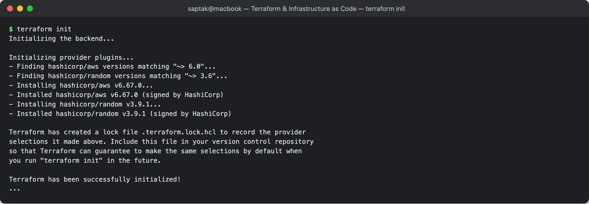
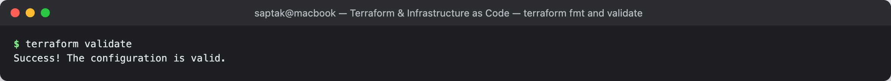
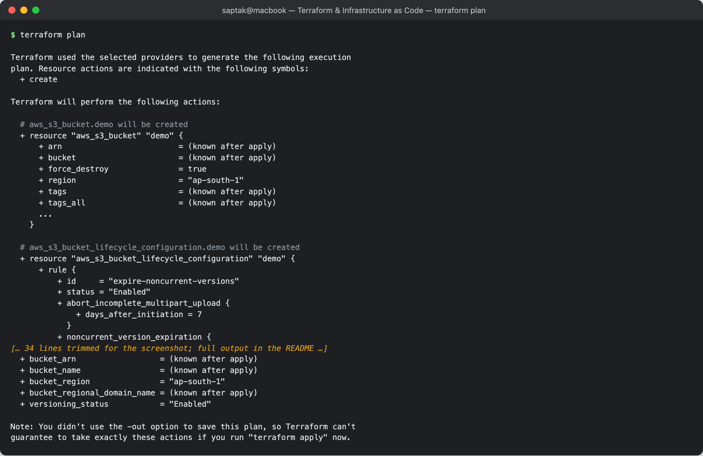
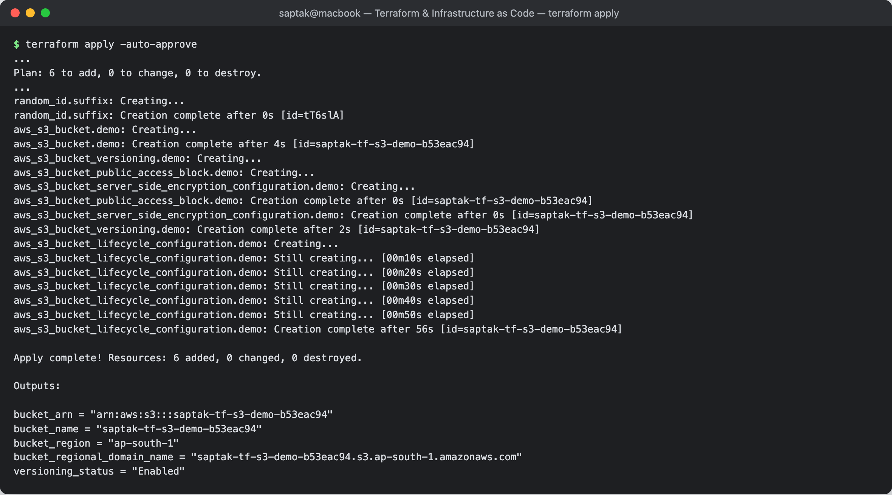
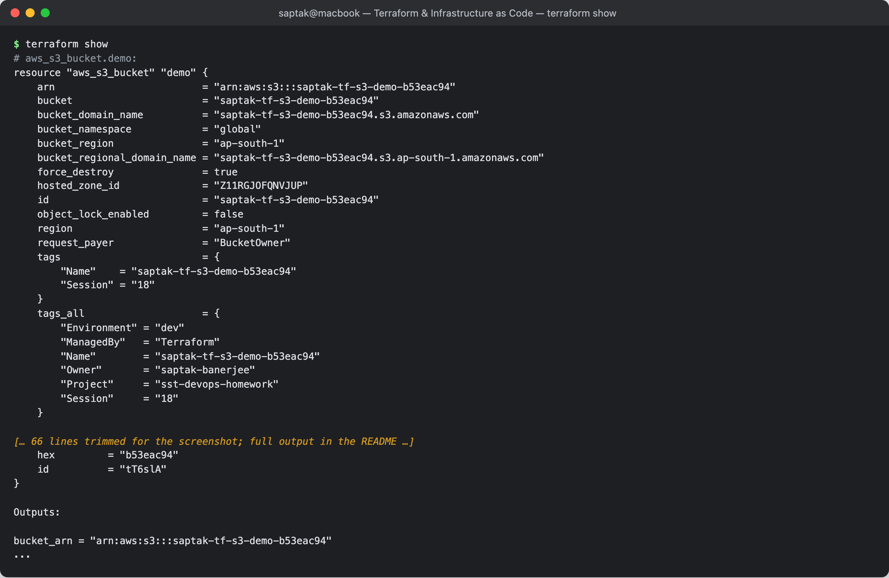
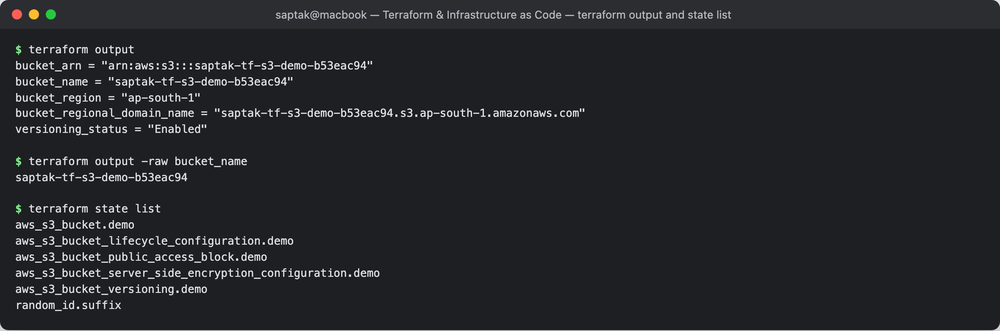
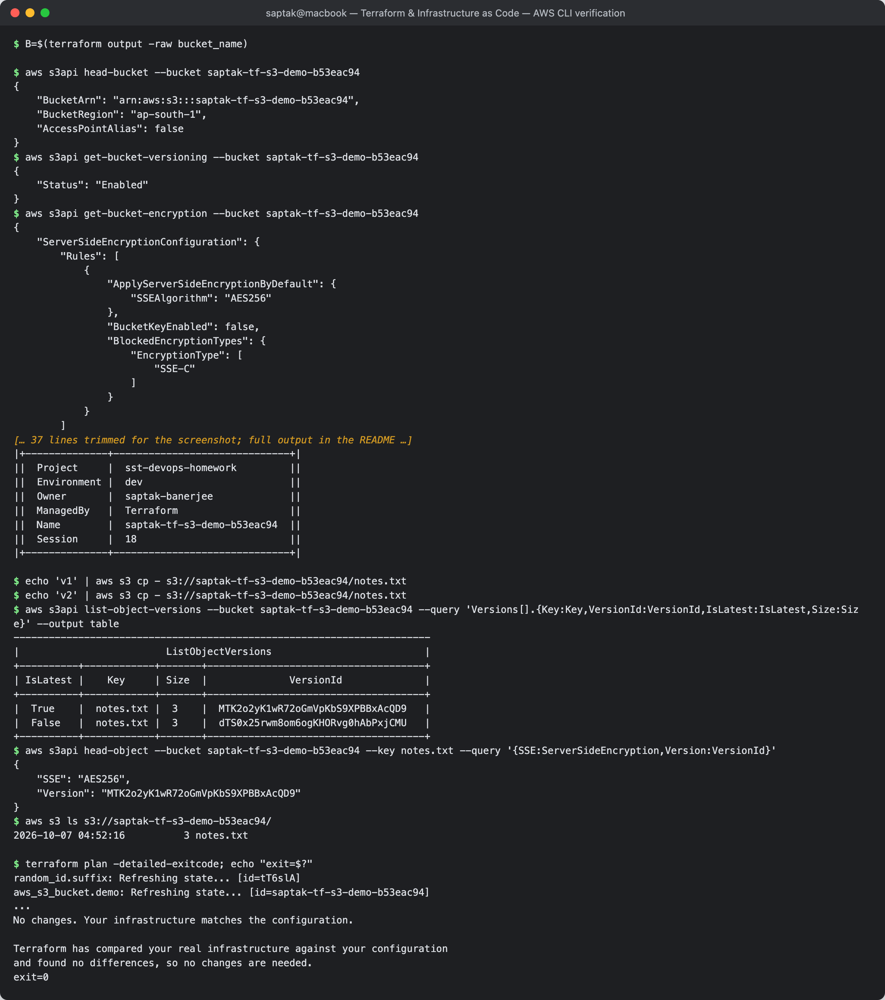
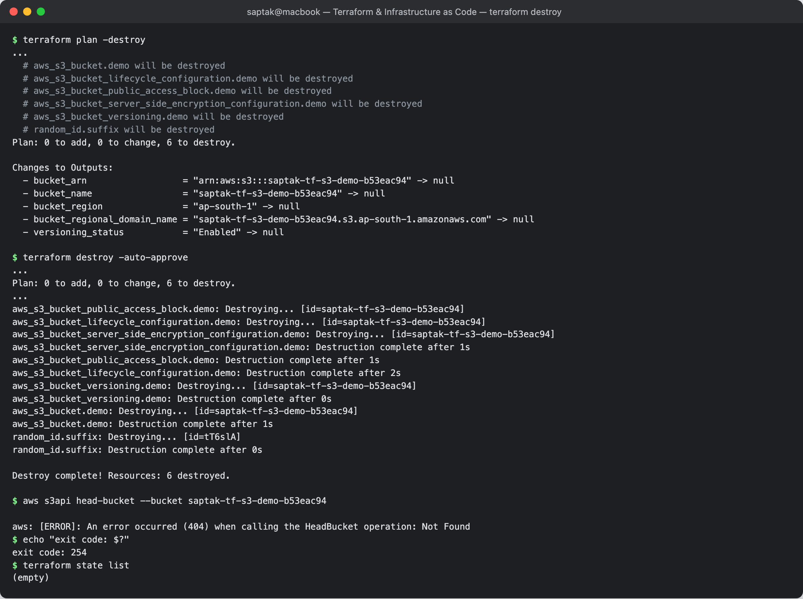

# Terraform S3 Demo

**Author:** Saptak Banerjee
**Course:** SST DevOps & Cloud [SWE]
**Session:** 18 — Terraform & Infrastructure as Code (Task 1)
**Source material:** [`devops-heros/session18-terraform-iac/terraform-s3-demo`](https://github.com/Nency-Ravaliya/devops-heros/tree/main/session18-terraform-iac/terraform-s3-demo)

**Environment:** Terraform **v1.16.4** (darwin_arm64), AWS provider **v6.67.0**, random provider **v3.9.1**, AWS CLI **v2.35.19**, real AWS account, region **ap-south-1** (Mumbai), IAM user `terraform-sandbox`. Every output below is a real capture; the account ID is masked as `<account-id>`.

---

## Table of Contents

| # | Step |
| --- | --- |
| 0 | [Project layout and what each file does](#0-project-layout) |
| 1 | [`terraform init`](#1-terraform-init) |
| 2 | [`terraform fmt`](#2-terraform-fmt) |
| 3 | [`terraform validate`](#3-terraform-validate) |
| 4 | [`terraform plan`](#4-terraform-plan) |
| 5 | [`terraform apply`](#5-terraform-apply) |
| 6 | [`terraform show`](#6-terraform-show) |
| 7 | [`terraform output`](#7-terraform-output-and-state-list) |
| 8 | [Verify with the AWS CLI](#8-verify-with-the-aws-cli) |
| 9 | [`terraform destroy`](#9-terraform-destroy) |

---

## 0. Project layout

```text
terraform-s3-demo/
├── main.tf               # the resources: random suffix, bucket, versioning, SSE, public-access block, lifecycle
├── variables.tf          # input variables (region, name prefix, retention days, tags) + a validation rule
├── outputs.tf            # bucket name / ARN / region / endpoint / versioning status
├── provider.tf           # terraform{} block (version pins) + provider "aws" with default_tags
├── terraform.tfvars      # values for the variables (no secrets)
├── README.md             # this file
├── .gitignore            # ignores .terraform/ and *.tfstate*
└── .terraform.lock.hcl   # provider version + checksum pin, committed on purpose
```

This is exactly the layout the assignment asks for. Compared with the instructor's demo it differs in a few deliberate ways:

| Instructor's demo | This version | Why |
| --- | --- | --- |
| fixed `bucket_name = "yatri1107"` | `"${var.bucket_name_prefix}-${random_id.suffix.hex}"` | S3 bucket names are **global across every AWS account**, so a fixed name collides. The `random` provider adds 8 hex characters, and because that value is stored in state the name stays the same until destroy. |
| `terraform.tf` + `providers.tf` | a single `provider.tf` | the assignment lists `provider.tf` |
| bare bucket | + versioning, SSE-S3, public-access block, lifecycle rule | the AWS provider v4+ splits each bucket setting into its own resource. A sensible bucket is private, encrypted, versioned, and has a rule that expires old versions. |
| tags repeated per resource | `default_tags` in the provider | every resource gets `Project=sst-devops-homework`, `ManagedBy=Terraform` automatically |

**Where are the credentials?** Not in any `.tf` or `.tfvars` file. The AWS provider reads them from the standard credential chain (here: `AWS_ACCESS_KEY_ID`/`AWS_SECRET_ACCESS_KEY` environment variables loaded from a file outside the repo). `terraform.tfvars` only holds the region, name prefix and tags:

```hcl
aws_region         = "ap-south-1"
bucket_name_prefix = "saptak-tf-s3-demo"

noncurrent_version_retention_days = 30

common_tags = {
  Project     = "sst-devops-homework"
  ManagedBy   = "Terraform"
  Environment = "dev"
  Owner       = "saptak-banerjee"
}
```

Pre-flight check of who Terraform will act as:

```
$ aws sts get-caller-identity --query Arn --output text
arn:aws:iam::<account-id>:user/terraform-sandbox
```

---

## 1. `terraform init`

Downloads the providers named in `required_providers`, creates `.terraform/`, and writes `.terraform.lock.hcl`.

```
$ terraform init
Initializing the backend...

Initializing provider plugins...
- Finding hashicorp/aws versions matching "~> 6.0"...
- Finding hashicorp/random versions matching "~> 3.6"...
- Installing hashicorp/aws v6.67.0...
- Installed hashicorp/aws v6.67.0 (signed by HashiCorp)
- Installing hashicorp/random v3.9.1...
- Installed hashicorp/random v3.9.1 (signed by HashiCorp)

Terraform has created a lock file .terraform.lock.hcl to record the provider
selections it made above. Include this file in your version control repository
so that Terraform can guarantee to make the same selections by default when
you run "terraform init" in the future.

Terraform has been successfully initialized!
...
```

`~> 6.0` means "any 6.x" and it resolved to 6.67.0. The lock file records that exact version and its checksums, so the next `init` (on another laptop or in CI) installs the same build. That is why the lock file is committed and only `.terraform/` is git-ignored. No `backend` block means **local state** (`terraform.tfstate` in this folder).

**Screenshot:** 

---

## 2. `terraform fmt`

Rewrites `.tf`/`.tfvars` files into the canonical HCL style (2-space indents, aligned `=`).

```
$ terraform fmt -check -diff
$ terraform fmt
$
```

Both commands printed nothing. `fmt` only prints the names of files it changed, and `-check` exits non-zero when a file needs formatting, so empty output means the files were already canonical. In CI, `terraform fmt -check` is the usual lint gate.

---

## 3. `terraform validate`

Checks syntax, references, and argument types against the provider schemas. It does not call AWS.

```
$ terraform validate
Success! The configuration is valid.
```

Validation would catch things like a typo in `aws_s3_bucket.demo.id` or a `bucket_name_prefix` that breaks the regex rule in `variables.tf`. It cannot catch an invalid or already-taken bucket name, because only AWS knows that.

**Screenshot:** 

---

## 4. `terraform plan`

Refreshes state, compares it with the configuration, and prints the actions it would take. Nothing is created.

```
$ terraform plan

Terraform used the selected providers to generate the following execution
plan. Resource actions are indicated with the following symbols:
  + create

Terraform will perform the following actions:

  # aws_s3_bucket.demo will be created
  + resource "aws_s3_bucket" "demo" {
      + arn                         = (known after apply)
      + bucket                      = (known after apply)
      + force_destroy               = true
      + region                      = "ap-south-1"
      + tags                        = (known after apply)
      + tags_all                    = (known after apply)
      ...
    }

  # aws_s3_bucket_lifecycle_configuration.demo will be created
  + resource "aws_s3_bucket_lifecycle_configuration" "demo" {
      + rule {
          + id     = "expire-noncurrent-versions"
          + status = "Enabled"
          + abort_incomplete_multipart_upload {
              + days_after_initiation = 7
            }
          + noncurrent_version_expiration {
              + noncurrent_days = 30
            }
          ...
    }

  # aws_s3_bucket_public_access_block.demo will be created
  + resource "aws_s3_bucket_public_access_block" "demo" {
      + block_public_acls       = true
      + block_public_policy     = true
      + ignore_public_acls      = true
      + restrict_public_buckets = true
      ...
    }

  # aws_s3_bucket_server_side_encryption_configuration.demo will be created
  ...
              + sse_algorithm     = "AES256"
  ...

  # aws_s3_bucket_versioning.demo will be created
  ...
          + status     = "Enabled"
  ...

  # random_id.suffix will be created
  + resource "random_id" "suffix" {
      + byte_length = 4
      + hex         = (known after apply)
      ...
    }

Plan: 6 to add, 0 to change, 0 to destroy.

Changes to Outputs:
  + bucket_arn                  = (known after apply)
  + bucket_name                 = (known after apply)
  + bucket_region               = "ap-south-1"
  + bucket_regional_domain_name = (known after apply)
  + versioning_status           = "Enabled"

Note: You didn't use the -out option to save this plan, so Terraform can't
guarantee to take exactly these actions if you run "terraform apply" now.
```

What to notice:

- **6 resources, not 1.** The bucket and each of its settings are separate resources, linked by `bucket = aws_s3_bucket.demo.id`.
- **`bucket = (known after apply)`**: the name depends on `random_id.suffix.hex`, which does not exist yet. Even `tags` is unknown because the `Name` tag contains the suffix.
- The closing note matters in team use. A plan that is not saved with `-out` can drift before `apply` runs. In Session 19 I use `plan -out=tfplan` + `apply tfplan` for that reason.

**Screenshot:** 

---

## 5. `terraform apply`

Creates the resources. I used `-auto-approve` to skip the interactive `yes` prompt. The plan it executes is the same one shown above.

```
$ terraform apply -auto-approve
...
Plan: 6 to add, 0 to change, 0 to destroy.
...
random_id.suffix: Creating...
random_id.suffix: Creation complete after 0s [id=tT6slA]
aws_s3_bucket.demo: Creating...
aws_s3_bucket.demo: Creation complete after 4s [id=saptak-tf-s3-demo-b53eac94]
aws_s3_bucket_versioning.demo: Creating...
aws_s3_bucket_public_access_block.demo: Creating...
aws_s3_bucket_server_side_encryption_configuration.demo: Creating...
aws_s3_bucket_public_access_block.demo: Creation complete after 0s [id=saptak-tf-s3-demo-b53eac94]
aws_s3_bucket_server_side_encryption_configuration.demo: Creation complete after 0s [id=saptak-tf-s3-demo-b53eac94]
aws_s3_bucket_versioning.demo: Creation complete after 2s [id=saptak-tf-s3-demo-b53eac94]
aws_s3_bucket_lifecycle_configuration.demo: Creating...
aws_s3_bucket_lifecycle_configuration.demo: Still creating... [00m10s elapsed]
aws_s3_bucket_lifecycle_configuration.demo: Still creating... [00m20s elapsed]
aws_s3_bucket_lifecycle_configuration.demo: Still creating... [00m30s elapsed]
aws_s3_bucket_lifecycle_configuration.demo: Still creating... [00m40s elapsed]
aws_s3_bucket_lifecycle_configuration.demo: Still creating... [00m50s elapsed]
aws_s3_bucket_lifecycle_configuration.demo: Creation complete after 56s [id=saptak-tf-s3-demo-b53eac94]

Apply complete! Resources: 6 added, 0 changed, 0 destroyed.

Outputs:

bucket_arn = "arn:aws:s3:::saptak-tf-s3-demo-b53eac94"
bucket_name = "saptak-tf-s3-demo-b53eac94"
bucket_region = "ap-south-1"
bucket_regional_domain_name = "saptak-tf-s3-demo-b53eac94.s3.ap-south-1.amazonaws.com"
versioning_status = "Enabled"
```

The apply log shows the **dependency graph** at work:

1. `random_id.suffix` comes first because the bucket name references it.
2. The bucket follows.
3. Versioning, SSE and the public-access block run **in parallel**, since each only references the bucket.
4. The lifecycle rule waits for versioning because of the explicit `depends_on = [aws_s3_bucket_versioning.demo]` in `main.tf`. A rule about *noncurrent versions* only makes sense once versioning is on, and nothing in the lifecycle resource references the versioning resource, so Terraform would otherwise run them at the same time.

The lifecycle step took 56 s. S3 lifecycle configuration is eventually consistent, and the AWS provider keeps polling until it can read the rule back before it reports success.

**Screenshot:** 

---

## 6. `terraform show`

Prints the current state in human-readable form, with every attribute AWS returned.

```
$ terraform show
# aws_s3_bucket.demo:
resource "aws_s3_bucket" "demo" {
    arn                         = "arn:aws:s3:::saptak-tf-s3-demo-b53eac94"
    bucket                      = "saptak-tf-s3-demo-b53eac94"
    bucket_domain_name          = "saptak-tf-s3-demo-b53eac94.s3.amazonaws.com"
    bucket_namespace            = "global"
    bucket_region               = "ap-south-1"
    bucket_regional_domain_name = "saptak-tf-s3-demo-b53eac94.s3.ap-south-1.amazonaws.com"
    force_destroy               = true
    hosted_zone_id              = "Z11RGJOFQNVJUP"
    id                          = "saptak-tf-s3-demo-b53eac94"
    object_lock_enabled         = false
    region                      = "ap-south-1"
    request_payer               = "BucketOwner"
    tags                        = {
        "Name"    = "saptak-tf-s3-demo-b53eac94"
        "Session" = "18"
    }
    tags_all                    = {
        "Environment" = "dev"
        "ManagedBy"   = "Terraform"
        "Name"        = "saptak-tf-s3-demo-b53eac94"
        "Owner"       = "saptak-banerjee"
        "Project"     = "sst-devops-homework"
        "Session"     = "18"
    }

    grant {
        id          = "<canonical-user-id>"
        permissions = [
            "FULL_CONTROL",
        ]
        type        = "CanonicalUser"
        uri         = null
    }
    ...
    versioning {
        enabled    = false
        mfa_delete = false
    }
}

# aws_s3_bucket_lifecycle_configuration.demo:
resource "aws_s3_bucket_lifecycle_configuration" "demo" {
    bucket                                 = "saptak-tf-s3-demo-b53eac94"
    ...
        noncurrent_version_expiration {
            noncurrent_days = 30
        }
    ...
}

# aws_s3_bucket_public_access_block.demo:
resource "aws_s3_bucket_public_access_block" "demo" {
    block_public_acls       = true
    block_public_policy     = true
    bucket                  = "saptak-tf-s3-demo-b53eac94"
    ignore_public_acls      = true
    restrict_public_buckets = true
    ...
}

# aws_s3_bucket_server_side_encryption_configuration.demo:
resource "aws_s3_bucket_server_side_encryption_configuration" "demo" {
    ...
    rule {
        blocked_encryption_types = [
            "SSE-C",
        ]
        bucket_key_enabled       = false

        apply_server_side_encryption_by_default {
            kms_master_key_id = null
            sse_algorithm     = "AES256"
        }
    }
}

# aws_s3_bucket_versioning.demo:
resource "aws_s3_bucket_versioning" "demo" {
    ...
    versioning_configuration {
        mfa_delete = "Disabled"
        status     = "Enabled"
    }
}

# random_id.suffix:
resource "random_id" "suffix" {
    b64_std     = "tT6slA=="
    b64_url     = "tT6slA"
    byte_length = 4
    dec         = "3040783508"
    hex         = "b53eac94"
    id          = "tT6slA"
}

Outputs:

bucket_arn = "arn:aws:s3:::saptak-tf-s3-demo-b53eac94"
...
```

Observations:

- **`tags` vs `tags_all`**: `tags` is what `main.tf` sets. `tags_all` is that merged with the provider's `default_tags`, and it is what AWS actually stores.
- **`versioning { enabled = false }` on the bucket resource is stale, not wrong.** The bucket was read *before* the separate `aws_s3_bucket_versioning` resource turned versioning on, and that legacy read-only block is only refreshed on the next plan. The source of truth is `aws_s3_bucket_versioning.demo` (`status = "Enabled"`) and the API (step 8).
- `random_id` is stored in four encodings. `tT6slA` (base64) and `b53eac94` (hex) are the same 4 bytes, so the bucket name is reproducible from state.
- `blocked_encryption_types = ["SSE-C"]` was not set by me. AWS now blocks customer-provided-key encryption (SSE-C) on new buckets by default, and the provider reports it.

**Screenshot:** 

---

## 7. `terraform output` and state list

```
$ terraform output
bucket_arn = "arn:aws:s3:::saptak-tf-s3-demo-b53eac94"
bucket_name = "saptak-tf-s3-demo-b53eac94"
bucket_region = "ap-south-1"
bucket_regional_domain_name = "saptak-tf-s3-demo-b53eac94.s3.ap-south-1.amazonaws.com"
versioning_status = "Enabled"

$ terraform output -raw bucket_name
saptak-tf-s3-demo-b53eac94

$ terraform state list
aws_s3_bucket.demo
aws_s3_bucket_lifecycle_configuration.demo
aws_s3_bucket_public_access_block.demo
aws_s3_bucket_server_side_encryption_configuration.demo
aws_s3_bucket_versioning.demo
random_id.suffix
```

`-raw` drops the quotes, so scripts can use the value directly. The verification commands below do `B=$(terraform output -raw bucket_name)`.

**Screenshot:** 

---

## 8. Verify with the AWS CLI

This checks the result through the AWS API directly instead of trusting Terraform's own state.

```
$ B=$(terraform output -raw bucket_name)

$ aws s3api head-bucket --bucket saptak-tf-s3-demo-b53eac94
{
    "BucketArn": "arn:aws:s3:::saptak-tf-s3-demo-b53eac94",
    "BucketRegion": "ap-south-1",
    "AccessPointAlias": false
}
$ aws s3api get-bucket-versioning --bucket saptak-tf-s3-demo-b53eac94
{
    "Status": "Enabled"
}
$ aws s3api get-bucket-encryption --bucket saptak-tf-s3-demo-b53eac94
{
    "ServerSideEncryptionConfiguration": {
        "Rules": [
            {
                "ApplyServerSideEncryptionByDefault": {
                    "SSEAlgorithm": "AES256"
                },
                "BucketKeyEnabled": false,
                "BlockedEncryptionTypes": {
                    "EncryptionType": [
                        "SSE-C"
                    ]
                }
            }
        ]
    }
}
$ aws s3api get-public-access-block --bucket saptak-tf-s3-demo-b53eac94
{
    "PublicAccessBlockConfiguration": {
        "BlockPublicAcls": true,
        "IgnorePublicAcls": true,
        "BlockPublicPolicy": true,
        "RestrictPublicBuckets": true
    }
}
$ aws s3api get-bucket-lifecycle-configuration --bucket saptak-tf-s3-demo-b53eac94
{
    "TransitionDefaultMinimumObjectSize": "all_storage_classes_128K",
    "Rules": [
        {
            "ID": "expire-noncurrent-versions",
            "Filter": {
                "Prefix": ""
            },
            "Status": "Enabled",
            "NoncurrentVersionExpiration": {
                "NoncurrentDays": 30
            },
            "AbortIncompleteMultipartUpload": {
                "DaysAfterInitiation": 7
            }
        }
    ]
}
$ aws s3api get-bucket-tagging --bucket saptak-tf-s3-demo-b53eac94 --output table
-------------------------------------------------
|               GetBucketTagging                |
+-----------------------------------------------+
||                   TagSet                    ||
|+--------------+------------------------------+|
||      Key     |            Value             ||
|+--------------+------------------------------+|
||  Project     |  sst-devops-homework         ||
||  Environment |  dev                         ||
||  Owner       |  saptak-banerjee             ||
||  ManagedBy   |  Terraform                   ||
||  Name        |  saptak-tf-s3-demo-b53eac94  ||
||  Session     |  18                          ||
|+--------------+------------------------------+|
```

All five settings match the configuration, and the provider's `default_tags` are on the bucket.

### Versioning in action

I wrote the same key twice, then listed its versions:

```
$ echo 'v1' | aws s3 cp - s3://saptak-tf-s3-demo-b53eac94/notes.txt
$ echo 'v2' | aws s3 cp - s3://saptak-tf-s3-demo-b53eac94/notes.txt
$ aws s3api list-object-versions --bucket saptak-tf-s3-demo-b53eac94 --query 'Versions[].{Key:Key,VersionId:VersionId,IsLatest:IsLatest,Size:Size}' --output table
-----------------------------------------------------------------------
|                         ListObjectVersions                          |
+----------+------------+-------+-------------------------------------+
| IsLatest |    Key     | Size  |              VersionId              |
+----------+------------+-------+-------------------------------------+
|  True    |  notes.txt |  3    |  MTK2o2yK1wR72oGmVpKbS9XPBBxAcQD9   |
|  False   |  notes.txt |  3    |  dTS0x25rwm8om6ogKHORvg0hAbPxjCMU   |
+----------+------------+-------+-------------------------------------+
$ aws s3api head-object --bucket saptak-tf-s3-demo-b53eac94 --key notes.txt --query '{SSE:ServerSideEncryption,Version:VersionId}'
{
    "SSE": "AES256",
    "Version": "MTK2o2yK1wR72oGmVpKbS9XPBBxAcQD9"
}
$ aws s3 ls s3://saptak-tf-s3-demo-b53eac94/
2026-10-07 04:52:16          3 notes.txt
```

The overwrite did not destroy `v1`. It became a noncurrent version, which the lifecycle rule will expire after 30 days. `aws s3 ls` shows one object even though S3 stores (and bills for) two versions. The new object was encrypted with AES256 without the upload asking for it, because the bucket's default encryption applied.

### Drift check

```
$ terraform plan -detailed-exitcode; echo "exit=$?"
random_id.suffix: Refreshing state... [id=tT6slA]
aws_s3_bucket.demo: Refreshing state... [id=saptak-tf-s3-demo-b53eac94]
...
No changes. Your infrastructure matches the configuration.

Terraform has compared your real infrastructure against your configuration
and found no differences, so no changes are needed.
exit=0
```

Exit code 0 means no changes (2 would mean changes pending, 1 an error), so this is usable as a drift alarm in CI. The objects I uploaded do not count as drift, because Terraform only tracks the resources it declares.

**Screenshot:** 

---

## 9. `terraform destroy`

Preview first, then destroy:

```
$ terraform plan -destroy
...
  # aws_s3_bucket.demo will be destroyed
  # aws_s3_bucket_lifecycle_configuration.demo will be destroyed
  # aws_s3_bucket_public_access_block.demo will be destroyed
  # aws_s3_bucket_server_side_encryption_configuration.demo will be destroyed
  # aws_s3_bucket_versioning.demo will be destroyed
  # random_id.suffix will be destroyed
Plan: 0 to add, 0 to change, 6 to destroy.

Changes to Outputs:
  - bucket_arn                  = "arn:aws:s3:::saptak-tf-s3-demo-b53eac94" -> null
  - bucket_name                 = "saptak-tf-s3-demo-b53eac94" -> null
  - bucket_region               = "ap-south-1" -> null
  - bucket_regional_domain_name = "saptak-tf-s3-demo-b53eac94.s3.ap-south-1.amazonaws.com" -> null
  - versioning_status           = "Enabled" -> null

$ terraform destroy -auto-approve
...
Plan: 0 to add, 0 to change, 6 to destroy.
...
aws_s3_bucket_public_access_block.demo: Destroying... [id=saptak-tf-s3-demo-b53eac94]
aws_s3_bucket_lifecycle_configuration.demo: Destroying... [id=saptak-tf-s3-demo-b53eac94]
aws_s3_bucket_server_side_encryption_configuration.demo: Destroying... [id=saptak-tf-s3-demo-b53eac94]
aws_s3_bucket_server_side_encryption_configuration.demo: Destruction complete after 1s
aws_s3_bucket_public_access_block.demo: Destruction complete after 1s
aws_s3_bucket_lifecycle_configuration.demo: Destruction complete after 2s
aws_s3_bucket_versioning.demo: Destroying... [id=saptak-tf-s3-demo-b53eac94]
aws_s3_bucket_versioning.demo: Destruction complete after 0s
aws_s3_bucket.demo: Destroying... [id=saptak-tf-s3-demo-b53eac94]
aws_s3_bucket.demo: Destruction complete after 1s
random_id.suffix: Destroying... [id=tT6slA]
random_id.suffix: Destruction complete after 0s

Destroy complete! Resources: 6 destroyed.
```

Destroy walks the same graph **in reverse**. The settings go first, versioning waits for the lifecycle rule (the `depends_on` reversed), then the bucket, and the random suffix goes last.

The bucket still held **two object versions** of `notes.txt`. S3 refuses to delete a non-empty bucket. `force_destroy = true` makes the provider delete every version and delete-marker first, which is why this finished in 1 s with no error. That is convenient for a demo. On a bucket with real data, `force_destroy` would make a mistaken destroy permanent.

Proof it is gone:

```
$ aws s3api head-bucket --bucket saptak-tf-s3-demo-b53eac94

aws: [ERROR]: An error occurred (404) when calling the HeadBucket operation: Not Found
$ echo "exit code: $?"
exit code: 254
$ terraform state list
(empty)
```

**Screenshot:** 

---

## Workflow summary

```text
 write .tf  ──►  init  ──►  fmt  ──►  validate  ──►  plan  ──►  apply  ──►  show / output
                (providers,  (style)   (schema,       (diff vs   (call AWS,    (read state)
                 lock file)             no AWS call)   state)     write state)
                                                                     │
                                                       aws s3api ◄───┘ (independent check)
                                                                     │
                                                         plan -destroy ──► destroy
```

| Command | Talks to AWS? | Changes AWS? | Changes state? |
| --- | --- | --- | --- |
| `init` | no (registry only) | no | no |
| `fmt` / `validate` | no | no | no |
| `plan` | yes (refresh) | no | no (in-memory refresh) |
| `apply` / `destroy` | yes | **yes** | **yes** |
| `show` / `output` / `state list` | no | no | no (read-only) |
