# ClinicDesk — Final DevOps Project

**Author:** Saptak Banerjee
**Course:** SST DevOps & Cloud [SWE]
**Session:** 21 — Final DevOps Project & Troubleshooting
**Source material:** [`devops-heros/session21-python`](https://github.com/Nency-Ravaliya/devops-heros/tree/main/session21-python) (TaskBoard reference: architecture only, the application is my own)

**Environment:** local: macOS (Apple silicon), Docker Desktop 29.6, Python 3.14, Node 25, Helm 4.3, Terraform 1.16 / AWS provider 6.67. Cloud: a real AWS EKS 1.36 cluster in `ap-south-1` built by this repo's Terraform, alive for about 70 minutes (apply started 00:00:36, destroy finished 01:11:07 UTC on 7 Oct 2026), then destroyed. CI: GitHub Actions on `ubuntu-24.04`. Every output block below is a real capture; the AWS account ID is masked as `<account-id>`.

**Pipeline runs (all green):** [first run, e664e8a](https://github.com/Saptak-cyber/DevOps_Assignments/actions/runs/37550442829) · [sync fix, 1c0ef7b](https://github.com/Saptak-cyber/DevOps_Assignments/actions/runs/37552034444) · [live GitOps demo, dbbdd49](https://github.com/Saptak-cyber/DevOps_Assignments/actions/runs/37552961415)

---

## Table of Contents

| # | Section | What it shows |
| --- | --- | --- |
| 1 | [Project overview](#1-project-overview) | the app, its API, how it differs from TaskBoard, repo layout |
| 2 | [Architecture diagram](#2-architecture-diagram) | developer → CI → GHCR → GitOps → EKS, request path |
| 3 | [Technologies used](#3-technologies-used) | pinned versions |
| 4 | [Application setup](#4-application-setup) | pytest (23 passed), frontend build, screenshots |
| 5 | [Docker setup](#5-docker-setup) | multi-stage non-root images, `docker compose up --build`, CRUD with curl |
| 6 | [Kubernetes deployment](#6-kubernetes-deployment) | manifests, the app on EKS (pods/svc/ingress/PVC on EBS), HPA scaling under load |
| 7 | [Helm deployment](#7-helm-deployment) | chart, lint/template, install in CI (kind) and on EKS |
| 8 | [Terraform infrastructure](#8-terraform-infrastructure) | plan, apply (61 resources), the cluster, destroy, AWS clean-up check |
| 9 | [CI/CD pipeline](#9-cicd-pipeline) | 10-stage GitHub Actions pipeline, GHCR images tagged with the commit SHA |
| 10 | [DevSecOps implementation](#10-devsecops-implementation) | SAST, SCA, IaC, secret and image scanning, policy gate |
| 11 | [Monitoring](#11-monitoring) | Prometheus target UP, alert rules, Grafana dashboard with live data, logs |
| 12 | [GitOps](#12-gitops) | Argo CD, live commit → pipeline → rollout with SHAs before/after, self-heal |
| 13 | [Troubleshooting](#13-troubleshooting) | seven issues on the live cluster: identify, investigate, root cause, fix, verify |
| 14 | [Screenshots](#14-screenshots) | |
| 15 | [Lessons learned](#15-lessons-learned) | |
| | [Cleanup](#cleanup) | teardown order and proof that AWS is empty |

---

## 1. Project overview

**ClinicDesk** is the front-desk system for a small multi-specialty clinic. A receptionist sees the whole day on one board, one column per doctor, and can book, check in, reschedule and cancel patients from it.

What it does:

- **Day board** — every doctor's appointments laid out on a time grid; colour shows the visit state (expected, waiting, seen, did not arrive, cancelled). Clicking a free space in a doctor's column opens the booking form for that slot.
- **Booking** — book a new walk-in patient (name + phone) or a returning patient (search by name/phone). The API refuses to double-book a doctor and says exactly which slot clashes.
- **Visit flow** — check in, mark as seen, mark did-not-arrive, undo, add front-desk notes, reschedule, cancel (cancelling frees the slot; a cancelled record is locked).
- **Daily stats** — totals per state, per-doctor load (count and minutes booked), visits booked over the next 7 days.

### REST API

| Method | Path | Purpose |
| --- | --- | --- |
| GET | `/health` | Liveness: process is up (never touches the DB) |
| GET | `/ready` | Readiness: DB reachable and migrated, else `503` |
| GET | `/metrics` | Prometheus metrics (request count, latency histogram) |
| GET | `/docs` | Swagger UI |
| GET / POST | `/api/doctors` | List active doctors / add a doctor |
| GET | `/api/doctors/{id}` | One doctor |
| GET / POST | `/api/patients` | Search patients (`?q=`) / register a patient (phone is unique) |
| GET | `/api/appointments` | List, filter by `on=YYYY-MM-DD`, `doctor_id`, `status` |
| POST | `/api/appointments` | Book (with `patient_id` or an inline new `patient`) — `409` on a clash |
| GET / PUT / DELETE | `/api/appointments/{id}` | Read / reschedule, change status, notes / delete |
| POST | `/api/appointments/{id}/cancel` | Cancel and free the slot |
| GET | `/api/stats?on=` | Day summary and per-doctor load |

### What is different from the TaskBoard reference

GRADING.md requires the application domain to be your own. ClinicDesk shares only the DevOps shape (FastAPI + PostgreSQL + React behind nginx, Helm, Terraform, EKS). The app itself is new: three related tables instead of one, booking rules (overlap detection, inactive doctors, cancel locking), a timezone-aware stats endpoint, and a time-grid UI instead of a task table. The platform layer also goes further than the reference: Alpine runtime images with zero HIGH/CRITICAL CVEs, read-only root filesystems, a `restricted` Pod Security namespace, a startup/readiness/liveness probe split, migrations serialised with a PostgreSQL advisory lock, Secret-based DB credentials, a StatefulSet + PVC for PostgreSQL, and EBS CSI + metrics-server add-ons in Terraform so the PVC and HPA actually work on EKS.

### Repository layout

```text
final-devops-project/
├── application/
│   ├── backend/              FastAPI app, Alembic migrations, pytest suite, Dockerfile
│   │   ├── app/              config, db, models, schemas, routers/{doctors,patients,appointments}.py
│   │   ├── alembic/versions/ 0001_clinic_schema.py, 0002_seed_doctors.py
│   │   ├── tests/            conftest.py + 23 tests (SQLite in memory)
│   │   ├── Dockerfile        multi-stage, python:3.14-alpine, uid 10001
│   │   └── docker-entrypoint.sh  migrate (with retries), then exec uvicorn
│   ├── frontend/             React 19 + Vite 8 app, nginx template, Dockerfile (node build -> nginx-unprivileged)
│   └── scripts/              seed-demo.sh (books a demo day via the API), load-test.sh (HPA load)
├── docker/                   docker-compose.yml (+ .env.example)
├── kubernetes/               namespace, ConfigMap, Secret template, Postgres StatefulSet+PVC, Deployments, Services, Ingress, HPA, kustomization
│   └── addons/ingress-nginx-values.yaml   NLB-backed ingress controller for EKS
├── helm/clinicdesk/          chart with values.yaml, values-dev.yaml, values-prod.yaml
├── terraform/                VPC + EKS (+ EBS CSI pod identity), outputs, tfvars example
├── security/                 gate-policy.toml, security_gate.py, bandit.yml, gitleaks.toml, trivy-config.yaml, trivyignore.yaml
├── monitoring/               kube-prometheus-stack values, Grafana dashboard ConfigMap
├── gitops/                   values-eks.yaml (image tags bumped by CI) + argocd/ (Application, Argo CD values)
├── .github/workflows/        copy of the pipeline (the one that runs is at the repo root)
├── screenshots/
└── README.md
```

---

## 2. Architecture diagram

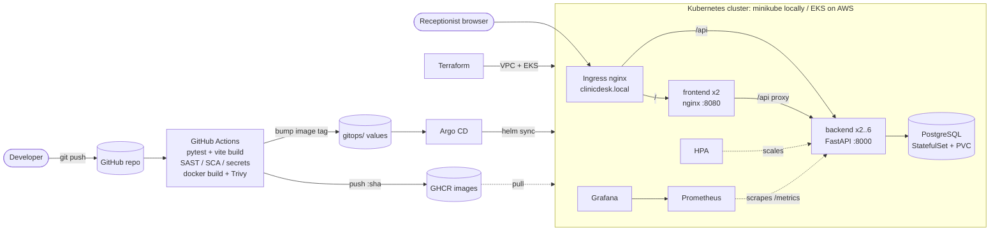
```mermaid
flowchart LR
  dev([Developer]) -->|git push| gh[(GitHub repo)]
  gh --> ci[GitHub Actions<br/>pytest + vite build<br/>SAST / SCA / secrets<br/>docker build + Trivy]
  ci -->|push :sha| ghcr[(GHCR images)]
  ci -->|bump image tag| gitops[(gitops/ values)]
  gitops --> argo[Argo CD]
  tf[Terraform] -->|VPC + EKS| eks
  subgraph eks [Kubernetes cluster: minikube locally / EKS on AWS]
    direction LR
    ing[Ingress nginx<br/>clinicdesk.local] -->|/| fe[frontend x2<br/>nginx :8080]
    ing -->|/api| be[backend x2..6<br/>FastAPI :8000]
    fe -->|/api proxy| be
    be --> pg[(PostgreSQL<br/>StatefulSet + PVC)]
    hpa[HPA] -.scales.-> be
    prom[Prometheus] -.scrapes /metrics.-> be
    graf[Grafana] --> prom
  end
  argo -->|helm sync| eks
  ghcr -.pull.-> eks
  user([Receptionist browser]) --> ing
```

Request path: the browser only ever talks to one origin. In Docker Compose, nginx in the frontend container proxies `/api/*` to `backend:8000`; in Kubernetes the Ingress sends `/api` straight to the backend Service and everything else to the frontend Service. The backend reads non-secret settings from a ConfigMap and DB credentials from a Secret, and runs `alembic upgrade head` on start-up before serving.

---

## 3. Technologies used

| Layer | Technology | Version (pinned) |
| --- | --- | --- |
| Frontend | React, Vite, `@vitejs/plugin-react`, Atkinson Hyperlegible Next (self-hosted font) | 19.3.0, 8.3.3, 6.1.2, 5.3.0 |
| Frontend runtime | `nginxinc/nginx-unprivileged` (non-root, port 8080) | 1.30-alpine-slim (nginx 1.30.5) |
| Backend | FastAPI, Uvicorn, Pydantic, pydantic-settings | 0.142.2, 0.54.0, 2.13.5, 2.15.0 |
| Data | SQLAlchemy, Alembic, psycopg 3, PostgreSQL | 2.1.3, 1.20.0, 3.3.6, 18 (alpine) |
| Metrics | prometheus-fastapi-instrumentator | 8.1.0 |
| Tests | pytest, httpx2 (Starlette TestClient transport) | 9.1.1, 2.13.1 |
| Containers | Docker, Docker Compose, BuildKit multi-stage | Docker 29.6.1 |
| Orchestration | Kubernetes manifests + Kustomize, Helm 3/4 chart (`apiVersion: v2`) | Helm 4.3.0 |
| IaC | Terraform, `terraform-aws-modules/vpc`, `/eks`, `/eks-pod-identity`, AWS provider | 1.16.4, 6.7.3, 21.26.0, 2.9.0, 6.67.0 |
| Cloud | AWS VPC, NAT gateway, EKS 1.36 (AL2023 nodes, t3.medium), EBS CSI, metrics-server | `ap-south-1` |
| Security | Trivy, pip-audit, npm audit, kubeconform, gitleaks | 0.75.0, 2.10.1, npm 11.8, 0.8.0, 8.30.1 |
| CI/CD | GitHub Actions, GHCR, kind (`helm/kind-action`), Bandit, Semgrep | Bandit 1.9.4, Semgrep 1.179.0 |
| Cluster add-ons | ingress-nginx (AWS NLB), kube-prometheus-stack (Prometheus + Grafana), Argo CD | charts 4.15.1, 92.0.0, 10.9.6 (Argo CD v3.5.3) |

---

## 4. Application setup

### 4.1 Backend: run the tests

The suite has 23 tests over 4 files and covers every endpoint group (meta, doctors, patients, appointments, stats). `tests/conftest.py` gives each test a fresh **in-memory SQLite** database through FastAPI's `dependency_overrides`, so tests never touch PostgreSQL. `pytest.ini` sets `pythonpath`, `testpaths`, strict markers, and turns any `DeprecationWarning` raised from `app.*` into an error.

```bash
cd application/backend
python3 -m venv .venv && source .venv/bin/activate
pip install -r requirements-dev.txt
pytest -v
```

```
$ python --version
Python 3.14.3

$ pytest -v --color=no -p no:cacheprovider
============================= test session starts ==============================
platform darwin -- Python 3.14.3, pytest-9.1.1, pluggy-1.6.0 -- <venv>/bin/python3.14
rootdir: /Users/saptakbanerjee/myDocuments/3rd_Year/DevOps/DevOps_Assignments/final-devops-project/application/backend
configfile: pytest.ini
testpaths: tests
plugins: platformdirs-4.12.3, anyio-4.15.1
collecting ... collected 23 items

tests/test_appointments.py::test_book_appointment_registers_walk_in_patient PASSED [  4%]
tests/test_appointments.py::test_book_with_existing_patient_id PASSED    [  8%]
tests/test_appointments.py::test_booking_requires_exactly_one_patient_reference PASSED [ 13%]
tests/test_appointments.py::test_unknown_or_inactive_doctor_cannot_be_booked PASSED [ 17%]
tests/test_appointments.py::test_double_booking_same_doctor_is_rejected PASSED [ 21%]
tests/test_appointments.py::test_back_to_back_slots_are_allowed PASSED   [ 26%]
tests/test_appointments.py::test_update_status_and_reschedule PASSED     [ 30%]
tests/test_appointments.py::test_reschedule_into_taken_slot_is_rejected PASSED [ 34%]
tests/test_appointments.py::test_cancel_frees_the_slot_and_locks_the_record PASSED [ 39%]
tests/test_appointments.py::test_list_filters_by_date_and_status PASSED  [ 43%]
tests/test_appointments.py::test_delete_appointment PASSED               [ 47%]
tests/test_appointments.py::test_duration_bounds_are_enforced PASSED     [ 52%]
tests/test_doctors_patients.py::test_list_doctors_hides_inactive_by_default PASSED [ 56%]
tests/test_doctors_patients.py::test_create_and_fetch_doctor PASSED      [ 60%]
tests/test_doctors_patients.py::test_create_patient_and_reject_duplicate_phone PASSED [ 65%]
tests/test_doctors_patients.py::test_patient_phone_is_validated PASSED   [ 69%]
tests/test_meta.py::test_root_describes_service PASSED                   [ 73%]
tests/test_meta.py::test_health_is_up PASSED                             [ 78%]
tests/test_meta.py::test_ready_checks_database PASSED                    [ 82%]
tests/test_meta.py::test_metrics_exposes_prometheus_format PASSED        [ 86%]
tests/test_meta.py::test_openapi_lists_core_routes PASSED                [ 91%]
tests/test_stats.py::test_stats_summarise_one_day PASSED                 [ 95%]
tests/test_stats.py::test_stats_default_to_today PASSED                  [100%]
```

What the tests pin down, beyond happy-path CRUD: overlapping bookings for the same doctor return `409` while back-to-back slots are fine; rescheduling into a taken slot is refused; cancelling frees the slot and locks the record; inactive doctors cannot be booked; durations outside 10–120 minutes and bad phone numbers are `422`; `/ready` really queries the DB; `/metrics` emits `http_requests_total` per handler; the stats endpoint does not count a cancelled visit as doctor load.

**Screenshot:** 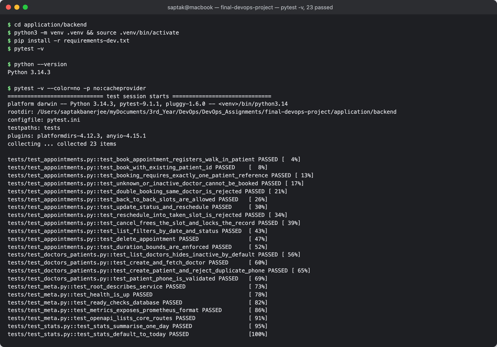

### 4.2 Backend: run against PostgreSQL directly

```bash
export DATABASE_URL='postgresql+psycopg://clinicdesk:<password>@localhost:5432/clinicdesk'
alembic upgrade head          # 0001 creates the 3 tables, 0002 seeds the doctor roster
uvicorn app.main:app --reload --port 8000     # Swagger: http://localhost:8000/docs
```

Instead of one `DATABASE_URL`, the container images take `DB_HOST`, `DB_PORT`, `DB_NAME` (ConfigMap) and `DB_USER`, `DB_PASSWORD` (Secret) and build the URL themselves (`app/config.py`), so the password never has to live inside a connection string in a ConfigMap.

Design decisions worth knowing:

- **Appointment times are clinic wall-clock values** (`2026-10-07T16:00`, no offset), which is how a front desk thinks; offset-aware input is normalised to UTC first. "Today" for `/api/stats` is computed in `CLINIC_TIMEZONE` (default `Asia/Kolkata`), so a pod running in UTC still rolls over at local midnight.
- **Migrations on start-up are safe with many replicas**: `alembic/env.py` takes `pg_advisory_xact_lock` before migrating, so two backend pods starting together cannot race on DDL. The entrypoint retries for up to 60 s while PostgreSQL comes up.
- **Liveness vs readiness**: `/health` is a pure process check; `/ready` runs `SELECT 1 FROM doctors` and returns `503` on failure, so a DB outage pulls pods out of the Service instead of restarting them in a loop.

### 4.3 Frontend: install and build

```
$ node --version
v25.6.0

$ npm ci --no-audit --no-fund

added 21 packages in 561ms

$ npm run build

> clinicdesk-frontend@1.0.0 build
> vite build

vite v8.3.3 building client environment for production...
transforming...
✓ 23 modules transformed.
rendering chunks...
computing gzip size...
dist/index.html                                                                0.60 kB │ gzip:  0.35 kB
dist/assets/atkinson-hyperlegible-next-latin-ext-wght-normal-C6vrW8VD.woff2   19.09 kB
dist/assets/atkinson-hyperlegible-next-latin-wght-normal-BcXVPD7q.woff2       33.99 kB
dist/assets/index-DPXIatko.css                                                11.41 kB │ gzip:  3.44 kB
dist/assets/index-BQfMdHMb.js                                                236.86 kB │ gzip: 74.12 kB
```

Dependencies are pinned exactly and installed from `package-lock.json` with `npm ci`. The bundle has no third-party runtime requests (the font is bundled), which is what lets nginx send a strict `Content-Security-Policy`. In development `npm run dev` proxies `/api` to `localhost:8000` (see `vite.config.js`).

### 4.4 The running app

The board for 7 October after seeding a demo day (section 5.4), with a few visits moved through check-in, seen and did-not-arrive. The selected appointment's details and actions are on the right:

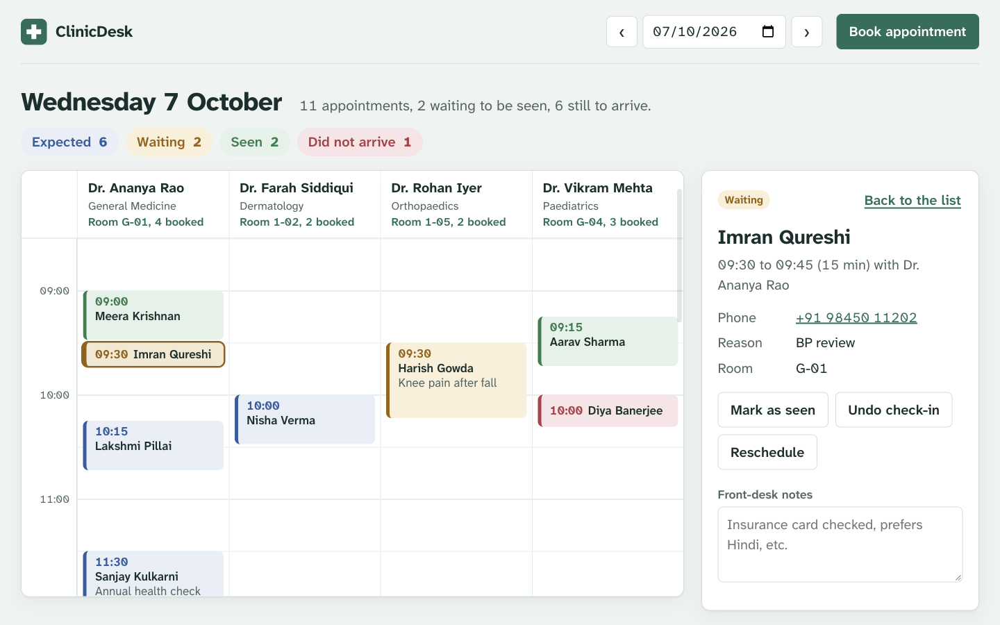

Booking a slot that clashes: the form shows the API's `409` message verbatim, naming the clashing slot. Changing the start to 13:00 then booked it successfully.

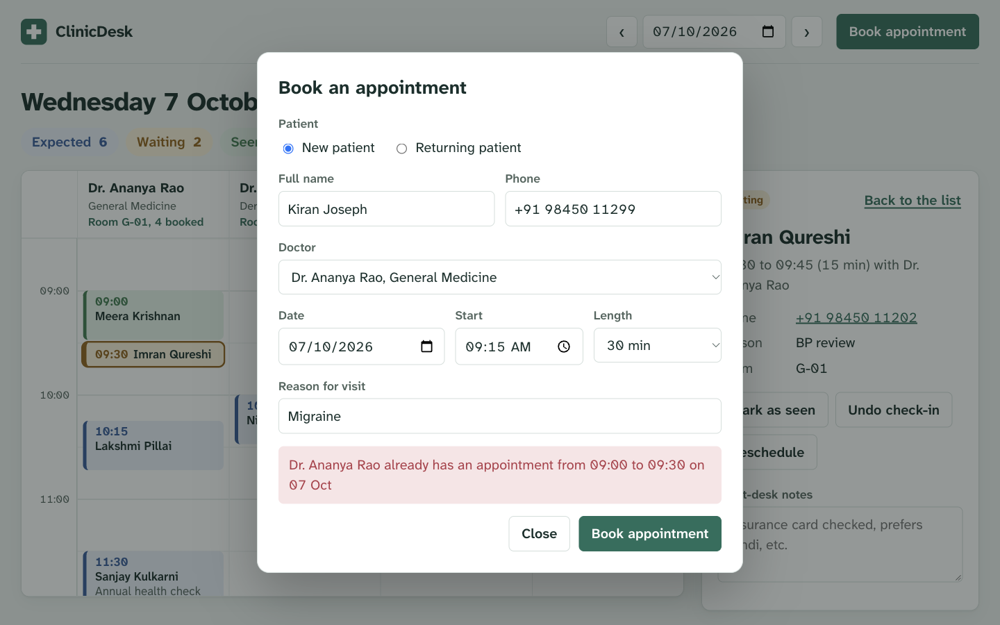

Phone width (390 px): the header wraps, the board scrolls sideways inside its own frame and the page itself never scrolls horizontally. Swagger UI is served by the backend at `/docs`.

| Mobile | Swagger UI |
| --- | --- |
| 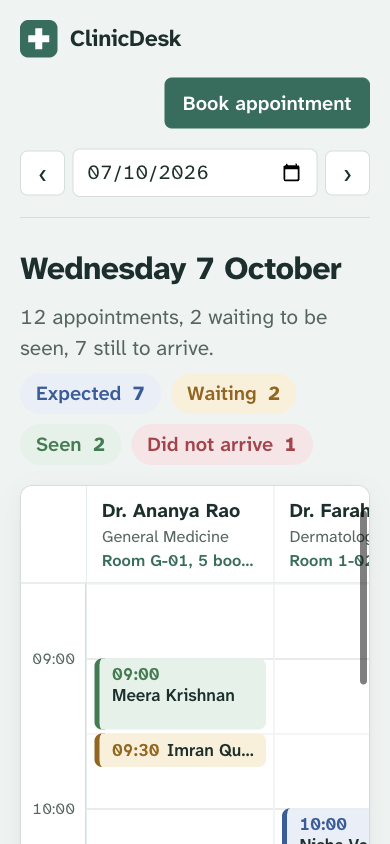 | 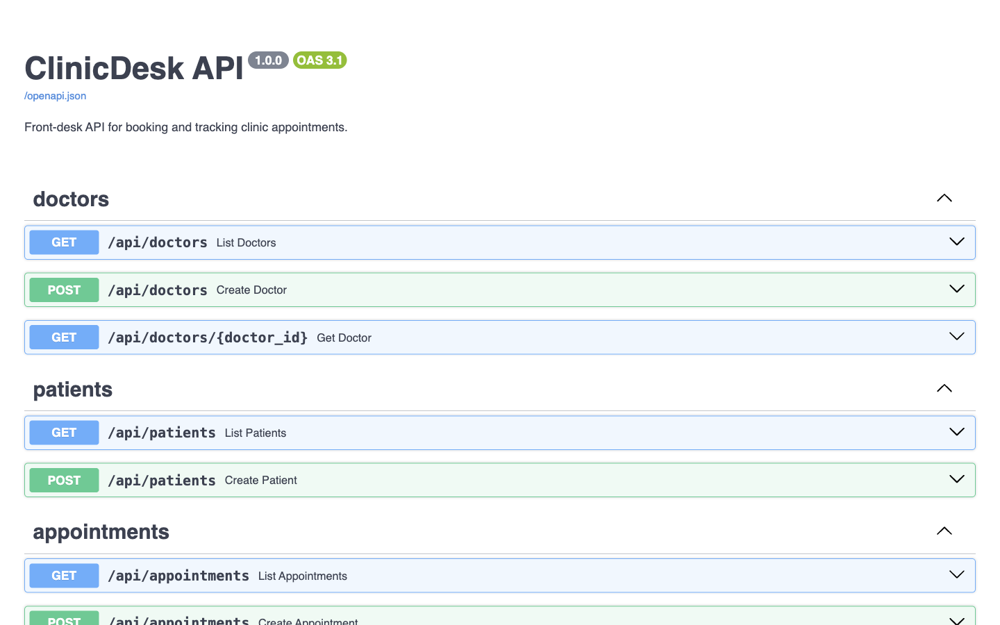 |

---

## 5. Docker setup

### 5.1 Images

| Image | Dockerfile | Base images | User | Size |
| --- | --- | --- | --- | --- |
| `clinicdesk-backend` | [`application/backend/Dockerfile`](./application/backend/Dockerfile) | `python:3.14-alpine` (build: venv + wheels, runtime: venv copied in, pip removed) | `10001:10001` | 212 MB |
| `clinicdesk-frontend` | [`application/frontend/Dockerfile`](./application/frontend/Dockerfile) | `node:24-alpine` build stage, `nginxinc/nginx-unprivileged:1.30-alpine-slim` runtime | `101` (nginx) | 30.5 MB |

Notes:

- Backend: two stages so compilers/pip caches never reach the runtime image; `pip`, `setuptools` and `wheel` are uninstalled from the runtime; app files are owned by root and the process runs as uid 10001, so the app cannot modify its own code. A `HEALTHCHECK` hits `/health` with the Python stdlib (no curl in the image).
- Frontend: Node only exists in the build stage. The runtime is the official *unprivileged* nginx (listens on 8080, no root). The nginx config is a template rendered at start by the image's `envsubst` hook, so the same image proxies to `backend:8000` in Compose and to `clinicdesk-backend:8000` in Kubernetes via `BACKEND_UPSTREAM`. It adds `nosniff`, `X-Frame-Options: DENY` and a CSP, caches hashed `/assets/` for a year and exposes `/healthz` for probes.
- [`docker/docker-compose.yml`](./docker/docker-compose.yml) builds both images from `../application/...`, waits on health checks (`postgres` healthy → `backend` healthy → `frontend`), does not publish PostgreSQL to the host, sets memory limits (256/256/64 MB, Docker shares 8 GB with minikube), and runs the backend with `read_only: true`, `cap_drop: [ALL]` and `no-new-privileges`. The DB password defaults to a local-only value and can be overridden from `docker/.env` (see `.env.example`).

### 5.2 `docker compose up --build`

```bash
cd docker
docker compose up --build -d
```

```
$ docker compose up --build -d
...
#12 [frontend runtime 1/3] FROM docker.io/nginxinc/nginx-unprivileged:1.30-alpine-slim@sha256:3af0c10d960cc2502427fe1219c52989d309e7d65596869c60a34fd2fa2406f0
#14 [frontend build 1/8] FROM docker.io/library/node:24-alpine@sha256:ebfe2f90462722a7a4de65e91990e97fe0d401c70e0e762c5b53302f905ec1c1
#15 [backend build 1/4] FROM docker.io/library/python:3.14-alpine@sha256:f6a589d43c42b9e7f7dc67a12d37132491f362859a5d750607710cc56da3bc72
#16 [backend runtime 3/7] WORKDIR /app
#17 [backend runtime 6/7] COPY --chown=root:root alembic ./alembic
#18 [backend build 2/4] RUN python -m venv /opt/venv
#19 [backend runtime 5/7] COPY --chown=root:root alembic.ini docker-entrypoint.sh ./
#20 [backend runtime 2/7] RUN pip uninstall -y pip setuptools wheel 2>/dev/null;     addgroup -g 10001 -S app &&     adduser -u 10001 -G app -S -D -H -s /sbin/nologin app
#21 [backend build 3/4] COPY requirements.txt .
#22 [backend runtime 4/7] COPY --from=build /opt/venv /opt/venv
#23 [backend build 4/4] RUN pip install --upgrade pip && pip install -r requirements.txt  && pip uninstall -y pip
#24 [backend runtime 7/7] COPY --chown=root:root app ./app
#25 [frontend build 8/8] RUN npm run build
#26 [frontend runtime 2/3] COPY --chown=root:root nginx/default.conf.template /etc/nginx/templates/default.conf.template
#27 [frontend build 4/8] RUN npm ci --no-audit --no-fund
#28 [frontend build 3/8] COPY package.json package-lock.json ./
#29 [frontend build 5/8] COPY index.html vite.config.js ./
#30 [frontend build 2/8] WORKDIR /app
#31 [frontend build 6/8] COPY public ./public
#32 [frontend build 7/8] COPY src ./src
#33 [frontend runtime 3/3] COPY --chown=root:root --from=build /app/dist /usr/share/nginx/html
...
 Image clinicdesk-backend:local Built 
 Image clinicdesk-frontend:local Built 
 Network clinicdesk_default Creating 
 Network clinicdesk_default Created 
 Volume clinicdesk_pgdata Creating 
 Volume clinicdesk_pgdata Created 
 Container clinicdesk-postgres-1 Creating 
 Container clinicdesk-postgres-1 Created 
 Container clinicdesk-backend-1 Creating 
 Container clinicdesk-backend-1 Created 
 Container clinicdesk-frontend-1 Creating 
 Container clinicdesk-frontend-1 Created 
 Container clinicdesk-postgres-1 Starting 
 Container clinicdesk-postgres-1 Started 
 Container clinicdesk-postgres-1 Waiting 
 Container clinicdesk-postgres-1 Healthy 
 Container clinicdesk-backend-1 Starting 
 Container clinicdesk-backend-1 Started 
 Container clinicdesk-backend-1 Waiting 
 Container clinicdesk-backend-1 Healthy 
 Container clinicdesk-frontend-1 Starting 
 Container clinicdesk-frontend-1 Started 
```

The image layers were already in the BuildKit cache from the earlier builds, so in the full log each step is followed by `CACHED`; the filtered lines above (in BuildKit's step order) show the two stages of each image: `[backend build]` / `[backend runtime]` and `[frontend build]` (Node, `npm ci`, `npm run build`) / `[frontend runtime]` (only the `dist/` folder and the nginx template are copied in). Compose starts the containers strictly in dependency order because each `depends_on` uses `condition: service_healthy`.

**Screenshot:** 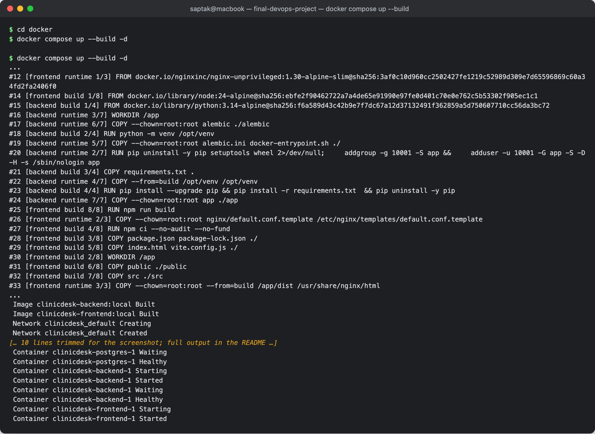

### 5.3 Containers, users, migrations

```
$ docker compose ps
NAME                    IMAGE                       COMMAND                  SERVICE    CREATED          STATUS                             PORTS
clinicdesk-backend-1    clinicdesk-backend:local    "sh /app/docker-entr…"   backend    24 seconds ago   Up 18 seconds (healthy)            0.0.0.0:8000->8000/tcp, [::]:8000->8000/tcp
clinicdesk-frontend-1   clinicdesk-frontend:local   "/docker-entrypoint.…"   frontend   24 seconds ago   Up 12 seconds (health: starting)   0.0.0.0:3000->8080/tcp, [::]:3000->8080/tcp
clinicdesk-postgres-1   postgres:18-alpine          "docker-entrypoint.s…"   postgres   24 seconds ago   Up 24 seconds (healthy)            5432/tcp

$ docker compose exec backend id
uid=10001(app) gid=10001(app) groups=10001(app)

$ docker compose exec frontend id
uid=101(nginx) gid=101(nginx) groups=101(nginx)

$ docker compose logs backend | head -9
backend-1  | INFO  [alembic.runtime.migration] Context impl PostgresqlImpl.
backend-1  | INFO  [alembic.runtime.migration] Will assume transactional DDL.
backend-1  | INFO  [alembic.runtime.migration] Running upgrade  -> 0001_clinic_schema, Create doctors, patients and appointments tables
backend-1  | INFO  [alembic.runtime.migration] Running upgrade 0001_clinic_schema -> 0002_seed_doctors, Seed the clinic's doctor roster
backend-1  | INFO:     Started server process [1]
backend-1  | INFO:     Waiting for application startup.
backend-1  | INFO:     Application startup complete.
backend-1  | INFO:     Uvicorn running on http://0.0.0.0:8000 (Press CTRL+C to quit)
backend-1  | INFO:     127.0.0.1:60484 - "GET /health HTTP/1.1" 200 OK

$ docker images --format 'table {{.Repository}}:{{.Tag}}	{{.Size}}' | grep -E 'REPOSITORY|clinicdesk'
REPOSITORY:TAG                               SIZE
clinicdesk-frontend:local                    30.5MB
```

Both application containers run as non-root (`uid=10001(app)` and `uid=101(nginx)`). PostgreSQL has no host port. The backend log shows the entrypoint applying both Alembic revisions before Uvicorn starts, then the Docker health check calling `/health`.

### 5.4 API checks with curl (CRUD on appointments)

```
$ curl -s localhost:8000/health
{"status":"UP"}
$ curl -s -w '\nHTTP %{http_code}\n' localhost:8000/ready
{"status":"READY","database":"ok"}
HTTP 200

$ curl -s localhost:8000/api/doctors | python3 -m json.tool
[
    {
        "id": 1,
        "full_name": "Dr. Ananya Rao",
        "specialty": "General Medicine",
        "room": "G-01",
        "active": true
    },
    {
        "id": 3,
        "full_name": "Dr. Farah Siddiqui",
        "specialty": "Dermatology",
        "room": "1-02",
        "active": true
    },
    {
        "id": 4,
        "full_name": "Dr. Rohan Iyer",
        "specialty": "Orthopaedics",
        "room": "1-05",
        "active": true
    },
    {
        "id": 2,
        "full_name": "Dr. Vikram Mehta",
        "specialty": "Paediatrics",
        "room": "G-04",
        "active": true
    }
]

$ curl -s -X POST localhost:8000/api/appointments -H 'Content-Type: application/json' -d '{"doctor_id":1,"scheduled_at":"2026-10-07T16:00","duration_minutes":30,"reason":"Persistent cough","patient":{"full_name":"Rohit Bose","phone":"+91 98300 12345"}}' | python3 -m json.tool
{
    "id": 1,
    "scheduled_at": "2026-10-07T16:00:00",
    "ends_at": "2026-10-07T16:30:00",
    "duration_minutes": 30,
    "reason": "Persistent cough",
    "status": "SCHEDULED",
    "notes": "",
    "doctor": {
        "id": 1,
        "full_name": "Dr. Ananya Rao",
        "specialty": "General Medicine",
        "room": "G-01"
    },
    "patient": {
        "id": 1,
        "full_name": "Rohit Bose",
        "phone": "+91 98300 12345"
    },
    "created_at": "2026-10-06T23:41:34.385039Z",
    "updated_at": "2026-10-06T23:41:34.385042Z"
}

$ curl -s localhost:8000/api/appointments/1 | python3 -c 'import sys,json; a=json.load(sys.stdin); print(a["id"], a["status"], a["scheduled_at"], a["patient"]["full_name"], "->", a["doctor"]["full_name"])'
1 SCHEDULED 2026-10-07T16:00:00 Rohit Bose -> Dr. Ananya Rao

$ curl -s -w '\nHTTP %{http_code}\n' -X POST localhost:8000/api/appointments -H 'Content-Type: application/json' -d '{"doctor_id":1,"scheduled_at":"2026-10-07T16:15","duration_minutes":30,"patient":{"full_name":"Anita Roy","phone":"+91 98300 54321"}}'
{"detail":"Dr. Ananya Rao already has an appointment from 16:00 to 16:30 on 07 Oct"}
HTTP 409

$ curl -s -X PUT localhost:8000/api/appointments/1 -H 'Content-Type: application/json' -d '{"status":"CHECKED_IN","notes":"Arrived 10 min early"}' | python3 -c 'import sys,json; a=json.load(sys.stdin); print(a["id"], a["status"], repr(a["notes"]), a["updated_at"])'
1 CHECKED_IN 'Arrived 10 min early' 2026-10-06T23:41:34.469918Z

$ curl -s -X PUT localhost:8000/api/appointments/1 -H 'Content-Type: application/json' -d '{"scheduled_at":"2026-10-07T17:00","duration_minutes":45}' | python3 -c 'import sys,json; a=json.load(sys.stdin); print(a["id"], a["scheduled_at"], "->", a["ends_at"])'
1 2026-10-07T17:00:00 -> 2026-10-07T17:45:00

$ curl -s -X POST localhost:8000/api/appointments/1/cancel | python3 -c 'import sys,json; a=json.load(sys.stdin); print(a["id"], a["status"])'
1 CANCELLED

$ curl -s -w '\nHTTP %{http_code}\n' -X POST localhost:8000/api/appointments/1/cancel
{"detail":"Appointment is already cancelled"}
HTTP 409

$ curl -s -o /dev/null -w 'HTTP %{http_code}\n' -X DELETE localhost:8000/api/appointments/1
HTTP 204

$ curl -s -w '\nHTTP %{http_code}\n' localhost:8000/api/appointments/1
{"detail":"Appointment 1 not found"}
HTTP 404

$ curl -s -w '\nHTTP %{http_code}\n' -X POST localhost:8000/api/appointments -H 'Content-Type: application/json' -d '{"doctor_id":1,"scheduled_at":"2026-10-07T18:00","duration_minutes":300,"patient_id":1}'
{"detail":[{"type":"less_than_equal","loc":["body","duration_minutes"],"msg":"Input should be less than or equal to 120","input":300,"ctx":{"le":120}}]}
HTTP 422
```

Create → read → update (check-in with notes, then reschedule to 17:00 for 45 min) → cancel → delete → `404`, plus the three error paths: overlapping booking `409`, second cancel `409`, duration 300 `422` with the exact validation message.

**Screenshot:** 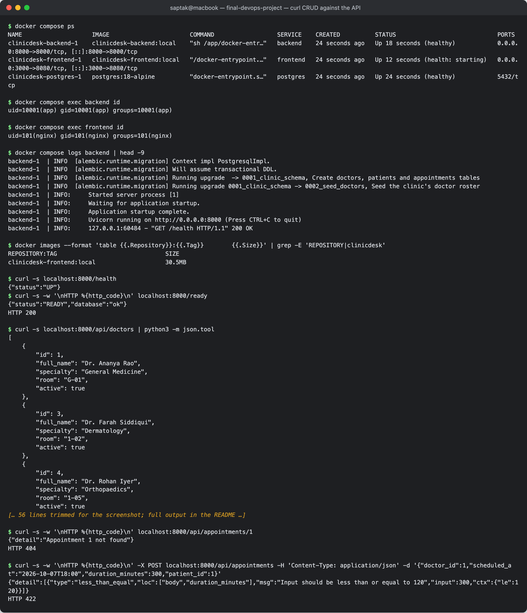

### 5.5 Frontend on :3000, nginx proxying `/api`, database contents

The seed script talks to port **3000**, so every booking below went browser-path style through nginx's `/api` proxy rather than straight to the backend:

```
$ BASE_URL=http://localhost:3000 application/scripts/seed-demo.sh 2026-10-07
201 09:00 Meera Krishnan
201 09:30 Imran Qureshi
201 10:15 Lakshmi Pillai
201 11:30 Sanjay Kulkarni
201 09:15 Aarav Sharma
201 10:00 Diya Banerjee
201 14:00 Kabir Malhotra
201 10:00 Nisha Verma
201 12:00 Tanvi Deshpande
201 09:30 Harish Gowda
201 15:30 Fatima Sheikh

$ curl -sI localhost:3000/ | grep -iE '^(HTTP|content-type|x-frame|x-content|content-security)'
HTTP/1.1 200 OK
Content-Type: text/html
X-Content-Type-Options: nosniff
X-Frame-Options: DENY
Content-Security-Policy: default-src 'self'; img-src 'self' data:; style-src 'self' 'unsafe-inline'; font-src 'self'; connect-src 'self'; frame-ancestors 'none'

$ curl -s localhost:3000/ | grep -oE '<title>.*</title>|/assets/index-[^"]+'
<title>ClinicDesk</title>
/assets/index-BQfMdHMb.js
/assets/index-DPXIatko.css

$ curl -s localhost:3000/healthz
ok

$ curl -s 'localhost:3000/api/appointments?on=2026-10-07&doctor_id=1' | python3 -c 'import sys,json; [print(a["scheduled_at"][11:16], a["status"].ljust(10), a["patient"]["full_name"]) for a in json.load(sys.stdin)]'
09:00 SCHEDULED  Meera Krishnan
09:30 SCHEDULED  Imran Qureshi
10:15 SCHEDULED  Lakshmi Pillai
11:30 SCHEDULED  Sanjay Kulkarni

$ curl -s 'localhost:3000/api/stats?on=2026-10-07' | python3 -m json.tool
{
    "date": "2026-10-07",
    "total": 11,
    "scheduled": 11,
    "checked_in": 0,
    "completed": 0,
    "cancelled": 0,
    "no_show": 0,
    "upcoming_7_days": 11,
    "active_doctors": 4,
    "patients": 12,
    "by_doctor": [
        {
            "doctor_id": 1,
            "full_name": "Dr. Ananya Rao",
            "specialty": "General Medicine",
            "booked": 4,
            "booked_minutes": 120
        },
        {
            "doctor_id": 3,
            "full_name": "Dr. Farah Siddiqui",
            "specialty": "Dermatology",
            "booked": 2,
            "booked_minutes": 50
        },
        {
            "doctor_id": 4,
            "full_name": "Dr. Rohan Iyer",
            "specialty": "Orthopaedics",
            "booked": 2,
            "booked_minutes": 75
        },
        {
            "doctor_id": 2,
            "full_name": "Dr. Vikram Mehta",
            "specialty": "Paediatrics",
            "booked": 3,
            "booked_minutes": 80
        }
    ]
}
```

```
$ docker compose -f docker/docker-compose.yml exec postgres psql -U clinicdesk -d clinicdesk -c '\dt' -c 'SELECT version_num FROM alembic_version' -c 'SELECT d.full_name AS doctor, count(a.id) AS booked FROM doctors d LEFT JOIN appointments a ON a.doctor_id = d.id GROUP BY d.full_name ORDER BY 1'
                List of tables
 Schema |      Name       | Type  |   Owner    
--------+-----------------+-------+------------
 public | alembic_version | table | clinicdesk
 public | appointments    | table | clinicdesk
 public | doctors         | table | clinicdesk
 public | patients        | table | clinicdesk
(4 rows)

    version_num    
-------------------
 0002_seed_doctors
(1 row)

       doctor       | booked 
--------------------+--------
 Dr. Ananya Rao     |      4
 Dr. Farah Siddiqui |      2
 Dr. Rohan Iyer     |      2
 Dr. Vikram Mehta   |      3
(4 rows)
```

The `psql` output confirms the four tables (three app tables plus `alembic_version` at `0002_seed_doctors`) and that the per-doctor counts in the database match `/api/stats`.

### 5.6 Tear down

```
$ docker compose down -v
 Container clinicdesk-frontend-1 Stopping 
 Container clinicdesk-frontend-1 Stopped 
 Container clinicdesk-frontend-1 Removing 
 Container clinicdesk-frontend-1 Removed 
 Container clinicdesk-backend-1 Stopping 
 Container clinicdesk-backend-1 Stopped 
 Container clinicdesk-backend-1 Removing 
 Container clinicdesk-backend-1 Removed 
 Container clinicdesk-postgres-1 Stopping 
 Container clinicdesk-postgres-1 Stopped 
 Container clinicdesk-postgres-1 Removing 
 Container clinicdesk-postgres-1 Removed 
 Volume clinicdesk_pgdata Removing 
 Network clinicdesk_default Removing 
 Volume clinicdesk_pgdata Removed 
 Network clinicdesk_default Removed 

$ docker compose ps -a
NAME      IMAGE     COMMAND   SERVICE   CREATED   STATUS    PORTS

$ docker volume ls --filter name=clinicdesk
DRIVER    VOLUME NAME
```

`-v` also removes the `pgdata` named volume, so the next `up` starts from an empty, freshly migrated database. The two images are kept for the Kubernetes phase.

---
## 6. Kubernetes deployment

### 6.1 Manifests

Raw manifests live in [`kubernetes/`](./kubernetes) and apply with Kustomize (`kubectl apply -k kubernetes/`). They cover everything Session 21 lists:

| File | Objects | Notes |
| --- | --- | --- |
| `00-namespace.yaml` | Namespace `clinicdesk` | labelled `pod-security.kubernetes.io/enforce: restricted`; every pod below complies (proved in CI and on EKS, where this file created the namespace) |
| `01-configmap.yaml` | ConfigMap `clinicdesk-config` | `DB_HOST`, `DB_PORT`, `DB_NAME`, timezone, log level, `BACKEND_UPSTREAM` |
| `02-secret.example.yaml` | Secret `clinicdesk-db` (**template only**) | placeholder `REPLACE_ME`, excluded from `kustomization.yaml`; the real Secret is created with `kubectl create secret generic` (section 12.2) |
| `10-postgres.yaml` | headless Service + StatefulSet with `volumeClaimTemplates` | runs as uid 70, read-only root filesystem (data on the PVC, socket and temp files on emptyDirs), `pg_isready` probes |
| `20-backend.yaml` | Deployment (2 replicas) + ClusterIP Service :8000 | startup, liveness (`/health`), readiness (`/ready`) probes; requests/limits; read-only root FS; `envFrom` ConfigMap + `secretKeyRef` |
| `30-frontend.yaml` | Deployment (2 replicas) + ClusterIP Service :80 → 8080 | `/healthz` probes; emptyDirs for `/tmp` and nginx `conf.d` so the root FS can be read-only |
| `40-ingress.yaml` | Ingress | `/api` → backend, `/` → frontend, `ingressClassName: nginx` |
| `50-hpa.yaml` | HPA backend 2–6 @70 % CPU, frontend 2–4 @75 % | `autoscaling/v2`, scale-down stabilisation 120 s |
| `addons/ingress-nginx-values.yaml` | ingress-nginx controller | `Service` of type LoadBalancer → AWS Network Load Balancer |

Offline schema validation (Phase 1, before any cluster existed):

```
$ kubectl kustomize kubernetes | kubeconform -strict -summary -
Summary: 11 resources found parsing stdin - Valid: 11, Invalid: 0, Errors: 0, Skipped: 0

$ kubeconform -strict -summary kubernetes/02-secret.example.yaml
Summary: 1 resource found in 1 file - Valid: 1, Invalid: 0, Errors: 0, Skipped: 0

$ kubectl kustomize kubernetes | grep -E '^kind:' | sort | uniq -c
   1 kind: ConfigMap
   2 kind: Deployment
   2 kind: HorizontalPodAutoscaler
   1 kind: Ingress
   1 kind: Namespace
   3 kind: Service
   1 kind: StatefulSet
```

In CI the same manifests are checked against a real API server (`kubectl apply -k kubernetes --dry-run=server` in the kind cluster, job 9), which also proves the `restricted` namespace label is accepted:

```
NAME         STATUS   AGE   LABELS
clinicdesk   Active   0s    app.kubernetes.io/part-of=clinicdesk,kubernetes.io/metadata.name=clinicdesk,pod-security.kubernetes.io/enforce-version=latest,pod-security.kubernetes.io/enforce=restricted
...
kubectl apply -k kubernetes --dry-run=server
...
namespace/clinicdesk unchanged (server dry run)
configmap/clinicdesk-config created (server dry run)
service/clinicdesk-backend created (server dry run)
service/clinicdesk-frontend created (server dry run)
service/clinicdesk-postgres created (server dry run)
deployment.apps/clinicdesk-backend created (server dry run)
deployment.apps/clinicdesk-frontend created (server dry run)
statefulset.apps/clinicdesk-postgres created (server dry run)
horizontalpodautoscaler.autoscaling/clinicdesk-backend created (server dry run)
horizontalpodautoscaler.autoscaling/clinicdesk-frontend created (server dry run)
ingress.networking.k8s.io/clinicdesk created (server dry run)
```

### 6.2 The application running on EKS

On EKS the same objects are rendered by the Helm chart and applied by Argo CD (sections 7 and 12). After the first sync:

```
$ kubectl -n argocd get application clinicdesk -o wide
NAME         SYNC STATUS   HEALTH STATUS   REVISION                                   PROJECT
clinicdesk   Synced        Healthy         1c0ef7bbbfa188f0cef89efe5156aedc5d932367   default

$ kubectl -n clinicdesk get deploy,sts,pods -o wide
NAME                                  READY   UP-TO-DATE   AVAILABLE   AGE     CONTAINERS   IMAGES                                                                              SELECTOR
deployment.apps/clinicdesk-backend    2/2     2            2           9m57s   backend      ghcr.io/saptak-cyber/clinicdesk-backend:e664e8a0f6b571751b4e4aca70a4460ae1e34d11    app.kubernetes.io/component=backend,app.kubernetes.io/instance=clinicdesk,app.kubernetes.io/name=clinicdesk
deployment.apps/clinicdesk-frontend   2/2     2            2           9m57s   frontend     ghcr.io/saptak-cyber/clinicdesk-frontend:e664e8a0f6b571751b4e4aca70a4460ae1e34d11   app.kubernetes.io/component=frontend,app.kubernetes.io/instance=clinicdesk,app.kubernetes.io/name=clinicdesk

NAME                                   READY   AGE     CONTAINERS   IMAGES
statefulset.apps/clinicdesk-postgres   1/1     9m57s   postgres     postgres:18-alpine

NAME                                       READY   STATUS    RESTARTS   AGE     IP             NODE                                         NOMINATED NODE   READINESS GATES
pod/clinicdesk-backend-5d8b89649f-dtzkh    1/1     Running   0          9m42s   10.42.11.36    ip-10-42-11-49.ap-south-1.compute.internal   <none>           <none>
pod/clinicdesk-backend-5d8b89649f-jckm5    1/1     Running   0          9m57s   10.42.10.223   ip-10-42-10-35.ap-south-1.compute.internal   <none>           <none>
pod/clinicdesk-frontend-85f4cc4cbc-2r78l   1/1     Running   0          9m57s   10.42.10.65    ip-10-42-10-35.ap-south-1.compute.internal   <none>           <none>
pod/clinicdesk-frontend-85f4cc4cbc-t6m2j   1/1     Running   0          9m42s   10.42.11.153   ip-10-42-11-49.ap-south-1.compute.internal   <none>           <none>
pod/clinicdesk-postgres-0                  1/1     Running   0          9m57s   10.42.11.226   ip-10-42-11-49.ap-south-1.compute.internal   <none>           <none>

$ kubectl -n clinicdesk get svc,ingress,hpa
NAME                          TYPE        CLUSTER-IP      EXTERNAL-IP   PORT(S)    AGE
service/clinicdesk-backend    ClusterIP   172.20.43.216   <none>        8000/TCP   9m58s
service/clinicdesk-frontend   ClusterIP   172.20.12.96    <none>        80/TCP     9m58s
service/clinicdesk-postgres   ClusterIP   None            <none>        5432/TCP   9m58s

NAME                                   CLASS   HOSTS   ADDRESS                                                                          PORTS   AGE
ingress.networking.k8s.io/clinicdesk   nginx   *       af19c79de2b19413687ba24f921db8e7-73d069dbd13cef3a.elb.ap-south-1.amazonaws.com   80      9m58s

NAME                                                      REFERENCE                        TARGETS       MINPODS   MAXPODS   REPLICAS   AGE
horizontalpodautoscaler.autoscaling/clinicdesk-backend    Deployment/clinicdesk-backend    cpu: 3%/60%   2         5         2          9m58s
horizontalpodautoscaler.autoscaling/clinicdesk-frontend   Deployment/clinicdesk-frontend   cpu: 4%/75%   2         4         2          9m58s

$ kubectl -n clinicdesk get pvc
NAME                         STATUS   VOLUME                                     CAPACITY   ACCESS MODES   STORAGECLASS         VOLUMEATTRIBUTESCLASS   AGE
data-clinicdesk-postgres-0   Bound    pvc-9090d7c7-9938-4ac2-b130-86d50da2190f   5Gi        RWO            ebs-csi-default-sc   <unset>                 10m

$ aws ec2 describe-volumes --filters Name=tag:kubernetes.io/created-for/pvc/name,Values=data-clinicdesk-postgres-0 --query 'Volumes[].{id:VolumeId,type:VolumeType,size:Size,state:State,az:AvailabilityZone}' --output table
--------------------------------------------------------------------
|                          DescribeVolumes                         |
+-------------+-------------------------+-------+---------+--------+
|     az      |           id            | size  |  state  | type   |
+-------------+-------------------------+-------+---------+--------+
|  ap-south-1b|  vol-05981de82ff8c81da  |  5    |  in-use |  gp3   |
+-------------+-------------------------+-------+---------+--------+

$ helm list -A
NAME                 	NAMESPACE    	REVISION	UPDATED                             	STATUS  	CHART                       	APP VERSION
argocd               	argocd       	1       	2026-10-07 05:47:41.129082 +0530 IST	deployed	argo-cd-10.9.6              	v3.5.3     
ingress-nginx        	ingress-nginx	1       	2026-10-07 05:47:03.607126 +0530 IST	deployed	ingress-nginx-4.15.1        	1.15.1     
kube-prometheus-stack	monitoring   	1       	2026-10-07 05:45:43.499747 +0530 IST	deployed	kube-prometheus-stack-92.0.0	v0.94.1    

$ kubectl -n ingress-nginx get svc ingress-nginx-controller
NAME                       TYPE           CLUSTER-IP      EXTERNAL-IP                                                                      PORT(S)                      AGE
ingress-nginx-controller   LoadBalancer   172.20.104.83   af19c79de2b19413687ba24f921db8e7-73d069dbd13cef3a.elb.ap-south-1.amazonaws.com   80:32491/TCP,443:31943/TCP   11m

$ curl -s -o /dev/null -w 'HTTP %{http_code}  %{content_type}\n' http://af19c79de2b19413687ba24f921db8e7-73d069dbd13cef3a.elb.ap-south-1.amazonaws.com/
HTTP 200  text/html

$ curl -s http://af19c79de2b19413687ba24f921db8e7-73d069dbd13cef3a.elb.ap-south-1.amazonaws.com/ | grep -o '<title>[^<]*</title>'
<title>ClinicDesk</title>

$ curl -s http://af19c79de2b19413687ba24f921db8e7-73d069dbd13cef3a.elb.ap-south-1.amazonaws.com/api/doctors | python3 -c 'import sys,json; [print(d["id"], d["full_name"], "-", d["specialty"]) for d in json.load(sys.stdin)]'
1 Dr. Ananya Rao - General Medicine
3 Dr. Farah Siddiqui - Dermatology
4 Dr. Rohan Iyer - Orthopaedics
2 Dr. Vikram Mehta - Paediatrics

$ BASE_URL=http://af19c79de2b19413687ba24f921db8e7-73d069dbd13cef3a.elb.ap-south-1.amazonaws.com ../final-devops-project/application/scripts/seed-demo.sh $(TZ=Asia/Kolkata date +%F)
201 09:00 Meera Krishnan
201 09:30 Imran Qureshi
201 10:15 Lakshmi Pillai
201 11:30 Sanjay Kulkarni
201 09:15 Aarav Sharma
201 10:00 Diya Banerjee
201 14:00 Kabir Malhotra
201 10:00 Nisha Verma
201 12:00 Tanvi Deshpande
201 09:30 Harish Gowda
201 15:30 Fatima Sheikh

$ curl -s "http://af19c79de2b19413687ba24f921db8e7-73d069dbd13cef3a.elb.ap-south-1.amazonaws.com/api/stats" | python3 -c 'import sys,json; s=json.load(sys.stdin); print({k: s[k] for k in ("date","total","scheduled","active_doctors","patients")})'
{'date': '2026-10-07', 'total': 11, 'scheduled': 11, 'active_doctors': 4, 'patients': 11}

$ curl -s -o /dev/null -w 'HTTP %{http_code}\n' http://af19c79de2b19413687ba24f921db8e7-73d069dbd13cef3a.elb.ap-south-1.amazonaws.com/docs
HTTP 200
```

What this shows:

- **Deployments with 2 replicas each, all `Running`**, spread over both nodes (one per AZ); the images are the GHCR images tagged with the commit SHA that CI promoted.
- **ClusterIP Services** for frontend and backend, a headless Service for PostgreSQL.
- **Ingress** (`*` host) published through the ingress-nginx **AWS NLB**; the UI, `/api/doctors` and the seed script all work through the load balancer's DNS name. (`/docs` returns 200 here only because the SPA falls back to `index.html`; Swagger is not routed through the Ingress on purpose.)
- **Storage**: the PostgreSQL PVC is `Bound` to a **5 GiB gp3 EBS volume** created by the EBS CSI driver add-on, in the same AZ as the pod.
- **HPA** reads CPU from metrics-server (also a Terraform-managed add-on).

**Screenshot (real):** the app through the NLB on EKS:

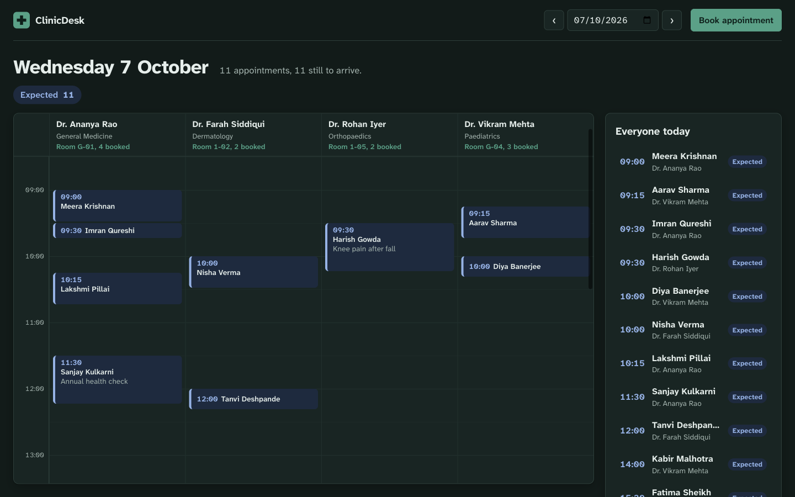

### 6.3 Horizontal Pod Autoscaler under load

Load came from a pod inside the cluster (24 parallel `curl` loops against the backend Service, so the NLB and my home connection were not the bottleneck):

```
$ kubectl -n clinicdesk get hpa clinicdesk-backend
NAME                 REFERENCE                       TARGETS       MINPODS   MAXPODS   REPLICAS   AGE
clinicdesk-backend   Deployment/clinicdesk-backend   cpu: 3%/60%   2         5         2          10m

$ kubectl top pods -n clinicdesk
NAME                                   CPU(cores)   MEMORY(bytes)   
clinicdesk-backend-5d8b89649f-dtzkh    3m           76Mi            
clinicdesk-backend-5d8b89649f-jckm5    3m           76Mi            
clinicdesk-frontend-85f4cc4cbc-2r78l   1m           3Mi             
clinicdesk-frontend-85f4cc4cbc-t6m2j   1m           3Mi             
clinicdesk-postgres-0                  10m          45Mi            

$ kubectl create namespace loadtest
namespace/loadtest created

$ kubectl -n loadtest run load --image=curlimages/curl:8.17.0 --restart=Never --command -- sh -c 'for i in $(seq 1 24); do (while true; do curl -s -o /dev/null http://clinicdesk-backend.clinicdesk:8000/api/stats; curl -s -o /dev/null "http://clinicdesk-backend.clinicdesk:8000/api/appointments?on=2026-10-07"; done) & done; sleep 300'
pod/load created
```

```
$ kubectl -n clinicdesk get hpa clinicdesk-backend --watch   (sampled every 20 s)
[00:29:58] clinicdesk-backend   Deployment/clinicdesk-backend   cpu: 3%/60%   2     5     2     11m
[00:30:18] clinicdesk-backend   Deployment/clinicdesk-backend   cpu: 110%/60%   2     5     2     11m
[00:30:41] clinicdesk-backend   Deployment/clinicdesk-backend   cpu: 379%/60%   2     5     5     11m
[00:31:01] clinicdesk-backend   Deployment/clinicdesk-backend   cpu: 303%/60%   2     5     5     12m
[00:31:22] clinicdesk-backend   Deployment/clinicdesk-backend   cpu: 268%/60%   2     5     5     12m
[00:31:42] clinicdesk-backend   Deployment/clinicdesk-backend   cpu: 266%/60%   2     5     5     12m
[00:32:03] clinicdesk-backend   Deployment/clinicdesk-backend   cpu: 270%/60%   2     5     5     13m
[00:32:28] clinicdesk-backend   Deployment/clinicdesk-backend   cpu: 254%/60%   2     5     5     13m
[00:32:48] clinicdesk-backend   Deployment/clinicdesk-backend   cpu: 267%/60%   2     5     5     13m
[00:33:09] clinicdesk-backend   Deployment/clinicdesk-backend   cpu: 267%/60%   2     5     5     14m
```

```
$ kubectl -n clinicdesk get pods -l app.kubernetes.io/component=backend -o wide
NAME                                  READY   STATUS    RESTARTS   AGE     IP             NODE                                         NOMINATED NODE   READINESS GATES
clinicdesk-backend-5d8b89649f-2cjcx   1/1     Running   0          3m36s   10.42.10.32    ip-10-42-10-35.ap-south-1.compute.internal   <none>           <none>
clinicdesk-backend-5d8b89649f-dtzkh   1/1     Running   0          14m     10.42.11.36    ip-10-42-11-49.ap-south-1.compute.internal   <none>           <none>
clinicdesk-backend-5d8b89649f-jckm5   1/1     Running   0          14m     10.42.10.223   ip-10-42-10-35.ap-south-1.compute.internal   <none>           <none>
clinicdesk-backend-5d8b89649f-wh9gs   1/1     Running   0          3m36s   10.42.11.204   ip-10-42-11-49.ap-south-1.compute.internal   <none>           <none>
clinicdesk-backend-5d8b89649f-zvkb2   1/1     Running   0          3m21s   10.42.11.35    ip-10-42-11-49.ap-south-1.compute.internal   <none>           <none>
clinicdesk-backend-7c885d74d9-px4mv   0/1     Pending   0          27s     <none>         <none>                                       <none>           <none>

$ kubectl top pods -n clinicdesk
NAME                                   CPU(cores)   MEMORY(bytes)   
clinicdesk-backend-5d8b89649f-2cjcx    240m         78Mi            
clinicdesk-backend-5d8b89649f-dtzkh    279m         79Mi            
clinicdesk-backend-5d8b89649f-jckm5    244m         79Mi            
clinicdesk-backend-5d8b89649f-wh9gs    293m         79Mi            
clinicdesk-backend-5d8b89649f-zvkb2    271m         78Mi            
clinicdesk-frontend-85f4cc4cbc-2r78l   1m           3Mi             
clinicdesk-frontend-85f4cc4cbc-t6m2j   1m           3Mi             
clinicdesk-postgres-0                  445m         110Mi           

$ kubectl -n clinicdesk describe hpa clinicdesk-backend | sed -n '/Events:/,$p'
Events:
  Type     Reason                        Age                From                       Message
  ----     ------                        ----               ----                       -------
  Normal   SuccessfulRescale             14m                horizontal-pod-autoscaler  New size: 2; reason: Current number of replicas below Spec.MinReplicas
  Warning  FailedGetResourceMetric       13m (x3 over 14m)  horizontal-pod-autoscaler  failed to get cpu utilization: did not receive metrics for targeted pods (pods might be unready)
  Warning  FailedComputeMetricsReplicas  13m (x3 over 14m)  horizontal-pod-autoscaler  invalid metrics (1 invalid out of 1), first error is: failed to get cpu resource metric value: failed to get cpu utilization: did not receive metrics for targeted pods (pods might be unready)
  Normal   SuccessfulRescale             3m37s              horizontal-pod-autoscaler  New size: 4; reason: cpu resource utilization (percentage of request) above target
  Normal   SuccessfulRescale             3m22s              horizontal-pod-autoscaler  New size: 5; reason: cpu resource utilization (percentage of request) above target
```

CPU went from 3 % to 379 % of the 100m request within 40 seconds and the HPA scaled the backend **2 → 4 → 5** (its `maxReplicas` on EKS). PostgreSQL became the busiest pod (445m), which is the honest bottleneck for this read-heavy load. The sixth backend pod in the list is not the HPA: it is the next GitOps rollout arriving at the same moment, and it stayed `Pending`; that became troubleshooting issue 1 (section 13.1). The Grafana screenshot in section 11 shows the same scale-up as a graph.

---

## 7. Helm deployment

Chart: [`helm/clinicdesk`](./helm/clinicdesk) (`apiVersion: v2`, chart 0.1.0, app 1.0.0).

| Template | What it renders |
| --- | --- |
| `configmap.yaml`, `secret.yaml` | ConfigMap; DB Secret **only if** `database.existingSecret` is empty. The password is taken from values, else reused from the live Secret via `lookup` (so upgrades never lock PostgreSQL out), else generated. |
| `backend-deployment.yaml`, `backend-service.yaml` | backend Deployment + Service; a `checksum/config` annotation rolls pods when the ConfigMap changes |
| `frontend-deployment.yaml`, `frontend-service.yaml` | frontend Deployment + Service |
| `postgres.yaml` | headless Service + StatefulSet + PVC (`postgres.enabled=false` switches to `externalDatabase.host`, e.g. RDS) |
| `ingress.yaml` | toggled by `ingress.enabled`; `host: ""` matches any Host header (used with the NLB DNS name) |
| `hpa.yaml` | one HPA per component when `autoscaling.enabled`; Deployments drop `replicas:` so Helm/Argo CD and the HPA don't fight |
| `servicemonitor.yaml`, `prometheusrule.yaml` | toggled by `monitoring.serviceMonitor.enabled` / `monitoring.prometheusRule.enabled` (Prometheus Operator CRDs) |
| `NOTES.txt` | post-install instructions (port-forward or Ingress URL) |

| Values file | Purpose |
| --- | --- |
| `values.yaml` | defaults: 2 replicas, HPA on, chart-managed Secret, monitoring objects off |
| `values-dev.yaml` | minikube: 1 replica each, HPA off, Ingress `clinicdesk.local` |
| `values-prod.yaml` | EKS: HPA 2–8 backend, `existingSecret: clinicdesk-db` (GitOps-safe), 5 Gi PVC on `ebs-csi-default-sc` (the StorageClass Terraform's EBS CSI add-on creates), Ingress, ServiceMonitor and PrometheusRule on |
| [`gitops/values-eks.yaml`](./gitops/values-eks.yaml) | layered on top of prod by Argo CD: image tags (owned by CI), HPA max 5, Ingress host `""` |

### 7.1 Lint and render (Phase 1, offline)

```
$ helm version --short
v4.3.0+gbec5b06

$ helm lint helm/clinicdesk -f helm/clinicdesk/values-dev.yaml
==> Linting helm/clinicdesk

1 chart(s) linted, 0 chart(s) failed

$ helm lint helm/clinicdesk -f helm/clinicdesk/values-prod.yaml
==> Linting helm/clinicdesk

1 chart(s) linted, 0 chart(s) failed

$ helm template clinicdesk helm/clinicdesk -n clinicdesk -f helm/clinicdesk/values-dev.yaml | grep -E '^kind:' | sort | uniq -c
   1 kind: ConfigMap
   2 kind: Deployment
   1 kind: Ingress
   1 kind: Secret
   3 kind: Service
   1 kind: StatefulSet

$ helm template clinicdesk helm/clinicdesk -n clinicdesk -f helm/clinicdesk/values-prod.yaml --set backend.image.tag=3f9c2ab --set frontend.image.tag=3f9c2ab | grep -E '^kind:' | sort | uniq -c
   1 kind: ConfigMap
   2 kind: Deployment
   2 kind: HorizontalPodAutoscaler
   1 kind: Ingress
   3 kind: Service
   1 kind: ServiceMonitor
   1 kind: StatefulSet

$ helm template clinicdesk helm/clinicdesk -n clinicdesk -f helm/clinicdesk/values-prod.yaml --set backend.image.tag=3f9c2ab --set frontend.image.tag=3f9c2ab | grep -E 'image:|storageClassName|host:|existingSecret|secretKeyRef' | sort | uniq -c
   2                 secretKeyRef: {name: clinicdesk-db, key: password}
   2                 secretKeyRef: {name: clinicdesk-db, key: username}
   1           image: "ghcr.io/saptak-cyber/clinicdesk-backend:3f9c2ab"
   1           image: "ghcr.io/saptak-cyber/clinicdesk-frontend:3f9c2ab"
   1           image: "postgres:18-alpine"
   1         storageClassName: ebs-csi-default-sc
   1     - host: "clinicdesk.example.com"

$ kubeconform -v
v0.8.0

$ helm template clinicdesk helm/clinicdesk -n clinicdesk -f helm/clinicdesk/values-dev.yaml | kubeconform -strict -summary -schema-location default -schema-location 'https://raw.githubusercontent.com/datreeio/CRDs-catalog/main/{{.Group}}/{{.ResourceKind}}_{{.ResourceAPIVersion}}.json' -
Summary: 9 resources found parsing stdin - Valid: 9, Invalid: 0, Errors: 0, Skipped: 0

$ helm template clinicdesk helm/clinicdesk -n clinicdesk -f helm/clinicdesk/values-prod.yaml | kubeconform -strict -summary -schema-location default -schema-location 'https://raw.githubusercontent.com/datreeio/CRDs-catalog/main/{{.Group}}/{{.ResourceKind}}_{{.ResourceAPIVersion}}.json' -
Summary: 11 resources found parsing stdin - Valid: 11, Invalid: 0, Errors: 0, Skipped: 0
```

(This capture predates the PrometheusRule template; the CI job lints and installs the current chart on every run.)

### 7.2 `helm upgrade --install` in CI (kind cluster inside the runner)

Job 9 of every pipeline run installs the chart with the images it has just pushed, then smoke-tests it. From the [live-demo run](https://github.com/Saptak-cyber/DevOps_Assignments/actions/runs/37552961415):

```
==> Linting helm/clinicdesk

1 chart(s) linted, 0 chart(s) failed
Release "clinicdesk" does not exist. Installing it now.
NAME: clinicdesk
LAST DEPLOYED: Wed Oct  7 00:41:30 2026
NAMESPACE: clinicdesk
STATUS: deployed
REVISION: 1
DESCRIPTION: Install complete
TEST SUITE: None
NOTES:
ClinicDesk 1.0.0 is installed as release "clinicdesk" in namespace "clinicdesk".

  kubectl -n clinicdesk get pods,svc

Open the UI with:
  kubectl -n clinicdesk port-forward svc/clinicdesk-frontend 3000:80
  then browse http://localhost:3000

API docs: kubectl -n clinicdesk port-forward svc/clinicdesk-backend 8000:8000  ->  http://localhost:8000/docs
NAME      	NAMESPACE 	REVISION	UPDATED                                	STATUS  	CHART           	APP VERSION
clinicdesk	clinicdesk	1       	2026-10-07 00:41:30.042742955 +0000 UTC	deployed	clinicdesk-0.1.0	1.0.0      
NAME                                  READY   UP-TO-DATE   AVAILABLE   AGE   CONTAINERS   IMAGES                                                                              SELECTOR
deployment.apps/clinicdesk-backend    2/2     2            2           21s   backend      ghcr.io/saptak-cyber/clinicdesk-backend:dbbdd499373d8b3ef1c16e91899b2c2d06a91f7e    app.kubernetes.io/component=backend,app.kubernetes.io/instance=clinicdesk,app.kubernetes.io/name=clinicdesk
deployment.apps/clinicdesk-frontend   2/2     2            2           21s   frontend     ghcr.io/saptak-cyber/clinicdesk-frontend:dbbdd499373d8b3ef1c16e91899b2c2d06a91f7e   app.kubernetes.io/component=frontend,app.kubernetes.io/instance=clinicdesk,app.kubernetes.io/name=clinicdesk

NAME                                   READY   AGE   CONTAINERS   IMAGES
statefulset.apps/clinicdesk-postgres   1/1     21s   postgres     postgres:18-alpine

NAME                                       READY   STATUS    RESTARTS   AGE   IP            NODE                          NOMINATED NODE   READINESS GATES
pod/clinicdesk-backend-566866868-qbw6j     1/1     Running   0          21s   10.244.0.6    clinicdesk-ci-control-plane   <none>           <none>
pod/clinicdesk-backend-566866868-t7sr4     1/1     Running   0          21s   10.244.0.8    clinicdesk-ci-control-plane   <none>           <none>
pod/clinicdesk-frontend-69588c8746-bz7nb   1/1     Running   0          21s   10.244.0.7    clinicdesk-ci-control-plane   <none>           <none>
pod/clinicdesk-frontend-69588c8746-wfg7z   1/1     Running   0          21s   10.244.0.5    clinicdesk-ci-control-plane   <none>           <none>
pod/clinicdesk-postgres-0                  1/1     Running   0          21s   10.244.0.10   clinicdesk-ci-control-plane   <none>           <none>

NAME                          TYPE        CLUSTER-IP     EXTERNAL-IP   PORT(S)    AGE   SELECTOR
service/clinicdesk-backend    ClusterIP   10.96.53.99    <none>        8000/TCP   21s   app.kubernetes.io/component=backend,app.kubernetes.io/instance=clinicdesk,app.kubernetes.io/name=clinicdesk
service/clinicdesk-frontend   ClusterIP   10.96.174.20   <none>        80/TCP     21s   app.kubernetes.io/component=frontend,app.kubernetes.io/instance=clinicdesk,app.kubernetes.io/name=clinicdesk
service/clinicdesk-postgres   ClusterIP   None           <none>        5432/TCP   21s   app.kubernetes.io/component=database,app.kubernetes.io/instance=clinicdesk,app.kubernetes.io/name=clinicdesk

NAME                                               STATUS   VOLUME                                     CAPACITY   ACCESS MODES   STORAGECLASS   VOLUMEATTRIBUTESCLASS   AGE   VOLUMEMODE
persistentvolumeclaim/data-clinicdesk-postgres-0   Bound    pvc-032d564e-501f-4529-b8c5-3fdb6e1949e2   1Gi        RWO            standard       <unset>                 21s   Filesystem
...
```

```
+ curl -fsS http://127.0.0.1:8080/
+ grep -o '<title>[^<]*</title>'
<title>ClinicDesk</title>
++ curl -fsS http://127.0.0.1:8080/api/doctors
++ jq length
+ test 4 -eq 4
+ body='{"doctor_id":1,"scheduled_at":"2030-01-15T10:00","duration_minutes":30,"reason":"CI smoke test","patient":{"full_name":"CI Patient","phone":"+91 90000 00001"}}'
+ curl -fsS -X POST http://127.0.0.1:8080/api/appointments -H 'Content-Type: application/json' -d '{"doctor_id":1,"scheduled_at":"2030-01-15T10:00","duration_minutes":30,"reason":"CI smoke test","patient":{"full_name":"CI Patient","phone":"+91 90000 00001"}}'
+ jq -c '{id,status,scheduled_at,ends_at}'
{"id":1,"status":"SCHEDULED","scheduled_at":"2030-01-15T10:00:00","ends_at":"2030-01-15T10:30:00"}
++ curl -s -o /dev/null -w '%{http_code}' -X POST http://127.0.0.1:8080/api/appointments -H 'Content-Type: application/json' -d '{"doctor_id":1,"scheduled_at":"2030-01-15T10:00","duration_minutes":30,"reason":"CI smoke test","patient":{"full_name":"CI Patient","phone":"+91 90000 00001"}}'
+ code=409
+ test 409 = 409
+ curl -fsS 'http://127.0.0.1:8080/api/stats?on=2030-01-15'
+ jq -c '{total,scheduled}'
{"total":1,"scheduled":1}
+ kubectl -n clinicdesk exec deploy/clinicdesk-backend -- python -c 'import urllib.request as u; print(u.urlopen('\''http://127.0.0.1:8000/ready'\'').read().decode())'
{"status":"READY","database":"ok"}
+ echo 'SMOKE TEST PASSED'
+ tee -a /home/runner/work/_temp/_runner_file_commands/step_summary_952f6368-bb92-4851-b986-3af2f7940cb7
SMOKE TEST PASSED
```

```
POD                                    IMAGE                                                                               READY
clinicdesk-backend-566866868-qbw6j     ghcr.io/saptak-cyber/clinicdesk-backend:dbbdd499373d8b3ef1c16e91899b2c2d06a91f7e    true
clinicdesk-backend-566866868-t7sr4     ghcr.io/saptak-cyber/clinicdesk-backend:dbbdd499373d8b3ef1c16e91899b2c2d06a91f7e    true
clinicdesk-frontend-69588c8746-bz7nb   ghcr.io/saptak-cyber/clinicdesk-frontend:dbbdd499373d8b3ef1c16e91899b2c2d06a91f7e   true
clinicdesk-frontend-69588c8746-wfg7z   ghcr.io/saptak-cyber/clinicdesk-frontend:dbbdd499373d8b3ef1c16e91899b2c2d06a91f7e   true
clinicdesk-postgres-0                  postgres:18-alpine                                                                  true
```

So every commit proves that the chart installs into a `restricted` namespace, that both Deployments reach 2/2, that the PVC binds, and that a booking travels nginx → `/api` → FastAPI → PostgreSQL (including the `409` double-booking rule), before anything is promoted to EKS.

### 7.3 On EKS

On EKS the chart is not installed by hand: Argo CD renders it (`releaseName: clinicdesk`, `values-prod.yaml` + `gitops/values-eks.yaml`) and applies it. The three platform charts were installed with Helm directly:

```
$ helm upgrade --install kube-prometheus-stack prometheus-community/kube-prometheus-stack --version 92.0.0 -n monitoring --create-namespace -f monitoring/kube-prometheus-stack-values.yaml --set grafana.adminPassword="$(cat <scratch>/s21/grafana-admin.txt)" --wait --timeout 10m
Release "kube-prometheus-stack" does not exist. Installing it now.
NAME: kube-prometheus-stack
LAST DEPLOYED: Wed Oct  7 05:45:43 2026
NAMESPACE: monitoring
STATUS: deployed
REVISION: 1
DESCRIPTION: Install complete
NOTES:
kube-prometheus-stack has been installed. Check its status by running:
  kubectl --namespace monitoring get pods -l "release=kube-prometheus-stack"

Get Grafana 'admin' user password by running:

  kubectl --namespace monitoring get secrets kube-prometheus-stack-grafana -o jsonpath="{.data.admin-password}" | base64 -d ; echo

Access Grafana local instance:

  export POD_NAME=$(kubectl --namespace monitoring get pod -l "app.kubernetes.io/name=grafana,app.kubernetes.io/instance=kube-prometheus-stack" -oname)
  kubectl --namespace monitoring port-forward $POD_NAME 3000

Get your grafana admin user password by running:

  kubectl get secret --namespace monitoring -l app.kubernetes.io/component=admin-secret -o jsonpath="{.items[0].data.admin-password}" | base64 --decode ; echo


Visit https://github.com/prometheus-operator/kube-prometheus for instructions on how to create & configure Alertmanager and Prometheus instances using the Operator.
```

```
$ kubectl -n monitoring get pods
NAME                                                        READY   STATUS    RESTARTS   AGE
kube-prometheus-stack-grafana-6677c774db-fbzhf              3/3     Running   0          53s
kube-prometheus-stack-kube-state-metrics-854546f967-4hnv2   1/1     Running   0          53s
kube-prometheus-stack-operator-854c5bc8f7-6hbp9             1/1     Running   0          53s
kube-prometheus-stack-prometheus-node-exporter-2bktc        1/1     Running   0          53s
kube-prometheus-stack-prometheus-node-exporter-kxj5m        1/1     Running   0          53s
prometheus-kube-prometheus-stack-prometheus-0               2/2     Running   0          47s

$ helm upgrade --install ingress-nginx ingress-nginx/ingress-nginx --version 4.15.1 -n ingress-nginx --create-namespace -f kubernetes/addons/ingress-nginx-values.yaml --wait --timeout 10m
Release "ingress-nginx" does not exist. Installing it now.
NAME: ingress-nginx
LAST DEPLOYED: Wed Oct  7 05:47:03 2026
NAMESPACE: ingress-nginx
STATUS: deployed
REVISION: 1
DESCRIPTION: Install complete
TEST SUITE: None
NOTES:
The ingress-nginx controller has been installed.
It may take a few minutes for the load balancer IP to be available.
You can watch the status by running 'kubectl get service --namespace ingress-nginx ingress-nginx-controller --output wide --watch'

An example Ingress that makes use of the controller:
  apiVersion: networking.k8s.io/v1
  kind: Ingress
  metadata:
    name: example
    namespace: foo
  spec:
    ingressClassName: nginx
    rules:
      - host: www.example.com
        http:
          paths:
            - pathType: Prefix
              backend:
                service:
                  name: exampleService
                  port:
                    number: 80
              path: /
    # This section is only required if TLS is to be enabled for the Ingress
    tls:
      - hosts:
        - www.example.com
        secretName: example-tls

If TLS is enabled for the Ingress, a Secret containing the certificate and key must also be provided:

  apiVersion: v1
  kind: Secret
  metadata:
    name: example-tls
    namespace: foo
  data:
    tls.crt: <base64 encoded cert>
    tls.key: <base64 encoded key>
  type: kubernetes.io/tls

$ kubectl -n ingress-nginx get pods,svc
NAME                                            READY   STATUS    RESTARTS   AGE
pod/ingress-nginx-controller-575f4b9fcf-t4r7r   1/1     Running   0          23s

NAME                                         TYPE           CLUSTER-IP       EXTERNAL-IP                                                                      PORT(S)                      AGE
service/ingress-nginx-controller             LoadBalancer   172.20.104.83    af19c79de2b19413687ba24f921db8e7-73d069dbd13cef3a.elb.ap-south-1.amazonaws.com   80:32491/TCP,443:31943/TCP   24s
service/ingress-nginx-controller-admission   ClusterIP      172.20.143.14    <none>                                                                           443/TCP                      24s
service/ingress-nginx-controller-metrics     ClusterIP      172.20.126.228   <none>                                                                           10254/TCP                    24s

$ helm upgrade --install argocd argo/argo-cd --version 10.9.6 -n argocd --create-namespace -f gitops/argocd/argocd-values.yaml --wait --timeout 10m
Release "argocd" does not exist. Installing it now.
NAME: argocd
LAST DEPLOYED: Wed Oct  7 05:47:41 2026
NAMESPACE: argocd
STATUS: deployed
REVISION: 1
DESCRIPTION: Install complete
TEST SUITE: None
NOTES:
In order to access the server UI you have the following options:

1. kubectl port-forward service/argocd-server -n argocd 8080:443

    and then open the browser on http://localhost:8080 and accept the certificate

2. enable ingress in the values file `server.ingress.enabled` and either
      - Add the annotation for ssl passthrough: https://argo-cd.readthedocs.io/en/stable/operator-manual/ingress/#option-1-ssl-passthrough
      - Set the `configs.params."server.insecure"` in the values file and terminate SSL at your ingress: https://argo-cd.readthedocs.io/en/stable/operator-manual/ingress/#option-2-multiple-ingress-objects-and-hosts


After reaching the UI the first time you can login with username: admin and the random password generated during the installation. You can find the password by running:

kubectl -n argocd get secret argocd-initial-admin-secret -o jsonpath="{.data.password}" | base64 -d

(You should delete the initial secret afterwards as suggested by the Getting Started Guide: https://argo-cd.readthedocs.io/en/stable/getting_started/#4-login-using-the-cli)

$ kubectl -n argocd get pods
NAME                                  READY   STATUS      RESTARTS   AGE
argocd-application-controller-0       1/1     Running     0          28s
argocd-redis-64dc5fc5d9-fbv6q         1/1     Running     0          29s
argocd-redis-secret-init-6wvn4        0/1     Completed   0          46s
argocd-repo-server-7ff67fd8bd-9lmxk   1/1     Running     0          29s
argocd-server-555b5bc8bd-2dg4t        1/1     Running     0          28s
```

`helm list -A` on the cluster is in section 6.2. Upgrades and rollbacks are done in Git (section 12); a manual `kubectl rollout undo` is used in troubleshooting issue 2.

**Screenshot:** 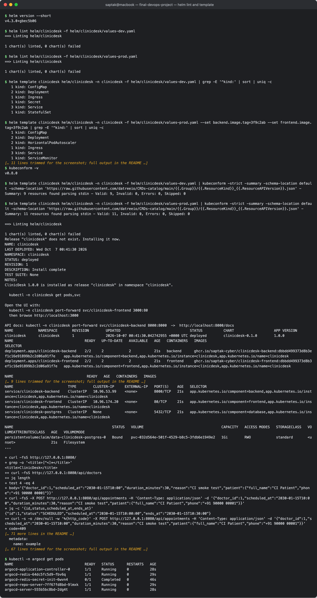

---

## 8. Terraform infrastructure

Files in [`terraform/`](./terraform): `versions.tf` (Terraform ≥ 1.10, AWS provider `~> 6.0`, default tags, commented S3 backend with native locking), `variables.tf`, `main.tf`, `outputs.tf`, `terraform.tfvars.example`, `.gitignore` (state, plans, real tfvars, `.terraform/`). `.terraform.lock.hcl` is committed so CI resolves the same provider builds.

What `main.tf` builds:

- **VPC** (`terraform-aws-modules/vpc` 6.7.3): `10.42.0.0/16`, 2 public + 2 private subnets in `ap-south-1a/b`, **one** NAT gateway (cheaper for a classroom; production would use one per AZ), subnet tags for load balancers.
- **EKS** (`terraform-aws-modules/eks` 21.26.0): cluster `clinicdesk-eks`, Kubernetes **1.36** (the current EKS default in `ap-south-1`), public endpoint (CIDRs configurable), the caller becomes cluster admin via an access entry, nodes in private subnets.
- **Managed node group** `general`: `t3.medium`, AL2023, on-demand, **min 1 / desired 2 / max 3**.
- **Add-ons**: `vpc-cni` and `eks-pod-identity-agent` before compute, `coredns`, `kube-proxy`, **`metrics-server`** (the HPA needs it) and **`aws-ebs-csi-driver`** with an IAM role through EKS Pod Identity (`terraform-aws-modules/eks-pod-identity` 2.9.0) and `defaultStorageClass.enabled`, so the PostgreSQL PVC binds to a gp3 volume.
- **Outputs**: VPC/subnet IDs, NAT IP, cluster name/endpoint/version, node groups, and `configure_kubectl` (the `aws eks update-kubeconfig` command).

### 8.1 init, fmt, validate, plan

```bash
cd terraform
source <path>/awsenv.sh          # exports AWS_ACCESS_KEY_ID / AWS_SECRET_ACCESS_KEY / region, kept outside the repo
terraform init && terraform fmt -recursive -check && terraform validate && terraform plan -out=tfplan
```

```
$ terraform version
Terraform v1.16.4
on darwin_arm64
+ provider registry.terraform.io/hashicorp/aws v6.67.0
+ provider registry.terraform.io/hashicorp/cloudinit v2.4.1
+ provider registry.terraform.io/hashicorp/null v3.3.2
+ provider registry.terraform.io/hashicorp/time v0.14.2
+ provider registry.terraform.io/hashicorp/tls v4.4.1

Your version of Terraform is out of date! The latest version
is 1.16.5. You can update by downloading from https://developer.hashicorp.com/terraform/install

$ aws sts get-caller-identity --query '{Account:Account,Arn:Arn}' --output table
----------------------------------------------------------------------
|                          GetCallerIdentity                         |
+--------------+-----------------------------------------------------+
|    Account   |                         Arn                         |
+--------------+-----------------------------------------------------+
|  <account-id>|  arn:aws:iam::<account-id>:user/terraform-sandbox   |
+--------------+-----------------------------------------------------+

$ terraform init -input=false
Initializing the backend...

Initializing modules...

Initializing provider plugins...
- Reusing previous version of hashicorp/time from the dependency lock file
- Reusing previous version of hashicorp/cloudinit from the dependency lock file
- Reusing previous version of hashicorp/null from the dependency lock file
- Reusing previous version of hashicorp/aws from the dependency lock file
- Reusing previous version of hashicorp/tls from the dependency lock file
- Using previously-installed hashicorp/time v0.14.2
- Using previously-installed hashicorp/cloudinit v2.4.1
- Using previously-installed hashicorp/null v3.3.2
- Using previously-installed hashicorp/aws v6.67.0
- Using previously-installed hashicorp/tls v4.4.1

Terraform has been successfully initialized!

You may now begin working with Terraform. Try running "terraform plan" to see
any changes that are required for your infrastructure. All Terraform commands
should now work.

If you ever set or change modules or backend configuration for Terraform,
rerun this command to reinitialize your working directory. If you forget, other
commands will detect it and remind you to do so if necessary.

$ terraform fmt -recursive -check && echo 'fmt: no changes needed'
fmt: no changes needed

$ terraform validate
Success! The configuration is valid.

$ terraform plan -input=false -out=tfplan
...
data.aws_availability_zones.available: Read complete after 0s [id=ap-south-1]
module.eks.module.eks_managed_node_group["general"].data.aws_ssm_parameter.ami[0]: Read complete after 4s [id=/aws/service/eks/optimized-ami/1.36/amazon-linux-2023/x86_64/standard/recommended/release_version]
...
  # module.eks.aws_eks_cluster.this[0] will be created
  + resource "aws_eks_cluster" "this" {
      + arn                           = (known after apply)
      + bootstrap_self_managed_addons = false
      + certificate_authority         = (known after apply)
      + cluster_id                    = (known after apply)
      + created_at                    = (known after apply)
      + deletion_protection           = (known after apply)
      + enabled_cluster_log_types     = [
          + "api",
          + "audit",
          + "authenticator",
        ]
      + endpoint                      = (known after apply)
      + id                            = (known after apply)
      + identity                      = (known after apply)
      + name                          = "clinicdesk-eks"
      + platform_version              = (known after apply)
      + region                        = "ap-south-1"
      + role_arn                      = (known after apply)
      + status                        = (known after apply)
      + tags_all                      = {
          + "Environment" = "dev"
          + "ManagedBy"   = "terraform"
          + "Owner"       = "saptak-banerjee"
          + "Project"     = "clinicdesk"
        }
      + version                       = "1.36"
...
Plan: 61 to add, 0 to change, 0 to destroy.

Changes to Outputs:
  + cluster_endpoint  = (known after apply)
  + cluster_name      = "clinicdesk-eks"
  + cluster_version   = "1.36"
  + configure_kubectl = "aws eks update-kubeconfig --region ap-south-1 --name clinicdesk-eks"
  + nat_public_ip     = [
      + (known after apply),
    ]
  + node_group_names  = [
      + "general",
    ]
  + private_subnets   = [
      + (known after apply),
      + (known after apply),
    ]
  + public_subnets    = [
      + (known after apply),
      + (known after apply),
    ]
  + region            = "ap-south-1"
  + vpc_id            = (known after apply)

─────────────────────────────────────────────────────────────────────────────

Saved the plan to: tfplan

To perform exactly these actions, run the following command to apply:
    terraform apply "tfplan"
```

```
$ terraform show -json tfplan | python3 -c 'import sys,json,collections; p=json.load(sys.stdin); c=collections.Counter(r["type"] for r in p["resource_changes"] if r["change"]["actions"]==["create"]); [print(f"{n:3} {t}") for t,n in c.most_common()]'
 12 aws_security_group_rule
  6 aws_iam_role_policy_attachment
  6 aws_eks_addon
  4 aws_route_table_association
  4 aws_subnet
  3 aws_iam_role
  2 aws_iam_policy
  2 aws_security_group
  2 aws_route
  2 aws_route_table
  1 aws_cloudwatch_log_group
  1 aws_eks_access_entry
  1 aws_eks_access_policy_association
  1 aws_eks_cluster
  1 aws_iam_openid_connect_provider
  1 time_sleep
  1 aws_default_network_acl
  1 aws_default_route_table
  1 aws_default_security_group
  1 aws_eip
  1 aws_internet_gateway
  1 aws_nat_gateway
  1 aws_vpc
  1 aws_eks_node_group
  1 aws_launch_template
  1 aws_kms_alias
  1 aws_kms_key
  1 null_resource

$ terraform show -json tfplan | python3 -c 'import sys,json; p=json.load(sys.stdin); [print(r["change"]["after"]["addon_name"]) for r in p["resource_changes"] if r["type"]=="aws_eks_addon"]'
eks-pod-identity-agent
vpc-cni
aws-ebs-csi-driver
coredns
kube-proxy
metrics-server

$ terraform show -json tfplan | python3 -c 'import sys,json; p=json.load(sys.stdin); [print(r["address"], r["change"]["after"].get("cidr_block"), r["change"]["after"].get("availability_zone")) for r in p["resource_changes"] if r["type"]=="aws_subnet"]'
module.vpc.aws_subnet.private[0] 10.42.10.0/24 ap-south-1a
module.vpc.aws_subnet.private[1] 10.42.11.0/24 ap-south-1b
module.vpc.aws_subnet.public[0] 10.42.0.0/24 ap-south-1a
module.vpc.aws_subnet.public[1] 10.42.1.0/24 ap-south-1b

$ terraform show -json tfplan | python3 -c 'import sys,json; p=json.load(sys.stdin); ng=[r for r in p["resource_changes"] if r["type"]=="aws_eks_node_group"][0]["change"]["after"]; print(ng["instance_types"], ng["capacity_type"], ng["ami_type"], ng["scaling_config"])'
['t3.medium'] ON_DEMAND AL2023_x86_64_STANDARD [{'desired_size': 2, 'max_size': 3, 'min_size': 1}]
```

**Screenshot:** 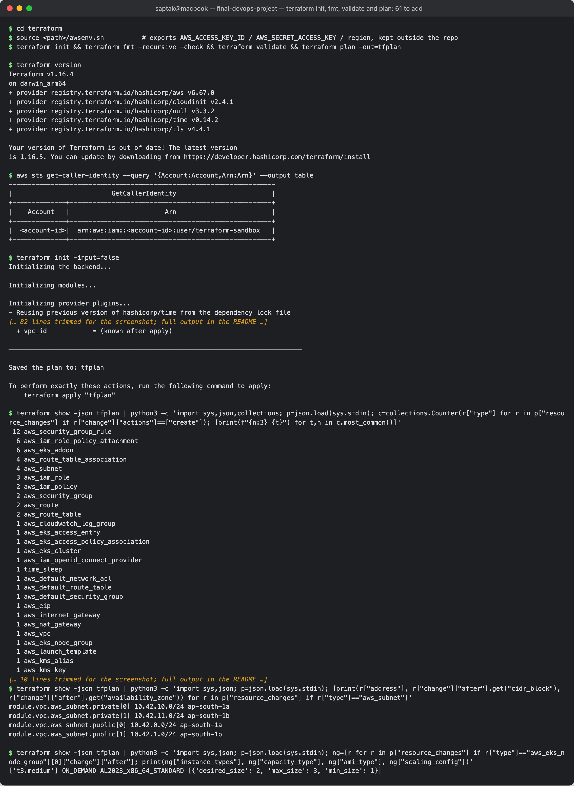

### 8.2 apply

`terraform apply -auto-approve` started at 00:00:36 UTC and finished about 14 minutes later. Key lines from the log (the EKS control plane alone took 9m22s):

```
$ terraform apply -input=false -auto-approve
...
module.vpc.aws_vpc.this[0]: Creation complete after 6s [id=vpc-0f9381d3113802879]
...
module.vpc.aws_nat_gateway.this[0]: Creation complete after 1m34s [id=nat-0e21f6bf3f9b7bb42]
...
module.eks.aws_eks_cluster.this[0]: Creation complete after 9m22s [id=clinicdesk-eks]
...
module.eks.aws_eks_addon.before_compute["vpc-cni"]: Creation complete after 24s [id=clinicdesk-eks:vpc-cni]
module.eks.aws_eks_addon.before_compute["eks-pod-identity-agent"]: Creation complete after 24s [id=clinicdesk-eks:eks-pod-identity-agent]
...
module.eks.module.eks_managed_node_group["general"].aws_eks_node_group.this[0]: Creation complete after 2m10s [id=clinicdesk-eks:general-edc31ae6f3ca4a6ec35968e3ca]
...
module.eks.aws_eks_addon.this["coredns"]: Creation complete after 14s [id=clinicdesk-eks:coredns]
module.eks.aws_eks_addon.this["kube-proxy"]: Creation complete after 24s [id=clinicdesk-eks:kube-proxy]
module.eks.aws_eks_addon.this["metrics-server"]: Creation complete after 45s [id=clinicdesk-eks:metrics-server]
module.eks.aws_eks_addon.this["aws-ebs-csi-driver"]: Creation complete after 46s [id=clinicdesk-eks:aws-ebs-csi-driver]

Apply complete! Resources: 61 added, 0 changed, 0 destroyed.

Outputs:

cluster_endpoint = "https://AB3C24F855B43AEA17EB3111B8FE391F.gr7.ap-south-1.eks.amazonaws.com"
cluster_name = "clinicdesk-eks"
cluster_version = "1.36"
configure_kubectl = "aws eks update-kubeconfig --region ap-south-1 --name clinicdesk-eks"
nat_public_ip = tolist([
  "13.127.190.208",
])
node_group_names = [
  "general",
]
private_subnets = [
  "subnet-084c1da5feb599be6",
  "subnet-0d38fc19c1917fb75",
]
public_subnets = [
  "subnet-0bcd0802ea1497c6e",
  "subnet-06c4ea229afd43d13",
]
region = "ap-south-1"
vpc_id = "vpc-0f9381d3113802879"
```

### 8.3 The cluster Terraform built

```bash
aws eks update-kubeconfig --region ap-south-1 --name clinicdesk-eks --kubeconfig <scratch>/eks-kubeconfig
export KUBECONFIG=<scratch>/eks-kubeconfig     # separate file: the default kubeconfig (minikube) is never touched
```

```
$ aws eks describe-cluster --name clinicdesk-eks --query 'cluster.{name:name,version:version,status:status,endpointPublic:resourcesVpcConfig.endpointPublicAccess,vpc:resourcesVpcConfig.vpcId}' --output table
---------------------------------------------
|              DescribeCluster              |
+-----------------+-------------------------+
|  endpointPublic |  True                   |
|  name           |  clinicdesk-eks         |
|  status         |  ACTIVE                 |
|  version        |  1.36                   |
|  vpc            |  vpc-0f9381d3113802879  |
+-----------------+-------------------------+

$ aws eks describe-nodegroup --cluster-name clinicdesk-eks --nodegroup-name $(aws eks list-nodegroups --cluster-name clinicdesk-eks --query 'nodegroups[0]' --output text) --query 'nodegroup.{status:status,instanceTypes:instanceTypes,amiType:amiType,scaling:scalingConfig}' --output json
{
    "status": "ACTIVE",
    "instanceTypes": [
        "t3.medium"
    ],
    "amiType": "AL2023_x86_64_STANDARD",
    "scaling": {
        "minSize": 1,
        "maxSize": 3,
        "desiredSize": 2
    }
}

$ aws eks list-addons --cluster-name clinicdesk-eks --output text
ADDONS	aws-ebs-csi-driver
ADDONS	coredns
ADDONS	eks-pod-identity-agent
ADDONS	kube-proxy
ADDONS	metrics-server
ADDONS	vpc-cni

$ kubectl get nodes -L node.kubernetes.io/instance-type,topology.kubernetes.io/zone
NAME                                         STATUS   ROLES    AGE     VERSION               INSTANCE-TYPE   ZONE
ip-10-42-10-35.ap-south-1.compute.internal   Ready    <none>   2m17s   v1.36.4-eks-3b4a6ca   t3.medium       ap-south-1a
ip-10-42-11-49.ap-south-1.compute.internal   Ready    <none>   2m17s   v1.36.4-eks-3b4a6ca   t3.medium       ap-south-1b

$ kubectl get nodes -o custom-columns='NODE:.metadata.name,MAX_PODS:.status.allocatable.pods,CPU:.status.allocatable.cpu,MEM:.status.allocatable.memory'
NODE                                         MAX_PODS   CPU     MEM
ip-10-42-10-35.ap-south-1.compute.internal   17         1930m   3372956Ki
ip-10-42-11-49.ap-south-1.compute.internal   17         1930m   3372960Ki

$ kubectl get storageclass
NAME                           PROVISIONER             RECLAIMPOLICY   VOLUMEBINDINGMODE      ALLOWVOLUMEEXPANSION   AGE
ebs-csi-default-sc (default)   ebs.csi.aws.com         Delete          WaitForFirstConsumer   true                   78s
gp2                            kubernetes.io/aws-ebs   Delete          WaitForFirstConsumer   false                  7m35s

$ kubectl get pods -A
NAMESPACE     NAME                                  READY   STATUS    RESTARTS   AGE
kube-system   aws-node-b2kqz                        2/2     Running   0          2m19s
kube-system   aws-node-fv9bc                        2/2     Running   0          2m19s
kube-system   coredns-78699fb6f8-gpd2c              1/1     Running   0          82s
kube-system   coredns-78699fb6f8-xzk82              1/1     Running   0          82s
kube-system   ebs-csi-controller-755d67cd74-bnp2s   6/6     Running   0          76s
kube-system   ebs-csi-controller-755d67cd74-cqvpn   6/6     Running   0          76s
kube-system   ebs-csi-node-bqq85                    3/3     Running   0          77s
kube-system   ebs-csi-node-j9flp                    3/3     Running   0          76s
kube-system   eks-pod-identity-agent-8z4gb          1/1     Running   0          2m19s
kube-system   eks-pod-identity-agent-9p9jd          1/1     Running   0          2m19s
kube-system   kube-proxy-6p5rh                      1/1     Running   0          84s
kube-system   kube-proxy-x6dpv                      1/1     Running   0          84s
kube-system   metrics-server-665685856d-2w8cx       1/1     Running   0          82s
kube-system   metrics-server-665685856d-rfwh8       1/1     Running   0          82s
```

Two t3.medium nodes in different AZs, all six add-ons running, and the `ebs-csi-default-sc` StorageClass marked default. The `MAX_PODS 17` per node (the VPC CNI gives each pod a real VPC IP, and a t3.medium has 3 ENIs × 6 IPs) turned out to matter: see section 13.1.

**Screenshot (from a re-apply on 2026-10-07):** 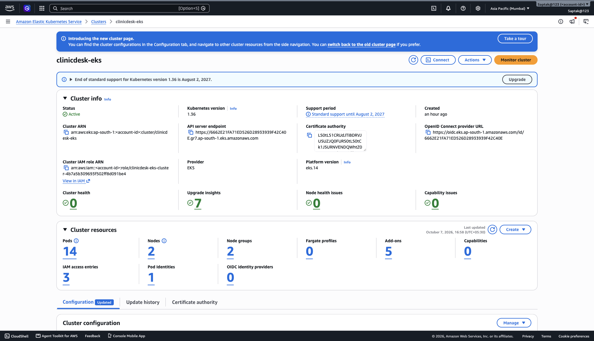

### 8.4 destroy

After the teardown in [Cleanup](#cleanup) removed everything Kubernetes had created in AWS (NLB, EBS volume), `terraform destroy` removed the 61 resources:

```
$ terraform destroy -input=false -auto-approve
...
Plan: 0 to add, 0 to change, 61 to destroy.
...
module.eks.aws_eks_addon.this["aws-ebs-csi-driver"]: Destruction complete after 9s
...
module.vpc.aws_nat_gateway.this[0]: Destruction complete after 1m19s
...
module.vpc.aws_eip.nat[0]: Destruction complete after 9s
...
module.eks.module.eks_managed_node_group["general"].aws_eks_node_group.this[0]: Destruction complete after 8m21s
...
module.eks.aws_eks_cluster.this[0]: Destruction complete after 2m31s
...
module.vpc.aws_vpc.this[0]: Destruction complete after 0s
...
Destroy complete! Resources: 61 destroyed.
```

`terraform destroy` started at 00:58:59 and finished at 01:11:07 UTC; most of that was draining and deleting the node group (8m21s). Total AWS lifetime of the stack: about 70 minutes (EKS control plane, two then three t3.medium nodes, one NAT gateway, one NLB, one 5 GiB gp3 volume).

---

**Screenshot:** 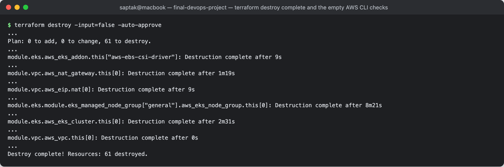

## 9. CI/CD pipeline

Workflow: [`.github/workflows/final-devops-project.yml`](../.github/workflows/final-devops-project.yml) at the repository root (GitHub only runs workflows from there); an identical copy is kept in [`final-devops-project/.github/workflows/`](./.github/workflows/final-devops-project.yml).

Triggers: push to `main` touching `final-devops-project/**` or the workflow (docs, screenshots and `gitops/` excluded), pull requests, and `workflow_dispatch`. `concurrency` never cancels a running pipeline, so a promotion can't be cut off half-way.

| # | Job | What it does | Gate |
| --- | --- | --- | --- |
| 1 | Test | `pytest -v` (23 tests) on Python 3.14; `npm ci` + `vite build` on Node 24 | any failing test stops everything |
| 2 | SAST | Bandit on the backend, Semgrep `p/python`, `p/react`, `p/dockerfile` | report → gate |
| 3 | SCA + IaC | `pip-audit`, `npm audit`, `trivy fs` on the lockfiles, `trivy config` on Kubernetes/Helm/Dockerfiles/Terraform | report → gate |
| 4 | Secret scan | gitleaks on the current files and the full git history of the project | report → gate |
| 5 | Docker build | matrix backend/frontend → image tarballs (GHA layer cache); fails if an image would run as root | |
| 6 | Image scan | Trivy on each tarball | report → gate |
| 7 | **Security gate** | `security/security_gate.py` applies `security/gate-policy.toml` to all nine reports; a missing report fails | **blocks push** |
| 8 | Push | pushes the **exact scanned tarballs** to GHCR as `ghcr.io/saptak-cyber/clinicdesk-{backend,frontend}:<commit SHA>` (no `latest`) | |
| 9 | Kubernetes deployment check | kind cluster in the runner: restricted namespace, server-side dry run of the raw manifests, `helm upgrade --install` with the pushed images, smoke test | |
| 10 | GitOps promote | rewrites both tags in `gitops/values-eks.yaml` to the SHA and pushes a `[skip ci]` commit (with rebase-retry for concurrent pushes) | |

Deployment to EKS is deliberately **not** a `kubectl`/`helm` step with cluster credentials in GitHub: the pipeline's last action is a Git commit, and Argo CD inside the cluster pulls it (section 12). No cloud or cluster secrets exist in the repository or its Actions settings; the only token used is the run's own `GITHUB_TOKEN` (`packages: write` for GHCR, `contents: write` only in job 10).

### 9.1 Runs

| Run | Commit | Result | Duration |
| --- | --- | --- | --- |
| [37550442829](https://github.com/Saptak-cyber/DevOps_Assignments/actions/runs/37550442829) | `e664e8a` first push of the project | success, promoted `e664e8a` | 4m22s |
| [37552034444](https://github.com/Saptak-cyber/DevOps_Assignments/actions/runs/37552034444) | `1c0ef7b` Argo CD sync fix | success, promoted `1c0ef7b` | 4m55s |
| [37552961415](https://github.com/Saptak-cyber/DevOps_Assignments/actions/runs/37552961415) | `dbbdd49` ClinicDesk 1.1.0 (GitOps demo) | success, promoted `dbbdd49` | ~4m25s |
| [37556012156](https://github.com/Saptak-cyber/DevOps_Assignments/actions/runs/37556012156) | `8d6553a` gitleaks allowlist (after the cluster was destroyed) | success, promoted `8d6553a` (no cluster was listening) | |

Job timings of the demo run (start → end, UTC):

```
$ gh run view 37552961415 --json jobs -q '.jobs[] | "\(.startedAt[11:19])-\(.completedAt[11:19])  \(.conclusion)  \(.name)"'
00:37:48-00:38:22  success  1. Test (pytest + frontend build)
00:38:24-00:39:12  success  3. SCA + IaC (pip-audit, npm audit, Trivy fs/config)
00:38:25-00:38:49  success  2. SAST (Bandit + Semgrep)
00:38:23-00:38:31  success  4. Secret scan (gitleaks)
00:39:14-00:39:42  success  5. Docker build (frontend)
00:39:15-00:39:46  success  5. Docker build (backend)
00:39:48-00:40:02  success  6. Image scan (frontend)
00:39:48-00:40:08  success  6. Image scan (backend)
00:40:10-00:40:19  success  7. Security gate
00:40:21-00:40:43  success  8. Push images to GHCR
00:40:45-00:42:02  success  9. Kubernetes deployment check (Helm on kind)
00:42:04-00:42:11  success  10. GitOps promote (bump gitops/values-eks.yaml)
```

Test job, from the same run:

```
============================== 23 passed in 0.64s ==============================
```

Push job: the two images and their registry digests:

```
Loaded image: ghcr.io/saptak-cyber/clinicdesk-backend:dbbdd499373d8b3ef1c16e91899b2c2d06a91f7e
dbbdd499373d8b3ef1c16e91899b2c2d06a91f7e: digest: sha256:368aea1a6f9cea0093d4c546e280f515f7ce6b910ee6c632e4bc8af4d7cae2a3 size: 2406
Loaded image: ghcr.io/saptak-cyber/clinicdesk-frontend:dbbdd499373d8b3ef1c16e91899b2c2d06a91f7e
dbbdd499373d8b3ef1c16e91899b2c2d06a91f7e: digest: sha256:156fdc86b6aa416e09505424874e7ade83eedd49ad6c53e6d9398192e9ea4668 size: 2403
```

GitOps promote job: the change it committed:

```
diff --git a/final-devops-project/gitops/values-eks.yaml b/final-devops-project/gitops/values-eks.yaml
index 6bc1c50..2b7d980 100644
--- a/final-devops-project/gitops/values-eks.yaml
+++ b/final-devops-project/gitops/values-eks.yaml
@@ -6,7 +6,7 @@
 # [skip ci], and Argo CD rolls that SHA out. Don't edit the tags by hand.
 backend:
   image:
-    tag: 1c0ef7bbbfa188f0cef89efe5156aedc5d932367
+    tag: dbbdd499373d8b3ef1c16e91899b2c2d06a91f7e
   autoscaling: # two t3.medium nodes: keep the HPA ceiling schedulable
     enabled: true
     minReplicas: 2
@@ -14,7 +14,7 @@ backend:
     targetCPUUtilizationPercentage: 60
 frontend:
   image:
-    tag: 1c0ef7bbbfa188f0cef89efe5156aedc5d932367
+    tag: dbbdd499373d8b3ef1c16e91899b2c2d06a91f7e
...
[main 2f649de] gitops(clinicdesk): promote dbbdd49 to EKS [skip ci]
 1 file changed, 2 insertions(+), 2 deletions(-)
```

**Screenshots:** 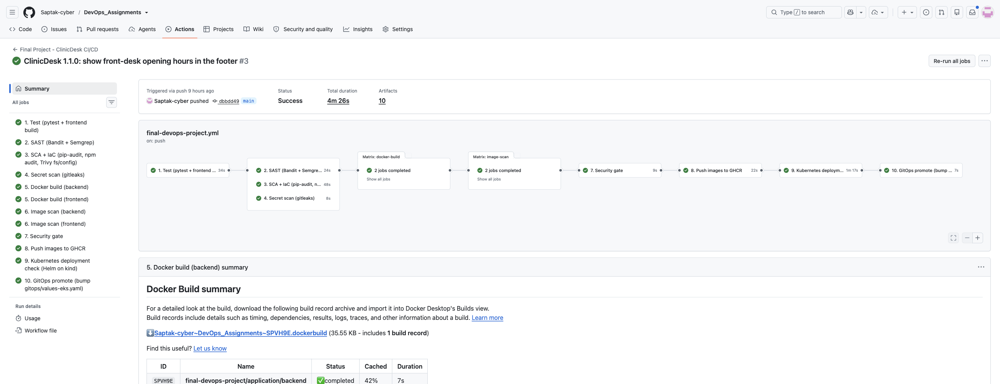 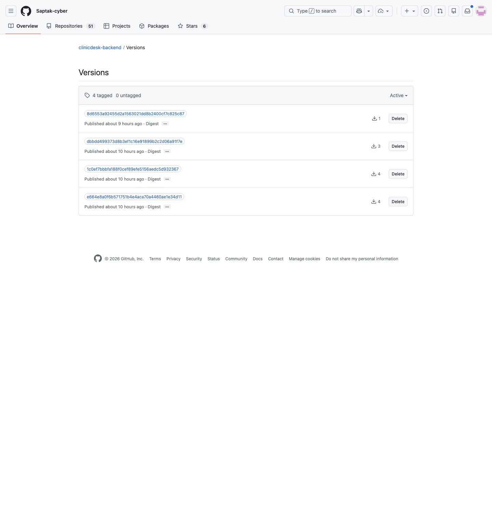

---

## 10. DevSecOps implementation

Five kinds of scanning, one decision point:

| Layer | Tool | Config | Where |
| --- | --- | --- | --- |
| SAST | Bandit 1.9.4 (Python), Semgrep 1.179.0 (`p/python`, `p/react`, `p/dockerfile`) | [`security/bandit.yml`](./security/bandit.yml) | CI job 2 |
| SCA | pip-audit 2.10.1, npm audit, Trivy fs | lockfiles | CI job 3 |
| IaC | Trivy config (Kubernetes manifests, Helm chart rendered with prod values, Dockerfiles, Terraform incl. downloaded modules) | [`security/trivy-config.yaml`](./security/trivy-config.yaml), accepted risks in [`security/trivyignore.yaml`](./security/trivyignore.yaml) | CI job 3 |
| Secrets | gitleaks 8.30.1, default rules + a rule for literal passwords in Kubernetes Secrets | [`security/gitleaks.toml`](./security/gitleaks.toml) | CI job 4 |
| Container images | Trivy 0.75.0 on both tarballs | | CI job 6 |
| **Gate** | [`security/security_gate.py`](./security/security_gate.py) + [`security/gate-policy.toml`](./security/gate-policy.toml) (adapted from my Session 17 gate) | thresholds per tool, fail-closed | CI job 7 |

The gate's verdict in the live-demo run:

```
Check               Verdict  Findings  (policy)
SAST - Bandit       PASS     HIGH=0 MEDIUM=0 LOW=0  (HIGH<=0 MEDIUM<=0 LOW<=any)
SAST - Semgrep      PASS     HIGH=0 MEDIUM=0 LOW=0  (HIGH<=0 MEDIUM<=0 LOW<=any)
SCA - pip-audit     PASS     VULN=0  (VULN<=0)
SCA - npm audit     PASS     CRITICAL=0 HIGH=0 MODERATE=0  (CRITICAL<=0 HIGH<=0 MODERATE<=0)
SCA - Trivy fs      PASS     CRITICAL=0 HIGH=0 CRITICAL_UNFIXED=0 HIGH_UNFIXED=0  (CRITICAL<=0 HIGH<=0 CRITICAL_UNFIXED<=0 HIGH_UNFIXED<=any)
IaC - Trivy config  PASS     CRITICAL=0 HIGH=0 MEDIUM=0  (CRITICAL<=0 HIGH<=0 MEDIUM<=any)
Secrets - gitleaks  PASS     FINDING=0  (FINDING<=0)
Image - backend     PASS     CRITICAL=0 HIGH=0 CRITICAL_UNFIXED=0 HIGH_UNFIXED=0  (CRITICAL<=0 HIGH<=0 CRITICAL_UNFIXED<=0 HIGH_UNFIXED<=0)
Image - frontend    PASS     CRITICAL=0 HIGH=0 CRITICAL_UNFIXED=0 HIGH_UNFIXED=0  (CRITICAL<=0 HIGH<=0 CRITICAL_UNFIXED<=0 HIGH_UNFIXED<=0)

SECURITY GATE: PASSED
```

Supporting lines from the scanner jobs in that run:

```
No known vulnerabilities found
No known vulnerabilities found
found 0 vulnerabilities
Semgrep findings: 0
Total gitleaks findings: 0
```

### 10.1 Real findings that were fixed or accepted

Running the scanners surfaced five real problems:

1. **Bandit B608 (SQL built from a string)** in `alembic/versions/0002_seed_doctors.py`, the migration's `downgrade()` built `DELETE ... IN ('a','b')` with an f-string. The values were constants, but the pattern is exactly what B608 exists to catch, so it now uses SQLAlchemy's `doctors.delete().where(doctors.c.full_name.in_(...))` with bound parameters. Verified with a real `upgrade` + `downgrade` on SQLite (doctors left: 0).
2. **Trivy KSV-0014 (root filesystem not read-only)** on the PostgreSQL StatefulSet, in both the raw manifest and the chart. Tested locally that `postgres:18-alpine` runs with `--read-only` plus tmpfs for `/tmp` and `/var/run/postgresql`, then made it read-only with two emptyDirs. All three containers now have read-only root filesystems.
3. **Trivy AWS-0040 / AWS-0041 (public EKS endpoint, open CIDR)** and **AWS-0104 (unrestricted node egress)** from inside the EKS module. These are needed for this setup (kubectl from a laptop, nodes pulling images through the NAT), so they are **accepted risks** in `security/trivyignore.yaml`, each with a written statement and an `expired_at: 2026-12-31`, after which the gate fails again until someone re-reviews them.
4. **gitleaks `curl-auth-user` in this README** (after the EKS run): a captured command `curl -u admin:"$(cat <file>)"` that read the temporary Grafana password from a local file. No credential value was ever written, but the pattern is exactly what the rule looks for and the commit (`b1bc8d3`) was already pushed. I removed the line and added a commit-scoped allowlist entry with the reason to `security/gitleaks.toml`, so the history scan stays meaningful for every other commit instead of being switched off.
5. **44 HIGH CVEs in the Debian-slim Python base** (Phase 1): all in OS packages the API never uses, none fixable. Switching to `python:3.14-alpine` took the backend to zero and cut the image from 346 MB to 212 MB.

Phase 1's local scans (kept for reference):

```
$ trivy --version | head -1
Version: 0.75.0

$ trivy image --severity HIGH,CRITICAL --exit-code 1 clinicdesk-backend:local; echo "exit code: $?"
2026-10-07T05:12:27+05:30	INFO	[vuln] Vulnerability scanning is enabled
2026-10-07T05:12:27+05:30	INFO	[secret] Secret scanning is enabled
2026-10-07T05:12:27+05:30	INFO	[secret] If your scanning is slow, please try '--scanners vuln' to disable secret scanning
2026-10-07T05:12:27+05:30	INFO	[secret] Please see https://trivy.dev/docs/v0.75/guide/scanner/secret#recommendation for faster secret detection
2026-10-07T05:12:28+05:30	INFO	Detected OS	family="alpine" version="3.24.2"
2026-10-07T05:12:28+05:30	INFO	[alpine] Detecting vulnerabilities...	os_version="3.24" repository="3.24" pkg_num=30
2026-10-07T05:12:28+05:30	INFO	Number of language-specific files	num=1
2026-10-07T05:12:28+05:30	INFO	[python-pkg] Detecting vulnerabilities...

Report Summary

┌──────────────────────────────────────────────────────────────────────────────────┬────────────┬─────────────────┬─────────┐
│                                      Target                                      │    Type    │ Vulnerabilities │ Secrets │
├──────────────────────────────────────────────────────────────────────────────────┼────────────┼─────────────────┼─────────┤
│ clinicdesk-backend:local (alpine 3.24.2)                                         │   alpine   │        0        │    -    │
├──────────────────────────────────────────────────────────────────────────────────┼────────────┼─────────────────┼─────────┤
...
│ opt/venv/lib/python3.14/site-packages/uvloop-0.23.0.dist-info/METADATA           │ python-pkg │        0        │    -    │
├──────────────────────────────────────────────────────────────────────────────────┼────────────┼─────────────────┼─────────┤
│ opt/venv/lib/python3.14/site-packages/watchfiles-1.3.0.dist-info/METADATA        │ python-pkg │        0        │    -    │
├──────────────────────────────────────────────────────────────────────────────────┼────────────┼─────────────────┼─────────┤
│ opt/venv/lib/python3.14/site-packages/websockets-17.2.dist-info/METADATA         │ python-pkg │        0        │    -    │
└──────────────────────────────────────────────────────────────────────────────────┴────────────┴─────────────────┴─────────┘
Legend:
- '-': Not scanned
- '0': Clean (no security findings detected)

exit code: 0

$ trivy image --severity HIGH,CRITICAL --exit-code 1 clinicdesk-frontend:local; echo "exit code: $?"
2026-10-07T05:12:28+05:30	INFO	[vuln] Vulnerability scanning is enabled
2026-10-07T05:12:28+05:30	INFO	[secret] Secret scanning is enabled
2026-10-07T05:12:28+05:30	INFO	[secret] If your scanning is slow, please try '--scanners vuln' to disable secret scanning
2026-10-07T05:12:28+05:30	INFO	[secret] Please see https://trivy.dev/docs/v0.75/guide/scanner/secret#recommendation for faster secret detection
2026-10-07T05:12:28+05:30	INFO	Detected OS	family="alpine" version="3.24.2"
2026-10-07T05:12:28+05:30	INFO	[alpine] Detecting vulnerabilities...	os_version="3.24" repository="3.24" pkg_num=21
2026-10-07T05:12:28+05:30	INFO	Number of language-specific files	num=0

Report Summary

┌───────────────────────────────────────────┬────────┬─────────────────┬─────────┐
│                  Target                   │  Type  │ Vulnerabilities │ Secrets │
├───────────────────────────────────────────┼────────┼─────────────────┼─────────┤
│ clinicdesk-frontend:local (alpine 3.24.2) │ alpine │        0        │    -    │
└───────────────────────────────────────────┴────────┴─────────────────┴─────────┘
Legend:
- '-': Not scanned
- '0': Clean (no security findings detected)

exit code: 0
```

```
$ trivy image --quiet --severity HIGH,CRITICAL clinicdesk-backend:local      # first build, python:3.14-slim
...
clinicdesk-backend:local (debian 13.7)
======================================
Total: 44 (HIGH: 44, CRITICAL: 0)
```

```
$ pip-audit --version
pip-audit 2.10.1

$ pip-audit --cache-dir <scratch>/pipaudit-cache -r backend/requirements.txt
No known vulnerabilities found

$ pip-audit --cache-dir <scratch>/pipaudit-cache -r backend/requirements-dev.txt
No known vulnerabilities found

$ cd frontend && npm audit; cd ..
found 0 vulnerabilities
```

### 10.2 Hardening in the artefacts

Non-root users in both images; read-only root filesystems, `drop: [ALL]` capabilities, `allowPrivilegeEscalation: false`, `seccompProfile: RuntimeDefault` and `automountServiceAccountToken: false` on every pod; `restricted` Pod Security on the namespace (enforced in CI and on EKS); no Secret values in Git (template + `kubectl create secret`, or `existingSecret` in Helm); security headers + CSP from nginx; PostgreSQL never exposed outside the cluster; the pipeline pushes the scanned tarball itself, so what was scanned is byte-for-byte what runs; GitHub has no cluster credentials at all (pull-based GitOps).

**Screenshot:** 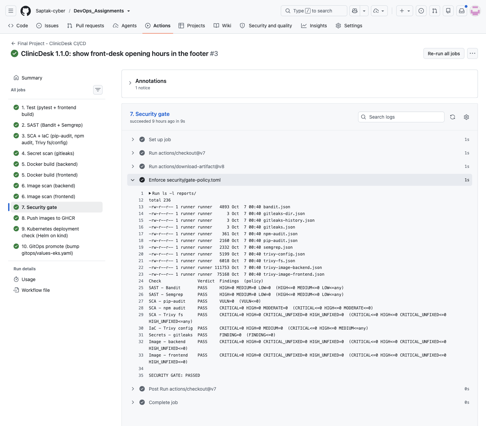

---

## 11. Monitoring

### 11.1 Metrics endpoint

The backend exposes Prometheus metrics at `/metrics` (`prometheus-fastapi-instrumentator`, grouped by handler template, method and status class; `/health`, `/ready` and `/metrics` are excluded so probes don't drown real traffic). Phase 1 capture:

```
$ curl -s localhost:8000/metrics | grep -E '^http_requests_total'
http_requests_total{handler="/api/doctors",method="GET",status="2xx"} 1.0
http_requests_total{handler="/api/appointments",method="POST",status="2xx"} 12.0
http_requests_total{handler="/api/appointments/{appointment_id}",method="GET",status="2xx"} 1.0
http_requests_total{handler="/api/appointments",method="POST",status="4xx"} 2.0
http_requests_total{handler="/api/appointments/{appointment_id}",method="PUT",status="2xx"} 2.0
http_requests_total{handler="/api/appointments/{appointment_id}/cancel",method="POST",status="2xx"} 1.0
http_requests_total{handler="/api/appointments/{appointment_id}/cancel",method="POST",status="4xx"} 1.0
http_requests_total{handler="/api/appointments/{appointment_id}",method="DELETE",status="2xx"} 1.0
http_requests_total{handler="/api/appointments/{appointment_id}",method="GET",status="4xx"} 1.0
http_requests_total{handler="/api/appointments",method="GET",status="2xx"} 1.0
http_requests_total{handler="/api/stats",method="GET",status="2xx"} 1.0

$ curl -s localhost:8000/metrics | grep -E '^http_request_duration_seconds_(count|sum)\{handler="/api/appointments",method="POST"'
http_request_duration_seconds_count{handler="/api/appointments",method="POST"} 14.0
http_request_duration_seconds_sum{handler="/api/appointments",method="POST"} 0.13406608499963113
```

**Screenshot:** 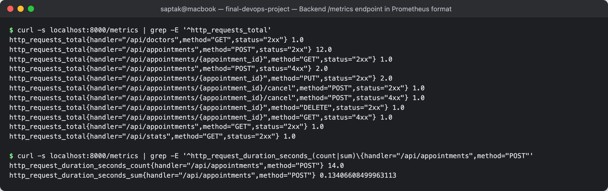

### 11.2 Prometheus and Grafana on EKS

[`monitoring/kube-prometheus-stack-values.yaml`](./monitoring/kube-prometheus-stack-values.yaml): Prometheus selects ServiceMonitors and PrometheusRules from every namespace, 24 h retention on an emptyDir, Alertmanager off (rules are still evaluated) to save pod slots, Grafana admin password supplied at install time and never committed, and the Grafana dashboard sidecar watching ConfigMaps labelled `grafana_dashboard`. The chart's ServiceMonitor scrapes the backend Service's `http` port every 15 s; its PrometheusRule adds a recording rule and three alerts (backend down, > 5 % 5xx, p95 > 1 s). [`monitoring/grafana-dashboard-clinicdesk.yaml`](./monitoring/grafana-dashboard-clinicdesk.yaml) is the 8-panel dashboard.

```
$ kubectl -n clinicdesk get servicemonitor,prometheusrule
NAME                                                      AGE
servicemonitor.monitoring.coreos.com/clinicdesk-backend   10m

NAME                                                      AGE
prometheusrule.monitoring.coreos.com/clinicdesk-backend   10m

$ curl -s 'http://127.0.0.1:9090/api/v1/targets?state=active' | python3 -c 'import sys,json; [print(t["labels"]["job"], t["scrapeUrl"], t["health"], t["lastScrapeDuration"]) for t in json.load(sys.stdin)["data"]["activeTargets"] if t["labels"].get("namespace")=="clinicdesk"]'
clinicdesk-backend http://10.42.10.223:8000/metrics up 0.004919956
clinicdesk-backend http://10.42.11.36:8000/metrics up 0.003738506

$ curl -s http://127.0.0.1:9090/api/v1/query --data-urlencode 'query=sum by (handler, method, status) (increase(http_requests_total{namespace="clinicdesk"}[10m]))' | python3 -c 'import sys,json; [print(r["metric"], round(float(r["value"][1]),1)) for r in json.load(sys.stdin)["data"]["result"]]'
{'handler': '/api/appointments', 'method': 'POST', 'status': '2xx'} 0.0
{'handler': '/api/stats', 'method': 'GET', 'status': '2xx'} 0.0
{'handler': '/api/doctors', 'method': 'GET', 'status': '2xx'} 0.0

$ curl -s http://127.0.0.1:9090/api/v1/rules | python3 -c 'import sys,json; [print(g["name"], [(r["name"], r.get("state", r["health"])) for r in g["rules"]]) for g in json.load(sys.stdin)["data"]["groups"] if g["name"].startswith("clinicdesk")]'
clinicdesk.backend [('clinicdesk:http_requests:rate5m', 'ok'), ('ClinicDeskBackendDown', 'inactive'), ('ClinicDeskHigh5xxRate', 'inactive'), ('ClinicDeskSlowRequests', 'inactive')]
```

Both backend pods are `up` targets, scraped in 4–5 ms, and the alert rules are loaded (`inactive` = healthy). The `increase()` values are 0 at this point only because the counters were minutes old; during the load test the same metric read about 72 requests per second per endpoint. Grafana's own API, with the panel query evaluated server-side over the last 15 minutes (the load test window):

```
$ curl -s -u "admin:$GF_PASS" http://127.0.0.1:3001/api/health
{
  "database": "ok",
  "version": "13.2.3",
  "commit": "90ffed056f0884267356c12a0eeb72a022af53f1"
}
$ curl -s -u "admin:$GF_PASS" 'http://127.0.0.1:3001/api/search?query=ClinicDesk' | python3 -m json.tool
[
    {
        "id": 4445628865470464,
        "uid": "clinicdesk",
        "orgId": 1,
        "title": "ClinicDesk API",
        "uri": "db/clinicdesk-api",
        "url": "/d/clinicdesk/clinicdesk-api",
        "slug": "",
        "type": "dash-db",
        "tags": [
            "clinicdesk"
        ],
        "isStarred": false,
        "sortMeta": 0,
        "isDeleted": false
    }
]

$ curl -s -u "admin:$GF_PASS" http://127.0.0.1:3001/api/dashboards/uid/clinicdesk | python3 -c 'import sys,json; d=json.load(sys.stdin)["dashboard"]; [print(p["id"], p["title"]) for p in d["panels"]]'
1 Requests per second by endpoint
2 Error ratio (4xx / 5xx)
3 Latency p50 / p95
4 Backend replicas (HPA)
5 CPU by pod (cores)
6 Memory by pod
7 Backend targets up
8 Appointments booked (POST 2xx, 1h)

$ curl -s -u "admin:$GF_PASS" -H 'Content-Type: application/json' http://127.0.0.1:3001/api/ds/query -d '{"from":"now-15m","to":"now","queries":[{"refId":"A","datasource":{"type":"prometheus","uid":"prometheus"},"expr":"sum by (handler) (rate(http_requests_total{namespace=\"clinicdesk\"}[1m]))","intervalMs":60000,"maxDataPoints":15}]}' | python3 -c 'import sys,json; f=json.load(sys.stdin)["results"]["A"]["frames"]; [print(fr["schema"]["fields"][1]["labels"], "max req/s =", round(max(v for v in fr["data"]["values"][1] if v is not None),1), "points =", len(fr["data"]["values"][1])) for fr in f]'
{'handler': '/api/appointments'} max req/s = 76.4 points = 5
{'handler': '/api/doctors'} max req/s = 0.0 points = 5
{'handler': '/api/stats'} max req/s = 77.0 points = 5
```

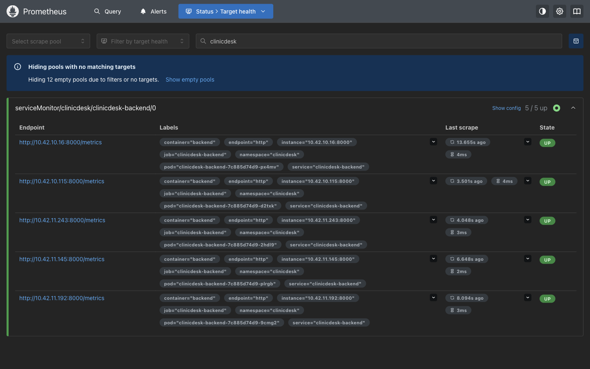

The dashboard during and after the load test: request rate per endpoint rising to ~76 req/s, p95 latency settling around 450 ms under load, the HPA replica panel stepping from 2 to 5, and CPU per pod. (Error ratio shows "No data" because there were no 4xx/5xx responses in the window.)

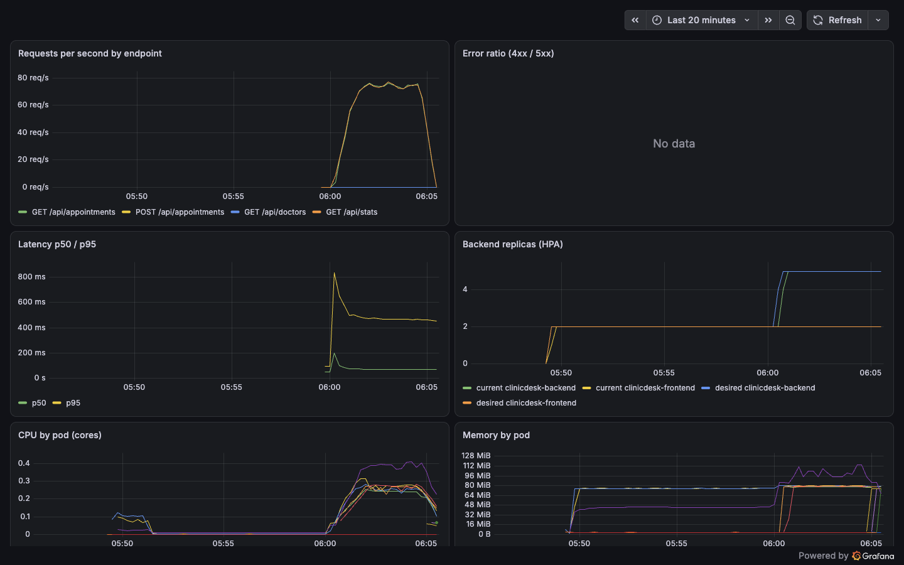

### 11.3 Logs

Application logs go to stdout (Uvicorn access log + the app's `clinicdesk` logger) and are read with `kubectl logs`; troubleshooting issues 4 and 7 (section 13) use them, e.g. the backend logging `readiness check failed: OperationalError` and its `/ready` probe returning 503 while PostgreSQL was down. ingress-nginx's access log (used in issues 3 and 5) records, for every request, the upstream `namespace-service-port` it chose and the pod IP it reached.

---

## 12. GitOps

### 12.1 Design

- **Git is the source of truth** for what runs on EKS: the Helm chart plus [`gitops/values-eks.yaml`](./gitops/values-eks.yaml).
- **CI writes, the cluster pulls.** The pipeline's last job edits only the two image tags in `values-eks.yaml` and commits with `[skip ci]`. Argo CD in the cluster polls the repo every 60 s and reconciles.
- **The Application lives outside the synced path** ([`gitops/argocd/clinicdesk-application.yaml`](./gitops/argocd/clinicdesk-application.yaml)): `automated` with `prune` and `selfHeal`, `ServerSideApply`, retries, and `ignoreDifferences` for `Deployment.spec.replicas` (owned by the HPAs) and the status stub the API server adds to StatefulSet claim templates.
- Argo CD itself is trimmed for a small cluster ([`gitops/argocd/argocd-values.yaml`](./gitops/argocd/argocd-values.yaml)): no Dex, no notifications, no ApplicationSet controller.

### 12.2 Bootstrap on EKS

```
$ kubectl apply -f kubernetes/00-namespace.yaml
namespace/clinicdesk created

$ kubectl -n clinicdesk create secret generic clinicdesk-db --from-literal=username=clinicdesk --from-literal=password="$(openssl rand -base64 24)"
secret/clinicdesk-db created

$ kubectl -n clinicdesk get secret clinicdesk-db -o jsonpath='{.data}' | python3 -c 'import sys,json; print(sorted(json.load(sys.stdin)))'
['password', 'username']

$ kubectl apply -f monitoring/grafana-dashboard-clinicdesk.yaml
configmap/grafana-dashboard-clinicdesk created

$ kubectl apply -f gitops/argocd/clinicdesk-application.yaml
Warning: metadata.finalizers: "resources-finalizer.argocd.argoproj.io": prefer a domain-qualified finalizer name including a path (/) to avoid accidental conflicts with other finalizer writers
application.argoproj.io/clinicdesk created

$ kubectl -n argocd get applications.argoproj.io
NAME         SYNC STATUS   HEALTH STATUS
clinicdesk   OutOfSync     Progressing
```

The first sync deployed everything and reported `Healthy`, but stayed `OutOfSync` on one object:

```
$ kubectl -n argocd get application clinicdesk -o json | python3 -c '...print resources whose status != Synced...'
StatefulSet clinicdesk-postgres OutOfSync None
successfully synced (all tasks run)
```

The live StatefulSet showed why: the API server fills in `apiVersion`, `kind`, `volumeMode: Filesystem` and a `status: {phase: Pending}` stub inside `volumeClaimTemplates`, which the chart did not have, so the diff never closed. Fix (commit `1c0ef7b`): spell those three fields out in the chart and ignore the status stub in the Application. After that commit went through the pipeline:

```
$ kubectl -n argocd get application clinicdesk -o wide
NAME         SYNC STATUS   HEALTH STATUS   REVISION                                   PROJECT
clinicdesk   Synced        Healthy         1c0ef7bbbfa188f0cef89efe5156aedc5d932367   default
```

### 12.3 Live demo: commit → pipeline → Argo CD → new SHA on EKS

The change: commit [`dbbdd49`](https://github.com/Saptak-cyber/DevOps_Assignments/commit/dbbdd499373d8b3ef1c16e91899b2c2d06a91f7e) "ClinicDesk 1.1.0: show front-desk opening hours in the footer" (backend version 1.0.0 → 1.1.0, new footer sentence in the UI).

**Before** (Argo CD at the previous promotion commit, both Deployments on `1c0ef7b…`):

```
$ kubectl -n argocd get application clinicdesk -o jsonpath='{.status.sync.revision}{"  "}{.status.sync.status}{"/"}{.status.health.status}{"\n"}'
b7d8743587f2953a57fd16cb5223995bdb96af59  Synced/Healthy

$ kubectl -n clinicdesk get deploy -o custom-columns='DEPLOYMENT:.metadata.name,IMAGE:.spec.template.spec.containers[0].image'
DEPLOYMENT            IMAGE
clinicdesk-backend    ghcr.io/saptak-cyber/clinicdesk-backend:1c0ef7bbbfa188f0cef89efe5156aedc5d932367
clinicdesk-frontend   ghcr.io/saptak-cyber/clinicdesk-frontend:1c0ef7bbbfa188f0cef89efe5156aedc5d932367

$ kubectl -n clinicdesk exec deploy/clinicdesk-backend -- python -c "import urllib.request as u; print(u.urlopen('http://127.0.0.1:8000/').read().decode())"
{"service":"ClinicDesk API","version":"1.0.0","environment":"production","docs":"/docs"}

$ curl -s http://af19c79de2b19413687ba24f921db8e7-73d069dbd13cef3a.elb.ap-south-1.amazonaws.com/ | grep -oE '/assets/index-[^"]+\.js' | head -1 | xargs -I{} curl -s http://af19c79de2b19413687ba24f921db8e7-73d069dbd13cef3a.elb.ap-south-1.amazonaws.com{} | grep -o 'Front desk open[^"]*' || echo 'footer text not present yet'
footer text not present yet
```

**Pipeline**: [run 37552961415](https://github.com/Saptak-cyber/DevOps_Assignments/actions/runs/37552961415) went green in about 4.5 minutes, pushed `:dbbdd499…` to GHCR and its promote job committed [`2f649de`](https://github.com/Saptak-cyber/DevOps_Assignments/commit/2f649de09d66ef904200e5860cd3f3b755d3264d) `gitops(clinicdesk): promote dbbdd49 to EKS [skip ci]` (diff in section 9.1).

**Rollout**, watched from the cluster (the first revision shown, `7a58acc`, is a newer `main` commit from another session folder; Argo CD tracks the branch head):

```
$ # Argo CD polls Git every 60 s; watch until it reports the promotion commit and the rollout finishes
[00:42:43] app=7a58acc159a01e2832fd26311d73cc32c9005196 Synced/Healthy backend=1c0ef7bbbfa188f0cef89efe5156aedc5d932367 updated=2/2
[00:43:05] app=7a58acc159a01e2832fd26311d73cc32c9005196 Synced/Healthy backend=1c0ef7bbbfa188f0cef89efe5156aedc5d932367 updated=2/2
[00:43:18] app=7a58acc159a01e2832fd26311d73cc32c9005196 Synced/Healthy backend=1c0ef7bbbfa188f0cef89efe5156aedc5d932367 updated=2/2
[00:43:42] app=7a58acc159a01e2832fd26311d73cc32c9005196 Synced/Healthy backend=1c0ef7bbbfa188f0cef89efe5156aedc5d932367 updated=2/2
[00:44:03] app=2f649de09d66ef904200e5860cd3f3b755d3264d Synced/Progressing backend=dbbdd499373d8b3ef1c16e91899b2c2d06a91f7e updated=1/3
[00:44:19] app=2f649de09d66ef904200e5860cd3f3b755d3264d Synced/Degraded backend=dbbdd499373d8b3ef1c16e91899b2c2d06a91f7e updated=2/3
[00:44:33] app=2f649de09d66ef904200e5860cd3f3b755d3264d Synced/Degraded backend=dbbdd499373d8b3ef1c16e91899b2c2d06a91f7e updated=2/2
[00:44:48] app=2f649de09d66ef904200e5860cd3f3b755d3264d Synced/Healthy backend=dbbdd499373d8b3ef1c16e91899b2c2d06a91f7e updated=2/2
```

**After**:

```
$ kubectl -n argocd get application clinicdesk -o jsonpath='{.status.sync.revision}{"  "}{.status.sync.status}{"/"}{.status.health.status}{"\n"}'
2f649de09d66ef904200e5860cd3f3b755d3264d  Synced/Healthy

$ kubectl -n clinicdesk get deploy -o custom-columns='DEPLOYMENT:.metadata.name,IMAGE:.spec.template.spec.containers[0].image'
DEPLOYMENT            IMAGE
clinicdesk-backend    ghcr.io/saptak-cyber/clinicdesk-backend:dbbdd499373d8b3ef1c16e91899b2c2d06a91f7e
clinicdesk-frontend   ghcr.io/saptak-cyber/clinicdesk-frontend:dbbdd499373d8b3ef1c16e91899b2c2d06a91f7e

$ kubectl -n clinicdesk get pods -o custom-columns='POD:.metadata.name,IMAGE:.spec.containers[0].image,READY:.status.containerStatuses[0].ready'
POD                                    IMAGE                                                                               READY
clinicdesk-backend-5f4f86d86-9twwj     ghcr.io/saptak-cyber/clinicdesk-backend:dbbdd499373d8b3ef1c16e91899b2c2d06a91f7e    true
clinicdesk-backend-5f4f86d86-k2r4n     ghcr.io/saptak-cyber/clinicdesk-backend:dbbdd499373d8b3ef1c16e91899b2c2d06a91f7e    true
clinicdesk-frontend-59c866f9d4-527b4   ghcr.io/saptak-cyber/clinicdesk-frontend:dbbdd499373d8b3ef1c16e91899b2c2d06a91f7e   true
clinicdesk-frontend-59c866f9d4-77bkd   ghcr.io/saptak-cyber/clinicdesk-frontend:dbbdd499373d8b3ef1c16e91899b2c2d06a91f7e   true
clinicdesk-postgres-0                  postgres:18-alpine                                                                  true

$ kubectl -n clinicdesk exec deploy/clinicdesk-backend -- python -c "import urllib.request as u; print(u.urlopen('http://127.0.0.1:8000/').read().decode())"
{"service":"ClinicDesk API","version":"1.1.0","environment":"production","docs":"/docs"}

$ curl -s http://af19c79de2b19413687ba24f921db8e7-73d069dbd13cef3a.elb.ap-south-1.amazonaws.com/ | grep -oE '/assets/index-[^"]+\.js' | head -1 | xargs -I{} curl -s http://af19c79de2b19413687ba24f921db8e7-73d069dbd13cef3a.elb.ap-south-1.amazonaws.com{} | grep -oE 'Front desk open [^.]+\.'
Front desk open 08:00 to 20:00, Monday to Saturday.

$ kubectl -n clinicdesk rollout history deploy/clinicdesk-backend
deployment.apps/clinicdesk-backend 
REVISION  CHANGE-CAUSE
1         <none>
2         <none>
3         <none>
```

| | Before | After |
| --- | --- | --- |
| Git revision synced by Argo CD | `b7d8743` (promote 1c0ef7b) | `2f649de` (promote dbbdd49) |
| backend image | `clinicdesk-backend:1c0ef7bbbfa188f0cef89efe5156aedc5d932367` | `clinicdesk-backend:dbbdd499373d8b3ef1c16e91899b2c2d06a91f7e` |
| frontend image | `clinicdesk-frontend:1c0ef7bbbfa188f0cef89efe5156aedc5d932367` | `clinicdesk-frontend:dbbdd499373d8b3ef1c16e91899b2c2d06a91f7e` |
| API `/` version | `1.0.0` | `1.1.0` |
| UI footer through the NLB | (no opening hours) | `Front desk open 08:00 to 20:00, Monday to Saturday.` |

From `git push` (00:37:44) to the new pods serving (00:44:48): about 7 minutes, of which 4.5 were the pipeline and up to 60 s the Argo CD poll interval. The application went briefly `Degraded` during the rollout: Argo CD's HPA health check reports Degraded while the HPA cannot read metrics for brand-new, not-yet-ready pods, and it cleared on its own.

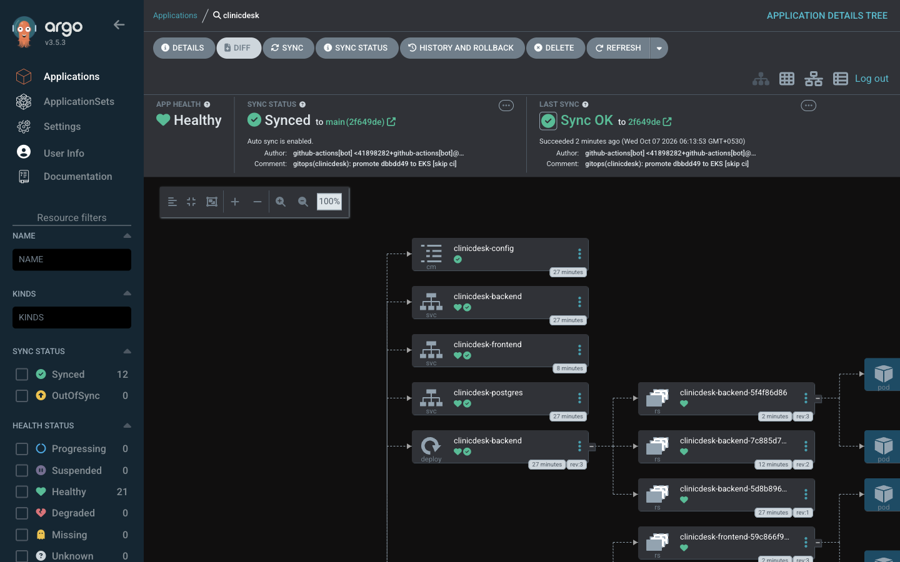

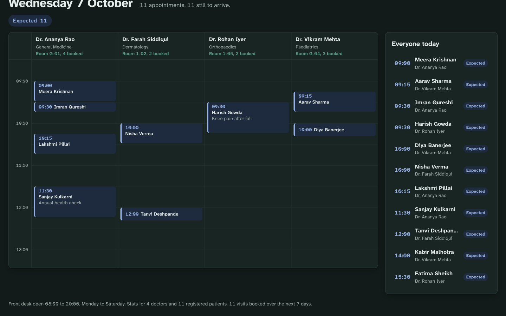

### 12.4 Self-heal

Two manual changes to live objects, then nothing else:

```
$ kubectl -n clinicdesk get configmap clinicdesk-config -o jsonpath='{.data.LOG_LEVEL}{"\n"}'
INFO

$ kubectl -n clinicdesk patch configmap clinicdesk-config --type merge -p '{"data":{"LOG_LEVEL":"DEBUG"}}'
configmap/clinicdesk-config patched

$ kubectl -n clinicdesk delete service clinicdesk-frontend
service "clinicdesk-frontend" deleted from clinicdesk namespace

$ sleep 3; kubectl -n argocd get application clinicdesk -o jsonpath='{.status.sync.status}{"/"}{.status.health.status}{"\n"}'
Synced/Healthy

$ # poll every 5 s until Argo CD has put both objects back
[00:38:10] LOG_LEVEL=INFO  svc/clinicdesk-frontend created=2026-10-07T00:38:04Z

$ kubectl -n argocd get application clinicdesk -o jsonpath='{.status.sync.status}{"/"}{.status.health.status}{"\n"}'
Synced/Healthy

$ kubectl -n argocd get application clinicdesk -o json | python3 -c 'import sys,json; h=json.load(sys.stdin)["status"]["operationState"]; print(h["phase"], h["message"]); [print(" ", r["kind"], r["name"], r["status"], r["message"]) for r in h["syncResult"]["resources"] if r["kind"] in ("ConfigMap","Service") and "frontend" in r["name"] or r["kind"]=="ConfigMap"]'
Succeeded successfully synced (all tasks run)
  Service clinicdesk-frontend Synced service/clinicdesk-frontend serverside-applied

$ curl -s -o /dev/null -w 'HTTP %{http_code}\n' http://af19c79de2b19413687ba24f921db8e7-73d069dbd13cef3a.elb.ap-south-1.amazonaws.com/
HTTP 200

$ kubectl -n argocd get events --field-selector involvedObject.name=clinicdesk --sort-by=.lastTimestamp | tail -6
23s         Normal   OperationCompleted   application/clinicdesk   Partial sync operation to b7d8743587f2953a57fd16cb5223995bdb96af59 succeeded
23s         Normal   ResourceUpdated      application/clinicdesk   Updated sync status: OutOfSync -> Synced
22s         Normal   ResourceUpdated      application/clinicdesk   Updated sync status: Synced -> OutOfSync
21s         Normal   OperationStarted     application/clinicdesk   Initiated automated sync to 'b7d8743587f2953a57fd16cb5223995bdb96af59'
21s         Normal   OperationCompleted   application/clinicdesk   Partial sync operation to b7d8743587f2953a57fd16cb5223995bdb96af59 succeeded
21s         Normal   ResourceUpdated      application/clinicdesk   Updated sync status: OutOfSync -> Synced
```

Argo CD noticed the drift and reverted **both** within about 6 seconds: `LOG_LEVEL` went back to `INFO` and the deleted Service was recreated (new `creationTimestamp`), with the UI still answering 200. (A `kubectl scale` would not have been a fair test here: replicas are deliberately owned by the HPA, not Git.)

---

## 13. Troubleshooting

The Final Troubleshooting Challenge was run on the live EKS cluster. For issues 2–7 I first paused Argo CD's automated sync (otherwise self-heal reverts a broken object within seconds, as section 12.4 shows), introduced one fault at a time with `kubectl`, and fixed it the way an on-call engineer would. Issue 1 was not planned: it happened on its own.

```
$ kubectl -n argocd patch application clinicdesk --type merge -p '{"spec":{"syncPolicy":{"automated":null}}}'
application.argoproj.io/clinicdesk patched

$ kubectl -n argocd get application clinicdesk -o jsonpath='{.spec.syncPolicy}{"\n"}'
{"retry":{"backoff":{"duration":"10s","factor":2,"maxDuration":"3m"},"limit":5},"syncOptions":["CreateNamespace=false","ServerSideApply=true","RespectIgnoreDifferences=true"]}
```

| # | Symptom | Root cause | Fix |
| --- | --- | --- | --- |
| 1 | New pods `Pending` during a rollout + HPA scale-up | Both t3.medium nodes at the VPC CNI limit of 17 pods | Scale the node group to 3 (within the Terraform max) |
| 2 | Rollout stuck, `ErrImagePull` / `ImagePullBackOff` | Image tag that doesn't exist in GHCR | `kubectl rollout undo` |
| 3 | UI returns 503 through the NLB, pods all Running | Service selector doesn't match the pods' labels → no endpoints | Restore the selector |
| 4 | New backend pod in `CreateContainerConfigError` | `secretKeyRef` points at a key the Secret doesn't have | Point back at `password` |
| 5 | `/` works, `/api/*` returns 503 | Ingress sends `/api` to Service port 8080; the Service only has 8000 (`http`) | Reference the port by name |
| 6 | HPA `cpu: <unknown>/75%` | Container has no CPU request, so utilisation can't be computed | Restore `resources.requests` |
| 7 | API 503, backend pods `0/1 Running`, 0 restarts | PostgreSQL gone; readiness (`/ready`) fails, liveness (`/health`) doesn't | Bring PostgreSQL back; data intact on EBS |

### 13.1 Pods Pending: "Too many pods"

**Identify:** during the HPA test (section 6.3) a new backend pod and a new frontend pod stayed `Pending`.
**Investigate:**

```
$ kubectl -n clinicdesk get pods --field-selector=status.phase=Pending
NAME                                   READY   STATUS    RESTARTS   AGE
clinicdesk-backend-7c885d74d9-px4mv    0/1     Pending   0          48s
clinicdesk-frontend-6bd48cb8b9-fldjv   0/1     Pending   0          48s

$ kubectl -n clinicdesk describe pod -l pod-template-hash=7c885d74d9 | sed -n '/^Events:/,$p'
Events:
  Type     Reason            Age   From               Message
  ----     ------            ----  ----               -------
  Warning  FailedScheduling  49s   default-scheduler  0/2 nodes are available: 2 Too many pods. no new claims to deallocate, preemption: 0/2 nodes are available: 2 No preemption victims found for incoming pod.

$ kubectl get pods -A --field-selector=status.phase=Running --no-headers | awk '{print $8}' | sort | uniq -c
  34 

$ kubectl get pods -A -o wide --field-selector=status.phase=Running --no-headers | awk '{print $8}' | sort | uniq -c
  17 ip-10-42-10-35.ap-south-1.compute.internal
  17 ip-10-42-11-49.ap-south-1.compute.internal

$ kubectl -n clinicdesk get deploy clinicdesk-backend -o jsonpath='{.spec.template.spec.containers[0].image}{"\n"}'
ghcr.io/saptak-cyber/clinicdesk-backend:1c0ef7bbbfa188f0cef89efe5156aedc5d932367
```

**Root cause:** the scheduler message is explicit: `2 Too many pods`. Each node had exactly 17 running pods. With the AWS VPC CNI every pod gets a real VPC IP from the node's ENIs, and a t3.medium supports 3 ENIs × 6 IPs, hence `MAX_PODS 17` (section 8.3). 14 system pods + 6 for monitoring + 4 for Argo CD + 1 ingress controller + the load-generator pod + the app (5 backend replicas after the scale-up, 2 frontend, 1 PostgreSQL) = 34, so the cluster was full, and the GitOps rollout's surge pod (`maxUnavailable: 0, maxSurge: 1`) had nowhere to go. CPU and memory were not the problem.
**Fix:** stop the load and add a node. The node group's Terraform `max_size` is 3, so this stays inside the declared bounds (the EKS module ignores `desired_size` drift by design, so Terraform does not fight it):

```
$ kubectl -n loadtest delete pod load --now
pod "load" deleted from loadtest namespace

$ aws eks update-nodegroup-config --cluster-name clinicdesk-eks --nodegroup-name general-edc31ae6f3ca4a6ec35968e3ca --scaling-config minSize=1,maxSize=3,desiredSize=3 --query 'update.{id:id,status:status,type:type}' --output table
------------------------------------------------------------------------
|                         UpdateNodegroupConfig                        |
+---------------------------------------+-------------+----------------+
|                  id                   |   status    |     type       |
+---------------------------------------+-------------+----------------+
|  15736d98-2a5a-38f5-abf0-d415d60dc947 |  InProgress |  ConfigUpdate  |
+---------------------------------------+-------------+----------------+
```

**Verify:**

```
$ aws eks describe-nodegroup --cluster-name clinicdesk-eks --nodegroup-name $(cat <scratch>/s21/ng.txt) --query 'nodegroup.{status:status,scaling:scalingConfig}' --output json
{
    "status": "ACTIVE",
    "scaling": {
        "minSize": 1,
        "maxSize": 3,
        "desiredSize": 3
    }
}

$ kubectl get nodes
NAME                                         STATUS   ROLES    AGE    VERSION
ip-10-42-10-35.ap-south-1.compute.internal   Ready    <none>   24m    v1.36.4-eks-3b4a6ca
ip-10-42-11-44.ap-south-1.compute.internal   Ready    <none>   119s   v1.36.4-eks-3b4a6ca
ip-10-42-11-49.ap-south-1.compute.internal   Ready    <none>   24m    v1.36.4-eks-3b4a6ca

$ kubectl -n clinicdesk get pods -o wide
NAME                                   READY   STATUS    RESTARTS   AGE     IP             NODE                                         NOMINATED NODE   READINESS GATES
clinicdesk-backend-7c885d74d9-9cmg2    1/1     Running   0          2m14s   10.42.11.192   ip-10-42-11-49.ap-south-1.compute.internal   <none>           <none>
clinicdesk-backend-7c885d74d9-d2txk    1/1     Running   0          114s    10.42.10.115   ip-10-42-10-35.ap-south-1.compute.internal   <none>           <none>
clinicdesk-backend-7c885d74d9-plrgb    1/1     Running   0          101s    10.42.11.145   ip-10-42-11-44.ap-south-1.compute.internal   <none>           <none>
clinicdesk-backend-7c885d74d9-px4mv    1/1     Running   0          3m40s   10.42.10.16    ip-10-42-10-35.ap-south-1.compute.internal   <none>           <none>
clinicdesk-frontend-6bd48cb8b9-4bjx6   1/1     Running   0          2m10s   10.42.11.163   ip-10-42-11-44.ap-south-1.compute.internal   <none>           <none>
clinicdesk-frontend-6bd48cb8b9-fldjv   1/1     Running   0          3m40s   10.42.11.112   ip-10-42-11-49.ap-south-1.compute.internal   <none>           <none>
clinicdesk-postgres-0                  1/1     Running   0          18m     10.42.11.226   ip-10-42-11-49.ap-south-1.compute.internal   <none>           <none>

$ kubectl -n clinicdesk get hpa
NAME                  REFERENCE                        TARGETS       MINPODS   MAXPODS   REPLICAS   AGE
clinicdesk-backend    Deployment/clinicdesk-backend    cpu: 2%/60%   2         5         5          18m
clinicdesk-frontend   Deployment/clinicdesk-frontend   cpu: 4%/75%   2         4         2          18m
```

Pods spread onto the third node and the rollout completed (the Prometheus screenshot in section 11 shows the 5 new-revision pods up). Prefix delegation on the VPC CNI (≈110 pods per node) would be the longer-term fix.

### 13.2 Bad image tag

**Break:** `kubectl set image` to a tag that was never built.

```
$ kubectl -n clinicdesk set image deploy/clinicdesk-backend backend=ghcr.io/saptak-cyber/clinicdesk-backend:v1.1-typo
deployment.apps/clinicdesk-backend image updated

$ sleep 45; kubectl -n clinicdesk get pods -l app.kubernetes.io/component=backend
NAME                                  READY   STATUS         RESTARTS   AGE
clinicdesk-backend-5f4f86d86-9twwj    1/1     Running        0          3m7s
clinicdesk-backend-5f4f86d86-k2r4n    1/1     Running        0          2m51s
clinicdesk-backend-6896b8b888-ltjsx   0/1     ErrImagePull   0          46s

$ kubectl -n clinicdesk rollout status deploy/clinicdesk-backend --timeout=10s
Waiting for deployment "clinicdesk-backend" rollout to finish: 1 out of 2 new replicas have been updated...
error: timed out waiting for the condition

$ curl -s -o /dev/null -w 'API through the LB: HTTP %{http_code}\n' http://af19c79de2b19413687ba24f921db8e7-73d069dbd13cef3a.elb.ap-south-1.amazonaws.com/api/doctors
API through the LB: HTTP 200
```

**Investigate → root cause → fix → verify:**

```
$ kubectl -n clinicdesk describe $(kubectl -n clinicdesk get pods -l app.kubernetes.io/component=backend --field-selector=status.phase=Pending -o name | head -1) | sed -n '/^Events:/,$p'
Events:
  Type     Reason     Age                From               Message
  ----     ------     ----               ----               -------
  Normal   Scheduled  73s                default-scheduler  Successfully assigned clinicdesk/clinicdesk-backend-6896b8b888-ltjsx to ip-10-42-11-44.ap-south-1.compute.internal
  Normal   Pulling    27s (x3 over 72s)  kubelet            spec.containers{backend}: Pulling image "ghcr.io/saptak-cyber/clinicdesk-backend:v1.1-typo"
  Warning  Failed     26s (x3 over 71s)  kubelet            spec.containers{backend}: Failed to pull image "ghcr.io/saptak-cyber/clinicdesk-backend:v1.1-typo": rpc error: code = NotFound desc = failed to pull and unpack image "ghcr.io/saptak-cyber/clinicdesk-backend:v1.1-typo": failed to resolve reference "ghcr.io/saptak-cyber/clinicdesk-backend:v1.1-typo": ghcr.io/saptak-cyber/clinicdesk-backend:v1.1-typo: not found
  Warning  Failed     26s (x3 over 71s)  kubelet            spec.containers{backend}: Error: ErrImagePull
  Normal   BackOff    14s (x3 over 71s)  kubelet            spec.containers{backend}: Back-off pulling image "ghcr.io/saptak-cyber/clinicdesk-backend:v1.1-typo"
  Warning  Failed     14s (x3 over 71s)  kubelet            spec.containers{backend}: Error: ImagePullBackOff

$ kubectl -n clinicdesk get deploy clinicdesk-backend -o jsonpath='{.spec.template.spec.containers[0].image}{"\n"}'
ghcr.io/saptak-cyber/clinicdesk-backend:v1.1-typo

$ kubectl -n clinicdesk rollout history deploy/clinicdesk-backend
deployment.apps/clinicdesk-backend 
REVISION  CHANGE-CAUSE
1         <none>
2         <none>
3         <none>
4         <none>


$ kubectl -n clinicdesk rollout undo deploy/clinicdesk-backend
deployment.apps/clinicdesk-backend rolled back

$ kubectl -n clinicdesk rollout status deploy/clinicdesk-backend --timeout=120s
deployment "clinicdesk-backend" successfully rolled out

$ kubectl -n clinicdesk get pods -l app.kubernetes.io/component=backend -o custom-columns='POD:.metadata.name,STATUS:.status.phase,IMAGE:.spec.containers[0].image'
POD                                  STATUS    IMAGE
clinicdesk-backend-5f4f86d86-9twwj   Running   ghcr.io/saptak-cyber/clinicdesk-backend:dbbdd499373d8b3ef1c16e91899b2c2d06a91f7e
clinicdesk-backend-5f4f86d86-k2r4n   Running   ghcr.io/saptak-cyber/clinicdesk-backend:dbbdd499373d8b3ef1c16e91899b2c2d06a91f7e
```

The kubelet events name the cause precisely (`...:v1.1-typo: not found`). Because the Deployment uses `maxUnavailable: 0`, the two old pods kept serving and the API stayed at 200 the whole time; the bad rollout simply never progressed. `rollout undo` went back to the previous ReplicaSet. In the GitOps flow this mistake can't reach EKS in the first place: tags are only ever written by the pipeline after the image was pushed.

### 13.3 Service selector mismatch

**Break and investigate:**

```
$ kubectl -n clinicdesk patch service clinicdesk-frontend --type merge -p '{"spec":{"selector":{"app.kubernetes.io/component":"web"}}}'
service/clinicdesk-frontend patched

$ sleep 5; curl -s -o /dev/null -w 'UI through the LB: HTTP %{http_code}\n' http://af19c79de2b19413687ba24f921db8e7-73d069dbd13cef3a.elb.ap-south-1.amazonaws.com/
UI through the LB: HTTP 503

$ curl -s http://af19c79de2b19413687ba24f921db8e7-73d069dbd13cef3a.elb.ap-south-1.amazonaws.com/ | head -5
<html>
<head><title>503 Service Temporarily Unavailable</title></head>
<body>
<center><h1>503 Service Temporarily Unavailable</h1></center>
<hr><center>nginx</center>

$ kubectl -n clinicdesk get pods -l app.kubernetes.io/component=frontend
NAME                                   READY   STATUS    RESTARTS   AGE
clinicdesk-frontend-59c866f9d4-527b4   1/1     Running   0          4m
clinicdesk-frontend-59c866f9d4-77bkd   1/1     Running   0          4m4s

$ kubectl -n clinicdesk get endpointslices -l kubernetes.io/service-name=clinicdesk-frontend
NAME                        ADDRESSTYPE   PORTS     ENDPOINTS   AGE
clinicdesk-frontend-r68zr   IPv4          <unset>   <unset>     9m53s

$ kubectl -n clinicdesk get svc clinicdesk-frontend -o jsonpath='{.spec.selector}{"\n"}'
{"app.kubernetes.io/component":"web","app.kubernetes.io/instance":"clinicdesk","app.kubernetes.io/name":"clinicdesk"}

$ kubectl -n clinicdesk get pods -l app.kubernetes.io/component=frontend --show-labels --no-headers | awk '{print $1, $6}'
clinicdesk-frontend-59c866f9d4-527b4 app.kubernetes.io/component=frontend,app.kubernetes.io/instance=clinicdesk,app.kubernetes.io/managed-by=Helm,app.kubernetes.io/name=clinicdesk,app.kubernetes.io/part-of=clinicdesk,app.kubernetes.io/version=1.0.0,helm.sh/chart=clinicdesk-0.1.0,pod-template-hash=59c866f9d4,topology.kubernetes.io/region=ap-south-1,topology.kubernetes.io/zone=ap-south-1a
clinicdesk-frontend-59c866f9d4-77bkd app.kubernetes.io/component=frontend,app.kubernetes.io/instance=clinicdesk,app.kubernetes.io/managed-by=Helm,app.kubernetes.io/name=clinicdesk,app.kubernetes.io/part-of=clinicdesk,app.kubernetes.io/version=1.0.0,helm.sh/chart=clinicdesk-0.1.0,pod-template-hash=59c866f9d4,topology.kubernetes.io/region=ap-south-1,topology.kubernetes.io/zone=ap-south-1b

$ kubectl -n ingress-nginx logs deploy/ingress-nginx-controller --tail=200 | grep -i 'clinicdesk-frontend' | tail -2
10.42.10.35 - - [07/Oct/2026:00:47:54 +0000] "GET / HTTP/1.1" 503 190 "-" "curl/8.7.1" 141 0.000 [clinicdesk-clinicdesk-frontend-http] [] - - - - 4bd8f44df01ac059586656d342f16b53
10.42.10.35 - - [07/Oct/2026:00:47:54 +0000] "GET / HTTP/1.1" 503 190 "-" "curl/8.7.1" 141 0.000 [clinicdesk-clinicdesk-frontend-http] [] - - - - 068ca2b2b33129297f94fc70344f470c
```

**Root cause:** the Service selects `component=web`, the pods are labelled `component=frontend`, so the EndpointSlice is empty. The ingress-nginx access log confirms it had no upstream (`[]` where a pod IP should be) and answered 503 itself.
**Fix and verify:**

```
$ kubectl -n clinicdesk patch service clinicdesk-frontend --type merge -p '{"spec":{"selector":{"app.kubernetes.io/component":"frontend"}}}'
service/clinicdesk-frontend patched

$ kubectl -n clinicdesk get endpointslices -l kubernetes.io/service-name=clinicdesk-frontend
NAME                        ADDRESSTYPE   PORTS   ENDPOINTS                 AGE
clinicdesk-frontend-r68zr   IPv4          8080    10.42.11.4,10.42.10.223   10m

$ sleep 3; curl -s -o /dev/null -w 'UI through the LB: HTTP %{http_code}\n' http://af19c79de2b19413687ba24f921db8e7-73d069dbd13cef3a.elb.ap-south-1.amazonaws.com/
UI through the LB: HTTP 200
```

### 13.4 Wrong Secret key

**Break and investigate:**

```
$ kubectl -n clinicdesk patch deploy clinicdesk-backend --type json -p '[{"op":"replace","path":"/spec/template/spec/containers/0/env/1/valueFrom/secretKeyRef/key","value":"db-password"}]'
deployment.apps/clinicdesk-backend patched

$ sleep 20; kubectl -n clinicdesk get pods -l app.kubernetes.io/component=backend
NAME                                  READY   STATUS                       RESTARTS   AGE
clinicdesk-backend-5f4f86d86-9twwj    1/1     Running                      0          5m1s
clinicdesk-backend-5f4f86d86-k2r4n    1/1     Running                      0          4m45s
clinicdesk-backend-7d79cc9bb7-hvlmj   0/1     CreateContainerConfigError   0          20s

$ kubectl -n clinicdesk describe $(kubectl -n clinicdesk get pods -l app.kubernetes.io/component=backend -o name | xargs -n1 sh -c 'kubectl -n clinicdesk get $0 -o jsonpath="{.status.containerStatuses[0].state.waiting.reason} $0{\"\\n\"}"' | awk '/CreateContainerConfigError/{print $2}' | head -1) | sed -n '/^Events:/,$p' | tail -4
  ----     ------     ----              ----               -------
  Normal   Scheduled  51s               default-scheduler  Successfully assigned clinicdesk/clinicdesk-backend-7d79cc9bb7-hvlmj to ip-10-42-11-44.ap-south-1.compute.internal
  Normal   Pulled     8s (x5 over 51s)  kubelet            spec.containers{backend}: Container image "ghcr.io/saptak-cyber/clinicdesk-backend:dbbdd499373d8b3ef1c16e91899b2c2d06a91f7e" already present on machine and can be accessed by the pod
  Warning  Failed     8s (x5 over 51s)  kubelet            spec.containers{backend}: Error: couldn't find key db-password in Secret clinicdesk/clinicdesk-db

$ kubectl -n clinicdesk get deploy clinicdesk-backend -o jsonpath='{range .spec.template.spec.containers[0].env[*]}{.name}{" <- secret "}{.valueFrom.secretKeyRef.name}{"/"}{.valueFrom.secretKeyRef.key}{"\n"}{end}'
DB_USER <- secret clinicdesk-db/username
DB_PASSWORD <- secret clinicdesk-db/db-password

$ kubectl -n clinicdesk get secret clinicdesk-db -o jsonpath='{.data}' | python3 -c 'import sys,json; print("keys in secret:", sorted(json.load(sys.stdin)))'
keys in secret: ['password', 'username']
```

**Root cause:** `DB_PASSWORD` references `clinicdesk-db/db-password`; the Secret only has `password` and `username`. The kubelet refuses to start the container (`CreateContainerConfigError`), so there are no app logs to read: the event is the evidence. Again the old ReplicaSet kept serving.
**Fix and verify:**

```
$ kubectl -n clinicdesk patch deploy clinicdesk-backend --type json -p '[{"op":"replace","path":"/spec/template/spec/containers/0/env/1/valueFrom/secretKeyRef/key","value":"password"}]'
deployment.apps/clinicdesk-backend patched

$ kubectl -n clinicdesk rollout status deploy/clinicdesk-backend --timeout=180s
deployment "clinicdesk-backend" successfully rolled out

$ kubectl -n clinicdesk get pods -l app.kubernetes.io/component=backend
NAME                                 READY   STATUS    RESTARTS   AGE
clinicdesk-backend-5f4f86d86-9twwj   1/1     Running   0          5m53s
clinicdesk-backend-5f4f86d86-k2r4n   1/1     Running   0          5m37s

$ curl -s -o /dev/null -w 'API through the LB: HTTP %{http_code}\n' http://af19c79de2b19413687ba24f921db8e7-73d069dbd13cef3a.elb.ap-south-1.amazonaws.com/api/stats
API through the LB: HTTP 200
```

### 13.5 Ingress pointing at the wrong Service port

**Break and investigate:**

```
$ kubectl -n clinicdesk patch ingress clinicdesk --type json -p '[{"op":"replace","path":"/spec/rules/0/http/paths/0/backend/service/port","value":{"number":8080}}]'
ingress.networking.k8s.io/clinicdesk patched

$ sleep 8; curl -s -o /dev/null -w '/      -> HTTP %{http_code}\n' http://af19c79de2b19413687ba24f921db8e7-73d069dbd13cef3a.elb.ap-south-1.amazonaws.com/; curl -s -o /dev/null -w '/api/* -> HTTP %{http_code}\n' http://af19c79de2b19413687ba24f921db8e7-73d069dbd13cef3a.elb.ap-south-1.amazonaws.com/api/doctors
/      -> HTTP 200
/api/* -> HTTP 503

$ kubectl -n clinicdesk describe ingress clinicdesk | sed -n '/Rules:/,/Annotations/p'
Rules:
  Host        Path  Backends
  ----        ----  --------
  *           
              /api   clinicdesk-backend:8080 ()
              /      clinicdesk-frontend:http (10.42.11.4:8080,10.42.10.223:8080)
Annotations:  argocd.argoproj.io/tracking-id: clinicdesk:networking.k8s.io/Ingress:clinicdesk/clinicdesk

$ kubectl -n clinicdesk get svc clinicdesk-backend -o jsonpath='{range .spec.ports[*]}{.name} port={.port} targetPort={.targetPort}{"\n"}{end}'
http port=8000 targetPort=http

$ kubectl -n ingress-nginx logs deploy/ingress-nginx-controller --tail=300 | grep -E 'clinicdesk-backend|8080' | tail -3
10.42.10.35 - - [07/Oct/2026:00:49:46 +0000] "GET /api/stats HTTP/1.1" 200 591 "-" "curl/8.7.1" 150 0.025 [clinicdesk-clinicdesk-backend-http] [] 10.42.10.65:8000 591 0.025 200 7bec113da3aa1b182c3edfaa532f8d9c
10.42.10.35 - - [07/Oct/2026:00:49:54 +0000] "GET / HTTP/1.1" 200 608 "-" "curl/8.7.1" 141 0.001 [clinicdesk-clinicdesk-frontend-http] [] 10.42.10.223:8080 608 0.001 200 1ad2284c70797c52b4b7cbe92935bb47
10.42.10.35 - - [07/Oct/2026:00:49:55 +0000] "GET /api/doctors HTTP/1.1" 503 190 "-" "curl/8.7.1" 152 0.000 [clinicdesk-clinicdesk-backend-8080] [] - - - - cdee32201105d00adc6ea663ed163939
```

**Root cause:** `kubectl describe ingress` shows `clinicdesk-backend:8080 ()`: empty brackets mean no endpoints for that port, because the Service exposes only `http` = 8000. The controller log shows the same request routed to upstream `clinicdesk-clinicdesk-backend-8080` with no pod behind it. (This is the same class of bug as the TaskBoard reference chart, whose Ingress targets 8080 on a Service listening on 8000.)
**Fix and verify:** reference the port by **name**, as the chart does, so a port renumbering can't break it again:

```
$ kubectl -n clinicdesk patch ingress clinicdesk --type json -p '[{"op":"replace","path":"/spec/rules/0/http/paths/0/backend/service/port","value":{"name":"http"}}]'
ingress.networking.k8s.io/clinicdesk patched

$ sleep 5; kubectl -n clinicdesk describe ingress clinicdesk | sed -n '/Rules:/,/Annotations/p' | grep api
              /api   clinicdesk-backend:http (10.42.11.132:8000,10.42.10.65:8000)

$ curl -s -o /dev/null -w '/api/* -> HTTP %{http_code}\n' http://af19c79de2b19413687ba24f921db8e7-73d069dbd13cef3a.elb.ap-south-1.amazonaws.com/api/doctors
/api/* -> HTTP 200
```

### 13.6 HPA shows `<unknown>`

First attempt, removing only `requests`, did **not** reproduce the issue, and taught something:

```
$ kubectl -n clinicdesk patch deploy clinicdesk-frontend --type json -p '[{"op":"remove","path":"/spec/template/spec/containers/0/resources/requests"}]'
deployment.apps/clinicdesk-frontend patched

$ kubectl -n clinicdesk rollout status deploy/clinicdesk-frontend --timeout=120s
deployment "clinicdesk-frontend" successfully rolled out

$ sleep 45; kubectl -n clinicdesk get hpa clinicdesk-frontend
NAME                  REFERENCE                        TARGETS       MINPODS   MAXPODS   REPLICAS   AGE
clinicdesk-frontend   Deployment/clinicdesk-frontend   cpu: 0%/75%   2         4         2          32m

$ kubectl -n clinicdesk describe hpa clinicdesk-frontend | sed -n '/Conditions:/,$p'
Conditions:
  Type            Status  Reason               Message
  ----            ------  ------               -------
  AbleToScale     True    ScaleDownStabilized  recent recommendations were higher than current one, applying the highest recent recommendation
  ScalingActive   True    ValidMetricFound     the HPA was able to successfully calculate a replica count from cpu resource utilization (percentage of request)
  ScalingLimited  True    TooFewReplicas       the desired replica count is less than the minimum replica count
Events:
  Type     Reason                        Age                 From                       Message
  ----     ------                        ----                ----                       -------
  Normal   SuccessfulRescale             32m                 horizontal-pod-autoscaler  New size: 2; reason: Current number of replicas below Spec.MinReplicas
  Warning  FailedGetResourceMetric       52s (x2 over 7m8s)  horizontal-pod-autoscaler  failed to get cpu utilization: unable to get metrics for resource cpu: no metrics returned from resource metrics API
  Warning  FailedComputeMetricsReplicas  52s (x2 over 7m8s)  horizontal-pod-autoscaler  invalid metrics (1 invalid out of 1), first error is: failed to get cpu resource metric value: failed to get cpu utilization: unable to get metrics for resource cpu: no metrics returned from resource metrics API
  Warning  FailedGetResourceMetric       37s (x2 over 31m)   horizontal-pod-autoscaler  failed to get cpu utilization: did not receive metrics for targeted pods (pods might be unready)
  Warning  FailedComputeMetricsReplicas  37s (x2 over 31m)   horizontal-pod-autoscaler  invalid metrics (1 invalid out of 1), first error is: failed to get cpu resource metric value: failed to get cpu utilization: did not receive metrics for targeted pods (pods might be unready)

$ kubectl -n clinicdesk get deploy clinicdesk-frontend -o jsonpath='{.spec.template.spec.containers[0].resources}{"\n"}'
{"limits":{"cpu":"200m","memory":"128Mi"}}

$ kubectl top pods -n clinicdesk -l app.kubernetes.io/component=frontend
NAME                                  CPU(cores)   MEMORY(bytes)   
clinicdesk-frontend-f56ccc4f6-64vn9   1m           3Mi             
clinicdesk-frontend-f56ccc4f6-pqqbf   1m           3Mi             
```

When a container sets `limits` but no `requests`, Kubernetes defaults the requests to the limits (the pod spec shows `requests: cpu 200m`), so the HPA keeps working, just against a much larger denominator. Removing the whole `resources` block does break it:

```
$ kubectl -n clinicdesk get pod -l app.kubernetes.io/component=frontend -o jsonpath='{.items[0].spec.containers[0].resources}{"\n"}'
{"limits":{"cpu":"200m","memory":"128Mi"},"requests":{"cpu":"200m","memory":"128Mi"}}

$ kubectl -n clinicdesk patch deploy clinicdesk-frontend --type json -p '[{"op":"replace","path":"/spec/template/spec/containers/0/resources","value":{}}]'
deployment.apps/clinicdesk-frontend patched

$ kubectl -n clinicdesk rollout status deploy/clinicdesk-frontend --timeout=120s
deployment "clinicdesk-frontend" successfully rolled out

$ sleep 60; kubectl -n clinicdesk get hpa clinicdesk-frontend
NAME                  REFERENCE                        TARGETS              MINPODS   MAXPODS   REPLICAS   AGE
clinicdesk-frontend   Deployment/clinicdesk-frontend   cpu: <unknown>/75%   2         4         2          34m

$ kubectl -n clinicdesk describe hpa clinicdesk-frontend | sed -n '/Conditions:/,/Events:/p'
Conditions:
  Type            Status  Reason                   Message
  ----            ------  ------                   -------
  AbleToScale     True    SucceededGetScale        the HPA controller was able to get the target's current scale
  ScalingActive   False   FailedGetResourceMetric  the HPA was unable to compute the replica count: failed to get cpu utilization: missing request for cpu in container frontend of Pod clinicdesk-frontend-58bb4f9bc8-fm2dz
  ScalingLimited  True    TooFewReplicas           the desired replica count is less than the minimum replica count
Events:

$ kubectl -n clinicdesk get events --field-selector involvedObject.name=clinicdesk-frontend,reason=FailedGetResourceMetric --sort-by=.lastTimestamp | tail -2
63s         Warning   FailedGetResourceMetric   horizontalpodautoscaler/clinicdesk-frontend   failed to get cpu utilization: did not receive metrics for targeted pods (pods might be unready)
3s          Warning   FailedGetResourceMetric   horizontalpodautoscaler/clinicdesk-frontend   failed to get cpu utilization: missing request for cpu in container frontend of Pod clinicdesk-frontend-58bb4f9bc8-fm2dz
```

**Root cause:** `ScalingActive False ... missing request for cpu in container frontend`. CPU utilisation is a percentage of the request; with no request there is nothing to divide by.
**Fix and verify:**

```
$ kubectl -n clinicdesk patch deploy clinicdesk-frontend --type json -p '[{"op":"replace","path":"/spec/template/spec/containers/0/resources","value":{"requests":{"cpu":"25m","memory":"32Mi"},"limits":{"cpu":"200m","memory":"128Mi"}}}]'
deployment.apps/clinicdesk-frontend patched

$ kubectl -n clinicdesk rollout status deploy/clinicdesk-frontend --timeout=120s
Waiting for deployment "clinicdesk-frontend" rollout to finish: 1 old replicas are pending termination...
Waiting for deployment "clinicdesk-frontend" rollout to finish: 1 old replicas are pending termination...
deployment "clinicdesk-frontend" successfully rolled out

$ sleep 60; kubectl -n clinicdesk get hpa clinicdesk-frontend
NAME                  REFERENCE                        TARGETS       MINPODS   MAXPODS   REPLICAS   AGE
clinicdesk-frontend   Deployment/clinicdesk-frontend   cpu: 4%/75%   2         4         2          35m
```

### 13.7 Database down: readiness vs liveness

**Break and investigate:**

```
$ kubectl -n clinicdesk scale statefulset clinicdesk-postgres --replicas=0
statefulset.apps/clinicdesk-postgres scaled

$ sleep 40; kubectl -n clinicdesk get pods
NAME                                   READY   STATUS    RESTARTS   AGE
clinicdesk-backend-5f4f86d86-9twwj     0/1     Running   0          11m
clinicdesk-backend-5f4f86d86-k2r4n     0/1     Running   0          11m
clinicdesk-frontend-59c866f9d4-95bdq   1/1     Running   0          108s
clinicdesk-frontend-59c866f9d4-z8cgd   1/1     Running   0          109s

$ curl -s -w '\nHTTP %{http_code}\n' http://af19c79de2b19413687ba24f921db8e7-73d069dbd13cef3a.elb.ap-south-1.amazonaws.com/api/doctors
<html>
<head><title>503 Service Temporarily Unavailable</title></head>
<body>
<center><h1>503 Service Temporarily Unavailable</h1></center>
<hr><center>nginx</center>
</body>
</html>

HTTP 503

$ kubectl -n clinicdesk get endpointslices -l kubernetes.io/service-name=clinicdesk-backend
NAME                       ADDRESSTYPE   PORTS   ENDPOINTS                  AGE
clinicdesk-backend-df5b2   IPv4          8000    10.42.11.132,10.42.10.65   36m

$ kubectl -n clinicdesk describe $(kubectl -n clinicdesk get pods -l app.kubernetes.io/component=backend -o name | head -1) | sed -n '/^Events:/,$p' | tail -3
  Normal   Started    11m                kubelet            spec.containers{backend}: Container started
  Warning  Unhealthy  11m (x4 over 11m)  kubelet            spec.containers{backend}: Startup probe failed: Get "http://10.42.11.132:8000/health": dial tcp 10.42.11.132:8000: connect: connection refused
  Warning  Unhealthy  3s (x6 over 43s)   kubelet            spec.containers{backend}: Readiness probe failed: HTTP probe failed with statuscode: 503

$ kubectl -n clinicdesk logs deploy/clinicdesk-backend --tail=4
Found 2 pods, using pod/clinicdesk-backend-5f4f86d86-9twwj
INFO:     10.42.11.44:43920 - "GET /ready HTTP/1.1" 503 Service Unavailable
INFO:     10.42.11.201:53954 - "GET /metrics HTTP/1.1" 200 OK
2026-10-07 00:55:19,084 WARNING clinicdesk readiness check failed: OperationalError
INFO:     10.42.11.44:59940 - "GET /ready HTTP/1.1" 503 Service Unavailable
```

**Root cause:** PostgreSQL scaled to 0. The backend's `/ready` returns 503 (`OperationalError` in the log), so both pods turn `0/1` and leave the Service's ready endpoints (`ready=false` below), and ingress-nginx returns 503. `/health` stays 200, so the liveness probe never restarts them (`RESTARTS 0`): restarting would not have fixed a database outage.
**Fix and verify:**

```
$ kubectl -n clinicdesk get endpointslices -l kubernetes.io/service-name=clinicdesk-backend -o jsonpath='{range .items[0].endpoints[*]}{.addresses[0]} ready={.conditions.ready}{"\n"}{end}'
10.42.11.132 ready=false
10.42.10.65 ready=false

$ kubectl -n clinicdesk get pvc data-clinicdesk-postgres-0
NAME                         STATUS   VOLUME                                     CAPACITY   ACCESS MODES   STORAGECLASS         VOLUMEATTRIBUTESCLASS   AGE
data-clinicdesk-postgres-0   Bound    pvc-9090d7c7-9938-4ac2-b130-86d50da2190f   5Gi        RWO            ebs-csi-default-sc   <unset>                 36m

$ kubectl -n clinicdesk scale statefulset clinicdesk-postgres --replicas=1
statefulset.apps/clinicdesk-postgres scaled

$ kubectl -n clinicdesk rollout status statefulset/clinicdesk-postgres --timeout=180s
Waiting for 1 pods to be ready...
partitioned roll out complete: 1 new pods have been updated...

$ sleep 15; kubectl -n clinicdesk get pods
NAME                                   READY   STATUS    RESTARTS   AGE
clinicdesk-backend-5f4f86d86-9twwj     1/1     Running   0          12m
clinicdesk-backend-5f4f86d86-k2r4n     1/1     Running   0          12m
clinicdesk-frontend-59c866f9d4-95bdq   1/1     Running   0          2m49s
clinicdesk-frontend-59c866f9d4-z8cgd   1/1     Running   0          2m50s
clinicdesk-postgres-0                  1/1     Running   0          30s

$ curl -s http://af19c79de2b19413687ba24f921db8e7-73d069dbd13cef3a.elb.ap-south-1.amazonaws.com/api/stats | python3 -c 'import sys,json; s=json.load(sys.stdin); print({k: s[k] for k in ("date","total","patients")})'
{'date': '2026-10-07', 'total': 11, 'patients': 11}
```

The pods became ready again on their own, and the 11 appointments booked earlier were still there, because the data lives on the EBS-backed PVC, not in the pod.

### 13.8 Back to GitOps

```
$ kubectl apply -f gitops/argocd/clinicdesk-application.yaml 2>&1 | grep -v Warning
application.argoproj.io/clinicdesk configured

$ sleep 40; kubectl -n argocd get application clinicdesk -o wide
NAME         SYNC STATUS   HEALTH STATUS   REVISION                                   PROJECT
clinicdesk   Synced        Healthy         2f649de09d66ef904200e5860cd3f3b755d3264d   default

$ kubectl -n argocd get application clinicdesk -o json | python3 -c 'import sys,json; a=json.load(sys.stdin); print("automated:", a["spec"]["syncPolicy"]["automated"]); print("out of sync:", [r["kind"]+"/"+r["name"] for r in a["status"]["resources"] if r.get("status")!="Synced"])'
automated: {'prune': True, 'selfHeal': True}
out of sync: []

$ kubectl -n clinicdesk get deploy,sts,hpa
NAME                                  READY   UP-TO-DATE   AVAILABLE   AGE
deployment.apps/clinicdesk-backend    2/2     2            2           38m
deployment.apps/clinicdesk-frontend   2/2     2            2           38m

NAME                                   READY   AGE
statefulset.apps/clinicdesk-postgres   1/1     38m

NAME                                                      REFERENCE                        TARGETS       MINPODS   MAXPODS   REPLICAS   AGE
horizontalpodautoscaler.autoscaling/clinicdesk-backend    Deployment/clinicdesk-backend    cpu: 2%/60%   2         5         2          38m
horizontalpodautoscaler.autoscaling/clinicdesk-frontend   Deployment/clinicdesk-frontend   cpu: 4%/75%   2         4         2          38m
```

Re-enabling automated sync found nothing to change: every manual fix had restored exactly what Git declares, so the application went straight back to `Synced/Healthy` with no out-of-sync resources.

---

## 14. Screenshots

All screenshots are in [`screenshots/`](./screenshots); the table below says how each was produced.

| File | Shows | Status |
| --- | --- | --- |
| `03-app-dashboard.png` | ClinicDesk day board (Docker Compose) | captured |
| `04-app-booking-conflict.png` | booking form with the `409` clash message | captured |
| `05-app-mobile.png` | 390 px layout | captured |
| `06-swagger-docs.png` | Swagger UI | captured |
| `12-eks-app-via-ingress.png` | the app on EKS through the NLB | captured |
| `14-prometheus-targets.png` | Prometheus: 5/5 backend targets UP | captured |
| `15-grafana-dashboard.png` | Grafana dashboard with live load-test data | captured |
| `16-argocd-app.png` | Argo CD: Synced to `2f649de`, Healthy | captured |
| `17-gitops-new-version-footer.png` | the 1.1.0 footer served from EKS | captured |
| `01`, `02`, `07`, `08`, `10`, `11`, `20` | terminal (pytest, compose, curl, metrics, helm, plan, destroy) | rendered from the captured output above |
| `09`, `18`, `19` | GitHub Actions gate log, pipeline graph, GHCR SHA tags | live browser capture |
| `13-aws-console-eks.png` | AWS console: EKS cluster overview | live capture from a re-apply on 2026-10-07 |

---

## 15. Lessons learned

1. **"No fixable vulnerabilities" is not "no vulnerabilities".** The Debian-slim image had 44 HIGH findings with no fix available. `--ignore-unfixed` would have turned the gate green while shipping them; changing the base image removed them.
2. **Pod density is a real limit on EKS.** With the VPC CNI a t3.medium holds 17 pods, IP addresses not CPU. The cluster filled up during an autoscale plus a rollout, and the scheduler said so plainly (`Too many pods`). Capacity planning has to count pods, not just cores.
3. **Liveness and readiness answer different questions.** Taking PostgreSQL away made the backend unready without a single restart, and it recovered by itself. If `/health` had checked the database, Kubernetes would have restart-looped healthy pods during the outage.
4. **GitOps changes how you fix things.** Self-heal reverted a manual change in 6 seconds; for the troubleshooting lab I had to pause it first. In normal operation the fix belongs in Git, and the pipeline's tag-only commits mean a typo'd image tag can't reach the cluster at all.
5. **The API server's defaults are part of your diff.** A StatefulSet stayed `OutOfSync` forever because the server adds fields to claim templates. Writing the defaults out explicitly, and ignoring only the status stub, made the comparison honest.
6. **Names beat numbers for ports.** Referencing `port: {name: http}` from the Ingress makes the 8000/8080 mix-up (issue 5, and a bug in the reference chart) impossible.
7. **An HPA without requests silently does nothing, but limits alone are not "no requests".** Kubernetes copies limits into requests, which keeps the HPA working against the wrong baseline. Set both explicitly.
8. **Scanners pay for themselves on day one.** Bandit found string-built SQL in a migration, Trivy found a writable root filesystem and three EKS-module settings worth documenting. Accepted risks get a reason and an expiry date, not a silent ignore.
9. **Pull-based delivery removes a secret.** GitHub never held a kubeconfig or AWS key; the pipeline's only cluster-facing action was a Git commit.

---

## Cleanup

Order matters on AWS: anything Kubernetes created in the VPC (the NLB and its ENIs, EBS volumes) must be deleted **before** `terraform destroy`, or the VPC can't be removed and the load balancer keeps billing.

1. Delete the Argo CD Application (its finalizer deletes the app's resources), then the PVC (`reclaimPolicy: Delete` removes the EBS volume), then uninstall ingress-nginx (removes the NLB), Argo CD and kube-prometheus-stack, and delete the namespaces:

```
$ kubectl -n argocd delete application clinicdesk --wait=true --timeout=180s
application.argoproj.io "clinicdesk" deleted from argocd namespace

$ kubectl -n clinicdesk get all,pvc
NAME                                               STATUS   VOLUME                                     CAPACITY   ACCESS MODES   STORAGECLASS         VOLUMEATTRIBUTESCLASS   AGE
persistentvolumeclaim/data-clinicdesk-postgres-0   Bound    pvc-9090d7c7-9938-4ac2-b130-86d50da2190f   5Gi        RWO            ebs-csi-default-sc   <unset>                 38m

$ kubectl -n clinicdesk delete pvc --all --wait=true --timeout=180s
persistentvolumeclaim "data-clinicdesk-postgres-0" deleted from clinicdesk namespace

$ helm uninstall ingress-nginx -n ingress-nginx --wait --timeout 5m
release "ingress-nginx" uninstalled

$ helm uninstall argocd -n argocd --wait --timeout 5m
These resources were kept due to the resource policy:
[CustomResourceDefinition] applications.argoproj.io
[CustomResourceDefinition] applicationsets.argoproj.io
[CustomResourceDefinition] appprojects.argoproj.io

release "argocd" uninstalled

$ helm uninstall kube-prometheus-stack -n monitoring --wait --timeout 5m
release "kube-prometheus-stack" uninstalled

$ kubectl delete namespace clinicdesk loadtest ingress-nginx argocd monitoring --wait=true --timeout=300s
namespace "clinicdesk" deleted
namespace "loadtest" deleted
namespace "ingress-nginx" deleted
namespace "argocd" deleted
namespace "monitoring" deleted

$ kubectl get svc -A --field-selector spec.type=LoadBalancer
No resources found

$ kubectl get pv,pvc -A
No resources found
```

2. Confirm with the AWS CLI that no load balancer is left in the project VPC and the PVC's EBS volume is gone (empty output = nothing found):

```
$ aws elbv2 describe-load-balancers --query "LoadBalancers[?VpcId=='vpc-0f9381d3113802879'].[LoadBalancerName,State.Code]" --output text

$ aws elb describe-load-balancers --query "LoadBalancerDescriptions[?VPCId=='vpc-0f9381d3113802879'].LoadBalancerName" --output text

$ aws ec2 describe-volumes --filters Name=tag:kubernetes.io/created-for/pvc/name,Values=data-clinicdesk-postgres-0 --query 'Volumes[].[VolumeId,State]' --output text
```

3. `terraform destroy` (section 8.4).

4. Final check that nothing billable from this project remains in `ap-south-1`:

```
$ aws eks list-clusters --region ap-south-1 --output json
{
    "clusters": []
}

$ aws ec2 describe-vpcs --region ap-south-1 --filters Name=tag:Project,Values=clinicdesk --query 'Vpcs[].VpcId' --output json
[]

$ aws ec2 describe-vpcs --region ap-south-1 --vpc-ids vpc-0f9381d3113802879 --query 'Vpcs[].VpcId' --output json 2>&1 | tail -1
aws: [ERROR]: An error occurred (InvalidVpcID.NotFound) when calling the DescribeVpcs operation: The vpc ID 'vpc-0f9381d3113802879' does not exist

$ aws ec2 describe-nat-gateways --region ap-south-1 --filter Name=vpc-id,Values=vpc-0f9381d3113802879 --query 'NatGateways[].[NatGatewayId,State]' --output text
nat-0e21f6bf3f9b7bb42	deleted

$ aws ec2 describe-addresses --region ap-south-1 --query 'Addresses[].[PublicIp,AllocationId]' --output text

$ aws elbv2 describe-load-balancers --region ap-south-1 --query 'LoadBalancers[].LoadBalancerName' --output json
[]

$ aws elb describe-load-balancers --region ap-south-1 --query 'LoadBalancerDescriptions[].LoadBalancerName' --output json
[]

$ aws ec2 describe-volumes --region ap-south-1 --filters Name=tag-key,Values=kubernetes.io/cluster/clinicdesk-eks --query 'Volumes[].VolumeId' --output json
[]

$ aws ec2 describe-volumes --region ap-south-1 --filters Name=status,Values=available --query 'Volumes[].VolumeId' --output json
[]

$ aws ec2 describe-instances --region ap-south-1 --filters Name=tag:eks:cluster-name,Values=clinicdesk-eks Name=instance-state-name,Values=pending,running,stopping,stopped --query 'Reservations[].Instances[].InstanceId' --output json
[]

$ terraform state list | wc -l
       0
```

No EKS cluster, no project VPC (the old VPC ID no longer exists), no load balancers, no Elastic IPs, no unattached or cluster-tagged EBS volumes, no instances, and an empty Terraform state. The NAT gateway is listed only as `deleted`: AWS keeps deleted NAT gateway records visible for about an hour, and they are not billed.

Locally: `docker compose down -v` was run after Phase 1 (section 5.6); the temporary kubeconfig, Grafana and Argo CD admin passwords lived only in a scratch directory outside the repository, and the default kubeconfig (minikube) was never modified.

